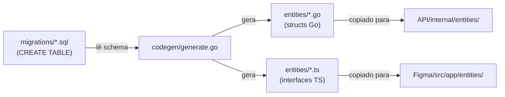
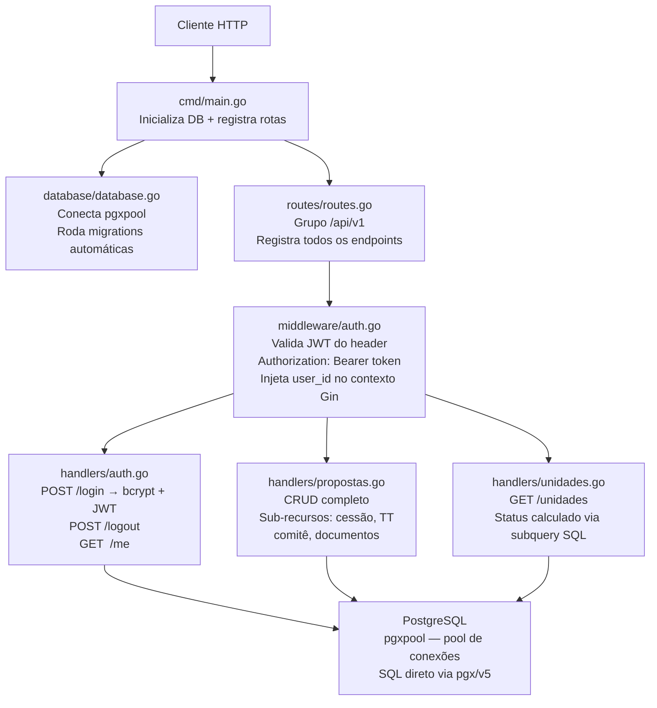
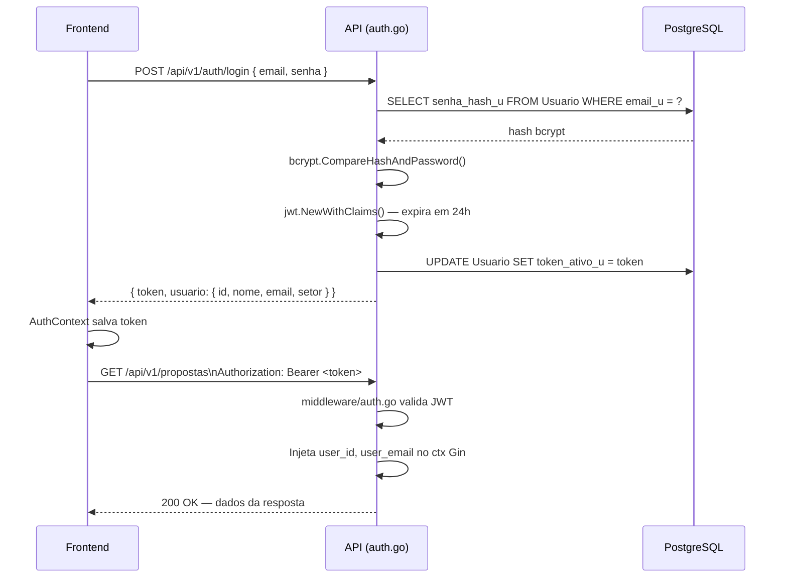
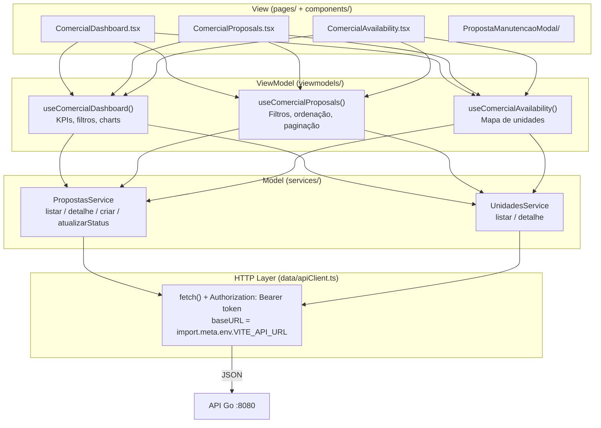
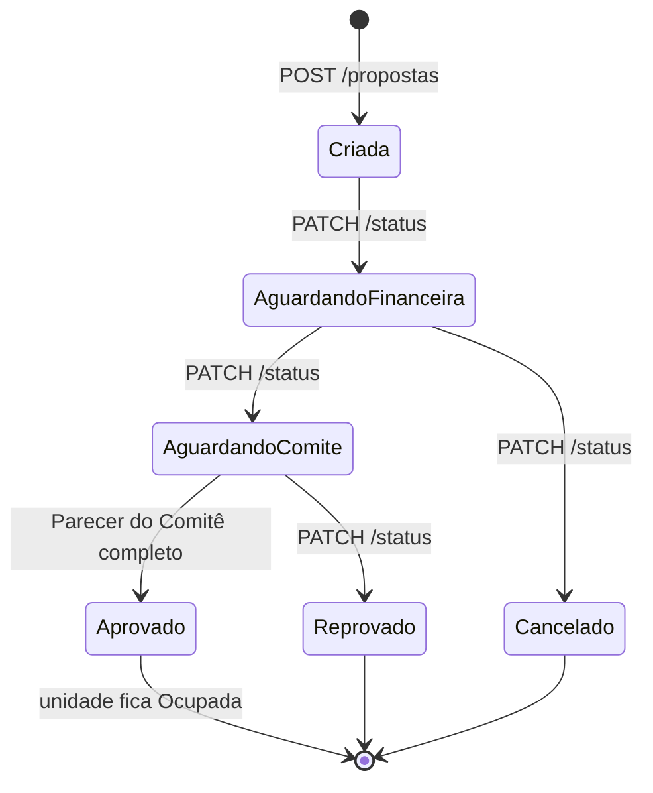
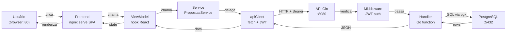

# 🏗️ Arquitetura do Projeto Flamboyant

> Documento gerado automaticamente a partir do código-fonte. Explica o fluxo completo, a ordem de execução e como cada camada se conecta.

---

## 1. Visão Geral das Camadas

```
┌─────────────────────────────────────────────────────────┐
│                  docker-compose.yml                      │
│  ┌──────────────┐  ┌───────────────┐  ┌──────────────┐ │
│  │  postgres:16  │  │  API (Go/Gin) │  │  Frontend    │ │
│  │  porta 5432   │◄─│  porta 8080   │◄─│  nginx :80   │ │
│  └──────────────┘  └───────────────┘  └──────────────┘ │
└─────────────────────────────────────────────────────────┘
         ▲                   ▲
         │                   │
    migrations SQL      codegen/generate.go
    (fonte da verdade)  (gera structs .go e .ts)
```

O projeto é dividido em três serviços Docker orquestrados pelo `docker-compose.yml`:

| Serviço    | Tecnologia            | Porta | Papel                                      |
|------------|-----------------------|-------|--------------------------------------------|
| `postgres` | PostgreSQL 16 Alpine  | 5432  | Banco de dados relacional                  |
| `api`      | Go 1.23 + Gin         | 8080  | REST API com autenticação JWT              |
| `frontend` | React/Vite + nginx    | 80    | SPA servida como estática via nginx        |

---

## 2. Geração Automática de Entidades (Codegen)

O projeto possui um mecanismo que **garante que Go e TypeScript nunca fiquem dessincronizados**:



**Como rodar:**
```powershell
# Na raiz do projeto
.\ajustar entidades via migration.ps1
```

**Por que isso existe?**  
Cada `CREATE TABLE` nas migrations é a única fonte da verdade. O codegen lê o SQL, extrai os campos e tipos, e gera structs Go e interfaces TypeScript espelhados. Nunca edite os arquivos `entities/` manualmente — eles têm o comentário `// Code generated — DO NOT EDIT`.

---

## 3. Fluxo de uma Requisição na API (Go/Gin)



**Ordem de inicialização no `main.go`:**
1. Carrega variáveis de ambiente (`config/config.go`)
2. Conecta ao PostgreSQL via `pgxpool`
3. Executa migrations pendentes via `golang-migrate`
4. Cria os handlers (`AuthHandler`, `PropostasHandler`, `UnidadesHandler`)
5. Registra todas as rotas no Gin
6. Sobe o servidor HTTP na porta configurada

---

## 4. Autenticação JWT



**Nota sobre o modo protótipo:** O `middleware/auth.go` está atualmente com a validação **desabilitada** — injeta um usuário fixo (`proto-001`) para facilitar o desenvolvimento. Para produção, o comentário no arquivo explica os 6 passos necessários para ativar a validação real.

---

## 5. Arquitetura Frontend — MVVM

O frontend segue o padrão **MVVM (Model-View-ViewModel)** de forma explícita:



**Por que três camadas separadas?**

- **View** não sabe de HTTP — só recebe dados e dispara eventos
- **ViewModel** contém toda a lógica de negócio do frontend (filtros, cálculos, ordenação). Usa `usePersistedState` para manter filtros no `sessionStorage` entre navegações
- **Service** isola a URL da API — se o endpoint mudar, só o service muda
- **apiClient** é o único ponto que faz `fetch()` real

---

## 6. Como o apiClient se Liga à API

```
VITE_API_URL=http://localhost:8080/api/v1   ← definido no .env
         ↓
Figma/src/vite-env.d.ts declara o tipo
         ↓
data/apiClient.ts usa import.meta.env.VITE_API_URL
         ↓
No build de produção (Figma/Dockerfile):
  nginx serve os arquivos estáticos na porta 80
  as chamadas fetch() vão para http://localhost:8080/api/v1
         ↓
API Go responde com CORS permitindo ALLOWED_ORIGIN=http://localhost
```

**Tipagem ponta a ponta:**  
Os tipos das respostas (`PropostaResumo`, `Unidade`, etc.) em `apiClient.ts` espelham exatamente as structs Go em `entities/responses.go` — garantido pelo codegen.

---

## 7. Ciclo de Vida de uma Proposta



**Sub-recursos de uma proposta** (cada um tem tabela própria + tabela `*Historico`):

| Sub-recurso              | Endpoint                            | Quando ativo               |
|--------------------------|-------------------------------------|----------------------------|
| Loja Proposta            | Dados da proposta principal         | Sempre                     |
| Loja Anterior            | `/propostas/:id/loja-anterior`      | Sempre                     |
| Necessidades Técnicas    | `/propostas/:id/necessidades-tecnicas` | Sempre                  |
| Cessão de Direitos       | `/propostas/:id/cessao`             | tipoOperacao = Cessão/TT   |
| Taxa de Transferência    | `/propostas/:id/taxa-transferencia` | tipoOperacao = Transferência |
| Parecer do Comitê        | `/propostas/:id/parecer-comite`     | Status = Aguardando comitê |
| Documentos (upload)      | `POST /documentos` multipart        | Sempre                     |
| Histórico                | `/propostas/:id/historico`          | Leitura / auditoria        |

---

## 8. Estrutura de Pastas Resumida

```
Projeto-Flamboyant/
├── .env.example              ← variáveis de ambiente necessárias
├── docker-compose.yml        ← orquestração dos 3 serviços
│
├── API/                      ← Backend Go
│   ├── cmd/main.go           ← ponto de entrada: DB + rotas + servidor
│   ├── internal/
│   │   ├── config/           ← lê variáveis de ambiente
│   │   ├── database/         ← pool pgx + golang-migrate
│   │   ├── entities/         ← structs geradas pelo codegen (DO NOT EDIT)
│   │   ├── handlers/         ← lógica HTTP de cada recurso
│   │   ├── middleware/        ← auth JWT
│   │   └── routes/           ← registro de todos os endpoints
│   └── migrations/           ← 000001..000005 SQL up/down
│
├── Figma/                    ← Frontend React/Vite
│   └── src/app/
│       ├── data/             ← apiClient.ts, useApi hook
│       ├── entities/         ← interfaces TS geradas (DO NOT EDIT)
│       ├── services/         ← PropostasService, UnidadesService (Model)
│       ├── viewmodels/       ← hooks com lógica de negócio (ViewModel)
│       ├── pages/comercial/  ← telas do módulo comercial (View)
│       ├── components/       ← componentes reutilizáveis
│       ├── App.tsx           ← roteamento + AuthContext provider
│       └── AuthContext.tsx   ← estado global de autenticação
│
├── codegen/
│   └── generate.go           ← lê migrations SQL, gera .go e .ts
│
├── entities/                 ← fonte intermediária (copiada para API e Figma)
│
└── postman/                  ← coleções, specs OpenAPI, mocks para testes
```

---

## 9. Fluxo Completo de Ponta a Ponta



---

*Gerado a partir do código em `repomix-output.md`. Para manter atualizado, rode o codegen após cada nova migration.*

## 🛠️ Construído com

- [React](https://react.dev) `18.3.1` — Framework principal do frontend
- [Vite](https://vitejs.dev) `6.3.5` — Bundler e servidor de desenvolvimento
- [TypeScript](https://www.typescriptlang.org) — Tipagem estática
- [Tailwind CSS](https://tailwindcss.com) `4.1.12` — Estilização
- [shadcn/ui](https://ui.shadcn.com) + [Radix UI](https://www.radix-ui.com) — Componentes de interface
- [React Router](https://reactrouter.com) `7.13.0` — Roteamento
- [Recharts](https://recharts.org) — Gráficos e visualizações
- [React Hook Form](https://react-hook-form.com) — Gerenciamento de formulários
- [Go](https://go.dev) `1.21+` — Linguagem da API
- [Gin](https://gin-gonic.com) — Framework web para a API
- [Postman](https://www.postman.com) — Testes e documentação da API

---

## ✒️ Autores

- **DanielNovaiz** — [github.com/DanielNovaiz](https://github.com/DanielNovaiz)
- **Felipe Fernandes** — [github.com/FELIIPE505](https://github.com/FELIIPE505)
- **Herlison Silva Assunção** — [github.com/herli-son-ufg](https://github.com/herli-son-ufg)
- **Matheus-slvmr** — [github.com/Matheus-slvmr](https://github.com/Matheus-slvmr)
- **militao-discente** — [github.com/militao-discente](https://github.com/militao-discente)


# Projeto-Flamboyant — Guia de execução com Docker

Este repositório contém:
- `API/`: backend em Go
- `Figma/`: frontend React/Vite
- `docker-compose.yml`: orquestração Docker para PostgreSQL, API e frontend

## Visão geral

A forma recomendada de executar o projeto é usando Docker e Docker Compose. O compose já define:
- um banco PostgreSQL em `postgres:16-alpine`
- a API Go em `API/Dockerfile`
- o frontend estático servido por nginx a partir de `Figma/Dockerfile`

## Requisitos

- Docker instalado
- Docker Compose disponível (`docker compose` ou `docker-compose`)
- Git instalado

> Não é necessário ter Go, Node ou PostgreSQL instalados localmente para rodar o projeto via Docker.

## Passo 1 — Clonar o repositório

```bash
git clone <URL-do-repositório>
cd Projeto-Flamboyant
```

## Passo 2 — Configurar variáveis de ambiente

O compose usa variáveis de ambiente do shell. As principais são:

- `DB_USER` (padrão: `postgres`)
- `DB_PASSWORD` (padrão: `postgres`)
- `DB_NAME` (padrão: `jp-mall`)
- `JWT_SECRET` (obrigatório para a API)
- `SERVER_PORT` (padrão: `8080`)
- `VITE_API_URL` (padrão: `http://localhost:8080/api/v1`)

### Exemplo de arquivo `.env`

Crie um arquivo `.env` na raiz do projeto com:

```env
DB_USER=postgres
DB_PASSWORD=postgres
DB_NAME=jp-mall
JWT_SECRET=uma-chave-secreta
SERVER_PORT=8080
VITE_API_URL=http://localhost:8080/api/v1
```

> Se não houver arquivo `.env`, o compose usará os valores padrão para `DB_USER`, `DB_PASSWORD`, `DB_NAME`, `SERVER_PORT` e `VITE_API_URL`, mas `JWT_SECRET` deverá estar definido no ambiente ou no `.env`.

## Passo 3 — Executar com Docker Compose

No terminal, na pasta raiz do repositório:

```bash
docker compose up --build
```

Isso fará:
- criar/atualizar a imagem do backend Go
- criar/atualizar a imagem do frontend React/Vite
- subir o banco PostgreSQL, o backend e o frontend

## Passo 4 — Verificar se os containers subiram

Os serviços disponíveis são:
- `postgres` → banco de dados PostgreSQL
- `api` → backend Go na porta `8080`
- `frontend` → site na porta `80`

Use este comando para ver o status:

```bash
docker compose ps
```

## Passo 5 — Acessar a aplicação

- Frontend: `http://localhost`
- API: `http://localhost:8080`

### Rotas úteis

- `http://localhost/` — interface React
- `http://localhost:8080/health` — healthcheck da API
- `http://localhost:8080/api/v1` — prefixo da API

## Passo 6 — Parar e remover os containers

Para interromper sem remover volumes:

```bash
docker compose stop
```

Para interromper e remover containers, redes e volumes anônimos:

```bash
docker compose down
```

Para remover também os volumes persistidos do PostgreSQL:

```bash
docker compose down -v
```

## Observações úteis

- A API depende do serviço `postgres` e aguarda o banco estar pronto antes de iniciar.
- O frontend é servido por nginx na porta `80`.
- O compose expõe o PostgreSQL na porta `5432` para acesso local, mas isso não é necessário para o funcionamento da aplicação.

## Debug e desenvolvimento local (opcional)

Se quiser rodar sem Docker, o projeto também pode ser executado localmente:

### Backend local

```bash
cd API
go mod tidy
go run cmd/main.go
```

### Frontend local

```bash
cd Figma
npm install
npm run dev
```

## Problemas comuns

- `docker compose` não encontrado: instale Docker Desktop ou Docker Engine com Compose.
- `JWT_SECRET` não definido: defina no `.env` ou no ambiente do Docker.
- Porta `80` em uso: pare o serviço local que usa porta 80 ou altere o bind port em `docker-compose.yml`.
- Erro de conexão com PostgreSQL: confira `DB_USER`, `DB_PASSWORD` e `DB_NAME` no `.env`.

## Mais informações

- `docker-compose.yml` configura os serviços `postgres`, `api` e `frontend`
- `API/Dockerfile` constrói o backend Go
- `Figma/Dockerfile` constrói o frontend React e serve via nginx

## 🏗️ Arquitetura e Modelo C4 (C4 Model)

O sistema segue o padrão **C4 Model** para documentação arquitetural, dividindo a complexidade do ecossistema em níveis crescentes de detalhe. Abaixo estão os diagramas de contexto, contentores e componentes do **Projeto Flamboyant**.

---

### 🌍 Nível 1: Diagrama de Contexto de Sistema (System Context)

O diagrama de contexto apresenta uma visão macro, destacando as interações fundamentais entre os utilizadores comerciais e o ecossistema do sistema, sem entrar em pormenores tecnológicos.

```mermaid
C4Context
    title Diagrama de Contexto de Sistema - Projeto Flamboyant
    
    Person(user, "Usuário Comercial", "Gerentes comerciais, administradores e equipa de locação do JP Mall.")
    System(sys, "Projeto Flamboyant", "Plataforma centralizada de gestão de propostas comerciais, disponibilidade física das unidades do shopping e geração de relatórios gerenciais.")
    
    Rel(user, sys, "Gerencia unidades, cria propostas, elabora contratos e acede a dashboards", "HTTPS")
---

