# C4 Model — Projeto Flamboyant
> Sistema de Gestão de Propostas Comerciais do Shopping Flamboyant

**Versão:** 1.0  
**Data:** Junho 2026  
**Autores:** Equipe Projeto Flamboyant (UFG — BES-2026)  
**Baseado em:** [C4 Model](https://c4model.com) por Simon Brown

---

## Sumário

1. [Diagrama de Contexto do Sistema](#1-diagrama-de-contexto-do-sistema)
2. [Diagrama de Contêiner](#2-diagrama-de-contêiner)
3. [Diagrama de Componentes](#3-diagrama-de-componentes)
4. [Diagrama de Código](#4-diagrama-de-código)
5. [Diagrama da Paisagem do Sistema](#5-diagrama-da-paisagem-do-sistema)
6. [Diagrama Dinâmico](#6-diagrama-dinâmico)
7. [Diagrama de Implantação](#7-diagrama-de-implantação)
8. [Notação](#8-notação)
9. [Lista de Verificação de Revisão](#9-lista-de-verificação-de-revisão)
10. [Perguntas Frequentes](#10-perguntas-frequentes)

---

## 1. Diagrama de Contexto do Sistema

> **Nível 1 — Context Diagram**
> 
> O nível mais alto de abstração. Mostra o sistema como uma caixa preta e quem interage com ele.

### Descrição

O **Sistema Flamboyant** é uma plataforma web de gestão de propostas comerciais utilizada pela equipe interna do Shopping Flamboyant. Ele centraliza o ciclo de vida completo de propostas de locação de unidades comerciais — desde a criação até a aprovação ou reprovação pelo comitê.

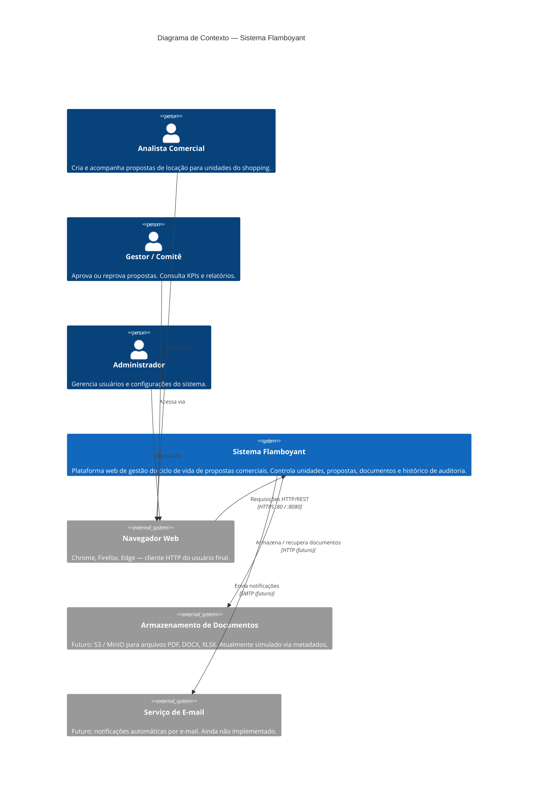

### Atores e Responsabilidades

| Ator | Tipo | Responsabilidades |
|------|------|-------------------|
| Analista Comercial | Usuário Interno | Criar propostas, preencher sub-recursos, anexar documentos, acompanhar status |
| Gestor / Comitê | Usuário Interno | Visualizar KPIs, aprovar/reprovar propostas, registrar parecer do comitê |
| Administrador | Usuário Interno | Criar usuários, gerenciar credenciais |
| Armazenamento de Documentos | Sistema Externo (futuro) | Persistência de arquivos físicos (PDF, DOCX, XLSX, JPG, PNG) |
| Serviço de E-mail | Sistema Externo (futuro) | Notificações de mudança de status |

---

## 2. Diagrama de Contêiner

> **Nível 2 — Container Diagram**
>
> Detalha os contêineres (processos, stores, aplicações) que compõem o sistema e suas comunicações.

### Descrição

O sistema é orquestrado via **Docker Compose** e composto por três contêineres na rede interna `flamboyant-net`:

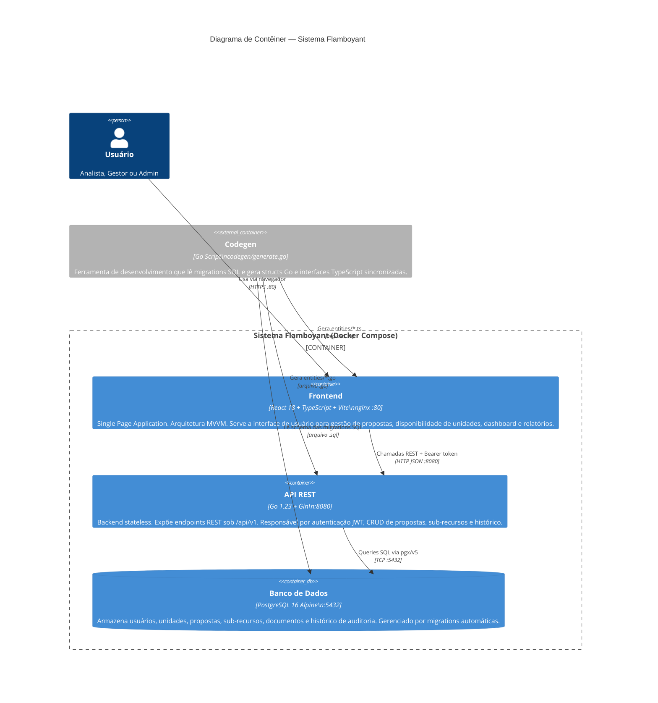

### Tabela de Contêineres

| Contêiner | Tecnologia | Porta | Responsabilidade Principal |
|-----------|-----------|-------|---------------------------|
| `flamboyant-frontend` | React 18, Vite, TypeScript, nginx | 80 | SPA — interface de usuário |
| `flamboyant-api` | Go 1.23, Gin, pgx/v5, golang-migrate | 8080 | API REST — lógica de negócio |
| `flamboyant-postgres` | PostgreSQL 16 Alpine | 5432 | Persistência relacional |
| `codegen` (dev only) | Go script | — | Sincronização de tipos Go ↔ TypeScript |

### Comunicações

| De | Para | Protocolo | Dados |
|----|------|-----------|-------|
| Usuário | Frontend | HTTPS | HTML/JS/CSS |
| Frontend | API | HTTP REST | JSON + `Authorization: Bearer <jwt>` |
| API | PostgreSQL | TCP pgx | SQL + pgxpool |

---

## 3. Diagrama de Componentes

> **Nível 3 — Component Diagram**
>
> Detalha os componentes internos de cada contêiner.

### 3.1 Componentes da API (Go/Gin)

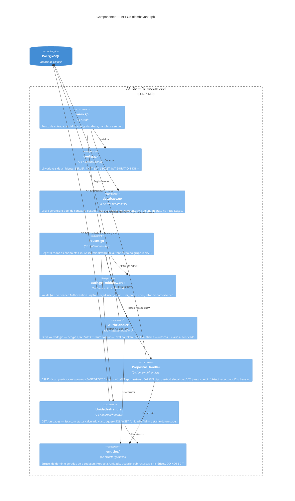

---

### 3.2 Componentes do Frontend (React/TypeScript)

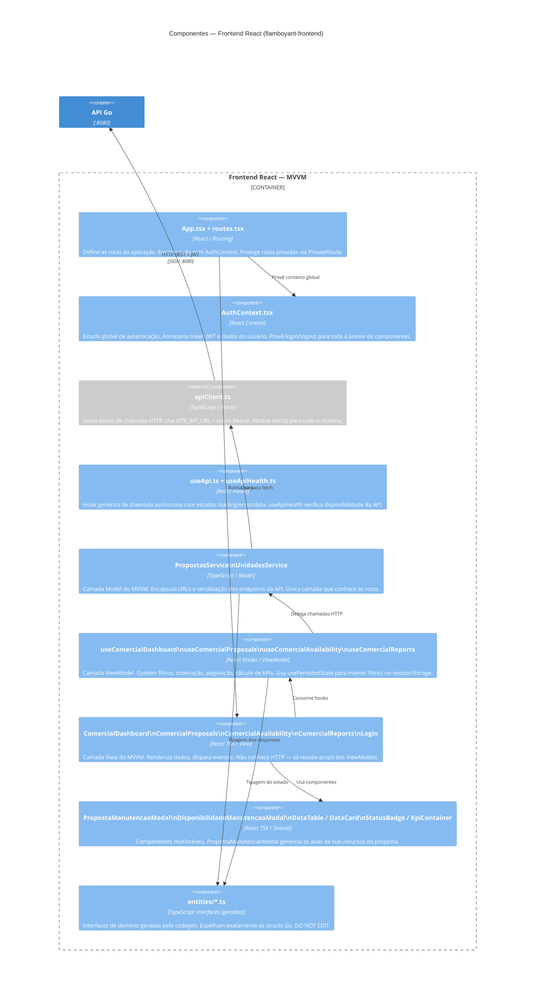

---

### 3.3 Componentes do Banco de Dados (PostgreSQL)

```mermaid

erDiagram
    Usuario {
        UUID id_u PK
        VARCHAR nome_u
        VARCHAR email_u
        VARCHAR senha_hash_u
        VARCHAR setor_u
        VARCHAR token_ativo_u
        TIMESTAMP token_expira_em_u
        TIMESTAMP criado_em_u
    }

    Unidade {
        UUID id_un PK
        VARCHAR codigo_un
        CHAR piso_un
        CHAR corredor_un
        DECIMAL area_un
        TIMESTAMP criado_em_un
    }

    Proposta {
        UUID id_p PK
        UUID id_unidade_p FK
        UUID id_usuario_criacao_p FK
        UUID id_usuario_ultima_alt_p FK
        UUID id_usuario_responsavel_p FK
        VARCHAR segmento_p
        VARCHAR tipo_operacao_p
        DECIMAL valor_proposto_p
        DECIMAL area_p
        VARCHAR status_p
        DATE data_criacao_p
        DATE data_vencimento_p
        VARCHAR nome_fantasia_p
        TIMESTAMP atualizado_em_p
    }

   PropostaLojaAnterior {
        UUID id_proposta_pla PK_FK
        VARCHAR nome_fantasia_pla
        VARCHAR segmento_pla
        DECIMAL cto_pla
        DECIMAL abl_pla
    }

    PropostaNecessidadesTecnicas {
        UUID id_proposta_pnt PK_FK
        DECIMAL demanda_eletrica_kva_pnt
        BOOLEAN ponto_agua_pnt
        BOOLEAN necessita_gas_pnt
        DECIMAL area_minima_m2_pnt
        VARCHAR status_pnt
    }

    PropostaCessaoDireitos {
        UUID id_proposta_pcd PK_FK
        DECIMAL res_sperata_proposta_pcd
        VARCHAR forma_pagamento_saldo_pcd
        VARCHAR status_res_sperata_pcd
    }

    PropostaTaxaTransferencia {
        UUID id_proposta_ptt PK_FK
        DECIMAL tt_contratual_ptt
        DECIMAL tt_proposta_ptt
        VARCHAR status_tt_ptt
    }

    PropostaParecerComite {
        UUID id_proposta_ppc PK_FK
        BOOLEAN presidente_ppc
        BOOLEAN diretoria_comp1_ppc
        BOOLEAN diretoria_comp2_ppc
        BOOLEAN superintendente_ppc
        BOOLEAN in_networking_ppc
    }

    PropostaDocumento {
        UUID id_pd PK
        UUID id_proposta_pd FK
        UUID id_usuario_pd FK
        VARCHAR codigo_pd
        VARCHAR nome_original_pd
        VARCHAR tipo_pd
        VARCHAR url_storage_pd
        TIMESTAMP data_upload_pd
    }

    PropostaHistorico {
        UUID id_ph PK
        UUID id_proposta_ph FK
        UUID id_usuario_ph FK
        TIMESTAMP editado_em_ph
        VARCHAR status_ph
        VARCHAR segmento_ph
        DECIMAL valor_proposto_ph
    }

    Unidade ||--o{ Proposta : "tem"
    Usuario ||--o{ Proposta : "cria"
    Proposta ||--o| PropostaLojaAnterior : "1:1"
    Proposta ||--o| PropostaNecessidadesTecnicas : "1:1"
    Proposta ||--o| PropostaCessaoDireitos : "1:1 (Cessão/TT)"
    Proposta ||--o| PropostaTaxaTransferencia : "1:1 (Transferência)"
    Proposta ||--o| PropostaParecerComite : "1:1 (comitê)"
    Proposta ||--o{ PropostaDocumento : "N documentos"
    Proposta ||--o{ PropostaHistorico : "N snapshots"
    Usuario ||--o{ PropostaDocumento : "faz upload"
    Usuario ||--o{ PropostaHistorico : "registra edição"
```

---

## 4. Diagrama de Código

> **Nível 4 — Code Diagram**
>
> Detalha implementações críticas: estrutura interna de classes/funções, fluxo de dados e padrões usados no código.

### 4.1 Pipeline de Inicialização da API

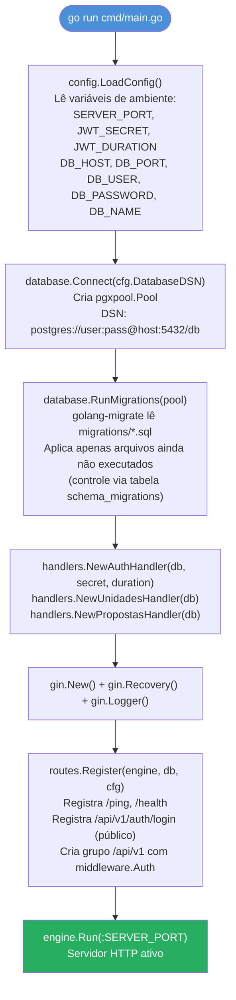

---

### 4.2 Estrutura do AuthHandler (Go)

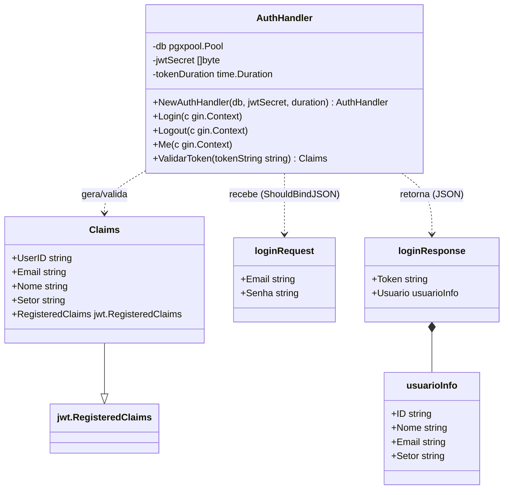

---

### 4.3 Estrutura do AuthContext (TypeScript/React)

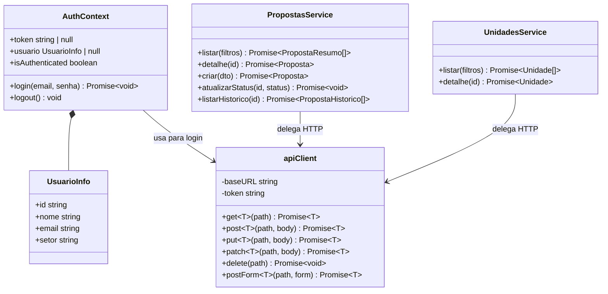

---

### 4.4 Ciclo de Vida do Token JWT

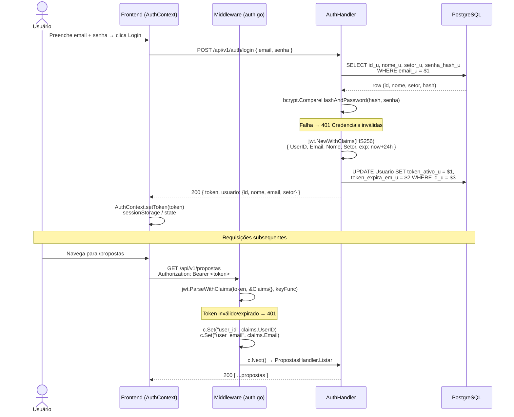

---

### 4.5 Pipeline Codegen — Sincronização de Tipos

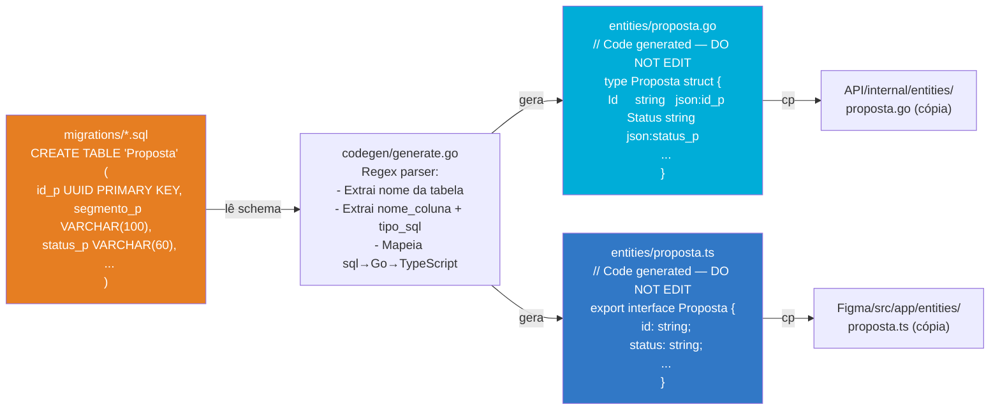

---

## 5. Diagrama da Paisagem do Sistema

> **System Landscape Diagram**
>
> Visão panorâmica do ecossistema completo — múltiplos sistemas e seus relacionamentos. Contextualiza o Flamboyant no universo de sistemas do shopping.

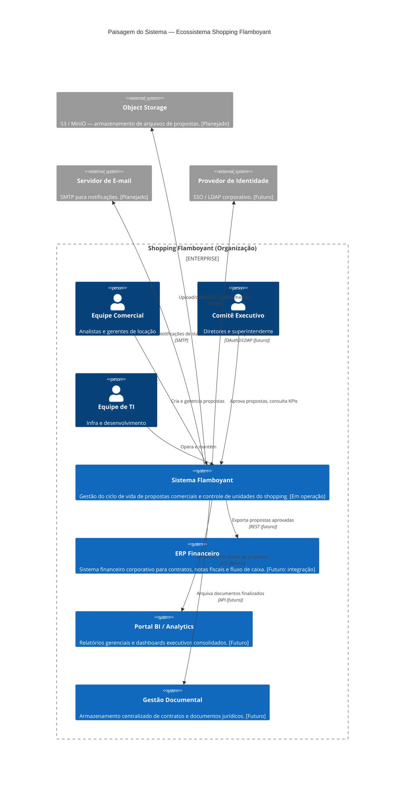

### Estado de Integração

| Sistema Externo | Status | Prioridade | Observação |
|----------------|--------|-----------|------------|
| Object Storage (S3/MinIO) | 🟡 Planejado | Alta | Metadados de documentos já existem no BD |
| Servidor de E-mail | 🟡 Planejado | Média | Notificações de mudança de status |
| ERP Financeiro | 🔴 Futuro | Alta | Exportar propostas aprovadas |
| Portal BI | 🔴 Futuro | Média | Dashboards executivos consolidados |
| Gestão Documental | 🔴 Futuro | Baixa | Arquivo definitivo de contratos |
| Provedor de Identidade | 🔴 Futuro | Alta | SSO corporativo — substituir auth local |

---

## 6. Diagrama Dinâmico

> **Dynamic Diagram**
>
> Cenários de execução em tempo real — sequências de chamadas para os fluxos mais importantes do sistema.

### 6.1 Fluxo Completo: Criar Proposta

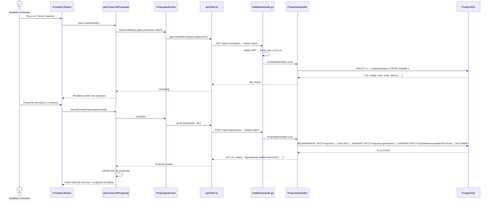

---

### 6.2 Fluxo: Avanço de Status da Proposta

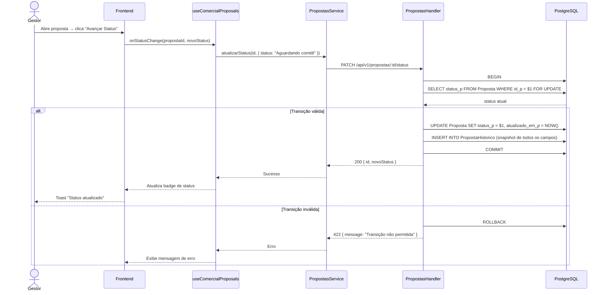

---

### 6.3 Fluxo: Upload de Documento

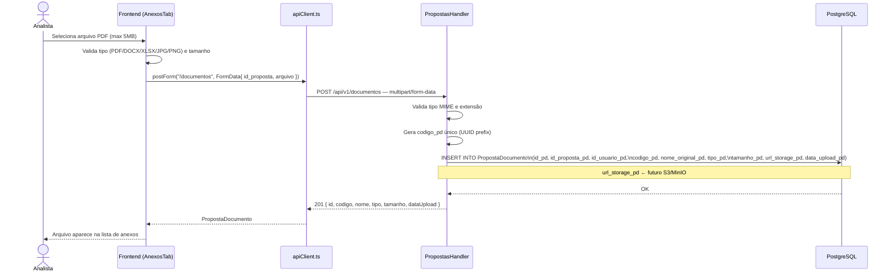

---

### 6.4 Fluxo: Dashboard — Cálculo de KPIs

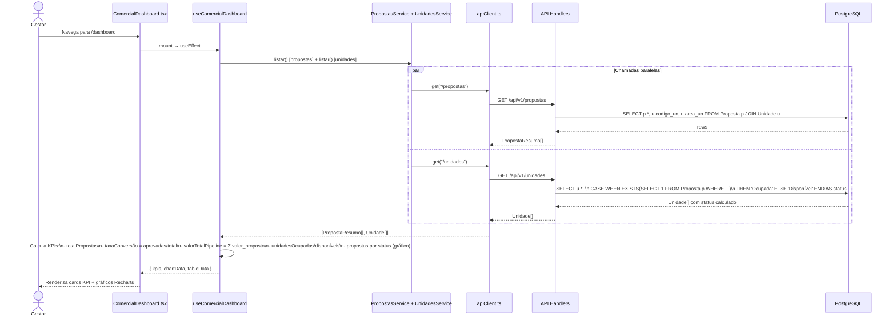

---

## 7. Diagrama de Implantação

> **Deployment Diagram**
>
> Mapeia contêineres para infraestrutura física/virtual. Dois ambientes: desenvolvimento local e produção Docker.

### 7.1 Ambiente de Desenvolvimento Local

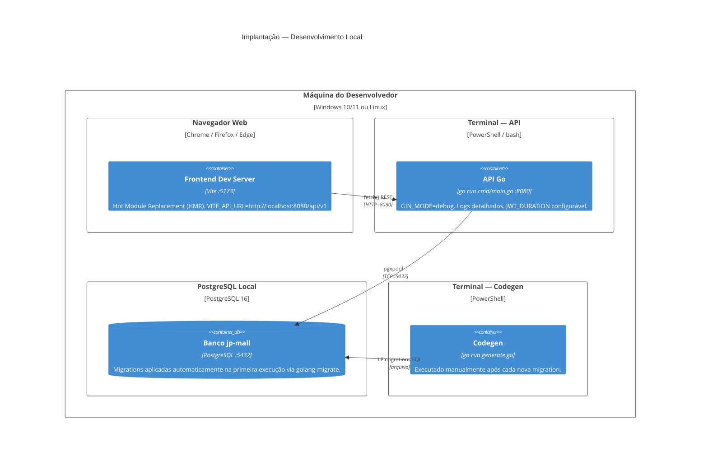

---

### 7.2 Ambiente Docker (Produção / Staging)

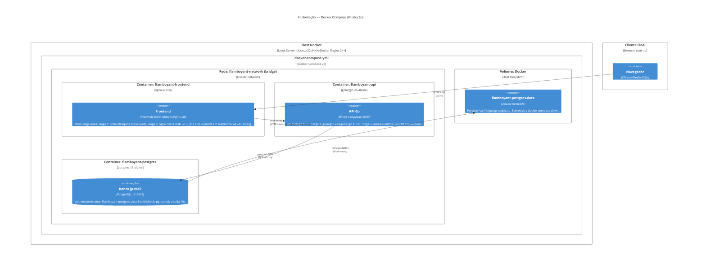

### 7.3 Dependências e Health Checks

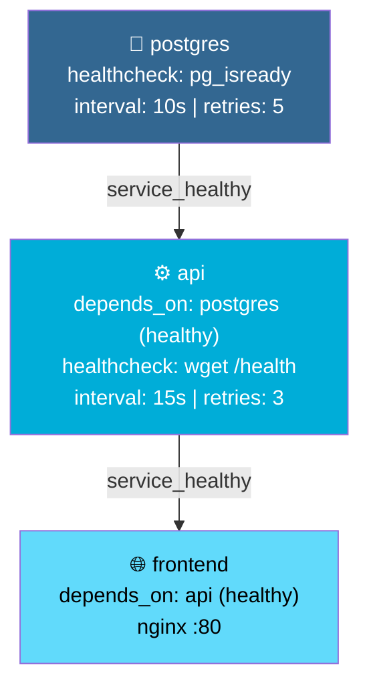

### 7.4 Variáveis de Ambiente por Contêiner

| Variável | Contêiner | Padrão | Descrição |
|----------|-----------|--------|-----------|
| `DB_USER` | api, postgres | `postgres` | Usuário PostgreSQL |
| `DB_PASSWORD` | api, postgres | `postgres` | Senha PostgreSQL |
| `DB_NAME` | api, postgres | `jp-mall` | Nome do banco |
| `JWT_SECRET` | api | — | **Obrigatório.** Chave HMAC-SHA256 |
| `JWT_DURATION` | api | `24h` | Duração do token |
| `SERVER_PORT` | api | `8080` | Porta de escuta |
| `GIN_MODE` | api | `release` | `debug` ou `release` |
| `ALLOWED_ORIGIN` | api | `http://localhost` | CORS origin permitida |
| `VITE_API_URL` | frontend | `http://localhost:8080/api/v1` | Base URL da API (build-arg) |

---

## 8. Notação

> Convenções adotadas neste documento para leitura e manutenção dos diagramas.

### 8.1 Símbolos C4

| Símbolo | Significado |
|---------|------------|
| 🧑 **Person** | Ator humano que interage com o sistema |
| 📦 **System** | Sistema de software completo (nível de contexto) |
| 📦 **Container** | Processo, store ou aplicação executável dentro de um sistema |
| 🔧 **Component** | Agrupamento de código com responsabilidade coesa dentro de um contêiner |
| 🔲 **Class/Interface** | Estrutura de código (nível 4) |
| `[...]` | Relacionamento com tecnologia e protocolo especificados |
| `--` tracejado | Relacionamento futuro / planejado |
| `_Ext` sufixo | Sistema, pessoa ou componente externo ao projeto |

### 8.2 Paleta de Cores

| Cor | Significado |
|-----|------------|
| 🔵 Azul | Sistemas internos / contêineres próprios |
| 🟦 Azul escuro | Banco de dados |
| 🟣 Roxo | Pessoas / usuários |
| ⬜ Cinza | Sistemas externos / fora do escopo |
| 🟡 Amarelo | Planejado / em desenvolvimento |
| 🔴 Vermelho | Não implementado / futuro |
| 🟢 Verde | Implementado e operacional |

### 8.3 Convenções de Nomenclatura

| Escopo | Convenção | Exemplo |
|--------|-----------|---------|
| Tabelas SQL | `PascalCase` com sufixo `_x` nas colunas | `Proposta`, `id_p`, `status_p` |
| Structs Go | `PascalCase` | `PropostasHandler`, `Claims` |
| Interfaces TypeScript | `PascalCase` | `PropostaResumo`, `Unidade` |
| Hooks React | `camelCase` com prefixo `use` | `useComercialDashboard` |
| Services | `PascalCase` + sufixo `Service` | `PropostasService` |
| Endpoints REST | `kebab-case` plural | `/propostas`, `/unidades`, `/cessao-direitos` |
| Variáveis de ambiente | `SCREAMING_SNAKE_CASE` | `JWT_SECRET`, `DB_HOST` |

### 8.4 Status dos Endpoints

| Símbolo | Significado |
|---------|------------|
| ✅ | Implementado e funcional |
| 🚧 | `PlaceholderOK` — rota registrada, retorna 200 vazio |
| 📋 | `PlaceholderList` — rota registrada, retorna `[]` vazio |
| 🔴 | Não implementado (nem placeholder) |

### 8.5 Endpoints por Status

| Endpoint | Método | Status |
|----------|--------|--------|
| `/ping` | GET | ✅ |
| `/health` | GET | ✅ |
| `/api/v1/auth/login` | POST | ✅ |
| `/api/v1/auth/logout` | POST | ✅ |
| `/api/v1/auth/me` | GET | ✅ |
| `/api/v1/unidades` | GET | ✅ |
| `/api/v1/unidades/:id` | GET | ✅ |
| `/api/v1/propostas` | GET | ✅ |
| `/api/v1/propostas/:id` | GET | ✅ |
| `/api/v1/propostas` | POST | ✅ |
| `/api/v1/propostas/:id/status` | PATCH | ✅ |
| `/api/v1/propostas/:id/historico` | GET | ✅ |
| `/api/v1/propostas/:id` | PUT | 🚧 |
| `/api/v1/propostas/check-vencidas` | POST | 🚧 |
| `/api/v1/propostas/:id/loja-anterior` | GET/PUT | 🚧 |
| `/api/v1/propostas/:id/necessidades-tecnicas` | GET/PUT | 🚧 |
| `/api/v1/propostas/:id/cessao-direitos` | GET/PUT | 🚧 |
| `/api/v1/propostas/:id/taxa-transferencia` | GET/PUT | 🚧 |
| `/api/v1/propostas/:id/parecer-comite` | GET/PUT | 🚧 |
| `/api/v1/documentos` | GET | 📋 |
| `/api/v1/documentos` | POST | 🚧 |
| `/api/v1/documentos/:id` | DELETE | 🚧 |

---

## 9. Lista de Verificação de Revisão

> Checklist para uso nas revisões de arquitetura (code review, sprint review, entrega de US).

### 9.1 Contexto e Contêineres

- [ ] Todos os atores que interagem com o sistema estão documentados (Analista, Gestor, Admin)?
- [ ] As três fronteiras de contêiner (frontend, api, postgres) refletem o `docker-compose.yml` atual?
- [ ] Protocolos de comunicação estão especificados (HTTP REST, pgx TCP, Bearer JWT)?
- [ ] Sistemas externos futuros (S3, e-mail, ERP) estão marcados com status correto (planejado/futuro)?
- [ ] Variáveis de ambiente críticas (`JWT_SECRET`, `ALLOWED_ORIGIN`) estão documentadas?

### 9.2 Componentes

- [ ] Todos os handlers Go estão listados (`AuthHandler`, `PropostasHandler`, `UnidadesHandler`)?
- [ ] O fluxo MVVM do frontend (View → ViewModel → Service → apiClient) está correto?
- [ ] O middleware de autenticação está descrito em ambos os lados (Go middleware + AuthContext)?
- [ ] O codegen está representado como ferramenta de desenvolvimento (fora do runtime)?
- [ ] As tabelas de histórico (`PropostaHistorico` e derivadas) aparecem no diagrama de BD?

### 9.3 Código (Nível 4)

- [ ] A sequência de inicialização do `main.go` está na ordem correta (config → db → migrate → handlers → routes → listen)?
- [ ] O ciclo JWT (geração, armazenamento no BD, validação, renovação) está completo?
- [ ] O pipeline codegen (SQL → parse → .go + .ts → cópia) está documentado?
- [ ] O modo protótipo do middleware (usuário fixo `proto-001`) está registrado como dívida técnica?

### 9.4 Dinâmica

- [ ] O fluxo de criação de proposta cobre transação SQL (BEGIN/COMMIT)?
- [ ] O fluxo de avanço de status inclui a inserção no histórico de auditoria?
- [ ] As chamadas paralelas do dashboard (propostas + unidades) estão representadas como `par`?
- [ ] O fluxo de upload de documento menciona que `url_storage_pd` é placeholder?

### 9.5 Implantação

- [ ] Os dois ambientes (dev local e Docker) estão documentados separadamente?
- [ ] A ordem de `depends_on` e health checks (postgres → api → frontend) está correta?
- [ ] O volume `flamboyant-postgres-data` aparece para garantir persistência?
- [ ] Multi-stage build dos Dockerfiles (builder + runtime) está mencionado?

### 9.6 Segurança

- [ ] A validação JWT está desabilitada no middleware (modo protótipo) — registrado como dívida técnica?
- [ ] `bcrypt.CompareHashAndPassword` é usado (e não comparação direta de senhas)?
- [ ] CORS está configurado via `ALLOWED_ORIGIN` (não wildcard em produção)?
- [ ] `JWT_SECRET` não tem valor padrão no `docker-compose.yml` (obriga configuração explícita)?
- [ ] `DB_SSLMODE=disable` — documentado como necessário ativar em produção real?

### 9.7 Dívidas Técnicas Identificadas

| # | Dívida | Arquivo | Impacto |
|---|--------|---------|---------|
| DT-01 | Middleware JWT desabilitado (usuário fixo `proto-001`) | `middleware/auth.go` | Crítico para produção |
| DT-02 | 12+ endpoints como `PlaceholderOK` / `PlaceholderList` | `handlers/propostas.go` | Funcionalidade incompleta |
| DT-03 | `url_storage_pd` não aponta para storage real | `handlers/propostas.go` | Documentos sem arquivo físico |
| DT-04 | `DB_SSLMODE=disable` no compose | `docker-compose.yml` | Dados não criptografados em trânsito |
| DT-05 | Sem rate limiting nos endpoints de auth | `routes/routes.go` | Vulnerável a brute-force |
| DT-06 | Sem paginação server-side no `GET /propostas` | `handlers/propostas.go` | Performance com volume alto |
| DT-07 | Teste unitário único (`sinistros.test.tsx`) | `Figma/src/tests/` | Cobertura de testes insuficiente |

---

## 10. Perguntas Frequentes

### 10.1 Arquitetura Geral

**Por que três contêineres Docker separados e não um monólito?**

A separação em `postgres` + `api` + `frontend` segue o princípio de responsabilidade única no nível de infraestrutura. Cada contêiner pode ser escalado, atualizado e reiniciado independentemente. O frontend pode ser reconstruído sem reiniciar o banco. A API pode ser atualizada sem downtime do banco. Além disso, facilita o workflow de CI/CD onde os três podem ter pipelines distintas.

---

**Por que Go e não Node.js/Python para a API?**

Go foi escolhido por: (1) compilação para binário estático com baixo consumo de memória (~15MB idle vs ~150MB para Node); (2) tipagem estática forte que evita erros em runtime; (3) `pgx/v5` oferece a comunicação mais eficiente disponível com PostgreSQL; (4) `gin` é um dos frameworks HTTP mais rápidos para Go; (5) alinhamento com o aprendizado acadêmico da equipe.

---

**O que é o codegen e por que ele existe?**

O `codegen/generate.go` lê os arquivos `migrations/*.sql` e gera automaticamente structs Go (`entities/*.go`) e interfaces TypeScript (`entities/*.ts`) sincronizadas. Isso elimina a dívida técnica de manter dois conjuntos de tipos manualmente — qualquer alteração no schema SQL propaga-se para ambas as linguagens com um único script. Os arquivos gerados têm o comentário `// Code generated — DO NOT EDIT`.

---

### 10.2 Frontend

**Por que o padrão MVVM e não MVC ou apenas componentes com hooks?**

O MVVM foi escolhido explicitamente para separar três responsabilidades que, misturadas, geram componentes difíceis de testar e manter: (1) **View** — responsável apenas por renderização e eventos; (2) **ViewModel** — lógica de apresentação, filtros, ordenação, paginação, cálculo de KPIs; (3) **Service** — encapsulamento das URLs da API. Se o endpoint `/propostas` mudar, apenas `propostas.service.ts` precisa ser alterado.

---

**O que é `usePersistedState`?**

É um hook customizado que encapsula `sessionStorage`. Quando o usuário navega entre páginas e retorna ao filtro de propostas, os filtros selecionados anteriormente (segmento, status, período) são restaurados automaticamente. Diferente do `localStorage`, o `sessionStorage` é limpo ao fechar a aba, que é o comportamento esperado para filtros de trabalho.

---

**Por que o `apiClient.ts` existe se o `fetch()` poderia ser chamado diretamente nos services?**

O `apiClient` é o único ponto que conhece: a `baseURL` (`VITE_API_URL`), o header `Authorization: Bearer`, e a serialização padrão de erros HTTP. Centralizar isso em um único arquivo significa que: troca de `fetch()` por `axios`, mudança de autenticação para OAuth2, ou adição de retry logic afetam apenas um arquivo.

---

### 10.3 Backend

**Por que SQL direto com `pgx` e não um ORM como GORM?**

`pgx/v5` foi escolhido pelo controle total sobre as queries. As queries do projeto são complexas (subqueries para status calculado de unidades, JOINs com múltiplas tabelas de histórico) — ORMs geram SQL subótimo para esses casos e dificultam o debug. Além disso, `pgxpool` é a forma mais eficiente de gerenciar conexões com PostgreSQL em Go.

---

**Por que `golang-migrate` e não migrations manuais?**

`golang-migrate` executa automaticamente as migrations pendentes na inicialização da API (`database.RunMigrations()`). Isso garante que qualquer novo ambiente (máquina de dev, staging, produção) sempre tenha o schema atualizado sem intervenção manual. A tabela `schema_migrations` controla quais migrations já foram aplicadas.

---

**Como funciona o histórico de auditoria?**

Toda edição de uma proposta gera um snapshot completo na tabela `PropostaHistorico`. Cada snapshot guarda todos os campos da proposta no momento da edição, o `id_usuario_ph` de quem editou, e o timestamp. As tabelas auxiliares (`PropostaLojaAnteriorHistorico`, `PropostaCessaoDireitosHistorico`, etc.) guardam os sub-recursos correspondentes. Isso permite reconstruir qualquer estado passado da proposta.

---

**Qual é o ciclo de vida de uma proposta?**

```
[Criada] → Aguardando análise financeira
         → Aguardando comitê
         → Aprovado  →  Unidade fica Ocupada
         → Reprovado
         → Cancelado
```

As transições são controladas via `PATCH /api/v1/propostas/:id/status`. Cada mudança de status gera um registro no histórico.

---

### 10.4 Implantação e Segurança

**Posso rodar sem Docker?**

Sim. O `start.ps1` (Windows) inicializa a API com `go run cmd/main.go` e o frontend com `npm run dev` (Vite `:5173`). É necessário ter Go 1.21+, Node.js 18+ e PostgreSQL local instalados. Veja `COMO_RODAR_O_PROJETO.txt` para instruções detalhadas.

---

**O que acontece se o `JWT_SECRET` não for definido?**

O `docker-compose.yml` não define valor padrão para `JWT_SECRET` (diferente de `DB_PASSWORD` que tem `postgres`). Se não for definido, a API não consegue assinar tokens e retornará erro 500 em todas as tentativas de login. Isso é intencional — forçar o operador a definir explicitamente o segredo.

---

**Como ativar a validação real do JWT (sair do modo protótipo)?**

O arquivo `middleware/auth.go` tem comentários indicando os 6 passos: (1) descomentar a extração do header `Authorization`; (2) validar formato `Bearer <token>`; (3) chamar `jwt.ParseWithClaims`; (4) verificar expiração; (5) verificar `token_ativo_u` no banco; (6) injetar claims reais no contexto. Atualmente injeta usuário fixo `proto-001` para facilitar o desenvolvimento frontend.

---

**Por que `ALLOWED_ORIGIN` é necessário?**

A API Go configura o middleware CORS do Gin com a origem definida em `ALLOWED_ORIGIN`. Em desenvolvimento (`http://localhost:5173` via Vite) e em Docker (`http://localhost` via nginx), a origem difere. Definir explicitamente evita erros de CORS e impede que outros domínios façam requisições cross-origin para a API em produção.

---

*Documento gerado com base em `repomix-output.md` e `README.md` do repositório `Projeto-Flamboyant` — BES-2026 / UFG.*  
*Para manter este documento atualizado: re-executar análise após cada nova migration ou mudança estrutural.*


## 🛠️ Construído com

- [React](https://react.dev) `18.3.1` — Framework principal do frontend
- [Vite](https://vitejs.dev) `6.3.5` — Bundler e servidor de desenvolvimento
- [TypeScript](https://www.typescriptlang.org) — Tipagem estática
- [Tailwind CSS](https://tailwindcss.com) `4.1.12` — Estilização
- [shadcn/ui](https://ui.shadcn.com) + [Radix UI](https://www.radix-ui.com) — Componentes de interface
- [React Router](https://reactrouter.com) `7.13.0` — Roteamento
- [Recharts](https://recharts.org) — Gráficos e visualizações
- [React Hook Form](https://react-hook-form.com) — Gerenciamento de formulários
- [Go](https://go.dev) `1.21+` — Linguagem da API
- [Gin](https://gin-gonic.com) — Framework web para a API
- [Postman](https://www.postman.com) — Testes e documentação da API

---

## ✒️ Autores

- **DanielNovaiz** — [github.com/DanielNovaiz](https://github.com/DanielNovaiz)
- **Felipe Fernandes** — [github.com/FELIIPE505](https://github.com/FELIIPE505)
- **Herlison Silva Assunção** — [github.com/herli-son-ufg](https://github.com/herli-son-ufg)
- **Matheus-slvmr** — [github.com/Matheus-slvmr](https://github.com/Matheus-slvmr)
- **militao-discente** — [github.com/militao-discente](https://github.com/militao-discente)


# Projeto-Flamboyant — Guia de execução com Docker

Este repositório contém:
- `API/`: backend em Go
- `Figma/`: frontend React/Vite
- `docker-compose.yml`: orquestração Docker para PostgreSQL, API e frontend

## Visão geral

A forma recomendada de executar o projeto é usando Docker e Docker Compose. O compose já define:
- um banco PostgreSQL em `postgres:16-alpine`
- a API Go em `API/Dockerfile`
- o frontend estático servido por nginx a partir de `Figma/Dockerfile`

## Requisitos

- Docker instalado
- Docker Compose disponível (`docker compose` ou `docker-compose`)
- Git instalado

> Não é necessário ter Go, Node ou PostgreSQL instalados localmente para rodar o projeto via Docker.

## Passo 1 — Clonar o repositório

```bash
git clone <URL-do-repositório>
cd Projeto-Flamboyant
```

## Passo 2 — Configurar variáveis de ambiente

O compose usa variáveis de ambiente do shell. As principais são:

- `DB_USER` (padrão: `postgres`)
- `DB_PASSWORD` (padrão: `postgres`)
- `DB_NAME` (padrão: `jp-mall`)
- `JWT_SECRET` (obrigatório para a API)
- `SERVER_PORT` (padrão: `8080`)
- `VITE_API_URL` (padrão: `http://localhost:8080/api/v1`)

### Exemplo de arquivo `.env`

Crie um arquivo `.env` na raiz do projeto com:

```env
DB_USER=postgres
DB_PASSWORD=postgres
DB_NAME=jp-mall
JWT_SECRET=uma-chave-secreta
SERVER_PORT=8080
VITE_API_URL=http://localhost:8080/api/v1
```

> Se não houver arquivo `.env`, o compose usará os valores padrão para `DB_USER`, `DB_PASSWORD`, `DB_NAME`, `SERVER_PORT` e `VITE_API_URL`, mas `JWT_SECRET` deverá estar definido no ambiente ou no `.env`.

## Passo 3 — Executar com Docker Compose

No terminal, na pasta raiz do repositório:

```bash
docker compose up --build
```

Isso fará:
- criar/atualizar a imagem do backend Go
- criar/atualizar a imagem do frontend React/Vite
- subir o banco PostgreSQL, o backend e o frontend

## Passo 4 — Verificar se os containers subiram

Os serviços disponíveis são:
- `postgres` → banco de dados PostgreSQL
- `api` → backend Go na porta `8080`
- `frontend` → site na porta `80`

Use este comando para ver o status:

```bash
docker compose ps
```

## Passo 5 — Acessar a aplicação

- Frontend: `http://localhost`
- API: `http://localhost:8080`

### Rotas úteis

- `http://localhost/` — interface React
- `http://localhost:8080/health` — healthcheck da API
- `http://localhost:8080/api/v1` — prefixo da API

## Passo 6 — Parar e remover os containers

Para interromper sem remover volumes:

```bash
docker compose stop
```

Para interromper e remover containers, redes e volumes anônimos:

```bash
docker compose down
```

Para remover também os volumes persistidos do PostgreSQL:

```bash
docker compose down -v
```

## Observações úteis

- A API depende do serviço `postgres` e aguarda o banco estar pronto antes de iniciar.
- O frontend é servido por nginx na porta `80`.
- O compose expõe o PostgreSQL na porta `5432` para acesso local, mas isso não é necessário para o funcionamento da aplicação.

## Debug e desenvolvimento local (opcional)

Se quiser rodar sem Docker, o projeto também pode ser executado localmente:

### Backend local

```bash
cd API
go mod tidy
go run cmd/main.go
```

### Frontend local

```bash
cd Figma
npm install
npm run dev
```

## Problemas comuns

- `docker compose` não encontrado: instale Docker Desktop ou Docker Engine com Compose.
- `JWT_SECRET` não definido: defina no `.env` ou no ambiente do Docker.
- Porta `80` em uso: pare o serviço local que usa porta 80 ou altere o bind port em `docker-compose.yml`.
- Erro de conexão com PostgreSQL: confira `DB_USER`, `DB_PASSWORD` e `DB_NAME` no `.env`.

## Mais informações

- `docker-compose.yml` configura os serviços `postgres`, `api` e `frontend`
- `API/Dockerfile` constrói o backend Go
- `Figma/Dockerfile` constrói o frontend React e serve via nginx

