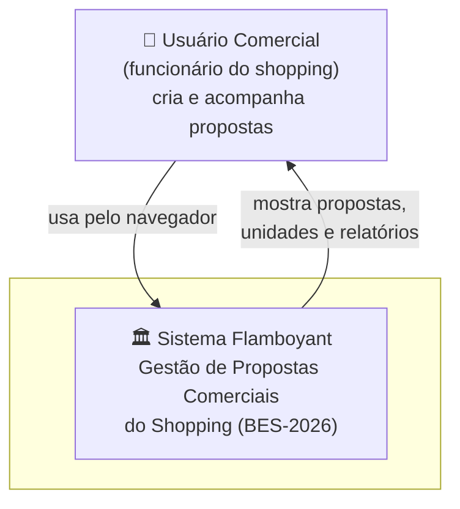
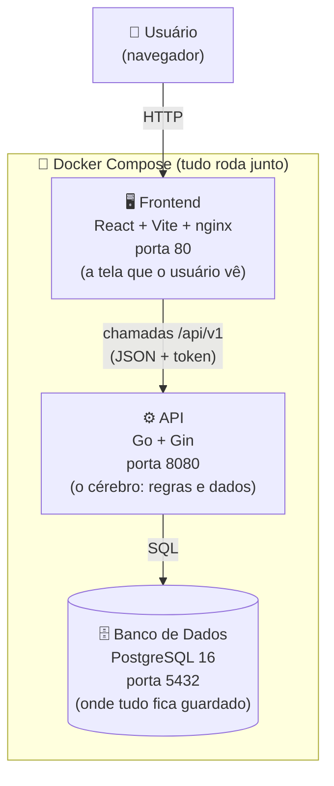
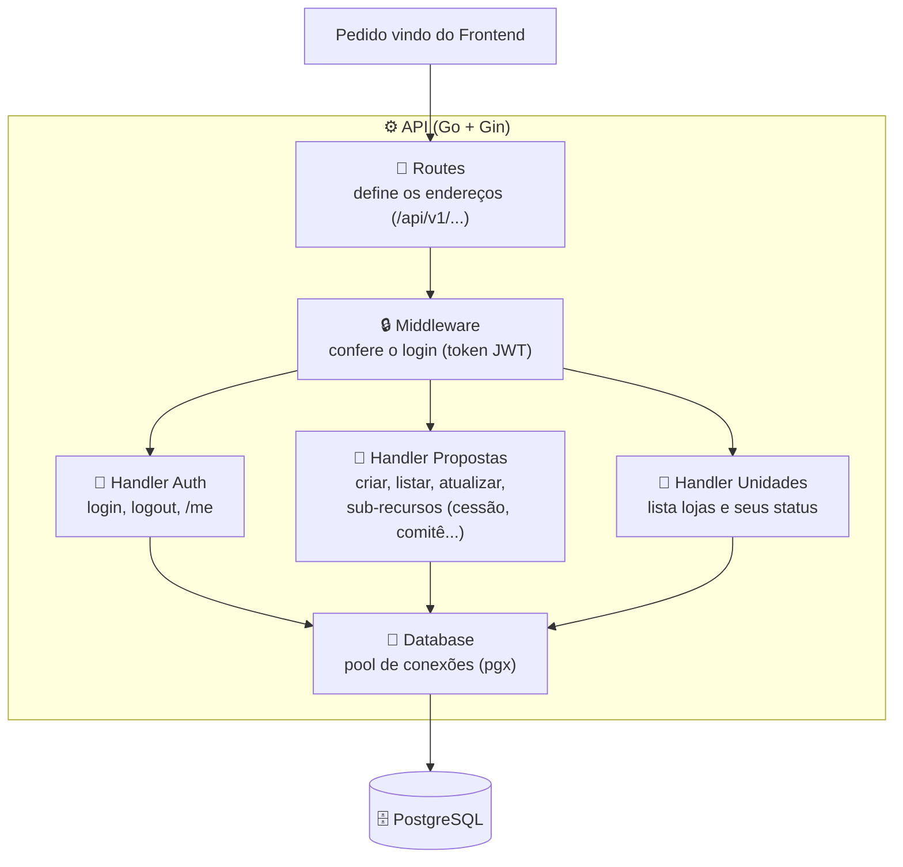
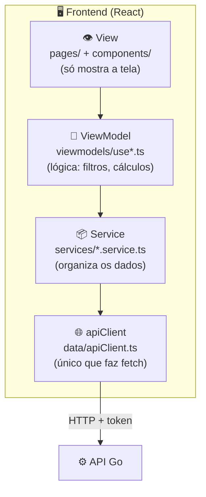
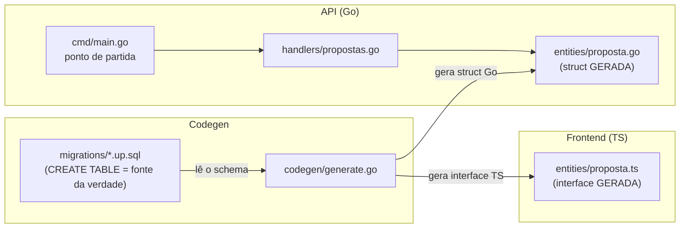
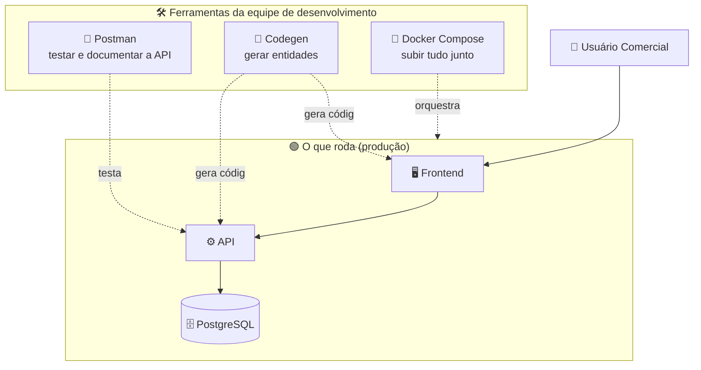
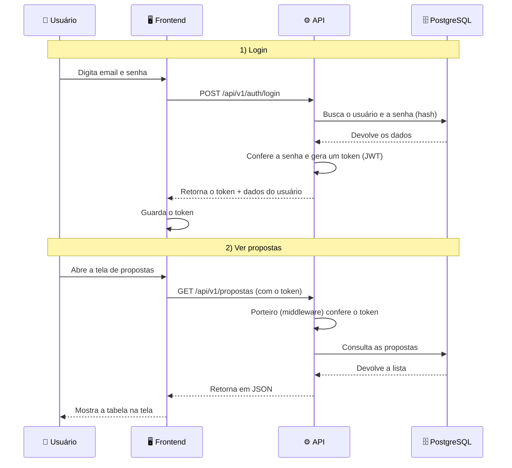
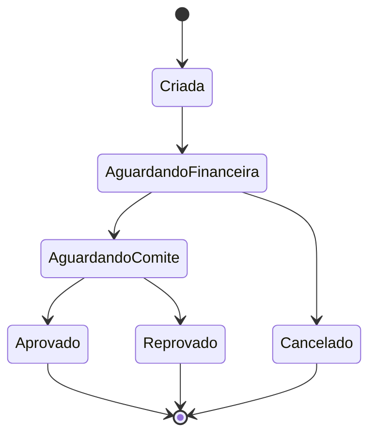
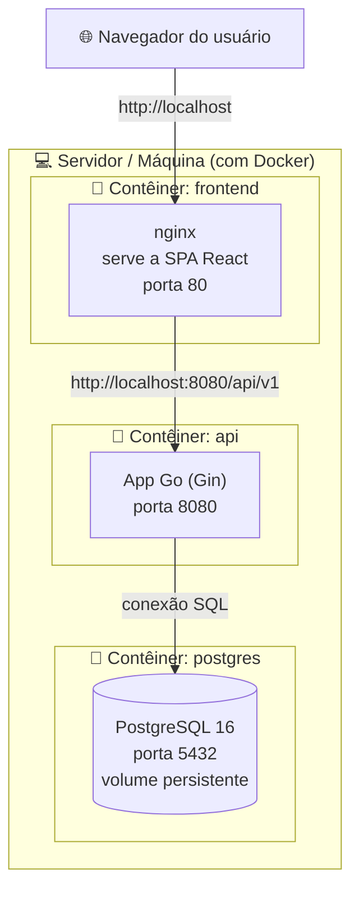

This file is a merged representation of the entire codebase, combined into a single document by Repomix.

# File Summary

## Purpose
This file contains a packed representation of the entire repository's contents.
It is designed to be easily consumable by AI systems for analysis, code review,
or other automated processes.

## File Format
The content is organized as follows:
1. This summary section
2. Repository information
3. Directory structure
4. Repository files (if enabled)
5. Multiple file entries, each consisting of:
  a. A header with the file path (## File: path/to/file)
  b. The full contents of the file in a code block

## Usage Guidelines
- This file should be treated as read-only. Any changes should be made to the
  original repository files, not this packed version.
- When processing this file, use the file path to distinguish
  between different files in the repository.
- Be aware that this file may contain sensitive information. Handle it with
  the same level of security as you would the original repository.

## Notes
- Some files may have been excluded based on .gitignore rules and Repomix's configuration
- Binary files are not included in this packed representation. Please refer to the Repository Structure section for a complete list of file paths, including binary files
- Files matching patterns in .gitignore are excluded
- Files matching default ignore patterns are excluded
- Files are sorted by Git change count (files with more changes are at the bottom)

# Directory Structure
```
.env.example
.gitignore
ajustar entidades via migration.ps1
API/cmd/main.go
API/genhash.go
API/go.mod
API/internal/config/config.go
API/internal/database/database.go
API/internal/entities/doc.go
API/internal/entities/proposta_cessao_direitos_historico.go
API/internal/entities/proposta_cessao_direitos.go
API/internal/entities/proposta_documento_historico.go
API/internal/entities/proposta_documento.go
API/internal/entities/proposta_historico.go
API/internal/entities/proposta_loja_anterior_historico.go
API/internal/entities/proposta_loja_anterior.go
API/internal/entities/proposta_necessidades_tecnicas_historico.go
API/internal/entities/proposta_necessidades_tecnicas.go
API/internal/entities/proposta_parecer_comite_historico.go
API/internal/entities/proposta_parecer_comite.go
API/internal/entities/proposta_taxa_transferencia_historico.go
API/internal/entities/proposta_taxa_transferencia.go
API/internal/entities/proposta.go
API/internal/entities/responses.go
API/internal/entities/unidade.go
API/internal/entities/usuario.go
API/internal/handlers/auth.go
API/internal/handlers/propostas.go
API/internal/handlers/unidades.go
API/internal/middleware/auth.go
API/internal/routes/routes.go
API/migrations/000001_create_tables.down.sql
API/migrations/000001_create_tables.up.sql
API/migrations/000002_seed_usuario_base.down.sql
API/migrations/000002_seed_usuario_base.up.sql
API/migrations/000003_seed_unidades.down.sql
API/migrations/000003_seed_unidades.up.sql
API/migrations/000004_add_token_usuario.down.sql
API/migrations/000004_add_token_usuario.up.sql
API/migrations/000005_seed_propostas.down.sql
API/migrations/000005_seed_propostas.up.sql
API/migrations/000006_update_documento_mime_type.down.sql
API/migrations/000006_update_documento_mime_type.up.sql
API/package.json
API/updatepw.go
codegen/generate.go
codegen/generate.ps1
codegen/go.mod
COMO_RODAR_O_PROJETO.txt
COMO_USAR_DEBUG.txt
debug.ps1
entities/doc.go
entities/index.ts
entities/proposta_cessao_direitos_historico.go
entities/proposta_cessao_direitos_historico.ts
entities/proposta_cessao_direitos.go
entities/proposta_cessao_direitos.ts
entities/proposta_documento_historico.go
entities/proposta_documento_historico.ts
entities/proposta_documento.go
entities/proposta_documento.ts
entities/proposta_historico.go
entities/proposta_historico.ts
entities/proposta_loja_anterior_historico.go
entities/proposta_loja_anterior_historico.ts
entities/proposta_loja_anterior.go
entities/proposta_loja_anterior.ts
entities/proposta_necessidades_tecnicas_historico.go
entities/proposta_necessidades_tecnicas_historico.ts
entities/proposta_necessidades_tecnicas.go
entities/proposta_necessidades_tecnicas.ts
entities/proposta_parecer_comite_historico.go
entities/proposta_parecer_comite_historico.ts
entities/proposta_parecer_comite.go
entities/proposta_parecer_comite.ts
entities/proposta_taxa_transferencia_historico.go
entities/proposta_taxa_transferencia_historico.ts
entities/proposta_taxa_transferencia.go
entities/proposta_taxa_transferencia.ts
entities/proposta.go
entities/proposta.ts
entities/unidade.go
entities/unidade.ts
entities/usuario.go
entities/usuario.ts
Figma/ATTRIBUTIONS.md
Figma/default_shadcn_theme.css
Figma/guidelines/Guidelines.md
Figma/index.html
Figma/nginx.conf
Figma/package.json
Figma/pnpm-workspace.yaml
Figma/postcss.config.mjs
Figma/README.md
Figma/src/app/App.tsx
Figma/src/app/AuthContext.tsx
Figma/src/app/components/ChartsContainer.tsx
Figma/src/app/components/ChartTooltip.tsx
Figma/src/app/components/ConfirmModal.tsx
Figma/src/app/components/DataCard.tsx
Figma/src/app/components/DataCardContainer.tsx
Figma/src/app/components/DataTable.tsx
Figma/src/app/components/DatePickerInput.tsx
Figma/src/app/components/DisponibilidadeManutencaoModal/index.tsx
Figma/src/app/components/DisponibilidadeManutencaoModal/PropostaAtualTab.tsx
Figma/src/app/components/DisponibilidadeManutencaoModal/PropostasVinculadasTab.tsx
Figma/src/app/components/EnumCheckboxFilter.tsx
Figma/src/app/components/KpiContainer.tsx
Figma/src/app/components/Layout.tsx
Figma/src/app/components/ManutencaoShared.tsx
Figma/src/app/components/MobileCarousel.tsx
Figma/src/app/components/PageShared.tsx
Figma/src/app/components/PropostaManutencaoModal/AnexosTab.tsx
Figma/src/app/components/PropostaManutencaoModal/CessaoTab.tsx
Figma/src/app/components/PropostaManutencaoModal/Field.tsx
Figma/src/app/components/PropostaManutencaoModal/HistoricoTab.tsx
Figma/src/app/components/PropostaManutencaoModal/index.tsx
Figma/src/app/components/PropostaManutencaoModal/LojaAnteriorTab.tsx
Figma/src/app/components/PropostaManutencaoModal/LojaPropostaTab.tsx
Figma/src/app/components/PropostaManutencaoModal/NecessidadesTecnicasTab.tsx
Figma/src/app/components/PropostaManutencaoModal/ParecerComiteTab.tsx
Figma/src/app/components/PropostaManutencaoModal/TaxaTransferenciaTab.tsx
Figma/src/app/components/PropostaManutencaoModal/types.ts
Figma/src/app/components/StatusBadge.tsx
Figma/src/app/components/TableProposta.tsx
Figma/src/app/data/apiClient.ts
Figma/src/app/data/useApi.ts
Figma/src/app/data/useApiHealth.ts
Figma/src/app/entities/index.ts
Figma/src/app/entities/proposta_cessao_direitos_historico.ts
Figma/src/app/entities/proposta_cessao_direitos.ts
Figma/src/app/entities/proposta_documento_historico.ts
Figma/src/app/entities/proposta_documento.ts
Figma/src/app/entities/proposta_historico.ts
Figma/src/app/entities/proposta_loja_anterior_historico.ts
Figma/src/app/entities/proposta_loja_anterior.ts
Figma/src/app/entities/proposta_necessidades_tecnicas_historico.ts
Figma/src/app/entities/proposta_necessidades_tecnicas.ts
Figma/src/app/entities/proposta_parecer_comite_historico.ts
Figma/src/app/entities/proposta_parecer_comite.ts
Figma/src/app/entities/proposta_taxa_transferencia_historico.ts
Figma/src/app/entities/proposta_taxa_transferencia.ts
Figma/src/app/entities/proposta.ts
Figma/src/app/entities/unidade.ts
Figma/src/app/entities/usuario.ts
Figma/src/app/enums/index.ts
Figma/src/app/pages/comercial/ComercialAvailability.tsx
Figma/src/app/pages/comercial/ComercialDashboard.tsx
Figma/src/app/pages/comercial/ComercialProposals.tsx
Figma/src/app/pages/comercial/ComercialReports.tsx
Figma/src/app/pages/Login.tsx
Figma/src/app/PrivateRoute.tsx
Figma/src/app/routes.tsx
Figma/src/app/services/index.ts
Figma/src/app/services/propostas.service.ts
Figma/src/app/services/unidades.service.ts
Figma/src/app/shared/hooks/index.ts
Figma/src/app/shared/hooks/usePersistedState.ts
Figma/src/app/shared/utils/filters.ts
Figma/src/app/shared/utils/index.ts
Figma/src/app/utils/manutencao.ts
Figma/src/app/viewmodels/index.ts
Figma/src/app/viewmodels/useComercialAvailability.ts
Figma/src/app/viewmodels/useComercialDashboard.ts
Figma/src/app/viewmodels/useComercialProposals.ts
Figma/src/app/viewmodels/useComercialReports.ts
Figma/src/assets/b02a990bf2c2da1561fd2f42223c5d2ce71ec09a.png
Figma/src/assets/d529125559904c2ba18f90969ebcb78021da0611.png
Figma/src/assets/isotipo_flamboyant.webp
Figma/src/main.tsx
Figma/src/styles/fonts.css
Figma/src/styles/globals.css
Figma/src/styles/index.css
Figma/src/styles/tailwind.css
Figma/src/styles/theme.css
Figma/src/tests/setup.ts
Figma/src/tests/sinistros.test.tsx
Figma/src/vite-env.d.ts
Figma/tsconfig.json
Figma/vite.config.ts
Figma/vitest.config.cjs
index.html
postman/collections/Projeto-Flamboyant/.resources/definition.yaml
postman/collections/Projeto-Flamboyant/Auth/Login.request.yaml
postman/collections/Projeto-Flamboyant/Auth/Logout.request.yaml
postman/collections/Projeto-Flamboyant/Auth/Me.request.yaml
postman/collections/Projeto-Flamboyant/Documentos/Listar Documentos.request.yaml
postman/collections/Projeto-Flamboyant/Documentos/Remover Documento.request.yaml
postman/collections/Projeto-Flamboyant/Documentos/Upload Documento.request.yaml
postman/collections/Projeto-Flamboyant/Health/Ping.request.yaml
postman/collections/Projeto-Flamboyant/Propostas/Atualizar Proposta.request.yaml
postman/collections/Projeto-Flamboyant/Propostas/Atualizar Status.request.yaml
postman/collections/Projeto-Flamboyant/Propostas/Cessao de Direitos/Detalhe Cessao de Direitos.request.yaml
postman/collections/Projeto-Flamboyant/Propostas/Cessao de Direitos/Salvar Cessao de Direitos.request.yaml
postman/collections/Projeto-Flamboyant/Propostas/Check Vencidas.request.yaml
postman/collections/Projeto-Flamboyant/Propostas/Criar Proposta.request.yaml
postman/collections/Projeto-Flamboyant/Propostas/Detalhe Proposta.request.yaml
postman/collections/Projeto-Flamboyant/Propostas/Historico/Listar Historico.request.yaml
postman/collections/Projeto-Flamboyant/Propostas/Listar Propostas.request.yaml
postman/collections/Projeto-Flamboyant/Propostas/Loja Anterior/Detalhe Loja Anterior.request.yaml
postman/collections/Projeto-Flamboyant/Propostas/Loja Anterior/Salvar Loja Anterior.request.yaml
postman/collections/Projeto-Flamboyant/Propostas/Necessidades Tecnicas/Detalhe Necessidades Tecnicas.request.yaml
postman/collections/Projeto-Flamboyant/Propostas/Necessidades Tecnicas/Salvar Necessidades Tecnicas.request.yaml
postman/collections/Projeto-Flamboyant/Propostas/Parecer do Comite/Detalhe Parecer do Comite.request.yaml
postman/collections/Projeto-Flamboyant/Propostas/Parecer do Comite/Salvar Parecer do Comite.request.yaml
postman/collections/Projeto-Flamboyant/Propostas/Taxa de Transferencia/Detalhe Taxa de Transferencia.request.yaml
postman/collections/Projeto-Flamboyant/Propostas/Taxa de Transferencia/Salvar Taxa de Transferencia.request.yaml
postman/collections/Projeto-Flamboyant/Unidades/Detalhe Unidade.request.yaml
postman/collections/Projeto-Flamboyant/Unidades/Listar Unidades.request.yaml
README.md
start.ps1
```

# Files

## File: ajustar entidades via migration.ps1
````powershell
# ============================================================
# ajustar entidades via migration.ps1
# Regenera todas as entidades a partir das migrations SQL.
#
# Uso: rodar na raiz do projeto (Projeto-Flamboyant/)
# ============================================================

$Root = $PSScriptRoot

Write-Host ""
Write-Host "Atualizando entidades a partir das migrations..." -ForegroundColor Cyan
Write-Host "Raiz: $Root" -ForegroundColor Gray
Write-Host ""

Set-Location -Path "$Root\codegen"
go run generate.go $Root

if ($LASTEXITCODE -eq 0) {
    Write-Host ""
    Write-Host "Entidades atualizadas com sucesso!" -ForegroundColor Green
    Write-Host ""
    Write-Host "Arquivos gerados:" -ForegroundColor Gray
    Write-Host "  $Root\entities\*.go e *.ts" -ForegroundColor Gray
    Write-Host "  $Root\API\internal\entities\*.go" -ForegroundColor Gray
    Write-Host "  $Root\Figma\src\app\entities\*.ts" -ForegroundColor Gray
    Write-Host ""
} else {
    Write-Host ""
    Write-Host "Erro ao atualizar entidades." -ForegroundColor Red
    Write-Host "Verifique se o Go esta instalado e a pasta migrations/ existe." -ForegroundColor Red
    exit 1
}
````

## File: API/genhash.go
````go
package main

import (
"fmt"
"golang.org/x/crypto/bcrypt"
)

func main() {
h, _ := bcrypt.GenerateFromPassword([]byte("Admin@2026"), 10)
fmt.Println(string(h))
}
````

## File: API/internal/database/database.go
````go
package database

import (
	"context"
	"fmt"
	"log"
	"time"

	"github.com/jackc/pgx/v5/pgxpool"
	"go-api/internal/config"
)

var DB *pgxpool.Pool

func Connect(cfg *config.DatabaseConfig) (*pgxpool.Pool, error) {
	if err := ensureDatabaseExists(cfg); err != nil {
		return nil, err
	}

	dsn := buildDSN(cfg, cfg.Name)

	poolConfig, err := pgxpool.ParseConfig(dsn)
	if err != nil {
		return nil, fmt.Errorf("erro ao parsear config do banco: %w", err)
	}

	poolConfig.MaxConns = 10
	poolConfig.MinConns = 2
	poolConfig.MaxConnLifetime = time.Hour
	poolConfig.MaxConnIdleTime = 30 * time.Minute
	poolConfig.HealthCheckPeriod = time.Minute

	ctx, cancel := context.WithTimeout(context.Background(), 10*time.Second)
	defer cancel()

	pool, err := pgxpool.NewWithConfig(ctx, poolConfig)
	if err != nil {
		return nil, fmt.Errorf("erro ao criar pool de conexoes: %w", err)
	}

	if err := pool.Ping(ctx); err != nil {
		return nil, fmt.Errorf("erro ao conectar ao banco de dados: %w", err)
	}

	log.Println("Conectado ao PostgreSQL com sucesso")
	DB = pool
	return pool, nil
}

func ensureDatabaseExists(cfg *config.DatabaseConfig) error {
	dsn := buildDSN(cfg, "postgres")

	ctx, cancel := context.WithTimeout(context.Background(), 10*time.Second)
	defer cancel()

	conn, err := pgxpool.New(ctx, dsn)
	if err != nil {
		return fmt.Errorf("erro ao conectar ao postgres para verificar banco: %w", err)
	}
	defer conn.Close()

	var exists bool
	err = conn.QueryRow(ctx,
		"SELECT EXISTS(SELECT 1 FROM pg_database WHERE datname = $1)",
		cfg.Name,
	).Scan(&exists)
	if err != nil {
		return fmt.Errorf("erro ao verificar existencia do banco: %w", err)
	}

	if !exists {
		log.Printf("Banco '%s' nao encontrado — criando...", cfg.Name)
		_, err = conn.Exec(ctx, fmt.Sprintf(`CREATE DATABASE "%s"`, cfg.Name))
		if err != nil {
			return fmt.Errorf("erro ao criar banco '%s': %w", cfg.Name, err)
		}
		log.Printf("Banco '%s' criado com sucesso", cfg.Name)
	} else {
		log.Printf("Banco '%s' encontrado", cfg.Name)
	}

	return nil
}

func buildDSN(cfg *config.DatabaseConfig, dbName string) string {
	return fmt.Sprintf(
		"host=%s port=%s user=%s password=%s dbname=%s sslmode=%s",
		cfg.Host, cfg.Port, cfg.User, cfg.Password, dbName, cfg.SSLMode,
	)
}

func Close() {
	if DB != nil {
		DB.Close()
		log.Println("Conexao com PostgreSQL encerrada")
	}
}
````

## File: API/internal/entities/doc.go
````go
// Package entities contém as structs geradas a partir das migrations do banco de dados.
// NÃO EDITE estes arquivos manualmente — use o codegen:
//
//	go run ./codegen/generate.go
//
// Para gerar automaticamente ao adicionar uma migration:
//
//	go generate ./...
package entities
````

## File: API/internal/entities/responses.go
````go
// ============================================================
// entities/responses.go — Tipos de resposta da API
// ============================================================
//
// Diferença entre entities/*.go (gerado) e responses.go (manual):
//
//  entities/*.go    — espelham EXATAMENTE as colunas do banco,
//                     gerados pelo codegen a partir das migrations.
//                     NÃO devem ser editados manualmente.
//
//  responses.go     — definem o que a API RETORNA ao cliente.
//                     Podem omitir campos sensíveis (ex: senha_hash_u),
//                     renomear campos para camelCase, adicionar campos
//                     calculados (ex: status em UnidadeResponse) ou
//                     aliases de compatibilidade (ex: unidade, tipo).
//
// UnidadeResponse: campos de Unidade + status calculado (Disponível/Ocupado)
// PropostaResponse: campos de Proposta + JOIN com Unidade e Usuário
//                   + aliases 'unidade' e 'tipo' para o frontend legado
// ============================================================
// responses.go — Tipos de resposta da API (derivados das entidades do banco).
// Estes tipos NÃO são gerados pelo codegen — são criados manualmente
// para expor apenas os campos necessários em cada endpoint.
package entities

// UnidadeResponse é a representação de Unidade retornada pela API.
type UnidadeResponse struct {
	ID       string  `json:"id"`
	Codigo   string  `json:"codigo"`
	Piso     string  `json:"piso"`
	Corredor string  `json:"corredor"`
	Area     float64 `json:"area"`
	Status   string  `json:"status"`
	CriadoEm string `json:"criadoEm"`
}

// PropostaResponse é a representação de Proposta retornada pela API.
type PropostaResponse struct {
	ID            string   `json:"id"`
	IDUnidade     string   `json:"idUnidade"`
	CodigoUnidade string   `json:"codigoUnidade"`
	Unidade       string   `json:"unidade"`       // alias de CodigoUnidade
	Piso          string   `json:"piso"`
	Corredor      string   `json:"corredor"`
	Segmento      string   `json:"segmento"`
	TipoOperacao  string   `json:"tipoOperacao"`
	Tipo          string   `json:"tipo"`          // alias de TipoOperacao
	ValorProposto float64  `json:"valorProposto"`
	Area          float64  `json:"area"`
	Status        string   `json:"status"`
	Responsavel   string   `json:"responsavel"`
	NomeFantasia  string   `json:"nomeFantasia"`
	DataCriacao   string   `json:"dataCriacao"`
	AtualizadoEm  string   `json:"atualizadoEm"`
	DataVencimento *string `json:"dataVencimento"`
	FimContrato   *string  `json:"fimContrato"`
}
````

## File: API/internal/handlers/unidades.go
````go
// ============================================================
// handlers/unidades.go — Handlers HTTP para o recurso Unidade
// ============================================================
//
// Listar (GET /api/v1/unidades):
//  Retorna todas as unidades físicas do mall com filtros opcionais
//  por piso, corredor e status.
//  O status (Disponível/Ocupado) é calculado dinamicamente via
//  subquery: verifica se existe alguma Proposta Aprovada vinculada.
//  Filtro de status aplicado em Go (pós-query) para simplicidade.
//
// Detalhe (GET /api/v1/unidades/:id):
//  Retorna uma única unidade com o mesmo cálculo de status.
//
// Os tipos de resposta (UnidadeResponse) estão definidos em
// API/internal/entities/responses.go, separados das entidades
// geradas automaticamente pelo codegen.
// ============================================================
package handlers

import (
	"context"
	"fmt"
	"net/http"

	"github.com/gin-gonic/gin"
	"github.com/jackc/pgx/v5/pgxpool"
	"go-api/internal/entities"
)

type UnidadesHandler struct {
	db *pgxpool.Pool
}

func NewUnidadesHandler(db *pgxpool.Pool) *UnidadesHandler {
	return &UnidadesHandler{db: db}
}

func (h *UnidadesHandler) Listar(c *gin.Context) {
	ctx := context.Background()

	piso     := c.Query("piso")
	corredor := c.Query("corredor")
	status   := c.Query("status")

	query := `
		SELECT
			u.id_un,
			u.codigo_un,
			u.piso_un,
			u.corredor_un,
			u.area_un,
			CASE WHEN EXISTS (
				SELECT 1 FROM "Proposta" p
				WHERE p.id_unidade_p = u.id_un AND p.status_p = 'Aprovado'
			) THEN 'Ocupado' ELSE 'Disponível' END AS status,
			TO_CHAR(u.criado_em_un, 'YYYY-MM-DD"T"HH24:MI:SS"Z"')
		FROM "Unidade" u
		WHERE 1=1`

	args := []any{}
	i := 1

	if piso != "" {
		query += fmt.Sprintf(" AND u.piso_un = $%d", i)
		args = append(args, piso); i++
	}
	if corredor != "" {
		query += fmt.Sprintf(" AND u.corredor_un = $%d", i)
		args = append(args, corredor); i++
	}

	query += " ORDER BY u.codigo_un"

	rows, err := h.db.Query(ctx, query, args...)
	if err != nil {
		c.JSON(http.StatusInternalServerError, gin.H{"message": "Erro ao listar unidades"})
		return
	}
	defer rows.Close()

	result := []entities.UnidadeResponse{}
	for rows.Next() {
		var u entities.UnidadeResponse
		if err := rows.Scan(&u.ID, &u.Codigo, &u.Piso, &u.Corredor, &u.Area, &u.Status, &u.CriadoEm); err != nil {
			continue
		}
		if status == "" || u.Status == status {
			result = append(result, u)
		}
	}

	c.JSON(http.StatusOK, result)
}

func (h *UnidadesHandler) Detalhe(c *gin.Context) {
	ctx := context.Background()
	id := c.Param("id")

	var u entities.UnidadeResponse
	err := h.db.QueryRow(ctx, `
		SELECT u.id_un, u.codigo_un, u.piso_un, u.corredor_un, u.area_un,
			CASE WHEN EXISTS (
				SELECT 1 FROM "Proposta" p
				WHERE p.id_unidade_p = u.id_un AND p.status_p = 'Aprovado'
			) THEN 'Ocupado' ELSE 'Disponível' END,
			TO_CHAR(u.criado_em_un, 'YYYY-MM-DD"T"HH24:MI:SS"Z"')
		FROM "Unidade" u WHERE u.id_un = $1
	`, id).Scan(&u.ID, &u.Codigo, &u.Piso, &u.Corredor, &u.Area, &u.Status, &u.CriadoEm)

	if err != nil {
		c.JSON(http.StatusNotFound, gin.H{"message": "Unidade não encontrada"})
		return
	}

	c.JSON(http.StatusOK, u)
}
````

## File: API/migrations/000002_seed_usuario_base.down.sql
````sql
DELETE FROM "Usuario" WHERE email_u = 'admin@flamboyant.com.br';
````

## File: API/migrations/000002_seed_usuario_base.up.sql
````sql
-- ============================================================
-- BES-2026 | Migration 000002 — Usuário base para testes
-- senha: Admin@2026 (bcrypt hash)
-- ============================================================

INSERT INTO "Usuario" (id_u, nome_u, email_u, senha_hash_u, setor_u, criado_em_u)
VALUES (
    gen_random_uuid(),
    'Administrador',
    'admin@flamboyant.com.br',
    '$2b$10$momwkR6nUluFOdiPYY3VxO9NCcoiAABfkEFjCK3Ga6jGPtEN1bDGu',
    'Comercial',
    NOW()
);
````

## File: API/migrations/000003_seed_unidades.down.sql
````sql
DELETE FROM "Unidade";
````

## File: API/migrations/000003_seed_unidades.up.sql
````sql
-- ============================================================
-- BES-2026 | Migration 000003 — 200 Unidades fictícias
-- 3 pisos (P/S/T) x 5 corredores (A/B/C/D/E) x ~13 unidades
-- ============================================================

INSERT INTO "Unidade" (id_un, codigo_un, piso_un, corredor_un, area_un, criado_em_un) VALUES
    (gen_random_uuid(), 'L1-001', 'P', 'A', 290.00, NOW()),
    (gen_random_uuid(), 'L1-002', 'P', 'A', 218.00, NOW()),
    (gen_random_uuid(), 'L1-003', 'P', 'A', 166.00, NOW()),
    (gen_random_uuid(), 'L1-004', 'P', 'A', 180.00, NOW()),
    (gen_random_uuid(), 'L1-005', 'P', 'A', 100.00, NOW()),
    (gen_random_uuid(), 'L1-006', 'P', 'A', 156.00, NOW()),
    (gen_random_uuid(), 'L1-007', 'P', 'A', 280.00, NOW()),
    (gen_random_uuid(), 'L1-008', 'P', 'A', 260.00, NOW()),
    (gen_random_uuid(), 'L1-009', 'P', 'A', 90.00, NOW()),
    (gen_random_uuid(), 'L1-010', 'P', 'A', 90.00, NOW()),
    (gen_random_uuid(), 'L1-011', 'P', 'A', 117.00, NOW()),
    (gen_random_uuid(), 'L1-012', 'P', 'A', 218.00, NOW()),
    (gen_random_uuid(), 'L1-013', 'P', 'A', 218.00, NOW()),
    (gen_random_uuid(), 'L1-014', 'P', 'A', 650.00, NOW()),
    (gen_random_uuid(), 'L1-015', 'P', 'B', 85.00, NOW()),
    (gen_random_uuid(), 'L1-016', 'P', 'B', 290.00, NOW()),
    (gen_random_uuid(), 'L1-017', 'P', 'B', 85.00, NOW()),
    (gen_random_uuid(), 'L1-018', 'P', 'B', 90.00, NOW()),
    (gen_random_uuid(), 'L1-019', 'P', 'B', 156.00, NOW()),
    (gen_random_uuid(), 'L1-020', 'P', 'B', 80.00, NOW()),
    (gen_random_uuid(), 'L1-021', 'P', 'B', 129.00, NOW()),
    (gen_random_uuid(), 'L1-022', 'P', 'B', 100.00, NOW()),
    (gen_random_uuid(), 'L1-023', 'P', 'B', 90.00, NOW()),
    (gen_random_uuid(), 'L1-024', 'P', 'B', 156.00, NOW()),
    (gen_random_uuid(), 'L1-025', 'P', 'B', 650.00, NOW()),
    (gen_random_uuid(), 'L1-026', 'P', 'B', 800.00, NOW()),
    (gen_random_uuid(), 'L1-027', 'P', 'B', 280.00, NOW()),
    (gen_random_uuid(), 'L1-028', 'P', 'B', 166.00, NOW()),
    (gen_random_uuid(), 'L1-029', 'P', 'C', 166.00, NOW()),
    (gen_random_uuid(), 'L1-030', 'P', 'C', 117.00, NOW()),
    (gen_random_uuid(), 'L1-031', 'P', 'C', 117.00, NOW()),
    (gen_random_uuid(), 'L1-032', 'P', 'C', 148.00, NOW()),
    (gen_random_uuid(), 'L1-033', 'P', 'C', 290.00, NOW()),
    (gen_random_uuid(), 'L1-034', 'P', 'C', 129.00, NOW()),
    (gen_random_uuid(), 'L1-035', 'P', 'C', 68.00, NOW()),
    (gen_random_uuid(), 'L1-036', 'P', 'C', 90.00, NOW()),
    (gen_random_uuid(), 'L1-037', 'P', 'C', 85.00, NOW()),
    (gen_random_uuid(), 'L1-038', 'P', 'C', 148.00, NOW()),
    (gen_random_uuid(), 'L1-039', 'P', 'C', 90.00, NOW()),
    (gen_random_uuid(), 'L1-040', 'P', 'C', 90.00, NOW()),
    (gen_random_uuid(), 'L1-041', 'P', 'C', 290.00, NOW()),
    (gen_random_uuid(), 'L1-042', 'P', 'C', 290.00, NOW()),
    (gen_random_uuid(), 'L1-043', 'P', 'D', 250.00, NOW()),
    (gen_random_uuid(), 'L1-044', 'P', 'D', 89.00, NOW()),
    (gen_random_uuid(), 'L1-045', 'P', 'D', 80.00, NOW()),
    (gen_random_uuid(), 'L1-046', 'P', 'D', 800.00, NOW()),
    (gen_random_uuid(), 'L1-047', 'P', 'D', 85.00, NOW()),
    (gen_random_uuid(), 'L1-048', 'P', 'D', 134.00, NOW()),
    (gen_random_uuid(), 'L1-049', 'P', 'D', 156.00, NOW()),
    (gen_random_uuid(), 'L1-050', 'P', 'D', 77.00, NOW()),
    (gen_random_uuid(), 'L1-051', 'P', 'D', 117.00, NOW()),
    (gen_random_uuid(), 'L1-052', 'P', 'D', 280.00, NOW()),
    (gen_random_uuid(), 'L1-053', 'P', 'D', 250.00, NOW()),
    (gen_random_uuid(), 'L1-054', 'P', 'D', 80.00, NOW()),
    (gen_random_uuid(), 'L1-055', 'P', 'D', 650.00, NOW()),
    (gen_random_uuid(), 'L1-056', 'P', 'D', 129.00, NOW()),
    (gen_random_uuid(), 'L1-057', 'P', 'E', 650.00, NOW()),
    (gen_random_uuid(), 'L1-058', 'P', 'E', 250.00, NOW()),
    (gen_random_uuid(), 'L1-059', 'P', 'E', 260.00, NOW()),
    (gen_random_uuid(), 'L1-060', 'P', 'E', 218.00, NOW()),
    (gen_random_uuid(), 'L1-061', 'P', 'E', 77.00, NOW()),
    (gen_random_uuid(), 'L1-062', 'P', 'E', 650.00, NOW()),
    (gen_random_uuid(), 'L1-063', 'P', 'E', 89.00, NOW()),
    (gen_random_uuid(), 'L1-064', 'P', 'E', 68.00, NOW()),
    (gen_random_uuid(), 'L1-065', 'P', 'E', 134.00, NOW()),
    (gen_random_uuid(), 'L1-066', 'P', 'E', 500.00, NOW()),
    (gen_random_uuid(), 'L1-067', 'P', 'E', 190.00, NOW()),
    (gen_random_uuid(), 'L1-068', 'P', 'E', 148.00, NOW()),
    (gen_random_uuid(), 'L1-069', 'P', 'E', 85.00, NOW()),
    (gen_random_uuid(), 'L1-070', 'P', 'E', 218.00, NOW()),
    (gen_random_uuid(), 'L2-001', 'S', 'A', 290.00, NOW()),
    (gen_random_uuid(), 'L2-002', 'S', 'A', 148.00, NOW()),
    (gen_random_uuid(), 'L2-003', 'S', 'A', 80.00, NOW()),
    (gen_random_uuid(), 'L2-004', 'S', 'A', 190.00, NOW()),
    (gen_random_uuid(), 'L2-005', 'S', 'A', 500.00, NOW()),
    (gen_random_uuid(), 'L2-006', 'S', 'A', 290.00, NOW()),
    (gen_random_uuid(), 'L2-007', 'S', 'A', 290.00, NOW()),
    (gen_random_uuid(), 'L2-008', 'S', 'A', 80.00, NOW()),
    (gen_random_uuid(), 'L2-009', 'S', 'A', 260.00, NOW()),
    (gen_random_uuid(), 'L2-010', 'S', 'A', 180.00, NOW()),
    (gen_random_uuid(), 'L2-011', 'S', 'A', 218.00, NOW()),
    (gen_random_uuid(), 'L2-012', 'S', 'A', 225.00, NOW()),
    (gen_random_uuid(), 'L2-013', 'S', 'A', 500.00, NOW()),
    (gen_random_uuid(), 'L2-014', 'S', 'A', 85.00, NOW()),
    (gen_random_uuid(), 'L2-015', 'S', 'B', 90.00, NOW()),
    (gen_random_uuid(), 'L2-016', 'S', 'B', 148.00, NOW()),
    (gen_random_uuid(), 'L2-017', 'S', 'B', 134.00, NOW()),
    (gen_random_uuid(), 'L2-018', 'S', 'B', 225.00, NOW()),
    (gen_random_uuid(), 'L2-019', 'S', 'B', 180.00, NOW()),
    (gen_random_uuid(), 'L2-020', 'S', 'B', 290.00, NOW()),
    (gen_random_uuid(), 'L2-021', 'S', 'B', 156.00, NOW()),
    (gen_random_uuid(), 'L2-022', 'S', 'B', 68.00, NOW()),
    (gen_random_uuid(), 'L2-023', 'S', 'B', 89.00, NOW()),
    (gen_random_uuid(), 'L2-024', 'S', 'B', 100.00, NOW()),
    (gen_random_uuid(), 'L2-025', 'S', 'B', 85.00, NOW()),
    (gen_random_uuid(), 'L2-026', 'S', 'B', 650.00, NOW()),
    (gen_random_uuid(), 'L2-027', 'S', 'B', 500.00, NOW()),
    (gen_random_uuid(), 'L2-028', 'S', 'B', 117.00, NOW()),
    (gen_random_uuid(), 'L2-029', 'S', 'C', 85.00, NOW()),
    (gen_random_uuid(), 'L2-030', 'S', 'C', 180.00, NOW()),
    (gen_random_uuid(), 'L2-031', 'S', 'C', 650.00, NOW()),
    (gen_random_uuid(), 'L2-032', 'S', 'C', 650.00, NOW()),
    (gen_random_uuid(), 'L2-033', 'S', 'C', 89.00, NOW()),
    (gen_random_uuid(), 'L2-034', 'S', 'C', 400.00, NOW()),
    (gen_random_uuid(), 'L2-035', 'S', 'C', 100.00, NOW()),
    (gen_random_uuid(), 'L2-036', 'S', 'C', 148.00, NOW()),
    (gen_random_uuid(), 'L2-037', 'S', 'C', 250.00, NOW()),
    (gen_random_uuid(), 'L2-038', 'S', 'C', 218.00, NOW()),
    (gen_random_uuid(), 'L2-039', 'S', 'C', 68.00, NOW()),
    (gen_random_uuid(), 'L2-040', 'S', 'C', 218.00, NOW()),
    (gen_random_uuid(), 'L2-041', 'S', 'C', 650.00, NOW()),
    (gen_random_uuid(), 'L2-042', 'S', 'C', 117.00, NOW()),
    (gen_random_uuid(), 'L2-043', 'S', 'D', 156.00, NOW()),
    (gen_random_uuid(), 'L2-044', 'S', 'D', 134.00, NOW()),
    (gen_random_uuid(), 'L2-045', 'S', 'D', 290.00, NOW()),
    (gen_random_uuid(), 'L2-046', 'S', 'D', 650.00, NOW()),
    (gen_random_uuid(), 'L2-047', 'S', 'D', 400.00, NOW()),
    (gen_random_uuid(), 'L2-048', 'S', 'D', 290.00, NOW()),
    (gen_random_uuid(), 'L2-049', 'S', 'D', 218.00, NOW()),
    (gen_random_uuid(), 'L2-050', 'S', 'D', 260.00, NOW()),
    (gen_random_uuid(), 'L2-051', 'S', 'D', 148.00, NOW()),
    (gen_random_uuid(), 'L2-052', 'S', 'D', 218.00, NOW()),
    (gen_random_uuid(), 'L2-053', 'S', 'D', 166.00, NOW()),
    (gen_random_uuid(), 'L2-054', 'S', 'D', 190.00, NOW()),
    (gen_random_uuid(), 'L2-055', 'S', 'D', 218.00, NOW()),
    (gen_random_uuid(), 'L2-056', 'S', 'D', 117.00, NOW()),
    (gen_random_uuid(), 'L2-057', 'S', 'E', 166.00, NOW()),
    (gen_random_uuid(), 'L2-058', 'S', 'E', 260.00, NOW()),
    (gen_random_uuid(), 'L2-059', 'S', 'E', 166.00, NOW()),
    (gen_random_uuid(), 'L2-060', 'S', 'E', 166.00, NOW()),
    (gen_random_uuid(), 'L2-061', 'S', 'E', 90.00, NOW()),
    (gen_random_uuid(), 'L2-062', 'S', 'E', 134.00, NOW()),
    (gen_random_uuid(), 'L2-063', 'S', 'E', 650.00, NOW()),
    (gen_random_uuid(), 'L2-064', 'S', 'E', 166.00, NOW()),
    (gen_random_uuid(), 'L2-065', 'S', 'E', 280.00, NOW()),
    (gen_random_uuid(), 'L2-066', 'S', 'E', 85.00, NOW()),
    (gen_random_uuid(), 'L2-067', 'S', 'E', 90.00, NOW()),
    (gen_random_uuid(), 'L2-068', 'S', 'E', 190.00, NOW()),
    (gen_random_uuid(), 'L2-069', 'S', 'E', 190.00, NOW()),
    (gen_random_uuid(), 'L2-070', 'S', 'E', 129.00, NOW()),
    (gen_random_uuid(), 'L3-001', 'T', 'A', 218.00, NOW()),
    (gen_random_uuid(), 'L3-002', 'T', 'A', 156.00, NOW()),
    (gen_random_uuid(), 'L3-003', 'T', 'A', 218.00, NOW()),
    (gen_random_uuid(), 'L3-004', 'T', 'A', 250.00, NOW()),
    (gen_random_uuid(), 'L3-005', 'T', 'A', 800.00, NOW()),
    (gen_random_uuid(), 'L3-006', 'T', 'A', 180.00, NOW()),
    (gen_random_uuid(), 'L3-007', 'T', 'A', 148.00, NOW()),
    (gen_random_uuid(), 'L3-008', 'T', 'A', 148.00, NOW()),
    (gen_random_uuid(), 'L3-009', 'T', 'A', 80.00, NOW()),
    (gen_random_uuid(), 'L3-010', 'T', 'A', 218.00, NOW()),
    (gen_random_uuid(), 'L3-011', 'T', 'A', 250.00, NOW()),
    (gen_random_uuid(), 'L3-012', 'T', 'A', 225.00, NOW()),
    (gen_random_uuid(), 'L3-013', 'T', 'A', 134.00, NOW()),
    (gen_random_uuid(), 'L3-014', 'T', 'A', 166.00, NOW()),
    (gen_random_uuid(), 'L3-015', 'T', 'B', 180.00, NOW()),
    (gen_random_uuid(), 'L3-016', 'T', 'B', 280.00, NOW()),
    (gen_random_uuid(), 'L3-017', 'T', 'B', 190.00, NOW()),
    (gen_random_uuid(), 'L3-018', 'T', 'B', 148.00, NOW()),
    (gen_random_uuid(), 'L3-019', 'T', 'B', 290.00, NOW()),
    (gen_random_uuid(), 'L3-020', 'T', 'B', 77.00, NOW()),
    (gen_random_uuid(), 'L3-021', 'T', 'B', 117.00, NOW()),
    (gen_random_uuid(), 'L3-022', 'T', 'B', 800.00, NOW()),
    (gen_random_uuid(), 'L3-023', 'T', 'B', 100.00, NOW()),
    (gen_random_uuid(), 'L3-024', 'T', 'B', 250.00, NOW()),
    (gen_random_uuid(), 'L3-025', 'T', 'B', 250.00, NOW()),
    (gen_random_uuid(), 'L3-026', 'T', 'B', 225.00, NOW()),
    (gen_random_uuid(), 'L3-027', 'T', 'B', 400.00, NOW()),
    (gen_random_uuid(), 'L3-028', 'T', 'B', 129.00, NOW()),
    (gen_random_uuid(), 'L3-029', 'T', 'C', 650.00, NOW()),
    (gen_random_uuid(), 'L3-030', 'T', 'C', 280.00, NOW()),
    (gen_random_uuid(), 'L3-031', 'T', 'C', 180.00, NOW()),
    (gen_random_uuid(), 'L3-032', 'T', 'C', 117.00, NOW()),
    (gen_random_uuid(), 'L3-033', 'T', 'C', 117.00, NOW()),
    (gen_random_uuid(), 'L3-034', 'T', 'C', 100.00, NOW()),
    (gen_random_uuid(), 'L3-035', 'T', 'C', 80.00, NOW()),
    (gen_random_uuid(), 'L3-036', 'T', 'C', 500.00, NOW()),
    (gen_random_uuid(), 'L3-037', 'T', 'C', 218.00, NOW()),
    (gen_random_uuid(), 'L3-038', 'T', 'C', 225.00, NOW()),
    (gen_random_uuid(), 'L3-039', 'T', 'C', 117.00, NOW()),
    (gen_random_uuid(), 'L3-040', 'T', 'C', 500.00, NOW()),
    (gen_random_uuid(), 'L3-041', 'T', 'C', 85.00, NOW()),
    (gen_random_uuid(), 'L3-042', 'T', 'C', 90.00, NOW()),
    (gen_random_uuid(), 'L3-043', 'T', 'D', 80.00, NOW()),
    (gen_random_uuid(), 'L3-044', 'T', 'D', 89.00, NOW()),
    (gen_random_uuid(), 'L3-045', 'T', 'D', 180.00, NOW()),
    (gen_random_uuid(), 'L3-046', 'T', 'D', 180.00, NOW()),
    (gen_random_uuid(), 'L3-047', 'T', 'D', 800.00, NOW()),
    (gen_random_uuid(), 'L3-048', 'T', 'D', 80.00, NOW()),
    (gen_random_uuid(), 'L3-049', 'T', 'D', 290.00, NOW()),
    (gen_random_uuid(), 'L3-050', 'T', 'D', 400.00, NOW()),
    (gen_random_uuid(), 'L3-051', 'T', 'D', 650.00, NOW()),
    (gen_random_uuid(), 'L3-052', 'T', 'D', 166.00, NOW()),
    (gen_random_uuid(), 'L3-053', 'T', 'D', 166.00, NOW()),
    (gen_random_uuid(), 'L3-054', 'T', 'D', 156.00, NOW()),
    (gen_random_uuid(), 'L3-055', 'T', 'D', 148.00, NOW()),
    (gen_random_uuid(), 'L3-056', 'T', 'D', 100.00, NOW()),
    (gen_random_uuid(), 'L3-057', 'T', 'E', 129.00, NOW()),
    (gen_random_uuid(), 'L3-058', 'T', 'E', 80.00, NOW()),
    (gen_random_uuid(), 'L3-059', 'T', 'E', 129.00, NOW()),
    (gen_random_uuid(), 'L3-060', 'T', 'E', 90.00, NOW());
````

## File: API/migrations/000004_add_token_usuario.down.sql
````sql
ALTER TABLE "Usuario"
  DROP COLUMN IF EXISTS token_ativo_u,
  DROP COLUMN IF EXISTS token_expira_em_u;

DROP INDEX IF EXISTS idx_usuario_token;
````

## File: API/migrations/000004_add_token_usuario.up.sql
````sql
ALTER TABLE "Usuario"
  ADD COLUMN token_ativo_u     VARCHAR(500),
  ADD COLUMN token_expira_em_u TIMESTAMP;

CREATE INDEX idx_usuario_token ON "Usuario"(token_ativo_u);
````

## File: API/migrations/000005_seed_propostas.down.sql
````sql
-- ============================================================
-- BES-2026 | Migration 000005 DOWN — Remove seed de Propostas
-- As tabelas filhas são removidas em cascata (ON DELETE CASCADE).
-- ============================================================

DELETE FROM "Proposta"
WHERE id_usuario_criacao_p = (
    SELECT id_u FROM "Usuario" WHERE email_u = 'admin@flamboyant.com.br'
);
````

## File: API/migrations/000005_seed_propostas.up.sql
````sql
-- ============================================================
-- BES-2026 | Migration 000005 — Seed de Propostas fictícias
-- Cobre todos os tipos de operação, status e segmentos.
-- Não insere na tabela Usuario.
-- ============================================================

DO $$
DECLARE
  v_usuario_id UUID;

  v_un_l1_001 UUID;
  v_un_l1_015 UUID;
  v_un_l2_001 UUID;
  v_un_l2_015 UUID;
  v_un_l3_001 UUID;
  v_un_l1_030 UUID;
  v_un_l2_030 UUID;
  v_un_l3_020 UUID;
  v_un_l1_050 UUID;
  v_un_l2_050 UUID;

  p1_id  UUID := gen_random_uuid();
  p2_id  UUID := gen_random_uuid();
  p3_id  UUID := gen_random_uuid();
  p4_id  UUID := gen_random_uuid();
  p5_id  UUID := gen_random_uuid();
  p6_id  UUID := gen_random_uuid();
  p7_id  UUID := gen_random_uuid();
  p8_id  UUID := gen_random_uuid();
  p9_id  UUID := gen_random_uuid();
  p10_id UUID := gen_random_uuid();

  ph1a_id UUID := gen_random_uuid();
  ph1b_id UUID := gen_random_uuid();
  ph2a_id UUID := gen_random_uuid();
  ph3a_id UUID := gen_random_uuid();
  ph3b_id UUID := gen_random_uuid();
  ph3c_id UUID := gen_random_uuid();
  ph7a_id UUID := gen_random_uuid();
  ph8a_id UUID := gen_random_uuid();
  ph8b_id UUID := gen_random_uuid();

BEGIN
  SELECT id_u  INTO v_usuario_id  FROM "Usuario"  WHERE email_u   = 'admin@flamboyant.com.br';
  SELECT id_un INTO v_un_l1_001   FROM "Unidade"  WHERE codigo_un = 'L1-001';
  SELECT id_un INTO v_un_l1_015   FROM "Unidade"  WHERE codigo_un = 'L1-015';
  SELECT id_un INTO v_un_l2_001   FROM "Unidade"  WHERE codigo_un = 'L2-001';
  SELECT id_un INTO v_un_l2_015   FROM "Unidade"  WHERE codigo_un = 'L2-015';
  SELECT id_un INTO v_un_l3_001   FROM "Unidade"  WHERE codigo_un = 'L3-001';
  SELECT id_un INTO v_un_l1_030   FROM "Unidade"  WHERE codigo_un = 'L1-030';
  SELECT id_un INTO v_un_l2_030   FROM "Unidade"  WHERE codigo_un = 'L2-030';
  SELECT id_un INTO v_un_l3_020   FROM "Unidade"  WHERE codigo_un = 'L3-020';
  SELECT id_un INTO v_un_l1_050   FROM "Unidade"  WHERE codigo_un = 'L1-050';
  SELECT id_un INTO v_un_l2_050   FROM "Unidade"  WHERE codigo_un = 'L2-050';

  -- ============================================================
  -- Proposta — 10 registros cobrindo todos os status e operações
  -- ============================================================
  INSERT INTO "Proposta" (
    id_p, id_unidade_p, id_usuario_criacao_p, id_usuario_ultima_alt_p, id_usuario_responsavel_p,
    segmento_p, tipo_operacao_p, valor_proposto_p, area_p, abl_p,
    status_p, data_criacao_p, data_vencimento_p, nome_fantasia_p,
    aluguel_percent_p, prazo_locacao_meses_p, aluguel_por_m2_p,
    condominio_aprox_p, fpp_aprox_p,
    inicio_contrato_p, fim_contrato_p, data_inauguracao_p,
    observacoes_p, atualizado_em_p
  ) VALUES
    -- p1: Nova Locação / Moda / Aguardando análise financeira
    (p1_id,  v_un_l1_001, v_usuario_id, v_usuario_id, v_usuario_id,
     'Moda',          'Nova Locação',  18500.00, 290.00, 270.00,
     'Aguardando análise financeira',
     '2026-01-10', '2026-04-10', 'Studio Veste Bem',
     8.5, 36, 63.79, 2100.00, 450.00,
     '2026-06-01', '2029-05-31', '2026-06-15',
     'Loja de moda feminina com proposta inicial.', NOW()),

    -- p2: Transferência / Alimentação / Aguardando análise do comitê
    (p2_id,  v_un_l1_015, v_usuario_id, v_usuario_id, v_usuario_id,
     'Alimentação',   'Transferência', 32000.00, 85.00,  80.00,
     'Aguardando análise do comitê',
     '2026-01-15', '2026-05-15', 'Sabor & Cia',
     9.0, 48, 376.47, 3200.00, 680.00,
     '2026-07-01', '2030-06-30', '2026-07-10',
     'Transferência de fundo de comércio de restaurante.', NOW()),

    -- p3: Cessão / Eletrônicos / Aprovado
    (p3_id,  v_un_l2_001, v_usuario_id, v_usuario_id, v_usuario_id,
     'Eletrônicos',   'Cessão',        55000.00, 290.00, 280.00,
     'Aprovado',
     '2025-11-01', '2026-03-01', 'TechZone Store',
     10.5, 60, 189.66, 4800.00, 950.00,
     '2026-04-01', '2031-03-31', '2026-04-20',
     'Cessão de direitos para loja de eletrônicos.', NOW()),

    -- p4: Renovação / Serviços / Reprovado
    (p4_id,  v_un_l2_015, v_usuario_id, v_usuario_id, v_usuario_id,
     'Serviços',      'Renovação',     7500.00,  90.00,  85.00,
     'Reprovado',
     '2025-10-20', '2026-02-20', 'Fast Photo',
     7.0, 24, 83.33, 1100.00, 220.00,
     '2026-03-01', '2028-02-29', NULL,
     'Renovação reprovada por valores acima do mercado.', NOW()),

    -- p5: Readequação / Esportes / Cancelado
    (p5_id,  v_un_l3_001, v_usuario_id, v_usuario_id, v_usuario_id,
     'Esportes',      'Readequação',   42000.00, 218.00, 210.00,
     'Cancelado',
     '2025-09-05', '2026-01-05', 'MaxSport',
     9.5, 48, 192.66, 3500.00, 720.00,
     NULL, NULL, NULL,
     'Proposta cancelada por desistência do lojista.', NOW()),

    -- p6: Nova Locação / Entretenimento / Vencida
    (p6_id,  v_un_l1_030, v_usuario_id, v_usuario_id, v_usuario_id,
     'Entretenimento','Nova Locação',  28000.00, 117.00, 110.00,
     'Vencida',
     '2025-08-01', '2025-11-01', 'Fun Arena',
     8.0, 36, 239.32, 2600.00, 530.00,
     NULL, NULL, NULL,
     'Proposta vencida sem retorno do interessado.', NOW()),

    -- p7: Transferência / Outros / Finalizado
    (p7_id,  v_un_l2_030, v_usuario_id, v_usuario_id, v_usuario_id,
     'Outros',        'Transferência', 19000.00, 180.00, 170.00,
     'Finalizado',
     '2025-06-10', '2025-10-10', 'Ótica Clareza',
     8.0, 36, 105.56, 2200.00, 460.00,
     '2025-11-01', '2028-10-31', '2025-11-15',
     'Transferência finalizada com sucesso.', NOW()),

    -- p8: Cessão / Moda / Aprovado
    (p8_id,  v_un_l3_020, v_usuario_id, v_usuario_id, v_usuario_id,
     'Moda',          'Cessão',        38000.00, 77.00,  72.00,
     'Aprovado',
     '2025-12-01', '2026-04-01', 'Urban Style',
     11.0, 48, 493.51, 3800.00, 760.00,
     '2026-05-01', '2030-04-30', '2026-05-10',
     'Cessão de boutique de moda urbana.', NOW()),

    -- p9: Renovação / Alimentação / Aguardando análise financeira
    (p9_id,  v_un_l1_050, v_usuario_id, v_usuario_id, v_usuario_id,
     'Alimentação',   'Renovação',     11000.00, 77.00,  72.00,
     'Aguardando análise financeira',
     '2026-02-01', '2026-06-01', 'Café Brasil',
     8.5, 24, 142.86, 1400.00, 290.00,
     '2026-07-01', '2028-06-30', NULL,
     'Renovação de contrato de cafeteria.', NOW()),

    -- p10: Readequação / Serviços / Aguardando análise do comitê
    (p10_id, v_un_l2_050, v_usuario_id, v_usuario_id, v_usuario_id,
     'Serviços',      'Readequação',   22000.00, 260.00, 250.00,
     'Aguardando análise do comitê',
     '2026-01-20', '2026-05-20', 'Beleza Total',
     9.0, 48, 84.62, 3100.00, 620.00,
     '2026-06-01', '2030-05-31', NULL,
     'Readequação de salão de beleza.', NOW());

  -- ============================================================
  -- PropostaLojaAnterior — Transferência e Cessão
  -- ============================================================
  INSERT INTO "PropostaLojaAnterior" (
    id_proposta_pla, nome_fantasia_pla, segmento_pla, tipo_operacao_pla,
    cto_pla, abl_pla, amm_pla,
    divida_amm_pla, divida_negociada_pla, divida_condominio_pla, divida_fpp_pla,
    forma_pagamento_pla
  ) VALUES
    (p2_id, 'Antigo Restaurante Sol', 'Alimentação',  'Transferência',
     280000.00, 80.00,  12500.00, 37500.00, 30000.00,  8000.00, 1200.00, 'À vista'),
    (p3_id, 'ElectroShop',            'Eletrônicos',  'Cessão',
     450000.00, 280.00, 28000.00, 84000.00, 70000.00, 15000.00, 2500.00, 'Parcelado em 6x'),
    (p7_id, 'Ótica Visão',            'Outros',       'Transferência',
     130000.00, 170.00,  8500.00, 25500.00, 20000.00,  5000.00,  900.00, 'À vista'),
    (p8_id, 'Moda Clássica',          'Moda',         'Cessão',
     210000.00, 72.00,  15000.00, 45000.00, 38000.00,  9000.00, 1500.00, 'Parcelado em 4x');

  -- ============================================================
  -- PropostaNecessidadesTecnicas
  -- ============================================================
  INSERT INTO "PropostaNecessidadesTecnicas" (
    id_proposta_pnt,
    demanda_eletrica_kva_pnt, tensao_necessaria_pnt, circuitos_especiais_pnt, obs_eletrica_pnt,
    ponto_agua_pnt, quantidade_pontos_agua_pnt, ponto_esgoto_pnt, vazao_necessaria_lmin_pnt,
    caixa_gordura_pnt, obs_hidraulica_pnt,
    necessita_gas_pnt, tipo_gas_pnt, consumo_gas_m3h_pnt, obs_gas_pnt,
    necessita_exaustao_pnt, vazao_exaustao_m3h_pnt, necessita_make_up_ar_pnt, obs_ventilacao_pnt,
    area_minima_m2_pnt, area_maxima_m2_pnt, pe_direito_minimo_m_pnt,
    carga_piso_kgm2_pnt, necessita_mezanino_pnt, obs_estrutura_pnt,
    frente_minima_m_pnt, tipo_fachada_pnt, comunicacao_visual_led_pnt, obs_fachada_pnt,
    pontos_dados_pnt, necessita_fibra_pnt, obs_telecom_pnt,
    status_pnt, id_usuario_responsavel_pnt, criado_em_pnt, atualizado_em_pnt
  ) VALUES
    -- p1: Nova Locação / Moda
    (p1_id,
     30.00, '220V', FALSE, NULL,
     FALSE, NULL, FALSE, NULL, FALSE, NULL,
     FALSE, NULL, NULL, NULL,
     FALSE, NULL, FALSE, NULL,
     250.00, 320.00, 3.50, 500.00, FALSE, NULL,
     12.00, 'Fechada', TRUE, 'Painel LED de 6m.',
     8, FALSE, NULL,
     'Aprovado', v_usuario_id, NOW(), NOW()),

    -- p3: Cessão / Eletrônicos
    (p3_id,
     75.00, '380V', TRUE, 'Necessita circuito dedicado para servidores.',
     FALSE, NULL, FALSE, NULL, FALSE, NULL,
     FALSE, NULL, NULL, NULL,
     FALSE, NULL, TRUE, 'Renovação de ar para sala de exposição.',
     260.00, 320.00, 3.20, 600.00, FALSE, NULL,
     15.00, 'Aberta', TRUE, 'LED obrigatório por contrato.',
     20, TRUE, 'Fibra para demonstrações ao vivo.',
     'Aprovado', v_usuario_id, NOW(), NOW()),

    -- p5: Readequação / Esportes (cancelado — rascunho)
    (p5_id,
     45.00, '220V', FALSE, NULL,
     FALSE, NULL, FALSE, NULL, FALSE, NULL,
     FALSE, NULL, NULL, NULL,
     FALSE, NULL, FALSE, NULL,
     180.00, 250.00, 3.00, 700.00, FALSE, NULL,
     10.00, 'Fechada', FALSE, NULL,
     6, FALSE, NULL,
     'Rascunho', v_usuario_id, NOW(), NULL),

    -- p8: Cessão / Moda
    (p8_id,
     25.00, '220V', FALSE, NULL,
     FALSE, NULL, FALSE, NULL, FALSE, NULL,
     FALSE, NULL, NULL, NULL,
     FALSE, NULL, FALSE, NULL,
     60.00, 90.00, 3.00, 400.00, FALSE, NULL,
     6.00, 'Fechada', FALSE, NULL,
     4, FALSE, NULL,
     'Aprovado', v_usuario_id, NOW(), NOW()),

    -- p10: Readequação / Serviços (salão de beleza)
    (p10_id,
     50.00, '220V', FALSE, NULL,
     TRUE, 4, TRUE, 8.00, TRUE, 'Caixa de gordura existente a adaptar.',
     FALSE, NULL, NULL, NULL,
     TRUE, 1200.00, FALSE, 'Exaustão para cabines de procedimento.',
     220.00, 290.00, 2.80, 400.00, FALSE, NULL,
     14.00, 'Fechada', FALSE, 'Comunicação visual simples.',
     10, FALSE, NULL,
     'Em análise', v_usuario_id, NOW(), NOW());

  -- ============================================================
  -- PropostaCessaoDireitos — Cessão
  -- ============================================================
  INSERT INTO "PropostaCessaoDireitos" (
    id_proposta_pcd,
    res_sperata_proposta_pcd, referencia_mercado_por_m2_pcd,
    sinal_res_sperata_pcd, forma_pagamento_saldo_pcd, num_parcelas_pcd,
    status_res_sperata_pcd, observacoes_pcd
  ) VALUES
    (p3_id, 550000.00, 1896.55, 110000.00, 'Parcelado', 6,
     'Aprovado', 'Res sperata aprovada pelo comitê.'),
    (p8_id, 380000.00, 4935.06,  76000.00, 'À vista',   NULL,
     'Aprovado', NULL);

  -- ============================================================
  -- PropostaTaxaTransferencia — Transferência
  -- ============================================================
  INSERT INTO "PropostaTaxaTransferencia" (
    id_proposta_ptt,
    tt_contratual_ptt, tt_proposta_ptt, tt_proposta_num_amm_ptt,
    sinal_tt_ptt, forma_pagamento_tt_ptt,
    justificativa_tt_ptt, status_tt_ptt
  ) VALUES
    (p2_id, 37500.00, 30000.00, 2.40, 15000.00, 'Parcelado em 2x',
     'Desconto negociado pela dívida acumulada.', 'Aprovado'),
    (p7_id, 25500.00, 20000.00, 2.35, 10000.00, 'À vista',
     NULL, 'Finalizado');

  -- ============================================================
  -- PropostaParecerComite
  -- ============================================================
  INSERT INTO "PropostaParecerComite" (
    id_proposta_ppc,
    presidente_ppc,        presidente_data_ppc,
    diretoria_comp1_ppc,   diretoria_comp1_data_ppc,
    diretoria_comp2_ppc,   diretoria_comp2_data_ppc,
    superintendente_ppc,   superintendente_data_ppc,
    in_networking_ppc,     in_networking_data_ppc
  ) VALUES
    -- p2: Aguardando análise do comitê (parcialmente assinado)
    (p2_id,  FALSE, NULL,         TRUE, '2026-02-20', FALSE, NULL,        TRUE, '2026-02-18', FALSE, NULL),
    -- p3: Aprovado — todos assinaram
    (p3_id,  TRUE,  '2026-01-15', TRUE, '2026-01-10', TRUE,  '2026-01-12', TRUE, '2026-01-08', TRUE, '2026-01-14'),
    -- p7: Finalizado — maioria assinou
    (p7_id,  TRUE,  '2025-09-10', TRUE, '2025-09-05', TRUE,  '2025-09-07', TRUE, '2025-09-03', FALSE, NULL),
    -- p8: Aprovado — todos assinaram
    (p8_id,  TRUE,  '2026-02-25', TRUE, '2026-02-20', TRUE,  '2026-02-22', TRUE, '2026-02-18', TRUE, '2026-02-24'),
    -- p10: Aguardando análise do comitê (parcialmente assinado)
    (p10_id, FALSE, NULL,         FALSE, NULL,         FALSE, NULL,         TRUE, '2026-03-05', FALSE, NULL);

  -- ============================================================
  -- PropostaDocumento
  -- ============================================================
  INSERT INTO "PropostaDocumento" (
    id_pd, id_proposta_pd, id_usuario_pd,
    codigo_pd, nome_original_pd, tipo_pd, tamanho_pd, url_storage_pd, data_upload_pd
  ) VALUES
    (gen_random_uuid(), p1_id,  v_usuario_id, 'DOC-2026-0001', 'proposta_studio_veste_bem.pdf',   'PDF',  '1.2 MB', NULL, NOW()),
    (gen_random_uuid(), p1_id,  v_usuario_id, 'DOC-2026-0002', 'planta_baixa_l1_001.pdf',         'PDF',  '3.8 MB', NULL, NOW()),
    (gen_random_uuid(), p2_id,  v_usuario_id, 'DOC-2026-0003', 'contrato_transferencia_sabor.pdf', 'PDF',  '2.1 MB', NULL, NOW()),
    (gen_random_uuid(), p2_id,  v_usuario_id, 'DOC-2026-0004', 'laudo_tecnico_l1_015.docx',        'DOCX', '540 KB', NULL, NOW()),
    (gen_random_uuid(), p3_id,  v_usuario_id, 'DOC-2026-0005', 'proposta_techzone_store.pdf',      'PDF',  '2.7 MB', NULL, NOW()),
    (gen_random_uuid(), p3_id,  v_usuario_id, 'DOC-2026-0006', 'analise_financeira_techzone.xlsx',  'XLSX', '980 KB', NULL, NOW()),
    (gen_random_uuid(), p3_id,  v_usuario_id, 'DOC-2026-0007', 'foto_fachada_techzone.jpg',         'JPG',  '4.5 MB', NULL, NOW()),
    (gen_random_uuid(), p7_id,  v_usuario_id, 'DOC-2026-0008', 'contrato_otica_clareza.pdf',        'PDF',  '1.8 MB', NULL, NOW()),
    (gen_random_uuid(), p8_id,  v_usuario_id, 'DOC-2026-0009', 'proposta_urban_style.pdf',          'PDF',  '1.5 MB', NULL, NOW()),
    (gen_random_uuid(), p9_id,  v_usuario_id, 'DOC-2026-0010', 'proposta_cafe_brasil.pdf',          'PDF',  '900 KB', NULL, NOW());

  -- ============================================================
  -- PropostaHistorico — snapshots de p1, p2, p3, p7, p8
  -- ============================================================
  INSERT INTO "PropostaHistorico" (
    id_ph, id_proposta_ph, id_usuario_ph, editado_em_ph,
    codigo_unidade_ph, segmento_ph, tipo_operacao_ph,
    valor_proposto_ph, area_ph, abl_ph,
    status_ph, data_criacao_ph, data_vencimento_ph, nome_fantasia_ph,
    aluguel_percent_ph, prazo_locacao_meses_ph, aluguel_por_m2_ph,
    condominio_aprox_ph, fpp_aprox_ph,
    inicio_contrato_ph, fim_contrato_ph, data_inauguracao_ph,
    observacoes_ph, atualizado_em_snapshot_ph
  ) VALUES
    -- p1-a: valor inicial menor
    (ph1a_id, p1_id, v_usuario_id, NOW() - INTERVAL '10 days',
     'L1-001', 'Moda', 'Nova Locação',
     17000.00, 290.00, 270.00,
     'Aguardando análise financeira', '2026-01-10', '2026-04-10', 'Studio Veste Bem',
     7.5, 36, 58.62, 2100.00, 450.00,
     '2026-06-01', '2029-05-31', '2026-06-15',
     'Versão inicial com valor menor.', NOW() - INTERVAL '10 days'),

    -- p1-b: valor ajustado após negociação
    (ph1b_id, p1_id, v_usuario_id, NOW() - INTERVAL '5 days',
     'L1-001', 'Moda', 'Nova Locação',
     18000.00, 290.00, 270.00,
     'Aguardando análise financeira', '2026-01-10', '2026-04-10', 'Studio Veste Bem',
     8.0, 36, 62.07, 2100.00, 450.00,
     '2026-06-01', '2029-05-31', '2026-06-15',
     'Valor ajustado após negociação preliminar.', NOW() - INTERVAL '5 days'),

    -- p2-a: status antes de envio ao comitê
    (ph2a_id, p2_id, v_usuario_id, NOW() - INTERVAL '15 days',
     'L1-015', 'Alimentação', 'Transferência',
     30000.00, 85.00, 80.00,
     'Aguardando análise financeira', '2026-01-15', '2026-05-15', 'Sabor & Cia',
     8.5, 48, 352.94, 3200.00, 680.00,
     '2026-07-01', '2030-06-30', '2026-07-10',
     'Status inicial antes de envio ao comitê.', NOW() - INTERVAL '15 days'),

    -- p3-a: análise financeira
    (ph3a_id, p3_id, v_usuario_id, NOW() - INTERVAL '60 days',
     'L2-001', 'Eletrônicos', 'Cessão',
     50000.00, 290.00, 280.00,
     'Aguardando análise financeira', '2025-11-01', '2026-03-01', 'TechZone Store',
     10.0, 60, 172.41, 4800.00, 950.00,
     '2026-04-01', '2031-03-31', '2026-04-20',
     'Proposta recebida para análise.', NOW() - INTERVAL '60 days'),

    -- p3-b: enviada ao comitê com valor ajustado
    (ph3b_id, p3_id, v_usuario_id, NOW() - INTERVAL '30 days',
     'L2-001', 'Eletrônicos', 'Cessão',
     52000.00, 290.00, 280.00,
     'Aguardando análise do comitê', '2025-11-01', '2026-03-01', 'TechZone Store',
     10.0, 60, 179.31, 4800.00, 950.00,
     '2026-04-01', '2031-03-31', '2026-04-20',
     'Ajuste de valor após análise financeira.', NOW() - INTERVAL '30 days'),

    -- p3-c: aprovado pelo comitê
    (ph3c_id, p3_id, v_usuario_id, NOW() - INTERVAL '10 days',
     'L2-001', 'Eletrônicos', 'Cessão',
     55000.00, 290.00, 280.00,
     'Aprovado', '2025-11-01', '2026-03-01', 'TechZone Store',
     10.5, 60, 189.66, 4800.00, 950.00,
     '2026-04-01', '2031-03-31', '2026-04-20',
     'Proposta aprovada pelo comitê.', NOW() - INTERVAL '10 days'),

    -- p7-a: estado inicial durante análise financeira
    (ph7a_id, p7_id, v_usuario_id, NOW() - INTERVAL '120 days',
     'L2-030', 'Outros', 'Transferência',
     17500.00, 180.00, 170.00,
     'Aguardando análise financeira', '2025-06-10', '2025-10-10', 'Ótica Clareza',
     7.5, 36, 97.22, 2200.00, 460.00,
     '2025-11-01', '2028-10-31', '2025-11-15',
     'Versão inicial da proposta.', NOW() - INTERVAL '120 days'),

    -- p8-a: análise financeira
    (ph8a_id, p8_id, v_usuario_id, NOW() - INTERVAL '45 days',
     'L3-020', 'Moda', 'Cessão',
     35000.00, 77.00, 72.00,
     'Aguardando análise financeira', '2025-12-01', '2026-04-01', 'Urban Style',
     10.0, 48, 453.90, 3800.00, 760.00,
     '2026-05-01', '2030-04-30', '2026-05-10',
     'Proposta inicial submetida.', NOW() - INTERVAL '45 days'),

    -- p8-b: enviada ao comitê com valor revisado
    (ph8b_id, p8_id, v_usuario_id, NOW() - INTERVAL '20 days',
     'L3-020', 'Moda', 'Cessão',
     37000.00, 77.00, 72.00,
     'Aguardando análise do comitê', '2025-12-01', '2026-04-01', 'Urban Style',
     10.5, 48, 480.52, 3800.00, 760.00,
     '2026-05-01', '2030-04-30', '2026-05-10',
     'Valor revisado após análise financeira.', NOW() - INTERVAL '20 days');

  -- ============================================================
  -- PropostaLojaAnteriorHistorico
  -- ============================================================
  INSERT INTO "PropostaLojaAnteriorHistorico" (
    id_historico_plah,
    nome_fantasia_plah, segmento_plah, tipo_operacao_plah,
    cto_plah, abl_plah, amm_plah,
    divida_amm_plah, divida_negociada_plah, divida_condominio_plah, divida_fpp_plah,
    forma_pagamento_plah
  ) VALUES
    (ph3a_id, 'ElectroShop',  'Eletrônicos', 'Cessão',
     450000.00, 280.00, 26000.00, 78000.00, 68000.00, 14000.00, 2200.00, 'Parcelado em 6x'),
    (ph3b_id, 'ElectroShop',  'Eletrônicos', 'Cessão',
     450000.00, 280.00, 27000.00, 81000.00, 69000.00, 14500.00, 2300.00, 'Parcelado em 6x'),
    (ph3c_id, 'ElectroShop',  'Eletrônicos', 'Cessão',
     450000.00, 280.00, 28000.00, 84000.00, 70000.00, 15000.00, 2500.00, 'Parcelado em 6x'),
    (ph7a_id, 'Ótica Visão',  'Outros',      'Transferência',
     130000.00, 170.00, 7500.00,  22500.00, 18000.00,  4500.00,  800.00, 'À vista'),
    (ph8a_id, 'Moda Clássica','Moda',        'Cessão',
     200000.00, 72.00,  14000.00, 42000.00, 36000.00,  8500.00, 1400.00, 'Parcelado em 4x'),
    (ph8b_id, 'Moda Clássica','Moda',        'Cessão',
     210000.00, 72.00,  15000.00, 45000.00, 38000.00,  9000.00, 1500.00, 'Parcelado em 4x');

  -- ============================================================
  -- PropostaNecessidadesTecnicasHistorico
  -- ============================================================
  INSERT INTO "PropostaNecessidadesTecnicasHistorico" (
    id_historico_pnth,
    demanda_eletrica_kva_pnth, tensao_necessaria_pnth, circuitos_especiais_pnth, obs_eletrica_pnth,
    ponto_agua_pnth, quantidade_pontos_agua_pnth, ponto_esgoto_pnth, vazao_necessaria_lmin_pnth,
    caixa_gordura_pnth, obs_hidraulica_pnth,
    necessita_gas_pnth, tipo_gas_pnth, consumo_gas_m3h_pnth, obs_gas_pnth,
    necessita_exaustao_pnth, vazao_exaustao_m3h_pnth, necessita_make_up_ar_pnth, obs_ventilacao_pnth,
    area_minima_m2_pnth, area_maxima_m2_pnth, pe_direito_minimo_m_pnth,
    carga_piso_kgm2_pnth, necessita_mezanino_pnth, obs_estrutura_pnth,
    frente_minima_m_pnth, tipo_fachada_pnth, comunicacao_visual_led_pnth, obs_fachada_pnth,
    pontos_dados_pnth, necessita_fibra_pnth, obs_telecom_pnth,
    status_pnth, id_usuario_responsavel_pnth, criado_em_pnth, atualizado_em_pnth
  ) VALUES
    -- ph3b: TechZone — necessidades em análise
    (ph3b_id,
     70.00, '380V', TRUE, 'Circuito dedicado para servidores.',
     FALSE, NULL, FALSE, NULL, FALSE, NULL,
     FALSE, NULL, NULL, NULL,
     FALSE, NULL, TRUE, 'Renovação de ar para exposição.',
     260.00, 320.00, 3.20, 600.00, FALSE, NULL,
     15.00, 'Aberta', TRUE, 'LED obrigatório.',
     18, TRUE, 'Fibra para demos.',
     'Em análise', v_usuario_id, NOW() - INTERVAL '30 days', NULL),

    -- ph3c: TechZone — necessidades aprovadas
    (ph3c_id,
     75.00, '380V', TRUE, 'Necessita circuito dedicado para servidores.',
     FALSE, NULL, FALSE, NULL, FALSE, NULL,
     FALSE, NULL, NULL, NULL,
     FALSE, NULL, TRUE, 'Exige renovação de ar para sala de exposição.',
     260.00, 320.00, 3.20, 600.00, FALSE, NULL,
     15.00, 'Aberta', TRUE, 'LED obrigatório por contrato.',
     20, TRUE, 'Fibra para demonstrações ao vivo.',
     'Aprovado', v_usuario_id, NOW() - INTERVAL '10 days', NOW() - INTERVAL '10 days'),

    -- ph8a: Urban Style — rascunho inicial
    (ph8a_id,
     22.00, '220V', FALSE, NULL,
     FALSE, NULL, FALSE, NULL, FALSE, NULL,
     FALSE, NULL, NULL, NULL,
     FALSE, NULL, FALSE, NULL,
     60.00, 90.00, 3.00, 400.00, FALSE, NULL,
     6.00, 'Fechada', FALSE, NULL,
     4, FALSE, NULL,
     'Rascunho', v_usuario_id, NOW() - INTERVAL '45 days', NULL),

    -- ph8b: Urban Style — aprovado
    (ph8b_id,
     25.00, '220V', FALSE, NULL,
     FALSE, NULL, FALSE, NULL, FALSE, NULL,
     FALSE, NULL, NULL, NULL,
     FALSE, NULL, FALSE, NULL,
     60.00, 90.00, 3.00, 400.00, FALSE, NULL,
     6.00, 'Fechada', FALSE, NULL,
     4, FALSE, NULL,
     'Aprovado', v_usuario_id, NOW() - INTERVAL '20 days', NOW() - INTERVAL '20 days');

  -- ============================================================
  -- PropostaCessaoDireitosHistorico
  -- ============================================================
  INSERT INTO "PropostaCessaoDireitosHistorico" (
    id_historico_pcdh,
    res_sperata_proposta_pcdh, referencia_mercado_por_m2_pcdh,
    sinal_res_sperata_pcdh, forma_pagamento_saldo_pcdh, num_parcelas_pcdh,
    status_res_sperata_pcdh, observacoes_pcdh
  ) VALUES
    (ph3a_id, 500000.00, 1724.14, 100000.00, 'Parcelado', 6, 'Em análise', NULL),
    (ph3b_id, 520000.00, 1793.10, 104000.00, 'Parcelado', 6, 'Em análise', 'Revisão de valor pendente.'),
    (ph3c_id, 550000.00, 1896.55, 110000.00, 'Parcelado', 6, 'Aprovado',   'Res sperata aprovada pelo comitê.'),
    (ph8a_id, 350000.00, 4545.45,  70000.00, 'À vista',   NULL, 'Em análise', NULL),
    (ph8b_id, 380000.00, 4935.06,  76000.00, 'À vista',   NULL, 'Aprovado',   NULL);

  -- ============================================================
  -- PropostaTaxaTransferenciaHistorico
  -- ============================================================
  INSERT INTO "PropostaTaxaTransferenciaHistorico" (
    id_historico_ptth,
    tt_contratual_ptth, tt_proposta_ptth, tt_proposta_num_amm_ptth,
    sinal_tt_ptth, forma_pagamento_tt_ptth,
    justificativa_tt_ptth, status_tt_ptth
  ) VALUES
    (ph2a_id, 37500.00, 28000.00, 2.24, 14000.00, 'Parcelado em 2x',
     'Proposta inicial antes de aprovação.', 'Em análise'),
    (ph7a_id, 25500.00, 18000.00, 2.12,  9000.00, 'À vista',
     NULL, 'Em análise');

  -- ============================================================
  -- PropostaParecerComiteHistorico
  -- ============================================================
  INSERT INTO "PropostaParecerComiteHistorico" (
    id_historico_ppch,
    presidente_ppch,      presidente_data_ppch,
    diretoria_comp1_ppch, diretoria_comp1_data_ppch,
    diretoria_comp2_ppch, diretoria_comp2_data_ppch,
    superintendente_ppch, superintendente_data_ppch,
    in_networking_ppch,   in_networking_data_ppch
  ) VALUES
    -- ph3b: comitê em andamento
    (ph3b_id, FALSE, NULL,         TRUE, '2025-12-20', FALSE, NULL,         TRUE, '2025-12-18', FALSE, NULL),
    -- ph3c: comitê completo
    (ph3c_id, TRUE,  '2026-01-15', TRUE, '2026-01-10', TRUE,  '2026-01-12', TRUE, '2026-01-08', TRUE, '2026-01-14'),
    -- ph7a: nenhum membro tinha assinado ainda
    (ph7a_id, FALSE, NULL,         FALSE, NULL,         FALSE, NULL,         FALSE, NULL,         FALSE, NULL),
    -- ph8b: comitê em andamento
    (ph8b_id, FALSE, NULL,         TRUE,  '2026-02-10', FALSE, NULL,         TRUE,  '2026-02-08', FALSE, NULL);

END $$;
````

## File: API/migrations/000006_update_documento_mime_type.down.sql
````sql
-- ============================================================
-- BES-2026 | Migration 000006 DOWN — Restaura restrição antiga de tipo
-- ============================================================

ALTER TABLE "PropostaDocumento"
    ALTER COLUMN tipo_pd TYPE VARCHAR(10);

ALTER TABLE "PropostaDocumento"
    ADD CONSTRAINT "PropostaDocumento_tipo_pd_check"
    CHECK (tipo_pd IN ('PDF', 'DOCX', 'XLSX', 'JPG', 'PNG'));
````

## File: API/migrations/000006_update_documento_mime_type.up.sql
````sql
-- ============================================================
-- BES-2026 | Migration 000006 — Ajusta documentos para MIME types reais
-- ============================================================

DO $$
DECLARE
    constraint_name text;
BEGIN
    SELECT c.conname
    INTO constraint_name
    FROM pg_constraint c
    JOIN pg_class t ON t.oid = c.conrelid
    JOIN pg_attribute a ON a.attrelid = t.oid AND a.attnum = ANY (c.conkey)
    WHERE t.relname = 'PropostaDocumento'
      AND a.attname = 'tipo_pd'
      AND c.contype = 'c'
    LIMIT 1;

    IF constraint_name IS NOT NULL THEN
        EXECUTE format('ALTER TABLE "PropostaDocumento" DROP CONSTRAINT %I', constraint_name);
    END IF;
END $$;

ALTER TABLE "PropostaDocumento"
    ALTER COLUMN tipo_pd TYPE VARCHAR(255);
````

## File: API/package.json
````json
{
  "devDependencies": {
    "@testing-library/jest-dom": "^6.9.1",
    "@testing-library/react": "^16.3.2",
    "@testing-library/user-event": "^14.6.1",
    "jsdom": "^29.1.1",
    "vitest": "^4.1.7"
  }
}
````

## File: API/updatepw.go
````go
package main

import (
	"context"
	"fmt"

	"github.com/jackc/pgx/v5"
)

func main() {
	conn, _ := pgx.Connect(context.Background(), "host=localhost port=5432 user=postgres password=postgres dbname=jp-mall sslmode=disable")
	defer conn.Close(context.Background())
	conn.Exec(context.Background(), `UPDATE "Usuario" SET senha_hash_u = $1 WHERE email_u = $2`,
		"$2a$10$On6FHl5UWmSYh4kCdkv.V.YkB5kYXOwJAuA8BaDOFRT/oPkrq7YT2", "admin@flamboyant.com.br")
	fmt.Println("Senha atualizada!")
}
````

## File: codegen/generate.go
````go
//go:generate go run generate.go
// ============================================================
// codegen/generate.go — Gerador automático de entidades
// ============================================================
//
// Lê todas as migrations *.up.sql em ordem alfabética e gera:
//
//   entities/*.go             → structs Go com tags json e db
//   entities/*.ts             → interfaces TypeScript
//   API/internal/entities/*.go → cópia para o backend
//   Figma/src/app/entities/*.ts → cópia para o frontend
//
// Como usar (raiz do projeto):
//   .\ajustar entidades via migration.ps1
//   ou: go run ./codegen/generate.go [caminho-raiz]
//
// Convenções de nomenclatura:
//   Coluna: nome_fantasia_p  →  Go: NomeFantasia  TS: nomeFantasia
//   O sufixo de tabela (_p, _un, _pla, etc.) é removido automaticamente.
//   Campos nullable → Go: *string, *float64 etc. | TS: string | null
//
// Para adicionar uma nova entidade:
//   1. Criar migration SQL em API/migrations/NNNNN_nome.up.sql
//   2. Executar .\ajustar entidades via migration.ps1
//   3. Os arquivos serão gerados/atualizados automaticamente
// ============================================================
// Lê todas as migrations *.up.sql e gera:
//   - entities/*.go + entities/*.ts        (pasta raiz do projeto)
//   - API/internal/entities/*.go           (para o backend Go)
//   - Figma/src/app/entities/*.ts          (para o frontend React)
//
// Uso:
//   go run ./codegen/generate.go [raiz-do-projeto]
//   ou via PowerShell:
//   .\codegen\generate.ps1
// ============================================================
package main

import (
	"fmt"
	"os"
	"path/filepath"
	"regexp"
	"sort"
	"strings"
	"unicode"
)

var sqlToGo = map[string]string{
	"UUID": "string", "VARCHAR": "string", "CHAR": "string", "TEXT": "string",
	"DECIMAL": "float64", "NUMERIC": "float64",
	"INTEGER": "int", "INT": "int", "BIGINT": "int64", "SMALLINT": "int16",
	"BOOLEAN": "bool",
	"TIMESTAMP": "string", "TIMESTAMPTZ": "string", "DATE": "string",
}

var sqlToTS = map[string]string{
	"UUID": "string", "VARCHAR": "string", "CHAR": "string", "TEXT": "string",
	"DECIMAL": "number", "NUMERIC": "number",
	"INTEGER": "number", "INT": "number", "BIGINT": "number", "SMALLINT": "number",
	"BOOLEAN": "boolean",
	"TIMESTAMP": "string", "TIMESTAMPTZ": "string", "DATE": "string",
}

type Column struct {
	DBName   string
	SQLType  string
	Nullable bool
	IsPK     bool
}

type Table struct {
	Name    string
	Columns []Column
}

func colToCamel(col string) string {
	parts := strings.Split(col, "_")
	suffix := parts[len(parts)-1]
	if len(suffix) <= 4 && isAlpha(suffix) {
		parts = parts[:len(parts)-1]
	}
	if len(parts) == 0 {
		return col
	}
	result := parts[0]
	for _, p := range parts[1:] {
		result += strings.Title(p)
	}
	return result
}

func isAlpha(s string) bool {
	for _, r := range s {
		if !unicode.IsLetter(r) {
			return false
		}
	}
	return true
}

func camelToPascal(s string) string {
	if s == "" {
		return s
	}
	return strings.ToUpper(s[:1]) + s[1:]
}

func tableToFileName(name string) string {
	re := regexp.MustCompile(`([A-Z])`)
	snake := re.ReplaceAllStringFunc(name, func(s string) string {
		return "_" + strings.ToLower(s)
	})
	return strings.TrimPrefix(snake, "_")
}

var tableRe = regexp.MustCompile(`(?s)CREATE TABLE "(\w+)" \((.*?)\);`)
var colRe   = regexp.MustCompile(`^(\w+)\s+(\w+(?:\(\d+(?:,\d+)?\))?)(.*)$`)

func parseSQL(sql string) []Table {
	matches := tableRe.FindAllStringSubmatch(sql, -1)
	var tables []Table
	for _, m := range matches {
		tableName := m[1]
		body := m[2]
		var cols []Column
		for _, line := range strings.Split(body, "\n") {
			line = strings.TrimSpace(strings.TrimRight(line, ","))
			if line == "" || strings.HasPrefix(line, "--") {
				continue
			}
			up := strings.ToUpper(line)
			skip := []string{"CONSTRAINT", "CREATE", "PRIMARY KEY (", "UNIQUE (", "CHECK ("}
			skipped := false
			for _, s := range skip {
				if strings.HasPrefix(up, s) { skipped = true; break }
			}
			if skipped { continue }
			cm := colRe.FindStringSubmatch(line)
			if cm == nil { continue }
			colName := cm[1]
			sqlType := strings.ToUpper(strings.Split(cm[2], "(")[0])
			rest := strings.ToUpper(cm[3])
			isPK := strings.Contains(rest, "PRIMARY KEY")
			notNull := strings.Contains(rest, "NOT NULL") || isPK
			cols = append(cols, Column{
				DBName: colName, SQLType: sqlType,
				Nullable: !notNull, IsPK: isPK,
			})
		}
		tables = append(tables, Table{Name: tableName, Columns: cols})
	}
	return tables
}

func generateGo(t Table) string {
	var sb strings.Builder
	sb.WriteString("// Code generated by codegen/generate.go — DO NOT EDIT.\n")
	sb.WriteString("// Atualize rodando: .\\codegen\\generate.ps1\n\n")
	sb.WriteString("package entities\n\n")
	sb.WriteString(fmt.Sprintf("// %s representa a tabela \"%s\" do banco de dados.\n", t.Name, t.Name))
	sb.WriteString(fmt.Sprintf("type %s struct {\n", t.Name))
	for _, col := range t.Columns {
		camel := colToCamel(col.DBName)
		pascal := camelToPascal(camel)
		goT := sqlToGo[col.SQLType]
		if goT == "" { goT = "string" }
		if col.Nullable && !col.IsPK && col.SQLType != "BOOLEAN" {
			goT = "*" + goT
		}
		sb.WriteString(fmt.Sprintf("\t%-40s %-12s `json:\"%s\" db:\"%s\"`\n",
			pascal, goT, camel, col.DBName))
	}
	sb.WriteString("}\n")
	return sb.String()
}

func generateTS(t Table) string {
	var sb strings.Builder
	sb.WriteString("// Code generated by codegen/generate.go — DO NOT EDIT.\n")
	sb.WriteString("// Atualize rodando: .\\codegen\\generate.ps1\n\n")
	sb.WriteString(fmt.Sprintf("/** Representa a tabela \"%s\" do banco de dados. */\n", t.Name))
	sb.WriteString(fmt.Sprintf("export interface %s {\n", t.Name))
	for _, col := range t.Columns {
		camel := colToCamel(col.DBName)
		tsT := sqlToTS[col.SQLType]
		if tsT == "" { tsT = "string" }
		opt := ""
		if col.Nullable && col.SQLType != "BOOLEAN" {
			tsT += " | null"; opt = "?"
		}
		sb.WriteString(fmt.Sprintf("  %s%s: %s;\n", camel, opt, tsT))
	}
	sb.WriteString("}\n")
	return sb.String()
}

func writeFile(path, content string) {
	if err := os.MkdirAll(filepath.Dir(path), 0755); err != nil {
		fmt.Fprintf(os.Stderr, "Erro criando dir %s: %v\n", filepath.Dir(path), err)
		return
	}
	if err := os.WriteFile(path, []byte(content), 0644); err != nil {
		fmt.Fprintf(os.Stderr, "Erro escrevendo %s: %v\n", path, err)
		return
	}
	fmt.Printf("  ✓ %s\n", path)
}

func main() {
	// Raiz do projeto: argumento ou diretório pai do codegen
	root := ""
	if len(os.Args) > 1 {
		root = os.Args[1]
	} else {
		// Tentar achar subindo de onde o binário está
		dir, _ := os.Getwd()
		for i := 0; i < 5; i++ {
			if _, err := os.Stat(filepath.Join(dir, "API")); err == nil {
				root = dir; break
			}
			dir = filepath.Dir(dir)
		}
	}
	if root == "" {
		fmt.Fprintln(os.Stderr, "Erro: raiz do projeto não encontrada. Passe o caminho como argumento.")
		os.Exit(1)
	}

	migrationsDir := filepath.Join(root, "API", "migrations")
	files, _ := filepath.Glob(filepath.Join(migrationsDir, "*.up.sql"))
	sort.Strings(files)

	if len(files) == 0 {
		fmt.Fprintf(os.Stderr, "Nenhuma migration encontrada em %s\n", migrationsDir)
		os.Exit(1)
	}

	var fullSQL strings.Builder
	for _, f := range files {
		data, _ := os.ReadFile(f)
		fullSQL.Write(data)
		fullSQL.WriteString("\n")
	}

	tables := parseSQL(fullSQL.String())
	fmt.Printf("Encontradas %d tabelas em %s\n\n", len(tables), migrationsDir)

	// Pastas de saída
	entitiesDir    := filepath.Join(root, "entities")
	goEntitiesDir  := filepath.Join(root, "API", "internal", "entities")
	tsEntitiesDir  := filepath.Join(root, "Figma", "src", "app", "entities")

	// index.ts
	var indexLines []string
	indexLines = append(indexLines, "// Code generated by codegen/generate.go — DO NOT EDIT.")
	indexLines = append(indexLines, "// Atualize rodando: .\\codegen\\generate.ps1")
	indexLines = append(indexLines, "")

	for _, t := range tables {
		fileName := tableToFileName(t.Name)
		goContent := generateGo(t)
		tsContent := generateTS(t)

		writeFile(filepath.Join(entitiesDir, fileName+".go"), goContent)
		writeFile(filepath.Join(entitiesDir, fileName+".ts"), tsContent)
		writeFile(filepath.Join(goEntitiesDir, fileName+".go"), goContent)
		writeFile(filepath.Join(tsEntitiesDir, fileName+".ts"), tsContent)

		indexLines = append(indexLines, fmt.Sprintf("export * from './%s';", fileName))
	}

	indexLines = append(indexLines, "")
	writeFile(filepath.Join(tsEntitiesDir, "index.ts"), strings.Join(indexLines, "\n"))
	writeFile(filepath.Join(entitiesDir, "index.ts"), strings.Join(indexLines, "\n"))

	fmt.Printf("\nPronto! %d entidades geradas.\n", len(tables))
}
````

## File: codegen/generate.ps1
````powershell
# generate.ps1 — Regenera as entidades a partir das migrations
# Uso: .\codegen\generate.ps1
# Rodar da raiz do projeto (Projeto-Flamboyant/)

$ErrorActionPreference = "Stop"
$Root = Split-Path -Parent $PSScriptRoot

Write-Host "Gerando entidades a partir das migrations..." -ForegroundColor Cyan
Write-Host "Raiz do projeto: $Root" -ForegroundColor Gray

# Rodar o codegen apontando para a raiz do projeto
Set-Location -Path "$PSScriptRoot"
go run generate.go $Root

if ($LASTEXITCODE -eq 0) {
    Write-Host ""
    Write-Host "Entidades geradas com sucesso!" -ForegroundColor Green
    Write-Host "  - entities/*.go (structs Go)" -ForegroundColor Gray
    Write-Host "  - entities/*.ts (interfaces TypeScript)" -ForegroundColor Gray
    Write-Host "  - Figma/src/app/entities/*.ts" -ForegroundColor Gray
    Write-Host "  - API/internal/entities/*.go" -ForegroundColor Gray
} else {
    Write-Host "Erro ao gerar entidades." -ForegroundColor Red
    exit 1
}
````

## File: codegen/go.mod
````
module codegen

go 1.21
````

## File: COMO_USAR_DEBUG.txt
````
============================================================
  BES-2026 — Como usar o modo Debug
============================================================

REQUISITOS
----------
- Go instalado (https://go.dev/dl/)
- Node.js e npm instalados (https://nodejs.org/)
- VS Code com a extensão "Go" da Google instalada


PASSO 1 — Rodar o script de debug
-----------------------------------
Abra o PowerShell na pasta raiz do projeto e execute:

    .\debug.ps1

O script vai:
  - Verificar Go, Node e npm
  - Instalar o Delve (debugger do Go) se ainda não tiver
  - Abrir duas janelas novas:
      * API rodando via Delve na porta 8080 (debugger em :2345)
      * Frontend rodando em modo desenvolvimento na porta 5173


PASSO 2 — Configurar o VS Code para conectar ao debugger
----------------------------------------------------------
Crie (ou edite) o arquivo .vscode/launch.json na raiz do projeto
com o seguinte conteúdo:

    {
      "version": "0.2.0",
      "configurations": [
        {
          "name": "Attach to API (Delve)",
          "type": "go",
          "request": "attach",
          "mode": "remote",
          "remotePath": "${workspaceFolder}/API",
          "port": 2345,
          "host": "127.0.0.1"
        }
      ]
    }


PASSO 3 — Conectar o debugger no VS Code
-----------------------------------------
1. Aguarde a janela da API abrir e mostrar a mensagem de que
   o Delve está ouvindo na porta 2345.

2. No VS Code, vá em:
       Executar > Iniciar Depuração  (ou pressione F5)

3. Selecione a configuração "Attach to API (Delve)".

4. O VS Code vai conectar ao processo Go em execução.


PASSO 4 — Usar breakpoints
----------------------------
- Clique na margem esquerda de qualquer linha de código Go
  para adicionar um breakpoint (ponto vermelho).
- Faça uma requisição para a API (pelo frontend ou Postman).
- A execução vai pausar no breakpoint automaticamente.
- No painel lateral do VS Code você pode:
    * Ver o valor das variáveis
    * Inspecionar a pilha de chamadas (call stack)
    * Avançar linha por linha (F10) ou entrar em funções (F11)
    * Continuar a execução (F5)


ENDEREÇOS ENQUANTO O DEBUG ESTÁ RODANDO
-----------------------------------------
  API:        http://localhost:8080
  Frontend:   http://localhost:5173
  Delve DAP:  localhost:2345


ENCERRAR O DEBUG
-----------------
- Desconecte o debugger no VS Code (Shift+F5).
- Feche as duas janelas do PowerShell que foram abertas.


DICAS
------
- Se o Delve travar ou não aceitar conexão, feche a janela
  da API e rode .\debug.ps1 novamente.
- Logs detalhados aparecem diretamente na janela da API
  (GIN_MODE=debug e LOG_LEVEL=debug estão ativos).
- O frontend não precisa de configuração extra; o hot-reload
  já funciona em modo desenvolvimento.

============================================================
````

## File: debug.ps1
````powershell
# ============================================================
# BES-2026 — Script de debug (PowerShell)
# Uso: .\debug.ps1
# ============================================================

$ErrorActionPreference = "Stop"

function Log  { Write-Host "[BES-2026] $args" -ForegroundColor Cyan }
function Warn { Write-Host "[AVISO] $args" -ForegroundColor Yellow }
function Err  { Write-Host "[ERRO] $args" -ForegroundColor Red; Read-Host "Pressione Enter para sair"; exit 1 }

Write-Host ""
Log "Iniciando em modo DEBUG..."
Write-Host ""

# ── Verificar Go ─────────────────────────────────────────────
if (-not (Get-Command go -ErrorAction SilentlyContinue)) {
    Err "Go nao encontrado. Instale em https://go.dev/dl/"
}
Log "Go: $(go version)"

# ── Verificar Node ───────────────────────────────────────────
if (-not (Get-Command node -ErrorAction SilentlyContinue)) {
    Err "Node.js nao encontrado. Instale em https://nodejs.org/"
}
Log "Node: $(node --version)"

# ── Verificar npm ────────────────────────────────────────────
if (-not (Get-Command npm -ErrorAction SilentlyContinue)) {
    Err "npm nao encontrado."
}
Log "npm: $(npm --version)"

Write-Host ""

# ── Dependências da API ──────────────────────────────────────
Log "Verificando dependencias da API..."
Push-Location API
go mod tidy
if ($LASTEXITCODE -ne 0) { Err "Falha ao atualizar dependencias Go" }
Pop-Location
Log "Dependencias Go OK."

# ── Dependências do Frontend ─────────────────────────────────
Log "Verificando dependencias do Frontend..."
if (-not (Test-Path "Figma\node_modules")) {
    Log "Instalando dependencias Node..."
    Push-Location Figma
    npm install
    if ($LASTEXITCODE -ne 0) { Err "Falha ao instalar dependencias Node" }
    Pop-Location
} else {
    Log "Dependencias Node ja instaladas."
}

# ── Arquivo .env do frontend ─────────────────────────────────
if (-not (Test-Path "Figma\.env")) {
    Warn ".env nao encontrado no Figma - criando com valores padrao..."
    "VITE_API_URL=http://localhost:8080/api/v1" | Out-File -FilePath "Figma\.env" -Encoding utf8
}

Write-Host ""

# ── Iniciar API em modo debug (Delve) ────────────────────────
Log "Verificando Delve (debugger Go)..."
if (-not (Get-Command dlv -ErrorAction SilentlyContinue)) {
    Warn "Delve nao encontrado. Instalando..."
    go install github.com/go-delve/delve/cmd/dlv@latest
    if ($LASTEXITCODE -ne 0) { Err "Falha ao instalar Delve" }
    Log "Delve instalado com sucesso."
}
Log "Delve: $(dlv version | Select-Object -First 1)"

Log "Iniciando API em modo debug na porta 8080 (Delve em :2345)..."
Start-Process powershell -ArgumentList "-NoExit", "-Command", `
    "Set-Location API; `$env:GIN_MODE='debug'; `$env:LOG_LEVEL='debug'; dlv debug ./cmd/main.go --headless --listen=:2345 --api-version=2 --accept-multiclient" `
    -WindowStyle Normal

# ── Iniciar Frontend em modo debug ───────────────────────────
Log "Iniciando Frontend em modo debug na porta 5173..."
Start-Process powershell -ArgumentList "-NoExit", "-Command", `
    "Set-Location Figma; `$env:NODE_ENV='development'; npm run dev" `
    -WindowStyle Normal

Write-Host ""
Log "----------------------------------------------"
Log "  API:        http://localhost:8080"
Log "  Frontend:   http://localhost:5173"
Log "  Delve DAP:  localhost:2345"
Log ""
Log "  Para conectar o debugger Go no VS Code,"
Log "  use launch.json com type 'go' e mode 'remote'."
Log "  Feche as janelas abertas para encerrar."
Log "----------------------------------------------"
Write-Host ""
````

## File: entities/doc.go
````go
// Package entities contém as structs geradas a partir das migrations do banco de dados.
// NÃO EDITE estes arquivos manualmente — use o codegen:
//
//	go run ./codegen/generate.go
//
// Para gerar automaticamente ao adicionar uma migration:
//
//	go generate ./...
package entities
````

## File: Figma/ATTRIBUTIONS.md
````markdown
This Figma Make file includes components from [shadcn/ui](https://ui.shadcn.com/) used under [MIT license](https://github.com/shadcn-ui/ui/blob/main/LICENSE.md).

This Figma Make file includes photos from [Unsplash](https://unsplash.com) used under [license](https://unsplash.com/license).
````

## File: Figma/default_shadcn_theme.css
````css
/* KEEP_IN_SYNC(fullscreen/resources/figmake/shadcn/globals.css) */

:root {
  --font-size: 16px;
  --background: #ffffff;
  --foreground: oklch(0.145 0 0);
  --card: #ffffff;
  --card-foreground: oklch(0.145 0 0);
  --popover: oklch(1 0 0);
  --popover-foreground: oklch(0.145 0 0);
  --primary: #030213;
  --primary-foreground: oklch(1 0 0);
  --secondary: oklch(0.95 0.0058 264.53);
  --secondary-foreground: #030213;
  --muted: #ececf0;
  --muted-foreground: #717182;
  --accent: #e9ebef;
  --accent-foreground: #030213;
  --destructive: #d4183d;
  --destructive-foreground: #ffffff;
  --border: rgba(0, 0, 0, 0.1);
  --input: transparent;
  --input-background: #f3f3f5;
  --switch-background: #cbced4;
  --font-weight-medium: 500;
  --font-weight-normal: 400;
  --ring: oklch(0.708 0 0);
  --chart-1: oklch(0.646 0.222 41.116);
  --chart-2: oklch(0.6 0.118 184.704);
  --chart-3: oklch(0.398 0.07 227.392);
  --chart-4: oklch(0.828 0.189 84.429);
  --chart-5: oklch(0.769 0.188 70.08);
  --radius: 0.625rem;
  --sidebar: oklch(0.985 0 0);
  --sidebar-foreground: oklch(0.145 0 0);
  --sidebar-primary: #030213;
  --sidebar-primary-foreground: oklch(0.985 0 0);
  --sidebar-accent: oklch(0.97 0 0);
  --sidebar-accent-foreground: oklch(0.205 0 0);
  --sidebar-border: oklch(0.922 0 0);
  --sidebar-ring: oklch(0.708 0 0);
}

.dark {
  --background: oklch(0.145 0 0);
  --foreground: oklch(0.985 0 0);
  --card: oklch(0.145 0 0);
  --card-foreground: oklch(0.985 0 0);
  --popover: oklch(0.145 0 0);
  --popover-foreground: oklch(0.985 0 0);
  --primary: oklch(0.985 0 0);
  --primary-foreground: oklch(0.205 0 0);
  --secondary: oklch(0.269 0 0);
  --secondary-foreground: oklch(0.985 0 0);
  --muted: oklch(0.269 0 0);
  --muted-foreground: oklch(0.708 0 0);
  --accent: oklch(0.269 0 0);
  --accent-foreground: oklch(0.985 0 0);
  --destructive: oklch(0.396 0.141 25.723);
  --destructive-foreground: oklch(0.637 0.237 25.331);
  --border: oklch(0.269 0 0);
  --input: oklch(0.269 0 0);
  --ring: oklch(0.439 0 0);
  --font-weight-medium: 500;
  --font-weight-normal: 400;
  --chart-1: oklch(0.488 0.243 264.376);
  --chart-2: oklch(0.696 0.17 162.48);
  --chart-3: oklch(0.769 0.188 70.08);
  --chart-4: oklch(0.627 0.265 303.9);
  --chart-5: oklch(0.645 0.246 16.439);
  --sidebar: oklch(0.205 0 0);
  --sidebar-foreground: oklch(0.985 0 0);
  --sidebar-primary: oklch(0.488 0.243 264.376);
  --sidebar-primary-foreground: oklch(0.985 0 0);
  --sidebar-accent: oklch(0.269 0 0);
  --sidebar-accent-foreground: oklch(0.985 0 0);
  --sidebar-border: oklch(0.269 0 0);
  --sidebar-ring: oklch(0.439 0 0);
}

@theme inline {
  --color-background: var(--background);
  --color-foreground: var(--foreground);
  --color-card: var(--card);
  --color-card-foreground: var(--card-foreground);
  --color-popover: var(--popover);
  --color-popover-foreground: var(--popover-foreground);
  --color-primary: var(--primary);
  --color-primary-foreground: var(--primary-foreground);
  --color-secondary: var(--secondary);
  --color-secondary-foreground: var(--secondary-foreground);
  --color-muted: var(--muted);
  --color-muted-foreground: var(--muted-foreground);
  --color-accent: var(--accent);
  --color-accent-foreground: var(--accent-foreground);
  --color-destructive: var(--destructive);
  --color-destructive-foreground: var(--destructive-foreground);
  --color-border: var(--border);
  --color-input: var(--input);
  --color-input-background: var(--input-background);
  --color-switch-background: var(--switch-background);
  --color-ring: var(--ring);
  --color-chart-1: var(--chart-1);
  --color-chart-2: var(--chart-2);
  --color-chart-3: var(--chart-3);
  --color-chart-4: var(--chart-4);
  --color-chart-5: var(--chart-5);
  --radius-sm: calc(var(--radius) - 4px);
  --radius-md: calc(var(--radius) - 2px);
  --radius-lg: var(--radius);
  --radius-xl: calc(var(--radius) + 4px);
  --color-sidebar: var(--sidebar);
  --color-sidebar-foreground: var(--sidebar-foreground);
  --color-sidebar-primary: var(--sidebar-primary);
  --color-sidebar-primary-foreground: var(--sidebar-primary-foreground);
  --color-sidebar-accent: var(--sidebar-accent);
  --color-sidebar-accent-foreground: var(--sidebar-accent-foreground);
  --color-sidebar-border: var(--sidebar-border);
  --color-sidebar-ring: var(--sidebar-ring);
}
````

## File: Figma/guidelines/Guidelines.md
````markdown

````

## File: Figma/index.html
````html
<!DOCTYPE html>
  <html lang="en">
    <head>
      <meta charset="UTF-8" />
      <meta name="viewport" content="width=device-width, initial-scale=1.0" />
      <title>BES-2026_Prototipos (Copy)</title>
      <style>html, body { height: 100%; margin: 0; } #root { height: 100%; }</style>
    </head>

    <body>
      <div id="root"></div>
      <script type="module" src="/src/main.tsx"></script>
    </body>
  </html>
````

## File: Figma/nginx.conf
````ini
server {
    listen 80;
    server_name _;

    root /usr/share/nginx/html;
    index index.html;

    # Compressão gzip para assets
    gzip on;
    gzip_types text/plain text/css application/json application/javascript text/xml application/xml image/svg+xml;

    # Cache para assets com hash no nome (Vite gera hashes automáticos)
    location ~* \.(js|css|png|jpg|jpeg|gif|ico|svg|woff|woff2|ttf|eot)$ {
        expires 1y;
        add_header Cache-Control "public, immutable";
    }

    # SPA fallback — todas as rotas retornam index.html
    location / {
        try_files $uri $uri/ /index.html;
    }

    # Health check do nginx
    location /nginx-health {
        access_log off;
        return 200 "healthy\n";
    }
}
````

## File: Figma/postcss.config.mjs
````javascript
/**
 * PostCSS Configuration
 *
 * Tailwind CSS v4 (via @tailwindcss/vite) automatically sets up all required
 * PostCSS plugins — you do NOT need to include `tailwindcss` or `autoprefixer` here.
 *
 * This file only exists for adding additional PostCSS plugins, if needed.
 * For example:
 *
 * import postcssNested from 'postcss-nested'
 * export default { plugins: [postcssNested()] }
 *
 * Otherwise, you can leave this file empty.
 */
export default {}
````

## File: Figma/README.md
````markdown
# BES-2026_Prototipos (Copy)

  This is a code bundle for BES-2026_Prototipos (Copy). The original project is available at https://www.figma.com/design/RCgjEl75LAmYuGrQhNSudm/BES-2026_Prototipos--Copy-.

  ## Running the code

  Run `npm i` to install the dependencies.

  Run `npm run dev` to start the development server.
````

## File: Figma/src/app/components/ChartsContainer.tsx
````typescript
import { useState, useRef, useEffect } from "react";
import type { ComponentType } from "react";
import { Settings, Check, BarChart2, FileText, Info } from "lucide-react";
import {
  BarChart, Bar, XAxis, YAxis, CartesianGrid, Tooltip, ResponsiveContainer,
  PieChart, Pie, Cell,
} from "recharts";
import { usePersistedState } from "../shared/hooks/usePersistedState";
import { ChartTooltip } from "./ChartTooltip";
import { TableLayoutContainer, TableLayoutItem } from "./PageShared";

// ── Paleta ─────────────────────────────────────────────────

const PRIMARY = "#D93030";
const GRID    = "#e5e7eb";
const COLORS  = [PRIMARY, "#C8A882", "#8B1A1A", "#F59E0B", "#10B981", "#3B82F6", "#8B5CF6"];

// ── Enums ───────────────────────────────────────────────────

export enum ChartId {
  OcupacaoPorSegmento      = 'ocupacaoPorSegmento',
  DistribuicaoPorCategoria = 'distribuicaoPorCategoria',
  OcupacaoPorPiso          = 'ocupacaoPorPiso',
  StatusPropostas          = 'statusPropostas',
}

export enum ChartType {
  Bar = 'bar',
  Pie = 'pie',
}

export enum PieDisplayMode {
  Units      = 'units',
  Percentage = 'percentage',
}

// ── Tipos ───────────────────────────────────────────────────

export interface ChartStats {
  segmentos:      { name: string; value: number }[];
  pisos:          { name: string; value: number }[];
  statusPropostas: { name: string; value: number }[];
}

type DataPoint = { name: string; value: number };

interface ChartRegistryEntry {
  label:          string;
  icon:           ComponentType<{ className?: string }>;
  defaultType:    ChartType;
  supportedTypes: ChartType[];
  getData:        (s: ChartStats) => DataPoint[];
}

// ── Registro ────────────────────────────────────────────────

const CHART_REGISTRY: Record<ChartId, ChartRegistryEntry> = {
  [ChartId.OcupacaoPorSegmento]: {
    label:          'Ocup. por Segmento',
    icon:           BarChart2,
    defaultType:    ChartType.Bar,
    supportedTypes: [ChartType.Bar, ChartType.Pie],
    getData:        (s) => s.segmentos,
  },
  [ChartId.DistribuicaoPorCategoria]: {
    label:          'Dist. por Categoria',
    icon:           BarChart2,
    defaultType:    ChartType.Pie,
    supportedTypes: [ChartType.Bar, ChartType.Pie],
    getData:        (s) => s.segmentos,
  },
  [ChartId.OcupacaoPorPiso]: {
    label:          'Ocup. por Piso',
    icon:           Info,
    defaultType:    ChartType.Pie,
    supportedTypes: [ChartType.Bar, ChartType.Pie],
    getData:        (s) => s.pisos,
  },
  [ChartId.StatusPropostas]: {
    label:          'Status das Propostas',
    icon:           FileText,
    defaultType:    ChartType.Pie,
    supportedTypes: [ChartType.Bar, ChartType.Pie],
    getData:        (s) => s.statusPropostas,
  },
};

const CHART_TYPE_LABELS: Record<ChartType, string> = {
  [ChartType.Bar]: 'Barras',
  [ChartType.Pie]: 'Pizza',
};

const PIE_DISPLAY_LABELS: Record<PieDisplayMode, string> = {
  [PieDisplayMode.Units]:      'Unidade',
  [PieDisplayMode.Percentage]: 'Porcentagem',
};

const ALL_CHART_IDS = Object.values(ChartId);

const COLS_CLASS_AUTO: Record<number, string> = {
  1: 'grid-cols-1',
  2: 'grid-cols-2',
  3: 'sm:grid-cols-2 lg:grid-cols-3',
  4: 'sm:grid-cols-2 lg:grid-cols-4',
};

const COLS_CLASS_FIXED: Record<number, string> = {
  1: 'grid-cols-1',
  2: 'grid-cols-2',
  3: 'grid-cols-3',
  4: 'grid-cols-4',
};

const ROWS_CLASS: Record<number, string> = {
  1: 'grid-rows-1',
  2: 'grid-rows-2',
  3: 'grid-rows-3',
  4: 'grid-rows-4',
};

// ── Renderizadores ──────────────────────────────────────────

function BarView({ data }: { data: DataPoint[] }) {
  if (data.length === 0)
    return <div className="flex items-center justify-center flex-1 min-h-0 text-gray-400 text-xs">Sem dados</div>;
  return (
    <div className="flex-1 min-h-0">
      <ResponsiveContainer width="100%" height="100%">
        <BarChart data={data} margin={{ top: 0, right: 0, left: -28, bottom: 0 }}>
          <CartesianGrid strokeDasharray="3 3" vertical={false} stroke={GRID} />
          <XAxis dataKey="name" axisLine={false} tickLine={false} tick={{ fill: "#94A3B8", fontSize: 9 }} dy={6} />
          <YAxis axisLine={false} tickLine={false} tick={{ fill: "#94A3B8", fontSize: 9 }} />
          <Tooltip content={<ChartTooltip />} cursor={{ fill: "rgba(217,48,48,0.05)" }} />
          <Bar dataKey="value" fill={PRIMARY} radius={[3, 3, 0, 0]} barSize={18} name="Lojas" />
        </BarChart>
      </ResponsiveContainer>
    </div>
  );
}

function PieView({ data, displayMode }: { data: DataPoint[]; displayMode: PieDisplayMode }) {
  if (data.length === 0)
    return <div className="flex items-center justify-center flex-1 min-h-0 text-gray-400 text-xs">Sem dados</div>;

  const total = data.reduce((sum, d) => sum + d.value, 0);
  const fmt = (v: number) =>
    displayMode === PieDisplayMode.Percentage
      ? `${total > 0 ? Math.round((v / total) * 100) : 0}%`
      : String(v);

  return (
    <TableLayoutContainer>
      <TableLayoutItem>
        <ResponsiveContainer width="100%" height="100%">
          <PieChart>
            <Pie data={data} cx="50%" cy="50%" outerRadius="100%" innerRadius="50%" dataKey="value" paddingAngle={2}>
              {data.map((_, i) => <Cell key={i} fill={COLORS[i % COLORS.length]} />)}
            </Pie>
            <Tooltip content={<ChartTooltip />} />
          </PieChart>
        </ResponsiveContainer>
      </TableLayoutItem>
      <TableLayoutItem>
        <div className="flex flex-col justify-center gap-1 h-full overflow-hidden">
          {data.slice(0, 5).map((item, i) => (
            <div key={i} className="flex items-center justify-between gap-1 min-w-0">
              <div className="flex items-center gap-1.5 min-w-0">
                <div className="w-2 h-2 rounded-sm flex-shrink-0" style={{ background: COLORS[i % COLORS.length] }} />
                <span className="text-[10px] text-gray-500 dark:text-[#94A3B8] truncate">{item.name}</span>
              </div>
              <span className="text-[10px] font-semibold text-gray-800 dark:text-[#F1F5F9] flex-shrink-0">{fmt(item.value)}</span>
            </div>
          ))}
        </div>
      </TableLayoutItem>
    </TableLayoutContainer>
  );
}

// ── ChartsItem ──────────────────────────────────────────────

function ChartsItem({ id, stats }: { id: ChartId; stats: ChartStats }) {
  const entry = CHART_REGISTRY[id];

  const [chartType, setChartType] = usePersistedState<ChartType>(
    `dashboard.charts.type.${id}`,
    entry.defaultType,
    (v) => v,
    (s) => (Object.values(ChartType) as string[]).includes(s) ? s as ChartType : entry.defaultType,
  );

  const [pieDisplayMode, setPieDisplayMode] = usePersistedState<PieDisplayMode>(
    `dashboard.charts.piemode.${id}`,
    PieDisplayMode.Units,
    (v) => v,
    (s) => (Object.values(PieDisplayMode) as string[]).includes(s) ? s as PieDisplayMode : PieDisplayMode.Units,
  );

  const [open, setOpen] = useState(false);
  const popoverRef = useRef<HTMLDivElement>(null);

  useEffect(() => {
    if (!open) return;
    const handler = (e: MouseEvent) => {
      if (!popoverRef.current?.contains(e.target as Node)) setOpen(false);
    };
    document.addEventListener('mousedown', handler);
    return () => document.removeEventListener('mousedown', handler);
  }, [open]);

  const Icon = entry.icon;
  const data = entry.getData(stats);

  return (
    <div className={`bg-white dark:bg-[#242938] rounded-xl border border-gray-100 dark:border-[#2E3447] p-4 relative h-full flex flex-col ${open ? 'z-20' : ''}`}>

      {/* Seletor de tipo de gráfico */}
      <div ref={popoverRef} className="absolute top-3 right-3 z-30">
        <button
          onClick={() => setOpen(o => !o)}
          className={`flex items-center gap-1 px-1.5 py-1 rounded-lg text-xs transition-colors
            ${open
              ? 'bg-gray-100 dark:bg-[#1A1F2E] text-gray-700 dark:text-[#F1F5F9]'
              : 'text-gray-400 dark:text-[#64748B] hover:text-gray-600 dark:hover:text-[#F1F5F9] hover:bg-gray-100 dark:hover:bg-[#1A1F2E]'
            }`}
          title="Tipo de gráfico"
        >
          <Settings className="w-3 h-3" />
        </button>

        {open && (
          <div className="absolute top-full right-0 mt-1 w-40 bg-white dark:bg-[#242938] rounded-xl border border-gray-100 dark:border-[#2E3447] shadow-xl p-2 space-y-0.5">
            <p className="text-[10px] font-semibold text-gray-400 dark:text-[#64748B] uppercase tracking-wider px-1 pb-1">
              Tipo de gráfico
            </p>
            {entry.supportedTypes.map(type => {
              const isSelected = chartType === type;
              return (
                <button
                  key={type}
                  onClick={() => { setChartType(type); setOpen(false); }}
                  className="w-full flex items-center gap-2 px-2 py-1.5 rounded-lg hover:bg-gray-50 dark:hover:bg-[#1A1F2E] transition-colors text-left"
                >
                  <div className={`w-3.5 h-3.5 rounded-full border-2 flex items-center justify-center flex-shrink-0 transition-all
                    ${isSelected ? 'border-[#D93030]' : 'border-gray-300 dark:border-[#3E4557]'}`}>
                    {isSelected && <div className="w-1.5 h-1.5 rounded-full bg-[#D93030]" />}
                  </div>
                  <span className="text-xs text-gray-700 dark:text-[#CBD5E1]">{CHART_TYPE_LABELS[type]}</span>
                </button>
              );
            })}
            {chartType === ChartType.Pie && (
              <>
                <div className="h-px bg-gray-100 dark:bg-[#2E3447] my-1 mx-1" />
                <p className="text-[10px] font-semibold text-gray-400 dark:text-[#64748B] uppercase tracking-wider px-1 pb-1">
                  Exibir como
                </p>
                {Object.values(PieDisplayMode).map(mode => {
                  const isSelected = pieDisplayMode === mode;
                  return (
                    <button
                      key={mode}
                      onClick={() => setPieDisplayMode(mode)}
                      className="w-full flex items-center gap-2 px-2 py-1.5 rounded-lg hover:bg-gray-50 dark:hover:bg-[#1A1F2E] transition-colors text-left"
                    >
                      <div className={`w-3.5 h-3.5 rounded-full border-2 flex items-center justify-center flex-shrink-0 transition-all
                        ${isSelected ? 'border-[#D93030]' : 'border-gray-300 dark:border-[#3E4557]'}`}>
                        {isSelected && <div className="w-1.5 h-1.5 rounded-full bg-[#D93030]" />}
                      </div>
                      <span className="text-xs text-gray-700 dark:text-[#CBD5E1]">{PIE_DISPLAY_LABELS[mode]}</span>
                    </button>
                  );
                })}
              </>
            )}
          </div>
        )}
      </div>

      <h3 className="text-xs font-semibold text-gray-900 dark:text-[#F1F5F9] mb-3 flex items-center gap-1.5 pr-7">
        <Icon className="w-3.5 h-3.5 text-[#D93030] flex-shrink-0" />
        {entry.label}
      </h3>

      <div className="flex-1 min-h-0 overflow-hidden flex flex-col">
        {chartType === ChartType.Bar ? <BarView data={data} /> : <PieView data={data} displayMode={pieDisplayMode} />}
      </div>
    </div>
  );
}

// ── ChartsContainer ─────────────────────────────────────────

interface ChartsContainerProps {
  stats: ChartStats;
  cols?: 1 | 2 | 3 | 4;
  rows?: 1 | 2 | 3 | 4;
  className?: string;
}

export function ChartsContainer({ stats, cols, rows, className = '' }: ChartsContainerProps) {
  const [selected, setSelected] = usePersistedState<ChartId[]>(
    'dashboard.charts.selected',
    ALL_CHART_IDS,
    (v) => JSON.stringify(v),
    (s) => {
      try {
        const parsed: ChartId[] = JSON.parse(s);
        return parsed.filter(id => (ALL_CHART_IDS as string[]).includes(id));
      } catch {
        return ALL_CHART_IDS;
      }
    },
  );

  const [open, setOpen] = useState(false);
  const popoverRef = useRef<HTMLDivElement>(null);

  useEffect(() => {
    if (!open) return;
    const handler = (e: MouseEvent) => {
      if (!popoverRef.current?.contains(e.target as Node)) setOpen(false);
    };
    document.addEventListener('mousedown', handler);
    return () => document.removeEventListener('mousedown', handler);
  }, [open]);

  const toggle = (id: ChartId) =>
    setSelected(prev => prev.includes(id) ? prev.filter(x => x !== id) : [...prev, id]);

  const visibleIds    = ALL_CHART_IDS.filter(id => selected.includes(id));
  const effectiveCols = cols ?? Math.min(4, Math.max(1, visibleIds.length));
  const colsClass     = cols
    ? (COLS_CLASS_FIXED[effectiveCols] ?? 'grid-cols-4')
    : (COLS_CLASS_AUTO[effectiveCols] ?? 'sm:grid-cols-2 lg:grid-cols-4');
  const rowsClass     = rows ? (ROWS_CLASS[rows] ?? '') : '';

  return (
    <div className={`hidden sm:flex sm:flex-col sm:flex-1 relative ${className}`}>

      {/* Botão de configuração */}
      <div ref={popoverRef} className="absolute -top-7 right-0 z-20">
        <button
          onClick={() => setOpen(o => !o)}
          className={`flex items-center gap-1.5 px-2 py-1 rounded-lg text-xs transition-colors
            ${open
              ? 'bg-gray-100 dark:bg-[#1A1F2E] text-gray-700 dark:text-[#F1F5F9]'
              : 'text-gray-400 dark:text-[#64748B] hover:text-gray-600 dark:hover:text-[#F1F5F9] hover:bg-gray-100 dark:hover:bg-[#1A1F2E]'
            }`}
          title="Configurar gráficos visíveis"
        >
          <Settings className="w-3.5 h-3.5" />
          <span className="hidden lg:inline font-medium">Gráficos</span>
        </button>

        {open && (
          <div className="absolute top-full right-0 mt-1 w-56 bg-white dark:bg-[#242938] rounded-xl border border-gray-100 dark:border-[#2E3447] shadow-xl p-3 space-y-1">
            <p className="text-[10px] font-semibold text-gray-400 dark:text-[#64748B] uppercase tracking-wider px-1 pb-1">
              Gráficos visíveis
            </p>
            {ALL_CHART_IDS.map(id => {
              const isOn = selected.includes(id);
              return (
                <button
                  key={id}
                  onClick={() => toggle(id)}
                  className="w-full flex items-center gap-2.5 px-2 py-1.5 rounded-lg hover:bg-gray-50 dark:hover:bg-[#1A1F2E] transition-colors text-left"
                >
                  <div className={`w-4 h-4 rounded border-2 flex items-center justify-center flex-shrink-0 transition-all
                    ${isOn ? 'bg-[#D93030] border-[#D93030]' : 'border-gray-300 dark:border-[#3E4557]'}`}>
                    {isOn && <Check className="w-2.5 h-2.5 text-white" strokeWidth={3} />}
                  </div>
                  <span className="text-xs text-gray-700 dark:text-[#CBD5E1]">
                    {CHART_REGISTRY[id].label}
                  </span>
                </button>
              );
            })}
          </div>
        )}
      </div>

      {/* Grid de gráficos */}
      {visibleIds.length > 0 ? (
        <div className={`grid ${colsClass}${rowsClass ? ` ${rowsClass}` : ''} gap-4 flex-1 min-h-0 auto-rows-fr`}>
          {visibleIds.map(id => (
            <ChartsItem key={id} id={id} stats={stats} />
          ))}
        </div>
      ) : (
        <div className="flex items-center justify-center h-16 rounded-xl border border-dashed border-gray-200 dark:border-[#2E3447] text-xs text-gray-400 dark:text-[#64748B]">
          Nenhum gráfico selecionado — clique em Gráficos para configurar
        </div>
      )}
    </div>
  );
}
````

## File: Figma/src/app/components/ChartTooltip.tsx
````typescript
export function ChartTooltip({ active, payload, label }: any) {
  if (!active || !payload?.length) return null;
  const isBar = label !== undefined;
  return (
    <div style={{
      backgroundColor: 'var(--color-background-primary)',
      border: '1px solid var(--color-border-secondary)',
      borderRadius: '10px',
      padding: '10px 12px',
      fontSize: '11px',
      boxShadow: '0 4px 16px rgba(0,0,0,0.12)',
      minWidth: '120px',
    }}>
      {isBar && (
        <p style={{
          fontWeight: 600,
          marginBottom: '6px',
          paddingBottom: '6px',
          borderBottom: '1px solid var(--color-border-tertiary)',
          color: '#C8A882',
        }}>{label}</p>
      )}
      {payload.map((entry: any, i: number) => (
        <div key={i} style={{ display: 'flex', alignItems: 'center', justifyContent: 'space-between', gap: '12px' }}>
          <div style={{ display: 'flex', alignItems: 'center', gap: '6px' }}>
            <div style={{
              width: '8px', height: '8px', borderRadius: '50%',
              backgroundColor: entry.payload?.fill ?? entry.color ?? '#D93030',
              flexShrink: 0,
            }} />
            <span style={{ color: 'var(--color-text-secondary)' }}>{entry.name ?? entry.payload?.name}</span>
          </div>
          <span style={{ fontWeight: 600, color: 'var(--color-text-primary)' }}>
            {entry.value} {entry.value === 1 ? 'loja' : 'lojas'}
          </span>
        </div>
      ))}
    </div>
  );
}
````

## File: Figma/src/app/components/ConfirmModal.tsx
````typescript
import type { ReactNode } from 'react';

export type ConfirmModalVariant = 'ok' | 'sim-nao' | 'sim-nao-cancelar';

interface ConfirmModalProps {
  title: string;
  subtitle?: string;
  message?: ReactNode;
  variant?: ConfirmModalVariant;
  labelConfirm?: ReactNode;
  labelCancel?: ReactNode;
  labelDismiss?: ReactNode;
  onConfirm: () => void;
  onCancel?: () => void;
  onDismiss?: () => void;
  zIndex?: number;
}

export function ConfirmModal({
  title,
  subtitle,
  message,
  variant = 'sim-nao',
  labelConfirm,
  labelCancel,
  labelDismiss,
  onConfirm,
  onCancel,
  onDismiss,
  zIndex = 85,
}: ConfirmModalProps) {
  const confirmLabel = labelConfirm ?? (variant === 'ok' ? 'Ok' : 'Sim');
  const cancelLabel  = labelCancel  ?? 'Não';
  const dismissLabel = labelDismiss ?? 'Cancelar';

  const handleBackdropClick = () => {
    if (variant === 'sim-nao-cancelar') onDismiss?.();
    else onCancel?.();
  };

  return (
    <div className="fixed inset-0 flex items-center justify-center p-4" style={{ zIndex }}>
      <div className="absolute inset-0 bg-black/60 backdrop-blur-sm" onClick={handleBackdropClick} />
      <div
        className="relative z-10 bg-white dark:bg-[#1E2435] rounded-2xl shadow-2xl border border-gray-100 dark:border-[#2E3447] w-full max-w-sm"
        onClick={e => e.stopPropagation()}
      >
        <div className="bg-gradient-to-r from-[#8B1A1A] to-[#D93030] px-5 py-4 rounded-t-2xl">
          <h3 className="text-base font-bold text-white">{title}</h3>
          {subtitle && <p className="text-sm text-white/80 mt-0.5">{subtitle}</p>}
        </div>

        <div className="p-5">
          {message && (
            <div className="text-sm text-gray-600 dark:text-[#94A3B8] mb-5">{message}</div>
          )}

          <div className="flex flex-col gap-2">
            <button
              onClick={onConfirm}
              className="w-full flex items-center justify-center gap-2 bg-[#D93030] hover:bg-[#c02828] text-white rounded-xl px-4 py-2.5 text-sm font-medium transition-colors"
            >
              {confirmLabel}
            </button>

            {(variant === 'sim-nao' || variant === 'sim-nao-cancelar') && (
              <button
                onClick={onCancel}
                className="w-full flex items-center justify-center gap-2 border border-gray-200 dark:border-[#2E3447] text-gray-700 dark:text-[#F1F5F9] hover:bg-gray-50 dark:hover:bg-[#242938] rounded-xl px-4 py-2.5 text-sm font-medium transition-colors"
              >
                {cancelLabel}
              </button>
            )}

            {variant === 'sim-nao-cancelar' && (
              <button
                onClick={onDismiss}
                className="w-full text-gray-400 dark:text-[#64748B] hover:text-gray-600 dark:hover:text-[#94A3B8] rounded-xl px-4 py-2.5 text-sm font-medium transition-colors"
              >
                {dismissLabel}
              </button>
            )}
          </div>
        </div>
      </div>
    </div>
  );
}
````

## File: Figma/src/app/components/DataCardContainer.tsx
````typescript
import { DataCard, type DataCardFieldMap } from './DataCard';

const COLS_CLASS: Record<number, string> = {
  1: 'grid-cols-1',
  2: 'grid-cols-1 sm:grid-cols-2',
  3: 'grid-cols-1 sm:grid-cols-2 xl:grid-cols-3',
  4: 'grid-cols-1 sm:grid-cols-2 lg:grid-cols-3 xl:grid-cols-4',
  5: 'grid-cols-1 sm:grid-cols-2 lg:grid-cols-3 xl:grid-cols-5',
  6: 'grid-cols-2 sm:grid-cols-3 lg:grid-cols-4 xl:grid-cols-6',
};

interface DataCardContainerProps<T extends Record<string, any>> {
  data: T[];
  fieldMap: DataCardFieldMap<T>;
  keyField?: keyof T;
  cols?: 1 | 2 | 3 | 4 | 5 | 6;
  onClick?: (row: T) => void;
  emptyMessage?: string;
  className?: string;
}

export function DataCardContainer<T extends Record<string, any>>({
  data,
  fieldMap,
  keyField = 'id' as keyof T,
  cols = 3,
  onClick,
  emptyMessage = 'Nenhum item encontrado',
  className = '',
}: DataCardContainerProps<T>) {
  const colsClass = COLS_CLASS[cols] ?? COLS_CLASS[3];

  return (
    <div className={`flex-1 min-h-0 overflow-y-auto grid ${colsClass} gap-3 p-3 content-start pb-4 sm:pb-0 ${className}`}>
      {data.length === 0 ? (
        <div className="col-span-full text-center py-12 text-gray-400 dark:text-[#64748B]">
          <p className="text-sm">{emptyMessage}</p>
        </div>
      ) : (
        data.map((item, index) => (
          <DataCard
            key={String(item[keyField] ?? index)}
            data={item}
            fieldMap={fieldMap}
            onClick={onClick}
          />
        ))
      )}
    </div>
  );
}
````

## File: Figma/src/app/components/DataTable.tsx
````typescript
/**
 * DataTable.tsx — Tabela genérica e auto-configurável.
 *
 * Aceita qualquer array de objetos e infere as colunas automaticamente
 * a partir das chaves do primeiro item.
 *
 * Para cada coluna inferida, o componente cria internamente:
 *   _specified  {boolean} — se true, a coluna é exibida na tabela
 *   _allowFilter {boolean} — se true, exibe input de filtro nessa coluna
 *
 * Ambas as propriedades são controláveis individualmente via columnConfig.
 *
 * Props:
 *   data          — array de objetos (qualquer formato)
 *   columnConfig  — configuração opcional por chave:
 *                     label       : texto do cabeçalho (padrão: nome da chave)
 *                     _specified  : exibir coluna (padrão: true)
 *                     _allowFilter: exibir filtro (padrão: true)
 *                     render      : função customizada (row, value) => ReactNode
 *                     sortable    : permite ordenação (padrão: true)
 *   onRowClick    — callback ao clicar em uma linha
 *   emptyMessage  — mensagem quando data está vazio
 *   className     — classe extra no wrapper
 *
 * Uso mínimo (sem configuração — exibe todas as colunas):
 *   <DataTable data={minhaLista} />
 *
 * Uso com configuração parcial (só as chaves que precisam de ajuste):
 *   <DataTable
 *     data={propostas}
 *     columnConfig={{
 *       id:            { label: 'Código', _allowFilter: false },
 *       valorProposto: { label: 'Valor', render: (_, v) => fmt(v) },
 *       observacoes:   { _specified: false },
 *     }}
 *     onRowClick={p => setModalAberto(p)}
 *   />
 */

import { useState, useMemo } from 'react';
import { ArrowUp, ArrowDown, ChevronsUpDown } from 'lucide-react';

// ── Tipos ────────────────────────────────────────────────────

/** Configuração de uma coluna específica. Todos os campos são opcionais. */
export interface ColumnConfig<T = any> {
  /** Texto exibido no cabeçalho. Padrão: nome da chave. */
  label?: string;
  /**
   * Se true, a coluna é exibida na tabela.
   * Padrão: true. Passe false para ocultar.
   */
  _specified?: boolean;
  /**
   * Se true, exibe input de filtro por célula nessa coluna.
   * Padrão: true. Passe false para desabilitar o filtro.
   */
  _allowFilter?: boolean;
  /**
   * Função de renderização customizada da célula.
   * Se não informado, exibe o valor bruto como string.
   * @param row   — objeto completo da linha
   * @param value — valor da célula (row[key])
   */
  render?: (row: T, value: any) => React.ReactNode;
  /**
   * Se false, desabilita ordenação nesta coluna.
   * Padrão: true.
   */
  sortable?: boolean;
}

/** Mapa de configuração: chave do objeto → ColumnConfig */
export type ColumnsConfig<T> = {
  [K in keyof T]?: ColumnConfig<T>;
};

interface DataTableProps<T extends Record<string, any>> {
  data: T[];
  columnConfig?: ColumnsConfig<T>;
  onRowClick?: (row: T) => void;
  emptyMessage?: string;
  className?: string;
}

// ── Helpers ──────────────────────────────────────────────────

/**
 * Converte o nome de uma chave camelCase para label legível.
 * Ex: "nomeFantasia" → "Nome Fantasia", "idUnidade" → "Id Unidade"
 */
function keyToLabel(key: string): string {
  return key
    .replace(/([A-Z])/g, ' $1')
    .replace(/^./, s => s.toUpperCase())
    .trim();
}

/**
 * matchFilter — filtragem com suporte a wildcards.
 *   "texto"   → contém "texto"
 *   "texto*"  → começa com "texto"
 *   "*texto"  → termina com "texto"
 *   "*texto*" → contém "texto" estritamente no meio
 */
function matchFilter(cellValue: string, pattern: string): boolean {
  if (!pattern) return true;
  const val = String(cellValue ?? '').toLowerCase();
  const p = pattern.toLowerCase();
  if (p.startsWith('*') && p.endsWith('*') && p.length > 2) {
    const inner = p.slice(1, -1);
    const idx = val.indexOf(inner);
    return idx > 0 && idx < val.length - inner.length;
  }
  if (p.startsWith('*') && p.length > 1) return val.endsWith(p.slice(1));
  if (p.endsWith('*') && p.length > 1) return val.startsWith(p.slice(0, -1));
  return val.includes(p);
}

// ── Componente ───────────────────────────────────────────────

export function DataTable<T extends Record<string, any>>({
  data,
  columnConfig = {},
  onRowClick,
  emptyMessage = 'Nenhum resultado encontrado.',
  className = '',
}: DataTableProps<T>) {

  // ── Inferir colunas a partir do primeiro item ─────────────
  const inferredKeys = useMemo<string[]>(() => {
    if (!data.length) return [];
    return Object.keys(data[0]);
  }, [data]);

  /**
   * Colunas resolvidas: combina as chaves inferidas com o columnConfig.
   * Para cada chave, aplica os defaults:
   *   _specified  = true  (exibida por padrão)
   *   _allowFilter = true  (filtro habilitado por padrão)
   *   sortable    = true  (ordenável por padrão)
   *   label       = keyToLabel(key)
   */
  const resolvedColumns = useMemo(() => {
    return inferredKeys.map(key => {
      const cfg = (columnConfig as any)[key] ?? {};
      return {
        key,
        label:        cfg.label        ?? keyToLabel(key),
        _specified:   cfg._specified   ?? true,
        _allowFilter: cfg._allowFilter ?? true,
        sortable:     cfg.sortable     ?? true,
        render:       cfg.render       ?? null,
      };
    });
  }, [inferredKeys, columnConfig]);

  // Apenas colunas visíveis (_specified = true)
  const visibleColumns = useMemo(
    () => resolvedColumns.filter(c => c._specified),
    [resolvedColumns]
  );

  // ── Estado interno ────────────────────────────────────────
  const [sortCol,    setSortCol]    = useState<string>('');
  const [sortDir,    setSortDir]    = useState<'asc' | 'desc'>('asc');
  const [colFilters, setColFilters] = useState<Record<string, string>>({});

  // ── Pipeline: filter → sort ───────────────────────────────
  const processedRows = useMemo<T[]>(() => {
    let rows = [...data];

    // 1. Filtro por coluna (só colunas com _allowFilter = true)
    visibleColumns.forEach(col => {
      if (!col._allowFilter) return;
      const pattern = colFilters[col.key] ?? '';
      if (!pattern) return;
      rows = rows.filter(row =>
        matchFilter(String(row[col.key] ?? ''), pattern)
      );
    });

    // 2. Ordenação
    if (sortCol) {
      rows.sort((a, b) => {
        const av = String(a[sortCol] ?? '').toLowerCase();
        const bv = String(b[sortCol] ?? '').toLowerCase();
        const cmp = av.localeCompare(bv, 'pt-BR', { numeric: true });
        return sortDir === 'asc' ? cmp : -cmp;
      });
    }

    return rows;
  }, [data, visibleColumns, colFilters, sortCol, sortDir]);

  // ── Handlers ──────────────────────────────────────────────
  const handleSort = (key: string) => {
    if (sortCol === key) {
      setSortDir(prev => prev === 'asc' ? 'desc' : 'asc');
    } else {
      setSortCol(key);
      setSortDir('asc');
    }
  };

  const handleFilter = (key: string, value: string) => {
    setColFilters(prev => ({ ...prev, [key]: value }));
  };

  // ── Ícone de ordenação ────────────────────────────────────
  const SortIcon = ({ colKey }: { colKey: string }) => {
    if (sortCol !== colKey) return <ChevronsUpDown className="w-3 h-3 opacity-30" />;
    return sortDir === 'asc'
      ? <ArrowUp   className="w-3 h-3 text-[#D93030]" />
      : <ArrowDown className="w-3 h-3 text-[#D93030]" />;
  };

  // ── Render ────────────────────────────────────────────────
  if (!data.length) {
    return (
      <div className={`flex items-center justify-center py-12 text-sm text-gray-400 dark:text-[#64748B] ${className}`}>
        {emptyMessage}
      </div>
    );
  }

  return (
    <div className={`w-full overflow-x-auto ${className}`}>
      <table className="w-full text-sm border-collapse">

        {/* Cabeçalho */}
        <thead>
          <tr className="border-b border-gray-200 dark:border-[#2E3447] bg-gray-50 dark:bg-[#1A1F2E]">
            {visibleColumns.map(col => (
              <th
                key={col.key}
                className={`
                  px-4 py-3 text-left text-xs font-semibold text-gray-500
                  dark:text-[#94A3B8] uppercase tracking-wider whitespace-nowrap
                  ${col.sortable ? 'cursor-pointer select-none hover:text-gray-700 dark:hover:text-[#F1F5F9]' : ''}
                `}
                onClick={() => col.sortable && handleSort(col.key)}
              >
                <div className="flex items-center gap-1.5">
                  {col.label}
                  {col.sortable && <SortIcon colKey={col.key} />}
                </div>
              </th>
            ))}
          </tr>

          {/* Linha de filtros — só aparece se ao menos 1 coluna tem _allowFilter */}
          {visibleColumns.some(c => c._allowFilter) && (
            <tr className="border-b border-gray-200 dark:border-[#2E3447] bg-white dark:bg-[#242938]">
              {visibleColumns.map(col => (
                <th key={col.key} className="px-2 py-1.5">
                  {col._allowFilter ? (
                    <input
                      type="text"
                      value={colFilters[col.key] ?? ''}
                      onChange={e => handleFilter(col.key, e.target.value)}
                      placeholder="Filtrar..."
                      className="
                        w-full text-xs px-2 py-1 rounded border
                        border-gray-200 dark:border-[#2E3447]
                        bg-gray-50 dark:bg-[#1A1F2E]
                        text-gray-700 dark:text-[#F1F5F9]
                        placeholder:text-gray-300 dark:placeholder:text-[#3E4557]
                        focus:outline-none focus:ring-1 focus:ring-[#D93030]
                        focus:border-[#D93030] transition-colors
                      "
                    />
                  ) : (
                    <div className="h-6" /> /* espaçador para alinhar */
                  )}
                </th>
              ))}
            </tr>
          )}
        </thead>

        {/* Corpo */}
        <tbody className="divide-y divide-gray-100 dark:divide-[#2E3447]">
          {processedRows.length === 0 ? (
            <tr>
              <td
                colSpan={visibleColumns.length}
                className="px-4 py-8 text-center text-sm text-gray-400 dark:text-[#64748B]"
              >
                Nenhum resultado para os filtros aplicados.
              </td>
            </tr>
          ) : (
            processedRows.map((row, rowIndex) => (
              <tr
                key={rowIndex}
                onClick={() => onRowClick?.(row)}
                className={`
                  bg-white dark:bg-[#242938]
                  hover:bg-gray-50 dark:hover:bg-[#1E2435]
                  transition-colors
                  ${onRowClick ? 'cursor-pointer' : ''}
                `}
              >
                {visibleColumns.map(col => (
                  <td
                    key={col.key}
                    className="px-4 py-3 text-gray-700 dark:text-[#CBD5E1] whitespace-nowrap"
                  >
                    {col.render
                      ? col.render(row, row[col.key])
                      : String(row[col.key] ?? '—')
                    }
                  </td>
                ))}
              </tr>
            ))
          )}
        </tbody>

      </table>

      {/* Rodapé com contagem */}
      <div className="px-4 py-2 border-t border-gray-100 dark:border-[#2E3447] bg-gray-50 dark:bg-[#1A1F2E]">
        <span className="text-xs text-gray-400 dark:text-[#64748B]">
          {processedRows.length === data.length
            ? `${data.length} ${data.length === 1 ? 'registro' : 'registros'}`
            : `${processedRows.length} de ${data.length} registros`
          }
        </span>
      </div>
    </div>
  );
}
````

## File: Figma/src/app/components/DatePickerInput.tsx
````typescript
import { useState, useRef, useEffect } from "react";
import { CalendarDays, ChevronLeft, ChevronRight } from "lucide-react";

interface DatePickerInputProps {
  value: string; // YYYY-MM-DD or ""
  onChange: (value: string) => void;
  placeholder?: string;
  className?: string;
}

const MONTHS_PT = [
  "Janeiro", "Fevereiro", "Março", "Abril", "Maio", "Junho",
  "Julho", "Agosto", "Setembro", "Outubro", "Novembro", "Dezembro",
];
const WEEKDAYS_PT = ["D", "S", "T", "Q", "Q", "S", "S"];

function parseISO(iso: string): Date | null {
  if (!iso) return null;
  const [y, m, d] = iso.split("-").map(Number);
  if (!y || !m || !d) return null;
  return new Date(y, m - 1, d);
}

function toISO(date: Date): string {
  const y = date.getFullYear();
  const m = String(date.getMonth() + 1).padStart(2, "0");
  const d = String(date.getDate()).padStart(2, "0");
  return `${y}-${m}-${d}`;
}

function formatDisplay(iso: string): string {
  const d = parseISO(iso);
  if (!d) return "";
  return `${String(d.getDate()).padStart(2, "0")}/${String(d.getMonth() + 1).padStart(2, "0")}/${d.getFullYear()}`;
}

function getDaysInMonth(year: number, month: number): number {
  return new Date(year, month + 1, 0).getDate();
}

function getFirstWeekday(year: number, month: number): number {
  return new Date(year, month, 1).getDay();
}

function parseBR(text: string): string | null {
  // Aceita DD/MM/AAAA ou DD/MM/AA
  const clean = text.replace(/\D/g, '');
  if (clean.length < 8) return null;
  const d = parseInt(clean.slice(0, 2));
  const m = parseInt(clean.slice(2, 4));
  let y = parseInt(clean.slice(4, 8));
  if (d < 1 || d > 31 || m < 1 || m > 12 || y < 1900 || y > 2100) return null;
  const date = new Date(y, m - 1, d);
  if (date.getMonth() !== m - 1) return null; // dia inválido (ex: 31/02)
  return toISO(date);
}

function maskBR(text: string): string {
  // Aplica máscara DD/MM/AAAA enquanto o usuário digita
  const digits = text.replace(/\D/g, '').slice(0, 8);
  if (digits.length <= 2) return digits;
  if (digits.length <= 4) return `${digits.slice(0, 2)}/${digits.slice(2)}`;
  return `${digits.slice(0, 2)}/${digits.slice(2, 4)}/${digits.slice(4)}`;
}

export function DatePickerInput({ value, onChange, placeholder = "DD/MM/AAAA", className = "" }: DatePickerInputProps) {
  const [open, setOpen] = useState(false);
  const ref = useRef<HTMLDivElement>(null);

  const selected = parseISO(value);
  const today = new Date();

  const [viewYear, setViewYear] = useState(() => selected?.getFullYear() ?? today.getFullYear());
  const [viewMonth, setViewMonth] = useState(() => selected?.getMonth() ?? today.getMonth());
  const [inputText, setInputText] = useState(() => value ? formatDisplay(value) : '');

  // Sync view to selected date when value changes externally
  useEffect(() => {
    if (selected) {
      setViewYear(selected.getFullYear());
      setViewMonth(selected.getMonth());
      setInputText(formatDisplay(value));
    } else {
      setInputText('');
    }
  }, [value]);

  useEffect(() => {
    if (!open) return;
    function handleOutside(e: MouseEvent) {
      if (ref.current && !ref.current.contains(e.target as Node)) setOpen(false);
    }
    document.addEventListener("mousedown", handleOutside);
    return () => document.removeEventListener("mousedown", handleOutside);
  }, [open]);

  useEffect(() => {
    if (!open) return;
    function handleKey(e: KeyboardEvent) {
      if (e.key === "Escape") setOpen(false);
    }
    document.addEventListener("keydown", handleKey);
    return () => document.removeEventListener("keydown", handleKey);
  }, [open]);

  function prevMonth() {
    if (viewMonth === 0) { setViewMonth(11); setViewYear(y => y - 1); }
    else setViewMonth(m => m - 1);
  }

  function nextMonth() {
    if (viewMonth === 11) { setViewMonth(0); setViewYear(y => y + 1); }
    else setViewMonth(m => m + 1);
  }

  function selectDay(day: number) {
    const d = new Date(viewYear, viewMonth, day);
    onChange(toISO(d));
    setOpen(false);
  }

  function handleInputChange(e: React.ChangeEvent<HTMLInputElement>) {
    const masked = maskBR(e.target.value);
    setInputText(masked);
    // Se atingiu 10 chars (DD/MM/AAAA), tentar converter
    if (masked.length === 10) {
      const iso = parseBR(masked);
      if (iso) {
        onChange(iso);
        setOpen(false);
      }
    }
  }

  function handleInputBlur() {
    if (inputText.length === 10) {
      const iso = parseBR(inputText);
      if (iso) {
        onChange(iso);
      } else {
        // Data inválida — resetar para o valor atual
        setInputText(value ? formatDisplay(value) : '');
      }
    } else if (inputText === '') {
      onChange('');
    } else {
      // Incompleto — resetar
      setInputText(value ? formatDisplay(value) : '');
    }
  }

  function handleInputKeyDown(e: React.KeyboardEvent<HTMLInputElement>) {
    if (e.key === 'Enter') {
      const iso = parseBR(inputText);
      if (iso) {
        onChange(iso);
        setOpen(false);
      }
    }
    if (e.key === 'Escape') {
      setOpen(false);
    }
  }

  const daysInMonth = getDaysInMonth(viewYear, viewMonth);
  const firstWeekday = getFirstWeekday(viewYear, viewMonth);
  const totalCells = Math.ceil((firstWeekday + daysInMonth) / 7) * 7;

  const isToday = (day: number) =>
    today.getDate() === day && today.getMonth() === viewMonth && today.getFullYear() === viewYear;

  const isSelected = (day: number) =>
    selected?.getDate() === day && selected?.getMonth() === viewMonth && selected?.getFullYear() === viewYear;

  return (
    <div ref={ref} className={`relative ${className}`}>
      {/* Input trigger */}
      <div className={`h-9 flex items-center gap-2 px-3 bg-white dark:bg-[#1A1F2E] border rounded-xl transition-all ${
        open
          ? "border-[#D93030] ring-2 ring-[#D93030]/15"
          : "border-gray-200 dark:border-[#2E3447] hover:border-[#D93030]/50"
      }`}>
        <input
          type="text"
          value={inputText}
          placeholder={placeholder}
          onChange={handleInputChange}
          onBlur={handleInputBlur}
          onKeyDown={handleInputKeyDown}
          onFocus={() => setOpen(false)}
          maxLength={10}
          className="flex-1 text-xs bg-transparent outline-none text-gray-800 dark:text-[#CBD5E1] placeholder-gray-400 dark:placeholder-[#475569] min-w-0"
        />
        <button
          type="button"
          onClick={() => setOpen(o => !o)}
          className="flex-shrink-0 flex items-center justify-center"
        >
          <CalendarDays
            className={`w-3.5 h-3.5 transition-colors ${open ? "text-[#D93030]" : "text-gray-400 dark:text-[#64748B]"}`}
            strokeWidth={1.8}
          />
        </button>
      </div>

      {/* Calendar panel */}
      {open && (
        <div
          className="absolute top-[calc(100%+6px)] left-0 z-[300] w-64 bg-white dark:bg-[#242938] border border-gray-200 dark:border-[#2E3447] rounded-xl shadow-lg overflow-hidden"
        >
          {/* Header */}
          <div className="flex items-center justify-between px-3 py-2.5 border-b border-gray-100 dark:border-[#2E3447] bg-[#D93030]/5 dark:bg-[#D93030]/10">
            <button
              onClick={prevMonth}
              className="w-7 h-7 flex items-center justify-center rounded-lg hover:bg-[#D93030]/10 dark:hover:bg-[#D93030]/20 transition-colors"
            >
              <ChevronLeft className="w-4 h-4 text-[#D93030]" strokeWidth={2} />
            </button>
            <span className="text-sm font-semibold text-gray-800 dark:text-[#F1F5F9]">
              {MONTHS_PT[viewMonth]} {viewYear}
            </span>
            <button
              onClick={nextMonth}
              className="w-7 h-7 flex items-center justify-center rounded-lg hover:bg-[#D93030]/10 dark:hover:bg-[#D93030]/20 transition-colors"
            >
              <ChevronRight className="w-4 h-4 text-[#D93030]" strokeWidth={2} />
            </button>
          </div>

          <div className="p-2">
            {/* Weekday labels */}
            <div className="grid grid-cols-7 mb-1">
              {WEEKDAYS_PT.map((d, i) => (
                <div key={i} className="h-7 flex items-center justify-center text-xs font-semibold text-gray-400 dark:text-[#64748B]">
                  {d}
                </div>
              ))}
            </div>

            {/* Days grid */}
            <div className="grid grid-cols-7 gap-y-0.5">
              {Array.from({ length: totalCells }, (_, i) => {
                const day = i - firstWeekday + 1;
                const valid = day >= 1 && day <= daysInMonth;

                if (!valid) {
                  return <div key={i} />;
                }

                const sel = isSelected(day);
                const tod = isToday(day);

                return (
                  <button
                    key={i}
                    onClick={() => selectDay(day)}
                    className={`h-8 w-full flex items-center justify-center rounded-lg text-xs font-medium transition-colors ${
                      sel
                        ? "bg-[#D93030] text-white"
                        : tod
                        ? "border border-[#D93030] text-[#D93030] hover:bg-[#D93030]/10"
                        : "text-gray-700 dark:text-[#CBD5E1] hover:bg-[#D93030]/10 hover:text-[#D93030]"
                    }`}
                  >
                    {day}
                  </button>
                );
              })}
            </div>
          </div>

          {/* Clear action */}
          {value && (
            <div className="px-3 pb-2.5 pt-0">
              <button
                onClick={() => { onChange(""); setOpen(false); }}
                className="w-full text-xs text-gray-400 dark:text-[#64748B] hover:text-[#D93030] transition-colors text-center py-1"
              >
                Limpar data
              </button>
            </div>
          )}
        </div>
      )}
    </div>
  );
}
````

## File: Figma/src/app/components/EnumCheckboxFilter.tsx
````typescript
import type { EnumOption } from '../enums';
import { toOptionItems } from '../enums';

interface EnumCheckboxFilterProps {
  label: string;
  options: readonly EnumOption[];
  selected: string[];
  onToggle: (value: string) => void;
  /** Função opcional que retorna a contagem a ser exibida ao lado do label */
  getCount?: (value: string) => number;
  /** Classes tailwind para o grid mobile. Padrão: "grid-cols-2" */
  mobileGrid?: string;
}

/**
 * Grupo de checkboxes gerado automaticamente a partir de um enumerador.
 *
 * Uso:
 *   <EnumCheckboxFilter
 *     label="Segmento"
 *     options={SEGMENTOS}
 *     selected={filtroSegmentos}
 *     onToggle={v => toggle(v)}
 *   />
 *
 * Para enums com labels separados (ex: Piso), passe objetos {value, label}:
 *   options={PISOS.map(p => ({ value: p.value, label: p.labelShort }))}
 */
export function EnumCheckboxFilter({
  label,
  options,
  selected,
  onToggle,
  getCount,
  mobileGrid = 'grid-cols-2',
}: EnumCheckboxFilterProps) {
  const items = toOptionItems(options);

  return (
    <div className="flex flex-col gap-1 w-full sm:w-auto sm:px-6 pb-2 sm:pb-0">
      <span className="text-xs font-medium text-gray-500 dark:text-[#94A3B8]">{label}</span>
      <div className={`grid ${mobileGrid} sm:flex sm:flex-wrap sm:items-center gap-x-4 gap-y-2 sm:gap-3 sm:min-h-[36px]`}>
        {items.map(({ value, label: itemLabel }) => (
          <label key={value} className="flex items-center gap-1.5 cursor-pointer select-none">
            <div
              onClick={() => onToggle(value)}
              className={`w-4 h-4 border border-gray-400 dark:border-[#64748B] flex items-center justify-center text-xs font-bold cursor-pointer flex-shrink-0
                ${selected.includes(value)
                  ? 'bg-white dark:bg-[#1A1F2E] text-gray-900 dark:text-[#F1F5F9]'
                  : 'bg-white dark:bg-[#1A1F2E]'
                }`}
            >
              {selected.includes(value) && 'X'}
            </div>
            <span className="text-xs text-gray-700 dark:text-[#CBD5E1] leading-tight">
              {itemLabel}{getCount !== undefined && ` (${getCount(value)})`}
            </span>
          </label>
        ))}
      </div>
    </div>
  );
}
````

## File: Figma/src/app/components/KpiContainer.tsx
````typescript
import { useState, useRef, useEffect } from "react";
import type { ComponentType } from "react";
import { Store, Percent, FileText, AlertCircle, Settings, Check } from "lucide-react";
import { usePersistedState } from "../shared/hooks/usePersistedState";

// ── Enum ───────────────────────────────────────────────────

export enum KpiCardId {
  TotalLojas        = 'totalLojas',
  ContratosAtivos   = 'contratosAtivos',
  PropostasAbertas  = 'propostasAbertas',
  ContratosVencendo = 'contratosVencendo',
}

// ── Tipos ──────────────────────────────────────────────────

export interface KpiStats {
  total: number;
  ocupadas: number;
  disponiveis: number;
  contratoAtivo: number;
  propostasAbertas: number;
  vencendo: number;
}

interface KpiCardData {
  label: string;
  value: number | string;
  valueSub?: string;
  sub: string;
  subColor?: string;
  icon: ComponentType<{ className?: string }>;
  iconBg: string;
  iconColor: string;
  valueColor: string;
  labelColor: string;
  borderClassName: string;
}

// ── Registro ───────────────────────────────────────────────

const KPI_REGISTRY: Record<KpiCardId, {
  label: string;
  resolve: (stats: KpiStats) => Omit<KpiCardData, 'label'>;
}> = {
  [KpiCardId.TotalLojas]: {
    label: 'Total de Lojas',
    resolve: (s) => ({
      value:           s.ocupadas,
      valueSub:        `/ ${s.total}`,
      sub:             `${s.disponiveis} disponíveis`,
      icon:            Store,
      iconBg:          'bg-blue-50 dark:bg-blue-900/30',
      iconColor:       'text-blue-600 dark:text-blue-400',
      valueColor:      'text-gray-900 dark:text-[#F1F5F9]',
      labelColor:      'text-gray-500 dark:text-[#94A3B8]',
      borderClassName: 'border-gray-100 dark:border-[#2E3447]',
    }),
  },
  [KpiCardId.ContratosAtivos]: {
    label: 'Contratos Ativos',
    resolve: (s) => ({
      value:           s.contratoAtivo,
      sub:             'Aprovado + Vencida',
      icon:            Percent,
      iconBg:          'bg-green-50 dark:bg-green-900/30',
      iconColor:       'text-green-600 dark:text-green-400',
      valueColor:      'text-gray-900 dark:text-[#F1F5F9]',
      labelColor:      'text-gray-500 dark:text-[#94A3B8]',
      borderClassName: 'border-gray-100 dark:border-[#2E3447]',
    }),
  },
  [KpiCardId.PropostasAbertas]: {
    label: 'Propostas Abertas',
    resolve: (s) => ({
      value:           s.propostasAbertas,
      sub:             'em análise ou reprovadas',
      icon:            FileText,
      iconBg:          'bg-[#D93030]/10',
      iconColor:       'text-[#D93030]',
      valueColor:      'text-gray-900 dark:text-[#F1F5F9]',
      labelColor:      'text-gray-500 dark:text-[#94A3B8]',
      borderClassName: 'border-gray-100 dark:border-[#2E3447]',
    }),
  },
  [KpiCardId.ContratosVencendo]: {
    label: 'Contratos <60 dias',
    resolve: (s) => ({
      value:           s.vencendo,
      sub:             'vencimento próximo',
      subColor:        'text-gray-400 dark:text-[#64748B]',
      icon:            AlertCircle,
      iconBg:          'bg-orange-50 dark:bg-orange-900/30',
      iconColor:       'text-orange-500 dark:text-orange-400',
      valueColor:      'text-orange-600 dark:text-orange-400',
      labelColor:      'text-orange-600 dark:text-orange-400',
      borderClassName: 'border-orange-100 dark:border-orange-700/30',
    }),
  },
};

const ALL_KPI_IDS = Object.values(KpiCardId);

const COLS_CLASS: Record<number, string> = {
  1: 'grid-cols-1',
  2: 'grid-cols-2',
  3: 'grid-cols-3',
  4: 'grid-cols-4',
};

const ROWS_CLASS: Record<number, string> = {
  1: 'grid-rows-1',
  2: 'grid-rows-2',
  3: 'grid-rows-3',
  4: 'grid-rows-4',
};

// ── KpiCard ────────────────────────────────────────────────

function KpiCard({ data }: { data: KpiCardData }) {
  const Icon = data.icon;
  return (
    <div className={`h-full bg-white dark:bg-[#242938] rounded-xl border ${data.borderClassName} px-4 py-3 flex items-center gap-3`}>
      <div className={`w-8 h-8 ${data.iconBg} rounded-lg flex items-center justify-center flex-shrink-0`}>
        <Icon className={`w-4 h-4 ${data.iconColor}`} />
      </div>
      <div className="min-w-0">
        <p className={`text-xs ${data.labelColor} leading-tight`}>{data.label}</p>
        <div className="flex items-baseline gap-1 mt-0.5">
          <span className={`text-lg font-bold ${data.valueColor} leading-none`}>{data.value}</span>
          {data.valueSub && (
            <span className="text-xs text-gray-400 dark:text-[#64748B]">{data.valueSub}</span>
          )}
        </div>
        <p className={`text-[10px] ${data.subColor ?? data.iconColor} mt-0.5`}>{data.sub}</p>
      </div>
    </div>
  );
}

// ── KpiContainer ───────────────────────────────────────────

interface KpiContainerProps {
  stats: KpiStats;
  cols?: 1 | 2 | 3 | 4;
  rows?: 1 | 2 | 3 | 4;
  className?: string;
}

export function KpiContainer({ stats, cols, rows, className = '' }: KpiContainerProps) {
  const [selected, setSelected] = usePersistedState<KpiCardId[]>(
    'dashboard.kpi.selected',
    ALL_KPI_IDS,
    (v) => JSON.stringify(v),
    (s) => {
      try {
        const parsed: KpiCardId[] = JSON.parse(s);
        return parsed.filter(id => (ALL_KPI_IDS as string[]).includes(id));
      } catch {
        return ALL_KPI_IDS;
      }
    },
  );

  const [open, setOpen] = useState(false);
  const popoverRef = useRef<HTMLDivElement>(null);

  useEffect(() => {
    if (!open) return;
    const handler = (e: MouseEvent) => {
      if (!popoverRef.current?.contains(e.target as Node)) setOpen(false);
    };
    document.addEventListener('mousedown', handler);
    return () => document.removeEventListener('mousedown', handler);
  }, [open]);

  const toggle = (id: KpiCardId) =>
    setSelected(prev =>
      prev.includes(id) ? prev.filter(x => x !== id) : [...prev, id]
    );

  const visibleIds    = ALL_KPI_IDS.filter(id => selected.includes(id));
  const effectiveCols = cols ?? Math.min(4, Math.max(1, visibleIds.length));
  const colsClass     = COLS_CLASS[effectiveCols] ?? 'grid-cols-4';
  const rowsClass     = rows ? (ROWS_CLASS[rows] ?? '') : '';

  return (
    <div className={`hidden sm:flex sm:flex-col sm:flex-1 relative ${className}`}>

      {/* Botão de configuração */}
      <div ref={popoverRef} className="absolute -top-7 right-0 z-20">
        <button
          onClick={() => setOpen(o => !o)}
          className={`flex items-center gap-1.5 px-2 py-1 rounded-lg text-xs transition-colors
            ${open
              ? 'bg-gray-100 dark:bg-[#1A1F2E] text-gray-700 dark:text-[#F1F5F9]'
              : 'text-gray-400 dark:text-[#64748B] hover:text-gray-600 dark:hover:text-[#F1F5F9] hover:bg-gray-100 dark:hover:bg-[#1A1F2E]'
            }`}
          title="Configurar KPIs visíveis"
        >
          <Settings className="w-3.5 h-3.5" />
          <span className="hidden lg:inline font-medium">KPIs</span>
        </button>

        {/* Popover */}
        {open && (
          <div className="absolute top-full right-0 mt-1 w-52 bg-white dark:bg-[#242938] rounded-xl border border-gray-100 dark:border-[#2E3447] shadow-xl p-3 space-y-1">
            <p className="text-[10px] font-semibold text-gray-400 dark:text-[#64748B] uppercase tracking-wider px-1 pb-1">
              KPIs visíveis
            </p>
            {ALL_KPI_IDS.map(id => {
              const isOn = selected.includes(id);
              return (
                <button
                  key={id}
                  onClick={() => toggle(id)}
                  className="w-full flex items-center gap-2.5 px-2 py-1.5 rounded-lg hover:bg-gray-50 dark:hover:bg-[#1A1F2E] transition-colors text-left"
                >
                  <div className={`w-4 h-4 rounded border-2 flex items-center justify-center flex-shrink-0 transition-all
                    ${isOn ? 'bg-[#D93030] border-[#D93030]' : 'border-gray-300 dark:border-[#3E4557]'}`}>
                    {isOn && <Check className="w-2.5 h-2.5 text-white" strokeWidth={3} />}
                  </div>
                  <span className="text-xs text-gray-700 dark:text-[#CBD5E1]">
                    {KPI_REGISTRY[id].label}
                  </span>
                </button>
              );
            })}
          </div>
        )}
      </div>

      {/* Grid de cards */}
      {visibleIds.length > 0 ? (
        <div className={`grid ${colsClass}${rowsClass ? ` ${rowsClass}` : ''} gap-3 flex-1 min-h-0 auto-rows-fr`}>
          {visibleIds.map(id => {
            const entry = KPI_REGISTRY[id];
            const data: KpiCardData = { label: entry.label, ...entry.resolve(stats) };
            return <KpiCard key={id} data={data} />;
          })}
        </div>
      ) : (
        <div className="flex items-center justify-center h-14 rounded-xl border border-dashed border-gray-200 dark:border-[#2E3447] text-xs text-gray-400 dark:text-[#64748B]">
          Nenhum KPI selecionado — clique em KPIs para configurar
        </div>
      )}
    </div>
  );
}
````

## File: Figma/src/app/components/MobileCarousel.tsx
````typescript
import { ChevronLeft, ChevronRight } from "lucide-react";

export function MobileCarousel({
  index,
  total,
  onPrev,
  onNext,
  children,
  title,
}: {
  index: number;
  total: number;
  onPrev: () => void;
  onNext: () => void;
  children: React.ReactNode;
  title?: string;
}) {
  return (
    <div className="flex flex-col h-full">
      {(title || total > 1) && (
        <div className="flex items-center justify-between px-4 py-2 flex-shrink-0">
          {title && (
            <span className="text-xs font-semibold text-gray-500 dark:text-[#94A3B8] uppercase tracking-wide">
              {title}
            </span>
          )}
          {total > 1 && (
            <div className="flex items-center gap-3 ml-auto">
              <button
                onClick={onPrev}
                disabled={index === 0}
                className="w-7 h-7 rounded-full border border-gray-200 dark:border-[#2E3447] flex items-center justify-center disabled:opacity-30 hover:border-[#D93030] transition-colors"
              >
                <ChevronLeft className="w-3.5 h-3.5 text-gray-500 dark:text-[#94A3B8]" />
              </button>
              <div className="flex items-center gap-1">
                {Array.from({ length: total }).map((_, i) => (
                  <div
                    key={i}
                    className={`rounded-full transition-all ${
                      i === index
                        ? 'w-4 h-1.5 bg-[#D93030]'
                        : 'w-1.5 h-1.5 bg-gray-300 dark:bg-[#2E3447]'
                    }`}
                  />
                ))}
              </div>
              <button
                onClick={onNext}
                disabled={index === total - 1}
                className="w-7 h-7 rounded-full border border-gray-200 dark:border-[#2E3447] flex items-center justify-center disabled:opacity-30 hover:border-[#D93030] transition-colors"
              >
                <ChevronRight className="w-3.5 h-3.5 text-gray-500 dark:text-[#94A3B8]" />
              </button>
            </div>
          )}
        </div>
      )}
      <div className="flex-1 px-4 pb-4 min-h-0">
        {children}
      </div>
    </div>
  );
}
````

## File: Figma/src/app/components/PropostaManutencaoModal/AnexosTab.tsx
````typescript
import { useMemo } from "react";
import { Paperclip, Upload, Trash2 } from "lucide-react";
import type { Documento } from "../../data/apiClient";
import { DataTable } from "../DataTable";

interface Props {
  documentos: Documento[];
  editMode: boolean;
  readOnly: boolean;
  onAnexar: () => void;
  onRemover: (docId: string) => void;
}

interface DocumentoRow {
  nomeOriginal: string;
  tipo: string;
  tamanho: string;
  dataUpload: string;
  idUsuario: string;
  // campos internos ocultados
  id: string;
  idProposta: string;
  codigo: string;
  urlStorage: string;
}

export function AnexosTab({ documentos, editMode, readOnly, onAnexar, onRemover }: Props) {
  const columnConfig = useMemo(() => ({
    nomeOriginal: { label: 'Arquivo' },
    tipo:         { label: 'Tipo',          _allowFilter: false },
    tamanho:      { label: 'Tamanho',       _allowFilter: false, sortable: false },
    dataUpload:   { label: 'Data de upload', _allowFilter: false },
    idUsuario:    { label: 'Enviado por' },
    id:           { _specified: false },
    idProposta:   { _specified: false },
    codigo:       { label: 'Código', _allowFilter: false },
    urlStorage:   { _specified: false },
    ...(editMode && !readOnly ? {
      _acoes: {
        label: '',
        _allowFilter: false,
        sortable: false,
        render: (row: DocumentoRow) => (
          <button
            onClick={e => { e.stopPropagation(); onRemover(row.id); }}
            className="w-7 h-7 flex items-center justify-center rounded-lg text-gray-400 hover:text-red-500 hover:bg-red-50 dark:hover:bg-red-900/20 transition-colors"
          >
            <Trash2 className="w-3.5 h-3.5" />
          </button>
        ),
      },
    } : {}),
  }), [editMode, readOnly, onRemover]);

  const rows = useMemo<DocumentoRow[]>(() =>
    documentos.map(doc => ({
      nomeOriginal: doc.nomeOriginal,
      tipo:         doc.tipo,
      tamanho:      doc.tamanho,
      dataUpload:   doc.dataUpload,
      idUsuario:    doc.idUsuario,
      id:           doc.id,
      idProposta:   doc.idProposta,
      codigo:       doc.codigo,
      urlStorage:   doc.urlStorage ?? '',
    }))
  , [documentos]);

  return (
    <div className="flex-1 overflow-y-auto p-6">
      <div className="flex items-center justify-between mb-4">
        <div className="flex items-center gap-2">
          <Paperclip className="w-4 h-4 text-gray-400 dark:text-[#64748B]" />
          <span className="text-sm font-semibold text-gray-700 dark:text-[#F1F5F9]">
            Documentos anexados — {documentos.length}
          </span>
        </div>
        {editMode && !readOnly && (
          <button
            onClick={onAnexar}
            className="flex items-center gap-1.5 px-3 py-1.5 text-xs font-medium bg-[#D93030] hover:bg-[#c02828] text-white rounded-lg transition-colors"
          >
            <Upload className="w-3.5 h-3.5" /> Anexar Documento
          </button>
        )}
      </div>

      {!editMode && !readOnly && (
        <div className="mb-4 px-3 py-2 bg-amber-50 dark:bg-amber-900/10 border border-amber-200 dark:border-amber-900/30 rounded-lg">
          <p className="text-xs text-amber-700 dark:text-amber-400">
            Para anexar ou remover documentos, clique em <strong>Editar</strong> na toolbar.
          </p>
        </div>
      )}

      <DataTable<DocumentoRow>
        data={rows}
        columnConfig={columnConfig as any}
        emptyMessage="Nenhum documento anexado."
      />
    </div>
  );
}
````

## File: Figma/src/app/components/PropostaManutencaoModal/CessaoTab.tsx
````typescript
import { STATUS_RES_SPERATA, FORMAS_PAGAMENTO_SALDO } from "../../enums";
import { SubTabBar } from "../ManutencaoShared";
import type { TabDef } from "../ManutencaoShared";
import { Field } from "./Field";
import type { TabSharedProps, Calculados } from "./types";

const SUBTAB = {
  AVALIACAO: 'avaliacao',
  PAGAMENTO: 'pagamento',
} as const;

const SUBTABS: TabDef[] = [
  { id: SUBTAB.AVALIACAO, label: 'Avaliação do Ponto' },
  { id: SUBTAB.PAGAMENTO, label: 'Condições de Pagamento' },
];

interface Props extends TabSharedProps {
  activeSubTab: string;
  onSubTabChange: (tab: string) => void;
  calculados: Pick<Calculados, 'resSperataPropostaPorM2' | 'percentSinalResSperata' | 'saldoResSperata' | 'valorParcelaResSperata'>;
}

export function CessaoTab({ draft, setDraft, editMode, readOnly, activeSubTab, onSubTabChange, calculados }: Props) {
  return (
    <div className="flex-1 overflow-hidden flex flex-col">
      <SubTabBar tabs={SUBTABS} activeTab={activeSubTab} onChange={onSubTabChange} />
      <div className="flex-1 overflow-y-auto p-6">
        {activeSubTab === SUBTAB.AVALIACAO && (
          <div className="grid grid-cols-2 gap-4">
            <Field label="Res Sperata Proposta (R$)" value={draft.resSperataProposta} onChange={v => setDraft(prev => ({ ...prev, resSperataProposta: parseFloat(v) || 0 }))} type="number" editMode={editMode} readOnly={readOnly} />
            <Field label="Res Sperata Proposta (R$/m²)" value={calculados.resSperataPropostaPorM2} calculated editMode={editMode} readOnly={readOnly} />
            <Field label="Referência de Mercado (R$/m²)" value={draft.referenciadeMercadoPorM2} disabled type="number" editMode={editMode} readOnly={readOnly} />
            <Field label="Status Res Sperata" value={draft.statusResSperata} onChange={v => setDraft(prev => ({ ...prev, statusResSperata: v }))} options={[...STATUS_RES_SPERATA]} editMode={editMode} readOnly={readOnly} />
            <Field label="Observações" value={draft.observacoesResSperata} onChange={v => setDraft(prev => ({ ...prev, observacoesResSperata: v }))} textarea className="col-span-2" editMode={editMode} readOnly={readOnly} />
          </div>
        )}
        {activeSubTab === SUBTAB.PAGAMENTO && (
          <div className="grid grid-cols-2 gap-4">
            <Field label="Sinal (R$)" value={draft.sinalResSperata} onChange={v => setDraft(prev => ({ ...prev, sinalResSperata: parseFloat(v) || 0 }))} type="number" editMode={editMode} readOnly={readOnly} />
            <Field label="% Sinal" value={calculados.percentSinalResSperata} calculated editMode={editMode} readOnly={readOnly} />
            <Field label="Saldo (R$)" value={calculados.saldoResSperata} calculated editMode={editMode} readOnly={readOnly} />
            <Field label="Forma de Pagamento do Saldo" value={draft.formaPagamentoSaldoResSperata} onChange={v => setDraft(prev => ({ ...prev, formaPagamentoSaldoResSperata: v }))} options={[...FORMAS_PAGAMENTO_SALDO]} editMode={editMode} readOnly={readOnly} />
            <Field label="Número de Parcelas" value={draft.numParcelasResSperata} onChange={v => setDraft(prev => ({ ...prev, numParcelasResSperata: parseInt(v) || 0 }))} type="number" editMode={editMode} readOnly={readOnly} />
            <Field label="Valor da Parcela (R$)" value={calculados.valorParcelaResSperata} calculated editMode={editMode} readOnly={readOnly} />
          </div>
        )}
      </div>
    </div>
  );
}
````

## File: Figma/src/app/components/PropostaManutencaoModal/Field.tsx
````typescript
interface FieldProps {
  label: string;
  value?: string | number;
  onChange?: (v: string) => void;
  type?: string;
  calculated?: boolean;
  disabled?: boolean;
  options?: string[];
  textarea?: boolean;
  className?: string;
  editMode: boolean;
  readOnly: boolean;
}

export function Field({
  label, value, onChange, type = 'text', calculated = false,
  disabled = false, options, textarea = false, className = '',
  editMode, readOnly,
}: FieldProps) {
  const isDisabled = disabled || calculated || (!editMode && !readOnly) || readOnly;
  const bg = calculated
    ? 'bg-blue-50 dark:bg-blue-900/20'
    : isDisabled ? 'bg-gray-50 dark:bg-[#1A1F2E]' : 'bg-white dark:bg-[#242938]';
  const displayValue = calculated && typeof value === 'number'
    ? value.toLocaleString('pt-BR', { minimumFractionDigits: 2, maximumFractionDigits: 2 })
    : value ?? '';
  return (
    <div className={`flex flex-col gap-1 ${className}`}>
      <label className="text-xs font-medium text-gray-500 dark:text-[#94A3B8]">
        {label}{calculated && <span className="ml-1 text-[10px] text-blue-400">(calc.)</span>}
      </label>
      {options ? (
        <select value={value ?? ''} onChange={e => onChange?.(e.target.value)} disabled={isDisabled}
          className={`h-8 px-2 text-sm border border-gray-200 dark:border-[#2E3447] rounded-lg ${bg} text-gray-800 dark:text-[#F1F5F9] focus:outline-none focus:border-[#D93030] disabled:cursor-not-allowed`}>
          <option value="">Selecione...</option>
          {options.map(o => <option key={o} value={o}>{o}</option>)}
        </select>
      ) : textarea ? (
        <textarea value={displayValue} onChange={e => onChange?.(e.target.value)} disabled={isDisabled} rows={3}
          className={`px-2 py-1.5 text-sm border border-gray-200 dark:border-[#2E3447] rounded-lg ${bg} text-gray-800 dark:text-[#F1F5F9] focus:outline-none focus:border-[#D93030] disabled:cursor-not-allowed resize-none`} />
      ) : (
        <input type={type} value={displayValue} onChange={e => onChange?.(e.target.value)} disabled={isDisabled}
          className={`h-8 px-2 text-sm border border-gray-200 dark:border-[#2E3447] rounded-lg ${bg} text-gray-800 dark:text-[#F1F5F9] focus:outline-none focus:border-[#D93030] disabled:cursor-not-allowed`} />
      )}
    </div>
  );
}
````

## File: Figma/src/app/components/PropostaManutencaoModal/HistoricoTab.tsx
````typescript
import type { PropostaHistorico } from "../../entities/proposta_historico";

type PropostaHistoricoRow = PropostaHistorico & { nomeUsuario?: string | null };
import { StatusPropostaBadge } from "../StatusBadge";
import { DataTable } from "../DataTable";

interface Props {
  historico: PropostaHistoricoRow[];   // <- aqui (era PropostaHistorico[])
  editMode: boolean;
}

const COLUMN_CONFIG = {
  id:                   { _specified: false },
  idProposta:           { _specified: false },
  idUsuario:   { _specified: false },
nomeUsuario: { label: 'Editado por' },
  editadoEm:            { label: 'Data da edição' },
  codigoUnidade:        { label: 'Unidade', _allowFilter: false },
  nomeFantasia:         { label: 'Nome Fantasia' },
  segmento:             { label: 'Segmento' },
  tipoOperacao:         { label: 'Tipo de Operação' },
  valorProposto:        { label: 'Valor Proposto', _allowFilter: false, sortable: false },
  area:                 { label: 'Área (m²)', _allowFilter: false, sortable: false },
  abl:                  { label: 'ABL', _allowFilter: false, sortable: false },
  status:               {
    label: 'Status',
    _allowFilter: false,
    sortable: false,
    render: (row: PropostaHistoricoRow) => <StatusPropostaBadge status={row.status as any} />,
  // <- aqui dentro do COLUMN_CONFIG.status, era (row: PropostaHistorico)
  },
  dataCriacao:          { label: 'Data de Criação', _allowFilter: false },
  dataVencimento:       { label: 'Data de Vencimento', _allowFilter: false },
  aluguelPercent:       { label: 'Aluguel (%)', _allowFilter: false, sortable: false },
  prazoLocacaoMeses:    { label: 'Prazo Locação (meses)', _allowFilter: false, sortable: false },
  aluguelPorM2:         { label: 'Aluguel/m²', _allowFilter: false, sortable: false },
  condominioAprox:      { label: 'Condomínio Aprox.', _allowFilter: false, sortable: false },
  fppAprox:             { label: 'FPP Aprox.', _allowFilter: false, sortable: false },
  inicioContrato:       { label: 'Início do Contrato', _allowFilter: false },
  fimContrato:          { label: 'Fim do Contrato', _allowFilter: false },
  dataInauguracao:      { label: 'Data de Inauguração', _allowFilter: false },
  observacoes:          { label: 'Observações' },
  atualizadoEmSnapshot: { label: 'Atualizado em (Snapshot)', _allowFilter: false },
} as const;

export function HistoricoTab({ historico, editMode }: Props) {
  return (
    <div className="flex-1 overflow-y-auto p-6">
      {editMode && (
        <div className="mb-4 px-3 py-2 bg-amber-50 dark:bg-amber-900/10 border border-amber-200 dark:border-amber-900/30 rounded-lg">
          <p className="text-xs text-amber-700 dark:text-amber-400">
            Salve ou cancele a edição atual antes de consultar o histórico.
          </p>
        </div>
      )}
      <DataTable<PropostaHistoricoRow>   // <- aqui, era <DataTable<PropostaHistorico>>
        data={historico}
        columnConfig={COLUMN_CONFIG as any}
        emptyMessage="Nenhuma alteração registrada"
        className={editMode ? 'opacity-50 pointer-events-none' : ''}
      />
    </div>
  );
}
````

## File: Figma/src/app/components/PropostaManutencaoModal/index.tsx
````typescript
import { useState, useEffect, useRef, useMemo } from "react";
import { FilePlus, Pencil, Save, X, ChevronLeft, ChevronRight, LogOut } from "lucide-react";
import { propostas as propostasApi, documentos as documentosApi } from "../../data/apiClient";
import { unidades } from "../../data/apiClient";
import { useApi } from "../../data/useApi";
import type { Proposta, StatusProposta } from "../../data/comercialData";
import type { Unidade } from "../../data/apiClient";
import {
  SEGMENTOS, TIPOS_PROPOSTA,
  STATUS_PROPOSTA,
  STATUS_AGUARDANDO_FIN, STATUS_AGUARDANDO_COMITE, STATUS_APROVADO,
  STATUS_VENCIDA, STATUS_OCUPADO,
  TIPO_CESSAO, TIPO_TRANSFERENCIA,
  STATUS_PROPOSTA_COLORS,
  PISO_LABEL, CORREDOR_LABEL,
} from "../../enums";
import type { PropostaResumo, Documento } from "../../data/apiClient";
import type { PropostaHistorico } from "../../entities/proposta_historico";
import { ConfirmModal } from "../ConfirmModal";
import { ToolbarBtn, ToolbarDivider, ManutencaoToolbar, ManutencaoModalShell, EnumSelect, TabBar, InfoHeaderBar, HeaderField, HeaderDivider } from "../ManutencaoShared";
import type { TabDef } from "../ManutencaoShared";
import type { Calculados } from "./types";
import { LojaPropostaTab } from "./LojaPropostaTab";
import { LojaAnteriorTab } from "./LojaAnteriorTab";
import { NecessidadesTecnicasTab } from "./NecessidadesTecnicasTab";
import { CessaoTab } from "./CessaoTab";
import { TaxaTransferenciaTab } from "./TaxaTransferenciaTab";
import { ParecerComiteTab } from "./ParecerComiteTab";
import { HistoricoTab } from "./HistoricoTab";
import { AnexosTab } from "./AnexosTab";

// ── IDs de aba — fonte única de verdade para ABAS_PRINCIPAIS e renderTabContent ──
const TAB = {
  LOJA_PROPOSTA:          'loja-proposta',
  LOJA_ANTERIOR:          'loja-anterior',
  NECESSIDADES_TECNICAS:  'necessidades-tecnicas',
  CESSAO:                 'cessao',
  TAXA_TRANSFERENCIA:     'taxa-transferencia',
  PARECER_COMITE:         'parecer-comite',
  HISTORICO:              'historico',
  ANEXOS:                 'anexos',
} as const;

// ── Sub-aba inicial de cada aba (usada no useState e como fallback no switch) ──
const SUBTAB_DEFAULT = {
  [TAB.LOJA_PROPOSTA]:         'identificacao',
  [TAB.LOJA_ANTERIOR]:         'identificacao',
  [TAB.NECESSIDADES_TECNICAS]: 'eletrica',
  [TAB.CESSAO]:                'avaliacao',
  [TAB.TAXA_TRANSFERENCIA]:    'valores',
} as const;

// ── Aprovadores do comitê — definido fora do componente para não recriar a cada render ──
const APROVADORES = [
  { nome: 'Presidente',                  campo: 'parecerPresidente' },
  { nome: 'Diretoria Compartilhada (1)', campo: 'parecerDiretoriaComp1' },
  { nome: 'Diretoria Compartilhada (2)', campo: 'parecerDiretoriaComp2' },
  { nome: 'Superintendente Comercial',   campo: 'parecerSuperintendente' },
  { nome: 'In Networking',               campo: 'parecerInNetworking' },
] as const;

// ── Abas estáticas (as condicionais disabled são calculadas em runtime) ──
const ABAS_BASE: TabDef[] = [
  { id: TAB.LOJA_PROPOSTA,         label: 'Loja Proposta' },
  { id: TAB.LOJA_ANTERIOR,         label: 'Loja Anterior' },
  { id: TAB.NECESSIDADES_TECNICAS, label: 'Necessidades Técnicas' },
  { id: TAB.CESSAO,                label: 'Cessão de Direitos' },
  { id: TAB.TAXA_TRANSFERENCIA,    label: 'Taxa de Transferência' },
  { id: TAB.PARECER_COMITE,        label: 'Parecer do Comitê' },
  { id: TAB.HISTORICO,             label: 'Histórico' },
  { id: TAB.ANEXOS,                label: 'Anexos' },
];

type PropostaInput = Proposta | PropostaResumo;

interface PropostaManutencaoModalProps {
  proposta: PropostaInput;
  allPropostas: PropostaInput[];
  onClose: () => void;
  readOnly?: boolean;
  forceEditMode?: boolean;
  onNavigate?: (p: PropostaInput) => void;
  initialIndex?: number;
}

export function PropostaManutencaoModal({
  proposta,
  allPropostas,
  onClose,
  readOnly = false,
  forceEditMode = false,
  onNavigate,
  initialIndex,
}: PropostaManutencaoModalProps) {
  const [editMode, setEditMode] = useState(false);
  const [propostaOld, setPropostaOld] = useState<Proposta>(structuredClone(proposta as Proposta));
  const [draft, setDraft] = useState<Proposta>(structuredClone(proposta as Proposta));
  const [activeTab, setActiveTab] = useState<string>(TAB.LOJA_PROPOSTA);
  const [activeSubTab, setActiveSubTab] = useState<Record<string, string>>({
    [TAB.LOJA_PROPOSTA]:         SUBTAB_DEFAULT[TAB.LOJA_PROPOSTA],
    [TAB.LOJA_ANTERIOR]:         SUBTAB_DEFAULT[TAB.LOJA_ANTERIOR],
    [TAB.NECESSIDADES_TECNICAS]: SUBTAB_DEFAULT[TAB.NECESSIDADES_TECNICAS],
    [TAB.CESSAO]:                SUBTAB_DEFAULT[TAB.CESSAO],
    [TAB.TAXA_TRANSFERENCIA]:    SUBTAB_DEFAULT[TAB.TAXA_TRANSFERENCIA],
  });
  const [historicoEdicoes, setHistoricoEdicoes] = useState<PropostaHistorico[]>([]);
  const [alertaAprovacao, setAlertaAprovacao] = useState<string[]>([]);
  const [documentos, setDocumentos] = useState<Documento[]>([]);
  const [tick, setTick] = useState(0);
  const [showSairModal, setShowSairModal] = useState(false);

  const { data: unidadesData } = useApi(() => unidades.listar(), []);
  const allUnidades = (unidadesData || []) as Unidade[];

  const currentIndex = initialIndex !== undefined
    ? initialIndex
    : allPropostas.findIndex(p => p.id === proposta.id);

  useEffect(() => {
    propostasApi.historico.listar(proposta.id).then(hist => setHistoricoEdicoes(hist || [])).catch(() => {});
    documentosApi.listar(proposta.id).then(docs => setDocumentos(Array.isArray(docs) ? docs : [])).catch(() => {});
    setPropostaOld(structuredClone(proposta as Proposta));
    setDraft(structuredClone(proposta as Proposta));
    if (!proposta.unidade) {
      setEditMode(true);
    } else if (forceEditMode) {
      setEditMode(true);
    }
  }, [proposta.id, proposta, tick]);

  function derivePiso(unidade: string): string {
    if (unidade.startsWith('P')) return PISO_LABEL['P'];
    if (unidade.startsWith('S')) return PISO_LABEL['S'];
    if (unidade.startsWith('T')) return PISO_LABEL['T'];
    return '-';
  }

  function deriveCorreidor(unidade: string): string {
    const num = parseInt(unidade.split('-')[1] || '0');
    if (num <= 30) return CORREDOR_LABEL['A'];
    if (num <= 60) return CORREDOR_LABEL['B'];
    return CORREDOR_LABEL['C'];
  }

  const calculados: Calculados = {
    resSperataPropostaPorM2:  draft.resSperataProposta && draft.area ? draft.resSperataProposta / draft.area : 0,
    percentSinalResSperata:   draft.sinalResSperata && draft.resSperataProposta ? (draft.sinalResSperata / draft.resSperataProposta) * 100 : 0,
    saldoResSperata:          (draft.resSperataProposta || 0) - (draft.sinalResSperata || 0),
    valorParcelaResSperata:   draft.numParcelasResSperata && draft.sinalResSperata && draft.resSperataProposta
      ? ((draft.resSperataProposta - draft.sinalResSperata) / draft.numParcelasResSperata) : 0,
    diferencaTT:              (draft.ttProposta || 0) - (draft.ttContratual || 0),
    percentDescontoTT:        draft.ttContratual && draft.ttProposta ? ((draft.ttProposta - draft.ttContratual) / draft.ttContratual) * 100 : 0,
    percentSinalTT:           draft.sinalTT && draft.ttProposta ? (draft.sinalTT / draft.ttProposta) * 100 : 0,
    saldoTT:                  (draft.ttProposta || 0) - (draft.sinalTT || 0),
    totalResSperata:          draft.resSperataProposta || 0,
    totalTT:                  draft.ttProposta || 0,
    totalOperacao:            (draft.resSperataProposta || 0) + (draft.ttProposta || 0),
    dividaTotal:              (draft.lojaAnteriorDividaAMM || 0) + (draft.lojaAnteriorDividaNegociada || 0) +
                              (draft.lojaAnteriorDividaCondominio || 0) + (draft.lojaAnteriorDividaFPP || 0),
  };

  const handleNovo = () => {
    const propostaEmBranco: Proposta = {
      id: `PROP-NOVO-${Date.now()}`,
      lojista: '',
      unidade: proposta.unidade,
      segmento: SEGMENTOS[0],
      tipo: TIPOS_PROPOSTA[0],
      valorProposto: 0,
      area: proposta.area,
      status: STATUS_AGUARDANDO_FIN,
      responsavel: '',
      dataCriacao: new Date().toLocaleDateString('pt-BR'),
      dataVencimento: '',
      lojaAnteriorNomeFantasia: draft.lojaAnteriorNomeFantasia,
      lojaAnteriorSegmento: draft.lojaAnteriorSegmento,
      lojaAnteriorTipoOperacao: draft.lojaAnteriorTipoOperacao,
      lojaAnteriorCTO: draft.lojaAnteriorCTO,
      lojaAnteriorABL: draft.lojaAnteriorABL,
      lojaAnteriorAMM: draft.lojaAnteriorAMM,
      lojaAnteriorDividaAMM: draft.lojaAnteriorDividaAMM,
      lojaAnteriorDividaNegociada: draft.lojaAnteriorDividaNegociada,
      lojaAnteriorDividaCondominio: draft.lojaAnteriorDividaCondominio,
      lojaAnteriorDividaFPP: draft.lojaAnteriorDividaFPP,
      lojaAnteriorFormaPagamento: draft.lojaAnteriorFormaPagamento,
    };
    setDraft(propostaEmBranco);
    setEditMode(true);
  };

  const handleGravar = async () => {
    if (draft.status === STATUS_APROVADO) {
      const pendencias: string[] = [];
      const statusHistorico = historicoEdicoes.map(e => e.status);
      const teveFin = statusHistorico.includes(STATUS_AGUARDANDO_FIN) || proposta.status === STATUS_AGUARDANDO_FIN;
      const tevelComite = statusHistorico.includes(STATUS_AGUARDANDO_COMITE) || proposta.status === STATUS_AGUARDANDO_COMITE;
      const statusAtual = propostaOld.status;
      if (!teveFin && statusAtual !== STATUS_AGUARDANDO_FIN && !statusHistorico.some(s => s === STATUS_AGUARDANDO_FIN)) {
        pendencias.push(`A proposta não passou pela etapa de ${STATUS_AGUARDANDO_FIN}`);
      }
      if (!tevelComite && statusAtual !== STATUS_AGUARDANDO_COMITE && !statusHistorico.some(s => s === STATUS_AGUARDANDO_COMITE)) {
        pendencias.push(`A proposta não passou pela etapa de ${STATUS_AGUARDANDO_COMITE}`);
      }
      const naoAssinados = APROVADORES.filter(a => (draft as any)[a.campo] !== 'Assinado');
      if (naoAssinados.length > 0) {
        pendencias.push(`Parecer do Comitê pendente para: ${naoAssinados.map(a => a.nome).join(', ')}`);
      }
      if (pendencias.length > 0) {
        setAlertaAprovacao(pendencias);
        return;
      }
    }

    setAlertaAprovacao([]);
    const isNovaProposta = draft.id.startsWith('PROP-NOVO-');
    if (isNovaProposta) {
      const { id: _tempId, ...resto } = draft;
      await propostasApi.criar(resto as any);
    } else {
      await propostasApi.atualizar(draft.id, draft as any);
      if (draft.status !== propostaOld.status) {
        await propostasApi.atualizarStatus(draft.id, draft.status as any);
      }
      const hist = await propostasApi.historico.listar(draft.id).catch(() => []);
      setHistoricoEdicoes(hist || []);
      setPropostaOld(structuredClone(draft));
    }
    setEditMode(false);
  };

  const handleCancelar = () => {
    setDraft(structuredClone(propostaOld));
    setEditMode(false);
  };

  const handleAnterior = () => {
    if (currentIndex > 0) {
      const prev = allPropostas[currentIndex - 1];
      if (onNavigate) { onNavigate(prev); }
      else { window.dispatchEvent(new CustomEvent('navigate-proposta', { detail: prev })); }
    }
  };

  const handleProximo = () => {
    if (currentIndex < allPropostas.length - 1) {
      const next = allPropostas[currentIndex + 1];
      if (onNavigate) { onNavigate(next); }
      else { window.dispatchEvent(new CustomEvent('navigate-proposta', { detail: next })); }
    }
  };

  const fileInputRef = useRef<HTMLInputElement>(null);

  const handleAnexarDocumento = () => fileInputRef.current?.click();

  const handleFileSelected = (e: React.ChangeEvent<HTMLInputElement>) => {
    const files = e.target.files;
    if (!files || files.length === 0) return;
    Array.from(files).forEach(file => {
      const nrAnexo = (documentos.length + 1).toString().padStart(3, '0');
      const propId = proposta.id.replace('PROP-', '');
      const codigo = `Anexo${propId}${nrAnexo}`;
      documentosApi.upload(proposta.id, file, codigo)
        .then(doc => setDocumentos(prev => [...prev, doc as any]))
        .catch(() => {});
    });
    e.target.value = '';
    setTick(t => t + 1);
  };

  const handleRemoverDocumento = (docId: string) => {
    documentosApi.remover(docId)
      .then(() => setDocumentos(prev => prev.filter(d => d.id !== docId)))
      .catch(() => {});
  };

  const handleSair = () => {
    if (editMode) { setShowSairModal(true); }
    else { onClose(); }
  };

  const handleSelecionarDisponibilidade = async (unidade: Unidade) => {
    setDraft(prev => ({ ...prev, unidade: unidade.codigo, area: unidade.area, lojistaId: unidade.id }));
    if (unidade.status === STATUS_OCUPADO) {
      const vinculadas = await propostasApi.listar({ idUnidade: unidade.id, status: STATUS_APROVADO }).catch(() => []);
      const propostaAtual = vinculadas?.[0];
      if (propostaAtual) {
        setDraft(prev => ({
          ...prev,
          lojaAnteriorNomeFantasia: propostaAtual.nomeFantasia ?? '',
          lojaAnteriorSegmento: propostaAtual.segmento,
          lojaAnteriorABL: propostaAtual.area,
          lojaAnteriorTipoOperacao: propostaAtual.tipoOperacao,
          lojaAnteriorDividaAMM: 0,
          lojaAnteriorDividaNegociada: 0,
          lojaAnteriorDividaCondominio: 0,
          lojaAnteriorDividaFPP: 0,
        }));
      }
    }
  };

  const isCessaoAtiva = draft.tipoOperacao === TIPO_CESSAO || draft.tipoOperacao === TIPO_TRANSFERENCIA;
  const isTTAtiva = draft.tipoOperacao === TIPO_TRANSFERENCIA;

  const ABAS_PRINCIPAIS = useMemo<TabDef[]>(() =>
    ABAS_BASE
      .filter(a => a.id !== TAB.HISTORICO || !readOnly)
      .map(a => {
        if (a.id === TAB.CESSAO)           return { ...a, disabled: !isCessaoAtiva };
        if (a.id === TAB.TAXA_TRANSFERENCIA) return { ...a, disabled: !isTTAtiva };
        return a;
      })
  , [isCessaoAtiva, isTTAtiva, readOnly]);

  const tabProps = { draft, setDraft, editMode, readOnly };

  const subTabChange = (tab: string) => (st: string) =>
    setActiveSubTab((prev: Record<string, string>) => ({ ...prev, [tab]: st }));

  function renderTabContent() {
    switch (activeTab) {
      case TAB.LOJA_PROPOSTA:
        return <LojaPropostaTab {...tabProps} activeSubTab={activeSubTab[TAB.LOJA_PROPOSTA]} onSubTabChange={subTabChange(TAB.LOJA_PROPOSTA)} />;
      case TAB.LOJA_ANTERIOR:
        return <LojaAnteriorTab {...tabProps} activeSubTab={activeSubTab[TAB.LOJA_ANTERIOR] || SUBTAB_DEFAULT[TAB.LOJA_ANTERIOR]} onSubTabChange={subTabChange(TAB.LOJA_ANTERIOR)} calculados={calculados} />;
      case TAB.NECESSIDADES_TECNICAS:
        return <NecessidadesTecnicasTab {...tabProps} activeSubTab={activeSubTab[TAB.NECESSIDADES_TECNICAS] || SUBTAB_DEFAULT[TAB.NECESSIDADES_TECNICAS]} onSubTabChange={subTabChange(TAB.NECESSIDADES_TECNICAS)} />;
      case TAB.CESSAO:
        return <CessaoTab {...tabProps} activeSubTab={activeSubTab[TAB.CESSAO]} onSubTabChange={subTabChange(TAB.CESSAO)} calculados={calculados} />;
      case TAB.TAXA_TRANSFERENCIA:
        return <TaxaTransferenciaTab {...tabProps} activeSubTab={activeSubTab[TAB.TAXA_TRANSFERENCIA]} onSubTabChange={subTabChange(TAB.TAXA_TRANSFERENCIA)} calculados={calculados} />;
      case TAB.PARECER_COMITE:
        return <ParecerComiteTab {...tabProps} />;
      case TAB.HISTORICO:
        return <HistoricoTab historico={historicoEdicoes} editMode={editMode} />;
      case TAB.ANEXOS:
        return <AnexosTab documentos={documentos} editMode={editMode} readOnly={readOnly} onAnexar={handleAnexarDocumento} onRemover={handleRemoverDocumento} />;
      default:
        return null;
    }
  }

  return (
    <>
      <ManutencaoModalShell maxWidth="max-w-4xl">
        <ManutencaoToolbar>
          {!editMode && !readOnly && (
            <>
              <ToolbarBtn icon={<FilePlus className="w-4 h-4" />} label="Novo" onClick={handleNovo} />
              <ToolbarDivider />
              <ToolbarBtn icon={<Pencil className="w-4 h-4" />} label="Editar" onClick={() => { setDraft(structuredClone(propostaOld)); setEditMode(true); }} />
              {!forceEditMode && proposta.unidade && (
                <>
                  <ToolbarDivider />
                  <ToolbarBtn icon={<ChevronLeft className="w-4 h-4" />} label="Anterior" onClick={handleAnterior} />
                  <ToolbarBtn icon={<ChevronRight className="w-4 h-4" />} label="Próximo" onClick={handleProximo} />
                </>
              )}
            </>
          )}
          {editMode && (
            <>
              <ToolbarBtn icon={<Save className="w-4 h-4" />} label="Gravar" onClick={handleGravar} />
              <ToolbarDivider />
              <ToolbarBtn icon={<X className="w-4 h-4" />} label="Cancelar" onClick={handleCancelar} />
            </>
          )}
          {readOnly && !forceEditMode && proposta.unidade && (
            <>
              <ToolbarBtn icon={<ChevronLeft className="w-4 h-4" />} label="Anterior" onClick={handleAnterior} />
              <ToolbarBtn icon={<ChevronRight className="w-4 h-4" />} label="Próximo" onClick={handleProximo} />
            </>
          )}
          <div className="w-px h-6 bg-white/20 mx-1" />
          <ToolbarBtn icon={<LogOut className="w-4 h-4" />} label="Sair" onClick={handleSair} />
          <div className="ml-auto flex items-center gap-3 pr-2">
            {editMode && <span className="px-2 py-0.5 text-xs font-semibold bg-white/20 text-white rounded-full">Em edição</span>}
            {readOnly && <span className="px-2 py-0.5 text-xs font-semibold bg-white/10 text-white/70 rounded-full">Somente leitura</span>}
          </div>
        </ManutencaoToolbar>

        <InfoHeaderBar>
          <HeaderField label="Código" value={draft.id} mono />
          <HeaderDivider />
          <HeaderField label="Nº da Loja">
            {editMode && !proposta.unidade ? (
              <EnumSelect
                value={draft.unidade || ''}
                onChange={v => {
                  const u = allUnidades.find(u => u.codigo === v);
                  if (u) handleSelecionarDisponibilidade(u);
                }}
                placeholder="Selecionar..."
                className="font-mono"
                allowFilter
                filterableOptions={allUnidades.map(u => ({ value: u.codigo, label: `${u.codigo} — ${u.status}` }))}
              />
            ) : (
              <span className="text-sm font-semibold text-gray-800 dark:text-[#F1F5F9] font-mono">{draft.unidade || '—'}</span>
            )}
          </HeaderField>
          <HeaderDivider />
          <HeaderField label="Piso"      value={draft.unidade ? derivePiso(draft.unidade) : '—'} />
          <HeaderDivider />
          <HeaderField label="Área (m²)" value={draft.area ? `${draft.area} m²` : '—'} />
          <HeaderDivider />
          <HeaderField label="Corredor"  value={draft.unidade ? deriveCorreidor(draft.unidade) : '—'} />
          <HeaderDivider />
          <HeaderField label="Status da Proposta" colSpanFull>
            <EnumSelect
              value={draft.status}
              disabled={!editMode || readOnly}
              onChange={v => setDraft(prev => ({ ...prev, status: v as StatusProposta }))}
              colorMap={STATUS_PROPOSTA_COLORS}
              className="w-auto py-1"
            >
              {(STATUS_PROPOSTA.filter(s => s !== STATUS_VENCIDA) as StatusProposta[])
                .concat(draft.status === STATUS_VENCIDA ? [STATUS_VENCIDA] : [])
                .map(s => (
                  <option key={s} value={s} disabled={s === STATUS_VENCIDA}>
                    {s === STATUS_VENCIDA ? `${STATUS_VENCIDA} (automático)` : s}
                  </option>
                ))}
            </EnumSelect>
          </HeaderField>
        </InfoHeaderBar>

        <TabBar tabs={ABAS_PRINCIPAIS} activeTab={activeTab} onChange={setActiveTab} mobileFallback />
        {renderTabContent()}
      </ManutencaoModalShell>

      {alertaAprovacao.length > 0 && (
        <ConfirmModal
          title="Não é possível aprovar a proposta"
          subtitle="Há etapas pendentes que precisam ser concluídas"
          message={
            <ul className="space-y-2">
              {alertaAprovacao.map((p, i) => (
                <li key={i} className="flex items-start gap-2">
                  <span className="w-5 h-5 rounded-full bg-red-100 dark:bg-red-900/30 text-red-600 dark:text-red-400 flex items-center justify-center text-xs font-bold flex-shrink-0 mt-0.5">{i + 1}</span>
                  {p}
                </li>
              ))}
            </ul>
          }
          variant="ok"
          labelConfirm="Voltar e corrigir"
          onConfirm={() => setAlertaAprovacao([])}
          onCancel={() => setAlertaAprovacao([])}
          zIndex={100}
        />
      )}


      {showSairModal && (
        <ConfirmModal
          title="Alterações não salvas"
          subtitle="Deseja salvar antes de sair?"
          message={
            <>
              Você tem alterações em andamento na proposta{' '}
              <span className="font-semibold text-gray-800 dark:text-[#F1F5F9]">{proposta.id}</span>.
              O que deseja fazer?
            </>
          }
          variant="sim-nao-cancelar"
          labelConfirm={<><Save className="w-4 h-4" /> Sim, salvar e sair</>}
          labelCancel="Não, descartar alterações"
          labelDismiss="Cancelar, continuar editando"
          onConfirm={() => {
            const isNovaProposta = proposta.id.startsWith('PROP-NOVO-');
            if (isNovaProposta) {
              const { id: _tempId, ...resto } = draft;
              propostasApi.criar(resto as any).then(() => {});
            } else {
              propostasApi.atualizar(proposta.id, draft as any).then(() => {});
            }
            setEditMode(false);
            setShowSairModal(false);
            onClose();
          }}
          onCancel={() => {
            setDraft(structuredClone(propostaOld));
            setEditMode(false);
            setShowSairModal(false);
            onClose();
          }}
          onDismiss={() => setShowSairModal(false)}
        />
      )}

      <input
        ref={fileInputRef}
        type="file"
        multiple
        accept=".pdf,.doc,.docx,.xls,.xlsx,.jpg,.jpeg,.png"
        className="hidden"
        onChange={handleFileSelected}
      />
    </>
  );
}
````

## File: Figma/src/app/components/PropostaManutencaoModal/LojaAnteriorTab.tsx
````typescript
import { SEGMENTOS, TIPOS_OPERACAO, FORMAS_PAGAMENTO } from "../../enums";
import { EnumSelect, SubTabBar } from "../ManutencaoShared";
import type { TabDef } from "../ManutencaoShared";
import { Field } from "./Field";
import type { TabSharedProps, Calculados } from "./types";

const SUBTAB = {
  IDENTIFICACAO: 'identificacao',
  DEBITOS:       'debitos',
} as const;

const SUBTABS: TabDef[] = [
  { id: SUBTAB.IDENTIFICACAO, label: 'Identificação' },
  { id: SUBTAB.DEBITOS,       label: 'Débitos' },
];

interface Props extends TabSharedProps {
  activeSubTab: string;
  onSubTabChange: (tab: string) => void;
  calculados: Pick<Calculados, 'dividaTotal'>;
}

export function LojaAnteriorTab({ draft, setDraft, editMode, readOnly, activeSubTab, onSubTabChange, calculados }: Props) {
  return (
    <div className="flex-1 overflow-hidden flex flex-col">
      <SubTabBar tabs={SUBTABS} activeTab={activeSubTab} onChange={onSubTabChange} />
      <div className="flex-1 overflow-y-auto p-6">
        {activeSubTab === SUBTAB.IDENTIFICACAO && (
          <div className="grid grid-cols-2 gap-4">
            <Field label="Nome Fantasia" value={draft.lojaAnteriorNomeFantasia} onChange={v => setDraft(prev => ({ ...prev, lojaAnteriorNomeFantasia: v }))} editMode={editMode} readOnly={readOnly} />
            <EnumSelect label="Segmento" value={draft.lojaAnteriorSegmento ?? ''} onChange={v => setDraft(prev => ({ ...prev, lojaAnteriorSegmento: v }))} options={SEGMENTOS} disabled={!editMode || readOnly} />
            <Field label="Tipo de Operação" value={draft.lojaAnteriorTipoOperacao} onChange={v => setDraft(prev => ({ ...prev, lojaAnteriorTipoOperacao: v }))} options={[...TIPOS_OPERACAO]} editMode={editMode} readOnly={readOnly} />
            <Field label="CTO (R$)" value={draft.lojaAnteriorCTO} onChange={v => setDraft(prev => ({ ...prev, lojaAnteriorCTO: parseFloat(v) || 0 }))} type="number" editMode={editMode} readOnly={readOnly} />
            <Field label="ABL (m²)" value={draft.lojaAnteriorABL} onChange={v => setDraft(prev => ({ ...prev, lojaAnteriorABL: parseFloat(v) || 0 }))} type="number" editMode={editMode} readOnly={readOnly} />
            <Field label="AMM (R$/m²)" value={draft.lojaAnteriorAMM} onChange={v => setDraft(prev => ({ ...prev, lojaAnteriorAMM: parseFloat(v) || 0 }))} type="number" editMode={editMode} readOnly={readOnly} />
          </div>
        )}
        {activeSubTab === SUBTAB.DEBITOS && (
          <div className="grid grid-cols-2 gap-4">
            <Field label="Dívida AMM (R$)" value={draft.lojaAnteriorDividaAMM} onChange={v => setDraft(prev => ({ ...prev, lojaAnteriorDividaAMM: parseFloat(v) || 0 }))} type="number" editMode={editMode} readOnly={readOnly} />
            <Field label="Dívida Negociada (R$)" value={draft.lojaAnteriorDividaNegociada} onChange={v => setDraft(prev => ({ ...prev, lojaAnteriorDividaNegociada: parseFloat(v) || 0 }))} type="number" editMode={editMode} readOnly={readOnly} />
            <Field label="Dívida Condomínio (R$)" value={draft.lojaAnteriorDividaCondominio} onChange={v => setDraft(prev => ({ ...prev, lojaAnteriorDividaCondominio: parseFloat(v) || 0 }))} type="number" editMode={editMode} readOnly={readOnly} />
            <Field label="Dívida FPP (R$)" value={draft.lojaAnteriorDividaFPP} onChange={v => setDraft(prev => ({ ...prev, lojaAnteriorDividaFPP: parseFloat(v) || 0 }))} type="number" editMode={editMode} readOnly={readOnly} />
            <Field label="Dívida Total (R$)" value={calculados.dividaTotal} calculated editMode={editMode} readOnly={readOnly} />
            <Field label="Forma de Pagamento" value={draft.lojaAnteriorFormaPagamento} onChange={v => setDraft(prev => ({ ...prev, lojaAnteriorFormaPagamento: v }))} options={[...FORMAS_PAGAMENTO]} editMode={editMode} readOnly={readOnly} />
          </div>
        )}
      </div>
    </div>
  );
}
````

## File: Figma/src/app/components/PropostaManutencaoModal/LojaPropostaTab.tsx
````typescript
import type { Segmento } from "../../data/comercialData";
import { SEGMENTOS, TIPOS_OPERACAO, TIPOS_OPERACAO_COLORS } from "../../enums";
import { EnumSelect, SubTabBar } from "../ManutencaoShared";
import type { TabDef } from "../ManutencaoShared";
import { Field } from "./Field";
import type { TabSharedProps } from "./types";

const SUBTAB = {
  IDENTIFICACAO: 'identificacao',
  CONTRATO:      'contrato',
  ENCARGOS:      'encargos',
} as const;

const SUBTABS: TabDef[] = [
  { id: SUBTAB.IDENTIFICACAO, label: 'Identificação' },
  { id: SUBTAB.CONTRATO,      label: 'Contrato' },
  { id: SUBTAB.ENCARGOS,      label: 'Encargos e Datas' },
];

interface Props extends TabSharedProps {
  activeSubTab: string;
  onSubTabChange: (tab: string) => void;
}

export function LojaPropostaTab({ draft, setDraft, editMode, readOnly, activeSubTab, onSubTabChange }: Props) {
  return (
    <div className="flex-1 overflow-hidden flex flex-col">
      <SubTabBar tabs={SUBTABS} activeTab={activeSubTab} onChange={onSubTabChange} />
      <div className="flex-1 overflow-y-auto p-6">
        {activeSubTab === SUBTAB.IDENTIFICACAO && (
          <div className="grid grid-cols-2 gap-4">
            <Field label="Nome Fantasia" value={draft.nomeFantasia || ''} onChange={v => setDraft(prev => ({ ...prev, nomeFantasia: v }))} editMode={editMode} readOnly={readOnly} />
            <EnumSelect label="Segmento" value={draft.segmento ?? ''} onChange={v => setDraft(prev => ({ ...prev, segmento: v as Segmento }))} options={SEGMENTOS} disabled={!editMode || readOnly} />
            <EnumSelect label="Tipo de Operação" value={draft.tipoOperacao ?? ''} onChange={v => setDraft(prev => ({ ...prev, tipoOperacao: v as any }))} disabled={!editMode || readOnly} options={TIPOS_OPERACAO} colorMap={TIPOS_OPERACAO_COLORS} />
          </div>
        )}
        {activeSubTab === SUBTAB.CONTRATO && (
          <div className="grid grid-cols-2 gap-4">
            <Field label="Aluguel %" value={draft.aluguelPercent} onChange={v => setDraft(prev => ({ ...prev, aluguelPercent: parseFloat(v) || 0 }))} type="number" editMode={editMode} readOnly={readOnly} />
            <Field label="Prazo de Locação (meses)" value={draft.prazoLocacaoMeses} onChange={v => setDraft(prev => ({ ...prev, prazoLocacaoMeses: parseInt(v) || 0 }))} type="number" editMode={editMode} readOnly={readOnly} />
            <Field label="AR - Aluguel por m²" value={draft.aluguelPorM2} onChange={v => setDraft(prev => ({ ...prev, aluguelPorM2: parseFloat(v) || 0 }))} type="number" editMode={editMode} readOnly={readOnly} />
            <Field label="ABL (m²)" value={draft.area} onChange={v => setDraft(prev => ({ ...prev, area: parseFloat(v) || 0 }))} type="number" editMode={editMode} readOnly={readOnly} />
          </div>
        )}
        {activeSubTab === SUBTAB.ENCARGOS && (
          <div className="grid grid-cols-2 gap-4">
            <Field label="Condomínio (Aprox.)" value={draft.condominioAprox} onChange={v => setDraft(prev => ({ ...prev, condominioAprox: parseFloat(v) || 0 }))} type="number" editMode={editMode} readOnly={readOnly} />
            <Field label="FPP (Aprox.)" value={draft.fppAprox} onChange={v => setDraft(prev => ({ ...prev, fppAprox: parseFloat(v) || 0 }))} type="number" editMode={editMode} readOnly={readOnly} />
            <Field label="Início Contrato" value={draft.inicioContrato} onChange={v => setDraft(prev => ({ ...prev, inicioContrato: v }))} type="date" editMode={editMode} readOnly={readOnly} />
            <Field label="Fim Contrato" value={draft.fimContrato} onChange={v => setDraft(prev => ({ ...prev, fimContrato: v }))} type="date" editMode={editMode} readOnly={readOnly} />
            <Field label="Inauguração" value={draft.dataInauguracao} onChange={v => setDraft(prev => ({ ...prev, dataInauguracao: v }))} type="date" editMode={editMode} readOnly={readOnly} />
            <Field label="Vencimento Proposta" value={draft.dataVencimento} onChange={v => setDraft(prev => ({ ...prev, dataVencimento: v }))} type="date" editMode={editMode} readOnly={readOnly} />
          </div>
        )}
      </div>
    </div>
  );
}
````

## File: Figma/src/app/components/PropostaManutencaoModal/NecessidadesTecnicasTab.tsx
````typescript
import { TENSOES_NECESSARIAS, TIPOS_GAS, TIPOS_FACHADA, STATUS_LAUDO } from "../../enums";
import { SubTabBar } from "../ManutencaoShared";
import type { TabDef } from "../ManutencaoShared";
import { Field } from "./Field";
import type { TabSharedProps } from "./types";

const SUBTAB = {
  ELETRICA:    'eletrica',
  HIDRAULICA:  'hidraulica',
  GAS:         'gas',
  VENTILACAO:  'ventilacao',
  ESTRUTURA:   'estrutura',
  FACHADA:     'fachada',
  TELECOM:     'telecom',
  CONTROLE:    'controle',
  OBSERVACOES: 'observacoes',
} as const;

const SUBTABS: TabDef[] = [
  { id: SUBTAB.ELETRICA,    label: 'Elétrica' },
  { id: SUBTAB.HIDRAULICA,  label: 'Hidráulica' },
  { id: SUBTAB.GAS,         label: 'Gás' },
  { id: SUBTAB.VENTILACAO,  label: 'Ventilação e Exaustão' },
  { id: SUBTAB.ESTRUTURA,   label: 'Estrutura' },
  { id: SUBTAB.FACHADA,     label: 'Fachada e Visual' },
  { id: SUBTAB.TELECOM,     label: 'TI e Telecom' },
  { id: SUBTAB.CONTROLE,    label: 'Controle' },
  { id: SUBTAB.OBSERVACOES, label: 'Observações' },
];

interface Props extends TabSharedProps {
  activeSubTab: string;
  onSubTabChange: (tab: string) => void;
}

export function NecessidadesTecnicasTab({ draft, setDraft, editMode, readOnly, activeSubTab, onSubTabChange }: Props) {
  return (
    <div className="flex-1 overflow-hidden flex flex-col">
      <SubTabBar tabs={SUBTABS} activeTab={activeSubTab} onChange={onSubTabChange} />
      <div className="flex-1 overflow-y-auto p-6">
        {activeSubTab === SUBTAB.ELETRICA && (
          <div className="grid grid-cols-2 gap-4">
            <Field label="Demanda Elétrica (kVA)" value={draft.demandaEletricaKva} onChange={v => setDraft(prev => ({ ...prev, demandaEletricaKva: parseFloat(v) || undefined }))} type="number" editMode={editMode} readOnly={readOnly} />
            <Field label="Tensão Necessária" value={draft.tensaoNecessaria} onChange={v => setDraft(prev => ({ ...prev, tensaoNecessaria: v }))} options={[...TENSOES_NECESSARIAS]} editMode={editMode} readOnly={readOnly} />
            <Field label="Circuitos Especiais" value={draft.circuitosEspeciais ? 'Sim' : 'Não'} onChange={v => setDraft(prev => ({ ...prev, circuitosEspeciais: v === 'Sim' }))} options={['Sim', 'Não']} editMode={editMode} readOnly={readOnly} />
            <Field label="Observações Elétricas" value={draft.obsEletrica} onChange={v => setDraft(prev => ({ ...prev, obsEletrica: v }))} textarea className="col-span-2" editMode={editMode} readOnly={readOnly} />
          </div>
        )}
        {activeSubTab === SUBTAB.HIDRAULICA && (
          <div className="grid grid-cols-2 gap-4">
            <Field label="Ponto de Água" value={draft.pontoAgua ? 'Sim' : 'Não'} onChange={v => setDraft(prev => ({ ...prev, pontoAgua: v === 'Sim' }))} options={['Sim', 'Não']} editMode={editMode} readOnly={readOnly} />
            <Field label="Quantidade de Pontos de Água" value={draft.quantidadePontosAgua} onChange={v => setDraft(prev => ({ ...prev, quantidadePontosAgua: parseInt(v) || undefined }))} type="number" editMode={editMode} readOnly={readOnly} />
            <Field label="Ponto de Esgoto" value={draft.pontoEsgoto ? 'Sim' : 'Não'} onChange={v => setDraft(prev => ({ ...prev, pontoEsgoto: v === 'Sim' }))} options={['Sim', 'Não']} editMode={editMode} readOnly={readOnly} />
            <Field label="Vazão Necessária (l/min)" value={draft.vazaoNecessariaLmin} onChange={v => setDraft(prev => ({ ...prev, vazaoNecessariaLmin: parseFloat(v) || undefined }))} type="number" editMode={editMode} readOnly={readOnly} />
            <Field label="Caixa de Gordura" value={draft.caixaGordura ? 'Sim' : 'Não'} onChange={v => setDraft(prev => ({ ...prev, caixaGordura: v === 'Sim' }))} options={['Sim', 'Não']} editMode={editMode} readOnly={readOnly} />
            <Field label="Observações Hidráulicas" value={draft.obsHidraulica} onChange={v => setDraft(prev => ({ ...prev, obsHidraulica: v }))} textarea className="col-span-2" editMode={editMode} readOnly={readOnly} />
          </div>
        )}
        {activeSubTab === SUBTAB.GAS && (
          <div className="grid grid-cols-2 gap-4">
            <Field label="Necessita Gás" value={draft.necessitaGas ? 'Sim' : 'Não'} onChange={v => setDraft(prev => ({ ...prev, necessitaGas: v === 'Sim' }))} options={['Sim', 'Não']} editMode={editMode} readOnly={readOnly} />
            <Field label="Tipo de Gás" value={draft.tipoGas} onChange={v => setDraft(prev => ({ ...prev, tipoGas: v }))} options={[...TIPOS_GAS]} editMode={editMode} readOnly={readOnly} />
            <Field label="Consumo (m³/h)" value={draft.consumoGasM3h} onChange={v => setDraft(prev => ({ ...prev, consumoGasM3h: parseFloat(v) || undefined }))} type="number" editMode={editMode} readOnly={readOnly} />
            <Field label="Observações de Gás" value={draft.obsGas} onChange={v => setDraft(prev => ({ ...prev, obsGas: v }))} textarea className="col-span-2" editMode={editMode} readOnly={readOnly} />
          </div>
        )}
        {activeSubTab === SUBTAB.VENTILACAO && (
          <div className="grid grid-cols-2 gap-4">
            <Field label="Necessita Exaustão" value={draft.necessitaExaustao ? 'Sim' : 'Não'} onChange={v => setDraft(prev => ({ ...prev, necessitaExaustao: v === 'Sim' }))} options={['Sim', 'Não']} editMode={editMode} readOnly={readOnly} />
            <Field label="Vazão de Exaustão (m³/h)" value={draft.vazaoExaustaoM3h} onChange={v => setDraft(prev => ({ ...prev, vazaoExaustaoM3h: parseFloat(v) || undefined }))} type="number" editMode={editMode} readOnly={readOnly} />
            <Field label="Make-up de Ar (Reposição)" value={draft.necessitaMakeUpAr ? 'Sim' : 'Não'} onChange={v => setDraft(prev => ({ ...prev, necessitaMakeUpAr: v === 'Sim' }))} options={['Sim', 'Não']} editMode={editMode} readOnly={readOnly} />
            <Field label="Observações de Ventilação" value={draft.obsVentilacao} onChange={v => setDraft(prev => ({ ...prev, obsVentilacao: v }))} textarea className="col-span-2" editMode={editMode} readOnly={readOnly} />
          </div>
        )}
        {activeSubTab === SUBTAB.ESTRUTURA && (
          <div className="grid grid-cols-2 gap-4">
            <Field label="Área Mínima (m²)" value={draft.areaMinimaM2} onChange={v => setDraft(prev => ({ ...prev, areaMinimaM2: parseFloat(v) || undefined }))} type="number" editMode={editMode} readOnly={readOnly} />
            <Field label="Área Máxima (m²)" value={draft.areaMaximaM2} onChange={v => setDraft(prev => ({ ...prev, areaMaximaM2: parseFloat(v) || undefined }))} type="number" editMode={editMode} readOnly={readOnly} />
            <Field label="Pé Direito Mínimo (m)" value={draft.peDireitoMinimoM} onChange={v => setDraft(prev => ({ ...prev, peDireitoMinimoM: parseFloat(v) || undefined }))} type="number" editMode={editMode} readOnly={readOnly} />
            <Field label="Carga no Piso (kg/m²)" value={draft.cargaPisoKgm2} onChange={v => setDraft(prev => ({ ...prev, cargaPisoKgm2: parseFloat(v) || undefined }))} type="number" editMode={editMode} readOnly={readOnly} />
            <Field label="Necessita Mezanino" value={draft.necessitaMezanino ? 'Sim' : 'Não'} onChange={v => setDraft(prev => ({ ...prev, necessitaMezanino: v === 'Sim' }))} options={['Sim', 'Não']} editMode={editMode} readOnly={readOnly} />
            <Field label="Observações Estruturais" value={draft.obsEstrutura} onChange={v => setDraft(prev => ({ ...prev, obsEstrutura: v }))} textarea className="col-span-2" editMode={editMode} readOnly={readOnly} />
          </div>
        )}
        {activeSubTab === SUBTAB.FACHADA && (
          <div className="grid grid-cols-2 gap-4">
            <Field label="Frente Mínima (m)" value={draft.frenteMinimaM} onChange={v => setDraft(prev => ({ ...prev, frenteMinimaM: parseFloat(v) || undefined }))} type="number" editMode={editMode} readOnly={readOnly} />
            <Field label="Tipo de Fachada" value={draft.tipoFachada} onChange={v => setDraft(prev => ({ ...prev, tipoFachada: v }))} options={[...TIPOS_FACHADA]} editMode={editMode} readOnly={readOnly} />
            <Field label="Comunicação Visual com LED" value={draft.comunicacaoVisualLed ? 'Sim' : 'Não'} onChange={v => setDraft(prev => ({ ...prev, comunicacaoVisualLed: v === 'Sim' }))} options={['Sim', 'Não']} editMode={editMode} readOnly={readOnly} />
            <Field label="Observações de Fachada" value={draft.obsFachada} onChange={v => setDraft(prev => ({ ...prev, obsFachada: v }))} textarea className="col-span-2" editMode={editMode} readOnly={readOnly} />
          </div>
        )}
        {activeSubTab === SUBTAB.TELECOM && (
          <div className="grid grid-cols-2 gap-4">
            <Field label="Pontos de Dados (rede)" value={draft.pontosDados} onChange={v => setDraft(prev => ({ ...prev, pontosDados: parseInt(v) || undefined }))} type="number" editMode={editMode} readOnly={readOnly} />
            <Field label="Necessita Fibra Óptica" value={draft.necessitaFibra ? 'Sim' : 'Não'} onChange={v => setDraft(prev => ({ ...prev, necessitaFibra: v === 'Sim' }))} options={['Sim', 'Não']} editMode={editMode} readOnly={readOnly} />
            <Field label="Observações de Telecom" value={draft.obsTelecom} onChange={v => setDraft(prev => ({ ...prev, obsTelecom: v }))} textarea className="col-span-2" editMode={editMode} readOnly={readOnly} />
          </div>
        )}
        {activeSubTab === SUBTAB.CONTROLE && (
          <div className="grid grid-cols-2 gap-4">
            <Field label="Status do Laudo" value={draft.statusNecessidadesTecnicas} onChange={v => setDraft(prev => ({ ...prev, statusNecessidadesTecnicas: v }))} options={[...STATUS_LAUDO]} editMode={editMode} readOnly={readOnly} />
            <Field label="Responsável Técnico" value={draft.responsavelTecnico} onChange={v => setDraft(prev => ({ ...prev, responsavelTecnico: v }))} editMode={editMode} readOnly={readOnly} />
            <Field label="Data da Vistoria" value={draft.dataVistoria} onChange={v => setDraft(prev => ({ ...prev, dataVistoria: v }))} type="date" editMode={editMode} readOnly={readOnly} />
          </div>
        )}
        {activeSubTab === SUBTAB.OBSERVACOES && (
          <div className="grid grid-cols-1 gap-4">
            <Field label="Observações Gerais" value={draft.observacoes} onChange={v => setDraft(prev => ({ ...prev, observacoes: v }))} textarea editMode={editMode} readOnly={readOnly} />
          </div>
        )}
      </div>
    </div>
  );
}
````

## File: Figma/src/app/components/PropostaManutencaoModal/ParecerComiteTab.tsx
````typescript
import { DatePickerInput } from "../DatePickerInput";
import { STATUS_AGUARDANDO_COMITE } from "../../enums";
import type { TabSharedProps } from "./types";

const APROVADORES = [
  { nome: 'Presidente',                  campoAprovado: 'parecerPresidente',        campoData: 'parecerPresidenteData' },
  { nome: 'Diretoria Compartilhada (1)', campoAprovado: 'parecerDiretoriaComp1',    campoData: 'parecerDiretoriaComp1Data' },
  { nome: 'Diretoria Compartilhada (2)', campoAprovado: 'parecerDiretoriaComp2',    campoData: 'parecerDiretoriaComp2Data' },
  { nome: 'Superintendente Comercial',   campoAprovado: 'parecerSuperintendente',   campoData: 'parecerSuperintendenteData' },
  { nome: 'In Networking',               campoAprovado: 'parecerInNetworking',      campoData: 'parecerInNetworkingData' },
];

export function ParecerComiteTab({ draft, setDraft, editMode, readOnly }: TabSharedProps) {
  const disabled = !editMode || readOnly;
  const podeAssinar = draft.status === STATUS_AGUARDANDO_COMITE;

  return (
    <div className="flex-1 overflow-y-auto p-6">
      {!podeAssinar && (
        <div className="mb-4 flex items-start gap-2.5 px-4 py-3 bg-amber-50 dark:bg-amber-900/10 border border-amber-200 dark:border-amber-900/30 rounded-xl">
          <span className="text-amber-500 text-base flex-shrink-0 mt-0.5">ⓘ</span>
          <p className="text-xs text-amber-700 dark:text-amber-400">
            As assinaturas do comitê só podem ser registradas quando a proposta estiver com o status <strong>Aguardando análise do comitê</strong>. Status atual: <strong>{draft.status}</strong>.
          </p>
        </div>
      )}
      <div className="grid grid-cols-1 sm:grid-cols-2 lg:grid-cols-3 gap-4">
        {APROVADORES.map(apr => {
          const assinado = (draft as any)[apr.campoAprovado] === 'Assinado';
          return (
            <div key={apr.nome} className="bg-gray-50 dark:bg-[#1A1F2E] rounded-xl p-4 flex flex-col gap-3 border border-gray-100 dark:border-[#2E3447]">
              <p className="text-xs font-semibold text-gray-700 dark:text-[#F1F5F9]">{apr.nome}</p>
              <div className="flex items-center gap-2">
                <input
                  type="checkbox"
                  checked={assinado}
                  onChange={e => {
                    setDraft(prev => ({
                      ...prev,
                      [apr.campoAprovado]: e.target.checked ? 'Assinado' : '',
                      [apr.campoData]: e.target.checked ? new Date().toISOString().slice(0, 10) : '',
                    }));
                  }}
                  disabled={disabled || !podeAssinar}
                  className="w-4 h-4 text-[#D93030] border-gray-300 dark:border-[#2E3447] rounded focus:ring-[#D93030] disabled:cursor-not-allowed"
                />
                <label className="text-xs text-gray-600 dark:text-[#94A3B8]">Assinado</label>
                {assinado && (
                  <span className="ml-auto text-[10px] font-semibold text-green-600 dark:text-green-400 bg-green-50 dark:bg-green-900/20 px-2 py-0.5 rounded-full">✓ OK</span>
                )}
              </div>
              {assinado && editMode && (
                <div>
                  <p className="text-xs text-gray-500 dark:text-[#94A3B8] mb-1">Data da assinatura</p>
                  <DatePickerInput
                    value={(draft as any)[apr.campoData] || ''}
                    onChange={v => setDraft(prev => ({ ...prev, [apr.campoData]: v }))}
                    placeholder="DD/MM/AAAA"
                  />
                </div>
              )}
              {assinado && !editMode && (draft as any)[apr.campoData] && (
                <p className="text-xs text-gray-500 dark:text-[#94A3B8]">
                  Assinado em <span className="font-semibold text-gray-700 dark:text-[#F1F5F9]">{(draft as any)[apr.campoData]}</span>
                </p>
              )}
            </div>
          );
        })}
      </div>
    </div>
  );
}
````

## File: Figma/src/app/components/PropostaManutencaoModal/TaxaTransferenciaTab.tsx
````typescript
import { FORMAS_PAGAMENTO_TT, STATUS_ANALISE } from "../../enums";
import { SubTabBar } from "../ManutencaoShared";
import type { TabDef } from "../ManutencaoShared";
import { Field } from "./Field";
import type { TabSharedProps, Calculados } from "./types";

const SUBTAB = {
  VALORES: 'valores',
  RESUMO:  'resumo',
} as const;

const SUBTABS: TabDef[] = [
  { id: SUBTAB.VALORES, label: 'Valores da TT' },
  { id: SUBTAB.RESUMO,  label: 'Resumo Financeiro' },
];

interface Props extends TabSharedProps {
  activeSubTab: string;
  onSubTabChange: (tab: string) => void;
  calculados: Pick<Calculados, 'diferencaTT' | 'percentDescontoTT' | 'percentSinalTT' | 'saldoTT' | 'totalResSperata' | 'totalTT' | 'totalOperacao'>;
}

export function TaxaTransferenciaTab({ draft, setDraft, editMode, readOnly, activeSubTab, onSubTabChange, calculados }: Props) {
  return (
    <div className="flex-1 overflow-hidden flex flex-col">
      <SubTabBar tabs={SUBTABS} activeTab={activeSubTab} onChange={onSubTabChange} />
      <div className="flex-1 overflow-y-auto p-6">
        {activeSubTab === SUBTAB.VALORES && (
          <div className="grid grid-cols-2 gap-4">
            <Field label="TT Contratual (R$)" value={draft.ttContratual} disabled type="number" editMode={editMode} readOnly={readOnly} />
            <Field label="TT Proposta (R$)" value={draft.ttProposta} onChange={v => setDraft(prev => ({ ...prev, ttProposta: parseFloat(v) || 0 }))} type="number" editMode={editMode} readOnly={readOnly} />
            <Field label="TT Proposta (Nº de AMM)" value={draft.ttPropostaNumAMM} onChange={v => setDraft(prev => ({ ...prev, ttPropostaNumAMM: parseFloat(v) || 0 }))} type="number" editMode={editMode} readOnly={readOnly} />
            <Field label="Diferença (R$)" value={calculados.diferencaTT} calculated editMode={editMode} readOnly={readOnly} />
            <Field label="% Desconto/Acréscimo" value={calculados.percentDescontoTT} calculated editMode={editMode} readOnly={readOnly} />
            <Field label="Sinal TT (R$)" value={draft.sinalTT} onChange={v => setDraft(prev => ({ ...prev, sinalTT: parseFloat(v) || 0 }))} type="number" editMode={editMode} readOnly={readOnly} />
            <Field label="% Sinal TT" value={calculados.percentSinalTT} calculated editMode={editMode} readOnly={readOnly} />
            <Field label="Saldo TT (R$)" value={calculados.saldoTT} calculated editMode={editMode} readOnly={readOnly} />
            <Field label="Forma de Pagamento TT" value={draft.formaPagamentoTT} onChange={v => setDraft(prev => ({ ...prev, formaPagamentoTT: v }))} options={[...FORMAS_PAGAMENTO_TT]} editMode={editMode} readOnly={readOnly} />
            <Field label="Status TT" value={draft.statusTT} onChange={v => setDraft(prev => ({ ...prev, statusTT: v }))} options={[...STATUS_ANALISE]} editMode={editMode} readOnly={readOnly} />
            <Field label="Justificativa da Proposta" value={draft.justificativaTT} onChange={v => setDraft(prev => ({ ...prev, justificativaTT: v }))} textarea className="col-span-2" editMode={editMode} readOnly={readOnly} />
          </div>
        )}
        {activeSubTab === SUBTAB.RESUMO && (
          <div className="p-4 bg-blue-50 dark:bg-blue-900/10 border border-blue-200 dark:border-blue-900/30 rounded-lg">
            <h3 className="text-sm font-semibold text-gray-700 dark:text-[#F1F5F9] mb-3">Resumo Financeiro</h3>
            <div className="grid grid-cols-2 gap-4">
              <Field label="Total Res Sperata (R$)" value={calculados.totalResSperata} calculated editMode={editMode} readOnly={readOnly} />
              <Field label="Total TT (R$)" value={calculados.totalTT} calculated editMode={editMode} readOnly={readOnly} />
              <div className="col-span-2">
                <Field label="Total da Operação (R$)" value={calculados.totalOperacao} calculated editMode={editMode} readOnly={readOnly} />
              </div>
            </div>
          </div>
        )}
      </div>
    </div>
  );
}
````

## File: Figma/src/app/components/PropostaManutencaoModal/types.ts
````typescript
import type { Proposta } from "../../data/comercialData";

export interface TabSharedProps {
  draft: Proposta;
  setDraft: React.Dispatch<React.SetStateAction<Proposta>>;
  editMode: boolean;
  readOnly: boolean;
}

export interface Calculados {
  resSperataPropostaPorM2: number;
  percentSinalResSperata: number;
  saldoResSperata: number;
  valorParcelaResSperata: number;
  diferencaTT: number;
  percentDescontoTT: number;
  percentSinalTT: number;
  saldoTT: number;
  totalResSperata: number;
  totalTT: number;
  totalOperacao: number;
  dividaTotal: number;
}
````

## File: Figma/src/app/components/TableProposta.tsx
````typescript
import type { PropostaResumo } from "../data/apiClient";
import { fmtCurrency } from "../utils/manutencao";
import { TipoOperacaoBadge, StatusPropostaBadge } from "./StatusBadge";
import { DataTable } from "./DataTable";

interface Props {
  data: PropostaResumo[];
  onRowClick?: (row: PropostaResumo) => void;
  emptyMessage?: string;
  className?: string;
}

const COLUMN_CONFIG = {
  id:            { _specified: false },
  idUnidade:     { _specified: false },
  unidade:       { _specified: false },
  tipo:          { _specified: false },
  codigoUnidade: { label: 'Unidade' },
  piso:          { label: 'Piso' },
  corredor:      { label: 'Corredor' },
  nomeFantasia:  { label: 'Nome Fantasia' },
  segmento:      { label: 'Segmento' },
  tipoOperacao:  { label: 'Tipo de Operação', render: (_: any, v: string) => <TipoOperacaoBadge tipo={v} /> },
  valorProposto: { label: 'Valor',            _allowFilter: false, render: (_: any, v: number) => fmtCurrency(v) },
  area:          { label: 'Área (m²)',        _allowFilter: false, sortable: false },
  abl:           { label: 'ABL',              _allowFilter: false, sortable: false },
  status:        { label: 'Status',           _allowFilter: false, render: (_: any, v: string) => <StatusPropostaBadge status={v as any} /> },
  responsavel:   { label: 'Responsável' },
  dataCriacao:   { label: 'Criado em',        _allowFilter: false },
  dataVencimento:{ label: 'Vencimento',       _allowFilter: false },
  fimContrato:   { label: 'Fim do Contrato',  _allowFilter: false },
  atualizadoEm:  { label: 'Atualizado em',    _allowFilter: false },
} as const;

export function TableProposta({ data, onRowClick, emptyMessage, className }: Props) {
  return (
    <DataTable<PropostaResumo>
      data={data}
      columnConfig={COLUMN_CONFIG as any}
      onRowClick={onRowClick}
      emptyMessage={emptyMessage}
      className={className}
    />
  );
}
````

## File: Figma/src/app/data/useApi.ts
````typescript
// ============================================================
// useApi.ts — Hook genérico para chamadas à API
// ============================================================
//
// Abstrai o ciclo de vida de uma requisição assíncrona:
// loading → sucesso (data) | erro (error), com suporte a refetch.
//
// Uso:
//   const { data, loading, error, refetch } = useApi(
//     () => PropostasService.listar(),
//     []  // deps — quando mudar, re-executa o fetch
//   );
//
// Race condition: usa um contador (counterRef) para descartar
// respostas de requisições anteriores quando uma nova é disparada.
// Isso evita que dados desatualizados sobrescrevam os mais recentes.
//
// MODO PROTÓTIPO: sem checagem de token antes de fazer fetch.
// Para produção, verificar isAuthenticated antes de disparar.
// ============================================================
import { useState, useEffect, useCallback, useRef } from 'react';

interface UseApiState<T> {
  data: T | null;
  loading: boolean;
  error: string | null;
  refetch: () => void;
}

export function useApi<T>(
  fetcher: () => Promise<T>,
  deps: any[] = []
): UseApiState<T> {
  const [data, setData] = useState<T | null>(null);
  const [loading, setLoading] = useState(true);
  const [error, setError] = useState<string | null>(null);
  const counterRef = useRef(0);

  const fetch = useCallback(async () => {
    const id = ++counterRef.current;
    setLoading(true);
    setError(null);
    try {
      const result = await fetcher();
      if (id === counterRef.current) setData(result);
    } catch (err: any) {
      if (id === counterRef.current) {
        setError(err.message || 'Erro ao carregar dados');
      }
    } finally {
      if (id === counterRef.current) setLoading(false);
    }
  }, deps); // eslint-disable-line react-hooks/exhaustive-deps

  useEffect(() => { fetch(); }, [fetch]);

  return { data, loading, error, refetch: fetch };
}
````

## File: Figma/src/app/data/useApiHealth.ts
````typescript
// ============================================================
// useApiHealth.ts — Status de saúde da API
// ============================================================
//
// MODO PROTÓTIPO: sempre retorna 'online', sem fazer requisição real.
//
// Para produção, substituir por uma implementação que:
//  1. Chama checkHealth() do apiClient em intervalos (ex: a cada 30s)
//  2. Retorna 'checking' durante a primeira verificação
//  3. Retorna 'online' se a API responder com 200
//  4. Retorna 'offline' se der timeout ou erro de rede
//
// O Login.tsx usa este hook para habilitar/desabilitar o botão
// de login e exibir alertas de indisponibilidade.
// ============================================================
export type ApiStatus = 'checking' | 'online' | 'offline';

export function useApiHealth(): ApiStatus {
  return 'online';
}
````

## File: Figma/src/app/PrivateRoute.tsx
````typescript
// Arquivo não utilizado — PrivateRoute incorporado em App.tsx
export {};
````

## File: Figma/src/app/services/index.ts
````typescript
export { UnidadesService }  from './unidades.service';
export { PropostasService } from './propostas.service';
````

## File: Figma/src/app/services/propostas.service.ts
````typescript
// ============================================================
// services/propostas.service.ts — Camada de serviço para Proposta
// ============================================================
//
// Papel na arquitetura MVVM: esta é a camada MODEL.
// Encapsula o acesso ao apiClient, expondo métodos de domínio
// claros para os ViewModels consumirem sem conhecer detalhes HTTP.
//
// Por que esta camada existe (e não chamar apiClient diretamente)?
//  - Isolamento: se a URL ou o formato da API mudar, só este arquivo muda
//  - Testabilidade: ViewModels podem ser testados mockando o Service
//  - Clareza: PropostasService.listar() é mais legível que unidades.listar()
//
// Métodos: listar(filtros?), detalhe(id), criar(payload), atualizarStatus(id, status, obs?)
// ============================================================
import { propostas as propostasApi } from '../data/apiClient';
import type { PropostaResumo } from '../data/apiClient';

export type { PropostaResumo };

export const PropostasService = {
  listar:          (filtros?: Parameters<typeof propostasApi.listar>[0]) => propostasApi.listar(filtros),
  detalhe:         (id: string)                                          => propostasApi.detalhe(id),
  criar:           (payload: Parameters<typeof propostasApi.criar>[0])   => propostasApi.criar(payload),
  atualizarStatus: (id: string, status: string, obs?: string)            => propostasApi.atualizarStatus(id, status, obs),
};
````

## File: Figma/src/app/services/unidades.service.ts
````typescript
// ============================================================
// services/unidades.service.ts — Camada de serviço para Unidade
// ============================================================
//
// Papel na arquitetura MVVM: esta é a camada MODEL.
// Encapsula o acesso ao apiClient, expondo métodos de domínio
// claros para os ViewModels consumirem sem conhecer detalhes HTTP.
//
// Por que esta camada existe (e não chamar apiClient diretamente)?
//  - Isolamento: se a URL ou o formato da API mudar, só este arquivo muda
//  - Testabilidade: ViewModels podem ser testados mockando o Service
//  - Clareza: UnidadesService.listar() é mais legível que unidades.listar()
//
// Métodos: listar(filtros?), detalhe(id)
// ============================================================
import { unidades as unidadesApi } from '../data/apiClient';
import type { Unidade } from '../data/apiClient';

export type { Unidade };

export const UnidadesService = {
  listar: () => unidadesApi.listar(),
  detalhe: (id: string) => unidadesApi.detalhe(id),
};
````

## File: Figma/src/app/shared/hooks/index.ts
````typescript
export { usePersistedState } from './usePersistedState';
````

## File: Figma/src/app/shared/hooks/usePersistedState.ts
````typescript
// ============================================================
// shared/hooks/usePersistedState.ts
// ============================================================
//
// Hook que funciona como useState normal, mas persiste o valor
// automaticamente no sessionStorage a cada mudança.
//
// Usado pelos ViewModels para manter filtros, ordenação e modo
// de exibição entre navegações — quando o usuário volta à tela,
// o estado anterior é restaurado sem precisar de backend.
//
// Parâmetros:
//   key          — chave no sessionStorage (ex: 'dashboard.filterPisos')
//   defaultValue — valor inicial se não houver nada salvo
//   serialize    — converte T → string para salvar (padrão: JSON.stringify)
//   deserialize  — converte string → T ao carregar (padrão: JSON.parse)
//
// Strings usam serialize/deserialize identidade (v => v) para evitar
// double-encoding: usePersistedState<string>('key', '', v => v, v => v)
//
// Proteção contra primeira renderização: o useEffect usa isMounted
// para não sobrescrever o valor carregado na inicialização.
// ============================================================
import { useState, useEffect, useRef } from 'react';

export function usePersistedState<T>(
  key: string,
  defaultValue: T,
  serialize: (v: T) => string = JSON.stringify,
  deserialize: (s: string) => T = JSON.parse,
): [T, React.Dispatch<React.SetStateAction<T>>] {
  const [value, setValue] = useState<T>(() => {
    const stored = sessionStorage.getItem(key);
    if (stored !== null) {
      try { return deserialize(stored); } catch {}
    }
    return defaultValue;
  });

  const isMounted = useRef(false);

  useEffect(() => {
    if (!isMounted.current) { isMounted.current = true; return; }
    sessionStorage.setItem(key, serialize(value));
  }, [key, value, serialize]);

  return [value, setValue];
}
````

## File: Figma/src/app/shared/utils/filters.ts
````typescript
// ============================================================
// shared/utils/filters.ts — Utilitários de filtragem reutilizáveis
// ============================================================
//
// Funções puras de filtragem usadas pelos ViewModels.
// Por serem funções puras (sem estado), são fáceis de testar
// e reutilizáveis em qualquer parte do sistema.
// ============================================================

// ============================================================
// shared/utils/filters.ts — Utilitários de filtragem reutilizáveis
// ============================================================

/**
 * matchColFilter — Filtragem de texto com suporte a wildcards.
 *
 * Sintaxe dos padrões:
 *   "texto"   → qualquer célula que CONTENHA "texto"
 *   "texto*"  → qualquer célula que COMECE com "texto"
 *   "*texto"  → qualquer célula que TERMINE com "texto"
 *   "*texto*" → qualquer célula que contenha "texto" estritamente no MEIO
 *               (não no início nem no fim)
 *   ""        → sem filtro, todas as linhas passam
 *
 * Usado nas tabelas de Propostas, Disponibilidade e Relatórios
 * para os filtros de coluna linha a linha.
 */
export function matchColFilter(cellValue: string, pattern: string): boolean {
  if (!pattern) return true;
  const val = (cellValue || '').toLowerCase();
  const p = pattern.toLowerCase();
  if (p.startsWith('*') && p.endsWith('*') && p.length > 2) {
    const inner = p.slice(1, -1);
    const idx = val.indexOf(inner);
    return idx > 0 && idx < val.length - inner.length;
  }
  if (p.startsWith('*') && p.length > 1) return val.endsWith(p.slice(1));
  if (p.endsWith('*') && p.length > 1) return val.startsWith(p.slice(0, -1));
  return val.includes(p);
}

/** Converte data pt-BR (dd/mm/yyyy) para ISO (yyyy-mm-dd) para comparação */
export function ptBRToISO(date: string): string {
  const parts = date.split('/');
  if (parts.length === 3) return `${parts[2]}-${parts[1]}-${parts[0]}`;
  return date;
}
````

## File: Figma/src/app/shared/utils/index.ts
````typescript
export { matchColFilter, ptBRToISO } from './filters';
````

## File: Figma/src/app/utils/manutencao.ts
````typescript
export function fmtCurrency(v: number) {
  return v.toLocaleString('pt-BR', { style: 'currency', currency: 'BRL', minimumFractionDigits: 0 });
}

export function matchColFilter(cellValue: string, pattern: string): boolean {
  if (!pattern) return true;
  const val = cellValue.toLowerCase();
  const p = pattern.toLowerCase();
  if (p.startsWith('*') && p.endsWith('*') && p.length > 2) {
    const inner = p.slice(1, -1);
    const idx = val.indexOf(inner);
    return idx > 0 && idx < val.length - inner.length;
  }
  if (p.startsWith('*') && p.length > 1) return val.endsWith(p.slice(1));
  if (p.endsWith('*') && p.length > 1) return val.startsWith(p.slice(0, -1));
  return val.includes(p);
}
````

## File: Figma/src/app/viewmodels/index.ts
````typescript
export { useComercialDashboard }   from './useComercialDashboard';
export { useComercialProposals }   from './useComercialProposals';
export { useComercialAvailability } from './useComercialAvailability';
export { useComercialReports, DEFAULT_FIELDS } from './useComercialReports';
export type { ReportField }        from './useComercialReports';
````

## File: Figma/src/app/viewmodels/useComercialDashboard.ts
````typescript
// ============================================================
// viewmodels/useComercialDashboard.ts — ViewModel do Dashboard
// ============================================================
//
// Papel na arquitetura MVVM: esta é a camada VIEWMODEL.
// Concentra toda a lógica de estado e computação do Dashboard,
// deixando o ComercialDashboard.tsx com apenas JSX.
//
// Responsabilidades:
//  1. DADOS: busca unidades e propostas da API via useApi
//  2. FILTROS: piso, segmento e intervalo de datas, todos
//     persistidos no sessionStorage via usePersistedState
//  3. COMPUTED: calcula KPIs, dados dos gráficos e propostas
//     filtradas via useMemo (recalcula só quando deps mudam)
//  4. HANDLERS: toggles de filtro, seção mobile e limpeza
//
// KPIs calculados:
//  total      — total de unidades físicas
//  ocupadas   — unidades com proposta Aprovada
//  livres     — unidades sem proposta Aprovada
//  ocupacao   — percentual de ocupação (0-100)
//  emAnalise  — propostas aguardando análise financeira ou comitê
//  receita    — soma dos valores das propostas Aprovadas
//
// Namespace 'dashboard' no sessionStorage evita colisão com
// outros ViewModels que usam chaves como 'propostas.*'.
// ============================================================
import { useMemo, useRef } from 'react';
import { useApi } from '../data/useApi';
import { UnidadesService } from '../services/unidades.service';
import { PropostasService } from '../services/propostas.service';
import { usePersistedState } from '../shared/hooks/usePersistedState';
import { ptBRToISO } from '../shared/utils/filters';
import type { PropostaResumo } from '../services/propostas.service';
import { STATUS_OCUPADO, STATUS_APROVADO, STATUS_AGUARDANDO_FIN, STATUS_AGUARDANDO_COMITE } from '../enums';

const NS = 'dashboard';

export function useComercialDashboard() {
  // ── Model: dados da API ──────────────────────────────────
  const { data: todasUnidadesData } = useApi(() => UnidadesService.listar(), []);
  const { data: propostasData }     = useApi(() => PropostasService.listar(), []);

  // ── Estado persistido no sessionStorage ─────────────────
  const [filterSegmentos, setFilterSegmentos] = usePersistedState<string[]>(`${NS}.filterSegmentos`, []);
  const [filterPisos,     setFilterPisos]     = usePersistedState<string[]>(`${NS}.filterPisos`, []);
  const [dateFrom,        setDateFrom]        = usePersistedState<string>(`${NS}.dateFrom`, '', v => v, v => v);
  const [dateTo,          setDateTo]          = usePersistedState<string>(`${NS}.dateTo`, '', v => v, v => v);
  const [showMobileFilters, setShowMobileFilters] = usePersistedState<boolean>(`${NS}.showMobileFilters`, false);
  const [propColFilters,  setPropColFilters]  = usePersistedState<Record<string, string>>(`${NS}.propColFilters`, {});
  const [ctrColFilters,   setCtrColFilters]   = usePersistedState<Record<string, string>>(`${NS}.ctrColFilters`, {});
  const [kpiIndex,        setKpiIndex]        = usePersistedState<number>(`${NS}.kpiIndex`, 0);
  const [chartIndex,      setChartIndex]      = usePersistedState<number>(`${NS}.chartIndex`, 0);
  const [mobileSection,   setMobileSection]   = usePersistedState<string>(`${NS}.mobileSection`, 'indicadores', v => v, v => v);

  // ── Dados derivados (computed) ───────────────────────────
  const allUnidades = useMemo(() => todasUnidadesData || [], [todasUnidadesData]);
  const proposals   = useMemo(() => propostasData || [], [propostasData]);

  const filteredProposals = useMemo<PropostaResumo[]>(() => {
    return proposals.filter(p => {
      const matchSegmento = filterSegmentos.length === 0 || filterSegmentos.includes(p.segmento);
      const matchPiso     = filterPisos.length === 0     || filterPisos.includes(p.piso);
      let matchDate = true;
      if (dateFrom || dateTo) {
        const iso = ptBRToISO(p.dataCriacao);
        if (dateFrom && iso < dateFrom) matchDate = false;
        if (dateTo   && iso > dateTo)   matchDate = false;
      }
      return matchSegmento && matchPiso && matchDate;
    });
  }, [proposals, filterSegmentos, filterPisos, dateFrom, dateTo]);

  const kpis = useMemo(() => {
    const total      = allUnidades.length;
    const ocupadas   = allUnidades.filter(u => u.status === STATUS_OCUPADO).length;
    const livres     = total - ocupadas;
    const ocupacao   = total > 0 ? Math.round((ocupadas / total) * 100) : 0;
    const emAnalise  = proposals.filter(p =>
      p.status === STATUS_AGUARDANDO_FIN || p.status === STATUS_AGUARDANDO_COMITE
    ).length;
    const receita    = proposals
      .filter(p => p.status === STATUS_APROVADO)
      .reduce((acc, p) => acc + p.valorProposto, 0);
    return { total, ocupadas, livres, ocupacao, emAnalise, receita };
  }, [allUnidades, proposals]);

  const chartSegmentos = useMemo(() => {
    const map: Record<string, number> = {};
    proposals.filter(p => p.status === STATUS_APROVADO).forEach(p => {
      map[p.segmento] = (map[p.segmento] || 0) + 1;
    });
    return Object.entries(map).map(([name, value]) => ({ name, value }));
  }, [proposals]);

  const chartStatus = useMemo(() => {
    const map: Record<string, number> = {};
    proposals.forEach(p => { map[p.status] = (map[p.status] || 0) + 1; });
    return Object.entries(map).map(([name, value]) => ({ name, value }));
  }, [proposals]);

  // ── Handlers ─────────────────────────────────────────────
  const toggleSection = (section: string) =>
    setMobileSection(prev => prev === section ? '' : section);

  const toggleSegmento = (seg: string) =>
    setFilterSegmentos(prev => prev.includes(seg) ? prev.filter(s => s !== seg) : [...prev, seg]);

  const togglePiso = (piso: string) =>
    setFilterPisos(prev => prev.includes(piso) ? prev.filter(p => p !== piso) : [...prev, piso]);

  const clearFilters = () => {
    setFilterSegmentos([]);
    setFilterPisos([]);
    setDateFrom('');
    setDateTo('');
  };

  return {
    // dados
    allUnidades, proposals, filteredProposals, kpis, chartSegmentos, chartStatus,
    // filtros
    filterSegmentos, setFilterSegmentos, toggleSegmento,
    filterPisos, setFilterPisos, togglePiso,
    dateFrom, setDateFrom, dateTo, setDateTo, clearFilters,
    // ui state
    showMobileFilters, setShowMobileFilters,
    propColFilters, setPropColFilters,
    ctrColFilters, setCtrColFilters,
    kpiIndex, setKpiIndex,
    chartIndex, setChartIndex,
    mobileSection, setMobileSection, toggleSection,
  };
}
````

## File: Figma/src/main.tsx
````typescript
import { createRoot } from "react-dom/client";
  import App from "./app/App.tsx";
  import "./styles/index.css";

  createRoot(document.getElementById("root")!).render(<App />);
````

## File: Figma/src/styles/fonts.css
````css

````

## File: Figma/src/styles/globals.css
````css

````

## File: Figma/src/styles/index.css
````css
@import './fonts.css';
@import './tailwind.css';
@import './theme.css';
````

## File: Figma/src/styles/tailwind.css
````css
@import 'tailwindcss' source(none);
@source '../**/*.{js,ts,jsx,tsx}';

@import 'tw-animate-css';
````

## File: Figma/src/tests/setup.ts
````typescript
// Setup de testes: ativa matchers do @testing-library/jest-dom
import '@testing-library/jest-dom'
````

## File: Figma/src/tests/sinistros.test.tsx
````typescript
import React from 'react'
import { render, screen } from '@testing-library/react'
import userEvent from '@testing-library/user-event'
import { describe, it, expect, vi } from 'vitest'

// Componentes mínimos para os testes — substitua pelas importações reais quando disponíveis
function BadgeStatus({ status }: { status: string }) {
  const labels: Record<string, string> = {
    aberto: 'Aberto',
    em_analise: 'Em Análise',
    encerrado: 'Encerrado',
  }
  return <span data-testid="badge-status">{labels[status] || status}</span>
}

function ListaSinistros({ items, onSelect }: { items: Array<{ id: number; descricao: string; status: string }>; onSelect?: (id: number) => void }) {
  return (
    <ul data-testid="lista-sinistros">
      {items.map((s) => (
        <li key={s.id} data-testid={`sinistro-item-${s.id}`} onClick={() => onSelect?.(s.id)}>
          <span>{s.descricao}</span>
          <BadgeStatus status={s.status} />
        </li>
      ))}
    </ul>
  )
}

const mock = [
  { id: 1, descricao: 'Vazamento de água', status: 'aberto' },
  { id: 2, descricao: 'Furto de mercadoria', status: 'em_analise' },
  { id: 3, descricao: 'Incêndio parcial', status: 'encerrado' },
]

describe('Sinistros (simples)', () => {
  it('renderiza lista com itens', () => {
    render(<ListaSinistros items={mock} />)
    const list = screen.getByTestId('lista-sinistros')
    expect(list).toBeInTheDocument()
    expect(screen.getAllByRole('listitem')).toHaveLength(3)
  })

  it('mostra badge com texto correto conforme status', () => {
    render(<BadgeStatus status="em_analise" />)
    expect(screen.getByTestId('badge-status')).toHaveTextContent('Em Análise')
  })

  it('chama onSelect ao clicar em item', async () => {
    const handler = vi.fn()
    render(<ListaSinistros items={mock} onSelect={handler} />)
    await userEvent.click(screen.getByTestId('sinistro-item-2'))
    expect(handler).toHaveBeenCalledOnce()
    expect(handler).toHaveBeenCalledWith(2)
  })
})
````

## File: Figma/src/vite-env.d.ts
````typescript
/// <reference types="vite/client" />

interface ImportMetaEnv {
  readonly VITE_API_URL: string;
}

interface ImportMeta {
  readonly env: ImportMetaEnv;
}
````

## File: Figma/tsconfig.json
````json
{
  "compilerOptions": {
    "target": "ES2020",
    "useDefineForClassFields": true,
    "lib": ["ES2020", "DOM", "DOM.Iterable"],
    "module": "ESNext",
    "skipLibCheck": true,
    "moduleResolution": "bundler",
    "allowImportingTsExtensions": true,
    "resolveJsonModule": true,
    "isolatedModules": true,
    "noEmit": true,
    "jsx": "react-jsx",
    "strict": true,
    "noImplicitAny": false,
    "noUnusedLocals": false,
    "noUnusedParameters": false,
    "noFallthroughCasesInSwitch": true
  },
  "include": ["src"]
}
````

## File: Figma/vitest.config.cjs
````javascript
module.exports = {
  test: {
    environment: 'jsdom',
    globals: true,
    setupFiles: ['src/tests/setup.ts'],
  },
}
````

## File: index.html
````html
<!DOCTYPE html>
<html lang="pt-BR">
<head>
<meta charset="UTF-8" />
<meta name="viewport" content="width=device-width, initial-scale=1.0" />
<title>Wiki — JP Mall Frontend</title>
<style>
  :root {
    --red: #8B1A1A;
    --red-light: #D93030;
    --red-muted: rgba(139,26,26,0.08);
    --bg: #F7F4EF;
    --bg-card: #fff;
    --border: #E5E1DA;
    --text: #1A1410;
    --text-muted: #6B6660;
    --text-code: #9B1B1B;
    --code-bg: #F3EFEB;
    --accent: #C8A882;
    --sidebar-w: 280px;
    --font-sans: 'Spectral', Georgia, serif;
    --font-mono: 'JetBrains Mono', 'Fira Code', monospace;
    --font-ui: 'DM Sans', system-ui, sans-serif;
  }
  @import url('https://fonts.googleapis.com/css2?family=Spectral:ital,wght@0,300;0,400;0,500;0,600;1,400&family=DM+Sans:wght@400;500;600&family=JetBrains+Mono:wght@400;500&display=swap');

  *, *::before, *::after { box-sizing: border-box; margin: 0; padding: 0; }

  body {
    font-family: var(--font-sans);
    background: var(--bg);
    color: var(--text);
    display: flex;
    min-height: 100vh;
    font-size: 16px;
    line-height: 1.75;
  }

  /* ── SIDEBAR ── */
  #sidebar {
    position: fixed;
    top: 0; left: 0;
    width: var(--sidebar-w);
    height: 100vh;
    background: var(--red);
    color: #fff;
    overflow-y: auto;
    display: flex;
    flex-direction: column;
    z-index: 100;
    transition: transform 0.25s ease;
  }
  #sidebar::-webkit-scrollbar { width: 4px; }
  #sidebar::-webkit-scrollbar-thumb { background: rgba(255,255,255,0.2); border-radius: 4px; }

  .sidebar-header {
    padding: 24px 20px 16px;
    border-bottom: 1px solid rgba(255,255,255,0.12);
  }
  .sidebar-logo {
    font-family: var(--font-ui);
    font-size: 11px;
    font-weight: 600;
    letter-spacing: 0.12em;
    text-transform: uppercase;
    color: rgba(255,255,255,0.5);
    margin-bottom: 4px;
  }
  .sidebar-title {
    font-family: var(--font-ui);
    font-size: 18px;
    font-weight: 600;
    color: #fff;
    line-height: 1.2;
  }
  .sidebar-subtitle {
    font-size: 12px;
    color: rgba(255,255,255,0.5);
    margin-top: 2px;
    font-family: var(--font-ui);
  }

  .sidebar-search {
    padding: 12px 16px;
    border-bottom: 1px solid rgba(255,255,255,0.10);
  }
  .sidebar-search input {
    width: 100%;
    background: rgba(255,255,255,0.10);
    border: 1px solid rgba(255,255,255,0.15);
    border-radius: 6px;
    padding: 6px 10px;
    color: #fff;
    font-size: 13px;
    font-family: var(--font-ui);
    outline: none;
  }
  .sidebar-search input::placeholder { color: rgba(255,255,255,0.4); }
  .sidebar-search input:focus { background: rgba(255,255,255,0.15); border-color: rgba(255,255,255,0.3); }

  .sidebar-nav { padding: 12px 0 24px; flex: 1; }
  .nav-section-label {
    font-family: var(--font-ui);
    font-size: 10px;
    font-weight: 600;
    letter-spacing: 0.12em;
    text-transform: uppercase;
    color: rgba(255,255,255,0.4);
    padding: 8px 20px 4px;
  }
  .nav-link {
    display: flex;
    align-items: center;
    gap: 8px;
    padding: 7px 20px;
    font-family: var(--font-ui);
    font-size: 13px;
    color: rgba(255,255,255,0.75);
    cursor: pointer;
    border-left: 2px solid transparent;
    transition: all 0.12s;
    text-decoration: none;
    line-height: 1.3;
  }
  .nav-link:hover { color: #fff; background: rgba(255,255,255,0.08); }
  .nav-link.active { color: #fff; border-left-color: var(--accent); background: rgba(255,255,255,0.12); }
  .nav-dot {
    width: 5px; height: 5px;
    border-radius: 50%;
    background: rgba(255,255,255,0.35);
    flex-shrink: 0;
  }
  .nav-link.active .nav-dot { background: var(--accent); }

  /* ── MAIN ── */
  #main {
    margin-left: var(--sidebar-w);
    flex: 1;
    min-width: 0;
    padding: 0;
  }

  #search-overlay {
    display: none;
    position: fixed;
    top: 0; left: var(--sidebar-w); right: 0; bottom: 0;
    background: rgba(247,244,239,0.95);
    z-index: 200;
    overflow-y: auto;
    padding: 32px 48px;
  }
  #search-overlay.active { display: block; }
  #search-results-title {
    font-family: var(--font-ui);
    font-size: 13px;
    color: var(--text-muted);
    margin-bottom: 16px;
  }
  .search-result-item {
    background: var(--bg-card);
    border: 1px solid var(--border);
    border-radius: 8px;
    padding: 14px 18px;
    margin-bottom: 10px;
    cursor: pointer;
    transition: border-color 0.1s;
  }
  .search-result-item:hover { border-color: var(--red-light); }
  .search-result-item h4 {
    font-family: var(--font-ui);
    font-size: 14px;
    font-weight: 600;
    color: var(--text);
    margin-bottom: 3px;
  }
  .search-result-item p {
    font-family: var(--font-ui);
    font-size: 13px;
    color: var(--text-muted);
    line-height: 1.5;
  }
  .search-result-item mark {
    background: rgba(217,48,48,0.15);
    color: var(--red);
    border-radius: 2px;
    padding: 0 1px;
  }

  /* ── SECTIONS ── */
  .wiki-section {
    display: none;
    padding: 48px 64px 80px;
    max-width: 900px;
    margin: 0 auto;
  }
  .wiki-section.active { display: block; }

  .section-tag {
    font-family: var(--font-ui);
    font-size: 11px;
    font-weight: 600;
    letter-spacing: 0.1em;
    text-transform: uppercase;
    color: var(--red-light);
    margin-bottom: 8px;
  }
  .section-title {
    font-size: 36px;
    font-weight: 300;
    color: var(--text);
    line-height: 1.15;
    margin-bottom: 12px;
    letter-spacing: -0.5px;
  }
  .section-desc {
    font-size: 17px;
    color: var(--text-muted);
    font-weight: 300;
    margin-bottom: 40px;
    line-height: 1.7;
    border-bottom: 1px solid var(--border);
    padding-bottom: 32px;
  }

  /* Content typography */
  h2 {
    font-family: var(--font-ui);
    font-size: 20px;
    font-weight: 600;
    color: var(--text);
    margin: 40px 0 12px;
    padding-bottom: 8px;
    border-bottom: 1px solid var(--border);
  }
  h3 {
    font-family: var(--font-ui);
    font-size: 15px;
    font-weight: 600;
    color: var(--text);
    margin: 24px 0 8px;
  }
  p {
    font-size: 15.5px;
    line-height: 1.8;
    color: #2A2520;
    margin-bottom: 14px;
  }
  ul, ol {
    margin: 10px 0 18px 20px;
    font-size: 15px;
    line-height: 1.8;
    color: #2A2520;
  }
  li { margin-bottom: 4px; }
  strong { font-weight: 600; color: var(--text); }

  code {
    font-family: var(--font-mono);
    font-size: 13px;
    background: var(--code-bg);
    color: var(--text-code);
    padding: 1px 5px;
    border-radius: 4px;
  }
  pre {
    background: #1C1410;
    border-radius: 10px;
    padding: 20px 24px;
    margin: 16px 0 24px;
    overflow-x: auto;
    position: relative;
  }
  pre code {
    background: none;
    color: #E8DDD0;
    font-size: 13px;
    padding: 0;
    line-height: 1.7;
  }
  .code-label {
    font-family: var(--font-ui);
    font-size: 10px;
    font-weight: 600;
    letter-spacing: 0.1em;
    text-transform: uppercase;
    color: rgba(232,221,208,0.35);
    margin-bottom: 6px;
    display: block;
  }

  /* Syntax highlight colors */
  .kw { color: #F0916A; } /* keywords */
  .fn { color: #82CFBB; } /* functions */
  .str { color: #B5CE88; } /* strings */
  .cm { color: #7A7068; font-style: italic; } /* comments */
  .tp { color: #A8CCEA; } /* types */
  .ct { color: #DDAA6E; } /* constants */
  .prop { color: #C8A882; } /* properties */

  /* Cards & callouts */
  .callout {
    border-radius: 10px;
    padding: 16px 20px;
    margin: 20px 0;
    display: flex;
    gap: 12px;
    align-items: flex-start;
  }
  .callout-icon { font-size: 18px; flex-shrink: 0; margin-top: 1px; }
  .callout-body { flex: 1; }
  .callout-body strong { display: block; font-family: var(--font-ui); font-size: 13px; font-weight: 600; margin-bottom: 3px; }
  .callout-body p { font-size: 14px; margin: 0; line-height: 1.6; }
  .callout.info { background: rgba(139,26,26,0.06); border: 1px solid rgba(139,26,26,0.15); }
  .callout.info .callout-icon { color: var(--red); }
  .callout.tip { background: rgba(200,168,130,0.12); border: 1px solid rgba(200,168,130,0.3); }
  .callout.tip .callout-icon { color: var(--accent); }
  .callout.warn { background: rgba(217,156,30,0.08); border: 1px solid rgba(217,156,30,0.2); }
  .callout.warn .callout-icon { color: #B57D10; }

  /* Props table */
  .props-table {
    width: 100%;
    border-collapse: collapse;
    font-size: 14px;
    margin: 16px 0 24px;
    font-family: var(--font-ui);
  }
  .props-table th {
    text-align: left;
    padding: 8px 14px;
    background: var(--code-bg);
    border-bottom: 2px solid var(--border);
    font-size: 12px;
    font-weight: 600;
    color: var(--text-muted);
    text-transform: uppercase;
    letter-spacing: 0.06em;
  }
  .props-table td {
    padding: 9px 14px;
    border-bottom: 1px solid var(--border);
    vertical-align: top;
    line-height: 1.5;
  }
  .props-table tr:last-child td { border-bottom: none; }
  .props-table td:first-child { font-family: var(--font-mono); font-size: 12px; color: var(--text-code); }
  .props-table td:nth-child(2) { color: #555; font-size: 13px; }
  .props-table td:nth-child(3) { font-family: var(--font-mono); font-size: 12px; color: var(--text-muted); }
  .props-table td:last-child { font-size: 13px; color: var(--text-muted); }
  .optional { color: var(--text-muted); font-style: italic; }
  .required { color: var(--red); font-weight: 600; }

  /* Badge */
  .badge {
    display: inline-block;
    font-family: var(--font-ui);
    font-size: 11px;
    font-weight: 600;
    padding: 2px 8px;
    border-radius: 20px;
    vertical-align: middle;
  }
  .badge-red { background: rgba(139,26,26,0.1); color: var(--red); }
  .badge-green { background: rgba(22,120,60,0.1); color: #16783C; }
  .badge-gray { background: rgba(100,95,90,0.1); color: var(--text-muted); }

  /* Flow diagram */
  .flow {
    display: flex;
    align-items: center;
    gap: 0;
    flex-wrap: wrap;
    margin: 20px 0;
    font-family: var(--font-ui);
    font-size: 13px;
  }
  .flow-box {
    background: var(--bg-card);
    border: 1px solid var(--border);
    border-radius: 8px;
    padding: 10px 16px;
    text-align: center;
    font-weight: 500;
  }
  .flow-box.accent { background: var(--red-muted); border-color: rgba(139,26,26,0.25); color: var(--red); }
  .flow-arrow {
    color: var(--text-muted);
    padding: 0 8px;
    font-size: 18px;
    font-weight: 300;
  }
  .flow-label { font-size: 11px; color: var(--text-muted); text-align: center; margin-top: 3px; }

  /* Tabs navigation inside section */
  .sub-tabs { display: flex; gap: 4px; border-bottom: 2px solid var(--border); margin-bottom: 28px; }
  .sub-tab {
    font-family: var(--font-ui);
    font-size: 13px;
    font-weight: 500;
    padding: 8px 16px;
    cursor: pointer;
    color: var(--text-muted);
    border-bottom: 2px solid transparent;
    margin-bottom: -2px;
    transition: color 0.1s;
    background: none;
    border-top: none; border-left: none; border-right: none;
  }
  .sub-tab.active { color: var(--red); border-bottom-color: var(--red); }
  .sub-tab:hover:not(.active) { color: var(--text); }
  .sub-panel { display: none; }
  .sub-panel.active { display: block; }

  /* Quick reference cards */
  .ref-grid {
    display: grid;
    grid-template-columns: repeat(auto-fit, minmax(260px, 1fr));
    gap: 14px;
    margin: 20px 0;
  }
  .ref-card {
    background: var(--bg-card);
    border: 1px solid var(--border);
    border-radius: 10px;
    padding: 16px 18px;
    border-left: 3px solid var(--red);
  }
  .ref-card h4 {
    font-family: var(--font-ui);
    font-size: 13px;
    font-weight: 600;
    margin-bottom: 6px;
    color: var(--text);
  }
  .ref-card p { font-size: 13px; margin: 0; color: var(--text-muted); line-height: 1.5; font-family: var(--font-ui); }

  /* TOC */
  .toc {
    background: var(--code-bg);
    border: 1px solid var(--border);
    border-radius: 10px;
    padding: 20px 24px;
    margin-bottom: 36px;
  }
  .toc h4 { font-family: var(--font-ui); font-size: 12px; font-weight: 600; color: var(--text-muted); text-transform: uppercase; letter-spacing: 0.08em; margin-bottom: 12px; }
  .toc ol { margin: 0 0 0 16px; }
  .toc li { font-family: var(--font-ui); font-size: 13px; color: var(--red-light); cursor: pointer; line-height: 1.9; }
  .toc li:hover { text-decoration: underline; }

  /* Mobile toggle */
  #menu-btn {
    display: none;
    position: fixed;
    top: 12px; left: 12px;
    z-index: 300;
    background: var(--red);
    color: #fff;
    border: none;
    width: 36px; height: 36px;
    border-radius: 8px;
    cursor: pointer;
    font-size: 18px;
    align-items: center;
    justify-content: center;
  }

  @media (max-width: 768px) {
    #sidebar { transform: translateX(-100%); }
    #sidebar.open { transform: translateX(0); }
    #main { margin-left: 0; }
    .wiki-section { padding: 24px 20px 60px; }
    .section-title { font-size: 26px; }
    #menu-btn { display: flex; }
  }
</style>
</head>
<body>

<button id="menu-btn" onclick="toggleSidebar()">☰</button>

<!-- SIDEBAR -->
<nav id="sidebar">
  <div class="sidebar-header">
    <div class="sidebar-logo">JP Mall</div>
    <div class="sidebar-title">Wiki Frontend</div>
    <div class="sidebar-subtitle">Guia completo de desenvolvimento</div>
  </div>
  <div class="sidebar-search">
    <input type="text" id="search-input" placeholder="Pesquisar na wiki…" oninput="handleSearch(this.value)" />
  </div>
  <div class="sidebar-nav" id="nav-links">
    <div class="nav-section-label">Início</div>
    <a class="nav-link active" onclick="showSection('visao-geral')"><span class="nav-dot"></span>Visão Geral</a>
    <a class="nav-link" onclick="showSection('arquitetura')"><span class="nav-dot"></span>Arquitetura & Pastas</a>
    <a class="nav-link" onclick="showSection('setup')"><span class="nav-dot"></span>Setup & Configuração</a>

    <div class="nav-section-label">Dados & API</div>
    <a class="nav-link" onclick="showSection('apiClient')"><span class="nav-dot"></span>apiClient.ts</a>
    <a class="nav-link" onclick="showSection('useApi')"><span class="nav-dot"></span>useApi (hook)</a>
    <a class="nav-link" onclick="showSection('viewmodels')"><span class="nav-dot"></span>ViewModels</a>
    <a class="nav-link" onclick="showSection('entities')"><span class="nav-dot"></span>Entidades & Enums</a>

    <div class="nav-section-label">Componentes</div>
    <a class="nav-link" onclick="showSection('layout')"><span class="nav-dot"></span>Layout</a>
    <a class="nav-link" onclick="showSection('pageShared')"><span class="nav-dot"></span>PageShared</a>
    <a class="nav-link" onclick="showSection('dataTable')"><span class="nav-dot"></span>DataTable</a>
    <a class="nav-link" onclick="showSection('dataCard')"><span class="nav-dot"></span>DataCard</a>
    <a class="nav-link" onclick="showSection('statusBadge')"><span class="nav-dot"></span>StatusBadge</a>
    <a class="nav-link" onclick="showSection('kpiContainer')"><span class="nav-dot"></span>KpiContainer</a>
    <a class="nav-link" onclick="showSection('manutencaoModal')"><span class="nav-dot"></span>PropostaManutencaoModal</a>
    <a class="nav-link" onclick="showSection('manutencaoShared')"><span class="nav-dot"></span>ManutencaoShared</a>
    <a class="nav-link" onclick="showSection('confirmModal')"><span class="nav-dot"></span>ConfirmModal</a>
    <a class="nav-link" onclick="showSection('charts')"><span class="nav-dot"></span>Charts</a>
    <a class="nav-link" onclick="showSection('datePicker')"><span class="nav-dot"></span>DatePickerInput</a>

    <div class="nav-section-label">Utilitários</div>
    <a class="nav-link" onclick="showSection('persistedState')"><span class="nav-dot"></span>usePersistedState</a>
    <a class="nav-link" onclick="showSection('filters')"><span class="nav-dot"></span>Filtros & Wildcards</a>
    <a class="nav-link" onclick="showSection('enums')"><span class="nav-dot"></span>Enums & Constantes</a>
    <a class="nav-link" onclick="showSection('autenticacao')"><span class="nav-dot"></span>Autenticação</a>

    <div class="nav-section-label">Guias Práticos</div>
    <a class="nav-link" onclick="showSection('nova-pagina')"><span class="nav-dot"></span>Criar Nova Página</a>
    <a class="nav-link" onclick="showSection('novo-modal')"><span class="nav-dot"></span>Criar Modal de Edição</a>
    <a class="nav-link" onclick="showSection('novo-filtro')"><span class="nav-dot"></span>Adicionar Filtro</a>
    <a class="nav-link" onclick="showSection('export')"><span class="nav-dot"></span>Exportar PDF/Excel</a>
    <a class="nav-link" onclick="showSection('dark-mode')"><span class="nav-dot"></span>Dark Mode & Temas</a>
    <a class="nav-link" onclick="showSection('erros-comuns')"><span class="nav-dot"></span>Erros Comuns</a>
  </div>
</nav>

<!-- SEARCH OVERLAY -->
<div id="search-overlay">
  <div id="search-results-title">Pesquisando…</div>
  <div id="search-results"></div>
</div>

<!-- MAIN -->
<main id="main">

<!-- ══════════════════════════════════════════
     VISÃO GERAL
══════════════════════════════════════════ -->
<section id="sec-visao-geral" class="wiki-section active">
  <div class="section-tag">JP Mall · Frontend</div>
  <h1 class="section-title">Visão Geral do Projeto</h1>
  <p class="section-desc">Este é um SPA React (Vite + TypeScript) seguindo arquitetura MVVM. Gerencia propostas comerciais de locação, disponibilidade de lojas e relatórios do shopping JP Mall.</p>

  <div class="toc">
    <h4>Nesta página</h4>
    <ol>
      <li onclick="scrollTo('.stack-section')">Stack tecnológica</li>
      <li>Rotas disponíveis</li>
      <li>Fluxo de dados</li>
      <li>Convenções de nomenclatura</li>
    </ol>
  </div>

  <h2 class="stack-section">Stack tecnológica</h2>
  <div class="ref-grid">
    <div class="ref-card"><h4>⚛️ React 18 + TypeScript</h4><p>Componentes funcionais, hooks. Sem classes.</p></div>
    <div class="ref-card"><h4>⚡ Vite 6</h4><p>Build tool. Dev server com proxy para API em <code>/api/v1</code>.</p></div>
    <div class="ref-card"><h4>🎨 Tailwind CSS 4</h4><p>Utility-first. Configuração via <code>postcss.config.mjs</code>.</p></div>
    <div class="ref-card"><h4>🔀 React Router 7</h4><p>Roteamento. <code>BrowserRouter</code> + nested routes.</p></div>
    <div class="ref-card"><h4>📊 Recharts</h4><p>Gráficos de barras, pizza e linha nos dashboards.</p></div>
    <div class="ref-card"><h4>🎯 Radix UI + shadcn</h4><p>Primitivos acessíveis: Dialog, Select, Tabs, etc.</p></div>
    <div class="ref-card"><h4>📄 jsPDF + xlsx</h4><p>Exportação de relatórios em PDF e Excel.</p></div>
    <div class="ref-card"><h4>🖼️ Lucide React</h4><p>Ícones SVG. Sempre com <code>strokeWidth={1.5}</code>.</p></div>
  </div>

  <h2>Rotas disponíveis</h2>
  <table class="props-table">
    <thead><tr><th>Caminho</th><th>Componente</th><th>Descrição</th></tr></thead>
    <tbody>
      <tr><td>/</td><td>Login</td><td>Tela de login (pública)</td></tr>
      <tr><td>/comercial/dashboard</td><td>ComercialDashboard</td><td>KPIs, gráficos de ocupação</td></tr>
      <tr><td>/comercial/propostas</td><td>ComercialProposals</td><td>Lista de propostas comerciais</td></tr>
      <tr><td>/comercial/disponibilidade</td><td>ComercialAvailability</td><td>Mapa de lojas disponíveis</td></tr>
      <tr><td>/comercial/relatorios</td><td>ComercialReports</td><td>Relatórios e exportação</td></tr>
      <tr><td>/*</td><td>Navigate</td><td>Redireciona para /comercial/dashboard</td></tr>
    </tbody>
  </table>

  <h2>Fluxo de dados (MVVM)</h2>
  <div class="flow">
    <div><div class="flow-box accent">API REST</div><div class="flow-label">apiClient.ts</div></div>
    <div class="flow-arrow">→</div>
    <div><div class="flow-box">useApi()</div><div class="flow-label">Fetch + estado</div></div>
    <div class="flow-arrow">→</div>
    <div><div class="flow-box">ViewModel</div><div class="flow-label">useComercial*</div></div>
    <div class="flow-arrow">→</div>
    <div><div class="flow-box">Page/View</div><div class="flow-label">React components</div></div>
  </div>
  <p>Nunca faça <code>fetch()</code> diretamente em um componente. Todo acesso à API passa pelo <code>apiClient.ts</code> e o estado é gerenciado pelo ViewModel correspondente.</p>

  <h2>Convenções de nomenclatura</h2>
  <ul>
    <li><strong>Componentes</strong>: PascalCase (<code>DataCard</code>, <code>KpiContainer</code>)</li>
    <li><strong>Hooks/ViewModels</strong>: camelCase com prefixo <code>use</code> (<code>useComercialProposals</code>)</li>
    <li><strong>Serviços</strong>: PascalCase + sufixo <code>Service</code> (<code>PropostasService</code>)</li>
    <li><strong>Enums de valor</strong>: SCREAMING_SNAKE_CASE (<code>STATUS_APROVADO</code>)</li>
    <li><strong>Tipos TypeScript</strong>: PascalCase (<code>Proposta</code>, <code>TipoProposta</code>)</li>
    <li><strong>Chaves sessionStorage</strong>: namespace ponto campo (<code>propostas.filterStatuses</code>)</li>
  </ul>

  <div class="callout info">
    <div class="callout-icon">🔑</div>
    <div class="callout-body">
      <strong>Modo Protótipo</strong>
      <p>O sistema roda em modo protótipo: qualquer credencial funciona no login, o token é fixo (<code>'proto-token'</code>) e não há autorização real. Para produção, veja as instruções em <code>AuthContext.tsx</code>.</p>
    </div>
  </div>
</section>

<!-- ══════════════════════════════════════════
     ARQUITETURA
══════════════════════════════════════════ -->
<section id="sec-arquitetura" class="wiki-section">
  <div class="section-tag">Estrutura</div>
  <h1 class="section-title">Arquitetura & Pastas</h1>
  <p class="section-desc">Organização completa do projeto, responsabilidade de cada pasta e onde criar novos arquivos.</p>

  <pre><code><span class="cm">src/</span>
├── <span class="fn">app/</span>
│   ├── <span class="fn">components/</span>         <span class="cm"># Componentes reutilizáveis</span>
│   │   ├── Layout.tsx          <span class="cm"># Shell: sidebar + header + outlet</span>
│   │   ├── PageShared.tsx      <span class="cm"># PageShell, FilterBar, TableLayout…</span>
│   │   ├── DataTable.tsx       <span class="cm"># Tabela genérica com filtros e sort</span>
│   │   ├── DataCard.tsx        <span class="cm"># Card genérico orientado a objeto</span>
│   │   ├── StatusBadge.tsx     <span class="cm"># Badges coloridos de status</span>
│   │   ├── KpiContainer.tsx    <span class="cm"># Cards KPI configuráveis</span>
│   │   ├── ChartsContainer.tsx <span class="cm"># Gráficos Recharts</span>
│   │   ├── ConfirmModal.tsx    <span class="cm"># Modal de confirmação</span>
│   │   ├── DatePickerInput.tsx <span class="cm"># Input de data pt-BR</span>
│   │   ├── ManutencaoShared.tsx<span class="cm"># Primitivos de modal de edição</span>
│   │   ├── PropostaManutencaoModal/ <span class="cm"># Modal completo de proposta</span>
│   │   └── DisponibilidadeManutencaoModal/
│   │
│   ├── <span class="fn">data/</span>
│   │   ├── apiClient.ts        <span class="cm"># Cliente HTTP centralizado</span>
│   │   ├── useApi.ts           <span class="cm"># Hook genérico de fetch</span>
│   │   └── useApiHealth.ts     <span class="cm"># Polling de saúde da API</span>
│   │
│   ├── <span class="fn">entities/</span>           <span class="cm"># Tipos TypeScript das tabelas do BD</span>
│   ├── <span class="fn">enums/</span>              <span class="cm"># Constantes e tipos de domínio</span>
│   ├── <span class="fn">pages/</span>              <span class="cm"># Componentes de página (1 por rota)</span>
│   │   └── comercial/
│   ├── <span class="fn">services/</span>           <span class="cm"># Wrappers de apiClient por domínio</span>
│   ├── <span class="fn">viewmodels/</span>         <span class="cm"># Lógica de estado das páginas</span>
│   ├── <span class="fn">shared/</span>
│   │   ├── hooks/              <span class="cm"># usePersistedState</span>
│   │   └── utils/              <span class="cm"># matchColFilter, ptBRToISO</span>
│   ├── App.tsx                 <span class="cm"># Roteamento principal</span>
│   └── AuthContext.tsx         <span class="cm"># Contexto de autenticação</span>
│
├── <span class="fn">styles/</span>
│   ├── theme.css               <span class="cm"># CSS vars e tokens de cor</span>
│   └── tailwind.css            <span class="cm"># Importa Tailwind</span>
└── main.tsx                    <span class="cm"># Entry point</span></code></pre>

  <h2>Onde criar cada tipo de arquivo</h2>
  <table class="props-table">
    <thead><tr><th>Preciso criar…</th><th>Onde</th></tr></thead>
    <tbody>
      <tr><td>Novo componente reutilizável</td><td><code>src/app/components/MeuComponente.tsx</code></td></tr>
      <tr><td>Nova página (rota)</td><td><code>src/app/pages/comercial/MinhaPage.tsx</code> + registrar em <code>App.tsx</code></td></tr>
      <tr><td>Lógica de estado da página</td><td><code>src/app/viewmodels/useMinhaPage.ts</code></td></tr>
      <tr><td>Novo endpoint de API</td><td>Adicionar em <code>src/app/data/apiClient.ts</code></td></tr>
      <tr><td>Novo tipo de entidade</td><td><code>src/app/entities/minha_entidade.ts</code> + exportar em <code>index.ts</code></td></tr>
      <tr><td>Nova constante de domínio</td><td><code>src/app/enums/index.ts</code></td></tr>
    </tbody>
  </table>
</section>

<!-- ══════════════════════════════════════════
     SETUP
══════════════════════════════════════════ -->
<section id="sec-setup" class="wiki-section">
  <div class="section-tag">Configuração</div>
  <h1 class="section-title">Setup & Configuração</h1>
  <p class="section-desc">Como instalar, rodar e configurar o projeto localmente.</p>

  <h2>Instalação</h2>
  <pre><code><span class="cm"># Clonar e instalar</span>
npm install      <span class="cm"># ou pnpm install</span>
npm run dev      <span class="cm"># http://localhost:5173</span>
npm run build    <span class="cm"># build de produção em /dist</span></code></pre>

  <h2>Variáveis de ambiente (.env)</h2>
  <pre><code><span class="cm"># .env</span>
VITE_API_URL=<span class="str">/api/v1</span>     <span class="cm"># default — usa o proxy do Vite em dev</span>

<span class="cm"># Para produção com URL direta:</span>
VITE_API_URL=<span class="str">https://api.jpmall.com.br/v1</span></code></pre>

  <div class="callout tip">
    <div class="callout-icon">💡</div>
    <div class="callout-body">
      <strong>Proxy em desenvolvimento</strong>
      <p>O Vite está configurado com proxy em <code>vite.config.ts</code>: requisições para <code>/api/v1/*</code> são redirecionadas para <code>http://localhost:8080</code>, evitando problemas de CORS.</p>
    </div>
  </div>

  <h2>Estrutura do vite.config.ts</h2>
  <pre><code><span class="kw">import</span> { defineConfig } <span class="kw">from</span> <span class="str">'vite'</span>
<span class="kw">import</span> react <span class="kw">from</span> <span class="str">'@vitejs/plugin-react'</span>
<span class="kw">import</span> tailwindcss <span class="kw">from</span> <span class="str">'@tailwindcss/vite'</span>

<span class="kw">export default</span> <span class="fn">defineConfig</span>({
  plugins: [<span class="fn">react</span>(), <span class="fn">tailwindcss</span>()],
  server: {
    proxy: {
      <span class="str">'/api/v1'</span>: <span class="str">'http://localhost:8080'</span>,
    },
  },
})</code></pre>
</section>

<!-- ══════════════════════════════════════════
     APICLIENT
══════════════════════════════════════════ -->
<section id="sec-apiClient" class="wiki-section">
  <div class="section-tag">Dados</div>
  <h1 class="section-title">apiClient.ts</h1>
  <p class="section-desc">Cliente HTTP centralizado. Todo acesso à API passa por aqui — nunca use <code>fetch()</code> diretamente em componentes ou páginas.</p>

  <h2>Grupos de endpoints</h2>
  <div class="sub-tabs">
    <button class="sub-tab active" onclick="showSubTab(this, 'api-auth')">auth</button>
    <button class="sub-tab" onclick="showSubTab(this, 'api-unidades')">unidades</button>
    <button class="sub-tab" onclick="showSubTab(this, 'api-propostas')">propostas</button>
    <button class="sub-tab" onclick="showSubTab(this, 'api-docs')">documentos</button>
  </div>

  <div id="api-auth" class="sub-panel active">
    <pre><code><span class="kw">import</span> { auth } <span class="kw">from</span> <span class="str">'../data/apiClient'</span>;

<span class="cm">// Login — retorna token + usuário</span>
<span class="kw">await</span> auth.<span class="fn">login</span>({ email: <span class="str">'gerente@jpmall.com.br'</span>, senha: <span class="str">'...'</span> });

<span class="cm">// Dados do usuário logado</span>
<span class="kw">await</span> auth.<span class="fn">me</span>();

<span class="cm">// Logout</span>
<span class="kw">await</span> auth.<span class="fn">logout</span>();</code></pre>
  </div>

  <div id="api-unidades" class="sub-panel">
    <pre><code><span class="kw">import</span> { unidades } <span class="kw">from</span> <span class="str">'../data/apiClient'</span>;

<span class="cm">// Listar todas</span>
<span class="kw">const</span> lojas = <span class="kw">await</span> unidades.<span class="fn">listar</span>();

<span class="cm">// Com filtros</span>
<span class="kw">const</span> lojasP1 = <span class="kw">await</span> unidades.<span class="fn">listar</span>({ piso: <span class="str">'P'</span>, corredor: <span class="str">'A'</span> });

<span class="cm">// Detalhe</span>
<span class="kw">const</span> loja = <span class="kw">await</span> unidades.<span class="fn">detalhe</span>(<span class="str">'uuid-da-unidade'</span>);</code></pre>
  </div>

  <div id="api-propostas" class="sub-panel">
    <pre><code><span class="kw">import</span> { propostas } <span class="kw">from</span> <span class="str">'../data/apiClient'</span>;

<span class="cm">// Listar</span>
<span class="kw">await</span> propostas.<span class="fn">listar</span>({ status: <span class="str">'Aprovado'</span>, segmento: <span class="str">'Moda'</span> });

<span class="cm">// CRUD</span>
<span class="kw">await</span> propostas.<span class="fn">criar</span>(payload);
<span class="kw">await</span> propostas.<span class="fn">atualizar</span>(id, payload);
<span class="kw">await</span> propostas.<span class="fn">atualizarStatus</span>(id, <span class="str">'Aprovado'</span>, <span class="str">'Obs opcional'</span>);

<span class="cm">// Sub-recursos</span>
<span class="kw">await</span> propostas.lojaAnterior.<span class="fn">detalhe</span>(id);
<span class="kw">await</span> propostas.lojaAnterior.<span class="fn">salvar</span>(id, payload);
<span class="kw">await</span> propostas.necessidadesTecnicas.<span class="fn">detalhe</span>(id);
<span class="kw">await</span> propostas.cessaoDireitos.<span class="fn">salvar</span>(id, payload);
<span class="kw">await</span> propostas.taxaTransferencia.<span class="fn">salvar</span>(id, payload);
<span class="kw">await</span> propostas.parecerComite.<span class="fn">salvar</span>(id, payload);
<span class="kw">await</span> propostas.historico.<span class="fn">listar</span>(id);</code></pre>
  </div>

  <div id="api-docs" class="sub-panel">
    <pre><code><span class="kw">import</span> { documentos } <span class="kw">from</span> <span class="str">'../data/apiClient'</span>;

<span class="cm">// Listar por proposta</span>
<span class="kw">await</span> documentos.<span class="fn">listar</span>(idProposta);

<span class="cm">// Upload (multipart)</span>
<span class="kw">await</span> documentos.<span class="fn">upload</span>(idProposta, file, <span class="str">'CONTRATO'</span>);

<span class="cm">// Remover</span>
<span class="kw">await</span> documentos.<span class="fn">remover</span>(idDocumento);</code></pre>
  </div>

  <h2>Tratar erros da API</h2>
  <pre><code><span class="kw">try</span> {
  <span class="kw">const</span> resultado = <span class="kw">await</span> propostas.<span class="fn">criar</span>(payload);
} <span class="kw">catch</span> (err: <span class="kw">any</span>) {
  <span class="cm">// err.message — texto do erro</span>
  <span class="cm">// err.status  — código HTTP (400, 404, 500…)</span>
  <span class="fn">console</span>.<span class="fn">error</span>(err.message, err.status);
}</code></pre>

  <div class="callout warn">
    <div class="callout-icon">⚠️</div>
    <div class="callout-body">
      <strong>204 No Content</strong>
      <p>Endpoints que retornam 204 (ex: <code>atualizarStatus</code>, <code>remover</code>) retornam <code>undefined</code>. Não tente desestruturar o resultado.</p>
    </div>
  </div>
</section>

<!-- ══════════════════════════════════════════
     USEAPI
══════════════════════════════════════════ -->
<section id="sec-useApi" class="wiki-section">
  <div class="section-tag">Dados</div>
  <h1 class="section-title">useApi (hook)</h1>
  <p class="section-desc">Hook genérico que gerencia o ciclo de vida de uma requisição: <strong>loading → data | error</strong>, com suporte a refetch e proteção contra race conditions.</p>

  <h2>Assinatura</h2>
  <pre><code><span class="fn">useApi</span>&lt;<span class="tp">T</span>&gt;(
  fetcher: () => <span class="tp">Promise</span>&lt;<span class="tp">T</span>&gt;,
  deps: <span class="kw">any</span>[] = []
): { data: <span class="tp">T</span> | <span class="kw">null</span>, loading: <span class="tp">boolean</span>, error: <span class="tp">string</span> | <span class="kw">null</span>, refetch: () => <span class="kw">void</span> }</code></pre>

  <h2>Uso básico</h2>
  <pre><code><span class="kw">import</span> { useApi } <span class="kw">from</span> <span class="str">'../data/useApi'</span>;
<span class="kw">import</span> { propostas } <span class="kw">from</span> <span class="str">'../data/apiClient'</span>;

<span class="kw">function</span> <span class="fn">MinhaPage</span>() {
  <span class="kw">const</span> { data, loading, error, refetch } = <span class="fn">useApi</span>(
    () => propostas.<span class="fn">listar</span>(),
    []  <span class="cm">// re-executa apenas na montagem</span>
  );

  <span class="kw">if</span> (loading) <span class="kw">return</span> &lt;Spinner /&gt;;
  <span class="kw">if</span> (error)   <span class="kw">return</span> &lt;ErroMsg&gt;{error}&lt;/ErroMsg&gt;;

  <span class="kw">return</span> &lt;Lista items={data ?? []} /&gt;;
}</code></pre>

  <h2>Com deps — rebusca quando muda</h2>
  <pre><code><span class="kw">const</span> [filtroStatus, setFiltroStatus] = <span class="fn">useState</span>(<span class="str">''</span>);

<span class="kw">const</span> { data } = <span class="fn">useApi</span>(
  () => propostas.<span class="fn">listar</span>({ status: filtroStatus }),
  [filtroStatus]  <span class="cm">// re-executa quando filtroStatus muda</span>
);</code></pre>

  <h2>Forçar refetch manualmente</h2>
  <pre><code><span class="kw">const</span> { data, refetch } = <span class="fn">useApi</span>(() => propostas.<span class="fn">listar</span>(), []);

<span class="cm">// Após salvar, re-busca a lista</span>
<span class="kw">const</span> <span class="fn">handleSalvar</span> = <span class="kw">async</span> () => {
  <span class="kw">await</span> propostas.<span class="fn">atualizar</span>(id, draft);
  <span class="fn">refetch</span>();  <span class="cm">// ← dispara nova requisição</span>
};</code></pre>

  <div class="callout info">
    <div class="callout-icon">🛡️</div>
    <div class="callout-body">
      <strong>Proteção contra race condition</strong>
      <p>O hook usa um contador interno. Se uma nova requisição for disparada antes da anterior terminar, a resposta antiga é descartada. Não é necessário nenhum tratamento extra.</p>
    </div>
  </div>
</section>

<!-- ══════════════════════════════════════════
     VIEWMODELS
══════════════════════════════════════════ -->
<section id="sec-viewmodels" class="wiki-section">
  <div class="section-tag">Dados</div>
  <h1 class="section-title">ViewModels</h1>
  <p class="section-desc">Camada MVVM entre a API e os componentes. Cada página tem um ViewModel que gerencia: dados, filtros, ordenação, modais e estado de UI.</p>

  <h2>ViewModels existentes</h2>
  <table class="props-table">
    <thead><tr><th>Arquivo</th><th>Usado em</th><th>Responsabilidades</th></tr></thead>
    <tbody>
      <tr><td>useComercialDashboard</td><td>ComercialDashboard</td><td>KPIs, gráficos, filtros de período</td></tr>
      <tr><td>useComercialProposals</td><td>ComercialProposals</td><td>Lista de propostas, filtros, modal de edição</td></tr>
      <tr><td>useComercialAvailability</td><td>ComercialAvailability</td><td>Lojas disponíveis, filtros de piso/corredor</td></tr>
      <tr><td>useComercialReports</td><td>ComercialReports</td><td>Dados de relatório, exportação PDF/Excel</td></tr>
    </tbody>
  </table>

  <h2>Anatomia de um ViewModel</h2>
  <pre><code><span class="kw">export function</span> <span class="fn">useComercialProposals</span>() {
  <span class="cm">// 1. DADOS — busca da API</span>
  <span class="kw">const</span> { data, refetch } = <span class="fn">useApi</span>(() => PropostasService.<span class="fn">listar</span>(), []);

  <span class="cm">// 2. FILTROS — persistidos em sessionStorage</span>
  <span class="kw">const</span> [filterStatuses, setFilterStatuses] = <span class="fn">usePersistedState</span>(
    <span class="str">'propostas.filterStatuses'</span>, []
  );

  <span class="cm">// 3. DADOS DERIVADOS — pipeline de filtro + sort</span>
  <span class="kw">const</span> filtered = <span class="fn">useMemo</span>(() =>
    proposals.<span class="fn">filter</span>(p => <span class="fn">matchStatus</span>(p) && <span class="fn">matchDate</span>(p)),
    [proposals, filterStatuses, dateFrom, dateTo]
  );

  <span class="cm">// 4. UI — modal aberto</span>
  <span class="kw">const</span> [modalAberta, setModalAberta] = <span class="fn">useState</span>&lt;<span class="tp">Proposta</span> | <span class="kw">null</span>&gt;(<span class="kw">null</span>);

  <span class="cm">// 5. RETORNO — tudo que a View precisa</span>
  <span class="kw">return</span> {
    tableRows: filtered,
    filterStatuses, setFilterStatuses,
    modalAberta, setModalAberta,
    refresh: refetch,
  };
}</code></pre>

  <h2>Criar um novo ViewModel</h2>
  <pre><code><span class="cm">// src/app/viewmodels/useMinhaPagina.ts</span>
<span class="kw">import</span> { useState, useMemo } <span class="kw">from</span> <span class="str">'react'</span>;
<span class="kw">import</span> { useApi } <span class="kw">from</span> <span class="str">'../data/useApi'</span>;
<span class="kw">import</span> { minhaEntidade } <span class="kw">from</span> <span class="str">'../data/apiClient'</span>;
<span class="kw">import</span> { usePersistedState } <span class="kw">from</span> <span class="str">'../shared/hooks/usePersistedState'</span>;

<span class="kw">const</span> NS = <span class="str">'minha-pagina'</span>; <span class="cm">// namespace para sessionStorage</span>

<span class="kw">export function</span> <span class="fn">useMinhaPagina</span>() {
  <span class="kw">const</span> { data, refetch } = <span class="fn">useApi</span>(() => minhaEntidade.<span class="fn">listar</span>(), []);
  <span class="kw">const</span> [filtro, setFiltro] = <span class="fn">usePersistedState</span>(<span class="str">`${NS}.filtro`</span>, <span class="str">''</span>, v => v, v => v);
  
  <span class="kw">const</span> items = <span class="fn">useMemo</span>(() =>
    (data ?? []).<span class="fn">filter</span>(i => !filtro || i.nome.<span class="fn">includes</span>(filtro)),
    [data, filtro]
  );

  <span class="kw">return</span> { items, filtro, setFiltro, refresh: refetch };
}</code></pre>
</section>

<!-- ══════════════════════════════════════════
     ENTITIES & ENUMS
══════════════════════════════════════════ -->
<section id="sec-entities" class="wiki-section">
  <div class="section-tag">Dados</div>
  <h1 class="section-title">Entidades & Enums</h1>
  <p class="section-desc">Tipos TypeScript que espelham as tabelas do banco, e constantes de domínio centralizadas.</p>

  <h2>Entidades principais</h2>
  <table class="props-table">
    <thead><tr><th>Entidade</th><th>Campos principais</th></tr></thead>
    <tbody>
      <tr><td>Proposta</td><td>id, idUnidade, nomeFantasia, status, tipoOperacao, valorProposto, dataCriacao, dataVencimento, segmento</td></tr>
      <tr><td>Unidade</td><td>id, codigo, piso, corredor, area, statusLoja</td></tr>
      <tr><td>Usuario</td><td>id, nome, email, setor</td></tr>
      <tr><td>PropostaDocumento</td><td>id, idProposta, codigo, nomeArquivo, url</td></tr>
      <tr><td>PropostaHistorico</td><td>id, idProposta, statusAnterior, statusNovo, observacoes, criadoEm</td></tr>
    </tbody>
  </table>

  <h2>Enums de status</h2>
  <pre><code><span class="kw">import</span> {
  STATUS_AGUARDANDO_FIN,     <span class="cm">// 'Aguardando análise financeira'</span>
  STATUS_AGUARDANDO_COMITE,  <span class="cm">// 'Aguardando análise do comitê'</span>
  STATUS_APROVADO,           <span class="cm">// 'Aprovado'</span>
  STATUS_REPROVADO,          <span class="cm">// 'Reprovado'</span>
  STATUS_CANCELADO,          <span class="cm">// 'Cancelado'</span>
  STATUS_VENCIDA,            <span class="cm">// 'Vencida'</span>
  STATUS_FINALIZADO,         <span class="cm">// 'Finalizado'</span>
} <span class="kw">from</span> <span class="str">'../enums'</span>;</code></pre>

  <h2>Enums de tipo de operação</h2>
  <pre><code><span class="kw">import</span> {
  TIPO_TRANSFERENCIA,  <span class="cm">// 'Transferência'</span>
  TIPO_CESSAO,         <span class="cm">// 'Cessão'</span>
  TIPO_NOVA_LOCACAO,   <span class="cm">// 'Nova Locação'</span>
  TIPO_RENOVACAO,      <span class="cm">// 'Renovação'</span>
  TIPO_READEQUACAO,    <span class="cm">// 'Readequação'</span>
} <span class="kw">from</span> <span class="str">'../enums'</span>;</code></pre>

  <h2>Outros enums</h2>
  <pre><code><span class="kw">import</span> {
  SEGMENTOS,          <span class="cm">// ['Moda','Alimentação','Serviços',…]</span>
  PISOS,              <span class="cm">// [{value:'P', label:'Primeiro Piso', labelShort:'Primeiro'},…]</span>
  CORREDORES,         <span class="cm">// [{value:'A', label:'Corredor A'},…]</span>
  PISO_LABEL,         <span class="cm">// {'P':'Primeiro Piso', 'S':'Segundo Piso', 'T':'Terceiro Piso'}</span>
  CORREDOR_LABEL,     <span class="cm">// {'A':'Corredor A', 'B':'Corredor B', 'C':'Corredor C'}</span>
  ViewMode,           <span class="cm">// enum: Cards | Tabela</span>
  toOptionItems,      <span class="cm">// converte array de enum para {value, label}[]</span>
} <span class="kw">from</span> <span class="str">'../enums'</span>;</code></pre>

  <div class="callout tip">
    <div class="callout-icon">💡</div>
    <div class="callout-body">
      <strong>Adicionar novo valor de enum</strong>
      <p>Basta adicionar o valor em <code>src/app/enums/index.ts</code>. Filtros e selects que usam o array automaticamente exibirão o novo valor sem necessidade de alterar componentes.</p>
    </div>
  </div>
</section>

<!-- ══════════════════════════════════════════
     LAYOUT
══════════════════════════════════════════ -->
<section id="sec-layout" class="wiki-section">
  <div class="section-tag">Componentes</div>
  <h1 class="section-title">Layout</h1>
  <p class="section-desc">Shell principal da aplicação autenticada. Renderizado automaticamente para todas as rotas em <code>/comercial/*</code>. Contém sidebar, header, dark mode e bottom nav (mobile).</p>

  <h2>Estrutura visual</h2>
  <pre><code>┌──────────────────────────────────────────────┐
│ Sidebar (fixo, bg #8B1A1A)  │  Header         │
│  - Logo JP Mall             ├──────────────────│
│  - Nav: Comercial           │  &lt;Outlet /&gt;      │
│    ├ Dashboard              │  (sua página)    │
│    ├ Propostas              │                  │
│    ├ Disponibilidade        │                  │
│    └ Relatórios             │                  │
│  - Usuário + Logout         │                  │
└─────────────────────────────┴──────────────────┘
[Mobile: BottomNav com 4 ícones substituindo sidebar]</code></pre>

  <h2>Adicionar item ao menu</h2>
  <pre><code><span class="cm">// Em Layout.tsx, no array navigationItems:</span>
<span class="kw">const</span> navigationItems: <span class="tp">NavItem</span>[] = [
  {
    id: <span class="str">'comercial'</span>,
    label: <span class="str">'Comercial'</span>,
    icon: Briefcase,
    path: <span class="str">'/comercial/dashboard'</span>,
    subTabs: [
      <span class="cm">// … itens existentes …</span>
      { <span class="cm">// ← NOVO ITEM</span>
        label: <span class="str">'Minha Seção'</span>,
        path: <span class="str">'/comercial/minha-secao'</span>,
        icon: MinhaIcone,
      },
    ],
  },
];</code></pre>

  <h2>Comportamentos automáticos</h2>
  <ul>
    <li><strong>Dark mode</strong>: persistido em <code>localStorage</code> (chave <code>'jp-mall-dark-mode'</code>)</li>
    <li><strong>Estado do sidebar</strong>: persistido em <code>localStorage</code> (chave <code>'sidebar_open'</code>)</li>
    <li><strong>Título do header</strong>: derivado da rota ativa automaticamente</li>
    <li><strong>Status da API</strong>: badge "API indisponível" aparece no sidebar se offline</li>
    <li><strong>Bottom nav</strong>: aparece apenas em mobile (<code>sm:hidden</code>)</li>
  </ul>

  <h2>Sub-componentes exportados</h2>
  <p>Todos são internos ao Layout e <strong>não</strong> devem ser importados externamente. Use o <code>&lt;Layout&gt;</code> como wrapper de rota em <code>App.tsx</code>.</p>
</section>

<!-- ══════════════════════════════════════════
     PAGESHARED
══════════════════════════════════════════ -->
<section id="sec-pageShared" class="wiki-section">
  <div class="section-tag">Componentes</div>
  <h1 class="section-title">PageShared</h1>
  <p class="section-desc">Conjunto de componentes de layout reutilizáveis para construir páginas com sidebar de filtros, grid de conteúdo e responsividade desktop/mobile.</p>

  <h2>Componentes disponíveis</h2>

  <h3>PageShell</h3>
  <p>Container raiz de toda página. Adiciona padding padrão e organiza filhos em coluna.</p>
  <pre><code>&lt;<span class="fn">PageShell</span>&gt;
  &lt;FilterBar ... /&gt;
  &lt;<span class="fn">TableLayoutContainer</span> cols={3} rows={2} gap={4}&gt;
    &lt;<span class="fn">TableLayoutItem</span> colSpan={2}&gt;
      &lt;<span class="fn">DataTable</span> ... /&gt;
    &lt;/<span class="fn">TableLayoutItem</span>&gt;
  &lt;/<span class="fn">TableLayoutContainer</span>&gt;
&lt;/<span class="fn">PageShell</span>&gt;</code></pre>

  <h3>TableLayoutContainer + TableLayoutItem</h3>
  <p>Grid responsivo para organizar conteúdo em colunas. Visível apenas em desktop (<code>hidden sm:grid</code>).</p>
  <table class="props-table">
    <thead><tr><th>Prop</th><th>Tipo</th><th>Padrão</th><th>Descrição</th></tr></thead>
    <tbody>
      <tr><td>cols</td><td>1–10</td><td>auto</td><td>Número de colunas</td></tr>
      <tr><td>rows</td><td>1–10</td><td>auto</td><td>Número de linhas</td></tr>
      <tr><td>gap</td><td>2|3|4|6|8</td><td>4</td><td>Gap entre células (Tailwind)</td></tr>
      <tr><td>colSpan</td><td>1–10</td><td>1</td><td>(TableLayoutItem) colunas ocupadas</td></tr>
      <tr><td>rowSpan</td><td>1–10</td><td>1</td><td>(TableLayoutItem) linhas ocupadas</td></tr>
    </tbody>
  </table>

  <h3>FilterBar</h3>
  <p>Barra de filtros que colapsa em mobile (mostra botão "Filtros") e fica horizontal em desktop.</p>
  <pre><code>&lt;<span class="fn">FilterBar</span>
  isOpen={showFilters}
  onToggle={() => setShowFilters(v => !v)}
  hasActiveFilters={filtros.length > 0}
&gt;
  &lt;<span class="cm">{/* seus filtros aqui */}</span>&gt;
  &lt;<span class="fn">FilterSeparator</span> /&gt;
  &lt;<span class="fn">FilterDateRange</span>
    label=<span class="str">"Período"</span>
    from={dateFrom} to={dateTo}
    onFromChange={setDateFrom} onToChange={setDateTo}
  /&gt;
&lt;/<span class="fn">FilterBar</span>&gt;</code></pre>

  <h3>DesktopRender / MobileRender</h3>
  <p>Renderiza filhos somente em desktop ou somente em mobile.</p>
  <pre><code>&lt;<span class="fn">DesktopRender</span>&gt;Só desktop&lt;/<span class="fn">DesktopRender</span>&gt;
&lt;<span class="fn">MobileRender</span>&gt;Só mobile&lt;/<span class="fn">MobileRender</span>&gt;

<span class="cm">// display padrão é 'block'. Para flex:</span>
&lt;<span class="fn">DesktopRender</span> display=<span class="str">"flex"</span>&gt;...&lt;/<span class="fn">DesktopRender</span>&gt;</code></pre>

  <h3>ViewModeToggle</h3>
  <p>Botão Cards / Tabela. Visível apenas em desktop.</p>
  <pre><code>&lt;<span class="fn">ViewModeToggle</span>
  value={viewMode}
  onChange={setViewMode}
/&gt;</code></pre>
</section>

<!-- ══════════════════════════════════════════
     DATATABLE
══════════════════════════════════════════ -->
<section id="sec-dataTable" class="wiki-section">
  <div class="section-tag">Componentes</div>
  <h1 class="section-title">DataTable</h1>
  <p class="section-desc">Tabela genérica e auto-configurável. Aceita qualquer array de objetos e infere colunas automaticamente, com filtros por coluna e ordenação embutidos.</p>

  <h2>Props</h2>
  <table class="props-table">
    <thead><tr><th>Prop</th><th>Tipo</th><th>Padrão</th><th>Descrição</th></tr></thead>
    <tbody>
      <tr><td>data</td><td><span class="required">T[]</span></td><td>—</td><td>Array de objetos para exibir</td></tr>
      <tr><td>columnConfig</td><td><span class="optional">ColumnsConfig&lt;T&gt;</span></td><td>—</td><td>Configuração por coluna</td></tr>
      <tr><td>onRowClick</td><td><span class="optional">(row: T) =&gt; void</span></td><td>—</td><td>Clique em linha</td></tr>
      <tr><td>emptyMessage</td><td><span class="optional">string</span></td><td>"Nenhum dado"</td><td>Mensagem quando vazio</td></tr>
      <tr><td>className</td><td><span class="optional">string</span></td><td>—</td><td>Classe extra no wrapper</td></tr>
    </tbody>
  </table>

  <h2>Interface ColumnConfig</h2>
  <table class="props-table">
    <thead><tr><th>Campo</th><th>Tipo</th><th>Padrão</th><th>Descrição</th></tr></thead>
    <tbody>
      <tr><td>label</td><td>string</td><td>camelCase → "Camel Case"</td><td>Texto do cabeçalho</td></tr>
      <tr><td>_specified</td><td>boolean</td><td>true</td><td>Exibir coluna</td></tr>
      <tr><td>_allowFilter</td><td>boolean</td><td>true</td><td>Mostrar input de filtro</td></tr>
      <tr><td>render</td><td>(row, value) =&gt; ReactNode</td><td>—</td><td>Renderização customizada</td></tr>
      <tr><td>sortable</td><td>boolean</td><td>true</td><td>Habilitar ordenação</td></tr>
    </tbody>
  </table>

  <h2>Exemplos de uso</h2>
  <pre><code><span class="cm">// Mínimo — exibe todas as colunas</span>
&lt;<span class="fn">DataTable</span> data={propostas} /&gt;

<span class="cm">// Configuração parcial</span>
&lt;<span class="fn">DataTable</span>
  data={propostas}
  columnConfig={{
    id:            { label: <span class="str">'Código'</span>, _allowFilter: <span class="kw">false</span> },
    valorProposto: { label: <span class="str">'Valor'</span>, render: (_, v) =&gt; <span class="fn">fmtCurrency</span>(v) },
    observacoes:   { _specified: <span class="kw">false</span> },  <span class="cm">// ocultar coluna</span>
    status: {
      render: (row) =&gt; &lt;<span class="fn">StatusPropostaBadge</span> status={row.status} /&gt;,
      sortable: <span class="kw">false</span>,
    },
  }}
  onRowClick={p => <span class="fn">setModalAberta</span>(p)}
  emptyMessage=<span class="str">"Nenhuma proposta encontrada"</span>
/&gt;</code></pre>

  <h2>Filtros de coluna — sintaxe wildcard</h2>
  <p>Os inputs de filtro da tabela suportam wildcards especiais:</p>
  <table class="props-table">
    <thead><tr><th>Padrão</th><th>Comportamento</th></tr></thead>
    <tbody>
      <tr><td><code>texto</code></td><td>Contém "texto" (qualquer posição)</td></tr>
      <tr><td><code>texto*</code></td><td>Começa com "texto"</td></tr>
      <tr><td><code>*texto</code></td><td>Termina com "texto"</td></tr>
      <tr><td><code>*texto*</code></td><td>Contém "texto" estritamente no meio</td></tr>
      <tr><td><code>""</code></td><td>Sem filtro, todas as linhas passam</td></tr>
    </tbody>
  </table>
</section>

<!-- ══════════════════════════════════════════
     DATACARD
══════════════════════════════════════════ -->
<section id="sec-dataCard" class="wiki-section">
  <div class="section-tag">Componentes</div>
  <h1 class="section-title">DataCard</h1>
  <p class="section-desc">Card genérico orientado a objeto. Mapeia campos de qualquer objeto para slots visuais pré-definidos.</p>

  <h2>Slots disponíveis</h2>
  <table class="props-table">
    <thead><tr><th>Slot</th><th>Posição visual</th><th>Aceita</th></tr></thead>
    <tbody>
      <tr><td>title</td><td>Linha 1 — destaque</td><td>campo, array de campos, campo+format</td></tr>
      <tr><td>titleBadge</td><td>Badge ao lado do título</td><td>campo simples</td></tr>
      <tr><td>subtitle</td><td>Linha 2 — texto muted</td><td>campo, array (une com '·'), campo+format</td></tr>
      <tr><td>value</td><td>Linha 3 — negrito</td><td>campo simples ou campo+format</td></tr>
      <tr><td>valueSub</td><td>Complemento do valor</td><td>campo simples ou campo+format</td></tr>
      <tr><td>statusBadge</td><td>Linha 4, esquerda</td><td>campo com valor de StatusProposta</td></tr>
      <tr><td>footer</td><td>Linha 4, direita</td><td>campo de data ou info complementar</td></tr>
    </tbody>
  </table>

  <h2>Uso completo</h2>
  <pre><code>&lt;<span class="fn">DataCard</span>
  data={proposta}
  fieldMap={{
    title:       <span class="str">'nomeFantasia'</span>,
    titleBadge:  <span class="str">'tipoOperacao'</span>,
    subtitle:    [<span class="str">'id'</span>, <span class="str">'codigoUnidade'</span>, <span class="str">'segmento'</span>],
    value:       { field: <span class="str">'valorProposto'</span>, format: v => <span class="fn">fmtCurrency</span>(v) },
    valueSub:    { field: <span class="str">'area'</span>, format: v => <span class="str">`${v} m²`</span> },
    statusBadge: <span class="str">'status'</span>,
    footer:      <span class="str">'dataVencimento'</span>,
  }}
  onClick={() => <span class="fn">abrirModal</span>(proposta)}
/&gt;</code></pre>

  <h2>DataCardContainer</h2>
  <p>Wrapper grid que renderiza uma lista de DataCards:</p>
  <pre><code>&lt;<span class="fn">DataCardContainer</span>&gt;
  {propostas.<span class="fn">map</span>(p => (
    &lt;<span class="fn">DataCard</span>
      key={p.id}
      data={p}
      fieldMap={fieldMap}
      onClick={() => <span class="fn">abrirModal</span>(p)}
    /&gt;
  ))}
&lt;/<span class="fn">DataCardContainer</span>&gt;</code></pre>
</section>

<!-- ══════════════════════════════════════════
     STATUS BADGE
══════════════════════════════════════════ -->
<section id="sec-statusBadge" class="wiki-section">
  <div class="section-tag">Componentes</div>
  <h1 class="section-title">StatusBadge</h1>
  <p class="section-desc">Badges coloridos semânticos para status de proposta, status de loja e tipo de operação. Suportam dark mode automaticamente.</p>

  <h2>Componentes</h2>
  <pre><code><span class="kw">import</span> {
  StatusPropostaBadge,
  StatusLojaBadge,
  TipoOperacaoBadge,
  getStatusPropostaClasses,  <span class="cm">// classes CSS sem o componente</span>
  getStatusLojaClasses,
  getTipoOperacaoClasses,
} <span class="kw">from</span> <span class="str">'../components/StatusBadge'</span>;

<span class="cm">// Uso</span>
&lt;<span class="fn">StatusPropostaBadge</span> status=<span class="str">"Aprovado"</span> /&gt;
&lt;<span class="fn">StatusLojaBadge</span> status=<span class="str">"Disponível"</span> /&gt;
&lt;<span class="fn">TipoOperacaoBadge</span> tipo=<span class="str">"Nova Locação"</span> /&gt;

<span class="cm">// Usar classes diretamente em outro elemento</span>
&lt;div className={<span class="fn">getStatusPropostaClasses</span>(proposta.status)}&gt;
  {proposta.status}
&lt;/div&gt;</code></pre>

  <h2>Cores por status de proposta</h2>
  <table class="props-table">
    <thead><tr><th>Status</th><th>Cor</th></tr></thead>
    <tbody>
      <tr><td>Aguardando análise financeira</td><td><span class="badge badge-gray">Amarelo</span></td></tr>
      <tr><td>Aguardando análise do comitê</td><td><span class="badge badge-gray">Roxo</span></td></tr>
      <tr><td>Aprovado</td><td><span class="badge badge-green">Verde</span></td></tr>
      <tr><td>Reprovado</td><td><span class="badge badge-red">Vermelho</span></td></tr>
      <tr><td>Cancelado</td><td><span class="badge badge-gray">Cinza</span></td></tr>
      <tr><td>Vencida</td><td><span class="badge badge-gray">Laranja</span></td></tr>
      <tr><td>Finalizado</td><td><span class="badge badge-gray">Azul</span></td></tr>
    </tbody>
  </table>

  <div class="callout tip">
    <div class="callout-icon">💡</div>
    <div class="callout-body">
      <strong>Adicionar novo status</strong>
      <p>Adicione o valor em <code>enums/index.ts</code> e a entrada de cor em <code>StatusBadge.tsx</code> (nos objetos <code>STATUS_PROPOSTA_CLASSES</code>). O fallback já é cinza se o status não for mapeado.</p>
    </div>
  </div>
</section>

<!-- ══════════════════════════════════════════
     KPI CONTAINER
══════════════════════════════════════════ -->
<section id="sec-kpiContainer" class="wiki-section">
  <div class="section-tag">Componentes</div>
  <h1 class="section-title">KpiContainer</h1>
  <p class="section-desc">Cards de KPI configuráveis com visibilidade persistida. O usuário pode personalizar quais KPIs são exibidos.</p>

  <h2>KPIs disponíveis (KpiCardId)</h2>
  <table class="props-table">
    <thead><tr><th>ID</th><th>Label</th><th>Dados exibidos</th></tr></thead>
    <tbody>
      <tr><td>totalLojas</td><td>Total de Lojas</td><td>Ocupadas / total, disponíveis</td></tr>
      <tr><td>contratosAtivos</td><td>Contratos Ativos</td><td>Quantidade</td></tr>
      <tr><td>propostasAbertas</td><td>Propostas Abertas</td><td>Quantidade</td></tr>
      <tr><td>contratosVencendo</td><td>Contratos Vencendo</td><td>Nos próximos 30 dias</td></tr>
    </tbody>
  </table>

  <h2>Uso</h2>
  <pre><code>&lt;<span class="fn">KpiContainer</span>
  stats={{
    total: 120,
    ocupadas: 98,
    disponiveis: 22,
    contratoAtivo: 85,
    propostasAbertas: 13,
    vencendo: 7,
  }}
/&gt;</code></pre>

  <h2>Adicionar novo KPI</h2>
  <pre><code><span class="cm">// Em KpiContainer.tsx:</span>

<span class="cm">// 1. Adicionar ao enum</span>
<span class="kw">export enum</span> <span class="tp">KpiCardId</span> {
  MeuKpi = <span class="str">'meuKpi'</span>,  <span class="cm">// ← novo</span>
}

<span class="cm">// 2. Registrar no KPI_REGISTRY</span>
<span class="kw">const</span> KPI_REGISTRY: <span class="tp">Record</span>&lt;<span class="tp">KpiCardId</span>, ...&gt; = {
  [<span class="tp">KpiCardId</span>.MeuKpi]: {
    label: <span class="str">'Meu KPI'</span>,
    resolve: (s) => ({
      value: s.meuValor,
      sub: <span class="str">'descrição'</span>,
      icon: MinhaIcone,
      <span class="cm">// …demais campos de estilo</span>
    }),
  },
};</code></pre>
</section>

<!-- ══════════════════════════════════════════
     PROPOSTA MANUTENCAO MODAL
══════════════════════════════════════════ -->
<section id="sec-manutencaoModal" class="wiki-section">
  <div class="section-tag">Componentes</div>
  <h1 class="section-title">PropostaManutencaoModal</h1>
  <p class="section-desc">Modal completo de visualização e edição de proposta, com 8 abas e navegação entre propostas.</p>

  <h2>Props</h2>
  <table class="props-table">
    <thead><tr><th>Prop</th><th>Tipo</th><th>Descrição</th></tr></thead>
    <tbody>
      <tr><td>proposta</td><td><span class="required">Proposta | PropostaResumo</span></td><td>Proposta a exibir</td></tr>
      <tr><td>allPropostas</td><td><span class="required">PropostaInput[]</span></td><td>Lista completa (para navegação ←→)</td></tr>
      <tr><td>onClose</td><td><span class="required">() =&gt; void</span></td><td>Fechar o modal</td></tr>
      <tr><td>readOnly</td><td><span class="optional">boolean</span></td><td>Apenas visualização. Padrão: false</td></tr>
      <tr><td>forceEditMode</td><td><span class="optional">boolean</span></td><td>Abre já em modo de edição. Padrão: false</td></tr>
      <tr><td>onNavigate</td><td><span class="optional">(p) =&gt; void</span></td><td>Callback ao navegar entre propostas</td></tr>
      <tr><td>initialIndex</td><td><span class="optional">number</span></td><td>Índice inicial na lista allPropostas</td></tr>
    </tbody>
  </table>

  <h2>Abas disponíveis</h2>
  <ul>
    <li><strong>Loja Proposta</strong> — dados da proposta e da loja pretendida</li>
    <li><strong>Loja Anterior</strong> — histórico da loja do proponente</li>
    <li><strong>Necessidades Técnicas</strong> — elétrica, hidráulica, gás, fachada</li>
    <li><strong>Cessão de Direitos</strong> — dados de cessão (só para Cessão/Transferência)</li>
    <li><strong>Taxa de Transferência</strong> — valores financeiros de TT</li>
    <li><strong>Parecer do Comitê</strong> — aprovação por 5 membros</li>
    <li><strong>Histórico</strong> — log de mudanças de status</li>
    <li><strong>Anexos</strong> — upload e download de documentos</li>
  </ul>

  <h2>Uso</h2>
  <pre><code>{modalAberta && (
  &lt;<span class="fn">PropostaManutencaoModal</span>
    proposta={modalAberta}
    allPropostas={tableRows}
    onClose={() => <span class="fn">setModalAberta</span>(<span class="kw">null</span>)}
    onNavigate={p => <span class="fn">setModalAberta</span>(p)}
    initialIndex={tableRows.<span class="fn">findIndex</span>(p => p.id === modalAberta.id)}
  /&gt;
)}</code></pre>

  <h2>Abrir de outra tela (evento global)</h2>
  <p>O modal da tela de Propostas escuta o evento <code>'navigate-proposta'</code>. Qualquer componente pode abri-lo sem acoplamento direto:</p>
  <pre><code><span class="cm">// Em DisponibilidadeManutencaoModal ou qualquer lugar</span>
window.<span class="fn">dispatchEvent</span>(<span class="kw">new</span> <span class="fn">CustomEvent</span>(<span class="str">'navigate-proposta'</span>, {
  detail: proposta
}));</code></pre>
</section>

<!-- ══════════════════════════════════════════
     MANUTENCAO SHARED
══════════════════════════════════════════ -->
<section id="sec-manutencaoShared" class="wiki-section">
  <div class="section-tag">Componentes</div>
  <h1 class="section-title">ManutencaoShared</h1>
  <p class="section-desc">Primitivos de UI para construir modais de manutenção: toolbar, shell do modal, selects, abas e campos de cabeçalho.</p>

  <h2>Componentes disponíveis</h2>

  <h3>ManutencaoModalShell</h3>
  <p>Container do modal com overlay e estrutura base.</p>
  <pre><code>&lt;<span class="fn">ManutencaoModalShell</span> onClose={onClose}&gt;
  <span class="cm">{/* conteúdo do modal */}</span>
&lt;/<span class="fn">ManutencaoModalShell</span>&gt;</code></pre>

  <h3>ManutencaoToolbar</h3>
  <p>Barra de ações no topo do modal.</p>
  <pre><code>&lt;<span class="fn">ManutencaoToolbar</span>&gt;
  &lt;<span class="fn">ToolbarBtn</span> icon={<span class="fn">Pencil</span>} label=<span class="str">"Editar"</span> onClick={...} /&gt;
  &lt;<span class="fn">ToolbarDivider</span> /&gt;
  &lt;<span class="fn">ToolbarBtn</span> icon={<span class="fn">Save</span>} label=<span class="str">"Salvar"</span> onClick={...} variant=<span class="str">"primary"</span> /&gt;
&lt;/<span class="fn">ManutencaoToolbar</span>&gt;</code></pre>

  <h3>TabBar</h3>
  <p>Navegação por abas horizontais.</p>
  <pre><code><span class="kw">const</span> abas: <span class="tp">TabDef</span>[] = [
  { id: <span class="str">'dados'</span>, label: <span class="str">'Dados'</span> },
  { id: <span class="str">'historico'</span>, label: <span class="str">'Histórico'</span>, disabled: <span class="kw">true</span> },
];

&lt;<span class="fn">TabBar</span>
  tabs={abas}
  activeTab={activeTab}
  onTabChange={setActiveTab}
/&gt;</code></pre>

  <h3>EnumSelect</h3>
  <p>Select tipado para enums do sistema.</p>
  <pre><code>&lt;<span class="fn">EnumSelect</span>
  value={draft.segmento}
  onChange={v => <span class="fn">setDraft</span>(d => ({...d, segmento: v}))}
  options={SEGMENTOS}
  disabled={!editMode}
/&gt;</code></pre>

  <h3>InfoHeaderBar + HeaderField + HeaderDivider</h3>
  <p>Campos de informação no cabeçalho do modal.</p>
  <pre><code>&lt;<span class="fn">InfoHeaderBar</span>&gt;
  &lt;<span class="fn">HeaderField</span> label=<span class="str">"Status"</span>&gt;
    &lt;<span class="fn">StatusPropostaBadge</span> status={draft.status} /&gt;
  &lt;/<span class="fn">HeaderField</span>&gt;
  &lt;<span class="fn">HeaderDivider</span> /&gt;
  &lt;<span class="fn">HeaderField</span> label=<span class="str">"Vencimento"</span>&gt;
    {draft.dataVencimento}
  &lt;/<span class="fn">HeaderField</span>&gt;
&lt;/<span class="fn">InfoHeaderBar</span>&gt;</code></pre>
</section>

<!-- ══════════════════════════════════════════
     CONFIRM MODAL
══════════════════════════════════════════ -->
<section id="sec-confirmModal" class="wiki-section">
  <div class="section-tag">Componentes</div>
  <h1 class="section-title">ConfirmModal</h1>
  <p class="section-desc">Modal de confirmação para ações destrutivas ou irreversíveis.</p>

  <h2>Props</h2>
  <table class="props-table">
    <thead><tr><th>Prop</th><th>Tipo</th><th>Descrição</th></tr></thead>
    <tbody>
      <tr><td>isOpen</td><td><span class="required">boolean</span></td><td>Controla visibilidade</td></tr>
      <tr><td>title</td><td><span class="required">string</span></td><td>Título do modal</td></tr>
      <tr><td>message</td><td><span class="required">string</span></td><td>Mensagem de confirmação</td></tr>
      <tr><td>onConfirm</td><td><span class="required">() =&gt; void</span></td><td>Callback ao confirmar</td></tr>
      <tr><td>onCancel</td><td><span class="required">() =&gt; void</span></td><td>Callback ao cancelar</td></tr>
      <tr><td>confirmLabel</td><td><span class="optional">string</span></td><td>Texto do botão confirmar. Padrão: "Confirmar"</td></tr>
      <tr><td>danger</td><td><span class="optional">boolean</span></td><td>Botão confirmar fica vermelho. Padrão: false</td></tr>
    </tbody>
  </table>

  <h2>Uso</h2>
  <pre><code><span class="kw">const</span> [showConfirm, setShowConfirm] = <span class="fn">useState</span>(<span class="kw">false</span>);

&lt;<span class="fn">ConfirmModal</span>
  isOpen={showConfirm}
  title=<span class="str">"Cancelar proposta"</span>
  message=<span class="str">"Esta ação não pode ser desfeita. Deseja continuar?"</span>
  confirmLabel=<span class="str">"Sim, cancelar"</span>
  danger
  onConfirm={async () => {
    <span class="kw">await</span> propostas.<span class="fn">atualizarStatus</span>(id, STATUS_CANCELADO);
    <span class="fn">setShowConfirm</span>(<span class="kw">false</span>);
    <span class="fn">refresh</span>();
  }}
  onCancel={() => <span class="fn">setShowConfirm</span>(<span class="kw">false</span>)}
/&gt;</code></pre>
</section>

<!-- ══════════════════════════════════════════
     CHARTS
══════════════════════════════════════════ -->
<section id="sec-charts" class="wiki-section">
  <div class="section-tag">Componentes</div>
  <h1 class="section-title">Charts (ChartsContainer)</h1>
  <p class="section-desc">Contêiner de gráficos Recharts. Agrupa gráficos de barra, pizza e linha do dashboard.</p>

  <h2>Tipos de gráfico disponíveis</h2>
  <ul>
    <li><strong>BarChart</strong> — ocupação por piso/corredor</li>
    <li><strong>PieChart</strong> — distribuição por segmento</li>
    <li><strong>LineChart</strong> — evolução temporal de propostas</li>
  </ul>

  <h2>ChartTooltip</h2>
  <p>Tooltip customizado para os gráficos. Aplica formatação consistente de valores.</p>

  <h2>Adicionar gráfico custom</h2>
  <pre><code><span class="kw">import</span> { BarChart, Bar, XAxis, YAxis, Tooltip, ResponsiveContainer } <span class="kw">from</span> <span class="str">'recharts'</span>;

<span class="kw">function</span> <span class="fn">MeuGrafico</span>({ data }: { data: { nome: <span class="tp">string</span>; valor: <span class="tp">number</span> }[] }) {
  <span class="kw">return</span> (
    &lt;<span class="fn">ResponsiveContainer</span> width=<span class="str">"100%"</span> height={300}&gt;
      &lt;<span class="fn">BarChart</span> data={data}&gt;
        &lt;<span class="fn">XAxis</span> dataKey=<span class="str">"nome"</span> /&gt;
        &lt;<span class="fn">YAxis</span> /&gt;
        &lt;<span class="fn">Tooltip</span> content={&lt;<span class="fn">ChartTooltip</span> /&gt;} /&gt;
        &lt;<span class="fn">Bar</span> dataKey=<span class="str">"valor"</span> fill=<span class="str">"#8B1A1A"</span> radius={[4,4,0,0]} /&gt;
      &lt;/<span class="fn">BarChart</span>&gt;
    &lt;/<span class="fn">ResponsiveContainer</span>&gt;
  );
}</code></pre>
</section>

<!-- ══════════════════════════════════════════
     DATE PICKER
══════════════════════════════════════════ -->
<section id="sec-datePicker" class="wiki-section">
  <div class="section-tag">Componentes</div>
  <h1 class="section-title">DatePickerInput</h1>
  <p class="section-desc">Input de data com máscara automática no formato brasileiro (DD/MM/AAAA).</p>

  <h2>Props</h2>
  <table class="props-table">
    <thead><tr><th>Prop</th><th>Tipo</th><th>Descrição</th></tr></thead>
    <tbody>
      <tr><td>value</td><td><span class="required">string</span></td><td>Valor atual em formato DD/MM/AAAA</td></tr>
      <tr><td>onChange</td><td><span class="required">(v: string) =&gt; void</span></td><td>Callback com novo valor</td></tr>
      <tr><td>placeholder</td><td><span class="optional">string</span></td><td>Placeholder. Padrão: "DD/MM/AAAA"</td></tr>
      <tr><td>className</td><td><span class="optional">string</span></td><td>Classe extra</td></tr>
      <tr><td>disabled</td><td><span class="optional">boolean</span></td><td>Desabilitar</td></tr>
    </tbody>
  </table>

  <pre><code>&lt;<span class="fn">DatePickerInput</span>
  value={dataVencimento}
  onChange={v => <span class="fn">setDataVencimento</span>(v)}
  placeholder=<span class="str">"DD/MM/AAAA"</span>
/&gt;</code></pre>

  <div class="callout info">
    <div class="callout-icon">📅</div>
    <div class="callout-body">
      <strong>Conversão de formato</strong>
      <p>Para comparar datas com a API (formato ISO), use <code>ptBRToISO()</code> de <code>shared/utils/filters.ts</code>: converte <code>"31/12/2025"</code> para <code>"2025-12-31"</code>.</p>
    </div>
  </div>
</section>

<!-- ══════════════════════════════════════════
     PERSISTED STATE
══════════════════════════════════════════ -->
<section id="sec-persistedState" class="wiki-section">
  <div class="section-tag">Utilitários</div>
  <h1 class="section-title">usePersistedState</h1>
  <p class="section-desc">Hook que funciona como <code>useState</code>, mas persiste o valor no <code>sessionStorage</code> automaticamente. Usado para manter filtros e preferências de UI entre navegações.</p>

  <h2>Assinatura</h2>
  <pre><code><span class="fn">usePersistedState</span>&lt;<span class="tp">T</span>&gt;(
  key: <span class="tp">string</span>,
  defaultValue: <span class="tp">T</span>,
  serialize?: (v: <span class="tp">T</span>) => <span class="tp">string</span>,   <span class="cm">// padrão: JSON.stringify</span>
  deserialize?: (s: <span class="tp">string</span>) => <span class="tp">T</span>  <span class="cm">// padrão: JSON.parse</span>
): [<span class="tp">T</span>, <span class="tp">Dispatch</span>&lt;<span class="tp">SetStateAction</span>&lt;<span class="tp">T</span>&gt;&gt;]</code></pre>

  <h2>Exemplos</h2>
  <pre><code><span class="cm">// Array (usa JSON por padrão)</span>
<span class="kw">const</span> [filtros, setFiltros] = <span class="fn">usePersistedState</span>&lt;<span class="tp">StatusProposta</span>[]&gt;(
  <span class="str">'propostas.filterStatuses'</span>, []
);

<span class="cm">// String — use identity para evitar double-encoding</span>
<span class="kw">const</span> [busca, setBusca] = <span class="fn">usePersistedState</span>&lt;<span class="tp">string</span>&gt;(
  <span class="str">'propostas.busca'</span>, <span class="str">''</span>,
  v => v,    <span class="cm">// serialize: string → string</span>
  v => v     <span class="cm">// deserialize: string → string</span>
);

<span class="cm">// Enum customizado</span>
<span class="kw">const</span> [viewMode, setViewMode] = <span class="fn">usePersistedState</span>&lt;<span class="tp">ViewMode</span>&gt;(
  <span class="str">'propostas.viewMode'</span>, ViewMode.Cards,
  v => v,
  v => v <span class="kw">as</span> <span class="tp">ViewMode</span>
);</code></pre>

  <div class="callout warn">
    <div class="callout-icon">⚠️</div>
    <div class="callout-body">
      <strong>Sempre use string identity para strings</strong>
      <p>Se usar <code>JSON.stringify</code> em uma string, o valor salvo fica com aspas extras (<code>"\"valor\""</code>). Passe <code>v => v</code> como serialize e deserialize para strings simples.</p>
    </div>
  </div>
</section>

<!-- ══════════════════════════════════════════
     FILTERS
══════════════════════════════════════════ -->
<section id="sec-filters" class="wiki-section">
  <div class="section-tag">Utilitários</div>
  <h1 class="section-title">Filtros & Wildcards</h1>
  <p class="section-desc">Funções puras de filtragem usadas pelos ViewModels e internamente pela DataTable.</p>

  <h2>matchColFilter</h2>
  <pre><code><span class="kw">import</span> { matchColFilter } <span class="kw">from</span> <span class="str">'../shared/utils/filters'</span>;

<span class="cm">// Filtra pelo valor de uma célula com suporte a wildcards</span>
<span class="fn">matchColFilter</span>(<span class="str">"JP Mall"</span>,    <span class="str">"mall"</span>)   <span class="cm">// true  — contém</span>
<span class="fn">matchColFilter</span>(<span class="str">"JP Mall"</span>,    <span class="str">"JP*"</span>)    <span class="cm">// true  — começa com</span>
<span class="fn">matchColFilter</span>(<span class="str">"JP Mall"</span>,    <span class="str">"*Mall"</span>)  <span class="cm">// true  — termina com</span>
<span class="fn">matchColFilter</span>(<span class="str">"JP Mall"</span>,    <span class="str">"*P Ma*"</span>) <span class="cm">// true  — no meio</span>
<span class="fn">matchColFilter</span>(<span class="str">"JP Mall"</span>,    <span class="str">""</span>)       <span class="cm">// true  — sem filtro</span>
<span class="fn">matchColFilter</span>(<span class="str">"JP Mall"</span>,    <span class="str">"Loja*"</span>)  <span class="cm">// false</span></code></pre>

  <h2>ptBRToISO</h2>
  <pre><code><span class="kw">import</span> { ptBRToISO } <span class="kw">from</span> <span class="str">'../shared/utils/filters'</span>;

<span class="fn">ptBRToISO</span>(<span class="str">"31/12/2025"</span>)  <span class="cm">// → "2025-12-31"</span>
<span class="fn">ptBRToISO</span>(<span class="str">"01/01/2024"</span>)  <span class="cm">// → "2024-01-01"</span>

<span class="cm">// Uso típico: comparar com filtro de data</span>
<span class="kw">const</span> iso = <span class="fn">ptBRToISO</span>(proposta.dataCriacao);
<span class="kw">if</span> (dateFrom && iso < dateFrom) <span class="kw">return false</span>;</code></pre>
</section>

<!-- ══════════════════════════════════════════
     ENUMS
══════════════════════════════════════════ -->
<section id="sec-enums" class="wiki-section">
  <div class="section-tag">Utilitários</div>
  <h1 class="section-title">Enums & Constantes</h1>
  <p class="section-desc">Toda constante de domínio fica em <code>src/app/enums/index.ts</code>. Nunca repita strings de status ou tipo em componentes — importe sempre daqui.</p>

  <h2>toOptionItems — converter enum para select</h2>
  <pre><code><span class="kw">import</span> { toOptionItems, SEGMENTOS, PISOS } <span class="kw">from</span> <span class="str">'../enums'</span>;

<span class="cm">// Converte ['Moda', 'Alimentação'] → [{value: 'Moda', label: 'Moda'}, …]</span>
<span class="kw">const</span> opcoes = <span class="fn">toOptionItems</span>(SEGMENTOS);

<span class="cm">// Já funciona com {value, label} também</span>
<span class="kw">const</span> opcoesPiso = <span class="fn">toOptionItems</span>(PISOS);
<span class="cm">// [{value:'P', label:'Primeiro Piso'}, …]</span></code></pre>

  <h2>Mapas auxiliares</h2>
  <pre><code><span class="kw">import</span> { PISO_LABEL, PISO_LABEL_SHORT, CORREDOR_LABEL } <span class="kw">from</span> <span class="str">'../enums'</span>;

PISO_LABEL[<span class="str">'P'</span>]       <span class="cm">// → 'Primeiro Piso'</span>
PISO_LABEL_SHORT[<span class="str">'S'</span>] <span class="cm">// → 'Segundo'</span>
CORREDOR_LABEL[<span class="str">'A'</span>]   <span class="cm">// → 'Corredor A'</span></code></pre>

  <h2>Cores de badge por enum</h2>
  <pre><code><span class="kw">import</span> { STATUS_PROPOSTA_COLORS, TIPOS_OPERACAO_COLORS } <span class="kw">from</span> <span class="str">'../enums'</span>;

<span class="kw">const</span> { bg, text, border } = STATUS_PROPOSTA_COLORS[<span class="str">'Aprovado'</span>];
<span class="cm">// bg: 'bg-green-100 dark:bg-green-500/20'</span>
<span class="cm">// text: 'text-green-800 dark:text-green-300'</span></code></pre>
</section>

<!-- ══════════════════════════════════════════
     AUTENTICACAO
══════════════════════════════════════════ -->
<section id="sec-autenticacao" class="wiki-section">
  <div class="section-tag">Utilitários</div>
  <h1 class="section-title">Autenticação</h1>
  <p class="section-desc">Contexto de autenticação via React Context. Exporta hook <code>useAuth</code> para consumir dados do usuário logado.</p>

  <h2>useAuth</h2>
  <pre><code><span class="kw">import</span> { useAuth } <span class="kw">from</span> <span class="str">'../AuthContext'</span>;

<span class="kw">function</span> <span class="fn">MeuComponente</span>() {
  <span class="kw">const</span> { usuario, isAuthenticated, login, logout } = <span class="fn">useAuth</span>();

  <span class="cm">// usuario: { id, nome, email, setor } | null</span>
  <span class="cm">// isAuthenticated: boolean</span>

  <span class="kw">return</span> &lt;p&gt;Bem-vindo, {usuario?.nome}&lt;/p&gt;;
}</code></pre>

  <div class="callout warn">
    <div class="callout-icon">⚠️</div>
    <div class="callout-body">
      <strong>Modo Protótipo</strong>
      <p>O <code>AuthContext</code> aceita qualquer credencial e usa um token fixo. Para produção: chamar <code>apiClient.auth.login()</code>, salvar o JWT real e incluir <code>Authorization: Bearer {token}</code> no header da função <code>request()</code> em <code>apiClient.ts</code>.</p>
    </div>
  </div>

  <h2>useApiHealth</h2>
  <pre><code><span class="kw">import</span> { useApiHealth } <span class="kw">from</span> <span class="str">'../data/useApiHealth'</span>;

<span class="kw">const</span> apiStatus = <span class="fn">useApiHealth</span>();
<span class="cm">// retorna: 'checking' | 'online' | 'offline'</span>

{apiStatus === <span class="str">'offline'</span> && &lt;Badge&gt;API offline&lt;/Badge&gt;}</code></pre>
</section>

<!-- ══════════════════════════════════════════
     NOVA PÁGINA
══════════════════════════════════════════ -->
<section id="sec-nova-pagina" class="wiki-section">
  <div class="section-tag">Guias Práticos</div>
  <h1 class="section-title">Criar Nova Página</h1>
  <p class="section-desc">Passo a passo completo para adicionar uma nova rota e página ao sistema.</p>

  <h2>1. Criar o ViewModel</h2>
  <pre><code><span class="cm">// src/app/viewmodels/useMinhaPagina.ts</span>
<span class="kw">import</span> { useState, useMemo } <span class="kw">from</span> <span class="str">'react'</span>;
<span class="kw">import</span> { useApi } <span class="kw">from</span> <span class="str">'../data/useApi'</span>;
<span class="kw">import</span> { minhasEntidades } <span class="kw">from</span> <span class="str">'../data/apiClient'</span>;

<span class="kw">export function</span> <span class="fn">useMinhaPagina</span>() {
  <span class="kw">const</span> { data, loading, error, refetch } = <span class="fn">useApi</span>(
    () => minhasEntidades.<span class="fn">listar</span>(), []
  );
  <span class="kw">return</span> { items: data ?? [], loading, error, refresh: refetch };
}</code></pre>

  <h2>2. Criar o componente de página</h2>
  <pre><code><span class="cm">// src/app/pages/comercial/MinhaPagina.tsx</span>
<span class="kw">import</span> { PageShell, TableLayoutContainer, TableLayoutItem } <span class="kw">from</span> <span class="str">'../../components/PageShared'</span>;
<span class="kw">import</span> { DataTable } <span class="kw">from</span> <span class="str">'../../components/DataTable'</span>;
<span class="kw">import</span> { useMinhaPagina } <span class="kw">from</span> <span class="str">'../../viewmodels/useMinhaPagina'</span>;

<span class="kw">export function</span> <span class="fn">MinhaPagina</span>() {
  <span class="kw">const</span> { items, loading } = <span class="fn">useMinhaPagina</span>();

  <span class="kw">if</span> (loading) <span class="kw">return</span> &lt;div className=<span class="str">"p-6"</span>&gt;Carregando…&lt;/div&gt;;

  <span class="kw">return</span> (
    &lt;<span class="fn">PageShell</span>&gt;
      &lt;<span class="fn">TableLayoutContainer</span> cols={1}&gt;
        &lt;<span class="fn">TableLayoutItem</span>&gt;
          &lt;<span class="fn">DataTable</span> data={items} /&gt;
        &lt;/<span class="fn">TableLayoutItem</span>&gt;
      &lt;/<span class="fn">TableLayoutContainer</span>&gt;
    &lt;/<span class="fn">PageShell</span>&gt;
  );
}</code></pre>

  <h2>3. Registrar a rota em App.tsx</h2>
  <pre><code><span class="cm">// src/app/App.tsx</span>
<span class="kw">import</span> { MinhaPagina } <span class="kw">from</span> <span class="str">'./pages/comercial/MinhaPagina'</span>;

<span class="kw">function</span> <span class="fn">AppRoutes</span>() {
  <span class="kw">return</span> (
    &lt;<span class="fn">Routes</span>&gt;
      &lt;<span class="fn">Route</span> path=<span class="str">"/comercial"</span> element={&lt;<span class="fn">Layout</span> /&gt;}&gt;
        <span class="cm">{/* …rotas existentes… */}</span>
        &lt;<span class="fn">Route</span> path=<span class="str">"minha-pagina"</span> element={&lt;<span class="fn">MinhaPagina</span> /&gt;} /&gt;
      &lt;/<span class="fn">Route</span>&gt;
    &lt;/<span class="fn">Routes</span>&gt;
  );
}</code></pre>

  <h2>4. Adicionar ao menu (Layout.tsx)</h2>
  <pre><code>subTabs: [
  <span class="cm">// …itens existentes…</span>
  { label: <span class="str">'Minha Página'</span>, path: <span class="str">'/comercial/minha-pagina'</span>, icon: MinhaIcone },
],</code></pre>
</section>

<!-- ══════════════════════════════════════════
     NOVO MODAL
══════════════════════════════════════════ -->
<section id="sec-novo-modal" class="wiki-section">
  <div class="section-tag">Guias Práticos</div>
  <h1 class="section-title">Criar Modal de Edição</h1>
  <p class="section-desc">Como criar um modal de manutenção completo seguindo o padrão do projeto.</p>

  <pre><code><span class="kw">import</span> { useState } <span class="kw">from</span> <span class="str">'react'</span>;
<span class="kw">import</span> { Save, X } <span class="kw">from</span> <span class="str">'lucide-react'</span>;
<span class="kw">import</span> {
  ManutencaoModalShell,
  ManutencaoToolbar,
  ToolbarBtn,
  ToolbarDivider,
  TabBar,
  InfoHeaderBar,
  HeaderField,
} <span class="kw">from</span> <span class="str">'../ManutencaoShared'</span>;
<span class="kw">import</span> { ConfirmModal } <span class="kw">from</span> <span class="str">'../ConfirmModal'</span>;

<span class="kw">interface</span> <span class="tp">Props</span> {
  item: <span class="tp">MinhaEntidade</span>;
  onClose: () => <span class="kw">void</span>;
  onSave: (item: <span class="tp">MinhaEntidade</span>) => <span class="kw">void</span>;
}

<span class="kw">export function</span> <span class="fn">MinhaEntidadeModal</span>({ item, onClose, onSave }: <span class="tp">Props</span>) {
  <span class="kw">const</span> [draft, setDraft] = <span class="fn">useState</span>({ ...item });
  <span class="kw">const</span> [editMode, setEditMode] = <span class="fn">useState</span>(<span class="kw">false</span>);
  <span class="kw">const</span> [activeTab, setActiveTab] = <span class="fn">useState</span>(<span class="str">'dados'</span>);
  <span class="kw">const</span> [confirmSave, setConfirmSave] = <span class="fn">useState</span>(<span class="kw">false</span>);

  <span class="kw">const</span> abas = [
    { id: <span class="str">'dados'</span>, label: <span class="str">'Dados'</span> },
    { id: <span class="str">'historico'</span>, label: <span class="str">'Histórico'</span> },
  ];

  <span class="kw">return</span> (
    &lt;&gt;
      &lt;<span class="fn">ManutencaoModalShell</span> onClose={onClose}&gt;
        &lt;<span class="fn">ManutencaoToolbar</span>&gt;
          {!editMode && (
            &lt;<span class="fn">ToolbarBtn</span> icon={Pencil} label=<span class="str">"Editar"</span> onClick={() => <span class="fn">setEditMode</span>(<span class="kw">true</span>)} /&gt;
          )}
          {editMode && (
            &lt;&gt;
              &lt;<span class="fn">ToolbarBtn</span> icon={Save} label=<span class="str">"Salvar"</span> variant=<span class="str">"primary"</span>
                onClick={() => <span class="fn">setConfirmSave</span>(<span class="kw">true</span>)} /&gt;
              &lt;<span class="fn">ToolbarDivider</span> /&gt;
              &lt;<span class="fn">ToolbarBtn</span> icon={X} label=<span class="str">"Cancelar"</span>
                onClick={() => { <span class="fn">setDraft</span>({ ...item }); <span class="fn">setEditMode</span>(<span class="kw">false</span>); }} /&gt;
            &lt;/&gt;
          )}
        &lt;/<span class="fn">ManutencaoToolbar</span>&gt;

        &lt;<span class="fn">InfoHeaderBar</span>&gt;
          &lt;<span class="fn">HeaderField</span> label=<span class="str">"Nome"</span>&gt;{draft.nome}&lt;/<span class="fn">HeaderField</span>&gt;
        &lt;/<span class="fn">InfoHeaderBar</span>&gt;

        &lt;<span class="fn">TabBar</span> tabs={abas} activeTab={activeTab} onTabChange={setActiveTab} /&gt;

        {activeTab === <span class="str">'dados'</span> && (
          &lt;div className=<span class="str">"p-4"</span>&gt;
            <span class="cm">{/* campos de edição */}</span>
          &lt;/div&gt;
        )}
      &lt;/<span class="fn">ManutencaoModalShell</span>&gt;

      &lt;<span class="fn">ConfirmModal</span>
        isOpen={confirmSave}
        title=<span class="str">"Salvar alterações?"</span>
        message=<span class="str">"Confirmar as mudanças realizadas?"</span>
        onConfirm={() => { <span class="fn">onSave</span>(draft); <span class="fn">setConfirmSave</span>(<span class="kw">false</span>); <span class="fn">setEditMode</span>(<span class="kw">false</span>); }}
        onCancel={() => <span class="fn">setConfirmSave</span>(<span class="kw">false</span>)}
      /&gt;
    &lt;/&gt;
  );
}</code></pre>
</section>

<!-- ══════════════════════════════════════════
     NOVO FILTRO
══════════════════════════════════════════ -->
<section id="sec-novo-filtro" class="wiki-section">
  <div class="section-tag">Guias Práticos</div>
  <h1 class="section-title">Adicionar Filtro</h1>
  <p class="section-desc">Como adicionar um novo filtro a uma página existente, com persistência automática.</p>

  <h2>1. Adicionar estado no ViewModel</h2>
  <pre><code><span class="cm">// No ViewModel da página (ex: useComercialProposals.ts)</span>
<span class="kw">const</span> [filterSegmento, setFilterSegmento] = <span class="fn">usePersistedState</span>&lt;<span class="tp">string</span>&gt;(
  <span class="str">`${NS}.filterSegmento`</span>, <span class="str">''</span>, v => v, v => v
);

<span class="cm">// Incluir na lógica de filtered</span>
<span class="kw">const</span> filtered = <span class="fn">useMemo</span>(() =>
  proposals.<span class="fn">filter</span>(p => {
    <span class="kw">const</span> matchSeg = !filterSegmento || p.segmento === filterSegmento;
    <span class="cm">// …outros filtros…</span>
    <span class="kw">return</span> matchSeg <span class="cm">/* && … */</span>;
  }),
  [proposals, filterSegmento]
);

<span class="cm">// Expor no retorno</span>
<span class="kw">return</span> { filterSegmento, setFilterSegmento, <span class="cm">/* … */</span> };</code></pre>

  <h2>2. Adicionar o input de filtro na View</h2>
  <pre><code><span class="cm">// No componente de página</span>
<span class="kw">import</span> { FilterBar, FilterSeparator } <span class="kw">from</span> <span class="str">'../../components/PageShared'</span>;
<span class="kw">import</span> { SEGMENTOS } <span class="kw">from</span> <span class="str">'../../enums'</span>;

&lt;<span class="fn">FilterBar</span> isOpen={showFilters} onToggle={...}&gt;
  &lt;select
    value={filterSegmento}
    onChange={e => <span class="fn">setFilterSegmento</span>(e.target.value)}
    className=<span class="str">"h-9 text-sm border rounded-lg px-2"</span>
  &gt;
    &lt;option value=<span class="str">""</span>&gt;Todos os segmentos&lt;/option&gt;
    {SEGMENTOS.<span class="fn">map</span>(s => &lt;option key={s} value={s}&gt;{s}&lt;/option&gt;)}
  &lt;/select&gt;
&lt;/<span class="fn">FilterBar</span>&gt;</code></pre>

  <h2>EnumCheckboxFilter — múltipla seleção</h2>
  <pre><code><span class="kw">import</span> { EnumCheckboxFilter } <span class="kw">from</span> <span class="str">'../../components/EnumCheckboxFilter'</span>;

&lt;<span class="fn">EnumCheckboxFilter</span>
  label=<span class="str">"Status"</span>
  options={STATUS_PROPOSTA}
  selected={filterStatuses}
  onChange={setFilterStatuses}
  counts={counts}  <span class="cm">// opcional: mostra (N) ao lado de cada opção</span>
/&gt;</code></pre>
</section>

<!-- ══════════════════════════════════════════
     EXPORT PDF/EXCEL
══════════════════════════════════════════ -->
<section id="sec-export" class="wiki-section">
  <div class="section-tag">Guias Práticos</div>
  <h1 class="section-title">Exportar PDF / Excel</h1>
  <p class="section-desc">O projeto usa jsPDF + jsPDF-autotable para PDF e xlsx para Excel. O padrão está implementado em <code>useComercialReports.ts</code>.</p>

  <h2>Exportar Excel (.xlsx)</h2>
  <pre><code><span class="kw">import</span> * <span class="kw">as</span> XLSX <span class="kw">from</span> <span class="str">'xlsx'</span>;

<span class="kw">function</span> <span class="fn">exportarExcel</span>(dados: <span class="tp">any</span>[], nomeArquivo: <span class="tp">string</span>) {
  <span class="kw">const</span> ws = XLSX.<span class="fn">utils</span>.<span class="fn">json_to_sheet</span>(dados);
  <span class="kw">const</span> wb = XLSX.<span class="fn">utils</span>.<span class="fn">book_new</span>();
  XLSX.<span class="fn">utils</span>.<span class="fn">book_append_sheet</span>(wb, ws, <span class="str">'Relatório'</span>);
  XLSX.<span class="fn">writeFile</span>(wb, <span class="str">`${nomeArquivo}.xlsx`</span>);
}</code></pre>

  <h2>Exportar PDF com tabela</h2>
  <pre><code><span class="kw">import</span> jsPDF <span class="kw">from</span> <span class="str">'jspdf'</span>;
<span class="kw">import</span> autoTable <span class="kw">from</span> <span class="str">'jspdf-autotable'</span>;

<span class="kw">function</span> <span class="fn">exportarPDF</span>(dados: <span class="tp">any</span>[], colunas: <span class="tp">string</span>[]) {
  <span class="kw">const</span> doc = <span class="kw">new</span> <span class="fn">jsPDF</span>({ orientation: <span class="str">'landscape'</span> });

  doc.<span class="fn">setFontSize</span>(14);
  doc.<span class="fn">text</span>(<span class="str">'Relatório JP Mall'</span>, 14, 15);
  doc.<span class="fn">setFontSize</span>(9);
  doc.<span class="fn">text</span>(<span class="kw">new</span> <span class="fn">Date</span>().<span class="fn">toLocaleDateString</span>(<span class="str">'pt-BR'</span>), 14, 22);

  <span class="fn">autoTable</span>(doc, {
    head: [colunas],
    body: dados.<span class="fn">map</span>(row => colunas.<span class="fn">map</span>(col => row[col] ?? <span class="str">''</span>)),
    startY: 28,
    styles: { fontSize: 8, cellPadding: 2 },
    headStyles: { fillColor: [139, 26, 26] },
  });

  doc.<span class="fn">save</span>(<span class="str">'relatorio.pdf'</span>);
}</code></pre>
</section>

<!-- ══════════════════════════════════════════
     DARK MODE
══════════════════════════════════════════ -->
<section id="sec-dark-mode" class="wiki-section">
  <div class="section-tag">Guias Práticos</div>
  <h1 class="section-title">Dark Mode & Temas</h1>
  <p class="section-desc">O dark mode é gerenciado pelo Layout via toggle e salvo em localStorage. Use as classes Tailwind corretas para suportar ambos os modos.</p>

  <h2>Padrão de classes dark mode</h2>
  <pre><code><span class="cm">/* Fundo */</span>
bg-white dark:bg-[#242938]          <span class="cm">/* cards/painéis */</span>
bg-[#F7F4EF] dark:bg-[#0F1117]     <span class="cm">/* fundo de página */</span>

<span class="cm">/* Bordas */</span>
border-gray-200 dark:border-[#2E3447]

<span class="cm">/* Texto */</span>
text-gray-900 dark:text-[#F1F5F9]   <span class="cm">/* primário */</span>
text-gray-500 dark:text-[#94A3B8]   <span class="cm">/* secundário */</span>
text-gray-400 dark:text-[#64748B]   <span class="cm">/* muted */</span>

<span class="cm">/* Vermelho do sistema */</span>
text-[#D93030] dark:text-[#E04444]
bg-[#8B1A1A]                        <span class="cm">/* sidebar (sempre escuro) */</span></code></pre>

  <h2>Cor de destaque do sistema</h2>
  <table class="props-table">
    <thead><tr><th>Uso</th><th>Light</th><th>Dark</th></tr></thead>
    <tbody>
      <tr><td>Ativo/selecionado</td><td><code>#D93030</code></td><td><code>#E04444</code></td></tr>
      <tr><td>Sidebar bg</td><td colspan="2"><code>#8B1A1A</code> (fixo)</td></tr>
      <tr><td>Botão primário</td><td><code>#D93030</code></td><td><code>#D93030</code></td></tr>
      <tr><td>Ícones ativos</td><td><code>#D93030</code></td><td><code>#E04444</code></td></tr>
    </tbody>
  </table>

  <h2>Acessar/alterar o dark mode</h2>
  <pre><code><span class="cm">// O Layout gerencia internamente. Para ler o estado atual:</span>
<span class="kw">const</span> isDark = localStorage.<span class="fn">getItem</span>(<span class="str">'jp-mall-dark-mode'</span>) === <span class="str">'true'</span>;

<span class="cm">// O Layout adiciona/remove a classe 'dark' no &lt;html&gt;:</span>
document.documentElement.classList.<span class="fn">contains</span>(<span class="str">'dark'</span>); <span class="cm">// boolean</span></code></pre>
</section>

<!-- ══════════════════════════════════════════
     ERROS COMUNS
══════════════════════════════════════════ -->
<section id="sec-erros-comuns" class="wiki-section">
  <div class="section-tag">Guias Práticos</div>
  <h1 class="section-title">Erros Comuns</h1>
  <p class="section-desc">Problemas frequentes e como resolvê-los.</p>

  <h2>❌ useAuth must be used inside AuthProvider</h2>
  <p>Você está usando <code>useAuth()</code> em um componente fora da árvore do <code>AuthProvider</code>. Certifique-se que o componente está dentro do <code>&lt;App&gt;</code>, que já envolve tudo com <code>AuthProvider</code>.</p>

  <h2>❌ Double-encoded string no sessionStorage</h2>
  <p>Você usou <code>usePersistedState&lt;string&gt;</code> sem passar as funções de serialização identity. Solução:</p>
  <pre><code><span class="cm">// ❌ Errado:</span>
<span class="kw">const</span> [val, setVal] = <span class="fn">usePersistedState</span>&lt;<span class="tp">string</span>&gt;(<span class="str">'key'</span>, <span class="str">''</span>);

<span class="cm">// ✅ Correto:</span>
<span class="kw">const</span> [val, setVal] = <span class="fn">usePersistedState</span>&lt;<span class="tp">string</span>&gt;(<span class="str">'key'</span>, <span class="str">''</span>, v => v, v => v);</code></pre>

  <h2>❌ CORS ao chamar a API diretamente</h2>
  <p>Em desenvolvimento, use sempre o caminho relativo <code>/api/v1/...</code> (o Vite proxy redireciona). Nunca chame <code>http://localhost:8080</code> diretamente no componente. Configure o <code>VITE_API_URL</code> no <code>.env</code>.</p>

  <h2>❌ Tailwind dark: não funciona</h2>
  <p>O dark mode é ativado via classe <code>dark</code> no elemento <code>&lt;html&gt;</code> (configuração padrão do Tailwind v4). Verifique se o Layout está corretamente adicionando/removendo essa classe.</p>

  <h2>❌ DataTable não exibe coluna</h2>
  <p>A coluna é inferida das chaves do primeiro objeto do array <code>data</code>. Se o array estiver vazio, nenhuma coluna é criada. Certifique-se de passar <code>data={items ?? []}</code> e que <code>_specified</code> não está <code>false</code> para aquela coluna.</p>

  <h2>❌ Modal não fecha ao clicar no overlay</h2>
  <p>O <code>ManutencaoModalShell</code> fecha via prop <code>onClose</code> ao clicar fora. Se o modal não está fechando, verifique se você está passando <code>onClose</code> corretamente e se não há um <code>e.stopPropagation()</code> desnecessário no conteúdo interno.</p>

  <h2>❌ evento navigate-proposta não abre o modal</h2>
  <p>O listener existe no <code>useComercialProposals</code>. Garanta que a página de Propostas já está montada (o usuário navegou até ela pelo menos uma vez). O evento é descartado se o componente não estiver montado.</p>

  <h2>❌ Filtro não persiste após navegação</h2>
  <p>Verifique se a chave do <code>usePersistedState</code> é única e segue o padrão <code>'namespace.campo'</code>. Chaves duplicadas causam conflito de estado entre páginas.</p>

  <div class="callout info">
    <div class="callout-icon">🔍</div>
    <div class="callout-body">
      <strong>Depurar o sessionStorage</strong>
      <p>No Chrome DevTools → Application → Session Storage → localhost. Você pode ver e editar manualmente todos os valores persistidos pelos ViewModels.</p>
    </div>
  </div>
</section>

</main>

<script>
const sections = {};
document.querySelectorAll('.wiki-section').forEach(s => {
  sections[s.id.replace('sec-', '')] = s;
});

function showSection(id) {
  document.querySelectorAll('.wiki-section').forEach(s => s.classList.remove('active'));
  document.querySelectorAll('.nav-link').forEach(l => l.classList.remove('active'));
  const sec = document.getElementById('sec-' + id);
  if (sec) sec.classList.add('active');
  const link = [...document.querySelectorAll('.nav-link')].find(l => l.getAttribute('onclick')?.includes("'" + id + "'"));
  if (link) link.classList.add('active');
  document.getElementById('search-overlay').classList.remove('active');
  document.getElementById('search-input').value = '';
  window.scrollTo(0, 0);
  if (window.innerWidth < 768) document.getElementById('sidebar').classList.remove('open');
}

function showSubTab(btn, panelId) {
  const group = btn.parentElement;
  group.querySelectorAll('.sub-tab').forEach(t => t.classList.remove('active'));
  btn.classList.add('active');
  const container = btn.closest('.wiki-section');
  container.querySelectorAll('.sub-panel').forEach(p => p.classList.remove('active'));
  const panel = document.getElementById(panelId);
  if (panel) panel.classList.add('active');
}

const SEARCH_INDEX = [
  { section: 'visao-geral', title: 'Visão Geral', keywords: 'react typescript vite tailwind recharts stack rotas fluxo mvvm convenções' },
  { section: 'arquitetura', title: 'Arquitetura', keywords: 'pastas estrutura onde criar arquivo componente página viewmodel serviço entidade' },
  { section: 'setup', title: 'Setup', keywords: 'instalar npm pnpm vite dev build variáveis ambiente env proxy cors' },
  { section: 'apiClient', title: 'apiClient', keywords: 'api fetch http request auth login logout propostas listar criar atualizar status documentos upload' },
  { section: 'useApi', title: 'useApi hook', keywords: 'hook fetch loading error refetch race condition dados assincrono' },
  { section: 'viewmodels', title: 'ViewModels', keywords: 'mvvm estado filtros ordenação modal dados derivados useMemo persistido' },
  { section: 'entities', title: 'Entidades', keywords: 'typescript tipos proposta unidade usuario documento historico campos' },
  { section: 'layout', title: 'Layout', keywords: 'sidebar header menu navegação dark mode bottomnav mobile outlet rota' },
  { section: 'pageShared', title: 'PageShared', keywords: 'pageShell filterBar tableLayout desktop mobile responsivo separator dateRange viewModeToggle' },
  { section: 'dataTable', title: 'DataTable', keywords: 'tabela genérica colunas filtro ordenação render wildcard sort clique linha' },
  { section: 'dataCard', title: 'DataCard', keywords: 'card objeto slots titulo badge subtitulo valor footer statusBadge fieldMap' },
  { section: 'statusBadge', title: 'StatusBadge', keywords: 'badge status proposta loja operação cor aprovado reprovado disponível' },
  { section: 'kpiContainer', title: 'KpiContainer', keywords: 'kpi card métrica totalLojas contratosAtivos propostasAbertas vencendo' },
  { section: 'manutencaoModal', title: 'PropostaManutencaoModal', keywords: 'modal proposta abas loja anterior necessidades tecnicas cessao taxa parecer comite historico anexos' },
  { section: 'manutencaoShared', title: 'ManutencaoShared', keywords: 'modal toolbar toolbarBtn tabBar enumSelect infoHeaderBar headerField shell' },
  { section: 'confirmModal', title: 'ConfirmModal', keywords: 'confirmação modal destrutivo danger título mensagem confirmar cancelar' },
  { section: 'charts', title: 'Charts', keywords: 'gráfico recharts barChart pieChart lineChart tooltip dashboard' },
  { section: 'datePicker', title: 'DatePickerInput', keywords: 'data input máscara dd/mm/aaaa date picker calendário' },
  { section: 'persistedState', title: 'usePersistedState', keywords: 'sessionStorage persistir estado filtros navegação serialize deserialize string array' },
  { section: 'filters', title: 'Filtros & Wildcards', keywords: 'matchColFilter wildcard asterisco ptBRToISO data conversão iso' },
  { section: 'enums', title: 'Enums', keywords: 'enum constantes segmentos pisos corredores status operacao toOptionItems cores badge' },
  { section: 'autenticacao', title: 'Autenticação', keywords: 'auth useAuth login logout token usuario isAuthenticated apiHealth online offline' },
  { section: 'nova-pagina', title: 'Criar Nova Página', keywords: 'novo página rota menu layout viewmodel componente passo a passo' },
  { section: 'novo-modal', title: 'Criar Modal de Edição', keywords: 'novo modal edição toolbar abas salvar cancelar confirmar' },
  { section: 'novo-filtro', title: 'Adicionar Filtro', keywords: 'filtro checkbox enum múltiplo seleção persistir sessionStorage' },
  { section: 'export', title: 'Exportar PDF/Excel', keywords: 'exportar pdf excel xlsx jspdf autotable relatorio download' },
  { section: 'dark-mode', title: 'Dark Mode', keywords: 'dark mode tema escuro tailwind classes bg text border cores' },
  { section: 'erros-comuns', title: 'Erros Comuns', keywords: 'erro bug problema cors auth modal double encoded sessionStorage tailwind dark filtro' },
];

function handleSearch(q) {
  const overlay = document.getElementById('search-overlay');
  const resultsDiv = document.getElementById('search-results');
  const title = document.getElementById('search-results-title');
  if (!q.trim()) { overlay.classList.remove('active'); return; }
  overlay.classList.add('active');
  const term = q.toLowerCase();
  const results = SEARCH_INDEX.filter(item =>
    item.title.toLowerCase().includes(term) || item.keywords.toLowerCase().includes(term)
  );
  title.textContent = results.length > 0
    ? `${results.length} resultado(s) para "${q}"`
    : `Nenhum resultado para "${q}"`;
  resultsDiv.innerHTML = results.map(item => {
    const snippet = item.keywords.split(' ').filter(w => w.includes(term.replace('*',''))).slice(0,5).join(', ');
    return `<div class="search-result-item" onclick="showSection('${item.section}')">
      <h4>${item.title.replace(new RegExp(q, 'gi'), m => '<mark>'+m+'</mark>')}</h4>
      <p>${snippet || 'Clique para ver'}</p>
    </div>`;
  }).join('');
}

function toggleSidebar() {
  document.getElementById('sidebar').classList.toggle('open');
}
</script>
</body>
</html>
````

## File: postman/collections/Projeto-Flamboyant/.resources/definition.yaml
````yaml
$kind: collection
name: Projeto-Flamboyant
variables:
  - key: baseUrl
    value: 'http://localhost:8080'
  - key: token
    value: ''
  - key: proposta_id
    value: ''
  - key: unidade_id
    value: ''
  - key: documento_id
    value: ''
auth:
  type: bearer
  credentials:
    - key: token
      value: '{{token}}'
````

## File: postman/collections/Projeto-Flamboyant/Auth/Login.request.yaml
````yaml
$kind: http-request
name: Login
method: POST
url: '{{baseUrl}}/api/v1/auth/login'
order: 2000
auth:
  type: noauth
headers:
  - key: Content-Type
    value: application/json
body:
  type: json
  content: |-
    {
      "email": "admin@flamboyant.com.br",
      "senha": "Admin@2026"
    }
scripts:
  - type: afterResponse
    language: text/javascript
    code: |-
      const json = pm.response.json();
      if (json && json.token) {
          pm.collectionVariables.set("token", json.token);
          console.log("Token salvo:", json.token);
      }
````

## File: postman/collections/Projeto-Flamboyant/Auth/Logout.request.yaml
````yaml
$kind: http-request
name: Logout
method: POST
url: '{{baseUrl}}/api/v1/auth/logout'
order: 3000
````

## File: postman/collections/Projeto-Flamboyant/Auth/Me.request.yaml
````yaml
$kind: http-request
name: Me
method: GET
url: '{{baseUrl}}/api/v1/auth/me'
order: 4000
````

## File: postman/collections/Projeto-Flamboyant/Documentos/Listar Documentos.request.yaml
````yaml
$kind: http-request
name: Listar Documentos
method: GET
url: '{{baseUrl}}/api/v1/documentos?id_proposta={{proposta_id}}'
order: 24000
````

## File: postman/collections/Projeto-Flamboyant/Documentos/Remover Documento.request.yaml
````yaml
$kind: http-request
name: Remover Documento
method: DELETE
url: '{{baseUrl}}/api/v1/documentos/{{documento_id}}'
order: 26000
````

## File: postman/collections/Projeto-Flamboyant/Documentos/Upload Documento.request.yaml
````yaml
$kind: http-request
name: Upload Documento
method: POST
url: '{{baseUrl}}/api/v1/documentos'
order: 25000
headers:
  - key: Content-Type
    value: multipart/form-data
body:
  type: formdata
  content:
    - key: file
      type: file
      src: ''
      description: Arquivo a ser enviado
    - key: id_proposta
      type: text
      value: '{{proposta_id}}'
      description: ID da proposta associada
````

## File: postman/collections/Projeto-Flamboyant/Health/Ping.request.yaml
````yaml
$kind: http-request
name: Ping
method: GET
url: '{{baseUrl}}/ping'
order: 1000
````

## File: postman/collections/Projeto-Flamboyant/Propostas/Atualizar Proposta.request.yaml
````yaml
$kind: http-request
name: Atualizar Proposta
method: PUT
url: '{{baseUrl}}/api/v1/propostas/{{proposta_id}}'
order: 10000
headers:
  - key: Content-Type
    value: application/json
body:
  type: json
  content: |-
    {
      "nomeFantasia": "Loja Exemplo Atualizada",
      "valorProposto": 48000,
      "area": 120.5,
      "abl": 115.0,
      "aluguelPercent": 5.5,
      "prazoLocacaoMeses": 36,
      "aluguelPorM2": 398.0,
      "condominioAprox": 3200,
      "fppAprox": 1100,
      "inicioContrato": "2026-07-01",
      "fimContrato": "2029-06-30",
      "dataInauguracao": "2026-07-15",
      "observacoes": "Atualização dos termos financeiros"
    }
````

## File: postman/collections/Projeto-Flamboyant/Propostas/Atualizar Status.request.yaml
````yaml
$kind: http-request
name: Atualizar Status
method: PATCH
url: '{{baseUrl}}/api/v1/propostas/{{proposta_id}}/status'
order: 11000
headers:
  - key: Content-Type
    value: application/json
body:
  type: json
  content: |-
    {
      "status": "Aguardando análise do comitê",
      "observacoes": "Aprovado pela análise financeira"
    }
````

## File: postman/collections/Projeto-Flamboyant/Propostas/Cessao de Direitos/Detalhe Cessao de Direitos.request.yaml
````yaml
$kind: http-request
name: Detalhe Cessão de Direitos
method: GET
url: '{{baseUrl}}/api/v1/propostas/{{proposta_id}}/cessao-direitos'
order: 18000
````

## File: postman/collections/Projeto-Flamboyant/Propostas/Cessao de Direitos/Salvar Cessao de Direitos.request.yaml
````yaml
$kind: http-request
name: Salvar Cessão de Direitos
method: PUT
url: '{{baseUrl}}/api/v1/propostas/{{proposta_id}}/cessao-direitos'
order: 19000
headers:
  - key: Content-Type
    value: application/json
body:
  type: json
  content: |-
    {
      "resSperataPropostaPcd": 120000,
      "referenciaMercadoPorM2Pcd": 1000.0,
      "sinalResSperataPcd": 30000,
      "formaPagamentoSaldoPcd": "Parcelado",
      "numParcelasPcd": 3,
      "statusResSperataPcd": "Pendente",
      "observacoesPcd": "Cessão negociada com desconto de 10%"
    }
````

## File: postman/collections/Projeto-Flamboyant/Propostas/Check Vencidas.request.yaml
````yaml
$kind: http-request
name: Check Vencidas
method: POST
url: '{{baseUrl}}/api/v1/propostas/check-vencidas'
order: 12000
````

## File: postman/collections/Projeto-Flamboyant/Propostas/Criar Proposta.request.yaml
````yaml
$kind: http-request
name: Criar Proposta
method: POST
url: '{{baseUrl}}/api/v1/propostas'
order: 9000
headers:
  - key: Content-Type
    value: application/json
body:
  type: json
  content: |-
    {
      "idUnidade": "{{unidade_id}}",
      "segmento": "Moda",
      "tipoOperacao": "Nova Instalação",
      "valorProposto": 45000,
      "area": 120.5,
      "abl": 110.0,
      "nomeFantasia": "Loja Exemplo",
      "status": "Aguardando análise financeira",
      "dataVencimento": "2026-12-31",
      "observacoes": "Proposta criada via API para testes"
    }
````

## File: postman/collections/Projeto-Flamboyant/Propostas/Detalhe Proposta.request.yaml
````yaml
$kind: http-request
name: Detalhe Proposta
method: GET
url: '{{baseUrl}}/api/v1/propostas/{{proposta_id}}'
order: 8000
````

## File: postman/collections/Projeto-Flamboyant/Propostas/Historico/Listar Historico.request.yaml
````yaml
$kind: http-request
name: Listar Histórico
method: GET
url: '{{baseUrl}}/api/v1/propostas/{{proposta_id}}/historico'
order: 13000
````

## File: postman/collections/Projeto-Flamboyant/Propostas/Listar Propostas.request.yaml
````yaml
$kind: http-request
name: Listar Propostas
method: GET
url: '{{baseUrl}}/api/v1/propostas'
order: 7000
````

## File: postman/collections/Projeto-Flamboyant/Propostas/Loja Anterior/Detalhe Loja Anterior.request.yaml
````yaml
$kind: http-request
name: Detalhe Loja Anterior
method: GET
url: '{{baseUrl}}/api/v1/propostas/{{proposta_id}}/loja-anterior'
order: 14000
````

## File: postman/collections/Projeto-Flamboyant/Propostas/Loja Anterior/Salvar Loja Anterior.request.yaml
````yaml
$kind: http-request
name: Salvar Loja Anterior
method: PUT
url: '{{baseUrl}}/api/v1/propostas/{{proposta_id}}/loja-anterior'
order: 15000
headers:
  - key: Content-Type
    value: application/json
body:
  type: json
  content: |-
    {
      "nomeFantasia": "Loja Anterior Ltda",
      "segmento": "Alimentação",
      "tipoOperacao": "Renovação",
      "cto": 38000,
      "abl": 105.0,
      "amm": 361.90,
      "dividaAmm": 0,
      "dividaNegociada": 0,
      "dividaCondominio": 0,
      "dividaFpp": 0,
      "formaPagamento": "À vista"
    }
````

## File: postman/collections/Projeto-Flamboyant/Propostas/Necessidades Tecnicas/Detalhe Necessidades Tecnicas.request.yaml
````yaml
$kind: http-request
name: Detalhe Necessidades Técnicas
method: GET
url: '{{baseUrl}}/api/v1/propostas/{{proposta_id}}/necessidades-tecnicas'
order: 16000
````

## File: postman/collections/Projeto-Flamboyant/Propostas/Necessidades Tecnicas/Salvar Necessidades Tecnicas.request.yaml
````yaml
$kind: http-request
name: Salvar Necessidades Técnicas
method: PUT
url: '{{baseUrl}}/api/v1/propostas/{{proposta_id}}/necessidades-tecnicas'
order: 17000
headers:
  - key: Content-Type
    value: application/json
body:
  type: json
  content: |-
    {
      "demandaEletricaKva": 45.0,
      "tensaoNecessaria": "220V",
      "circuitosEspeciais": false,
      "obsEletrica": "Padrão comercial",
      "pontoAgua": true,
      "quantidadePontosAgua": 2,
      "pontoEsgoto": true,
      "vazaoNecessariaLmin": 10.0,
      "caixaGordura": false,
      "obsHidraulica": "",
      "necessitaGas": false,
      "tipoGas": "Não se aplica",
      "necessitaExaustao": true,
      "vazaoExaustaoM3h": 2000.0,
      "necessitaMakeUpAr": false,
      "areaMinimaM2": 100.0,
      "areaMaximaM2": 150.0,
      "peDireitoMinimoM": 3.5,
      "cargaPisoKgm2": 500.0,
      "necessitaMezanino": false,
      "frenteMinimaM": 8.0,
      "tipoFachada": "Aberta",
      "comunicacaoVisualLed": true,
      "pontosDados": 4,
      "necessitaFibra": true,
      "status": "Rascunho"
    }
````

## File: postman/collections/Projeto-Flamboyant/Propostas/Parecer do Comite/Detalhe Parecer do Comite.request.yaml
````yaml
$kind: http-request
name: Detalhe Parecer do Comitê
method: GET
url: '{{baseUrl}}/api/v1/propostas/{{proposta_id}}/parecer-comite'
order: 22000
````

## File: postman/collections/Projeto-Flamboyant/Propostas/Parecer do Comite/Salvar Parecer do Comite.request.yaml
````yaml
$kind: http-request
name: Salvar Parecer do Comitê
method: PUT
url: '{{baseUrl}}/api/v1/propostas/{{proposta_id}}/parecer-comite'
order: 23000
headers:
  - key: Content-Type
    value: application/json
body:
  type: json
  content: |-
    {
      "presidentePpc": true,
      "presidenteDataPpc": "2026-05-17",
      "diretoriaComp1Ppc": true,
      "diretoriaComp1DataPpc": "2026-05-17",
      "diretoriaComp2Ppc": false,
      "diretoriaComp2DataPpc": null,
      "superintendentePpc": true,
      "superintendenteDataPpc": "2026-05-17",
      "inNetworkingPpc": false,
      "inNetworkingDataPpc": null
    }
````

## File: postman/collections/Projeto-Flamboyant/Propostas/Taxa de Transferencia/Detalhe Taxa de Transferencia.request.yaml
````yaml
$kind: http-request
name: Detalhe Taxa de Transferência
method: GET
url: '{{baseUrl}}/api/v1/propostas/{{proposta_id}}/taxa-transferencia'
order: 20000
````

## File: postman/collections/Projeto-Flamboyant/Propostas/Taxa de Transferencia/Salvar Taxa de Transferencia.request.yaml
````yaml
$kind: http-request
name: Salvar Taxa de Transferência
method: PUT
url: '{{baseUrl}}/api/v1/propostas/{{proposta_id}}/taxa-transferencia'
order: 21000
headers:
  - key: Content-Type
    value: application/json
body:
  type: json
  content: |-
    {
      "ttContratualPtt": 90000,
      "ttPropostaPtt": 75000,
      "ttPropostaNumAmmPtt": 2.5,
      "sinalTtPtt": 20000,
      "formaPagamentoTtPtt": "Parcelado",
      "justificativaTtPtt": "Desconto concedido por histórico positivo do lojista",
      "statusTtPtt": "Em análise"
    }
````

## File: postman/collections/Projeto-Flamboyant/Unidades/Detalhe Unidade.request.yaml
````yaml
$kind: http-request
name: Detalhe Unidade
method: GET
url: '{{baseUrl}}/api/v1/unidades/{{unidade_id}}'
order: 6000
````

## File: postman/collections/Projeto-Flamboyant/Unidades/Listar Unidades.request.yaml
````yaml
$kind: http-request
name: Listar Unidades
method: GET
url: '{{baseUrl}}/api/v1/unidades'
order: 5000
````

## File: .env.example
````
# ============================================================
# .env — Variáveis de ambiente do Docker Compose
# Copie este arquivo para .env e preencha os valores
# NÃO commite o .env no git
# ============================================================

# ── Servidor ─────────────────────────────────────────────────
SERVER_PORT=8080
GIN_MODE=release

# ── CORS: URL pública onde o frontend ficará acessível ───────
ALLOWED_ORIGIN=http://localhost

# ── JWT — TROQUE por uma string longa e aleatória ─────────────
JWT_SECRET=x
JWT_DURATION=7d

# ── Banco de Dados ────────────────────────────────────────────
DB_USER=postgres
DB_PASSWORD=x
DB_NAME=jp-mall
DB_SSLMODE=disable

# ── Frontend (URL da API usada no build do Vite) ─────────────
# Em produção: coloque o domínio público da API
VITE_API_URL=http://localhost:8080/api/v1
````

## File: API/internal/entities/proposta_cessao_direitos_historico.go
````go
// Code generated by codegen/generate.go — DO NOT EDIT.
// Atualize rodando: .\codegen\generate.ps1

package entities

// PropostaCessaoDireitosHistorico representa a tabela "PropostaCessaoDireitosHistorico" do banco de dados.
type PropostaCessaoDireitosHistorico struct {
	IdHistorico                              string       `json:"idHistorico" db:"id_historico_pcdh"`
	ResSperataProposta                       *float64     `json:"resSperataProposta" db:"res_sperata_proposta_pcdh"`
	ReferenciaMercadoPorM2                   *float64     `json:"referenciaMercadoPorM2" db:"referencia_mercado_por_m2_pcdh"`
	SinalResSperata                          *float64     `json:"sinalResSperata" db:"sinal_res_sperata_pcdh"`
	FormaPagamentoSaldo                      *string      `json:"formaPagamentoSaldo" db:"forma_pagamento_saldo_pcdh"`
	NumParcelas                              *int         `json:"numParcelas" db:"num_parcelas_pcdh"`
	StatusResSperata                         *string      `json:"statusResSperata" db:"status_res_sperata_pcdh"`
	Observacoes                              *string      `json:"observacoes" db:"observacoes_pcdh"`
}
````

## File: API/internal/entities/proposta_cessao_direitos.go
````go
// Code generated by codegen/generate.go — DO NOT EDIT.
// Atualize rodando: .\codegen\generate.ps1

package entities

// PropostaCessaoDireitos representa a tabela "PropostaCessaoDireitos" do banco de dados.
type PropostaCessaoDireitos struct {
	IdProposta                               string       `json:"idProposta" db:"id_proposta_pcd"`
	ResSperataProposta                       *float64     `json:"resSperataProposta" db:"res_sperata_proposta_pcd"`
	ReferenciaMercadoPorM2                   *float64     `json:"referenciaMercadoPorM2" db:"referencia_mercado_por_m2_pcd"`
	SinalResSperata                          *float64     `json:"sinalResSperata" db:"sinal_res_sperata_pcd"`
	FormaPagamentoSaldo                      *string      `json:"formaPagamentoSaldo" db:"forma_pagamento_saldo_pcd"`
	NumParcelas                              *int         `json:"numParcelas" db:"num_parcelas_pcd"`
	StatusResSperata                         *string      `json:"statusResSperata" db:"status_res_sperata_pcd"`
	Observacoes                              *string      `json:"observacoes" db:"observacoes_pcd"`
}
````

## File: API/internal/entities/proposta_documento_historico.go
````go
// Code generated by codegen/generate.go — DO NOT EDIT.
// Atualize rodando: .\codegen\generate.ps1

package entities

// PropostaDocumentoHistorico representa a tabela "PropostaDocumentoHistorico" do banco de dados.
type PropostaDocumentoHistorico struct {
	Id                                       string       `json:"id" db:"id_pdh"`
	IdHistorico                              string       `json:"idHistorico" db:"id_historico_pdh"`
	IdUsuario                                string       `json:"idUsuario" db:"id_usuario_pdh"`
	Codigo                                   string       `json:"codigo" db:"codigo_pdh"`
	NomeOriginal                             string       `json:"nomeOriginal" db:"nome_original_pdh"`
	Tipo                                     string       `json:"tipo" db:"tipo_pdh"`
	Tamanho                                  string       `json:"tamanho" db:"tamanho_pdh"`
	UrlStorage                               *string      `json:"urlStorage" db:"url_storage_pdh"`
	DataUpload                               string       `json:"dataUpload" db:"data_upload_pdh"`
}
````

## File: API/internal/entities/proposta_documento.go
````go
// Code generated by codegen/generate.go — DO NOT EDIT.
// Atualize rodando: .\codegen\generate.ps1

package entities

// PropostaDocumento representa a tabela "PropostaDocumento" do banco de dados.
type PropostaDocumento struct {
	Id                                       string       `json:"id" db:"id_pd"`
	IdProposta                               string       `json:"idProposta" db:"id_proposta_pd"`
	IdUsuario                                string       `json:"idUsuario" db:"id_usuario_pd"`
	Codigo                                   string       `json:"codigo" db:"codigo_pd"`
	NomeOriginal                             string       `json:"nomeOriginal" db:"nome_original_pd"`
	Tipo                                     string       `json:"tipo" db:"tipo_pd"`
	Tamanho                                  string       `json:"tamanho" db:"tamanho_pd"`
	UrlStorage                               *string      `json:"urlStorage" db:"url_storage_pd"`
	DataUpload                               string       `json:"dataUpload" db:"data_upload_pd"`
}
````

## File: API/internal/entities/proposta_loja_anterior_historico.go
````go
// Code generated by codegen/generate.go — DO NOT EDIT.
// Atualize rodando: .\codegen\generate.ps1

package entities

// PropostaLojaAnteriorHistorico representa a tabela "PropostaLojaAnteriorHistorico" do banco de dados.
type PropostaLojaAnteriorHistorico struct {
	IdHistorico                              string       `json:"idHistorico" db:"id_historico_plah"`
	NomeFantasia                             *string      `json:"nomeFantasia" db:"nome_fantasia_plah"`
	Segmento                                 *string      `json:"segmento" db:"segmento_plah"`
	TipoOperacao                             *string      `json:"tipoOperacao" db:"tipo_operacao_plah"`
	Cto                                      *float64     `json:"cto" db:"cto_plah"`
	Abl                                      *float64     `json:"abl" db:"abl_plah"`
	Amm                                      *float64     `json:"amm" db:"amm_plah"`
	DividaAmm                                *float64     `json:"dividaAmm" db:"divida_amm_plah"`
	DividaNegociada                          *float64     `json:"dividaNegociada" db:"divida_negociada_plah"`
	DividaCondominio                         *float64     `json:"dividaCondominio" db:"divida_condominio_plah"`
	DividaFpp                                *float64     `json:"dividaFpp" db:"divida_fpp_plah"`
	FormaPagamento                           *string      `json:"formaPagamento" db:"forma_pagamento_plah"`
}
````

## File: API/internal/entities/proposta_loja_anterior.go
````go
// Code generated by codegen/generate.go — DO NOT EDIT.
// Atualize rodando: .\codegen\generate.ps1

package entities

// PropostaLojaAnterior representa a tabela "PropostaLojaAnterior" do banco de dados.
type PropostaLojaAnterior struct {
	IdProposta                               string       `json:"idProposta" db:"id_proposta_pla"`
	NomeFantasia                             *string      `json:"nomeFantasia" db:"nome_fantasia_pla"`
	Segmento                                 *string      `json:"segmento" db:"segmento_pla"`
	TipoOperacao                             *string      `json:"tipoOperacao" db:"tipo_operacao_pla"`
	Cto                                      *float64     `json:"cto" db:"cto_pla"`
	Abl                                      *float64     `json:"abl" db:"abl_pla"`
	Amm                                      *float64     `json:"amm" db:"amm_pla"`
	DividaAmm                                *float64     `json:"dividaAmm" db:"divida_amm_pla"`
	DividaNegociada                          *float64     `json:"dividaNegociada" db:"divida_negociada_pla"`
	DividaCondominio                         *float64     `json:"dividaCondominio" db:"divida_condominio_pla"`
	DividaFpp                                *float64     `json:"dividaFpp" db:"divida_fpp_pla"`
	FormaPagamento                           *string      `json:"formaPagamento" db:"forma_pagamento_pla"`
}
````

## File: API/internal/entities/proposta_necessidades_tecnicas_historico.go
````go
// Code generated by codegen/generate.go — DO NOT EDIT.
// Atualize rodando: .\codegen\generate.ps1

package entities

// PropostaNecessidadesTecnicasHistorico representa a tabela "PropostaNecessidadesTecnicasHistorico" do banco de dados.
type PropostaNecessidadesTecnicasHistorico struct {
	IdHistorico                              string       `json:"idHistorico" db:"id_historico_pnth"`
	DemandaEletricaKva                       *float64     `json:"demandaEletricaKva" db:"demanda_eletrica_kva_pnth"`
	TensaoNecessaria                         *string      `json:"tensaoNecessaria" db:"tensao_necessaria_pnth"`
	CircuitosEspeciais                       bool         `json:"circuitosEspeciais" db:"circuitos_especiais_pnth"`
	ObsEletrica                              *string      `json:"obsEletrica" db:"obs_eletrica_pnth"`
	PontoAgua                                bool         `json:"pontoAgua" db:"ponto_agua_pnth"`
	QuantidadePontosAgua                     *int         `json:"quantidadePontosAgua" db:"quantidade_pontos_agua_pnth"`
	PontoEsgoto                              bool         `json:"pontoEsgoto" db:"ponto_esgoto_pnth"`
	VazaoNecessariaLmin                      *float64     `json:"vazaoNecessariaLmin" db:"vazao_necessaria_lmin_pnth"`
	CaixaGordura                             bool         `json:"caixaGordura" db:"caixa_gordura_pnth"`
	ObsHidraulica                            *string      `json:"obsHidraulica" db:"obs_hidraulica_pnth"`
	NecessitaGas                             bool         `json:"necessitaGas" db:"necessita_gas_pnth"`
	TipoGas                                  *string      `json:"tipoGas" db:"tipo_gas_pnth"`
	ConsumoGasM3h                            *float64     `json:"consumoGasM3h" db:"consumo_gas_m3h_pnth"`
	ObsGas                                   *string      `json:"obsGas" db:"obs_gas_pnth"`
	NecessitaExaustao                        bool         `json:"necessitaExaustao" db:"necessita_exaustao_pnth"`
	VazaoExaustaoM3h                         *float64     `json:"vazaoExaustaoM3h" db:"vazao_exaustao_m3h_pnth"`
	NecessitaMakeUpAr                        bool         `json:"necessitaMakeUpAr" db:"necessita_make_up_ar_pnth"`
	ObsVentilacao                            *string      `json:"obsVentilacao" db:"obs_ventilacao_pnth"`
	AreaMinimaM2                             *float64     `json:"areaMinimaM2" db:"area_minima_m2_pnth"`
	AreaMaximaM2                             *float64     `json:"areaMaximaM2" db:"area_maxima_m2_pnth"`
	PeDireitoMinimoM                         *float64     `json:"peDireitoMinimoM" db:"pe_direito_minimo_m_pnth"`
	CargaPisoKgm2                            *float64     `json:"cargaPisoKgm2" db:"carga_piso_kgm2_pnth"`
	NecessitaMezanino                        bool         `json:"necessitaMezanino" db:"necessita_mezanino_pnth"`
	ObsEstrutura                             *string      `json:"obsEstrutura" db:"obs_estrutura_pnth"`
	FrenteMinimaM                            *float64     `json:"frenteMinimaM" db:"frente_minima_m_pnth"`
	TipoFachada                              *string      `json:"tipoFachada" db:"tipo_fachada_pnth"`
	ComunicacaoVisualLed                     bool         `json:"comunicacaoVisualLed" db:"comunicacao_visual_led_pnth"`
	ObsFachada                               *string      `json:"obsFachada" db:"obs_fachada_pnth"`
	PontosDados                              *int         `json:"pontosDados" db:"pontos_dados_pnth"`
	NecessitaFibra                           bool         `json:"necessitaFibra" db:"necessita_fibra_pnth"`
	ObsTelecom                               *string      `json:"obsTelecom" db:"obs_telecom_pnth"`
	Status                                   *string      `json:"status" db:"status_pnth"`
	IdUsuarioResponsavel                     *string      `json:"idUsuarioResponsavel" db:"id_usuario_responsavel_pnth"`
	CriadoEm                                 *string      `json:"criadoEm" db:"criado_em_pnth"`
	AtualizadoEm                             *string      `json:"atualizadoEm" db:"atualizado_em_pnth"`
}
````

## File: API/internal/entities/proposta_necessidades_tecnicas.go
````go
// Code generated by codegen/generate.go — DO NOT EDIT.
// Atualize rodando: .\codegen\generate.ps1

package entities

// PropostaNecessidadesTecnicas representa a tabela "PropostaNecessidadesTecnicas" do banco de dados.
type PropostaNecessidadesTecnicas struct {
	IdProposta                               string       `json:"idProposta" db:"id_proposta_pnt"`
	DemandaEletricaKva                       *float64     `json:"demandaEletricaKva" db:"demanda_eletrica_kva_pnt"`
	TensaoNecessaria                         *string      `json:"tensaoNecessaria" db:"tensao_necessaria_pnt"`
	CircuitosEspeciais                       bool         `json:"circuitosEspeciais" db:"circuitos_especiais_pnt"`
	ObsEletrica                              *string      `json:"obsEletrica" db:"obs_eletrica_pnt"`
	PontoAgua                                bool         `json:"pontoAgua" db:"ponto_agua_pnt"`
	QuantidadePontosAgua                     *int         `json:"quantidadePontosAgua" db:"quantidade_pontos_agua_pnt"`
	PontoEsgoto                              bool         `json:"pontoEsgoto" db:"ponto_esgoto_pnt"`
	VazaoNecessariaLmin                      *float64     `json:"vazaoNecessariaLmin" db:"vazao_necessaria_lmin_pnt"`
	CaixaGordura                             bool         `json:"caixaGordura" db:"caixa_gordura_pnt"`
	ObsHidraulica                            *string      `json:"obsHidraulica" db:"obs_hidraulica_pnt"`
	NecessitaGas                             bool         `json:"necessitaGas" db:"necessita_gas_pnt"`
	TipoGas                                  *string      `json:"tipoGas" db:"tipo_gas_pnt"`
	ConsumoGasM3h                            *float64     `json:"consumoGasM3h" db:"consumo_gas_m3h_pnt"`
	ObsGas                                   *string      `json:"obsGas" db:"obs_gas_pnt"`
	NecessitaExaustao                        bool         `json:"necessitaExaustao" db:"necessita_exaustao_pnt"`
	VazaoExaustaoM3h                         *float64     `json:"vazaoExaustaoM3h" db:"vazao_exaustao_m3h_pnt"`
	NecessitaMakeUpAr                        bool         `json:"necessitaMakeUpAr" db:"necessita_make_up_ar_pnt"`
	ObsVentilacao                            *string      `json:"obsVentilacao" db:"obs_ventilacao_pnt"`
	AreaMinimaM2                             *float64     `json:"areaMinimaM2" db:"area_minima_m2_pnt"`
	AreaMaximaM2                             *float64     `json:"areaMaximaM2" db:"area_maxima_m2_pnt"`
	PeDireitoMinimoM                         *float64     `json:"peDireitoMinimoM" db:"pe_direito_minimo_m_pnt"`
	CargaPisoKgm2                            *float64     `json:"cargaPisoKgm2" db:"carga_piso_kgm2_pnt"`
	NecessitaMezanino                        bool         `json:"necessitaMezanino" db:"necessita_mezanino_pnt"`
	ObsEstrutura                             *string      `json:"obsEstrutura" db:"obs_estrutura_pnt"`
	FrenteMinimaM                            *float64     `json:"frenteMinimaM" db:"frente_minima_m_pnt"`
	TipoFachada                              *string      `json:"tipoFachada" db:"tipo_fachada_pnt"`
	ComunicacaoVisualLed                     bool         `json:"comunicacaoVisualLed" db:"comunicacao_visual_led_pnt"`
	ObsFachada                               *string      `json:"obsFachada" db:"obs_fachada_pnt"`
	PontosDados                              *int         `json:"pontosDados" db:"pontos_dados_pnt"`
	NecessitaFibra                           bool         `json:"necessitaFibra" db:"necessita_fibra_pnt"`
	ObsTelecom                               *string      `json:"obsTelecom" db:"obs_telecom_pnt"`
	Status                                   *string      `json:"status" db:"status_pnt"`
	IdUsuarioResponsavel                     *string      `json:"idUsuarioResponsavel" db:"id_usuario_responsavel_pnt"`
	CriadoEm                                 string       `json:"criadoEm" db:"criado_em_pnt"`
	AtualizadoEm                             *string      `json:"atualizadoEm" db:"atualizado_em_pnt"`
}
````

## File: API/internal/entities/proposta_parecer_comite_historico.go
````go
// Code generated by codegen/generate.go — DO NOT EDIT.
// Atualize rodando: .\codegen\generate.ps1

package entities

// PropostaParecerComiteHistorico representa a tabela "PropostaParecerComiteHistorico" do banco de dados.
type PropostaParecerComiteHistorico struct {
	IdHistorico                              string       `json:"idHistorico" db:"id_historico_ppch"`
	Presidente                               bool         `json:"presidente" db:"presidente_ppch"`
	PresidenteData                           *string      `json:"presidenteData" db:"presidente_data_ppch"`
	DiretoriaComp1                           bool         `json:"diretoriaComp1" db:"diretoria_comp1_ppch"`
	DiretoriaComp1Data                       *string      `json:"diretoriaComp1Data" db:"diretoria_comp1_data_ppch"`
	DiretoriaComp2                           bool         `json:"diretoriaComp2" db:"diretoria_comp2_ppch"`
	DiretoriaComp2Data                       *string      `json:"diretoriaComp2Data" db:"diretoria_comp2_data_ppch"`
	Superintendente                          bool         `json:"superintendente" db:"superintendente_ppch"`
	SuperintendenteData                      *string      `json:"superintendenteData" db:"superintendente_data_ppch"`
	InNetworking                             bool         `json:"inNetworking" db:"in_networking_ppch"`
	InNetworkingData                         *string      `json:"inNetworkingData" db:"in_networking_data_ppch"`
}
````

## File: API/internal/entities/proposta_parecer_comite.go
````go
// Code generated by codegen/generate.go — DO NOT EDIT.
// Atualize rodando: .\codegen\generate.ps1

package entities

// PropostaParecerComite representa a tabela "PropostaParecerComite" do banco de dados.
type PropostaParecerComite struct {
	IdProposta                               string       `json:"idProposta" db:"id_proposta_ppc"`
	Presidente                               bool         `json:"presidente" db:"presidente_ppc"`
	PresidenteData                           *string      `json:"presidenteData" db:"presidente_data_ppc"`
	DiretoriaComp1                           bool         `json:"diretoriaComp1" db:"diretoria_comp1_ppc"`
	DiretoriaComp1Data                       *string      `json:"diretoriaComp1Data" db:"diretoria_comp1_data_ppc"`
	DiretoriaComp2                           bool         `json:"diretoriaComp2" db:"diretoria_comp2_ppc"`
	DiretoriaComp2Data                       *string      `json:"diretoriaComp2Data" db:"diretoria_comp2_data_ppc"`
	Superintendente                          bool         `json:"superintendente" db:"superintendente_ppc"`
	SuperintendenteData                      *string      `json:"superintendenteData" db:"superintendente_data_ppc"`
	InNetworking                             bool         `json:"inNetworking" db:"in_networking_ppc"`
	InNetworkingData                         *string      `json:"inNetworkingData" db:"in_networking_data_ppc"`
}
````

## File: API/internal/entities/proposta_taxa_transferencia_historico.go
````go
// Code generated by codegen/generate.go — DO NOT EDIT.
// Atualize rodando: .\codegen\generate.ps1

package entities

// PropostaTaxaTransferenciaHistorico representa a tabela "PropostaTaxaTransferenciaHistorico" do banco de dados.
type PropostaTaxaTransferenciaHistorico struct {
	IdHistorico                              string       `json:"idHistorico" db:"id_historico_ptth"`
	TtContratual                             *float64     `json:"ttContratual" db:"tt_contratual_ptth"`
	TtProposta                               *float64     `json:"ttProposta" db:"tt_proposta_ptth"`
	TtPropostaNumAmm                         *float64     `json:"ttPropostaNumAmm" db:"tt_proposta_num_amm_ptth"`
	SinalTt                                  *float64     `json:"sinalTt" db:"sinal_tt_ptth"`
	FormaPagamentoTt                         *string      `json:"formaPagamentoTt" db:"forma_pagamento_tt_ptth"`
	JustificativaTt                          *string      `json:"justificativaTt" db:"justificativa_tt_ptth"`
	StatusTt                                 *string      `json:"statusTt" db:"status_tt_ptth"`
}
````

## File: API/internal/entities/proposta_taxa_transferencia.go
````go
// Code generated by codegen/generate.go — DO NOT EDIT.
// Atualize rodando: .\codegen\generate.ps1

package entities

// PropostaTaxaTransferencia representa a tabela "PropostaTaxaTransferencia" do banco de dados.
type PropostaTaxaTransferencia struct {
	IdProposta                               string       `json:"idProposta" db:"id_proposta_ptt"`
	TtContratual                             *float64     `json:"ttContratual" db:"tt_contratual_ptt"`
	TtProposta                               *float64     `json:"ttProposta" db:"tt_proposta_ptt"`
	TtPropostaNumAmm                         *float64     `json:"ttPropostaNumAmm" db:"tt_proposta_num_amm_ptt"`
	SinalTt                                  *float64     `json:"sinalTt" db:"sinal_tt_ptt"`
	FormaPagamentoTt                         *string      `json:"formaPagamentoTt" db:"forma_pagamento_tt_ptt"`
	JustificativaTt                          *string      `json:"justificativaTt" db:"justificativa_tt_ptt"`
	StatusTt                                 *string      `json:"statusTt" db:"status_tt_ptt"`
}
````

## File: API/internal/entities/proposta.go
````go
// Code generated by codegen/generate.go — DO NOT EDIT.
// Atualize rodando: .\codegen\generate.ps1

package entities

// Proposta representa a tabela "Proposta" do banco de dados.
type Proposta struct {
	Id                                       string       `json:"id" db:"id_p"`
	IdUnidade                                string       `json:"idUnidade" db:"id_unidade_p"`
	IdUsuarioCriacao                         string       `json:"idUsuarioCriacao" db:"id_usuario_criacao_p"`
	IdUsuarioUltimaAlt                       *string      `json:"idUsuarioUltimaAlt" db:"id_usuario_ultima_alt_p"`
	IdUsuarioResponsavel                     *string      `json:"idUsuarioResponsavel" db:"id_usuario_responsavel_p"`
	Segmento                                 string       `json:"segmento" db:"segmento_p"`
	TipoOperacao                             string       `json:"tipoOperacao" db:"tipo_operacao_p"`
	ValorProposto                            float64      `json:"valorProposto" db:"valor_proposto_p"`
	Area                                     float64      `json:"area" db:"area_p"`
	Abl                                      *float64     `json:"abl" db:"abl_p"`
	Status                                   string       `json:"status" db:"status_p"`
	DataCriacao                              string       `json:"dataCriacao" db:"data_criacao_p"`
	DataVencimento                           *string      `json:"dataVencimento" db:"data_vencimento_p"`
	NomeFantasia                             *string      `json:"nomeFantasia" db:"nome_fantasia_p"`
	AluguelPercent                           *float64     `json:"aluguelPercent" db:"aluguel_percent_p"`
	PrazoLocacaoMeses                        *int         `json:"prazoLocacaoMeses" db:"prazo_locacao_meses_p"`
	AluguelPorM2                             *float64     `json:"aluguelPorM2" db:"aluguel_por_m2_p"`
	CondominioAprox                          *float64     `json:"condominioAprox" db:"condominio_aprox_p"`
	FppAprox                                 *float64     `json:"fppAprox" db:"fpp_aprox_p"`
	InicioContrato                           *string      `json:"inicioContrato" db:"inicio_contrato_p"`
	FimContrato                              *string      `json:"fimContrato" db:"fim_contrato_p"`
	DataInauguracao                          *string      `json:"dataInauguracao" db:"data_inauguracao_p"`
	Observacoes                              *string      `json:"observacoes" db:"observacoes_p"`
	AtualizadoEm                             string       `json:"atualizadoEm" db:"atualizado_em_p"`
}
````

## File: API/internal/entities/unidade.go
````go
// Code generated by codegen/generate.go — DO NOT EDIT.
// Atualize rodando: .\codegen\generate.ps1

package entities

// Unidade representa a tabela "Unidade" do banco de dados.
type Unidade struct {
	Id                                       string       `json:"id" db:"id_un"`
	Codigo                                   string       `json:"codigo" db:"codigo_un"`
	Piso                                     string       `json:"piso" db:"piso_un"`
	Corredor                                 string       `json:"corredor" db:"corredor_un"`
	Area                                     float64      `json:"area" db:"area_un"`
	CriadoEm                                 string       `json:"criadoEm" db:"criado_em_un"`
}
````

## File: API/internal/handlers/auth.go
````go
package handlers

import (
	"context"
	"fmt"
	"net/http"
	"time"

	"github.com/gin-gonic/gin"
	"github.com/golang-jwt/jwt/v5"
	"github.com/jackc/pgx/v5/pgxpool"
	"golang.org/x/crypto/bcrypt"
)

// REMOVIDO: const tokenDuration = time.Hour (Agora vem do config)

type Claims struct {
	UserID string `json:"user_id"`
	Email  string `json:"email"`
	Nome   string `json:"nome"`
	Setor  string `json:"setor"`
	jwt.RegisteredClaims
}

type AuthHandler struct {
	db            *pgxpool.Pool
	jwtSecret     []byte
	tokenDuration time.Duration // <-- ADICIONADO: Guarda a duração configurável
}

// Atualizado para receber a duration do config.go no momento da inicialização
func NewAuthHandler(db *pgxpool.Pool, jwtSecret string, tokenDuration time.Duration) *AuthHandler {
	return &AuthHandler{
		db:            db,
		jwtSecret:     []byte(jwtSecret),
		tokenDuration: tokenDuration, // <-- ADICIONADO
	}
}

type loginRequest struct {
	Email string `json:"email" binding:"required,email"`
	Senha string `json:"senha" binding:"required"`
}

type loginResponse struct {
	Token   string      `json:"token"`
	Usuario usuarioInfo `json:"usuario"`
}

type usuarioInfo struct {
	ID    string `json:"id"`
	Nome  string `json:"nome"`
	Email string `json:"email"`
	Setor string `json:"setor"`
}

func (h *AuthHandler) Login(c *gin.Context) {
	var req loginRequest
	if err := c.ShouldBindJSON(&req); err != nil {
		c.JSON(http.StatusBadRequest, gin.H{"message": "Dados invalidos"})
		return
	}

	ctx := context.Background()

	var id, nome, senhaHash string
	var setorPtr *string
	err := h.db.QueryRow(ctx,
		`SELECT id_u, nome_u, setor_u, senha_hash_u FROM "Usuario" WHERE email_u = $1`,
		req.Email,
	).Scan(&id, &nome, &setorPtr, &senhaHash)

	if err != nil {
		c.JSON(http.StatusUnauthorized, gin.H{"message": "Credenciais invalidas"})
		return
	}

	setor := ""
	if setorPtr != nil {
		setor = *setorPtr
	}

	if err := bcrypt.CompareHashAndPassword([]byte(senhaHash), []byte(req.Senha)); err != nil {
		c.JSON(http.StatusUnauthorized, gin.H{"message": "Credenciais invalidas"})
		return
	}

	// MODIFICADO: Agora usa a duração dinâmica injetada na struct do handler
	expiracao := time.Now().Add(h.tokenDuration)
	claims := &Claims{
		UserID: id,
		Email:  req.Email,
		Nome:   nome,
		Setor:  setor,
		RegisteredClaims: jwt.RegisteredClaims{
			ExpiresAt: jwt.NewNumericDate(expiracao),
			IssuedAt:  jwt.NewNumericDate(time.Now()),
			Subject:   id,
		},
	}

	token := jwt.NewWithClaims(jwt.SigningMethodHS256, claims)
	tokenString, err := token.SignedString(h.jwtSecret)
	if err != nil {
		c.JSON(http.StatusInternalServerError, gin.H{"message": "Erro ao gerar token"})
		return
	}

	_, err = h.db.Exec(ctx,
		`UPDATE "Usuario" SET token_ativo_u = $1, token_expira_em_u = $2 WHERE id_u = $3`,
		tokenString, expiracao, id,
	)
	if err != nil {
		c.JSON(http.StatusInternalServerError, gin.H{"message": "Erro ao registrar sessao"})
		return
	}

	c.JSON(http.StatusOK, loginResponse{
		Token: tokenString,
		Usuario: usuarioInfo{
			ID:    id,
			Nome:  nome,
			Email: req.Email,
			Setor: setor,
		},
	})
}

func (h *AuthHandler) Logout(c *gin.Context) {
	userID := c.GetString("user_id")
	if userID == "" {
		c.JSON(http.StatusUnauthorized, gin.H{"message": "Nao autenticado"})
		return
	}

	ctx := context.Background()
	_, err := h.db.Exec(ctx,
		`UPDATE "Usuario" SET token_ativo_u = NULL, token_expira_em_u = NULL WHERE id_u = $1`,
		userID,
	)
	if err != nil {
		c.JSON(http.StatusInternalServerError, gin.H{"message": "Erro ao registrar sessao"})
		return
	}

	c.JSON(http.StatusOK, gin.H{"message": "Sessao encerrada"})
}

func (h *AuthHandler) Me(c *gin.Context) {
	c.JSON(http.StatusOK, usuarioInfo{
		ID:    c.GetString("user_id"),
		Nome:  c.GetString("user_nome"),
		Email: c.GetString("user_email"),
		Setor: c.GetString("user_setor"),
	})
}

func (h *AuthHandler) ValidarToken(tokenString string) (*Claims, error) {
	token, err := jwt.ParseWithClaims(tokenString, &Claims{}, func(t *jwt.Token) (interface{}, error) {
		if _, ok := t.Method.(*jwt.SigningMethodHMAC); !ok {
			return nil, fmt.Errorf("metodo de assinatura invalido: %v", t.Header["alg"])
		}
		return h.jwtSecret, nil
	})
	if err != nil {
		return nil, err
	}
	claims, ok := token.Claims.(*Claims)
	if !ok || !token.Valid {
		return nil, fmt.Errorf("token invalido")
	}
	return claims, nil
}
````

## File: API/migrations/000001_create_tables.down.sql
````sql
-- ============================================================
-- BES-2026 | Migration 000001 DOWN — Remove todas as tabelas
-- ============================================================

DROP TABLE IF EXISTS "PropostaParecerComiteHistorico";
DROP TABLE IF EXISTS "PropostaTaxaTransferenciaHistorico";
DROP TABLE IF EXISTS "PropostaCessaoDireitosHistorico";
DROP TABLE IF EXISTS "PropostaNecessidadesTecnicasHistorico";
DROP TABLE IF EXISTS "PropostaLojaAnteriorHistorico";
DROP TABLE IF EXISTS "PropostaHistorico";
DROP TABLE IF EXISTS "PropostaDocumento";
DROP TABLE IF EXISTS "PropostaParecerComite";
DROP TABLE IF EXISTS "PropostaTaxaTransferencia";
DROP TABLE IF EXISTS "PropostaCessaoDireitos";
DROP TABLE IF EXISTS "PropostaNecessidadesTecnicas";
DROP TABLE IF EXISTS "PropostaLojaAnterior";
DROP TABLE IF EXISTS "Proposta";
DROP TABLE IF EXISTS "Unidade";
DROP TABLE IF EXISTS "Usuario";
````

## File: entities/proposta_cessao_direitos_historico.go
````go
// Code generated by codegen/generate.go — DO NOT EDIT.
// Atualize rodando: .\codegen\generate.ps1

package entities

// PropostaCessaoDireitosHistorico representa a tabela "PropostaCessaoDireitosHistorico" do banco de dados.
type PropostaCessaoDireitosHistorico struct {
	IdHistorico                              string       `json:"idHistorico" db:"id_historico_pcdh"`
	ResSperataProposta                       *float64     `json:"resSperataProposta" db:"res_sperata_proposta_pcdh"`
	ReferenciaMercadoPorM2                   *float64     `json:"referenciaMercadoPorM2" db:"referencia_mercado_por_m2_pcdh"`
	SinalResSperata                          *float64     `json:"sinalResSperata" db:"sinal_res_sperata_pcdh"`
	FormaPagamentoSaldo                      *string      `json:"formaPagamentoSaldo" db:"forma_pagamento_saldo_pcdh"`
	NumParcelas                              *int         `json:"numParcelas" db:"num_parcelas_pcdh"`
	StatusResSperata                         *string      `json:"statusResSperata" db:"status_res_sperata_pcdh"`
	Observacoes                              *string      `json:"observacoes" db:"observacoes_pcdh"`
}
````

## File: entities/proposta_cessao_direitos_historico.ts
````typescript
// Code generated by codegen/generate.go — DO NOT EDIT.
// Atualize rodando: .\codegen\generate.ps1

/** Representa a tabela "PropostaCessaoDireitosHistorico" do banco de dados. */
export interface PropostaCessaoDireitosHistorico {
  idHistorico: string;
  resSperataProposta?: number | null;
  referenciaMercadoPorM2?: number | null;
  sinalResSperata?: number | null;
  formaPagamentoSaldo?: string | null;
  numParcelas?: number | null;
  statusResSperata?: string | null;
  observacoes?: string | null;
}
````

## File: entities/proposta_cessao_direitos.go
````go
// Code generated by codegen/generate.go — DO NOT EDIT.
// Atualize rodando: .\codegen\generate.ps1

package entities

// PropostaCessaoDireitos representa a tabela "PropostaCessaoDireitos" do banco de dados.
type PropostaCessaoDireitos struct {
	IdProposta                               string       `json:"idProposta" db:"id_proposta_pcd"`
	ResSperataProposta                       *float64     `json:"resSperataProposta" db:"res_sperata_proposta_pcd"`
	ReferenciaMercadoPorM2                   *float64     `json:"referenciaMercadoPorM2" db:"referencia_mercado_por_m2_pcd"`
	SinalResSperata                          *float64     `json:"sinalResSperata" db:"sinal_res_sperata_pcd"`
	FormaPagamentoSaldo                      *string      `json:"formaPagamentoSaldo" db:"forma_pagamento_saldo_pcd"`
	NumParcelas                              *int         `json:"numParcelas" db:"num_parcelas_pcd"`
	StatusResSperata                         *string      `json:"statusResSperata" db:"status_res_sperata_pcd"`
	Observacoes                              *string      `json:"observacoes" db:"observacoes_pcd"`
}
````

## File: entities/proposta_cessao_direitos.ts
````typescript
// Code generated by codegen/generate.go — DO NOT EDIT.
// Atualize rodando: .\codegen\generate.ps1

/** Representa a tabela "PropostaCessaoDireitos" do banco de dados. */
export interface PropostaCessaoDireitos {
  idProposta: string;
  resSperataProposta?: number | null;
  referenciaMercadoPorM2?: number | null;
  sinalResSperata?: number | null;
  formaPagamentoSaldo?: string | null;
  numParcelas?: number | null;
  statusResSperata?: string | null;
  observacoes?: string | null;
}
````

## File: entities/proposta_documento_historico.go
````go
// Code generated by codegen/generate.go — DO NOT EDIT.
// Atualize rodando: .\codegen\generate.ps1

package entities

// PropostaDocumentoHistorico representa a tabela "PropostaDocumentoHistorico" do banco de dados.
type PropostaDocumentoHistorico struct {
	Id                                       string       `json:"id" db:"id_pdh"`
	IdHistorico                              string       `json:"idHistorico" db:"id_historico_pdh"`
	IdUsuario                                string       `json:"idUsuario" db:"id_usuario_pdh"`
	Codigo                                   string       `json:"codigo" db:"codigo_pdh"`
	NomeOriginal                             string       `json:"nomeOriginal" db:"nome_original_pdh"`
	Tipo                                     string       `json:"tipo" db:"tipo_pdh"`
	Tamanho                                  string       `json:"tamanho" db:"tamanho_pdh"`
	UrlStorage                               *string      `json:"urlStorage" db:"url_storage_pdh"`
	DataUpload                               string       `json:"dataUpload" db:"data_upload_pdh"`
}
````

## File: entities/proposta_documento_historico.ts
````typescript
// Code generated by codegen/generate.go — DO NOT EDIT.
// Atualize rodando: .\codegen\generate.ps1

/** Representa a tabela "PropostaDocumentoHistorico" do banco de dados. */
export interface PropostaDocumentoHistorico {
  id: string;
  idHistorico: string;
  idUsuario: string;
  codigo: string;
  nomeOriginal: string;
  tipo: string;
  tamanho: string;
  urlStorage?: string | null;
  dataUpload: string;
}
````

## File: entities/proposta_documento.go
````go
// Code generated by codegen/generate.go — DO NOT EDIT.
// Atualize rodando: .\codegen\generate.ps1

package entities

// PropostaDocumento representa a tabela "PropostaDocumento" do banco de dados.
type PropostaDocumento struct {
	Id                                       string       `json:"id" db:"id_pd"`
	IdProposta                               string       `json:"idProposta" db:"id_proposta_pd"`
	IdUsuario                                string       `json:"idUsuario" db:"id_usuario_pd"`
	Codigo                                   string       `json:"codigo" db:"codigo_pd"`
	NomeOriginal                             string       `json:"nomeOriginal" db:"nome_original_pd"`
	Tipo                                     string       `json:"tipo" db:"tipo_pd"`
	Tamanho                                  string       `json:"tamanho" db:"tamanho_pd"`
	UrlStorage                               *string      `json:"urlStorage" db:"url_storage_pd"`
	DataUpload                               string       `json:"dataUpload" db:"data_upload_pd"`
}
````

## File: entities/proposta_documento.ts
````typescript
// Code generated by codegen/generate.go — DO NOT EDIT.
// Atualize rodando: .\codegen\generate.ps1

/** Representa a tabela "PropostaDocumento" do banco de dados. */
export interface PropostaDocumento {
  id: string;
  idProposta: string;
  idUsuario: string;
  codigo: string;
  nomeOriginal: string;
  tipo: string;
  tamanho: string;
  urlStorage?: string | null;
  dataUpload: string;
}
````

## File: entities/proposta_historico.go
````go
// Code generated by codegen/generate.go — DO NOT EDIT.
// Atualize rodando: .\codegen\generate.ps1

package entities

// PropostaHistorico representa a tabela "PropostaHistorico" do banco de dados.
type PropostaHistorico struct {
	Id                                       string       `json:"id" db:"id_ph"`
	IdProposta                               string       `json:"idProposta" db:"id_proposta_ph"`
	IdUsuario                                string       `json:"idUsuario" db:"id_usuario_ph"`
	EditadoEm                                string       `json:"editadoEm" db:"editado_em_ph"`
	CodigoUnidade                            *string      `json:"codigoUnidade" db:"codigo_unidade_ph"`
	Segmento                                 *string      `json:"segmento" db:"segmento_ph"`
	TipoOperacao                             *string      `json:"tipoOperacao" db:"tipo_operacao_ph"`
	ValorProposto                            *float64     `json:"valorProposto" db:"valor_proposto_ph"`
	Area                                     *float64     `json:"area" db:"area_ph"`
	Abl                                      *float64     `json:"abl" db:"abl_ph"`
	Status                                   *string      `json:"status" db:"status_ph"`
	DataCriacao                              *string      `json:"dataCriacao" db:"data_criacao_ph"`
	DataVencimento                           *string      `json:"dataVencimento" db:"data_vencimento_ph"`
	NomeFantasia                             *string      `json:"nomeFantasia" db:"nome_fantasia_ph"`
	AluguelPercent                           *float64     `json:"aluguelPercent" db:"aluguel_percent_ph"`
	PrazoLocacaoMeses                        *int         `json:"prazoLocacaoMeses" db:"prazo_locacao_meses_ph"`
	AluguelPorM2                             *float64     `json:"aluguelPorM2" db:"aluguel_por_m2_ph"`
	CondominioAprox                          *float64     `json:"condominioAprox" db:"condominio_aprox_ph"`
	FppAprox                                 *float64     `json:"fppAprox" db:"fpp_aprox_ph"`
	InicioContrato                           *string      `json:"inicioContrato" db:"inicio_contrato_ph"`
	FimContrato                              *string      `json:"fimContrato" db:"fim_contrato_ph"`
	DataInauguracao                          *string      `json:"dataInauguracao" db:"data_inauguracao_ph"`
	Observacoes                              *string      `json:"observacoes" db:"observacoes_ph"`
	AtualizadoEmSnapshot                     *string      `json:"atualizadoEmSnapshot" db:"atualizado_em_snapshot_ph"`
}
````

## File: entities/proposta_loja_anterior_historico.go
````go
// Code generated by codegen/generate.go — DO NOT EDIT.
// Atualize rodando: .\codegen\generate.ps1

package entities

// PropostaLojaAnteriorHistorico representa a tabela "PropostaLojaAnteriorHistorico" do banco de dados.
type PropostaLojaAnteriorHistorico struct {
	IdHistorico                              string       `json:"idHistorico" db:"id_historico_plah"`
	NomeFantasia                             *string      `json:"nomeFantasia" db:"nome_fantasia_plah"`
	Segmento                                 *string      `json:"segmento" db:"segmento_plah"`
	TipoOperacao                             *string      `json:"tipoOperacao" db:"tipo_operacao_plah"`
	Cto                                      *float64     `json:"cto" db:"cto_plah"`
	Abl                                      *float64     `json:"abl" db:"abl_plah"`
	Amm                                      *float64     `json:"amm" db:"amm_plah"`
	DividaAmm                                *float64     `json:"dividaAmm" db:"divida_amm_plah"`
	DividaNegociada                          *float64     `json:"dividaNegociada" db:"divida_negociada_plah"`
	DividaCondominio                         *float64     `json:"dividaCondominio" db:"divida_condominio_plah"`
	DividaFpp                                *float64     `json:"dividaFpp" db:"divida_fpp_plah"`
	FormaPagamento                           *string      `json:"formaPagamento" db:"forma_pagamento_plah"`
}
````

## File: entities/proposta_loja_anterior_historico.ts
````typescript
// Code generated by codegen/generate.go — DO NOT EDIT.
// Atualize rodando: .\codegen\generate.ps1

/** Representa a tabela "PropostaLojaAnteriorHistorico" do banco de dados. */
export interface PropostaLojaAnteriorHistorico {
  idHistorico: string;
  nomeFantasia?: string | null;
  segmento?: string | null;
  tipoOperacao?: string | null;
  cto?: number | null;
  abl?: number | null;
  amm?: number | null;
  dividaAmm?: number | null;
  dividaNegociada?: number | null;
  dividaCondominio?: number | null;
  dividaFpp?: number | null;
  formaPagamento?: string | null;
}
````

## File: entities/proposta_loja_anterior.go
````go
// Code generated by codegen/generate.go — DO NOT EDIT.
// Atualize rodando: .\codegen\generate.ps1

package entities

// PropostaLojaAnterior representa a tabela "PropostaLojaAnterior" do banco de dados.
type PropostaLojaAnterior struct {
	IdProposta                               string       `json:"idProposta" db:"id_proposta_pla"`
	NomeFantasia                             *string      `json:"nomeFantasia" db:"nome_fantasia_pla"`
	Segmento                                 *string      `json:"segmento" db:"segmento_pla"`
	TipoOperacao                             *string      `json:"tipoOperacao" db:"tipo_operacao_pla"`
	Cto                                      *float64     `json:"cto" db:"cto_pla"`
	Abl                                      *float64     `json:"abl" db:"abl_pla"`
	Amm                                      *float64     `json:"amm" db:"amm_pla"`
	DividaAmm                                *float64     `json:"dividaAmm" db:"divida_amm_pla"`
	DividaNegociada                          *float64     `json:"dividaNegociada" db:"divida_negociada_pla"`
	DividaCondominio                         *float64     `json:"dividaCondominio" db:"divida_condominio_pla"`
	DividaFpp                                *float64     `json:"dividaFpp" db:"divida_fpp_pla"`
	FormaPagamento                           *string      `json:"formaPagamento" db:"forma_pagamento_pla"`
}
````

## File: entities/proposta_loja_anterior.ts
````typescript
// Code generated by codegen/generate.go — DO NOT EDIT.
// Atualize rodando: .\codegen\generate.ps1

/** Representa a tabela "PropostaLojaAnterior" do banco de dados. */
export interface PropostaLojaAnterior {
  idProposta: string;
  nomeFantasia?: string | null;
  segmento?: string | null;
  tipoOperacao?: string | null;
  cto?: number | null;
  abl?: number | null;
  amm?: number | null;
  dividaAmm?: number | null;
  dividaNegociada?: number | null;
  dividaCondominio?: number | null;
  dividaFpp?: number | null;
  formaPagamento?: string | null;
}
````

## File: entities/proposta_necessidades_tecnicas_historico.go
````go
// Code generated by codegen/generate.go — DO NOT EDIT.
// Atualize rodando: .\codegen\generate.ps1

package entities

// PropostaNecessidadesTecnicasHistorico representa a tabela "PropostaNecessidadesTecnicasHistorico" do banco de dados.
type PropostaNecessidadesTecnicasHistorico struct {
	IdHistorico                              string       `json:"idHistorico" db:"id_historico_pnth"`
	DemandaEletricaKva                       *float64     `json:"demandaEletricaKva" db:"demanda_eletrica_kva_pnth"`
	TensaoNecessaria                         *string      `json:"tensaoNecessaria" db:"tensao_necessaria_pnth"`
	CircuitosEspeciais                       bool         `json:"circuitosEspeciais" db:"circuitos_especiais_pnth"`
	ObsEletrica                              *string      `json:"obsEletrica" db:"obs_eletrica_pnth"`
	PontoAgua                                bool         `json:"pontoAgua" db:"ponto_agua_pnth"`
	QuantidadePontosAgua                     *int         `json:"quantidadePontosAgua" db:"quantidade_pontos_agua_pnth"`
	PontoEsgoto                              bool         `json:"pontoEsgoto" db:"ponto_esgoto_pnth"`
	VazaoNecessariaLmin                      *float64     `json:"vazaoNecessariaLmin" db:"vazao_necessaria_lmin_pnth"`
	CaixaGordura                             bool         `json:"caixaGordura" db:"caixa_gordura_pnth"`
	ObsHidraulica                            *string      `json:"obsHidraulica" db:"obs_hidraulica_pnth"`
	NecessitaGas                             bool         `json:"necessitaGas" db:"necessita_gas_pnth"`
	TipoGas                                  *string      `json:"tipoGas" db:"tipo_gas_pnth"`
	ConsumoGasM3h                            *float64     `json:"consumoGasM3h" db:"consumo_gas_m3h_pnth"`
	ObsGas                                   *string      `json:"obsGas" db:"obs_gas_pnth"`
	NecessitaExaustao                        bool         `json:"necessitaExaustao" db:"necessita_exaustao_pnth"`
	VazaoExaustaoM3h                         *float64     `json:"vazaoExaustaoM3h" db:"vazao_exaustao_m3h_pnth"`
	NecessitaMakeUpAr                        bool         `json:"necessitaMakeUpAr" db:"necessita_make_up_ar_pnth"`
	ObsVentilacao                            *string      `json:"obsVentilacao" db:"obs_ventilacao_pnth"`
	AreaMinimaM2                             *float64     `json:"areaMinimaM2" db:"area_minima_m2_pnth"`
	AreaMaximaM2                             *float64     `json:"areaMaximaM2" db:"area_maxima_m2_pnth"`
	PeDireitoMinimoM                         *float64     `json:"peDireitoMinimoM" db:"pe_direito_minimo_m_pnth"`
	CargaPisoKgm2                            *float64     `json:"cargaPisoKgm2" db:"carga_piso_kgm2_pnth"`
	NecessitaMezanino                        bool         `json:"necessitaMezanino" db:"necessita_mezanino_pnth"`
	ObsEstrutura                             *string      `json:"obsEstrutura" db:"obs_estrutura_pnth"`
	FrenteMinimaM                            *float64     `json:"frenteMinimaM" db:"frente_minima_m_pnth"`
	TipoFachada                              *string      `json:"tipoFachada" db:"tipo_fachada_pnth"`
	ComunicacaoVisualLed                     bool         `json:"comunicacaoVisualLed" db:"comunicacao_visual_led_pnth"`
	ObsFachada                               *string      `json:"obsFachada" db:"obs_fachada_pnth"`
	PontosDados                              *int         `json:"pontosDados" db:"pontos_dados_pnth"`
	NecessitaFibra                           bool         `json:"necessitaFibra" db:"necessita_fibra_pnth"`
	ObsTelecom                               *string      `json:"obsTelecom" db:"obs_telecom_pnth"`
	Status                                   *string      `json:"status" db:"status_pnth"`
	IdUsuarioResponsavel                     *string      `json:"idUsuarioResponsavel" db:"id_usuario_responsavel_pnth"`
	CriadoEm                                 *string      `json:"criadoEm" db:"criado_em_pnth"`
	AtualizadoEm                             *string      `json:"atualizadoEm" db:"atualizado_em_pnth"`
}
````

## File: entities/proposta_necessidades_tecnicas_historico.ts
````typescript
// Code generated by codegen/generate.go — DO NOT EDIT.
// Atualize rodando: .\codegen\generate.ps1

/** Representa a tabela "PropostaNecessidadesTecnicasHistorico" do banco de dados. */
export interface PropostaNecessidadesTecnicasHistorico {
  idHistorico: string;
  demandaEletricaKva?: number | null;
  tensaoNecessaria?: string | null;
  circuitosEspeciais: boolean;
  obsEletrica?: string | null;
  pontoAgua: boolean;
  quantidadePontosAgua?: number | null;
  pontoEsgoto: boolean;
  vazaoNecessariaLmin?: number | null;
  caixaGordura: boolean;
  obsHidraulica?: string | null;
  necessitaGas: boolean;
  tipoGas?: string | null;
  consumoGasM3h?: number | null;
  obsGas?: string | null;
  necessitaExaustao: boolean;
  vazaoExaustaoM3h?: number | null;
  necessitaMakeUpAr: boolean;
  obsVentilacao?: string | null;
  areaMinimaM2?: number | null;
  areaMaximaM2?: number | null;
  peDireitoMinimoM?: number | null;
  cargaPisoKgm2?: number | null;
  necessitaMezanino: boolean;
  obsEstrutura?: string | null;
  frenteMinimaM?: number | null;
  tipoFachada?: string | null;
  comunicacaoVisualLed: boolean;
  obsFachada?: string | null;
  pontosDados?: number | null;
  necessitaFibra: boolean;
  obsTelecom?: string | null;
  status?: string | null;
  idUsuarioResponsavel?: string | null;
  criadoEm?: string | null;
  atualizadoEm?: string | null;
}
````

## File: entities/proposta_necessidades_tecnicas.go
````go
// Code generated by codegen/generate.go — DO NOT EDIT.
// Atualize rodando: .\codegen\generate.ps1

package entities

// PropostaNecessidadesTecnicas representa a tabela "PropostaNecessidadesTecnicas" do banco de dados.
type PropostaNecessidadesTecnicas struct {
	IdProposta                               string       `json:"idProposta" db:"id_proposta_pnt"`
	DemandaEletricaKva                       *float64     `json:"demandaEletricaKva" db:"demanda_eletrica_kva_pnt"`
	TensaoNecessaria                         *string      `json:"tensaoNecessaria" db:"tensao_necessaria_pnt"`
	CircuitosEspeciais                       bool         `json:"circuitosEspeciais" db:"circuitos_especiais_pnt"`
	ObsEletrica                              *string      `json:"obsEletrica" db:"obs_eletrica_pnt"`
	PontoAgua                                bool         `json:"pontoAgua" db:"ponto_agua_pnt"`
	QuantidadePontosAgua                     *int         `json:"quantidadePontosAgua" db:"quantidade_pontos_agua_pnt"`
	PontoEsgoto                              bool         `json:"pontoEsgoto" db:"ponto_esgoto_pnt"`
	VazaoNecessariaLmin                      *float64     `json:"vazaoNecessariaLmin" db:"vazao_necessaria_lmin_pnt"`
	CaixaGordura                             bool         `json:"caixaGordura" db:"caixa_gordura_pnt"`
	ObsHidraulica                            *string      `json:"obsHidraulica" db:"obs_hidraulica_pnt"`
	NecessitaGas                             bool         `json:"necessitaGas" db:"necessita_gas_pnt"`
	TipoGas                                  *string      `json:"tipoGas" db:"tipo_gas_pnt"`
	ConsumoGasM3h                            *float64     `json:"consumoGasM3h" db:"consumo_gas_m3h_pnt"`
	ObsGas                                   *string      `json:"obsGas" db:"obs_gas_pnt"`
	NecessitaExaustao                        bool         `json:"necessitaExaustao" db:"necessita_exaustao_pnt"`
	VazaoExaustaoM3h                         *float64     `json:"vazaoExaustaoM3h" db:"vazao_exaustao_m3h_pnt"`
	NecessitaMakeUpAr                        bool         `json:"necessitaMakeUpAr" db:"necessita_make_up_ar_pnt"`
	ObsVentilacao                            *string      `json:"obsVentilacao" db:"obs_ventilacao_pnt"`
	AreaMinimaM2                             *float64     `json:"areaMinimaM2" db:"area_minima_m2_pnt"`
	AreaMaximaM2                             *float64     `json:"areaMaximaM2" db:"area_maxima_m2_pnt"`
	PeDireitoMinimoM                         *float64     `json:"peDireitoMinimoM" db:"pe_direito_minimo_m_pnt"`
	CargaPisoKgm2                            *float64     `json:"cargaPisoKgm2" db:"carga_piso_kgm2_pnt"`
	NecessitaMezanino                        bool         `json:"necessitaMezanino" db:"necessita_mezanino_pnt"`
	ObsEstrutura                             *string      `json:"obsEstrutura" db:"obs_estrutura_pnt"`
	FrenteMinimaM                            *float64     `json:"frenteMinimaM" db:"frente_minima_m_pnt"`
	TipoFachada                              *string      `json:"tipoFachada" db:"tipo_fachada_pnt"`
	ComunicacaoVisualLed                     bool         `json:"comunicacaoVisualLed" db:"comunicacao_visual_led_pnt"`
	ObsFachada                               *string      `json:"obsFachada" db:"obs_fachada_pnt"`
	PontosDados                              *int         `json:"pontosDados" db:"pontos_dados_pnt"`
	NecessitaFibra                           bool         `json:"necessitaFibra" db:"necessita_fibra_pnt"`
	ObsTelecom                               *string      `json:"obsTelecom" db:"obs_telecom_pnt"`
	Status                                   *string      `json:"status" db:"status_pnt"`
	IdUsuarioResponsavel                     *string      `json:"idUsuarioResponsavel" db:"id_usuario_responsavel_pnt"`
	CriadoEm                                 string       `json:"criadoEm" db:"criado_em_pnt"`
	AtualizadoEm                             *string      `json:"atualizadoEm" db:"atualizado_em_pnt"`
}
````

## File: entities/proposta_necessidades_tecnicas.ts
````typescript
// Code generated by codegen/generate.go — DO NOT EDIT.
// Atualize rodando: .\codegen\generate.ps1

/** Representa a tabela "PropostaNecessidadesTecnicas" do banco de dados. */
export interface PropostaNecessidadesTecnicas {
  idProposta: string;
  demandaEletricaKva?: number | null;
  tensaoNecessaria?: string | null;
  circuitosEspeciais: boolean;
  obsEletrica?: string | null;
  pontoAgua: boolean;
  quantidadePontosAgua?: number | null;
  pontoEsgoto: boolean;
  vazaoNecessariaLmin?: number | null;
  caixaGordura: boolean;
  obsHidraulica?: string | null;
  necessitaGas: boolean;
  tipoGas?: string | null;
  consumoGasM3h?: number | null;
  obsGas?: string | null;
  necessitaExaustao: boolean;
  vazaoExaustaoM3h?: number | null;
  necessitaMakeUpAr: boolean;
  obsVentilacao?: string | null;
  areaMinimaM2?: number | null;
  areaMaximaM2?: number | null;
  peDireitoMinimoM?: number | null;
  cargaPisoKgm2?: number | null;
  necessitaMezanino: boolean;
  obsEstrutura?: string | null;
  frenteMinimaM?: number | null;
  tipoFachada?: string | null;
  comunicacaoVisualLed: boolean;
  obsFachada?: string | null;
  pontosDados?: number | null;
  necessitaFibra: boolean;
  obsTelecom?: string | null;
  status?: string | null;
  idUsuarioResponsavel?: string | null;
  criadoEm: string;
  atualizadoEm?: string | null;
}
````

## File: entities/proposta_parecer_comite_historico.go
````go
// Code generated by codegen/generate.go — DO NOT EDIT.
// Atualize rodando: .\codegen\generate.ps1

package entities

// PropostaParecerComiteHistorico representa a tabela "PropostaParecerComiteHistorico" do banco de dados.
type PropostaParecerComiteHistorico struct {
	IdHistorico                              string       `json:"idHistorico" db:"id_historico_ppch"`
	Presidente                               bool         `json:"presidente" db:"presidente_ppch"`
	PresidenteData                           *string      `json:"presidenteData" db:"presidente_data_ppch"`
	DiretoriaComp1                           bool         `json:"diretoriaComp1" db:"diretoria_comp1_ppch"`
	DiretoriaComp1Data                       *string      `json:"diretoriaComp1Data" db:"diretoria_comp1_data_ppch"`
	DiretoriaComp2                           bool         `json:"diretoriaComp2" db:"diretoria_comp2_ppch"`
	DiretoriaComp2Data                       *string      `json:"diretoriaComp2Data" db:"diretoria_comp2_data_ppch"`
	Superintendente                          bool         `json:"superintendente" db:"superintendente_ppch"`
	SuperintendenteData                      *string      `json:"superintendenteData" db:"superintendente_data_ppch"`
	InNetworking                             bool         `json:"inNetworking" db:"in_networking_ppch"`
	InNetworkingData                         *string      `json:"inNetworkingData" db:"in_networking_data_ppch"`
}
````

## File: entities/proposta_parecer_comite_historico.ts
````typescript
// Code generated by codegen/generate.go — DO NOT EDIT.
// Atualize rodando: .\codegen\generate.ps1

/** Representa a tabela "PropostaParecerComiteHistorico" do banco de dados. */
export interface PropostaParecerComiteHistorico {
  idHistorico: string;
  presidente: boolean;
  presidenteData?: string | null;
  diretoriaComp1: boolean;
  diretoriaComp1Data?: string | null;
  diretoriaComp2: boolean;
  diretoriaComp2Data?: string | null;
  superintendente: boolean;
  superintendenteData?: string | null;
  inNetworking: boolean;
  inNetworkingData?: string | null;
}
````

## File: entities/proposta_parecer_comite.go
````go
// Code generated by codegen/generate.go — DO NOT EDIT.
// Atualize rodando: .\codegen\generate.ps1

package entities

// PropostaParecerComite representa a tabela "PropostaParecerComite" do banco de dados.
type PropostaParecerComite struct {
	IdProposta                               string       `json:"idProposta" db:"id_proposta_ppc"`
	Presidente                               bool         `json:"presidente" db:"presidente_ppc"`
	PresidenteData                           *string      `json:"presidenteData" db:"presidente_data_ppc"`
	DiretoriaComp1                           bool         `json:"diretoriaComp1" db:"diretoria_comp1_ppc"`
	DiretoriaComp1Data                       *string      `json:"diretoriaComp1Data" db:"diretoria_comp1_data_ppc"`
	DiretoriaComp2                           bool         `json:"diretoriaComp2" db:"diretoria_comp2_ppc"`
	DiretoriaComp2Data                       *string      `json:"diretoriaComp2Data" db:"diretoria_comp2_data_ppc"`
	Superintendente                          bool         `json:"superintendente" db:"superintendente_ppc"`
	SuperintendenteData                      *string      `json:"superintendenteData" db:"superintendente_data_ppc"`
	InNetworking                             bool         `json:"inNetworking" db:"in_networking_ppc"`
	InNetworkingData                         *string      `json:"inNetworkingData" db:"in_networking_data_ppc"`
}
````

## File: entities/proposta_parecer_comite.ts
````typescript
// Code generated by codegen/generate.go — DO NOT EDIT.
// Atualize rodando: .\codegen\generate.ps1

/** Representa a tabela "PropostaParecerComite" do banco de dados. */
export interface PropostaParecerComite {
  idProposta: string;
  presidente: boolean;
  presidenteData?: string | null;
  diretoriaComp1: boolean;
  diretoriaComp1Data?: string | null;
  diretoriaComp2: boolean;
  diretoriaComp2Data?: string | null;
  superintendente: boolean;
  superintendenteData?: string | null;
  inNetworking: boolean;
  inNetworkingData?: string | null;
}
````

## File: entities/proposta_taxa_transferencia_historico.go
````go
// Code generated by codegen/generate.go — DO NOT EDIT.
// Atualize rodando: .\codegen\generate.ps1

package entities

// PropostaTaxaTransferenciaHistorico representa a tabela "PropostaTaxaTransferenciaHistorico" do banco de dados.
type PropostaTaxaTransferenciaHistorico struct {
	IdHistorico                              string       `json:"idHistorico" db:"id_historico_ptth"`
	TtContratual                             *float64     `json:"ttContratual" db:"tt_contratual_ptth"`
	TtProposta                               *float64     `json:"ttProposta" db:"tt_proposta_ptth"`
	TtPropostaNumAmm                         *float64     `json:"ttPropostaNumAmm" db:"tt_proposta_num_amm_ptth"`
	SinalTt                                  *float64     `json:"sinalTt" db:"sinal_tt_ptth"`
	FormaPagamentoTt                         *string      `json:"formaPagamentoTt" db:"forma_pagamento_tt_ptth"`
	JustificativaTt                          *string      `json:"justificativaTt" db:"justificativa_tt_ptth"`
	StatusTt                                 *string      `json:"statusTt" db:"status_tt_ptth"`
}
````

## File: entities/proposta_taxa_transferencia_historico.ts
````typescript
// Code generated by codegen/generate.go — DO NOT EDIT.
// Atualize rodando: .\codegen\generate.ps1

/** Representa a tabela "PropostaTaxaTransferenciaHistorico" do banco de dados. */
export interface PropostaTaxaTransferenciaHistorico {
  idHistorico: string;
  ttContratual?: number | null;
  ttProposta?: number | null;
  ttPropostaNumAmm?: number | null;
  sinalTt?: number | null;
  formaPagamentoTt?: string | null;
  justificativaTt?: string | null;
  statusTt?: string | null;
}
````

## File: entities/proposta_taxa_transferencia.go
````go
// Code generated by codegen/generate.go — DO NOT EDIT.
// Atualize rodando: .\codegen\generate.ps1

package entities

// PropostaTaxaTransferencia representa a tabela "PropostaTaxaTransferencia" do banco de dados.
type PropostaTaxaTransferencia struct {
	IdProposta                               string       `json:"idProposta" db:"id_proposta_ptt"`
	TtContratual                             *float64     `json:"ttContratual" db:"tt_contratual_ptt"`
	TtProposta                               *float64     `json:"ttProposta" db:"tt_proposta_ptt"`
	TtPropostaNumAmm                         *float64     `json:"ttPropostaNumAmm" db:"tt_proposta_num_amm_ptt"`
	SinalTt                                  *float64     `json:"sinalTt" db:"sinal_tt_ptt"`
	FormaPagamentoTt                         *string      `json:"formaPagamentoTt" db:"forma_pagamento_tt_ptt"`
	JustificativaTt                          *string      `json:"justificativaTt" db:"justificativa_tt_ptt"`
	StatusTt                                 *string      `json:"statusTt" db:"status_tt_ptt"`
}
````

## File: entities/proposta_taxa_transferencia.ts
````typescript
// Code generated by codegen/generate.go — DO NOT EDIT.
// Atualize rodando: .\codegen\generate.ps1

/** Representa a tabela "PropostaTaxaTransferencia" do banco de dados. */
export interface PropostaTaxaTransferencia {
  idProposta: string;
  ttContratual?: number | null;
  ttProposta?: number | null;
  ttPropostaNumAmm?: number | null;
  sinalTt?: number | null;
  formaPagamentoTt?: string | null;
  justificativaTt?: string | null;
  statusTt?: string | null;
}
````

## File: entities/proposta.go
````go
// Code generated by codegen/generate.go — DO NOT EDIT.
// Atualize rodando: .\codegen\generate.ps1

package entities

// Proposta representa a tabela "Proposta" do banco de dados.
type Proposta struct {
	Id                                       string       `json:"id" db:"id_p"`
	IdUnidade                                string       `json:"idUnidade" db:"id_unidade_p"`
	IdUsuarioCriacao                         string       `json:"idUsuarioCriacao" db:"id_usuario_criacao_p"`
	IdUsuarioUltimaAlt                       *string      `json:"idUsuarioUltimaAlt" db:"id_usuario_ultima_alt_p"`
	IdUsuarioResponsavel                     *string      `json:"idUsuarioResponsavel" db:"id_usuario_responsavel_p"`
	Segmento                                 string       `json:"segmento" db:"segmento_p"`
	TipoOperacao                             string       `json:"tipoOperacao" db:"tipo_operacao_p"`
	ValorProposto                            float64      `json:"valorProposto" db:"valor_proposto_p"`
	Area                                     float64      `json:"area" db:"area_p"`
	Abl                                      *float64     `json:"abl" db:"abl_p"`
	Status                                   string       `json:"status" db:"status_p"`
	DataCriacao                              string       `json:"dataCriacao" db:"data_criacao_p"`
	DataVencimento                           *string      `json:"dataVencimento" db:"data_vencimento_p"`
	NomeFantasia                             *string      `json:"nomeFantasia" db:"nome_fantasia_p"`
	AluguelPercent                           *float64     `json:"aluguelPercent" db:"aluguel_percent_p"`
	PrazoLocacaoMeses                        *int         `json:"prazoLocacaoMeses" db:"prazo_locacao_meses_p"`
	AluguelPorM2                             *float64     `json:"aluguelPorM2" db:"aluguel_por_m2_p"`
	CondominioAprox                          *float64     `json:"condominioAprox" db:"condominio_aprox_p"`
	FppAprox                                 *float64     `json:"fppAprox" db:"fpp_aprox_p"`
	InicioContrato                           *string      `json:"inicioContrato" db:"inicio_contrato_p"`
	FimContrato                              *string      `json:"fimContrato" db:"fim_contrato_p"`
	DataInauguracao                          *string      `json:"dataInauguracao" db:"data_inauguracao_p"`
	Observacoes                              *string      `json:"observacoes" db:"observacoes_p"`
	AtualizadoEm                             string       `json:"atualizadoEm" db:"atualizado_em_p"`
}
````

## File: entities/proposta.ts
````typescript
// Code generated by codegen/generate.go — DO NOT EDIT.
// Atualize rodando: .\codegen\generate.ps1

/** Representa a tabela "Proposta" do banco de dados. */
export interface Proposta {
  id: string;
  idUnidade: string;
  idUsuarioCriacao: string;
  idUsuarioUltimaAlt?: string | null;
  idUsuarioResponsavel?: string | null;
  segmento: string;
  tipoOperacao: string;
  valorProposto: number;
  area: number;
  abl?: number | null;
  status: string;
  dataCriacao: string;
  dataVencimento?: string | null;
  nomeFantasia?: string | null;
  aluguelPercent?: number | null;
  prazoLocacaoMeses?: number | null;
  aluguelPorM2?: number | null;
  condominioAprox?: number | null;
  fppAprox?: number | null;
  inicioContrato?: string | null;
  fimContrato?: string | null;
  dataInauguracao?: string | null;
  observacoes?: string | null;
  atualizadoEm: string;
}
````

## File: entities/unidade.go
````go
// Code generated by codegen/generate.go — DO NOT EDIT.
// Atualize rodando: .\codegen\generate.ps1

package entities

// Unidade representa a tabela "Unidade" do banco de dados.
type Unidade struct {
	Id                                       string       `json:"id" db:"id_un"`
	Codigo                                   string       `json:"codigo" db:"codigo_un"`
	Piso                                     string       `json:"piso" db:"piso_un"`
	Corredor                                 string       `json:"corredor" db:"corredor_un"`
	Area                                     float64      `json:"area" db:"area_un"`
	CriadoEm                                 string       `json:"criadoEm" db:"criado_em_un"`
}
````

## File: entities/unidade.ts
````typescript
// Code generated by codegen/generate.go — DO NOT EDIT.
// Atualize rodando: .\codegen\generate.ps1

/** Representa a tabela "Unidade" do banco de dados. */
export interface Unidade {
  id: string;
  codigo: string;
  piso: string;
  corredor: string;
  area: number;
  criadoEm: string;
}
````

## File: entities/usuario.go
````go
// Code generated by codegen/generate.go — DO NOT EDIT.
// Atualize rodando: .\codegen\generate.ps1

package entities

// Usuario representa a tabela "Usuario" do banco de dados.
type Usuario struct {
	Id                                       string       `json:"id" db:"id_u"`
	Nome                                     string       `json:"nome" db:"nome_u"`
	Email                                    string       `json:"email" db:"email_u"`
	SenhaHash                                string       `json:"senhaHash" db:"senha_hash_u"`
	Setor                                    *string      `json:"setor" db:"setor_u"`
	CriadoEm                                 string       `json:"criadoEm" db:"criado_em_u"`
}
````

## File: entities/usuario.ts
````typescript
// Code generated by codegen/generate.go — DO NOT EDIT.
// Atualize rodando: .\codegen\generate.ps1

/** Representa a tabela "Usuario" do banco de dados. */
export interface Usuario {
  id: string;
  nome: string;
  email: string;
  senhaHash: string;
  setor?: string | null;
  criadoEm: string;
}
````

## File: Figma/src/app/App.tsx
````typescript
/**
 * App.tsx — Ponto de entrada da aplicação React.
 *
 * Responsabilidades:
 *  - Envolve tudo com BrowserRouter (habilita navegação por URL no React Router v7)
 *  - Envolve tudo com AuthProvider (torna o contexto de autenticação disponível globalmente)
 *  - Define as rotas da aplicação via AppRoutes
 *
 * Estrutura de rotas:
 *  /           → Login (pública)
 *  /comercial  → Layout (shell com sidebar + header)
 *    dashboard        → ComercialDashboard
 *    propostas        → ComercialProposals
 *    disponibilidade  → ComercialAvailability
 *    relatorios       → ComercialReports
 *  /*          → redireciona para /comercial/dashboard
 *
 * MODO PROTÓTIPO: não há PrivateRoute — todas as rotas são acessíveis
 * sem autenticação real. Para produção, adicionar guard de rota.
 */
import { BrowserRouter, Routes, Route, Navigate } from 'react-router';
import { AuthProvider } from './AuthContext';
import { Layout } from './components/Layout';
import { Login } from './pages/Login';
import { ComercialDashboard } from './pages/comercial/ComercialDashboard';
import { ComercialProposals } from './pages/comercial/ComercialProposals';
import { ComercialAvailability } from './pages/comercial/ComercialAvailability';
import { ComercialReports } from './pages/comercial/ComercialReports';

function AppRoutes() {
  return (
    <Routes>
      <Route path="/" element={<Login />} />
      <Route path="/comercial" element={<Layout />}>
        <Route path="dashboard" element={<ComercialDashboard />} />
        <Route path="propostas" element={<ComercialProposals />} />
        <Route path="disponibilidade" element={<ComercialAvailability />} />
        <Route path="relatorios" element={<ComercialReports />} />
      </Route>
      <Route path="*" element={<Navigate to="/comercial/dashboard" replace />} />
    </Routes>
  );
}

export default function App() {
  return (
    <BrowserRouter>
      <AuthProvider>
        <AppRoutes />
      </AuthProvider>
    </BrowserRouter>
  );
}
````

## File: Figma/src/app/AuthContext.tsx
````typescript
import { createContext, useContext, useState, useCallback } from 'react';
import type { ReactNode } from 'react';

interface Usuario {
  id?: string;
  nome: string;
  email: string;
  setor: string;
}

interface AuthState {
  token: string | null;
  usuario: Usuario | null;
}

interface AuthContextValue extends AuthState {
  login: (token: string, usuario: Usuario) => void;
  logout: () => void;
  isAuthenticated: boolean;
}

export const AuthContext = createContext<AuthContextValue | null>(null);

export function AuthProvider({ children }: { children: ReactNode }) {
  const [auth, setAuth] = useState<AuthState>(() => {
    const session = sessionStorage.getItem('jp-mall-session');
    if (session) {
      const parsed = JSON.parse(session);
      return {
        token: parsed.token || null,
        usuario: parsed.token ? {
          nome: parsed.name,
          email: parsed.email,
          setor: parsed.sector,
        } : null,
      };
    }
    return { token: null, usuario: null };
  });

  const login = useCallback((token: string, usuario: Usuario) => {
    sessionStorage.setItem('jp-mall-session', JSON.stringify({
      token,
      name: usuario.nome,
      email: usuario.email,
      sector: usuario.setor,
    }));
    setAuth({ token, usuario });
  }, []);

  const logout = useCallback(() => {
    sessionStorage.removeItem('jp-mall-session');
    setAuth({ token: null, usuario: null });
  }, []);

  return (
    <AuthContext.Provider value={{
      ...auth,
      isAuthenticated: !!auth.token,
      login,
      logout,
    }}>
      {children}
    </AuthContext.Provider>
  );
}

export function useAuth(): AuthContextValue {
  const ctx = useContext(AuthContext);
  if (!ctx) throw new Error('useAuth deve ser usado dentro de <AuthProvider>');
  return ctx;
}
````

## File: Figma/src/app/components/DisponibilidadeManutencaoModal/index.tsx
````typescript
import { useState, useMemo } from "react";
import { FilePlus, ChevronLeft, ChevronRight, LogOut } from "lucide-react";
import { propostas as propostasApi } from "../../data/apiClient";
import { useApi } from "../../data/useApi";
import { PropostaManutencaoModal } from "../PropostaManutencaoModal";
import type { Proposta, Unidade } from "../../data/apiClient";
import { STATUS_VENCIDA, STATUS_APROVADO, STATUS_FINALIZADO, STATUS_DISPONIVEL, PISO_LABEL } from "../../enums";
import type { Piso } from "../../enums";
import { ToolbarBtn, ToolbarDivider, ManutencaoToolbar, ManutencaoModalShell, TabBar, InfoHeaderBar, HeaderField, HeaderDivider } from "../ManutencaoShared";
import type { TabDef } from "../ManutencaoShared";
import { PropostaAtualTab } from "./PropostaAtualTab";
import { PropostasVinculadasTab } from "./PropostasVinculadasTab";

// ── IDs de aba — fonte única de verdade para TABS e renderTabContent ──
const TAB = {
  PROPOSTA_ATUAL:       'proposta-atual',
  PROPOSTAS_VINCULADAS: 'propostas-vinculadas',
} as const;

type TabId = typeof TAB[keyof typeof TAB];

interface DisponibilidadeManutencaoModalProps {
  unidade: Unidade;
  allUnidades: Unidade[];
  onClose: () => void;
}

export function DisponibilidadeManutencaoModal({ unidade, allUnidades, onClose }: DisponibilidadeManutencaoModalProps) {
  const [activeTab, setActiveTab] = useState<TabId>(TAB.PROPOSTA_ATUAL);
  const [propostaModalAberta, setPropostaModalAberta] = useState<any>(null);
  const [novaPropostaEditMode, setNovaPropostaEditMode] = useState(false);

  const currentIndex = allUnidades.findIndex(l => l.id === unidade.id);

  const { data: propostasData } = useApi(() => propostasApi.listar({ idUnidade: unidade.id }), [unidade.id]);
  const todasPropostas = (propostasData || []) as Proposta[];

  const propostaAtual = useMemo(() =>
    todasPropostas.find(p => p.status === STATUS_VENCIDA) ??
    todasPropostas.find(p => p.status === STATUS_APROVADO) ??
    todasPropostas.find(p => p.status === STATUS_FINALIZADO) ??
    null,
  [todasPropostas]);

  const propostasVinculadas = useMemo(() =>
    todasPropostas.filter(p => p.id !== propostaAtual?.id),
  [todasPropostas, propostaAtual]);

  const TABS = useMemo<TabDef[]>(() => [
    { id: TAB.PROPOSTA_ATUAL,       label: 'Proposta Atual' },
    { id: TAB.PROPOSTAS_VINCULADAS, label: `Propostas Vinculadas (${propostasVinculadas.length})` },
  ], [propostasVinculadas.length]);

  const handleAnterior = () => {
    if (currentIndex > 0) {
      window.dispatchEvent(new CustomEvent('navigate-disponibilidade', { detail: allUnidades[currentIndex - 1] }));
    }
  };

  const handleProximo = () => {
    if (currentIndex < allUnidades.length - 1) {
      window.dispatchEvent(new CustomEvent('navigate-disponibilidade', { detail: allUnidades[currentIndex + 1] }));
    }
  };

  const abrirNovaProposta = () => {
    const novaProposta: any = {
      id: `PROP-NOVO-${Date.now()}`,
      unidade: unidade.codigo,
      tipoOperacao: 'Nova Instalação',
      tipo: 'Nova Instalação',
      valorProposto: 0,
      area: unidade.area,
      status: 'Aguardando análise financeira',
      responsavel: '',
      dataCriacao: new Date().toLocaleDateString('pt-BR'),
      dataVencimento: '',
      observacoes: '',
      ...(propostaAtual ? {
        lojaAnteriorNomeFantasia:    propostaAtual.nomeFantasia || '',
        lojaAnteriorSegmento:        propostaAtual.segmento,
        lojaAnteriorTipoOperacao:    propostaAtual.tipoOperacao,
        lojaAnteriorCTO:             propostaAtual.valorProposto,
        lojaAnteriorABL:             propostaAtual.area,
        lojaAnteriorAMM:             propostaAtual.area > 0
          ? parseFloat((propostaAtual.valorProposto / propostaAtual.area).toFixed(2))
          : 0,
        lojaAnteriorDividaAMM:       0,
        lojaAnteriorDividaNegociada: 0,
        lojaAnteriorDividaCondominio:0,
        lojaAnteriorDividaFPP:       0,
      } : {}),
    };
    setNovaPropostaEditMode(true);
    setPropostaModalAberta(novaProposta);
  };

  function renderTabContent() {
    switch (activeTab) {
      case TAB.PROPOSTA_ATUAL:
        return <PropostaAtualTab propostaAtual={propostaAtual} onAbrirProposta={setPropostaModalAberta} />;
      case TAB.PROPOSTAS_VINCULADAS:
        return <PropostasVinculadasTab propostasVinculadas={propostasVinculadas} onAbrirProposta={setPropostaModalAberta} />;
      default:
        return null;
    }
  }

  return (
    <>
      <ManutencaoModalShell maxWidth="sm:max-w-3xl">
        <ManutencaoToolbar>
          <ToolbarBtn icon={<FilePlus className="w-4 h-4" />} label="Novo" onClick={abrirNovaProposta} />
          <ToolbarDivider />
          <ToolbarBtn
            icon={<ChevronLeft className="w-4 h-4" />}
            label="Anterior"
            onClick={handleAnterior}
            disabled={currentIndex === 0}
          />
          <ToolbarBtn
            icon={<ChevronRight className="w-4 h-4" />}
            label="Próximo"
            onClick={handleProximo}
            disabled={currentIndex >= allUnidades.length - 1}
          />
          <ToolbarDivider />
          <ToolbarBtn icon={<LogOut className="w-4 h-4" />} label="Sair" onClick={onClose} />
        </ManutencaoToolbar>

        <InfoHeaderBar>
          <HeaderField label="Nº da Loja" value={unidade.codigo} mono />
          <HeaderDivider />
          <HeaderField label="Piso"      value={PISO_LABEL[unidade  .piso as Piso] ?? '-'} />
          <HeaderDivider />
          <HeaderField label="Área (m²)" value={`${unidade.area} m²`} />
          <HeaderDivider />
          <HeaderField label="Corredor"  value={unidade.corredor} />
        </InfoHeaderBar>

        <TabBar
          tabs={TABS}
          activeTab={activeTab}
          onChange={id => setActiveTab(id as TabId)}
          mobileFallback
        />

        <div className="flex-1 overflow-y-auto p-5">
          {renderTabContent()}
        </div>
      </ManutencaoModalShell>

      {propostaModalAberta && (
        <PropostaManutencaoModal
          proposta={propostaModalAberta}
          allPropostas={todasPropostas}
          forceEditMode={novaPropostaEditMode}
          onClose={() => {
            setPropostaModalAberta(null);
            setNovaPropostaEditMode(false);
          }}
        />
      )}
    </>
  );
}
````

## File: Figma/src/app/components/DisponibilidadeManutencaoModal/PropostaAtualTab.tsx
````typescript
import { Proposta } from "../../entities";
import { fmtCurrency } from "../../utils/manutencao";
import { TipoOperacaoBadge, StatusPropostaBadge } from "../StatusBadge";
import { TableProposta } from "../TableProposta";

interface Props {
  propostaAtual: Proposta | null;
  onAbrirProposta: (p: Proposta) => void;
}

export function PropostaAtualTab({ propostaAtual, onAbrirProposta }: Props) {
  if (!propostaAtual) {
    return (
      <div className="text-center py-12 text-gray-400 dark:text-[#64748B]">
        <p className="text-sm">Nenhuma proposta ativa para esta unidade</p>
        <p className="text-xs mt-1 opacity-70">Use o botão "Novo" na toolbar para criar uma proposta</p>
      </div>
    );
  }

  return (
    <>
      {/* Card — mobile */}
      <button
        onClick={() => onAbrirProposta(propostaAtual)}
        className="sm:hidden w-full text-left p-4 rounded-xl border border-gray-100 dark:border-[#2E3447] bg-white dark:bg-[#242938] hover:bg-gray-50 dark:hover:bg-[#1A1F2E] transition-colors"
      >
        <div className="flex items-center gap-2 mb-2">
          <span className="text-sm font-semibold text-gray-900 dark:text-[#F1F5F9]">{propostaAtual.nomeFantasia || '—'}</span>
          <TipoOperacaoBadge tipo={propostaAtual.tipoOperacao} />
        </div>
        <p className="text-xs text-gray-500 dark:text-[#64748B] mb-3 font-mono">{propostaAtual.id}</p>
        <div className="grid grid-cols-2 gap-3 mb-3">
          {[
            { label: 'Valor proposto', value: fmtCurrency(propostaAtual.valorProposto) },
            { label: 'Área',           value: `${propostaAtual.area} m²` },
            { label: 'Criado em',      value: propostaAtual.dataCriacao },
            { label: 'Vencimento',     value: propostaAtual.dataVencimento },
          ].map((item, i) => (
            <div key={i} className="bg-gray-50 dark:bg-[#1A1F2E] rounded-lg p-2.5">
              <p className="text-[10px] text-gray-400 dark:text-[#64748B] mb-0.5">{item.label}</p>
              <p className="text-sm font-semibold text-gray-900 dark:text-[#F1F5F9]">{item.value}</p>
            </div>
          ))}
        </div>
        <StatusPropostaBadge status={propostaAtual.status as any} />
      </button>

      {/* Tabela — desktop */}
      <div className="hidden sm:block overflow-x-auto">
        <TableProposta
          data={[propostaAtual]}
          onRowClick={() => onAbrirProposta(propostaAtual)}
        />
      </div>
    </>
  );
}
````

## File: Figma/src/app/components/DisponibilidadeManutencaoModal/PropostasVinculadasTab.tsx
````typescript
import { useState, useMemo } from "react";
import { fmtCurrency, matchColFilter } from "../../utils/manutencao";
import { DataCard } from "../DataCard";
import { TableProposta } from "../TableProposta";
import { DesktopRender, MobileRender } from "../PageShared";
import { Proposta } from "../../entities";

interface Props {
  propostasVinculadas: Proposta[];
  onAbrirProposta: (p: Proposta) => void;
}

export function PropostasVinculadasTab({ propostasVinculadas, onAbrirProposta }: Props) {
  const [colFilters] = useState<Record<string, string>>({});

  const filtradas = useMemo(() =>
    propostasVinculadas.filter(p =>
      matchColFilter(p.nomeFantasia || '', colFilters['nomeFantasia']     || '') &&
      matchColFilter(p.idUnidade,     colFilters['codigoUnidade']    || '') &&
      matchColFilter(p.segmento,          colFilters['segmento']         || '') &&
      matchColFilter(p.tipoOperacao,      colFilters['tipoOperacao']     || '') &&
      matchColFilter(p.id,                colFilters['id']               || '') &&
      matchColFilter(String(p.valorProposto), colFilters['valorProposto']|| '') &&
      matchColFilter(p.dataCriacao,       colFilters['dataCriacao']      || '') &&
      matchColFilter(p.dataVencimento || '', colFilters['dataVencimento']|| '') &&
      matchColFilter(p.status,            colFilters['status']           || '')
    ),
  [propostasVinculadas, colFilters]);

  if (propostasVinculadas.length === 0) {
    return (
      <div className="text-center py-12 text-gray-400 dark:text-[#64748B]">
        <p className="text-sm">Nenhuma outra proposta vinculada a esta unidade</p>
      </div>
    );
  }

  if (filtradas.length === 0) {
    return (
      <div className="text-center py-12 text-gray-400 dark:text-[#64748B]">
        <p className="text-sm">Nenhum resultado para os filtros aplicados</p>
      </div>
    );
  }

  return (
    <>
      <MobileRender className="flex flex-col gap-3">
        {filtradas.map(p => (
          <DataCard
            key={p.id}
            data={p}
            fieldMap={{
              title:       { field: 'nomeFantasia', format: (v: string) => v || '—' },
              titleBadge:  'tipoOperacao',
              subtitle:    ['id', 'idUnidade', 'segmento'],
              value:       { field: 'valorProposto', format: (v: number) => fmtCurrency(v) },
              valueSub:    { field: 'area', format: (v: number) => `${v} m²` },
              statusBadge: 'status',
              footer:      'dataVencimento',
            }}
            onClick={row => onAbrirProposta(row)}
          />
        ))}
      </MobileRender>

      <DesktopRender className="overflow-x-auto">
        <TableProposta
          data={filtradas}
          onRowClick={row => onAbrirProposta(row)}
          emptyMessage="Nenhuma proposta vinculada"
        />
      </DesktopRender>
    </>
  );
}
````

## File: Figma/src/app/components/ManutencaoShared.tsx
````typescript
import { useState, useRef, useEffect } from 'react';
import type { ReactNode } from 'react';
import type { BadgeColors } from '../enums';
import { DesktopRender, MobileRender } from './PageShared';

// ---------------------------------------------------------------------------
// TabDef — definição de uma aba usada em TabBar e SubTabBar
// ---------------------------------------------------------------------------
export interface TabDef {
  id: string;
  label: string;
  disabled?: boolean;
}

// ---------------------------------------------------------------------------
// TabBar — abas principais com estilo underline
// Props:
//   tabs          — lista de abas; adicionar/remover aqui reflete automaticamente
//   activeTab     — id da aba ativa
//   onChange      — callback ao clicar em uma aba
//   mobileFallback — se true, exibe <select> em mobile e botões a partir de sm:
// ---------------------------------------------------------------------------
export function TabBar({
  tabs,
  activeTab,
  onChange,
  mobileFallback = false,
}: {
  tabs: TabDef[];
  activeTab: string;
  onChange: (id: string) => void;
  mobileFallback?: boolean;
}) {
  const buttons = (
    <div className="flex px-4 gap-1 overflow-x-auto">
      {tabs.map(aba => (
        <button
          key={aba.id}
          onClick={() => !aba.disabled && onChange(aba.id)}
          className={`px-4 py-2.5 text-xs font-medium whitespace-nowrap border-b-2 transition-colors
            ${aba.disabled
              ? 'opacity-40 cursor-not-allowed text-gray-400 dark:text-[#64748B] border-transparent'
              : activeTab === aba.id
                ? 'text-[#D93030] dark:text-[#E04444] border-[#D93030] dark:border-[#E04444]'
                : 'text-gray-500 dark:text-[#94A3B8] border-transparent hover:text-gray-800 dark:hover:text-[#F1F5F9]'}`}
        >
          {aba.label}
        </button>
      ))}
    </div>
  );

  return (
    <div className="flex-shrink-0 bg-gray-50 dark:bg-[#1A1F2E] border-b border-gray-200 dark:border-[#2E3447]">
      {mobileFallback && (
        <MobileRender className="px-4 py-2">
          <select
            value={activeTab}
            onChange={e => {
              const aba = tabs.find(a => a.id === e.target.value);
              if (aba && !aba.disabled) onChange(e.target.value);
            }}
            className="w-full h-9 px-3 text-sm font-medium bg-white dark:bg-[#242938] border border-gray-200 dark:border-[#2E3447] rounded-lg text-gray-800 dark:text-[#F1F5F9] focus:outline-none focus:border-[#D93030]"
          >
            {tabs.map(aba => (
              <option key={aba.id} value={aba.id} disabled={aba.disabled}>
                {aba.label}{aba.disabled ? ' (indisponível)' : ''}
              </option>
            ))}
          </select>
        </MobileRender>
      )}
      {mobileFallback ? <DesktopRender>{buttons}</DesktopRender> : buttons}
    </div>
  );
}

// ---------------------------------------------------------------------------
// SubTabBar — sub-abas com estilo pill/chip
// Props: mesmas de TabBar, sem mobileFallback
// ---------------------------------------------------------------------------
export function SubTabBar({
  tabs,
  activeTab,
  onChange,
}: {
  tabs: TabDef[];
  activeTab: string;
  onChange: (id: string) => void;
}) {
  return (
    <div className="flex-shrink-0 flex flex-wrap gap-2 px-4 sm:px-6 py-2 sm:py-3 bg-gray-50 dark:bg-[#1A1F2E] border-b border-gray-200 dark:border-[#2E3447]">
      {tabs.map(st => (
        <button
          key={st.id}
          onClick={() => onChange(st.id)}
          className={`px-2.5 sm:px-3 py-1.5 text-xs font-medium rounded-lg transition-colors
            ${activeTab === st.id
              ? 'bg-[#D93030] text-white'
              : 'bg-white dark:bg-[#242938] text-gray-600 dark:text-[#94A3B8] hover:bg-gray-100 dark:hover:bg-[#2E3447]'}`}
        >
          {st.label}
        </button>
      ))}
    </div>
  );
}

const BADGE_DEFAULT_COLORS: BadgeColors = {
  bg: 'bg-gray-100 dark:bg-gray-700',
  text: 'text-gray-600 dark:text-gray-400',
  border: 'border-gray-300 dark:border-gray-600',
};

/**
 * Select unificado para valores de enum.
 * - Sem colorMap → select padrão (h-8, bordas arredondadas, estilo Field).
 * - Com colorMap → pill colorida dinamicamente pelo valor selecionado.
 * - allowFilter=true → exibe input de filtro acima do select (requer filterableOptions).
 */
export function EnumSelect({
  label,
  value,
  onChange,
  disabled = false,
  options,
  colorMap,
  placeholder = 'Selecione...',
  className = '',
  allowFilter = false,
  filterableOptions,
  children,
}: {
  label?: string;
  value: string;
  onChange: (v: string) => void;
  disabled?: boolean;
  options?: readonly string[];
  colorMap?: Record<string, BadgeColors>;
  placeholder?: string;
  className?: string;
  allowFilter?: boolean;
  filterableOptions?: { value: string; label: string }[];
  children?: ReactNode;
}) {
  const [filterText, setFilterText] = useState('');
  const [isOpen, setIsOpen] = useState(false);
  const containerRef = useRef<HTMLDivElement>(null);

  useEffect(() => {
    if (!isOpen) return;
    const handler = (e: MouseEvent) => {
      if (!containerRef.current?.contains(e.target as Node)) {
        setIsOpen(false);
        setFilterText('');
      }
    };
    document.addEventListener('mousedown', handler);
    return () => document.removeEventListener('mousedown', handler);
  }, [isOpen]);

  // Combobox com filtro dentro do painel
  if (allowFilter && filterableOptions) {
    const filtered = filterText
      ? filterableOptions.filter(o =>
          o.label.toLowerCase().includes(filterText.toLowerCase()) ||
          o.value.toLowerCase().includes(filterText.toLowerCase())
        )
      : filterableOptions;

    const currentLabel = filterableOptions.find(o => o.value === value)?.label ?? value;

    const combobox = (
      <div ref={containerRef} className="relative">
        <button
          type="button"
          disabled={disabled}
          onClick={() => !disabled && setIsOpen(prev => !prev)}
          className={`h-8 px-2 text-sm border border-gray-200 dark:border-[#2E3447] rounded-lg
            ${disabled ? 'bg-gray-50 dark:bg-[#1A1F2E] cursor-not-allowed' : 'bg-white dark:bg-[#242938] cursor-pointer'}
            text-gray-800 dark:text-[#F1F5F9] focus:outline-none focus:border-[#D93030]
            flex items-center gap-2 ${className}`}
        >
          <span className={`flex-1 text-left truncate ${!value ? 'text-gray-400 dark:text-[#64748B]' : ''}`}>
            {value ? currentLabel : placeholder}
          </span>
          <svg className="w-3 h-3 flex-shrink-0 text-gray-400" viewBox="0 0 20 20" fill="currentColor">
            <path fillRule="evenodd" d="M5.23 7.21a.75.75 0 011.06.02L10 11.17l3.71-3.94a.75.75 0 111.08 1.04l-4.25 4.5a.75.75 0 01-1.08 0l-4.25-4.5a.75.75 0 01.02-1.06z" clipRule="evenodd" />
          </svg>
        </button>

        {isOpen && (
          <div className="absolute top-full left-0 mt-1 z-50 min-w-full w-max max-w-xs bg-white dark:bg-[#242938] border border-gray-200 dark:border-[#2E3447] rounded-lg shadow-xl overflow-hidden">
            <div className="p-1.5 border-b border-gray-100 dark:border-[#2E3447]">
              <input
                type="text"
                value={filterText}
                onChange={e => setFilterText(e.target.value)}
                placeholder="Filtrar..."
                autoFocus
                className="w-full text-xs px-2 py-1 rounded border
                  border-gray-200 dark:border-[#2E3447]
                  bg-gray-50 dark:bg-[#1A1F2E]
                  text-gray-700 dark:text-[#F1F5F9]
                  placeholder:text-gray-300 dark:placeholder:text-[#3E4557]
                  focus:outline-none focus:ring-1 focus:ring-[#D93030] focus:border-[#D93030] transition-colors"
              />
            </div>
            <div className="max-h-52 overflow-y-auto">
              {placeholder && (
                <button
                  type="button"
                  onClick={() => { onChange(''); setIsOpen(false); setFilterText(''); }}
                  className={`w-full text-left px-3 py-1.5 text-sm transition-colors
                    ${!value ? 'bg-red-50 dark:bg-[#D93030]/10 text-[#D93030] font-medium' : 'text-gray-400 dark:text-[#64748B] hover:bg-gray-50 dark:hover:bg-[#2E3447]'}`}
                >
                  {placeholder}
                </button>
              )}
              {filtered.length === 0 ? (
                <p className="text-xs text-gray-400 dark:text-[#64748B] px-3 py-2">Nenhum resultado</p>
              ) : (
                filtered.map(o => (
                  <button
                    key={o.value}
                    type="button"
                    onClick={() => { onChange(o.value); setIsOpen(false); setFilterText(''); }}
                    className={`w-full text-left px-3 py-1.5 text-sm transition-colors
                      ${value === o.value
                        ? 'bg-red-50 dark:bg-[#D93030]/10 text-[#D93030] font-medium'
                        : 'text-gray-800 dark:text-[#F1F5F9] hover:bg-gray-50 dark:hover:bg-[#2E3447]'}`}
                  >
                    {o.label}
                  </button>
                ))
              )}
            </div>
          </div>
        )}
      </div>
    );

    if (!label) return combobox;
    return (
      <div className="flex flex-col gap-1">
        <label className="text-xs font-medium text-gray-500 dark:text-[#94A3B8]">{label}</label>
        {combobox}
      </div>
    );
  }

  // Select nativo (sem filtro)
  const selectContent = children ?? options?.map(o => <option key={o} value={o}>{o}</option>);

  const el = colorMap ? (
    (() => {
      const colors = colorMap[value] ?? BADGE_DEFAULT_COLORS;
      return (
        <select
          value={value}
          onChange={e => onChange(e.target.value)}
          disabled={disabled}
          className={`text-xs font-semibold px-2.5 py-1.5 rounded-full border focus:outline-none transition-colors
            [&>option]:bg-white [&>option]:dark:bg-[#1E2435] [&>option]:text-gray-900 [&>option]:dark:text-[#F1F5F9]
            disabled:cursor-not-allowed ${colors.bg} ${colors.text} ${colors.border} ${className}`}
        >
          {selectContent}
        </select>
      );
    })()
  ) : (
    <select
      value={value}
      onChange={e => onChange(e.target.value)}
      disabled={disabled}
      className={`h-8 px-2 text-sm border border-gray-200 dark:border-[#2E3447] rounded-lg
        ${disabled ? 'bg-gray-50 dark:bg-[#1A1F2E]' : 'bg-white dark:bg-[#242938]'}
        text-gray-800 dark:text-[#F1F5F9] focus:outline-none focus:border-[#D93030] disabled:cursor-not-allowed
        ${className}`}
    >
      {placeholder && <option value="">{placeholder}</option>}
      {selectContent}
    </select>
  );

  if (!label) return el;
  return (
    <div className="flex flex-col gap-1">
      <label className="text-xs font-medium text-gray-500 dark:text-[#94A3B8]">{label}</label>
      {el}
    </div>
  );
}

export function ToolbarBtn({
  icon,
  label,
  onClick,
  disabled = false,
}: {
  icon: ReactNode;
  label: string;
  onClick?: () => void;
  disabled?: boolean;
}) {
  return (
    <button
      onClick={disabled ? undefined : onClick}
      title={label}
      className={`flex flex-col items-center justify-center px-3 py-1.5 rounded-lg gap-0.5 transition-colors min-w-0
        ${disabled
          ? 'opacity-40 cursor-not-allowed text-white/40'
          : 'text-white hover:bg-white/15 cursor-pointer'}`}
    >
      <div className="w-4 h-4">{icon}</div>
      <span className="text-[10px] font-medium leading-tight">{label}</span>
    </button>
  );
}

export function ToolbarDivider() {
  return <div className="w-px h-6 bg-white/20 mx-1" />;
}

// ---------------------------------------------------------------------------
// InfoHeaderBar — faixa de metadados abaixo da toolbar
// ---------------------------------------------------------------------------
export function InfoHeaderBar({ children }: { children: ReactNode }) {
  return (
    <div className="flex-shrink-0 grid grid-cols-2 sm:flex sm:items-center sm:gap-6 gap-x-3 gap-y-2 px-4 sm:px-5 py-3 bg-gray-50 dark:bg-[#1A1F2E] border-b border-gray-200 dark:border-[#2E3447]">
      {children}
    </div>
  );
}

export function HeaderField({
  label,
  value,
  mono = false,
  colSpanFull = false,
  children,
}: {
  label: string;
  value?: ReactNode;
  mono?: boolean;
  colSpanFull?: boolean;
  children?: ReactNode;
}) {
  return (
    <div className={`flex flex-col gap-0.5 ${colSpanFull ? 'col-span-2 sm:col-span-1' : ''}`}>
      <span className="text-[10px] font-medium text-gray-400 dark:text-[#64748B] uppercase tracking-wide">{label}</span>
      {children ?? (
        <span className={`text-sm font-semibold text-gray-800 dark:text-[#F1F5F9] ${mono ? 'font-mono' : ''}`}>
          {value}
        </span>
      )}
    </div>
  );
}

export function HeaderDivider() {
  return (
    <DesktopRender>
      <div className="w-px h-8 bg-gray-200 dark:bg-[#2E3447]" />
    </DesktopRender>
  );
}

export function ManutencaoToolbar({ children }: { children: ReactNode }) {
  return (
    <div className="flex-shrink-0 flex items-center gap-1 px-3 py-1.5 bg-gradient-to-r from-[#8B1A1A] to-[#D93030] rounded-t-2xl">
      {children}
    </div>
  );
}

export function ManutencaoModalShell({
  zIndex = 80,
  maxWidth = 'sm:max-w-3xl',
  height = 'min(90vh, 100dvh - 80px)',
  children,
  onBackdropClick,
}: {
  zIndex?: number;
  maxWidth?: string;
  height?: string;
  children: ReactNode;
  onBackdropClick?: () => void;
}) {
  return (
    <div className="fixed inset-0 flex items-center justify-center p-2 sm:p-4" style={{ zIndex }}>
      <div className="absolute inset-0 bg-black/50 backdrop-blur-sm" onClick={onBackdropClick} />
      <div
        className={`relative z-10 flex flex-col bg-white dark:bg-[#1E2435] rounded-2xl shadow-2xl border border-gray-100 dark:border-[#2E3447] w-full ${maxWidth} overflow-hidden`}
        style={height ? { height } : undefined}
        onClick={e => e.stopPropagation()}
      >
        {children}
      </div>
    </div>
  );
}
````

## File: Figma/src/app/components/StatusBadge.tsx
````typescript
import type { StatusProposta, StatusLoja } from '../enums';
import {
  STATUS_AGUARDANDO_FIN, STATUS_AGUARDANDO_COMITE,
  STATUS_APROVADO, STATUS_REPROVADO, STATUS_CANCELADO,
  STATUS_VENCIDA, STATUS_FINALIZADO,
  STATUS_OCUPADO, STATUS_DISPONIVEL,
} from '../enums';

// -------------------------------------------------------------------------
// Mapeamentos centralizados de cor — alterar aqui propaga para todo o app
// -------------------------------------------------------------------------
const STATUS_PROPOSTA_CLASSES: Record<StatusProposta, string> = {
  [STATUS_AGUARDANDO_FIN]:    'bg-yellow-100 dark:bg-yellow-500/20 text-yellow-800 dark:text-yellow-300 border border-yellow-200 dark:border-yellow-500/40',
  [STATUS_AGUARDANDO_COMITE]: 'bg-purple-100 dark:bg-purple-500/20 text-purple-800 dark:text-purple-300 border border-purple-200 dark:border-purple-500/40',
  [STATUS_APROVADO]:          'bg-green-100  dark:bg-green-500/20  text-green-800  dark:text-green-300  border border-green-200  dark:border-green-500/40',
  [STATUS_REPROVADO]:         'bg-red-100    dark:bg-red-500/20    text-red-800    dark:text-red-300    border border-red-200    dark:border-red-500/40',
  [STATUS_CANCELADO]:         'bg-gray-100   dark:bg-gray-700/50   text-gray-600   dark:text-gray-300   border border-gray-200   dark:border-gray-600/30',
  [STATUS_VENCIDA]:           'bg-orange-100 dark:bg-orange-500/20 text-orange-800 dark:text-orange-300 border border-orange-200 dark:border-orange-500/40',
  [STATUS_FINALIZADO]:        'bg-blue-100   dark:bg-blue-500/20   text-blue-800   dark:text-blue-300   border border-blue-200   dark:border-blue-500/40',
};

const STATUS_LOJA_CLASSES: Record<StatusLoja, string> = {
  [STATUS_OCUPADO]:    'bg-yellow-100 dark:bg-yellow-500/20 text-yellow-700 dark:text-yellow-300 border border-yellow-200 dark:border-yellow-500/40',
  [STATUS_DISPONIVEL]: 'bg-green-100  dark:bg-green-500/20  text-green-700  dark:text-green-300  border border-green-200  dark:border-green-500/40',
};

const TIPO_OPERACAO_CLASSES: Record<string, string> = {
  'Nova Instalação': 'bg-indigo-50 dark:bg-indigo-900/20 text-indigo-700 dark:text-indigo-400',
  'Renovação':       'bg-teal-50   dark:bg-teal-900/20   text-teal-700   dark:text-teal-400',
  'Readequação':     'bg-amber-50  dark:bg-amber-900/20  text-amber-700  dark:text-amber-400',
  'Transferência':   'bg-pink-50   dark:bg-pink-900/20   text-pink-700   dark:text-pink-400',
  'Cessão':          'bg-cyan-50   dark:bg-cyan-900/20   text-cyan-700   dark:text-cyan-400',
};

// -------------------------------------------------------------------------
// Componentes
// -------------------------------------------------------------------------
interface StatusPropostaBadgeProps {
  status: StatusProposta;
  className?: string;
}

export function StatusPropostaBadge({ status, className = '' }: StatusPropostaBadgeProps) {
  return (
    <span className={`px-2.5 py-1 text-xs font-semibold rounded-full whitespace-nowrap ${STATUS_PROPOSTA_CLASSES[status] ?? 'bg-gray-100 text-gray-600 dark:bg-gray-700/50 dark:text-gray-300'} ${className}`}>
      {status}
    </span>
  );
}

interface StatusLojaBadgeProps {
  status: StatusLoja;
  className?: string;
}

export function StatusLojaBadge({ status, className = '' }: StatusLojaBadgeProps) {
  return (
    <span className={`px-2.5 py-1 text-xs font-semibold rounded-full whitespace-nowrap ${STATUS_LOJA_CLASSES[status] ?? 'bg-gray-100 text-gray-600 dark:bg-gray-700/50 dark:text-gray-300'} ${className}`}>
      {status}
    </span>
  );
}

interface TipoOperacaoBadgeProps {
  tipo: string;
  className?: string;
}

export function TipoOperacaoBadge({ tipo, className = '' }: TipoOperacaoBadgeProps) {
  return (
    <span className={`px-1.5 py-0.5 text-xs font-medium rounded-full whitespace-nowrap flex-shrink-0 ${TIPO_OPERACAO_CLASSES[tipo] ?? 'bg-gray-100 dark:bg-gray-700/50 text-gray-600 dark:text-gray-300'} ${className}`}>
      {tipo}
    </span>
  );
}

// Utilitários para quem precisar das classes sem renderizar o badge
export function getStatusPropostaClasses(status: StatusProposta): string {
  return STATUS_PROPOSTA_CLASSES[status] ?? 'bg-gray-100 text-gray-600 dark:bg-gray-700/50 dark:text-gray-300';
}

export function getStatusLojaClasses(status: StatusLoja): string {
  return STATUS_LOJA_CLASSES[status] ?? 'bg-gray-100 text-gray-600 dark:bg-gray-700/50 dark:text-gray-300';
}

export function getTipoOperacaoClasses(tipo: string): string {
  return TIPO_OPERACAO_CLASSES[tipo] ?? 'bg-gray-100 dark:bg-gray-700/50 text-gray-600 dark:text-gray-300';
}
````

## File: Figma/src/app/entities/proposta_cessao_direitos_historico.ts
````typescript
// Code generated by codegen/generate.go — DO NOT EDIT.
// Atualize rodando: .\codegen\generate.ps1

/** Representa a tabela "PropostaCessaoDireitosHistorico" do banco de dados. */
export interface PropostaCessaoDireitosHistorico {
  idHistorico: string;
  resSperataProposta?: number | null;
  referenciaMercadoPorM2?: number | null;
  sinalResSperata?: number | null;
  formaPagamentoSaldo?: string | null;
  numParcelas?: number | null;
  statusResSperata?: string | null;
  observacoes?: string | null;
}
````

## File: Figma/src/app/entities/proposta_cessao_direitos.ts
````typescript
// Code generated by codegen/generate.go — DO NOT EDIT.
// Atualize rodando: .\codegen\generate.ps1

/** Representa a tabela "PropostaCessaoDireitos" do banco de dados. */
export interface PropostaCessaoDireitos {
  idProposta: string;
  resSperataProposta?: number | null;
  referenciaMercadoPorM2?: number | null;
  sinalResSperata?: number | null;
  formaPagamentoSaldo?: string | null;
  numParcelas?: number | null;
  statusResSperata?: string | null;
  observacoes?: string | null;
}
````

## File: Figma/src/app/entities/proposta_documento_historico.ts
````typescript
// Code generated by codegen/generate.go — DO NOT EDIT.
// Atualize rodando: .\codegen\generate.ps1

/** Representa a tabela "PropostaDocumentoHistorico" do banco de dados. */
export interface PropostaDocumentoHistorico {
  id: string;
  idHistorico: string;
  idUsuario: string;
  codigo: string;
  nomeOriginal: string;
  tipo: string;
  tamanho: string;
  urlStorage?: string | null;
  dataUpload: string;
}
````

## File: Figma/src/app/entities/proposta_documento.ts
````typescript
// Code generated by codegen/generate.go — DO NOT EDIT.
// Atualize rodando: .\codegen\generate.ps1

/** Representa a tabela "PropostaDocumento" do banco de dados. */
export interface PropostaDocumento {
  id: string;
  idProposta: string;
  idUsuario: string;
  codigo: string;
  nomeOriginal: string;
  tipo: string;
  tamanho: string;
  urlStorage?: string | null;
  dataUpload: string;
}
````

## File: Figma/src/app/entities/proposta_loja_anterior_historico.ts
````typescript
// Code generated by codegen/generate.go — DO NOT EDIT.
// Atualize rodando: .\codegen\generate.ps1

/** Representa a tabela "PropostaLojaAnteriorHistorico" do banco de dados. */
export interface PropostaLojaAnteriorHistorico {
  idHistorico: string;
  nomeFantasia?: string | null;
  segmento?: string | null;
  tipoOperacao?: string | null;
  cto?: number | null;
  abl?: number | null;
  amm?: number | null;
  dividaAmm?: number | null;
  dividaNegociada?: number | null;
  dividaCondominio?: number | null;
  dividaFpp?: number | null;
  formaPagamento?: string | null;
}
````

## File: Figma/src/app/entities/proposta_loja_anterior.ts
````typescript
// Code generated by codegen/generate.go — DO NOT EDIT.
// Atualize rodando: .\codegen\generate.ps1

/** Representa a tabela "PropostaLojaAnterior" do banco de dados. */
export interface PropostaLojaAnterior {
  idProposta: string;
  nomeFantasia?: string | null;
  segmento?: string | null;
  tipoOperacao?: string | null;
  cto?: number | null;
  abl?: number | null;
  amm?: number | null;
  dividaAmm?: number | null;
  dividaNegociada?: number | null;
  dividaCondominio?: number | null;
  dividaFpp?: number | null;
  formaPagamento?: string | null;
}
````

## File: Figma/src/app/entities/proposta_necessidades_tecnicas_historico.ts
````typescript
// Code generated by codegen/generate.go — DO NOT EDIT.
// Atualize rodando: .\codegen\generate.ps1

/** Representa a tabela "PropostaNecessidadesTecnicasHistorico" do banco de dados. */
export interface PropostaNecessidadesTecnicasHistorico {
  idHistorico: string;
  demandaEletricaKva?: number | null;
  tensaoNecessaria?: string | null;
  circuitosEspeciais: boolean;
  obsEletrica?: string | null;
  pontoAgua: boolean;
  quantidadePontosAgua?: number | null;
  pontoEsgoto: boolean;
  vazaoNecessariaLmin?: number | null;
  caixaGordura: boolean;
  obsHidraulica?: string | null;
  necessitaGas: boolean;
  tipoGas?: string | null;
  consumoGasM3h?: number | null;
  obsGas?: string | null;
  necessitaExaustao: boolean;
  vazaoExaustaoM3h?: number | null;
  necessitaMakeUpAr: boolean;
  obsVentilacao?: string | null;
  areaMinimaM2?: number | null;
  areaMaximaM2?: number | null;
  peDireitoMinimoM?: number | null;
  cargaPisoKgm2?: number | null;
  necessitaMezanino: boolean;
  obsEstrutura?: string | null;
  frenteMinimaM?: number | null;
  tipoFachada?: string | null;
  comunicacaoVisualLed: boolean;
  obsFachada?: string | null;
  pontosDados?: number | null;
  necessitaFibra: boolean;
  obsTelecom?: string | null;
  status?: string | null;
  idUsuarioResponsavel?: string | null;
  criadoEm?: string | null;
  atualizadoEm?: string | null;
}
````

## File: Figma/src/app/entities/proposta_necessidades_tecnicas.ts
````typescript
// Code generated by codegen/generate.go — DO NOT EDIT.
// Atualize rodando: .\codegen\generate.ps1

/** Representa a tabela "PropostaNecessidadesTecnicas" do banco de dados. */
export interface PropostaNecessidadesTecnicas {
  idProposta: string;
  demandaEletricaKva?: number | null;
  tensaoNecessaria?: string | null;
  circuitosEspeciais: boolean;
  obsEletrica?: string | null;
  pontoAgua: boolean;
  quantidadePontosAgua?: number | null;
  pontoEsgoto: boolean;
  vazaoNecessariaLmin?: number | null;
  caixaGordura: boolean;
  obsHidraulica?: string | null;
  necessitaGas: boolean;
  tipoGas?: string | null;
  consumoGasM3h?: number | null;
  obsGas?: string | null;
  necessitaExaustao: boolean;
  vazaoExaustaoM3h?: number | null;
  necessitaMakeUpAr: boolean;
  obsVentilacao?: string | null;
  areaMinimaM2?: number | null;
  areaMaximaM2?: number | null;
  peDireitoMinimoM?: number | null;
  cargaPisoKgm2?: number | null;
  necessitaMezanino: boolean;
  obsEstrutura?: string | null;
  frenteMinimaM?: number | null;
  tipoFachada?: string | null;
  comunicacaoVisualLed: boolean;
  obsFachada?: string | null;
  pontosDados?: number | null;
  necessitaFibra: boolean;
  obsTelecom?: string | null;
  status?: string | null;
  idUsuarioResponsavel?: string | null;
  criadoEm: string;
  atualizadoEm?: string | null;
}
````

## File: Figma/src/app/entities/proposta_parecer_comite_historico.ts
````typescript
// Code generated by codegen/generate.go — DO NOT EDIT.
// Atualize rodando: .\codegen\generate.ps1

/** Representa a tabela "PropostaParecerComiteHistorico" do banco de dados. */
export interface PropostaParecerComiteHistorico {
  idHistorico: string;
  presidente: boolean;
  presidenteData?: string | null;
  diretoriaComp1: boolean;
  diretoriaComp1Data?: string | null;
  diretoriaComp2: boolean;
  diretoriaComp2Data?: string | null;
  superintendente: boolean;
  superintendenteData?: string | null;
  inNetworking: boolean;
  inNetworkingData?: string | null;
}
````

## File: Figma/src/app/entities/proposta_parecer_comite.ts
````typescript
// Code generated by codegen/generate.go — DO NOT EDIT.
// Atualize rodando: .\codegen\generate.ps1

/** Representa a tabela "PropostaParecerComite" do banco de dados. */
export interface PropostaParecerComite {
  idProposta: string;
  presidente: boolean;
  presidenteData?: string | null;
  diretoriaComp1: boolean;
  diretoriaComp1Data?: string | null;
  diretoriaComp2: boolean;
  diretoriaComp2Data?: string | null;
  superintendente: boolean;
  superintendenteData?: string | null;
  inNetworking: boolean;
  inNetworkingData?: string | null;
}
````

## File: Figma/src/app/entities/proposta_taxa_transferencia_historico.ts
````typescript
// Code generated by codegen/generate.go — DO NOT EDIT.
// Atualize rodando: .\codegen\generate.ps1

/** Representa a tabela "PropostaTaxaTransferenciaHistorico" do banco de dados. */
export interface PropostaTaxaTransferenciaHistorico {
  idHistorico: string;
  ttContratual?: number | null;
  ttProposta?: number | null;
  ttPropostaNumAmm?: number | null;
  sinalTt?: number | null;
  formaPagamentoTt?: string | null;
  justificativaTt?: string | null;
  statusTt?: string | null;
}
````

## File: Figma/src/app/entities/proposta_taxa_transferencia.ts
````typescript
// Code generated by codegen/generate.go — DO NOT EDIT.
// Atualize rodando: .\codegen\generate.ps1

/** Representa a tabela "PropostaTaxaTransferencia" do banco de dados. */
export interface PropostaTaxaTransferencia {
  idProposta: string;
  ttContratual?: number | null;
  ttProposta?: number | null;
  ttPropostaNumAmm?: number | null;
  sinalTt?: number | null;
  formaPagamentoTt?: string | null;
  justificativaTt?: string | null;
  statusTt?: string | null;
}
````

## File: Figma/src/app/entities/proposta.ts
````typescript
// Code generated by codegen/generate.go — DO NOT EDIT.
// Atualize rodando: .\codegen\generate.ps1

/** Representa a tabela "Proposta" do banco de dados. */
export interface Proposta {
  id: string;
  idUnidade: string;
  idUsuarioCriacao: string;
  idUsuarioUltimaAlt?: string | null;
  idUsuarioResponsavel?: string | null;
  segmento: string;
  tipoOperacao: string;
  valorProposto: number;
  area: number;
  abl?: number | null;
  status: string;
  dataCriacao: string;
  dataVencimento?: string | null;
  nomeFantasia?: string | null;
  aluguelPercent?: number | null;
  prazoLocacaoMeses?: number | null;
  aluguelPorM2?: number | null;
  condominioAprox?: number | null;
  fppAprox?: number | null;
  inicioContrato?: string | null;
  fimContrato?: string | null;
  dataInauguracao?: string | null;
  observacoes?: string | null;
  atualizadoEm: string;
}
````

## File: Figma/src/app/entities/unidade.ts
````typescript
// Code generated by codegen/generate.go — DO NOT EDIT.
// Atualize rodando: .\codegen\generate.ps1

/** Representa a tabela "Unidade" do banco de dados. */
export interface Unidade {
  id: string;
  codigo: string;
  piso: string;
  corredor: string;
  area: number;
  criadoEm: string;
}
````

## File: Figma/src/app/entities/usuario.ts
````typescript
// Code generated by codegen/generate.go — DO NOT EDIT.
// Atualize rodando: .\codegen\generate.ps1

/** Representa a tabela "Usuario" do banco de dados. */
export interface Usuario {
  id: string;
  nome: string;
  email: string;
  senhaHash: string;
  setor?: string | null;
  criadoEm: string;
}
````

## File: Figma/src/styles/theme.css
````css
@custom-variant dark (&:is(.dark *));

:root {
  color-scheme: light;
  /* JP Mall Brand Colors - Light Mode */
  --jp-primary-dark: #8B1A1A;
  --jp-primary: #D93030;
  --jp-background: #F7F4EF;
  --jp-accent: #C8A882;
  
  /* Neutral Colors - Light */
  --jp-white: #FFFFFF;
  --jp-text-primary: #1F2937;
  --jp-text-secondary: #4B5563;
  --jp-border: #E5E7EB;
  --jp-bg-input: #F9FAFB;
  --jp-bg-table-alt: #F3F4F6;
  
  /* Semantic Colors - Light */
  --jp-success: #10B981;
  --jp-warning: #F59E0B;
  --jp-error: #D93030;
  --jp-info: #3B82F6;
  
  /* Original theme variables */
  --font-size: 16px;
  --background: #F7F4EF;
  --foreground: #1F2937;
  --card: #FFFFFF;
  --card-foreground: #1F2937;
  --popover: #FFFFFF;
  --popover-foreground: #1F2937;
  --primary: #D93030;
  --primary-foreground: #FFFFFF;
  --secondary: #F3F4F6;
  --secondary-foreground: #1F2937;
  --muted: #F3F4F6;
  --muted-foreground: #4B5563;
  --accent: #C8A882;
  --accent-foreground: #1F2937;
  --destructive: #D93030;
  --destructive-foreground: #FFFFFF;
  --border: #E5E7EB;
  --input: transparent;
  --input-background: #F9FAFB;
  --switch-background: #cbced4;
  --font-weight-medium: 500;
  --font-weight-normal: 400;
  --ring: #D93030;
  --chart-1: #D93030;
  --chart-2: #3B82F6;
  --chart-3: #10B981;
  --chart-4: #F59E0B;
  --chart-5: #C8A882;
  --radius: 0.5rem;
  --sidebar: #8B1A1A;
  --sidebar-foreground: #FFFFFF;
  --sidebar-primary: #D93030;
  --sidebar-primary-foreground: #FFFFFF;
  --sidebar-accent: #a43030;
  --sidebar-accent-foreground: #FFFFFF;
  --sidebar-border: #a43030;
  --sidebar-ring: #D93030;
}

.dark {
  color-scheme: dark;
  /* JP Mall Dark Mode Colors */
  --jp-bg-base: #0F1117;
  --jp-bg-surface: #1A1F2E;
  --jp-bg-card: #242938;
  --jp-border: #2E3447;
  --jp-bg-input: #1E2435;
  
  --jp-primary-dark: #8B1A1A;
  --jp-primary: #E04444;
  --jp-accent: #D4A96A;
  
  --jp-text-primary: #F1F5F9;
  --jp-text-secondary: #94A3B8;
  --jp-text-muted: #64748B;
  
  --jp-success: #34D399;
  --jp-warning: #FBBF24;
  --jp-error: #E04444;
  --jp-info: #60A5FA;
  
  /* Theme variables for dark mode */
  --background: #0F1117;
  --foreground: #F1F5F9;
  --card: #242938;
  --card-foreground: #F1F5F9;
  --popover: #242938;
  --popover-foreground: #F1F5F9;
  --primary: #E04444;
  --primary-foreground: #FFFFFF;
  --secondary: #1A1F2E;
  --secondary-foreground: #F1F5F9;
  --muted: #1A1F2E;
  --muted-foreground: #94A3B8;
  --accent: #D4A96A;
  --accent-foreground: #1F2937;
  --destructive: #E04444;
  --destructive-foreground: #FFFFFF;
  --border: #2E3447;
  --input: #2E3447;
  --input-background: #1E2435;
  --ring: #E04444;
  --chart-1: #E04444;
  --chart-2: #60A5FA;
  --chart-3: #34D399;
  --chart-4: #FBBF24;
  --chart-5: #D4A96A;
  --sidebar: #0F1117;
  --sidebar-foreground: #F1F5F9;
  --sidebar-primary: #E04444;
  --sidebar-primary-foreground: #F1F5F9;
  --sidebar-accent: #1A1F2E;
  --sidebar-accent-foreground: #F1F5F9;
  --sidebar-border: #2E3447;
  --sidebar-ring: #E04444;
}

@theme inline {
  --color-background: var(--background);
  --color-foreground: var(--foreground);
  --color-card: var(--card);
  --color-card-foreground: var(--card-foreground);
  --color-popover: var(--popover);
  --color-popover-foreground: var(--popover-foreground);
  --color-primary: var(--primary);
  --color-primary-foreground: var(--primary-foreground);
  --color-secondary: var(--secondary);
  --color-secondary-foreground: var(--secondary-foreground);
  --color-muted: var(--muted);
  --color-muted-foreground: var(--muted-foreground);
  --color-accent: var(--accent);
  --color-accent-foreground: var(--accent-foreground);
  --color-destructive: var(--destructive);
  --color-destructive-foreground: var(--destructive-foreground);
  --color-border: var(--border);
  --color-input: var(--input);
  --color-input-background: var(--input-background);
  --color-switch-background: var(--switch-background);
  --color-ring: var(--ring);
  --color-chart-1: var(--chart-1);
  --color-chart-2: var(--chart-2);
  --color-chart-3: var(--chart-3);
  --color-chart-4: var(--chart-4);
  --color-chart-5: var(--chart-5);
  --radius-sm: calc(var(--radius) - 4px);
  --radius-md: calc(var(--radius) - 2px);
  --radius-lg: var(--radius);
  --radius-xl: calc(var(--radius) + 4px);
  --color-sidebar: var(--sidebar);
  --color-sidebar-foreground: var(--sidebar-foreground);
  --color-sidebar-primary: var(--sidebar-primary);
  --color-sidebar-primary-foreground: var(--sidebar-primary-foreground);
  --color-sidebar-accent: var(--sidebar-accent);
  --color-sidebar-accent-foreground: var(--sidebar-accent-foreground);
  --color-sidebar-border: var(--sidebar-border);
  --color-sidebar-ring: var(--sidebar-ring);
}

@layer base {
  * {
    @apply border-border outline-ring/50;
  }

  body {
    @apply bg-background text-foreground;
  }

  /**
  * Default typography styles for HTML elements (h1-h4, p, label, button, input).
  * These are in @layer base, so Tailwind utility classes (like text-sm, text-lg) automatically override them.
  */

  html {
    font-size: var(--font-size);
  }

  h1 {
    font-size: var(--text-2xl);
    font-weight: var(--font-weight-medium);
    line-height: 1.5;
  }

  h2 {
    font-size: var(--text-xl);
    font-weight: var(--font-weight-medium);
    line-height: 1.5;
  }

  h3 {
    font-size: var(--text-lg);
    font-weight: var(--font-weight-medium);
    line-height: 1.5;
  }

  h4 {
    font-size: var(--text-base);
    font-weight: var(--font-weight-medium);
    line-height: 1.5;
  }

  label {
    font-size: var(--text-base);
    font-weight: var(--font-weight-medium);
    line-height: 1.5;
  }

  button {
    font-size: var(--text-base);
    font-weight: var(--font-weight-medium);
    line-height: 1.5;
  }

  input {
    font-size: var(--text-base);
    font-weight: var(--font-weight-normal);
    line-height: 1.5;
  }
}
````

## File: Figma/vite.config.ts
````typescript
import { defineConfig } from 'vite'
import path from 'path'
import tailwindcss from '@tailwindcss/vite'
import react from '@vitejs/plugin-react'


function figmaAssetResolver() {
  return {
    name: 'figma-asset-resolver',
    resolveId(id) {
      if (id.startsWith('figma:asset/')) {
        const filename = id.replace('figma:asset/', '')
        return path.resolve(__dirname, 'src/assets', filename)
      }
    },
  }
}

export default defineConfig({
  plugins: [
    figmaAssetResolver(),
    // The React and Tailwind plugins are both required for Make, even if
    // Tailwind is not being actively used – do not remove them
    react(),
    tailwindcss(),
  ],
  resolve: {
    alias: {
      // Alias @ to the src directory
      '@': path.resolve(__dirname, './src'),
    },
  },

  // File types to support raw imports. Never add .css, .tsx, or .ts files to this.
  assetsInclude: ['**/*.svg', '**/*.csv'],

  server: {
    proxy: {
      '/api': {
        target: 'http://localhost:8080',
        changeOrigin: true,
      },
    },
  },
})
````

## File: API/internal/config/config.go
````go
package config

import (
	"log"
	"os"
	"strconv"
	"strings"
	"time"
)

type Config struct {
	Server   ServerConfig
	Database DatabaseConfig
}

type ServerConfig struct {
	Port          string
	Mode          string
	AllowedOrigin string
	Environment   string
	JwtSecret     string
	JwtDuration   time.Duration
}

type DatabaseConfig struct {
	Host     string
	Port     string
	User     string
	Password string
	Name     string
	SSLMode  string
}

func Load() *Config {
	environment := normalizedEnv("ENV", "development")
	jwtSecret := getJWTSecret(environment)
	jwtDuration := getJWTExpirationDuration()

	return &Config{
		Server: ServerConfig{
			Port:          getEnv("SERVER_PORT", "8080"),
			Mode:          getEnv("GIN_MODE", defaultGinMode(environment)),
			AllowedOrigin: getEnv("ALLOWED_ORIGIN", ""),
			Environment:   environment,
			JwtSecret:     jwtSecret,
			JwtDuration:   jwtDuration,
		},
		Database: DatabaseConfig{
			Host:     getEnv("DB_HOST", "localhost"),
			Port:     getEnv("DB_PORT", "5432"),
			User:     getEnv("DB_USER", "postgres"),
			Password: getEnv("DB_PASSWORD", "postgres"),
			Name:     getEnv("DB_NAME", "jp-mall"),
			SSLMode:  getEnv("DB_SSLMODE", "disable"),
		},
	}
}

func getEnv(key, fallback string) string {
	if value, ok := os.LookupEnv(key); ok {
		return value
	}
	return fallback
}

func normalizedEnv(key, fallback string) string {
	return strings.ToLower(strings.TrimSpace(getEnv(key, fallback)))
}

func defaultGinMode(environment string) string {
	if environment == "production" {
		return "release"
	}
	return "debug"
}

func getJWTSecret(environment string) string {
	if environment == "production" {
		if secret := getEnv("JWT_SECRET_PROD", ""); secret != "" {
			return secret
		}
	}

	if secret := getEnv("JWT_SECRET_DEV", ""); secret != "" {
		return secret
	}

	return getEnv("JWT_SECRET", "bes2026-secret-change-in-production")
}

// getJWTExpirationDuration lê JWT_EXPIRATION_HOURS e retorna como time.Duration
// Padrão: 24 horas se não especificado
func getJWTExpirationDuration() time.Duration {
	hoursStr := strings.TrimSpace(getEnv("JWT_EXPIRATION_HOURS", ""))
	
	// Se vazio, usa padrão de 24 horas
	if hoursStr == "" {
		return 24 * time.Hour
	}

	// Tenta converter para inteiro
	hours, err := strconv.Atoi(hoursStr)
	if err != nil {
		log.Fatalf("Erro crítico: JWT_EXPIRATION_HOURS deve ser um número inteiro (horas), recebido '%s': %v", hoursStr, err)
	}

	if hours <= 0 {
		log.Fatalf("Erro crítico: JWT_EXPIRATION_HOURS deve ser maior que 0, recebido '%d'", hours)
	}

	return time.Duration(hours) * time.Hour
}
````

## File: API/internal/entities/proposta_historico.go
````go
// Code generated by codegen/generate.go — DO NOT EDIT.
// Atualize rodando: .\codegen\generate.ps1

package entities

// PropostaHistorico representa a tabela "PropostaHistorico" do banco de dados.
type PropostaHistorico struct {
	Id                                       string       `json:"id" db:"id_ph"`
	IdProposta                               string       `json:"idProposta" db:"id_proposta_ph"`
	IdUsuario                                string       `json:"idUsuario" db:"id_usuario_ph"`
	EditadoEm                                string       `json:"editadoEm" db:"editado_em_ph"`
	CodigoUnidade                            *string      `json:"codigoUnidade" db:"codigo_unidade_ph"`
	Segmento                                 *string      `json:"segmento" db:"segmento_ph"`
	TipoOperacao                             *string      `json:"tipoOperacao" db:"tipo_operacao_ph"`
	ValorProposto                            *float64     `json:"valorProposto" db:"valor_proposto_ph"`
	Area                                     *float64     `json:"area" db:"area_ph"`
	Abl                                      *float64     `json:"abl" db:"abl_ph"`
	Status                                   *string      `json:"status" db:"status_ph"`
	DataCriacao                              *string      `json:"dataCriacao" db:"data_criacao_ph"`
	DataVencimento                           *string      `json:"dataVencimento" db:"data_vencimento_ph"`
	NomeFantasia                             *string      `json:"nomeFantasia" db:"nome_fantasia_ph"`
	AluguelPercent                           *float64     `json:"aluguelPercent" db:"aluguel_percent_ph"`
	PrazoLocacaoMeses                        *int         `json:"prazoLocacaoMeses" db:"prazo_locacao_meses_ph"`
	AluguelPorM2                             *float64     `json:"aluguelPorM2" db:"aluguel_por_m2_ph"`
	CondominioAprox                          *float64     `json:"condominioAprox" db:"condominio_aprox_ph"`
	FppAprox                                 *float64     `json:"fppAprox" db:"fpp_aprox_ph"`
	InicioContrato                           *string      `json:"inicioContrato" db:"inicio_contrato_ph"`
	FimContrato                              *string      `json:"fimContrato" db:"fim_contrato_ph"`
	DataInauguracao                          *string      `json:"dataInauguracao" db:"data_inauguracao_ph"`
	Observacoes                              *string      `json:"observacoes" db:"observacoes_ph"`
	AtualizadoEmSnapshot                     *string      `json:"atualizadoEmSnapshot" db:"atualizado_em_snapshot_ph"`
}
````

## File: API/internal/entities/usuario.go
````go
// Code generated by codegen/generate.go — DO NOT EDIT.
// Atualize rodando: .\codegen\generate.ps1

package entities

// Usuario representa a tabela "Usuario" do banco de dados.
type Usuario struct {
	Id                                       string       `json:"id" db:"id_u"`
	Nome                                     string       `json:"nome" db:"nome_u"`
	Email                                    string       `json:"email" db:"email_u"`
	SenhaHash                                string       `json:"senhaHash" db:"senha_hash_u"`
	Setor                                    *string      `json:"setor" db:"setor_u"`
	CriadoEm                                 string       `json:"criadoEm" db:"criado_em_u"`
	TokenAtivo                               *string      `json:"tokenAtivo" db:"token_ativo_u"`
	TokenExpiraEm                            *string      `json:"tokenExpiraEm" db:"token_expira_em_u"`
}
````

## File: API/internal/middleware/auth.go
````go
package middleware

import (
	"context"
	"net/http"
	"strings"
	"time"

	"github.com/gin-gonic/gin"
	"github.com/golang-jwt/jwt/v5"
	"github.com/jackc/pgx/v5/pgxpool"
)

type authClaims struct {
	UserID string `json:"user_id"`
	Email  string `json:"email"`
	Nome   string `json:"nome"`
	Setor  string `json:"setor"`
	jwt.RegisteredClaims
}

func Auth(db *pgxpool.Pool, jwtSecret string) gin.HandlerFunc {
	return func(c *gin.Context) {
		authorizationHeader := c.GetHeader("Authorization")
		parts := strings.Fields(authorizationHeader)
		if len(parts) != 2 || strings.ToLower(parts[0]) != "bearer" || parts[1] == "" {
			c.AbortWithStatusJSON(http.StatusUnauthorized, gin.H{"message": "Nao autorizado"})
			return
		}

		tokenString := parts[1]
		claims := &authClaims{}
		token, err := jwt.ParseWithClaims(tokenString, claims, func(t *jwt.Token) (interface{}, error) {
			if _, ok := t.Method.(*jwt.SigningMethodHMAC); !ok {
				return nil, jwt.ErrTokenSignatureInvalid
			}
			return []byte(jwtSecret), nil
		})
		if err != nil || token == nil || !token.Valid {
			c.AbortWithStatusJSON(http.StatusUnauthorized, gin.H{"message": "Nao autorizado"})
			return
		}

		// Valida sessão única e expiração no banco
		ctx := context.Background()
		var tokenAtivo *string
		var tokenExpiraEm *time.Time
		err = db.QueryRow(ctx,
			`SELECT token_ativo_u, token_expira_em_u FROM "Usuario" WHERE id_u = $1`,
			claims.UserID,
		).Scan(&tokenAtivo, &tokenExpiraEm)

		if err != nil || tokenAtivo == nil || *tokenAtivo != tokenString || tokenExpiraEm == nil || time.Now().After(*tokenExpiraEm) {
			c.AbortWithStatusJSON(http.StatusUnauthorized, gin.H{"message": "Nao autorizado"})
			return
		}

		c.Set("user_id", claims.UserID)
		c.Set("user_email", claims.Email)
		c.Set("user_nome", claims.Nome)
		c.Set("user_setor", claims.Setor)
		c.Next()
	}
}
````

## File: API/migrations/000001_create_tables.up.sql
````sql
-- ============================================================
-- BES-2026 | Migration 000001 — Criação das tabelas
-- ============================================================

-- Extensão para UUID
CREATE EXTENSION IF NOT EXISTS "pgcrypto";

-- ============================================================
-- Usuario
-- ============================================================
CREATE TABLE "Usuario" (
    id_u          UUID PRIMARY KEY DEFAULT gen_random_uuid(),
    nome_u        VARCHAR(150)  NOT NULL,
    email_u       VARCHAR(200)  NOT NULL UNIQUE,
    senha_hash_u  VARCHAR(255)  NOT NULL,
    setor_u       VARCHAR(100),
    criado_em_u   TIMESTAMP     NOT NULL DEFAULT NOW(),
    token_ativo_u     VARCHAR(500),
    token_expira_em_u TIMESTAMP
);

-- ============================================================
-- Unidade
-- ============================================================
CREATE TABLE "Unidade" (
    id_un         UUID PRIMARY KEY DEFAULT gen_random_uuid(),
    codigo_un     VARCHAR(20)   NOT NULL UNIQUE,
    piso_un       CHAR(1)       NOT NULL CHECK (piso_un IN ('P','S','T')),
    corredor_un   CHAR(1)       NOT NULL CHECK (corredor_un IN ('A','B','C','D','E')),
    area_un       DECIMAL(10,2) NOT NULL,
    criado_em_un  TIMESTAMP     NOT NULL DEFAULT NOW()
);

-- ============================================================
-- Proposta (inclui campos da aba Loja Proposta)
-- ============================================================
CREATE TABLE "Proposta" (
    id_p                    UUID PRIMARY KEY DEFAULT gen_random_uuid(),
    id_unidade_p            UUID          NOT NULL REFERENCES "Unidade"(id_un),
    id_usuario_criacao_p    UUID          NOT NULL REFERENCES "Usuario"(id_u),
    id_usuario_ultima_alt_p UUID          REFERENCES "Usuario"(id_u),
    id_usuario_responsavel_p UUID         REFERENCES "Usuario"(id_u),
    segmento_p              VARCHAR(100)  NOT NULL,
    tipo_operacao_p         VARCHAR(50)   NOT NULL,
    valor_proposto_p        DECIMAL(15,2) NOT NULL,
    area_p                  DECIMAL(10,2) NOT NULL,
    abl_p                   DECIMAL(10,2),
    status_p                VARCHAR(60)   NOT NULL DEFAULT 'Aguardando análise financeira',
    data_criacao_p          DATE          NOT NULL DEFAULT CURRENT_DATE,
    data_vencimento_p       DATE,
    nome_fantasia_p         VARCHAR(200),
    aluguel_percent_p       DECIMAL(10,2),
    prazo_locacao_meses_p   INTEGER,
    aluguel_por_m2_p        DECIMAL(10,2),
    condominio_aprox_p      DECIMAL(10,2),
    fpp_aprox_p             DECIMAL(10,2),
    inicio_contrato_p       DATE,
    fim_contrato_p          DATE,
    data_inauguracao_p      DATE,
    observacoes_p           TEXT,
    atualizado_em_p         TIMESTAMP     NOT NULL DEFAULT NOW()
);

-- ============================================================
-- PropostaLojaAnterior (1:1 com Proposta)
-- ============================================================
CREATE TABLE "PropostaLojaAnterior" (
    id_proposta_pla       UUID PRIMARY KEY REFERENCES "Proposta"(id_p) ON DELETE CASCADE,
    nome_fantasia_pla     VARCHAR(200),
    segmento_pla          VARCHAR(100),
    tipo_operacao_pla     VARCHAR(50),
    cto_pla               DECIMAL(15,2),
    abl_pla               DECIMAL(10,2),
    amm_pla               DECIMAL(10,2),
    divida_amm_pla        DECIMAL(15,2),
    divida_negociada_pla  DECIMAL(15,2),
    divida_condominio_pla DECIMAL(15,2),
    divida_fpp_pla        DECIMAL(15,2),
    forma_pagamento_pla   VARCHAR(100)
);

-- ============================================================
-- PropostaNecessidadesTecnicas (1:1 com Proposta)
-- ============================================================
CREATE TABLE "PropostaNecessidadesTecnicas" (
    id_proposta_pnt              UUID PRIMARY KEY REFERENCES "Proposta"(id_p) ON DELETE CASCADE,
    -- Elétrica
    demanda_eletrica_kva_pnt     DECIMAL(8,2),
    tensao_necessaria_pnt        VARCHAR(20),
    circuitos_especiais_pnt      BOOLEAN DEFAULT FALSE,
    obs_eletrica_pnt             TEXT,
    -- Hidráulica
    ponto_agua_pnt               BOOLEAN DEFAULT FALSE,
    quantidade_pontos_agua_pnt   INTEGER,
    ponto_esgoto_pnt             BOOLEAN DEFAULT FALSE,
    vazao_necessaria_lmin_pnt    DECIMAL(8,2),
    caixa_gordura_pnt            BOOLEAN DEFAULT FALSE,
    obs_hidraulica_pnt           TEXT,
    -- Gás
    necessita_gas_pnt            BOOLEAN DEFAULT FALSE,
    tipo_gas_pnt                 VARCHAR(20),
    consumo_gas_m3h_pnt          DECIMAL(8,2),
    obs_gas_pnt                  TEXT,
    -- Ventilação e Exaustão
    necessita_exaustao_pnt       BOOLEAN DEFAULT FALSE,
    vazao_exaustao_m3h_pnt       DECIMAL(10,2),
    necessita_make_up_ar_pnt     BOOLEAN DEFAULT FALSE,
    obs_ventilacao_pnt           TEXT,
    -- Estrutura
    area_minima_m2_pnt           DECIMAL(8,2),
    area_maxima_m2_pnt           DECIMAL(8,2),
    pe_direito_minimo_m_pnt      DECIMAL(5,2),
    carga_piso_kgm2_pnt          DECIMAL(8,2),
    necessita_mezanino_pnt       BOOLEAN DEFAULT FALSE,
    obs_estrutura_pnt            TEXT,
    -- Fachada e Visual
    frente_minima_m_pnt          DECIMAL(6,2),
    tipo_fachada_pnt             VARCHAR(20),
    comunicacao_visual_led_pnt   BOOLEAN DEFAULT FALSE,
    obs_fachada_pnt              TEXT,
    -- TI e Telecom
    pontos_dados_pnt             INTEGER,
    necessita_fibra_pnt          BOOLEAN DEFAULT FALSE,
    obs_telecom_pnt              TEXT,
    -- Controle
    status_pnt                   VARCHAR(30) DEFAULT 'Rascunho',
    id_usuario_responsavel_pnt   UUID REFERENCES "Usuario"(id_u),
    criado_em_pnt                TIMESTAMP NOT NULL DEFAULT NOW(),
    atualizado_em_pnt            TIMESTAMP
);

-- ============================================================
-- PropostaCessaoDireitos (1:1 com Proposta)
-- ============================================================
CREATE TABLE "PropostaCessaoDireitos" (
    id_proposta_pcd              UUID PRIMARY KEY REFERENCES "Proposta"(id_p) ON DELETE CASCADE,
    res_sperata_proposta_pcd     DECIMAL(15,2),
    referencia_mercado_por_m2_pcd DECIMAL(10,2),
    sinal_res_sperata_pcd        DECIMAL(15,2),
    forma_pagamento_saldo_pcd    VARCHAR(100),
    num_parcelas_pcd             INTEGER,
    status_res_sperata_pcd       VARCHAR(50),
    observacoes_pcd              TEXT
);

-- ============================================================
-- PropostaTaxaTransferencia (1:1 com Proposta)
-- ============================================================
CREATE TABLE "PropostaTaxaTransferencia" (
    id_proposta_ptt        UUID PRIMARY KEY REFERENCES "Proposta"(id_p) ON DELETE CASCADE,
    tt_contratual_ptt      DECIMAL(15,2),
    tt_proposta_ptt        DECIMAL(15,2),
    tt_proposta_num_amm_ptt DECIMAL(10,2),
    sinal_tt_ptt           DECIMAL(15,2),
    forma_pagamento_tt_ptt VARCHAR(100),
    justificativa_tt_ptt   TEXT,
    status_tt_ptt          VARCHAR(50)
);

-- ============================================================
-- PropostaParecerComite (1:1 com Proposta)
-- ============================================================
CREATE TABLE "PropostaParecerComite" (
    id_proposta_ppc              UUID PRIMARY KEY REFERENCES "Proposta"(id_p) ON DELETE CASCADE,
    presidente_ppc               BOOLEAN DEFAULT FALSE,
    presidente_data_ppc          DATE,
    diretoria_comp1_ppc          BOOLEAN DEFAULT FALSE,
    diretoria_comp1_data_ppc     DATE,
    diretoria_comp2_ppc          BOOLEAN DEFAULT FALSE,
    diretoria_comp2_data_ppc     DATE,
    superintendente_ppc          BOOLEAN DEFAULT FALSE,
    superintendente_data_ppc     DATE,
    in_networking_ppc            BOOLEAN DEFAULT FALSE,
    in_networking_data_ppc       DATE
);

-- ============================================================
-- PropostaDocumento (N:1 com Proposta)
-- ============================================================
CREATE TABLE "PropostaDocumento" (
    id_pd           UUID PRIMARY KEY DEFAULT gen_random_uuid(),
    id_proposta_pd  UUID          NOT NULL REFERENCES "Proposta"(id_p) ON DELETE CASCADE,
    id_usuario_pd   UUID          NOT NULL REFERENCES "Usuario"(id_u),
    codigo_pd       VARCHAR(50)   NOT NULL UNIQUE,
    nome_original_pd VARCHAR(255) NOT NULL,
    tipo_pd         VARCHAR(10)   NOT NULL CHECK (tipo_pd IN ('PDF','DOCX','XLSX','JPG','PNG')),
    tamanho_pd      VARCHAR(20)   NOT NULL,
    url_storage_pd  VARCHAR(500),
    data_upload_pd  TIMESTAMP     NOT NULL DEFAULT NOW()
);

-- ============================================================
-- PropostaHistorico — espelha os campos da tabela Proposta no
-- momento da edição. Sem FK para Unidade (codigo armazenado como
-- texto). Vinculado somente à Proposta.
-- ============================================================
CREATE TABLE "PropostaHistorico" (
    id_ph                    UUID PRIMARY KEY DEFAULT gen_random_uuid(),
    id_proposta_ph           UUID          NOT NULL REFERENCES "Proposta"(id_p) ON DELETE CASCADE,
    id_usuario_ph            UUID          NOT NULL REFERENCES "Usuario"(id_u),
    editado_em_ph            TIMESTAMP     NOT NULL DEFAULT NOW(),

    -- Mesmos campos de Proposta (codigo_unidade como texto — sem FK)
    codigo_unidade_ph        VARCHAR(20),
    segmento_ph              VARCHAR(100),
    tipo_operacao_ph         VARCHAR(50),
    valor_proposto_ph        DECIMAL(15,2),
    area_ph                  DECIMAL(10,2),
    abl_ph                   DECIMAL(10,2),
    status_ph                VARCHAR(60),
    data_criacao_ph          DATE,
    data_vencimento_ph       DATE,
    nome_fantasia_ph         VARCHAR(200),
    aluguel_percent_ph       DECIMAL(10,2),
    prazo_locacao_meses_ph   INTEGER,
    aluguel_por_m2_ph        DECIMAL(10,2),
    condominio_aprox_ph      DECIMAL(10,2),
    fpp_aprox_ph             DECIMAL(10,2),
    inicio_contrato_ph       DATE,
    fim_contrato_ph          DATE,
    data_inauguracao_ph      DATE,
    observacoes_ph           TEXT,
    atualizado_em_snapshot_ph TIMESTAMP
);

-- ============================================================
-- Tabelas de Histórico (1:1 com PropostaHistorico)
-- ============================================================

CREATE TABLE "PropostaLojaAnteriorHistorico" (
    id_historico_plah       UUID PRIMARY KEY REFERENCES "PropostaHistorico"(id_ph) ON DELETE CASCADE,
    nome_fantasia_plah      VARCHAR(200),
    segmento_plah           VARCHAR(100),
    tipo_operacao_plah      VARCHAR(50),
    cto_plah                DECIMAL(15,2),
    abl_plah                DECIMAL(10,2),
    amm_plah                DECIMAL(10,2),
    divida_amm_plah         DECIMAL(15,2),
    divida_negociada_plah   DECIMAL(15,2),
    divida_condominio_plah  DECIMAL(15,2),
    divida_fpp_plah         DECIMAL(15,2),
    forma_pagamento_plah    VARCHAR(100)
);

CREATE TABLE "PropostaNecessidadesTecnicasHistorico" (
    id_historico_pnth              UUID PRIMARY KEY REFERENCES "PropostaHistorico"(id_ph) ON DELETE CASCADE,
    demanda_eletrica_kva_pnth      DECIMAL(8,2),
    tensao_necessaria_pnth         VARCHAR(20),
    circuitos_especiais_pnth       BOOLEAN DEFAULT FALSE,
    obs_eletrica_pnth              TEXT,
    ponto_agua_pnth                BOOLEAN DEFAULT FALSE,
    quantidade_pontos_agua_pnth    INTEGER,
    ponto_esgoto_pnth              BOOLEAN DEFAULT FALSE,
    vazao_necessaria_lmin_pnth     DECIMAL(8,2),
    caixa_gordura_pnth             BOOLEAN DEFAULT FALSE,
    obs_hidraulica_pnth            TEXT,
    necessita_gas_pnth             BOOLEAN DEFAULT FALSE,
    tipo_gas_pnth                  VARCHAR(20),
    consumo_gas_m3h_pnth           DECIMAL(8,2),
    obs_gas_pnth                   TEXT,
    necessita_exaustao_pnth        BOOLEAN DEFAULT FALSE,
    vazao_exaustao_m3h_pnth        DECIMAL(10,2),
    necessita_make_up_ar_pnth      BOOLEAN DEFAULT FALSE,
    obs_ventilacao_pnth            TEXT,
    area_minima_m2_pnth            DECIMAL(8,2),
    area_maxima_m2_pnth            DECIMAL(8,2),
    pe_direito_minimo_m_pnth       DECIMAL(5,2),
    carga_piso_kgm2_pnth           DECIMAL(8,2),
    necessita_mezanino_pnth        BOOLEAN DEFAULT FALSE,
    obs_estrutura_pnth             TEXT,
    frente_minima_m_pnth           DECIMAL(6,2),
    tipo_fachada_pnth              VARCHAR(20),
    comunicacao_visual_led_pnth    BOOLEAN DEFAULT FALSE,
    obs_fachada_pnth               TEXT,
    pontos_dados_pnth              INTEGER,
    necessita_fibra_pnth           BOOLEAN DEFAULT FALSE,
    obs_telecom_pnth               TEXT,
    status_pnth                    VARCHAR(30),
    id_usuario_responsavel_pnth    UUID REFERENCES "Usuario"(id_u),
    criado_em_pnth                 TIMESTAMP,
    atualizado_em_pnth             TIMESTAMP
);

CREATE TABLE "PropostaCessaoDireitosHistorico" (
    id_historico_pcdh              UUID PRIMARY KEY REFERENCES "PropostaHistorico"(id_ph) ON DELETE CASCADE,
    res_sperata_proposta_pcdh      DECIMAL(15,2),
    referencia_mercado_por_m2_pcdh DECIMAL(10,2),
    sinal_res_sperata_pcdh         DECIMAL(15,2),
    forma_pagamento_saldo_pcdh     VARCHAR(100),
    num_parcelas_pcdh              INTEGER,
    status_res_sperata_pcdh        VARCHAR(50),
    observacoes_pcdh               TEXT
);

CREATE TABLE "PropostaTaxaTransferenciaHistorico" (
    id_historico_ptth          UUID PRIMARY KEY REFERENCES "PropostaHistorico"(id_ph) ON DELETE CASCADE,
    tt_contratual_ptth         DECIMAL(15,2),
    tt_proposta_ptth           DECIMAL(15,2),
    tt_proposta_num_amm_ptth   DECIMAL(10,2),
    sinal_tt_ptth              DECIMAL(15,2),
    forma_pagamento_tt_ptth    VARCHAR(100),
    justificativa_tt_ptth      TEXT,
    status_tt_ptth             VARCHAR(50)
);

CREATE TABLE "PropostaParecerComiteHistorico" (
    id_historico_ppch              UUID PRIMARY KEY REFERENCES "PropostaHistorico"(id_ph) ON DELETE CASCADE,
    presidente_ppch                BOOLEAN DEFAULT FALSE,
    presidente_data_ppch           DATE,
    diretoria_comp1_ppch           BOOLEAN DEFAULT FALSE,
    diretoria_comp1_data_ppch      DATE,
    diretoria_comp2_ppch           BOOLEAN DEFAULT FALSE,
    diretoria_comp2_data_ppch      DATE,
    superintendente_ppch           BOOLEAN DEFAULT FALSE,
    superintendente_data_ppch      DATE,
    in_networking_ppch             BOOLEAN DEFAULT FALSE,
    in_networking_data_ppch        DATE
);

-- ============================================================
-- Índices para performance
-- ============================================================
CREATE INDEX idx_proposta_unidade    ON "Proposta"(id_unidade_p);
CREATE INDEX idx_proposta_status     ON "Proposta"(status_p);
CREATE INDEX idx_proposta_criacao    ON "Proposta"(data_criacao_p);
CREATE INDEX idx_historico_proposta  ON "PropostaHistorico"(id_proposta_ph);
CREATE INDEX idx_documento_proposta  ON "PropostaDocumento"(id_proposta_pd);
````

## File: COMO_RODAR_O_PROJETO.txt
````
============================================================
  BES-2026 — Como rodar o projeto em uma nova máquina
============================================================


PRE-REQUISITOS
--------------
Instale os programas abaixo antes de continuar:

  1. Go 1.21 ou superior
     https://go.dev/dl/

  2. Node.js 18 ou superior (vem com npm)
     https://nodejs.org/

  3. PostgreSQL (qualquer versão recente)
     https://www.postgresql.org/download/

Após instalar, verifique se estão funcionando abrindo
o PowerShell e rodando:

    go version
    node --version
    npm --version


PASSO 1 — Clonar ou copiar o projeto
--------------------------------------
Coloque a pasta do projeto em qualquer lugar da sua máquina.
Exemplo: C:\Projetos\Projeto-Flamboyant


PASSO 2 — Configurar o banco de dados
---------------------------------------
  Apenas certifique-se de que o PostgreSQL está rodando na
  sua máquina e anote o usuário e senha (por padrão costuma
  ser usuário "postgres").

  O banco jp-mall, as tabelas e os dados iniciais são criados
  AUTOMATICAMENTE quando a API sobe pela primeira vez.
  Não precisa criar nada manualmente.


PASSO 3 — Criar o arquivo de configuração da API
--------------------------------------------------
O repositório já inclui um arquivo de exemplo em:

    API/.env.example

Copie-o e renomeie para API/.env:

    No PowerShell:
        Copy-Item API\.env.example API\.env

    No Explorer:
        Copie o arquivo API\.env.example e renomeie a cópia para .env
        (o arquivo .env deve ficar dentro da pasta API/)

Em seguida, abra API/.env e preencha os campos em branco:

    # Porta em que a API Go vai rodar
SERVER_PORT=8080

# Modo do Gin: "debug" mostra logs detalhados | "release" para produção
GIN_MODE=debug

# Origem permitida para CORS (deixar vazio usa o proxy do Vite em dev)
ALLOWED_ORIGIN=

# Segredo para assinar tokens JWT — trocar em produção
JWT_SECRET=

# ── Banco de dados PostgreSQL ──────────────────────────────
DB_HOST=
DB_PORT=5432
DB_USER=
DB_PASSWORD=
DB_NAME=jp-mall
DB_SSLMODE=disable

  Substitua SUA_SENHA_AQUI pela senha do seu PostgreSQL.
  O JWT_SECRET pode ser qualquer texto longo (ex: uma frase aleatória).

  Os demais valores já vêm com padrões que funcionam para
  ambiente local e normalmente não precisam ser alterados.

  OBS: o arquivo Figma/.env é criado automaticamente pelo
       script de inicialização. Não precisa criar manualmente.


PASSO 4 — Rodar o projeto
--------------------------
Abra o PowerShell na pasta raiz do projeto e execute:

    .\start.ps1

O script vai:
  - Verificar se Go, Node e npm estão instalados
  - Baixar as dependências Go (go mod tidy)
  - Instalar as dependências Node (npm install)
  - Criar o Figma/.env automaticamente se não existir
  - Abrir duas janelas novas:
      * API rodando na porta 8080
      * Frontend rodando na porta 5173

Aguarde as duas janelas abrirem e mostrarem que estão prontas.


PASSO 5 — Acessar o projeto
-----------------------------
Abra o navegador e acesse:

    http://localhost:5173

A API fica disponível em:

    http://localhost:8080


ENCERRAR O PROJETO
-------------------
Feche as duas janelas do PowerShell que foram abertas
pelo script.


PROBLEMAS COMUNS
-----------------
Erro: "dial tcp: connect: connection refused" (banco)
  -> Verifique se o PostgreSQL está rodando na sua máquina.
  -> Confirme se o DB_USER e DB_PASSWORD no API/.env estão corretos.
  -> Confirme se o banco jp-mall foi criado (Passo 2).

Erro: "go: command not found"
  -> Go não está instalado ou não está no PATH.
  -> Reinstale o Go e reinicie o PowerShell.

Erro: "npm: command not found"
  -> Node.js não está instalado ou não está no PATH.
  -> Reinstale o Node.js e reinicie o PowerShell.

A tela abre mas não carrega nada
  -> Verifique se a janela da API abriu sem erros.
  -> Confirme se o arquivo API/.env existe e está preenchido.

Porta já em uso (8080 ou 5173)
  -> Algum outro programa está usando a porta.
  -> Encerre o programa que está usando a porta, ou
     altere SERVER_PORT no API/.env e VITE_API_URL no Figma/.env.


MODO DEBUG (opcional)
----------------------
Para rodar com suporte a breakpoints no VS Code, use:

    .\debug.ps1

Consulte o arquivo COMO_USAR_DEBUG.txt para instruções completas.

============================================================
````

## File: entities/index.ts
````typescript
// Code generated by codegen/generate.go — DO NOT EDIT.
// Atualize rodando: .\codegen\generate.ps1

export * from './usuario';
export * from './unidade';
export * from './proposta';
export * from './proposta_loja_anterior';
export * from './proposta_necessidades_tecnicas';
export * from './proposta_cessao_direitos';
export * from './proposta_taxa_transferencia';
export * from './proposta_parecer_comite';
export * from './proposta_documento';
export * from './proposta_historico';
export * from './proposta_loja_anterior_historico';
export * from './proposta_necessidades_tecnicas_historico';
export * from './proposta_cessao_direitos_historico';
export * from './proposta_taxa_transferencia_historico';
export * from './proposta_parecer_comite_historico';
<<<<<<< Updated upstream
=======
export * from './proposta_documento_historico';
>>>>>>> Stashed changes
````

## File: entities/proposta_historico.ts
````typescript
// Code generated by codegen/generate.go — DO NOT EDIT.
// Atualize rodando: .\codegen\generate.ps1

/** Representa a tabela "PropostaHistorico" do banco de dados. */
export interface PropostaHistorico {
  id: string;
  idProposta: string;
  idUsuario: string;
  editadoEm: string;
  codigoUnidade?: string | null;
  segmento?: string | null;
  tipoOperacao?: string | null;
  valorProposto?: number | null;
  area?: number | null;
  abl?: number | null;
  status?: string | null;
  dataCriacao?: string | null;
  dataVencimento?: string | null;
  nomeFantasia?: string | null;
  aluguelPercent?: number | null;
  prazoLocacaoMeses?: number | null;
  aluguelPorM2?: number | null;
  condominioAprox?: number | null;
  fppAprox?: number | null;
  inicioContrato?: string | null;
  fimContrato?: string | null;
  dataInauguracao?: string | null;
  observacoes?: string | null;
  atualizadoEmSnapshot?: string | null;
}
````

## File: Figma/pnpm-workspace.yaml
````yaml
packages:
  - '.'
allowBuilds:
  '@tailwindcss/oxide': true
  core-js: true
  esbuild: true
````

## File: Figma/src/app/components/DataCard.tsx
````typescript
/**
 * DataCard.tsx — Card genérico orientado a objeto.
 *
 * Recebe qualquer objeto e um fieldMap que define qual propriedade
 * do objeto vai para cada slot visual do card.
 *
 * Slots disponíveis:
 *   title       — nome principal (linha 1, destaque)
 *   titleBadge  — badge ao lado do título (ex: tipoOperacao)
 *   subtitle    — metadados secundários (linha 2, texto muted)
 *                 aceita string (campo único) ou string[] (junta com ' · ')
 *   value       — valor principal (linha 3, negrito)
 *   valueSub    — complemento do valor (ex: área em m²)
 *   statusBadge — badge de status com cor semântica (linha 4, esquerda)
 *   footer      — informação de rodapé (linha 4, direita — ex: data)
 *
 * Cada slot aceita:
 *   - string          → nome do campo no objeto (usa valor direto)
 *   - string[]        → múltiplos campos, unidos por ' · '
 *   - { field, format } → campo + função de formatação
 *   - { fields, format } → múltiplos campos + formatação conjunta
 *
 * Props:
 *   data        — objeto de dados (qualquer tipo)
 *   fieldMap    — mapeamento slot → campo(s) do objeto
 *   onClick     — callback ao clicar no card
 *   className   — classe extra no wrapper
 *
 * Uso:
 *   <DataCard
 *     data={proposta}
 *     fieldMap={{
 *       title:       'nomeFantasia',
 *       titleBadge:  'tipoOperacao',
 *       subtitle:    ['id', 'codigoUnidade', 'segmento'],
 *       value:       { field: 'valorProposto', format: v => fmtCurrency(v) },
 *       valueSub:    { field: 'area', format: v => `${v} m²` },
 *       statusBadge: 'status',
 *       footer:      'dataVencimento',
 *     }}
 *     onClick={() => abrirModal(proposta)}
 *   />
 */

import type { ReactNode } from 'react';
import { Calendar } from 'lucide-react';
import { getStatusPropostaClasses, getTipoOperacaoClasses } from './StatusBadge';

// ── Tipos ────────────────────────────────────────────────────

/** Definição de um slot simples: campo direto ou com formatação */
type SlotSingle<T> =
  | keyof T
  | { field: keyof T; format: (value: any, row: T) => ReactNode };

/** Definição de um slot múltiplo: vários campos unidos por ' · ' */
type SlotMulti<T> =
  | (keyof T)[]
  | { fields: (keyof T)[]; format: (values: any[], row: T) => ReactNode };

/** Um slot aceita definição simples ou múltipla */
type Slot<T> = SlotSingle<T> | SlotMulti<T>;

export interface DataCardFieldMap<T> {
  /** Nome principal (linha 1) */
  title?: Slot<T>;
  /** Badge ao lado do título */
  titleBadge?: SlotSingle<T>;
  /** Metadados secundários (linha 2) */
  subtitle?: Slot<T>;
  /** Valor principal (linha 3) */
  value?: SlotSingle<T>;
  /** Complemento do valor */
  valueSub?: SlotSingle<T>;
  /** Badge de status (linha 4, esquerda) */
  statusBadge?: SlotSingle<T>;
  /** Rodapé — data ou info complementar (linha 4, direita) */
  footer?: SlotSingle<T>;
}

interface DataCardProps<T extends Record<string, any>> {
  data: T;
  fieldMap: DataCardFieldMap<T>;
  onClick?: (row: T) => void;
  className?: string;
}

// ── Helpers ──────────────────────────────────────────────────

/** Resolve o valor de um slot simples */
function resolveSlotSingle<T extends Record<string, any>>(
  slot: SlotSingle<T>,
  row: T,
): ReactNode {
  if (typeof slot === 'string' || typeof slot === 'symbol' || typeof slot === 'number') {
    const val = row[slot as keyof T];
    return val !== null && val !== undefined ? String(val) : '—';
  }
  const { field, format } = slot as { field: keyof T; format: (v: any, r: T) => ReactNode };
  const val = row[field];
  return format(val, row);
}

/** Resolve o valor de um slot (simples ou múltiplo) */
function resolveSlot<T extends Record<string, any>>(
  slot: Slot<T>,
  row: T,
): ReactNode {
  // Array de chaves → join com ' · '
  if (Array.isArray(slot)) {
    return (slot as (keyof T)[])
      .map(k => {
        const v = row[k];
        return v !== null && v !== undefined && v !== '' ? String(v) : null;
      })
      .filter(Boolean)
      .join(' · ');
  }
  // { fields, format }
  if (typeof slot === 'object' && 'fields' in (slot as any)) {
    const { fields, format } = slot as { fields: (keyof T)[]; format: (v: any[], r: T) => ReactNode };
    return format(fields.map(k => row[k]), row);
  }
  // Slot simples
  return resolveSlotSingle(slot as SlotSingle<T>, row);
}

// ── Componente ───────────────────────────────────────────────

export function DataCard<T extends Record<string, any>>({
  data,
  fieldMap,
  onClick,
  className = '',
}: DataCardProps<T>) {
  const {
    title,
    titleBadge,
    subtitle,
    value,
    valueSub,
    statusBadge,
    footer,
  } = fieldMap;

  const titleVal       = title       ? resolveSlot(title, data)              : null;
  const titleBadgeVal  = titleBadge  ? resolveSlotSingle(titleBadge, data)   : null;
  const subtitleVal    = subtitle    ? resolveSlot(subtitle, data)            : null;
  const valueVal       = value       ? resolveSlotSingle(value, data)         : null;
  const valueSubVal    = valueSub    ? resolveSlotSingle(valueSub, data)      : null;
  const statusVal      = statusBadge ? String(resolveSlotSingle(statusBadge, data)) : null;
  const footerVal      = footer      ? resolveSlotSingle(footer, data)        : null;

  const titleBadgeStr = titleBadgeVal ? String(titleBadgeVal) : null;
  const tipoCls    = titleBadgeStr ? getTipoOperacaoClasses(titleBadgeStr) : '';
  const statusCls  = statusVal     ? getStatusPropostaClasses(statusVal as any) : '';

  const hasFooterRow = statusVal || footerVal;

  return (
    <button
      type="button"
      onClick={() => onClick?.(data)}
      className={`
        w-full text-left p-3 rounded-xl border transition-colors
        bg-white dark:bg-[#242938]
        border-gray-100 dark:border-[#2E3447]
        hover:bg-gray-50 dark:hover:bg-[#1A1F2E]
        ${onClick ? 'cursor-pointer' : 'cursor-default'}
        ${className}
      `}
    >
      {/* Linha 1: título + badge de tipo */}
      {(titleVal || titleBadgeStr) && (
        <div className="flex items-center gap-2 mb-1">
          {titleVal && (
            <span className="text-sm font-semibold text-gray-900 dark:text-[#F1F5F9] truncate flex-1">
              {titleVal}
            </span>
          )}
          {titleBadgeStr && (
            <span className={`px-1.5 py-0.5 text-xs font-medium rounded-full flex-shrink-0 ${tipoCls}`}>
              {titleBadgeStr}
            </span>
          )}
        </div>
      )}

      {/* Linha 2: subtitle — metadados */}
      {subtitleVal && (
        <div className="text-xs text-gray-500 dark:text-[#64748B] mb-2 break-words">
          {subtitleVal}
        </div>
      )}

      {/* Linha 3: valor principal + complemento */}
      {(valueVal || valueSubVal) && (
        <div className="flex items-center gap-2 mb-2">
          {valueVal && (
            <span className="text-sm font-bold text-gray-900 dark:text-[#F1F5F9]">
              {valueVal}
            </span>
          )}
          {valueSubVal && (
            <span className="text-xs text-gray-400 dark:text-[#64748B]">
              {valueSubVal}
            </span>
          )}
        </div>
      )}

      {/* Linha 4: status + rodapé */}
      {hasFooterRow && (
        <div className="flex items-center justify-between gap-2">
          {statusVal && (
            <span className={`px-2 py-0.5 text-xs font-semibold rounded-full whitespace-nowrap ${statusCls}`}>
              {statusVal}
            </span>
          )}
          {footerVal && (
            <span className="text-xs text-gray-400 dark:text-[#64748B] flex items-center gap-1 flex-shrink-0 ml-auto">
              <Calendar className="w-3 h-3" aria-hidden="true" />
              {footerVal}
            </span>
          )}
        </div>
      )}
    </button>
  );
}
````

## File: Figma/src/app/components/PageShared.tsx
````typescript
import type { ReactNode, ComponentType } from "react";
import { Filter, ChevronDown, LayoutGrid, Table2 } from "lucide-react";
import { DatePickerInput } from "./DatePickerInput";

// ── TableLayoutContainer + TableLayoutItem ─────────────────

const TL_GAP: Record<number, string> = {
  2: 'gap-2', 3: 'gap-3', 4: 'gap-4', 6: 'gap-6', 8: 'gap-8',
};

const TL_COLS: Record<number, string> = {
  1: 'grid-cols-1',  2: 'grid-cols-2',  3: 'grid-cols-3',  4: 'grid-cols-4',
  5: 'grid-cols-5',  6: 'grid-cols-6',  7: 'grid-cols-7',  8: 'grid-cols-8',
  9: 'grid-cols-9',  10: 'grid-cols-10',
};

const TL_ROWS: Record<number, string> = {
  1: 'grid-rows-1',  2: 'grid-rows-2',  3: 'grid-rows-3',  4: 'grid-rows-4',
  5: 'grid-rows-5',  6: 'grid-rows-6',  7: 'grid-rows-7',  8: 'grid-rows-8',
  9: 'grid-rows-9',  10: 'grid-rows-10',
};

const TL_COL_SPAN: Record<number, string> = {
  1: 'col-span-1',  2: 'col-span-2',  3: 'col-span-3',  4: 'col-span-4',
  5: 'col-span-5',  6: 'col-span-6',  7: 'col-span-7',  8: 'col-span-8',
  9: 'col-span-9',  10: 'col-span-10',
};

const TL_ROW_SPAN: Record<number, string> = {
  1: 'row-span-1',  2: 'row-span-2',  3: 'row-span-3',  4: 'row-span-4',
  5: 'row-span-5',  6: 'row-span-6',  7: 'row-span-7',  8: 'row-span-8',
  9: 'row-span-9',  10: 'row-span-10',
};

interface TableLayoutContainerProps {
  children: ReactNode;
  cols?: 1 | 2 | 3 | 4 | 5 | 6 | 7 | 8 | 9 | 10;
  rows?: 1 | 2 | 3 | 4 | 5 | 6 | 7 | 8 | 9 | 10;
  gap?: 2 | 3 | 4 | 6 | 8;
  className?: string;
}

export function TableLayoutContainer({
  children,
  cols,
  rows,
  gap = 4,
  className = '',
}: TableLayoutContainerProps) {
  const colsClass = cols ? TL_COLS[cols] : 'grid-flow-col auto-cols-fr';
  const rowsClass = rows ? TL_ROWS[rows] : '';
  return (
    <div className={`hidden sm:grid flex-1 min-h-0 w-full content-stretch ${colsClass} ${rowsClass} ${TL_GAP[gap] ?? 'gap-4'} ${className}`}>
      {children}
    </div>
  );
}

interface TableLayoutItemProps {
  children: ReactNode;
  colSpan?: 1 | 2 | 3 | 4 | 5 | 6 | 7 | 8 | 9 | 10;
  rowSpan?: 1 | 2 | 3 | 4 | 5 | 6 | 7 | 8 | 9 | 10;
  className?: string;
}

export function TableLayoutItem({
  children,
  colSpan = 1,
  rowSpan = 1,
  className = '',
}: TableLayoutItemProps) {
  return (
    <div className={`${TL_COL_SPAN[colSpan] ?? 'col-span-1'} ${TL_ROW_SPAN[rowSpan] ?? 'row-span-1'} flex flex-col h-full ${className}`}>
      {children}
    </div>
  );
}

// ── DesktopRender / MobileRender ───────────────────────────

type DisplayValue = 'block' | 'flex' | 'inline-flex' | 'grid' | 'inline';

const SM_DISPLAY: Record<DisplayValue, string> = {
  block:        'sm:block',
  flex:         'sm:flex',
  'inline-flex':'sm:inline-flex',
  grid:         'sm:grid',
  inline:       'sm:inline',
};

interface ResponsiveRenderProps {
  children: ReactNode;
  className?: string;
  display?: DisplayValue;
}

export function DesktopRender({ children, className = '', display = 'block' }: ResponsiveRenderProps) {
  return <div className={`hidden ${SM_DISPLAY[display]} ${className}`}>{children}</div>;
}

export function MobileRender({ children, className = '' }: Omit<ResponsiveRenderProps, 'display'>) {
  return <div className={`sm:hidden ${className}`}>{children}</div>;
}

// ── PageShell ──────────────────────────────────────────────
export function PageShell({ children }: { children: ReactNode }) {
  return (
    <div className="flex flex-col h-full overflow-hidden gap-4 p-6">
      {children}
    </div>
  );
}

// ── FilterBar ──────────────────────────────────────────────
interface FilterBarProps {
  isOpen: boolean;
  onToggle: () => void;
  hasActiveFilters?: boolean;
  children: ReactNode;
}

export function FilterBar({ isOpen, onToggle, hasActiveFilters, children }: FilterBarProps) {
  return (
    <>
      <button
        onClick={onToggle}
        className="sm:hidden flex-shrink-0 w-full flex items-center justify-between px-4 py-2.5 bg-white dark:bg-[#242938] rounded-xl border border-gray-100 dark:border-[#2E3447]"
      >
        <div className="flex items-center gap-2">
          <Filter className="w-4 h-4 text-[#D93030]" />
          <span className="text-sm font-semibold text-gray-900 dark:text-[#F1F5F9]">Filtros</span>
          {hasActiveFilters && (
            <span className="w-2 h-2 rounded-full bg-[#D93030]" />
          )}
        </div>
        <ChevronDown
          className={`w-4 h-4 text-gray-400 transition-transform duration-200 ${isOpen ? '' : '-rotate-90'}`}
        />
      </button>
      <div className={`flex-shrink-0 flex-col sm:flex-row sm:items-stretch sm:justify-start gap-0
        ${isOpen ? 'flex' : 'hidden sm:flex'}
        bg-white dark:bg-[#242938] sm:bg-transparent sm:dark:bg-transparent
        rounded-xl sm:rounded-none
        border border-gray-100 dark:border-[#2E3447] sm:border-0
        p-3 sm:p-0`}>
        {children}
      </div>
    </>
  );
}

// ── FilterSeparator ────────────────────────────────────────
export function FilterSeparator() {
  return (
    <>
      <div className="hidden sm:block w-px bg-gray-200 dark:bg-[#2E3447] flex-shrink-0" />
      <div className="block sm:hidden h-px w-full bg-gray-200 dark:bg-[#2E3447] my-2" />
    </>
  );
}

// ── FilterDateRange ────────────────────────────────────────
interface FilterDateRangeProps {
  label: string;
  from: string;
  to: string;
  onFromChange: (v: string) => void;
  onToChange: (v: string) => void;
}

export function FilterDateRange({ label, from, to, onFromChange, onToChange }: FilterDateRangeProps) {
  return (
    <div className="flex flex-col gap-1 w-full sm:w-auto sm:pr-6 pb-2 sm:pb-0">
      <span className="text-xs font-medium text-gray-500 dark:text-[#94A3B8]">{label}</span>
      <div className="flex items-center gap-1.5 h-9">
        <DatePickerInput value={from} onChange={onFromChange} placeholder="DD/MM/AAAA" className="flex-1 min-w-0" />
        <span className="text-xs text-gray-400 dark:text-[#64748B] whitespace-nowrap flex-shrink-0">até</span>
        <DatePickerInput value={to} onChange={onToChange} placeholder="DD/MM/AAAA" className="flex-1 min-w-0" />
      </div>
    </div>
  );
}

// ── MobileExpandableSection ────────────────────────────────
interface MobileExpandableSectionProps {
  icon: ComponentType<{ className?: string }>;
  iconClassName?: string;
  title: string;
  badge?: ReactNode;
  isOpen: boolean;
  onToggle: () => void;
  children: ReactNode;
  grow?: boolean;
  hiddenOnDesktop?: boolean;
  borderClassName?: string;
  contentClassName?: string;
}

export function MobileExpandableSection({
  icon: Icon,
  iconClassName = 'text-[#D93030]',
  title,
  badge,
  isOpen,
  onToggle,
  children,
  grow = true,
  hiddenOnDesktop = true,
  borderClassName = 'border-gray-100 dark:border-[#2E3447]',
  contentClassName = 'flex-1 overflow-y-auto px-4 pb-4',
}: MobileExpandableSectionProps) {
  return (
    <div className={`${hiddenOnDesktop ? 'sm:hidden ' : ''}bg-white dark:bg-[#242938] rounded-xl border ${borderClassName} overflow-hidden flex flex-col ${grow && isOpen ? 'flex-1 min-h-0' : 'flex-shrink-0'}`}>
      <button
        onClick={onToggle}
        className="w-full flex items-center justify-between px-4 py-3 text-left flex-shrink-0"
      >
        <div className="flex items-center gap-2">
          <Icon className={`w-4 h-4 ${iconClassName}`} />
          <span className="text-sm font-semibold text-gray-900 dark:text-[#F1F5F9]">{title}</span>
          {badge}
        </div>
        <ChevronDown className={`w-4 h-4 text-gray-400 transition-transform duration-200 ${isOpen ? '' : '-rotate-90'}`} />
      </button>
      {isOpen && (
        <div className={`border-t ${borderClassName} ${contentClassName}`}>
          {children}
        </div>
      )}
    </div>
  );
}

// ── ViewModeToggle ─────────────────────────────────────────
import { ViewMode } from "../enums";

interface ViewModeToggleProps {
  value: ViewMode;
  onChange: (mode: ViewMode) => void;
}

export function ViewModeToggle({ value, onChange }: ViewModeToggleProps) {
  return (
    <div className="hidden sm:flex items-center gap-1">
      <button
        onClick={() => onChange(ViewMode.Cards)}
        className={`h-8 px-2.5 rounded-l-lg border text-xs font-medium flex items-center gap-1.5 transition-colors
          ${value === ViewMode.Cards ? 'bg-[#D93030] text-white border-[#D93030]' : 'bg-white dark:bg-[#1A1F2E] text-gray-600 dark:text-[#94A3B8] border-gray-200 dark:border-[#2E3447] hover:border-[#D93030]'}`}
      >
        <LayoutGrid className="w-3.5 h-3.5" /> Cards
      </button>
      <button
        onClick={() => onChange(ViewMode.Tabela)}
        className={`h-8 px-2.5 rounded-r-lg border-t border-r border-b text-xs font-medium flex items-center gap-1.5 transition-colors
          ${value === ViewMode.Tabela ? 'bg-[#D93030] text-white border-[#D93030]' : 'bg-white dark:bg-[#1A1F2E] text-gray-600 dark:text-[#94A3B8] border-gray-200 dark:border-[#2E3447] hover:border-[#D93030]'}`}
      >
        <Table2 className="w-3.5 h-3.5" /> Tabela
      </button>
    </div>
  );
}
````

## File: Figma/src/app/entities/index.ts
````typescript
// Code generated by codegen/generate.go — DO NOT EDIT.
// Atualize rodando: .\codegen\generate.ps1

export * from './usuario';
export * from './unidade';
export * from './proposta';
export * from './proposta_loja_anterior';
export * from './proposta_necessidades_tecnicas';
export * from './proposta_cessao_direitos';
export * from './proposta_taxa_transferencia';
export * from './proposta_parecer_comite';
export * from './proposta_documento';
export * from './proposta_historico';
export * from './proposta_loja_anterior_historico';
export * from './proposta_necessidades_tecnicas_historico';
export * from './proposta_cessao_direitos_historico';
export * from './proposta_taxa_transferencia_historico';
export * from './proposta_parecer_comite_historico';
<<<<<<< Updated upstream
=======
export * from './proposta_documento_historico';
>>>>>>> Stashed changes
````

## File: Figma/src/app/entities/proposta_historico.ts
````typescript
// Code generated by codegen/generate.go — DO NOT EDIT.
// Atualize rodando: .\codegen\generate.ps1

/** Representa a tabela "PropostaHistorico" do banco de dados. */
export interface PropostaHistorico {
  id: string;
  idProposta: string;
  idUsuario: string;
  editadoEm: string;
  codigoUnidade?: string | null;
  segmento?: string | null;
  tipoOperacao?: string | null;
  valorProposto?: number | null;
  area?: number | null;
  abl?: number | null;
  status?: string | null;
  dataCriacao?: string | null;
  dataVencimento?: string | null;
  nomeFantasia?: string | null;
  aluguelPercent?: number | null;
  prazoLocacaoMeses?: number | null;
  aluguelPorM2?: number | null;
  condominioAprox?: number | null;
  fppAprox?: number | null;
  inicioContrato?: string | null;
  fimContrato?: string | null;
  dataInauguracao?: string | null;
  observacoes?: string | null;
  atualizadoEmSnapshot?: string | null;
}
````

## File: Figma/src/app/enums/index.ts
````typescript
// Fonte única de verdade para todos os enumeradores de domínio do projeto.
// Adicionar novos valores aqui propaga automaticamente para filtros e selects.

// ---------------------------------------------------------------------------
// Segmento
// ---------------------------------------------------------------------------
export const SEGMENTOS = [
  'Moda', 'Alimentação', 'Serviços', 'Eletrônicos', 'Esportes', 'Entretenimento', 'Outros',
] as const;
export type Segmento = typeof SEGMENTOS[number];

// ---------------------------------------------------------------------------
// Piso — value usado internamente, label para formulários, labelShort para filtros
// ---------------------------------------------------------------------------
export const PISOS = [
  { value: 'P' as const, label: 'Primeiro Piso', labelShort: 'Primeiro' },
  { value: 'S' as const, label: 'Segundo Piso',  labelShort: 'Segundo'  },
  { value: 'T' as const, label: 'Terceiro Piso', labelShort: 'Terceiro' },
] as const;
export type Piso = typeof PISOS[number]['value'];

// Mapas auxiliares derivados do enum — não duplicar manualmente
export const PISO_LABEL:       Record<Piso, string> = Object.fromEntries(PISOS.map(p => [p.value, p.label]))       as Record<Piso, string>;
export const PISO_LABEL_SHORT: Record<Piso, string> = Object.fromEntries(PISOS.map(p => [p.value, p.labelShort])) as Record<Piso, string>;

// ---------------------------------------------------------------------------
// Corredor
// ---------------------------------------------------------------------------
export const CORREDORES = [
  { value: 'A' as const, label: 'Corredor A' },
  { value: 'B' as const, label: 'Corredor B' },
  { value: 'C' as const, label: 'Corredor C' },
] as const;
export type Corredor = typeof CORREDORES[number]['value'];

export const CORREDOR_LABEL: Record<Corredor, string> = Object.fromEntries(CORREDORES.map(c => [c.value, c.label])) as Record<Corredor, string>;

// ---------------------------------------------------------------------------
// Cores para selects com estilo badge/pill
// ---------------------------------------------------------------------------
export interface BadgeColors { bg: string; text: string; border: string; }

// ---------------------------------------------------------------------------
// Status da Proposta
// ---------------------------------------------------------------------------
export const STATUS_PROPOSTA = [
  'Aguardando análise financeira',
  'Aguardando análise do comitê',
  'Aprovado',
  'Reprovado',
  'Cancelado',
  'Vencida',
  'Finalizado',
] as const;
export type StatusProposta = typeof STATUS_PROPOSTA[number];

export const STATUS_AGUARDANDO_FIN    = STATUS_PROPOSTA[0];
export const STATUS_AGUARDANDO_COMITE = STATUS_PROPOSTA[1];
export const STATUS_APROVADO          = STATUS_PROPOSTA[2];
export const STATUS_REPROVADO         = STATUS_PROPOSTA[3];
export const STATUS_CANCELADO         = STATUS_PROPOSTA[4];
export const STATUS_VENCIDA           = STATUS_PROPOSTA[5];
export const STATUS_FINALIZADO        = STATUS_PROPOSTA[6];

export const STATUS_PROPOSTA_COLORS: Record<StatusProposta, BadgeColors> = {
  'Aguardando análise financeira': { bg: 'bg-yellow-100 dark:bg-yellow-500/20', text: 'text-yellow-800 dark:text-yellow-300', border: 'border-yellow-300 dark:border-yellow-500/50' },
  'Aguardando análise do comitê':  { bg: 'bg-purple-100 dark:bg-purple-500/20', text: 'text-purple-800 dark:text-purple-300', border: 'border-purple-300 dark:border-purple-500/50' },
  Aprovado:   { bg: 'bg-green-100  dark:bg-green-500/20',  text: 'text-green-800  dark:text-green-300',  border: 'border-green-300  dark:border-green-500/50'  },
  Reprovado:  { bg: 'bg-red-100    dark:bg-red-500/20',    text: 'text-red-800    dark:text-red-300',    border: 'border-red-300    dark:border-red-500/50'    },
  Cancelado:  { bg: 'bg-gray-100   dark:bg-gray-500/20',   text: 'text-gray-600   dark:text-gray-300',   border: 'border-gray-300   dark:border-gray-500/50'   },
  Vencida:    { bg: 'bg-orange-100 dark:bg-orange-500/20', text: 'text-orange-800 dark:text-orange-300', border: 'border-orange-300 dark:border-orange-500/50' },
  Finalizado: { bg: 'bg-blue-100   dark:bg-blue-500/20',   text: 'text-blue-800   dark:text-blue-300',   border: 'border-blue-300   dark:border-blue-500/50'   },
};

// ---------------------------------------------------------------------------
// Status da Loja (Unidade)
// ---------------------------------------------------------------------------
export const STATUS_LOJA = ['Ocupado', 'Disponível'] as const;
export type StatusLoja = typeof STATUS_LOJA[number];

export const STATUS_OCUPADO    = STATUS_LOJA[0];
export const STATUS_DISPONIVEL = STATUS_LOJA[1];

// ---------------------------------------------------------------------------
// Tipo de Proposta — campo legado `tipo` na interface Proposta
// ---------------------------------------------------------------------------
export const TIPOS_PROPOSTA = [
  'Nova Instalação', 'Renovação', 'Readequação', 'Transferência', 'Cessão',
] as const;
export type TipoProposta = typeof TIPOS_PROPOSTA[number];

export const TIPO_NOVA_INSTALACAO = TIPOS_PROPOSTA[0];

// ---------------------------------------------------------------------------
// Tipo de Operação — campo `tipoOperacao`, mais granular
// ---------------------------------------------------------------------------
export const TIPOS_OPERACAO = [
  'Transferência', 'Cessão', 'Nova Locação', 'Renovação', 'Readequação',
] as const;
export type TipoOperacao = typeof TIPOS_OPERACAO[number];

export const TIPO_TRANSFERENCIA = TIPOS_OPERACAO[0];
export const TIPO_CESSAO        = TIPOS_OPERACAO[1];
export const TIPO_NOVA_LOCACAO  = TIPOS_OPERACAO[2];
export const TIPO_RENOVACAO     = TIPOS_OPERACAO[3];
export const TIPO_READEQUACAO   = TIPOS_OPERACAO[4];

export const TIPOS_OPERACAO_COLORS: Record<TipoOperacao, BadgeColors> = {
  'Transferência': { bg: 'bg-blue-50   dark:bg-blue-900/20',   text: 'text-blue-700   dark:text-blue-400',   border: 'border-blue-200   dark:border-blue-700/40'   },
  'Cessão':        { bg: 'bg-orange-50 dark:bg-orange-900/20', text: 'text-orange-700 dark:text-orange-400', border: 'border-orange-200 dark:border-orange-700/40' },
  'Nova Locação':  { bg: 'bg-indigo-50 dark:bg-indigo-900/20', text: 'text-indigo-700 dark:text-indigo-400', border: 'border-indigo-200 dark:border-indigo-700/40' },
  'Renovação':     { bg: 'bg-teal-50   dark:bg-teal-900/20',   text: 'text-teal-700   dark:text-teal-400',   border: 'border-teal-200   dark:border-teal-700/40'   },
  'Readequação':   { bg: 'bg-amber-50  dark:bg-amber-900/20',  text: 'text-amber-700  dark:text-amber-400',  border: 'border-amber-200  dark:border-amber-700/40'  },
};

// ---------------------------------------------------------------------------
// Modo de Visualização — compartilhado entre páginas com toggle Cards/Tabela
// ---------------------------------------------------------------------------
export enum ViewMode {
  Cards  = 'cards',
  Tabela = 'tabela',
}

// ---------------------------------------------------------------------------
// Formas de Pagamento
// ---------------------------------------------------------------------------
export const FORMAS_PAGAMENTO = ['À vista', 'Parcelado', 'Compensação com TT'] as const;
export type FormaPagamento = typeof FORMAS_PAGAMENTO[number];

export const FORMAS_PAGAMENTO_SALDO = [
  'À vista', 'Parcelado', 'Permuta', 'Retenção de aluguel',
] as const;
export type FormaPagamentoSaldo = typeof FORMAS_PAGAMENTO_SALDO[number];

export const FORMAS_PAGAMENTO_TT = [
  'À vista', 'Parcelado', 'Retenção de comissão', 'Compensação',
] as const;
export type FormaPagamentoTT = typeof FORMAS_PAGAMENTO_TT[number];

// ---------------------------------------------------------------------------
// Necessidades Técnicas
// ---------------------------------------------------------------------------
export const TENSOES_NECESSARIAS = ['110V', '220V', '380V', 'Bifásico', 'Trifásico'] as const;
export type TensaoNecessaria = typeof TENSOES_NECESSARIAS[number];

export const TIPOS_GAS = ['GLP', 'GN', 'Não se aplica'] as const;
export type TipoGas = typeof TIPOS_GAS[number];

export const TIPOS_FACHADA = ['Aberta', 'Fechada', 'Mista'] as const;
export type TipoFachada = typeof TIPOS_FACHADA[number];

// ---------------------------------------------------------------------------
// Status de controle / aprovação
// ---------------------------------------------------------------------------
export const STATUS_LAUDO = ['Rascunho', 'Enviado', 'Compatibilizado', 'Aprovado'] as const;
export type StatusLaudo = typeof STATUS_LAUDO[number];

export const STATUS_RES_SPERATA = [
  'Em análise', 'Aprovada', 'Rejeitada', 'Pendente documentação',
] as const;
export type StatusResSperata = typeof STATUS_RES_SPERATA[number];

export const STATUS_ANALISE = ['Em análise', 'Aprovada', 'Rejeitada'] as const;
export type StatusAnalise = typeof STATUS_ANALISE[number];

// ---------------------------------------------------------------------------
// Utilitário: converte arrays simples ou com label para {value, label}
// Usado internamente pelos componentes de filtro e select.
// ---------------------------------------------------------------------------
export type EnumOption = string | { value: string; label: string };

export function toOptionItems(
  options: readonly EnumOption[],
): { value: string; label: string }[] {
  return options.map(o =>
    typeof o === 'string' ? { value: o, label: o } : o,
  );
}
````

## File: Figma/src/app/routes.tsx
````typescript
// Arquivo não utilizado — roteamento centralizado em App.tsx
export {};
````

## File: Figma/src/app/viewmodels/useComercialProposals.ts
````typescript
// ============================================================
// viewmodels/useComercialProposals.ts — ViewModel de Propostas
// ============================================================
//
// Papel na arquitetura MVVM: camada VIEWMODEL para a tela de Propostas.
//
// Responsabilidades:
//  1. DADOS: busca propostas da API; re-busca após criar/atualizar (refresh)
//  2. FILTROS: por status e por intervalo de datas de criação
//  3. TABELA: filtragem por coluna, ordenação, e construção de tableRows
//     (lista filtrada + ordenada pronta para renderizar)
//  4. MODAIS: controla qual proposta está aberta para edição
//  5. NOVA PROPOSTA: monta o objeto inicial vazio para o modal de criação
//
// Pipeline de dados:
//   proposals (API)
//     → filtered (status + data)
//       → tableRows (colFilters + sort)
//
// colDefs define COMO cada coluna extrai seu valor de texto de um
// PropostaResumo. Isso centraliza a lógica de exibição/ordenação
// em um único lugar, evitando duplicação nas células da tabela.
//
// Listener 'navigate-proposta': permite que o DisponibilidadeManutencaoModal
// abra o modal de proposta nesta tela sem acoplamento direto.
// ============================================================
import { useState, useMemo, useEffect } from 'react';
import { useApi } from '../data/useApi';
import { PropostasService } from '../services/propostas.service';
import { usePersistedState } from '../shared/hooks/usePersistedState';
import { matchColFilter, ptBRToISO } from '../shared/utils/filters';
import type { PropostaResumo } from '../services/propostas.service';
import type { StatusProposta } from '../enums';
import { ViewMode } from '../enums';

const NS = 'propostas';

export function useComercialProposals() {
  // ── Model ────────────────────────────────────────────────
  const { data: propostasData, refetch: refresh } = useApi(() => PropostasService.listar(), []);

  // ── Estado persistido ────────────────────────────────────
  const [filterStatuses, setFilterStatuses] = usePersistedState<StatusProposta[]>(`${NS}.filterStatuses`, []);
  const [dateFrom,       setDateFrom]       = usePersistedState<string>(`${NS}.dateFrom`, '', v => v, v => v);
  const [dateTo,         setDateTo]         = usePersistedState<string>(`${NS}.dateTo`, '', v => v, v => v);
  const [viewMode,       setViewMode]       = usePersistedState<ViewMode>(`${NS}.viewMode`, ViewMode.Cards, v => v, v => v as ViewMode);
  const [sortCol,        setSortCol]        = usePersistedState<string>(`${NS}.sortCol`, 'lojista', v => v, v => v);
  const [sortDir,        setSortDir]        = usePersistedState<'asc' | 'desc'>(`${NS}.sortDir`, 'asc', v => v, v => v as 'asc' | 'desc');
  const [colFilters,     setColFilters]     = usePersistedState<Record<string, string>>(`${NS}.colFilters`, {});
  const [showMobileFilters, setShowMobileFilters] = useState(false);

  // ── Estado de UI (não persistido) ────────────────────────
  const [modalPropostaAberta, setModalPropostaAberta] = useState<PropostaResumo | null>(null);

  // ── Listener de navegação externa ───────────────────────
  useEffect(() => {
    const handler = (e: any) => setModalPropostaAberta(e.detail);
    window.addEventListener('navigate-proposta', handler);
    return () => window.removeEventListener('navigate-proposta', handler);
  }, []);

  // ── Dados derivados ──────────────────────────────────────
  const proposals = useMemo(() => propostasData || [], [propostasData]);

  const filtered = useMemo<PropostaResumo[]>(() => {
    return proposals.filter(p => {
      const matchStatus = filterStatuses.length === 0 || filterStatuses.includes(p.status as StatusProposta);
      let matchDate = true;
      if (dateFrom || dateTo) {
        const iso = ptBRToISO(p.dataCriacao);
        if (dateFrom && iso < dateFrom) matchDate = false;
        if (dateTo   && iso > dateTo)   matchDate = false;
      }
      return matchStatus && matchDate;
    });
  }, [proposals, filterStatuses, dateFrom, dateTo]);

  const counts = useMemo(() => {
    const map: Record<string, number> = {};
    proposals.forEach(p => { map[p.status] = (map[p.status] || 0) + 1; });
    return map;
  }, [proposals]);

  const colDefs = [
    { key: 'lojista',    getValue: (p: PropostaResumo) => p.nomeFantasia || '' },
    { key: 'tipo',       getValue: (p: PropostaResumo) => p.tipoOperacao },
    { key: 'id',         getValue: (p: PropostaResumo) => p.id },
    { key: 'unidade',    getValue: (p: PropostaResumo) => p.codigoUnidade },
    { key: 'segmento',   getValue: (p: PropostaResumo) => p.segmento },
    { key: 'valor',      getValue: (p: PropostaResumo) => String(p.valorProposto) },
    { key: 'area',       getValue: (p: PropostaResumo) => String(p.area) },
    { key: 'criado',     getValue: (p: PropostaResumo) => p.dataCriacao },
    { key: 'vencimento', getValue: (p: PropostaResumo) => p.dataVencimento || '' },
    { key: 'status',     getValue: (p: PropostaResumo) => p.status },
  ];

  const tableRows = useMemo<PropostaResumo[]>(() => {
    let rows = [...filtered];
    colDefs.forEach(({ key, getValue }) => {
      const pattern = colFilters[key] || '';
      if (pattern) rows = rows.filter(p => matchColFilter(getValue(p), pattern));
    });
    const colDef = colDefs.find(c => c.key === sortCol);
    if (colDef) {
      rows.sort((a, b) => {
        const av = colDef.getValue(a).toLowerCase();
        const bv = colDef.getValue(b).toLowerCase();
        return sortDir === 'asc' ? av.localeCompare(bv, 'pt-BR') : bv.localeCompare(av, 'pt-BR');
      });
    }
    return rows;
  }, [filtered, colFilters, sortCol, sortDir]);

  // ── Handlers ─────────────────────────────────────────────
  const toggleStatus = (s: StatusProposta) =>
    setFilterStatuses(prev => prev.includes(s) ? prev.filter(x => x !== s) : [...prev, s]);

  const toggleSort = (col: string) => {
    if (sortCol === col) setSortDir(prev => prev === 'asc' ? 'desc' : 'asc');
    else { setSortCol(col); setSortDir('asc'); }
  };

  const abrirNovaProposta = () => {
    setModalPropostaAberta({
      id: `PROP-NOVO-${Date.now()}`,
      idUnidade: '',
      codigoUnidade: '',
      unidade: '',
      piso: '',
      corredor: '',
      segmento: 'Moda',
      tipoOperacao: 'Nova Instalação',
      tipo: 'Nova Instalação',
      valorProposto: 0,
      area: 0,
      status: 'Aguardando análise financeira',
      responsavel: '',
      nomeFantasia: '',
      dataCriacao: new Date().toISOString().split('T')[0],
      atualizadoEm: new Date().toISOString(),
      dataVencimento: null,
      fimContrato: null,
    });
  };

  const fecharModal = () => { setModalPropostaAberta(null); refresh(); };

  return {
    // dados
    proposals, filtered, counts, tableRows, colDefs,
    // filtros
    filterStatuses, setFilterStatuses, toggleStatus,
    dateFrom, setDateFrom, dateTo, setDateTo,
    colFilters, setColFilters,
    // ordenação
    sortCol, setSortCol, sortDir, setSortDir, toggleSort,
    // ui
    viewMode, setViewMode,
    showMobileFilters, setShowMobileFilters,
    // modais
    modalPropostaAberta, setModalPropostaAberta,
    // ações
    abrirNovaProposta, fecharModal, refresh,
  };
}
````

## File: Figma/src/app/viewmodels/useComercialReports.ts
````typescript
// ============================================================
// viewmodels/useComercialReports.ts — ViewModel de Relatórios
// ============================================================
//
// Papel na arquitetura MVVM: camada VIEWMODEL para a tela de Relatórios.
//
// Responsabilidades:
//  1. DADOS: busca unidades e propostas da API
//  2. CAMPOS: gerencia quais colunas estão selecionadas para exportar
//     (DEFAULT_FIELDS define o conjunto inicial com seleção padrão)
//  3. FILTROS: piso, status, segmento e intervalo de datas
//  4. GRÁFICOS: calcula os 3 datasets para os charts da tela
//      - segmentosChart: distribuição de lojas por segmento (barras)
//      - pisoChart: ocupação por piso (donut)
//      - propostasChart: propostas por status (donut)
//  5. EXPORTAÇÃO: gera arquivos .xlsx (via SheetJS) e .pdf (via jsPDF)
//     com estrutura hierárquica Disponibilidade → Proposta → Histórico
//
// DEFAULT_FIELDS: define os campos disponíveis para seleção.
// Categorias: 'Disponibilidade', 'Proposta', 'Histórico'
// (categoria 'Dados da Loja' foi removida — dados virão da API futuramente)
//
// buildExportRows(): monta as linhas achatadas para exportação.
// Para cada unidade, gera 1 linha de disponibilidade + N linhas
// de propostas vinculadas + M linhas de histórico de cada proposta.
// ============================================================
import { useState, useMemo } from 'react';
import { useApi } from '../data/useApi';
import { UnidadesService } from '../services/unidades.service';
import { PropostasService } from '../services/propostas.service';
import { usePersistedState } from '../shared/hooks/usePersistedState';
import type { StatusProposta, Piso } from '../enums';
import { STATUS_OCUPADO, STATUS_APROVADO } from '../enums';
import { fmtCurrency } from '../utils/manutencao';
import * as XLSX from 'xlsx';
import jsPDF from 'jspdf';
import autoTable from 'jspdf-autotable';

const NS = 'relatorios';

export interface ReportField {
  id: string;
  label: string;
  category: 'Disponibilidade' | 'Proposta' | 'Dados da Loja' | 'Histórico';
  selected: boolean;
}

export const DEFAULT_FIELDS: ReportField[] = [
  { id: 'unidade',        label: 'Unidade',            category: 'Disponibilidade', selected: true },
  { id: 'piso',           label: 'Piso',               category: 'Disponibilidade', selected: true },
  { id: 'corredor',       label: 'Corredor',           category: 'Disponibilidade', selected: false },
  { id: 'area',           label: 'Área (m²)',          category: 'Disponibilidade', selected: true },
  { id: 'statusUnidade',  label: 'Status da Unidade',  category: 'Disponibilidade', selected: true },
  { id: 'propCodigo',     label: 'Código',             category: 'Proposta',        selected: true },
  { id: 'propTipo',       label: 'Tipo',               category: 'Proposta',        selected: true },
  { id: 'propValor',      label: 'Valor Proposto',     category: 'Proposta',        selected: true },
  { id: 'propStatus',     label: 'Status da Proposta', category: 'Proposta',        selected: true },
  { id: 'propCriacao',    label: 'Data de Criação',    category: 'Proposta',        selected: false },
  { id: 'propVencimento', label: 'Data de Vencimento', category: 'Proposta',        selected: true },
  { id: 'propResponsavel',label: 'Responsável',        category: 'Proposta',        selected: false },
  { id: 'histData',       label: 'Data da Edição',     category: 'Histórico',       selected: false },
  { id: 'histEditor',     label: 'Editado por',        category: 'Histórico',       selected: false },
  { id: 'histStatusAnt',  label: 'Status Anterior',    category: 'Histórico',       selected: false },
  { id: 'histStatusNovo', label: 'Status Novo',        category: 'Histórico',       selected: false },
];

export function useComercialReports() {
  // ── Model ────────────────────────────────────────────────
  const { data: todasUnidadesData } = useApi(() => UnidadesService.listar(), []);
  const { data: propostasData }     = useApi(() => PropostasService.listar(), []);

  // ── Estado persistido ────────────────────────────────────
  const [fields, setFields] = usePersistedState<ReportField[]>(
    `${NS}.fields`,
    DEFAULT_FIELDS,
    JSON.stringify,
    (s) => {
      const saved: ReportField[] = JSON.parse(s);
      return DEFAULT_FIELDS.map(def => {
        const found = saved.find(f => f.id === def.id);
        return found ? { ...def, selected: found.selected } : def;
      });
    },
  );
  const [dateFrom,       setDateFrom]       = usePersistedState<string>(`${NS}.dateFrom`, '', v => v, v => v);
  const [dateTo,         setDateTo]         = usePersistedState<string>(`${NS}.dateTo`, '', v => v, v => v);
  const [filterPisos,    setFilterPisos]    = usePersistedState<string[]>(`${NS}.filterPisos`, []);
  const [filterStatuses, setFilterStatuses] = usePersistedState<string[]>(`${NS}.filterStatuses`, []);
  const [filterSegmentos,setFilterSegmentos]= usePersistedState<string[]>(`${NS}.filterSegmentos`, []);
  const [exportFormat,   setExportFormat]   = usePersistedState<'xlsx' | 'pdf'>(`${NS}.exportFormat`, 'xlsx', v => v, v => v as 'xlsx' | 'pdf');
  const [expandedCategories, setExpandedCategories] = usePersistedState<string[]>(
    `${NS}.expandedCategories`,
    ['Disponibilidade', 'Proposta', 'Dados da Loja', 'Histórico'],
  );

  // ── Estado de UI ─────────────────────────────────────────
  const [showMobileFilters,    setShowMobileFilters]    = useState(false);
  const [reportChartIndex,     setReportChartIndex]     = useState(0);
  const [showPreviewModal,     setShowPreviewModal]      = useState(false);
  const [mobileReportSection,  setMobileReportSection]  = useState<'graficos' | 'campos' | null>('campos');

  // ── Dados derivados ──────────────────────────────────────
  const allPropostas = useMemo(() => propostasData || [], [propostasData]);

  const allLojistas = useMemo(() => {
    if (!todasUnidadesData) return [];
    return todasUnidadesData.map(un => ({
      id: un.id,
      nome: un.status === STATUS_OCUPADO ? STATUS_OCUPADO : 'Disponível',
      segmento: (allPropostas.find(p => p.idUnidade === un.id && p.status === STATUS_APROVADO)?.segmento || 'Outros'),
      responsavel: '',
      email: '',
      unidade: un.codigo,
      piso: un.piso as Piso,
      corredor: un.corredor,
      area: un.area,
      status: un.status,
    }));
  }, [todasUnidadesData, allPropostas]);

  const filteredLojistas = useMemo(() =>
    allLojistas.filter(l => {
      const matchPiso    = filterPisos.length === 0    || filterPisos.includes(l.piso);
      const matchStatus  = filterStatuses.length === 0 || filterStatuses.includes(l.status);
      const matchSeg     = filterSegmentos.length === 0 || filterSegmentos.includes(l.segmento);
      return matchPiso && matchStatus && matchSeg;
    }),
  [allLojistas, filterPisos, filterStatuses, filterSegmentos]);

  const filteredPropostas = useMemo(() =>
    allPropostas.filter(p => {
      if (!dateFrom && !dateTo) return true;
      const iso = p.dataCriacao.includes('/') ? p.dataCriacao.split('/').reverse().join('-') : p.dataCriacao;
      if (dateFrom && iso < dateFrom) return false;
      if (dateTo   && iso > dateTo)   return false;
      return true;
    }),
  [allPropostas, dateFrom, dateTo]);

  const segmentosChart = useMemo(() => {
    const map: Record<string, number> = {};
    filteredLojistas.filter(l => l.status === STATUS_OCUPADO).forEach(l => {
      map[l.segmento] = (map[l.segmento] || 0) + 1;
    });
    return Object.entries(map).map(([name, value]) => ({ name, value })).sort((a, b) => b.value - a.value);
  }, [filteredLojistas]);

  const pisoChart = useMemo(() => [
    { name: 'Primeiro Piso', value: filteredLojistas.filter(l => l.piso === 'P' && l.status === STATUS_OCUPADO).length },
    { name: 'Segundo Piso',  value: filteredLojistas.filter(l => l.piso === 'S' && l.status === STATUS_OCUPADO).length },
    { name: 'Terceiro Piso', value: filteredLojistas.filter(l => l.piso === 'T' && l.status === STATUS_OCUPADO).length },
  ], [filteredLojistas]);

  const propostasChart = useMemo(() => {
    const statuses: StatusProposta[] = [
      'Aguardando análise financeira', 'Aguardando análise do comitê',
      'Aprovado', 'Reprovado', 'Cancelado', 'Vencida', 'Finalizado',
    ];
    return statuses
      .map(s => ({ name: s, value: filteredPropostas.filter(p => p.status === s).length }))
      .filter(d => d.value > 0);
  }, [filteredPropostas]);

  // Campos selecionados agrupados
  const selectedFields   = fields.filter(f => f.selected);
  const dispFields       = selectedFields.filter(f => f.category === 'Disponibilidade');
  const propFields       = selectedFields.filter(f => f.category === 'Proposta');
  const lojFields        = selectedFields.filter(f => f.category === 'Dados da Loja');
  const histFields       = selectedFields.filter(f => f.category === 'Histórico');

  // ── Handlers de campos ───────────────────────────────────
  const toggleField = (id: string) =>
    setFields(prev => prev.map(f => f.id === id ? { ...f, selected: !f.selected } : f));

  const toggleCategory = (category: string) => {
    const catFields = fields.filter(f => f.category === category);
    const allSel    = catFields.every(f => f.selected);
    setFields(prev => prev.map(f => f.category === category ? { ...f, selected: !allSel } : f));
  };

  const toggleExpanded = (category: string) =>
    setExpandedCategories(prev =>
      prev.includes(category) ? prev.filter(c => c !== category) : [...prev, category]
    );

  const toggleReportSection = (section: 'graficos' | 'campos') =>
    setMobileReportSection(prev => prev === section ? null : section);

  // ── Exportação ───────────────────────────────────────────
  const buildExportRows = () => {
    const rows: Record<string, string>[] = [];
    filteredLojistas.forEach(l => {
      const dispRow: Record<string, string> = {};
      dispFields.forEach(f => {
        dispRow[f.label] =
          f.id === 'unidade'       ? l.unidade :
          f.id === 'piso'          ? (l.piso === 'P' ? 'Primeiro Piso' : l.piso === 'S' ? 'Segundo Piso' : 'Terceiro Piso') :
          f.id === 'corredor'      ? l.corredor :
          f.id === 'area'          ? `${l.area} m²` :
          f.id === 'statusUnidade' ? l.status : '—';
      });
      propFields.forEach(f => { dispRow[`[Proposta] ${f.label}`]  = ''; });
      lojFields.forEach(f  => { dispRow[`[Dados da Loja] ${f.label}`]   = ''; });
      histFields.forEach(f => { dispRow[`[Histórico] ${f.label}`] = ''; });
      rows.push(dispRow);

      const props = allPropostas.filter(p => p.codigoUnidade === l.unidade);
      props.forEach(p => {
        const edicoes: any[] = [];
        const propRow: Record<string, string> = {};
        dispFields.forEach(f => { propRow[f.label] = ''; });
        propFields.forEach(f => {
          propRow[`[Proposta] ${f.label}`] =
            f.id === 'propCodigo'      ? p.id :
            f.id === 'propTipo'        ? p.tipoOperacao :
            f.id === 'propValor'       ? fmtCurrency(p.valorProposto) :
            f.id === 'propStatus'      ? p.status :
            f.id === 'propCriacao'     ? p.dataCriacao :
            f.id === 'propVencimento'  ? (p.dataVencimento || '—') :
            f.id === 'propResponsavel' ? (p.responsavel || '—') : '—';
        });
        lojFields.forEach(f => {
          propRow[`[Dados da Loja] ${f.label}`] =
            f.id === 'lojistaNome'      ? (p.nomeFantasia || '—') :
            f.id === 'lojistaSegmento'  ? p.segmento :
            f.id === 'lojistaResp'      ? (p.responsavel || '—') :
            f.id === 'lojistaEmail'     ? '—' : '—';
        });
        histFields.forEach(f => { propRow[`[Histórico] ${f.label}`] = ''; });
        rows.push(propRow);

        edicoes.forEach(e => {
          const histRow: Record<string, string> = {};
          dispFields.forEach(f => { histRow[f.label] = ''; });
          propFields.forEach(f => { histRow[`[Proposta] ${f.label}`] = ''; });
          lojFields.forEach(f  => { histRow[`[Dados da Loja] ${f.label}`]  = ''; });
          histFields.forEach(f => {
            histRow[`[Histórico] ${f.label}`] =
              f.id === 'histData'       ? new Date(e.editadoEm).toLocaleString('pt-BR') :
              f.id === 'histEditor'     ? e.editadoPorNome :
              f.id === 'histStatusAnt'  ? e.snapshot.status :
              f.id === 'histStatusNovo' ? p.status : '—';
          });
          rows.push(histRow);
        });
      });
    });
    return rows;
  };

  const handleExportXLSX = () => {
    const rows = buildExportRows();
    if (!rows.length) return;
    const ws = XLSX.utils.json_to_sheet(rows);
    const wb = XLSX.utils.book_new();
    XLSX.utils.book_append_sheet(wb, ws, 'Relatório Comercial');
    ws['!cols'] = Object.keys(rows[0]).map(key => ({
      wch: Math.max(key.length, ...rows.map(r => (r[key] || '').length)) + 2,
    }));
    XLSX.writeFile(wb, `relatorio-comercial-${new Date().toISOString().slice(0, 10)}.xlsx`);
  };

  const handleExportPDF = () => {
    const rows = buildExportRows();
    if (!rows.length) return;
    const doc = new jsPDF({ orientation: 'landscape', unit: 'mm', format: 'a4' });
    doc.setFontSize(14);
    doc.setTextColor(139, 26, 26);
    doc.text('Relatório Comercial — JP Mall', 14, 16);
    doc.setFontSize(9);
    doc.setTextColor(100, 116, 139);
    doc.text(`Gerado em ${new Date().toLocaleString('pt-BR')} · ${filteredLojistas.length} unidades`, 14, 22);
    const headers = Object.keys(rows[0]);
    autoTable(doc, {
      head: [headers],
      body: rows.map(r => headers.map(h => r[h] || '')),
      startY: 27,
      styles: { fontSize: 7, cellPadding: 2, overflow: 'linebreak' },
      headStyles: { fillColor: [139, 26, 26], textColor: 255, fontStyle: 'bold', fontSize: 7 },
      alternateRowStyles: { fillColor: [249, 250, 251] },
      margin: { left: 14, right: 14 },
    });
    doc.save(`relatorio-comercial-${new Date().toISOString().slice(0, 10)}.pdf`);
  };

  const handleExport = () =>
    exportFormat === 'xlsx' ? handleExportXLSX() : handleExportPDF();

  return {
    // dados
    allLojistas, allPropostas, filteredLojistas, filteredPropostas,
    segmentosChart, pisoChart, propostasChart,
    // campos
    fields, setFields, selectedFields, dispFields, propFields, lojFields, histFields,
    expandedCategories,
    // filtros
    dateFrom, setDateFrom, dateTo, setDateTo,
    filterPisos, setFilterPisos,
    filterStatuses, setFilterStatuses,
    filterSegmentos, setFilterSegmentos,
    // ui
    showMobileFilters, setShowMobileFilters,
    exportFormat, setExportFormat,
    reportChartIndex, setReportChartIndex,
    showPreviewModal, setShowPreviewModal,
    mobileReportSection,
    // ações
    toggleField, toggleCategory, toggleExpanded, toggleReportSection,
    handleExport,
  };
}
````

## File: start.ps1
````powershell
# ============================================================
# BES-2026 — Script de inicialização (PowerShell)
# Uso: .\start.ps1
# ============================================================

$ErrorActionPreference = "Stop"

function Log  { Write-Host "[BES-2026] $args" -ForegroundColor Green }
function Warn { Write-Host "[AVISO] $args" -ForegroundColor Yellow }
function Err  { Write-Host "[ERRO] $args" -ForegroundColor Red; Read-Host "Pressione Enter para sair"; exit 1 }

Write-Host ""
Log "Iniciando verificacao..."
Write-Host ""

# ── Verificar Go ─────────────────────────────────────────────
if (-not (Get-Command go -ErrorAction SilentlyContinue)) {
    Err "Go nao encontrado. Instale em https://go.dev/dl/"
}
Log "Go: $(go version)"

# ── Verificar Node ───────────────────────────────────────────
if (-not (Get-Command node -ErrorAction SilentlyContinue)) {
    Err "Node.js nao encontrado. Instale em https://nodejs.org/"
}
Log "Node: $(node --version)"

# ── Verificar npm ────────────────────────────────────────────
if (-not (Get-Command npm -ErrorAction SilentlyContinue)) {
    Err "npm nao encontrado."
}
Log "npm: $(npm --version)"

# ── Verificar pnpm ─────────────────────────────────
if (-not (Get-Command pnpm -ErrorAction SilentlyContinue)) {
    Err "pnpm nao encontrado. Instale em: https://pnpm.io/installation"
}
Log "pnpm: $(pnpm --version)"

Write-Host ""

# ── Dependências da API ──────────────────────────────────────
Log "Verificando dependencias da API..."
Push-Location API
go mod tidy
if ($LASTEXITCODE -ne 0) { Err "Falha ao atualizar dependencias Go" }
Pop-Location
Log "Dependencias Go OK."

# ── Dependências do Frontend ─────────────────────────────────
Log "Verificando dependencias do Frontend..."
if (-not (Test-Path "Figma\node_modules")) {
    Log "Instalando dependencias Node..."
    Push-Location Figma
    pnpm install
    if ($LASTEXITCODE -ne 0) { Err "Falha ao instalar dependencias Node" }
    Pop-Location
} else {
    Log "Dependencias Node ja instaladas."
}

# ── Arquivo .env do frontend ─────────────────────────────────
if (-not (Test-Path "Figma\.env")) {
    Warn ".env nao encontrado no Figma - criando com valores padrao..."
    "VITE_API_URL=http://localhost:8080/api/v1" | Out-File -FilePath "Figma\.env" -Encoding utf8
}

Write-Host ""

# ── Iniciar API e Frontend em janelas separadas ──────────────
Log "Iniciando API na porta 8080..."
Start-Process powershell -ArgumentList "-NoExit", "-Command", "Set-Location API; go run ./cmd/main.go" -WindowStyle Normal

Log "Iniciando Frontend na porta 5173..."
Start-Process powershell -ArgumentList "-NoExit", "-Command", "Set-Location Figma; pnpm run dev" -WindowStyle Normal

Write-Host ""
Log "----------------------------------------------"
Log "  API:      http://localhost:8080"
Log "  Frontend: http://localhost:5173"
Log "  Feche as janelas abertas para encerrar"
Log "----------------------------------------------"
Write-Host ""
````

## File: API/cmd/main.go
````go
package main

import (
	"context"
	"log"
	"net/http"

	"github.com/gin-contrib/cors"
	"github.com/gin-gonic/gin"
	"github.com/golang-migrate/migrate/v4"
	_ "github.com/golang-migrate/migrate/v4/database/postgres"
	_ "github.com/golang-migrate/migrate/v4/source/file"

	"go-api/internal/config"
	"go-api/internal/database"
	"go-api/internal/routes"
)

func main() {
	cfg := config.Load()
	gin.SetMode(cfg.Server.Mode)

	db, err := database.Connect(&cfg.Database)
	if err != nil {
		log.Fatalf("Falha ao conectar ao banco de dados: %v", err)
	}
	defer database.Close()

	runMigrations(cfg)

	r := gin.Default()

	// Montar lista de origens ignorando strings vazias
	allowedOrigins := []string{
		"http://localhost:5173",
		"http://localhost:4173",
		"http://localhost",
	}
	if cfg.Server.AllowedOrigin != "" {
		allowedOrigins = append(allowedOrigins, cfg.Server.AllowedOrigin)
	}

	r.Use(cors.New(cors.Config{
		AllowOrigins:     allowedOrigins,
		AllowMethods:     []string{"GET", "POST", "PUT", "PATCH", "DELETE", "OPTIONS"},
		AllowHeaders:     []string{"Origin", "Content-Type", "Authorization"},
		ExposeHeaders:    []string{"Content-Length"},
		AllowCredentials: true,
	}))

	routes.Register(r, db, cfg.Server)

	r.GET("/health", func(c *gin.Context) {
		if err := db.Ping(context.Background()); err != nil {
			c.JSON(http.StatusServiceUnavailable, gin.H{"status": "error", "database": "desconectado"})
			return
		}
		c.JSON(http.StatusOK, gin.H{"status": "ok", "database": "conectado"})
	})

	log.Printf("Servidor iniciando na porta %s", cfg.Server.Port)
	if err := r.Run(":" + cfg.Server.Port); err != nil {
		log.Fatalf("Falha ao iniciar servidor: %v", err)
	}
}

func runMigrations(cfg *config.Config) {
	dsn := "postgres://" + cfg.Database.User + ":" + cfg.Database.Password +
		"@" + cfg.Database.Host + ":" + cfg.Database.Port +
		"/" + cfg.Database.Name + "?sslmode=" + cfg.Database.SSLMode

	m, err := migrate.New("file://migrations", dsn)
	if err != nil {
		log.Fatalf("Falha ao inicializar migrations: %v", err)
	}
	defer m.Close()

	if err := m.Up(); err != nil && err != migrate.ErrNoChange {
		log.Fatalf("Falha ao executar migrations: %v", err)
	}
	log.Println("Migrations executadas com sucesso")
}
````

## File: Figma/src/app/data/apiClient.ts
````typescript
// ============================================================
// apiClient.ts — Cliente HTTP centralizado para a API BES-2026
// ============================================================
//
// Camada de acesso à API REST. Toda requisição HTTP da aplicação
// passa por aqui — nunca use fetch() diretamente nas páginas.
//
// Estrutura interna:
//  - API_BASE: lido de VITE_API_URL (.env). Em dev, o Vite proxy
//    redireciona /api/* para http://localhost:8080, evitando CORS.
//  - request<T>(): função genérica que faz fetch, trata erros HTTP
//    e retorna o JSON tipado. MODO PROTÓTIPO: sem header Authorization.
//  - checkHealth(): verifica se a API está disponível via GET /api/v1/ping
//
// Grupos de endpoints exportados:
//  auth       — login, logout, me
//  unidades   — listar (com filtros), detalhe
//  propostas  — listar, detalhe, criar, atualizar, atualizarStatus,
//               checkVencidas, lojaAnterior, necessidadesTecnicas,
//               cessaoDireitos, taxaTransferencia, parecerComite, historico
//  documentos — listar, upload (multipart), remover
//
// Tipos exportados:
//  Derivam diretamente das entidades em ../entities.
//  Unidade e PropostaResumo estendem a entidade com campos
//  calculados/joined que a API adiciona à resposta.
// ============================================================

import type {
  Proposta,
  Unidade,
  PropostaDocumento,
  PropostaHistorico,
  PropostaLojaAnterior,
  PropostaNecessidadesTecnicas,
  PropostaCessaoDireitos,
  PropostaTaxaTransferencia,
  PropostaParecerComite,
  Usuario
} from '../entities';

// Re-exporta tipos de sub-tabelas para uso direto pelos componentes
export type {
  PropostaLojaAnterior,
  PropostaNecessidadesTecnicas,
  PropostaCessaoDireitos,
  PropostaTaxaTransferencia,
  PropostaParecerComite,
  PropostaHistorico,
  Proposta,
  Unidade
};

const API_BASE = import.meta.env.VITE_API_URL || '/api/v1';

// ── Tipos ────────────────────────────────────────────────────

export interface ApiError {
  message: string;
  status: number;
}

// ── Helper central ───────────────────────────────────────────

async function request<T>(
  path: string,
  options: RequestInit = {}
): Promise<T> {
  const session = sessionStorage.getItem('jp-mall-session');
  const token = session ? JSON.parse(session).token : null;

  const res = await fetch(`${API_BASE}${path}`, {
    ...options,
    headers: {
      'Content-Type': 'application/json',
      ...(token ? { Authorization: `Bearer ${token}` } : {}),
      ...options.headers,
    },
  });

  if (!res.ok) {
    const body = await res.json().catch(() => ({ message: 'Erro desconhecido' }));
    throw { message: body.message || res.statusText, status: res.status } as ApiError;
  }

  if (res.status === 204) return undefined as unknown as T;

  return res.json();
}

// ── Health ───────────────────────────────────────────────────

export async function checkHealth(): Promise<boolean> {
  try {
    const res = await fetch('/api/v1/ping',
      { signal: AbortSignal.timeout(4000) }
    );
    return res.ok;
  } catch {
    return false;
  }
}

// ── Auth ─────────────────────────────────────────────────────

export interface LoginPayload {
  email: string;
  senha: string;
}

export interface LoginResponse {
  token: string;
  usuario: Omit<Usuario, 'senhaHash'>;
}

export const auth = {
  login: (payload: LoginPayload) =>
    request<LoginResponse>('/auth/login', {
      method: 'POST',
      body: JSON.stringify(payload),
    }),

  logout: () =>
    request<void>('/auth/logout', { method: 'POST' }),

  me: () =>
    request<Omit<Usuario, 'senhaHash'>>('/auth/me'),
};

// ── Unidades ─────────────────────────────────────────────────

export interface UnidadesFiltros {
  piso?: string;
  corredor?: string;
}

export const unidades = {
  listar: (filtros?: UnidadesFiltros) => {
    const params = new URLSearchParams();
    if (filtros?.piso)      params.set('piso', filtros.piso);
    if (filtros?.corredor)  params.set('corredor', filtros.corredor);
    const qs = params.toString();
    return request<Unidade[]>(`/unidades${qs ? '?' + qs : ''}`);
  },
  detalhe: (id: string) => request<Unidade>(`/unidades/${id}`),
};

// ── Propostas ────────────────────────────────────────────────

export interface PropostaFiltros {
  idUnidade?: string;
  status?: string;
  segmento?: string;
}

/** Alias de PropostaDocumento — mantido para compatibilidade com imports existentes. */
export type Documento = PropostaDocumento;

export const propostas = {
  listar: (filtros?: PropostaFiltros) => {
    const params = new URLSearchParams();
    if (filtros?.idUnidade) params.set('id_unidade', filtros.idUnidade);
    if (filtros?.status)    params.set('status', filtros.status);
    if (filtros?.segmento)  params.set('segmento', filtros.segmento);
    const qs = params.toString();
    return request<Proposta[]>(`/propostas${qs ? '?' + qs : ''}`);
  },

  detalhe: (id: string) =>
    request<Proposta>(`/propostas/${id}`),

  criar: (payload: Partial<Proposta>) =>
    request<Proposta>('/propostas', {
      method: 'POST',
      body: JSON.stringify(payload),
    }),

  atualizar: (id: string, payload: Partial<Proposta>) =>
    request<Proposta>(`/propostas/${id}`, {
      method: 'PUT',
      body: JSON.stringify(payload),
    }),

  atualizarStatus: (id: string, status: string, observacoes?: string) =>
    request<void>(`/propostas/${id}/status`, {
      method: 'PATCH',
      body: JSON.stringify({ status, observacoes }),
    }),

  checkVencidas: () =>
    request<void>('/propostas/check-vencidas', { method: 'POST' }),

  lojaAnterior: {
    detalhe: (id: string) =>
      request<PropostaLojaAnterior>(`/propostas/${id}/loja-anterior`),
    salvar: (id: string, payload: Partial<PropostaLojaAnterior>) =>
      request<PropostaLojaAnterior>(`/propostas/${id}/loja-anterior`, {
        method: 'PUT', body: JSON.stringify(payload),
      }),
  },

  necessidadesTecnicas: {
    detalhe: (id: string) =>
      request<PropostaNecessidadesTecnicas>(`/propostas/${id}/necessidades-tecnicas`),
    salvar: (id: string, payload: Partial<PropostaNecessidadesTecnicas>) =>
      request<PropostaNecessidadesTecnicas>(`/propostas/${id}/necessidades-tecnicas`, {
        method: 'PUT', body: JSON.stringify(payload),
      }),
  },

  cessaoDireitos: {
    detalhe: (id: string) =>
      request<PropostaCessaoDireitos>(`/propostas/${id}/cessao-direitos`),
    salvar: (id: string, payload: Partial<PropostaCessaoDireitos>) =>
      request<PropostaCessaoDireitos>(`/propostas/${id}/cessao-direitos`, {
        method: 'PUT', body: JSON.stringify(payload),
      }),
  },

  taxaTransferencia: {
    detalhe: (id: string) =>
      request<PropostaTaxaTransferencia>(`/propostas/${id}/taxa-transferencia`),
    salvar: (id: string, payload: Partial<PropostaTaxaTransferencia>) =>
      request<PropostaTaxaTransferencia>(`/propostas/${id}/taxa-transferencia`, {
        method: 'PUT', body: JSON.stringify(payload),
      }),
  },

  parecerComite: {
    detalhe: (id: string) =>
      request<PropostaParecerComite>(`/propostas/${id}/parecer-comite`),
    salvar: (id: string, payload: Partial<PropostaParecerComite>) =>
      request<PropostaParecerComite>(`/propostas/${id}/parecer-comite`, {
        method: 'PUT', body: JSON.stringify(payload),
      }),
  },

  historico: {
    listar: (id: string) =>
      request<PropostaHistorico[]>(`/propostas/${id}/historico`),
  },
};

// ── Documentos ───────────────────────────────────────────────

export const documentos = {
  listar: (idProposta: string) =>
    request<Documento[]>(`/documentos?id_proposta=${idProposta}`),

  upload: (idProposta: string, file: File, codigo: string) => {
    const form = new FormData();
    form.append('file', file);
    form.append('id_proposta', idProposta);
    form.append('codigo', codigo);
    return fetch(`${API_BASE}/documentos`, {
      method: 'POST',
      body: form,
    }).then(async r => r.json() as Promise<Documento>);
  },

  remover: (id: string) =>
    request<void>(`/documentos/${id}`, { method: 'DELETE' }),
};
````

## File: Figma/src/app/pages/Login.tsx
````typescript
/**
 * Login.tsx — Tela de autenticação (MODO PROTÓTIPO).
 *
 * Comportamento atual:
 *  - Qualquer e-mail e senha são aceitos
 *  - Chama login() do AuthContext com usuário fixo 'Administrador'
 *  - Redireciona para a rota de origem (location.state.from) ou
 *    para /comercial/dashboard se não houver rota anterior
 *
 * O campo de senha tem defaultValue="123" para facilitar os testes
 * durante o protótipo — remover em produção.
 *
 * Para produção:
 *  - Chamar PropostasService.login({ email, senha }) ou similar
 *  - Tratar erros de autenticação (401) com mensagem na tela
 *  - Habilitar/desabilitar o botão com base no useApiHealth()
 */
import { useState } from "react";
import { useNavigate, useLocation } from "react-router";
import { Building2, Lock, Mail } from "lucide-react";
import { useAuth } from "../AuthContext";

export function Login() {
  const navigate = useNavigate();
  const location = useLocation();
  const { login } = useAuth();
  const [loading, setLoading] = useState(false);

  const handleLogin = async (e: React.FormEvent<HTMLFormElement>) => {
    e.preventDefault();
    setLoading(true);

    const form = e.currentTarget;
    const email = (form.elements.namedItem('email') as HTMLInputElement)?.value;

    // Chama a API real de login
    try {
      const senha = (form.elements.namedItem('password') as HTMLInputElement)?.value;
      const response = await import('../data/apiClient').then(m => m.auth.login({ email, senha }));
      login(response.token, {
        id: response.usuario.id,
        nome: response.usuario.nome,
        email: response.usuario.email,
        setor: response.usuario.setor,
      });
      const from = (location.state as any)?.from?.pathname || "/comercial/dashboard";
      navigate(from, { replace: true });
    } catch (err: any) {
      alert(err.message || 'Credenciais inválidas');
    } finally {
      setLoading(false);
    }
  };

  return (
    <div className="min-h-screen bg-[#F7F4EF] dark:bg-[#0F1117] flex flex-col justify-center py-12 sm:px-6 lg:px-8 transition-colors">
      <div className="sm:mx-auto sm:w-full sm:max-w-md">
        <div className="flex justify-center flex-col items-center">
          <div className="w-16 h-16 rounded-2xl bg-gradient-to-br from-[#8B1A1A] to-[#a43030] dark:from-[#8B1A1A] dark:to-[#E04444] shadow-lg flex items-center justify-center transform hover:scale-105 transition-transform duration-300">
            <Building2 className="w-8 h-8 text-[#C8A882] dark:text-[#D4A96A]" />
          </div>
          <h2 className="mt-6 text-center text-3xl font-bold tracking-tight text-gray-900 dark:text-[#F1F5F9]">
            JP Mall
          </h2>
          <p className="mt-2 text-center text-sm text-gray-600 dark:text-[#94A3B8]">
            Sistema Comercial
          </p>
        </div>
      </div>

      <div className="mt-8 sm:mx-auto sm:w-full sm:max-w-md">
        <div className="bg-white dark:bg-[#242938] py-8 px-4 shadow-xl sm:rounded-lg sm:px-10 border-t-4 border-[#8B1A1A] dark:border-[#E04444]">

          <div className="bg-blue-50 dark:bg-blue-900/20 border border-blue-200 dark:border-blue-800 text-blue-700 dark:text-blue-400 rounded-lg p-3 mb-6 text-sm text-center">
            Modo protótipo — qualquer credencial é aceita
          </div>

          <form className="space-y-5" onSubmit={handleLogin}>
            <div>
              <label htmlFor="email" className="block text-sm font-medium text-gray-700 dark:text-[#94A3B8]">
                E-mail
              </label>
              <div className="mt-1 relative rounded-md shadow-sm">
                <div className="absolute inset-y-0 left-0 pl-3 flex items-center pointer-events-none">
                  <Mail className="h-5 w-5 text-gray-400 dark:text-[#64748B]" />
                </div>
                <input
                  id="email"
                  name="email"
                  type="email"
                  autoComplete="email"
                  required
                  defaultValue="admin@flamboyant.com.br"
                  className="block w-full pl-10 pr-3 py-2 border border-gray-300 dark:border-[#2E3447] bg-white dark:bg-[#1E2435] text-gray-900 dark:text-[#F1F5F9] rounded-md focus:outline-none focus:ring-[#D93030] focus:border-[#D93030] sm:text-sm transition-colors"
                />
              </div>
            </div>

            <div>
              <label htmlFor="password" className="block text-sm font-medium text-gray-700 dark:text-[#94A3B8]">
                Senha
              </label>
              <div className="mt-1 relative rounded-md shadow-sm">
                <div className="absolute inset-y-0 left-0 pl-3 flex items-center pointer-events-none">
                  <Lock className="h-5 w-5 text-gray-400 dark:text-[#64748B]" />
                </div>
                <input
                  id="password"
                  name="password"
                  type="password"
                  autoComplete="current-password"
                  required
                  defaultValue="123"
                  className="block w-full pl-10 pr-3 py-2 border border-gray-300 dark:border-[#2E3447] bg-white dark:bg-[#1E2435] text-gray-900 dark:text-[#F1F5F9] rounded-md focus:outline-none focus:ring-[#D93030] focus:border-[#D93030] sm:text-sm transition-colors"
                />
              </div>
            </div>

            <div>
              <button
                type="submit"
                disabled={loading}
                className="w-full flex justify-center items-center gap-2 py-2.5 px-4 border border-transparent rounded-md shadow-sm text-sm font-medium text-white bg-[#D93030] hover:bg-[#b92828] focus:outline-none focus:ring-2 focus:ring-offset-2 focus:ring-[#D93030] transition-colors duration-200 disabled:opacity-50"
              >
                {loading && <div className="w-4 h-4 border-2 border-white border-t-transparent rounded-full animate-spin" />}
                {loading ? 'Entrando...' : 'Entrar no Sistema'}
              </button>
            </div>
          </form>
        </div>
      </div>
    </div>
  );
}
````

## File: .gitignore
````
# ================================================================
# Projeto-Flamboyant — .gitignore
# Cobre: Figma (Node/Vite), API (Go/Gin/MongoDB), Postman
# ================================================================


# ───────────────────────────────────────────
# Go — API/
# ───────────────────────────────────────────

# Binários compilados
API/bin/
API/*.exe
API/*.out

# Cache de build e testes
API/vendor/
API/tmp/
API/coverage.out
API/coverage.html
API/*.test

# Variáveis de ambiente
API/.env
API/.env.*
API/config.local.yaml
API/config.local.toml


# ───────────────────────────────────────────
# Node / Vite — Figma/
# ───────────────────────────────────────────

# Dependências
Figma/node_modules/
Figma/.pnp
Figma/.pnp.js

# Build
Figma/dist/
Figma/dist-ssr/
Figma/build/

# Cache Vite e TypeScript
Figma/.vite/
Figma/*.local
Figma/*.tsbuildinfo

# Cache pnpm
Figma/.pnpm-store/
Figma/.pnpm-debug.log*

# Variáveis de ambiente
Figma/.env
Figma/.env.*


# ───────────────────────────────────────────
# Postman
# ───────────────────────────────────────────

# Environments e globals contêm tokens, API keys e URLs sensíveis
# As demais pastas (collections, specs, flows, mocks) são versionadas
postman/environments/
postman/globals/
.postman/


# ───────────────────────────────────────────
# Logs (qualquer subprojeto)
# ───────────────────────────────────────────

*.log
logs/
npm-debug.log*
yarn-debug.log*
yarn-error.log*
pnpm-debug.log*


# ───────────────────────────────────────────
# Sistema operacional
# ───────────────────────────────────────────

.DS_Store
Thumbs.db
desktop.ini


# ───────────────────────────────────────────
# Editores
# ───────────────────────────────────────────

# VS Code — mantém extensions.json (recomendações de equipe)
.vscode/settings.json
.vscode/launch.json
.vscode/*.code-snippets

# JetBrains / GoLand
.idea/
*.iml
*.iws

# Vim / Emacs
*.sw?
*~
\#*\#

# ============================================================
# .env — Variáveis de ambiente do Docker Compose
# Copie este arquivo para .env e preencha os valores
# NÃO commite o .env no git
# ============================================================

# ── Servidor ─────────────────────────────────────────────────
SERVER_PORT=8080
GIN_MODE=release


# ── JWT — TROQUE por uma string longa e aleatória ─────────────
JWT_SECRET=chavelonga

# ── Banco de Dados ────────────────────────────────────────────
DB_USER=postgres
DB_PASSWORD=postgres
DB_NAME=jp-mall
DB_SSLMODE=disable

# ============================================================
# .env — Variáveis de ambiente do Docker Compose
# Copie este arquivo para .env e preencha os valores
# NÃO commite o .env no git
# ============================================================

# ── Servidor ─────────────────────────────────────────────────
SERVER_PORT=8080
GIN_MODE=release


# ── JWT — TROQUE por uma string longa e aleatória ─────────────
JWT_SECRET=chavelonga

# ── Banco de Dados ────────────────────────────────────────────
DB_USER=postgres
DB_PASSWORD=postgres
DB_NAME=jp-mall
DB_SSLMODE=disable

.claude/settings.local.json
````

## File: API/go.mod
````
module go-api

go 1.25.0

require (
	github.com/gin-contrib/cors v1.7.3
	github.com/gin-gonic/gin v1.12.0
	github.com/golang-jwt/jwt/v5 v5.2.2
	github.com/golang-migrate/migrate/v4 v4.18.3
	github.com/jackc/pgx/v5 v5.7.5
	golang.org/x/crypto v0.48.0
)

require (
	github.com/bytedance/gopkg v0.1.3 // indirect
	github.com/bytedance/sonic v1.15.0 // indirect
	github.com/bytedance/sonic/loader v0.5.0 // indirect
	github.com/cloudwego/base64x v0.1.6 // indirect
	github.com/gabriel-vasile/mimetype v1.4.12 // indirect
	github.com/gin-contrib/sse v1.1.0 // indirect
	github.com/go-playground/locales v0.14.1 // indirect
	github.com/go-playground/universal-translator v0.18.1 // indirect
	github.com/go-playground/validator/v10 v10.30.1 // indirect
	github.com/goccy/go-json v0.10.5 // indirect
	github.com/goccy/go-yaml v1.19.2 // indirect
	github.com/hashicorp/errwrap v1.1.0 // indirect
	github.com/hashicorp/go-multierror v1.1.1 // indirect
	github.com/jackc/pgpassfile v1.0.0 // indirect
	github.com/jackc/pgservicefile v0.0.0-20240606120523-5a60cdf6a761 // indirect
	github.com/jackc/puddle/v2 v2.2.2 // indirect
	github.com/json-iterator/go v1.1.12 // indirect
	github.com/klauspost/cpuid/v2 v2.3.0 // indirect
	github.com/leodido/go-urn v1.4.0 // indirect
	github.com/lib/pq v1.10.9 // indirect
	github.com/mattn/go-isatty v0.0.20 // indirect
	github.com/modern-go/concurrent v0.0.0-20180306012644-bacd9c7ef1dd // indirect
	github.com/modern-go/reflect2 v1.0.2 // indirect
	github.com/pelletier/go-toml/v2 v2.2.4 // indirect
	github.com/quic-go/qpack v0.6.0 // indirect
	github.com/quic-go/quic-go v0.59.0 // indirect
	github.com/twitchyliquid64/golang-asm v0.15.1 // indirect
	github.com/ugorji/go/codec v1.3.1 // indirect
	go.mongodb.org/mongo-driver/v2 v2.5.0 // indirect
	go.uber.org/atomic v1.11.0 // indirect
	golang.org/x/arch v0.22.0 // indirect
	golang.org/x/net v0.51.0 // indirect
	golang.org/x/sync v0.19.0 // indirect
	golang.org/x/sys v0.41.0 // indirect
	golang.org/x/text v0.34.0 // indirect
	google.golang.org/protobuf v1.36.10 // indirect
)
````

## File: Figma/package.json
````json
{
  "name": "@figma/my-make-file",
  "private": true,
  "version": "0.0.1",
  "type": "module",
  "scripts": {
    "build": "vite build",
    "dev": "vite"
  },
  "dependencies": {
    "@emotion/react": "11.14.0",
    "@emotion/styled": "11.14.1",
    "@mui/icons-material": "7.3.5",
    "@mui/material": "7.3.5",
    "@popperjs/core": "2.11.8",
    "@radix-ui/react-accordion": "1.2.3",
    "@radix-ui/react-alert-dialog": "1.1.6",
    "@radix-ui/react-aspect-ratio": "1.1.2",
    "@radix-ui/react-avatar": "1.1.3",
    "@radix-ui/react-checkbox": "1.1.4",
    "@radix-ui/react-collapsible": "1.1.3",
    "@radix-ui/react-context-menu": "2.2.6",
    "@radix-ui/react-dialog": "1.1.6",
    "@radix-ui/react-dropdown-menu": "2.1.6",
    "@radix-ui/react-hover-card": "1.1.6",
    "@radix-ui/react-label": "2.1.2",
    "@radix-ui/react-menubar": "1.1.6",
    "@radix-ui/react-navigation-menu": "1.2.5",
    "@radix-ui/react-popover": "1.1.6",
    "@radix-ui/react-progress": "1.1.2",
    "@radix-ui/react-radio-group": "1.2.3",
    "@radix-ui/react-scroll-area": "1.2.3",
    "@radix-ui/react-select": "2.1.6",
    "@radix-ui/react-separator": "1.1.2",
    "@radix-ui/react-slider": "1.2.3",
    "@radix-ui/react-slot": "1.1.2",
    "@radix-ui/react-switch": "1.1.3",
    "@radix-ui/react-tabs": "1.1.3",
    "@radix-ui/react-toggle": "1.1.2",
    "@radix-ui/react-toggle-group": "1.1.2",
    "@radix-ui/react-tooltip": "1.1.8",
    "canvas-confetti": "1.9.4",
    "class-variance-authority": "0.7.1",
    "clsx": "2.1.1",
    "cmdk": "1.1.1",
    "date-fns": "3.6.0",
    "embla-carousel-react": "8.6.0",
    "input-otp": "1.4.2",
    "jspdf": "^4.2.1",
    "jspdf-autotable": "^5.0.7",
    "lucide-react": "0.487.0",
    "motion": "12.23.24",
    "next-themes": "0.4.6",
    "react-day-picker": "8.10.1",
    "react-dnd": "16.0.1",
    "react-dnd-html5-backend": "16.0.1",
    "react-hook-form": "7.55.0",
    "react-popper": "2.3.0",
    "react-resizable-panels": "2.1.7",
    "react-responsive-masonry": "2.7.1",
    "react-router": "7.13.0",
    "react-slick": "0.31.0",
    "recharts": "2.15.2",
    "sonner": "2.0.3",
    "tailwind-merge": "3.2.0",
    "tw-animate-css": "1.3.8",
    "vaul": "1.1.2",
    "xlsx": "^0.18.5"
  },
  "devDependencies": {
    "@tailwindcss/vite": "4.1.12",
    "@testing-library/jest-dom": "^6.9.1",
    "@testing-library/react": "^16.3.2",
    "@testing-library/user-event": "^14.6.1",
    "@vitejs/plugin-react": "4.7.0",
    "jsdom": "^29.1.1",
    "tailwindcss": "4.1.12",
    "vite": "6.3.5",
    "vitest": "^4.1.7"
  },
  "peerDependencies": {
    "react": "^18.3.1",
    "react-dom": "^18.3.1"
  },
  "peerDependenciesMeta": {
    "react": {
      "optional": true
    },
    "react-dom": {
      "optional": true
    }
  },
  "pnpm": {
    "overrides": {
      "vite": "6.3.5"
    }
  }
  ,
  "vitest": {
    "setupFiles": ["src/tests/setup.ts"],
    "environment": "jsdom",
    "globals": true
  }
}
````

## File: Figma/src/app/viewmodels/useComercialAvailability.ts
````typescript
import { useState, useMemo, useEffect } from 'react';
import { useApi } from '../data/useApi';
import { UnidadesService } from '../services/unidades.service';
import { PropostasService } from '../services/propostas.service';
import { usePersistedState } from '../shared/hooks/usePersistedState';
import { ViewMode } from '../enums';
import type { Piso, Corredor } from '../enums';
import type { Unidade as UnidadeEntity } from '../entities/unidade';

const NS = 'disponibilidade';

export function useComercialAvailability() {
  // ── Model ────────────────────────────────────────────────
  const { data: todasUnidades, loading: loadingUnidades, refetch: refetchUnidades } =
    useApi(() => UnidadesService.listar(), []);
  const { data: todasPropostasData, refetch: refetchPropostas } =
    useApi(() => PropostasService.listar(), []);

  // ── Estado persistido ────────────────────────────────────
  const [filterPisos,      setFilterPisos]      = usePersistedState<Piso[]>(`${NS}.filterPisos`, []);
  const [filterCorredores, setFilterCorredores] = usePersistedState<Corredor[]>(`${NS}.filterCorredores`, []);
  const [viewMode,         setViewMode]         = usePersistedState<ViewMode>(`${NS}.viewMode`, ViewMode.Cards, v => v, v => v as ViewMode);
  const [showMobileFilters, setShowMobileFilters] = useState(false);

  // ── Estado de UI ─────────────────────────────────────────
  const [manutencaoUnidade, setManutencaoUnidade] = useState<UnidadeEntity | null>(null);

  // Forçar mapa em mobile
  useEffect(() => {
    const handleResize = () => { if (window.innerWidth < 640) setViewMode(ViewMode.Cards); };
    handleResize();
    window.addEventListener('resize', handleResize);
    return () => window.removeEventListener('resize', handleResize);
  }, []);

  // Navegação entre unidades via evento
  useEffect(() => {
    const handler = (e: any) => setManutencaoUnidade(e.detail);
    window.addEventListener('navigate-disponibilidade', handler);
    return () => window.removeEventListener('navigate-disponibilidade', handler);
  }, []);

  // ── Dados derivados ──────────────────────────────────────
  const filtered = useMemo<UnidadeEntity[]>(() => {
    return todasUnidades === null ? [] : todasUnidades?.filter(l => {
      const matchPiso     = filterPisos.length === 0      || filterPisos.includes(l.piso as Piso);
      const matchCorredor = filterCorredores.length === 0 || filterCorredores.includes(l.corredor as Corredor);
      return matchPiso && matchCorredor;
    });
  }, [todasUnidades, filterPisos, filterCorredores]);

  const mapaData = useMemo(() => {
    const result: Record<Piso, Record<Corredor, UnidadeEntity[]>> = {
      P: { A: [], B: [], C: [] },
      S: { A: [], B: [], C: [] },
      T: { A: [], B: [], C: [] },
    };
    filtered.forEach(l => {
      const piso = l.piso as Piso;
      const corredor = l.corredor as Corredor;
      if (result[piso] && result[piso][corredor]) {
        result[piso][corredor].push(l);
      }
    });
    return result;
  }, [filtered]);

  // ── Handlers ─────────────────────────────────────────────
  const refetch = () => { refetchUnidades(); refetchPropostas(); };

  return {
    todasUnidades, filtered, mapaData, tableRows: filtered,
    loadingUnidades,
    filterPisos, setFilterPisos,
    filterCorredores, setFilterCorredores,
    viewMode, setViewMode,
    showMobileFilters, setShowMobileFilters,
    manutencaoUnidade, setManutencaoUnidade,
    refetch,
  };
}
````

## File: API/internal/handlers/propostas.go
````go
// ============================================================
// handlers/propostas.go — Handlers HTTP para o recurso Proposta
// ============================================================
//
// Listar (GET /api/v1/propostas):
//
//	JOIN com Unidade para trazer piso/corredor/código.
//	JOIN com Usuario para trazer nome do responsável.
//	Filtros: id_unidade, status, segmento, piso, data_from, data_to.
//	Campos 'unidade' e 'tipo' são aliases de codigoUnidade e tipoOperacao
//	mantidos por compatibilidade com o frontend legado.
//
// Detalhe (GET /api/v1/propostas/:id):
//
//	Mesma query do Listar mas filtrada por ID.
//
// Criar (POST /api/v1/propostas):
//
//	Insere nova proposta. user_id vem do contexto Gin (injetado pelo middleware).
//	Retorna 201 Created com o ID gerado.
//
// AtualizarStatus (PATCH /api/v1/propostas/:id/status):
//
//	Atualiza status_p e opcionalmente observacoes_p.
//	Registra atualizado_em_p com time.Now().
//
// Historico, PlaceholderOK:
//
//	Historico carrega PropostaHistorico por id da proposta.
//	PlaceholderOK retorna 200 OK para sub-recursos ainda não implementados.
//
// ============================================================
package handlers

import (
	"context"
	"errors"
	"fmt"
	"net/http"
	"time"

	"go-api/internal/entities"

	"github.com/gin-gonic/gin"
	"github.com/jackc/pgx/v5"
	"github.com/jackc/pgx/v5/pgxpool"
)

type PropostasHandler struct {
	db *pgxpool.Pool
}

func NewPropostasHandler(db *pgxpool.Pool) *PropostasHandler {
	return &PropostasHandler{db: db}
}

func (h *PropostasHandler) Listar(c *gin.Context) {
	ctx := context.Background()

	query := `
		SELECT
			p.id_p, p.id_unidade_p, u.codigo_un, u.piso_un, u.corredor_un,
			p.segmento_p, p.tipo_operacao_p, p.valor_proposto_p, p.area_p, p.status_p,
			COALESCE(p.nome_fantasia_p, ''),
			TO_CHAR(p.data_criacao_p, 'YYYY-MM-DD'),
			TO_CHAR(p.atualizado_em_p, 'YYYY-MM-DD"T"HH24:MI:SS"Z"'),
			TO_CHAR(p.data_vencimento_p, 'YYYY-MM-DD'),
			TO_CHAR(p.fim_contrato_p, 'YYYY-MM-DD'),
			COALESCE(us.nome_u, 'Gerência Comercial')
		FROM "Proposta" p
		JOIN "Unidade" u ON u.id_un = p.id_unidade_p
		LEFT JOIN "Usuario" us ON us.id_u = p.id_usuario_responsavel_p
		WHERE 1=1`

	args := []any{}
	i := 1

	if v := c.Query("id_unidade"); v != "" {
		query += fmt.Sprintf(" AND p.id_unidade_p = $%d", i)
		args = append(args, v)
		i++
	}
	if v := c.Query("status"); v != "" {
		query += fmt.Sprintf(" AND p.status_p = $%d", i)
		args = append(args, v)
		i++
	}
	if v := c.Query("segmento"); v != "" {
		query += fmt.Sprintf(" AND p.segmento_p = $%d", i)
		args = append(args, v)
		i++
	}
	if v := c.Query("piso"); v != "" {
		query += fmt.Sprintf(" AND u.piso_un = $%d", i)
		args = append(args, v)
		i++
	}
	if v := c.Query("data_from"); v != "" {
		query += fmt.Sprintf(" AND p.data_criacao_p >= $%d", i)
		args = append(args, v)
		i++
	}
	if v := c.Query("data_to"); v != "" {
		query += fmt.Sprintf(" AND p.data_criacao_p <= $%d", i)
		args = append(args, v)
		i++
	}

	query += " ORDER BY p.atualizado_em_p DESC"

	rows, err := h.db.Query(ctx, query, args...)
	if err != nil {
		c.JSON(http.StatusInternalServerError, gin.H{"message": "Erro ao listar propostas"})
		return
	}
	defer rows.Close()

	result := []entities.PropostaResponse{}
	for rows.Next() {
		var p entities.PropostaResponse
		if err := rows.Scan(
			&p.ID, &p.IDUnidade, &p.CodigoUnidade, &p.Piso, &p.Corredor,
			&p.Segmento, &p.TipoOperacao, &p.ValorProposto, &p.Area,
			&p.Status, &p.NomeFantasia, &p.DataCriacao, &p.AtualizadoEm,
			&p.DataVencimento, &p.FimContrato, &p.Responsavel,
		); err != nil {
			continue
		}
		p.Unidade = p.CodigoUnidade
		p.Tipo = p.TipoOperacao
		result = append(result, p)
	}

	c.JSON(http.StatusOK, result)
}

func (h *PropostasHandler) Detalhe(c *gin.Context) {
	ctx := context.Background()
	id := c.Param("id")

	var p entities.PropostaResponse
	err := h.db.QueryRow(ctx, `
		SELECT p.id_p, p.id_unidade_p, u.codigo_un, u.piso_un, u.corredor_un,
			p.segmento_p, p.tipo_operacao_p, p.valor_proposto_p, p.area_p, p.status_p,
			COALESCE(p.nome_fantasia_p,''), TO_CHAR(p.data_criacao_p,'YYYY-MM-DD'),
			TO_CHAR(p.atualizado_em_p,'YYYY-MM-DD"T"HH24:MI:SS"Z"'),
			TO_CHAR(p.data_vencimento_p,'YYYY-MM-DD'), TO_CHAR(p.fim_contrato_p,'YYYY-MM-DD'),
			COALESCE(us.nome_u,'Gerência Comercial')
		FROM "Proposta" p
		JOIN "Unidade" u ON u.id_un = p.id_unidade_p
		LEFT JOIN "Usuario" us ON us.id_u = p.id_usuario_responsavel_p
		WHERE p.id_p = $1
	`, id).Scan(
		&p.ID, &p.IDUnidade, &p.CodigoUnidade, &p.Piso, &p.Corredor,
		&p.Segmento, &p.TipoOperacao, &p.ValorProposto, &p.Area,
		&p.Status, &p.NomeFantasia, &p.DataCriacao, &p.AtualizadoEm,
		&p.DataVencimento, &p.FimContrato, &p.Responsavel,
	)
	if err != nil {
		c.JSON(http.StatusNotFound, gin.H{"message": "Proposta não encontrada"})
		return
	}
	p.Unidade = p.CodigoUnidade
	p.Tipo = p.TipoOperacao
	c.JSON(http.StatusOK, p)
}

func (h *PropostasHandler) Criar(c *gin.Context) {
	ctx := context.Background()
	userID := c.GetString("user_id")

	var body struct {
		IDUnidade      string  `json:"idUnidade"`
		Segmento       string  `json:"segmento"`
		TipoOperacao   string  `json:"tipoOperacao"`
		ValorProposto  float64 `json:"valorProposto"`
		Area           float64 `json:"area"`
		NomeFantasia   string  `json:"nomeFantasia"`
		DataVencimento *string `json:"dataVencimento"`
		Observacoes    string  `json:"observacoes"`
	}
	if err := c.ShouldBindJSON(&body); err != nil {
		c.JSON(http.StatusBadRequest, gin.H{"message": "Dados inválidos"})
		return
	}

	var id string
	err := h.db.QueryRow(ctx, `
		INSERT INTO "Proposta"
			(id_unidade_p, id_usuario_criacao_p, segmento_p, tipo_operacao_p,
			 valor_proposto_p, area_p, nome_fantasia_p, data_vencimento_p, observacoes_p)
		VALUES ($1,$2,$3,$4,$5,$6,$7,$8,$9) RETURNING id_p
	`, body.IDUnidade, userID, body.Segmento, body.TipoOperacao,
		body.ValorProposto, body.Area, body.NomeFantasia,
		body.DataVencimento, body.Observacoes,
	).Scan(&id)

	if err != nil {
		c.JSON(http.StatusInternalServerError, gin.H{"message": "Erro ao criar proposta"})
		return
	}
	c.JSON(http.StatusCreated, gin.H{"id": id})
}

func (h *PropostasHandler) AtualizarStatus(c *gin.Context) {
	ctx := context.Background()
	id := c.Param("id")

	var body struct {
		Status      string `json:"status"`
		Observacoes string `json:"observacoes"`
	}
	if err := c.ShouldBindJSON(&body); err != nil {
		c.JSON(http.StatusBadRequest, gin.H{"message": "Dados inválidos"})
		return
	}

	_, err := h.db.Exec(ctx, `
		UPDATE "Proposta"
		SET status_p = $1, observacoes_p = COALESCE($2, observacoes_p), atualizado_em_p = $3
		WHERE id_p = $4
	`, body.Status, body.Observacoes, time.Now(), id)

	if err != nil {
		c.JSON(http.StatusInternalServerError, gin.H{"message": "Erro ao atualizar status"})
		return
	}
	c.JSON(http.StatusOK, gin.H{"message": "Status atualizado"})
}

func (h *PropostasHandler) Historico(c *gin.Context) {
	ctx := context.Background()
	id := c.Param("id")

	var propostaID string
	if err := h.db.QueryRow(ctx, `
		SELECT id_p
		FROM "Proposta"
		WHERE id_p = $1
	`, id).Scan(&propostaID); err != nil {
		if errors.Is(err, pgx.ErrNoRows) {
			c.JSON(http.StatusNotFound, gin.H{"message": "Proposta não encontrada"})
			return
		}

		c.JSON(http.StatusInternalServerError, gin.H{"message": "Erro ao consultar proposta"})
		return
	}

	rows, err := h.db.Query(ctx, `
	SELECT
		ph.id_ph, ph.id_proposta_ph, ph.id_usuario_ph,
		u.nome_u AS nome_usuario,
		ph.editado_em_ph,
		ph.codigo_unidade_ph, ph.segmento_ph, ph.tipo_operacao_ph, ph.valor_proposto_ph,
		ph.area_ph, ph.abl_ph, ph.status_ph, ph.data_criacao_ph, ph.data_vencimento_ph,
		ph.nome_fantasia_ph, ph.aluguel_percent_ph, ph.prazo_locacao_meses_ph,
		ph.aluguel_por_m2_ph, ph.condominio_aprox_ph, ph.fpp_aprox_ph,
		ph.inicio_contrato_ph, ph.fim_contrato_ph, ph.data_inauguracao_ph,
		ph.observacoes_ph, ph.atualizado_em_snapshot_ph
	FROM "PropostaHistorico" ph
	JOIN "Usuario" u ON u.id_u = ph.id_usuario_ph
	WHERE ph.id_proposta_ph = $1
	ORDER BY ph.editado_em_ph DESC
`, propostaID)
if err != nil {
	c.JSON(http.StatusInternalServerError, gin.H{"message": "Erro ao consultar historico"})
	return
}
defer rows.Close()

historicos, err := pgx.CollectRows(rows, pgx.RowToStructByName[PropostaHistoricoResponse])
if err != nil {
	c.JSON(http.StatusInternalServerError, gin.H{"message": "Erro ao processar historico"})
	return
}
if historicos == nil {
	historicos = []PropostaHistoricoResponse{}
}

c.JSON(http.StatusOK, historicos)
}

func (h *PropostasHandler) GetLojaAnterior(c *gin.Context) {
	ctx := context.Background()
	id := c.Param("id")

	var exists bool
	if err := h.db.QueryRow(ctx,
		`SELECT EXISTS(SELECT 1 FROM "Proposta" WHERE id_p = $1)`, id,
	).Scan(&exists); err != nil || !exists {
		c.JSON(http.StatusNotFound, gin.H{"message": "Proposta não encontrada"})
		return
	}

	var la entities.PropostaLojaAnterior
	err := h.db.QueryRow(ctx, `
		SELECT id_proposta_pla, nome_fantasia_pla, segmento_pla, tipo_operacao_pla,
		       cto_pla, abl_pla, amm_pla,
		       divida_amm_pla, divida_negociada_pla, divida_condominio_pla, divida_fpp_pla,
		       forma_pagamento_pla
		FROM "PropostaLojaAnterior"
		WHERE id_proposta_pla = $1
	`, id).Scan(
		&la.IdProposta, &la.NomeFantasia, &la.Segmento, &la.TipoOperacao,
		&la.Cto, &la.Abl, &la.Amm,
		&la.DividaAmm, &la.DividaNegociada, &la.DividaCondominio, &la.DividaFpp,
		&la.FormaPagamento,
	)
	if err != nil {
		if errors.Is(err, pgx.ErrNoRows) {
			c.JSON(http.StatusOK, nil)
			return
		}
		c.JSON(http.StatusInternalServerError, gin.H{"message": "Erro ao buscar loja anterior"})
		return
	}

	c.JSON(http.StatusOK, la)
}

func (h *PropostasHandler) SalvarLojaAnterior(c *gin.Context) {
	ctx := context.Background()
	id := c.Param("id")
	userID := c.GetString("user_id")

	type propostaSnap struct {
		codigoUnidade   string
		segmento        string
		tipoOperacao    string
		valorProposto   float64
		area            float64
		abl             *float64
		status          string
		dataCriacao     string
		dataVencimento  *string
		nomeFantasia    *string
		aluguelPercent  *float64
		prazoLocacao    *int
		aluguelPorM2    *float64
		condominioAprox *float64
		fppAprox        *float64
		inicioContrato  *string
		fimContrato     *string
		dataInauguracao *string
		observacoes     *string
		atualizadoEm    *string
	}

	var snap propostaSnap
	err := h.db.QueryRow(ctx, `
		SELECT
			u.codigo_un,
			p.segmento_p, p.tipo_operacao_p,
			p.valor_proposto_p, p.area_p, p.abl_p, p.status_p,
			TO_CHAR(p.data_criacao_p, 'YYYY-MM-DD'),
			TO_CHAR(p.data_vencimento_p, 'YYYY-MM-DD'),
			p.nome_fantasia_p, p.aluguel_percent_p, p.prazo_locacao_meses_p,
			p.aluguel_por_m2_p, p.condominio_aprox_p, p.fpp_aprox_p,
			TO_CHAR(p.inicio_contrato_p, 'YYYY-MM-DD'),
			TO_CHAR(p.fim_contrato_p, 'YYYY-MM-DD'),
			TO_CHAR(p.data_inauguracao_p, 'YYYY-MM-DD'),
			p.observacoes_p,
			TO_CHAR(p.atualizado_em_p, 'YYYY-MM-DD"T"HH24:MI:SS"Z"')
		FROM "Proposta" p
		JOIN "Unidade" u ON u.id_un = p.id_unidade_p
		WHERE p.id_p = $1
	`, id).Scan(
		&snap.codigoUnidade, &snap.segmento, &snap.tipoOperacao,
		&snap.valorProposto, &snap.area, &snap.abl, &snap.status,
		&snap.dataCriacao, &snap.dataVencimento, &snap.nomeFantasia,
		&snap.aluguelPercent, &snap.prazoLocacao, &snap.aluguelPorM2,
		&snap.condominioAprox, &snap.fppAprox,
		&snap.inicioContrato, &snap.fimContrato, &snap.dataInauguracao,
		&snap.observacoes, &snap.atualizadoEm,
	)
	if err != nil {
		c.JSON(http.StatusNotFound, gin.H{"message": "Proposta não encontrada"})
		return
	}

	var body struct {
		NomeFantasia     *string  `json:"nomeFantasia"`
		Segmento         *string  `json:"segmento"`
		TipoOperacao     *string  `json:"tipoOperacao"`
		Cto              *float64 `json:"cto"`
		Abl              *float64 `json:"abl"`
		Amm              *float64 `json:"amm"`
		DividaAmm        *float64 `json:"dividaAmm"`
		DividaNegociada  *float64 `json:"dividaNegociada"`
		DividaCondominio *float64 `json:"dividaCondominio"`
		DividaFpp        *float64 `json:"dividaFpp"`
		FormaPagamento   *string  `json:"formaPagamento"`
	}
	if err := c.ShouldBindJSON(&body); err != nil {
		c.JSON(http.StatusBadRequest, gin.H{"message": "Dados inválidos"})
		return
	}

	tx, err := h.db.Begin(ctx)
	if err != nil {
		c.JSON(http.StatusInternalServerError, gin.H{"message": "Erro ao iniciar transação"})
		return
	}
	defer tx.Rollback(ctx)

	var idPH string
	err = tx.QueryRow(ctx, `
		INSERT INTO "PropostaHistorico" (
			id_proposta_ph, id_usuario_ph, editado_em_ph,
			codigo_unidade_ph, segmento_ph, tipo_operacao_ph,
			valor_proposto_ph, area_ph, abl_ph, status_ph,
			data_criacao_ph, data_vencimento_ph, nome_fantasia_ph,
			aluguel_percent_ph, prazo_locacao_meses_ph, aluguel_por_m2_ph,
			condominio_aprox_ph, fpp_aprox_ph,
			inicio_contrato_ph, fim_contrato_ph, data_inauguracao_ph,
			observacoes_ph, atualizado_em_snapshot_ph
		) VALUES (
			$1,$2,NOW(),$3,$4,$5,$6,$7,$8,$9,$10,$11,$12,$13,$14,$15,$16,$17,$18,$19,$20,$21,$22
		) RETURNING id_ph
	`,
		id, userID,
		snap.codigoUnidade, snap.segmento, snap.tipoOperacao,
		snap.valorProposto, snap.area, snap.abl, snap.status,
		snap.dataCriacao, snap.dataVencimento, snap.nomeFantasia,
		snap.aluguelPercent, snap.prazoLocacao, snap.aluguelPorM2,
		snap.condominioAprox, snap.fppAprox,
		snap.inicioContrato, snap.fimContrato, snap.dataInauguracao,
		snap.observacoes, snap.atualizadoEm,
	).Scan(&idPH)
	if err != nil {
		c.JSON(http.StatusInternalServerError, gin.H{"message": "Erro ao gravar histórico"})
		return
	}

	_, err = tx.Exec(ctx, `
		INSERT INTO "PropostaLojaAnterior" (
			id_proposta_pla, nome_fantasia_pla, segmento_pla, tipo_operacao_pla,
			cto_pla, abl_pla, amm_pla,
			divida_amm_pla, divida_negociada_pla, divida_condominio_pla, divida_fpp_pla,
			forma_pagamento_pla
		) VALUES ($1,$2,$3,$4,$5,$6,$7,$8,$9,$10,$11,$12)
		ON CONFLICT (id_proposta_pla) DO UPDATE SET
			nome_fantasia_pla     = EXCLUDED.nome_fantasia_pla,
			segmento_pla          = EXCLUDED.segmento_pla,
			tipo_operacao_pla     = EXCLUDED.tipo_operacao_pla,
			cto_pla               = EXCLUDED.cto_pla,
			abl_pla               = EXCLUDED.abl_pla,
			amm_pla               = EXCLUDED.amm_pla,
			divida_amm_pla        = EXCLUDED.divida_amm_pla,
			divida_negociada_pla  = EXCLUDED.divida_negociada_pla,
			divida_condominio_pla = EXCLUDED.divida_condominio_pla,
			divida_fpp_pla        = EXCLUDED.divida_fpp_pla,
			forma_pagamento_pla   = EXCLUDED.forma_pagamento_pla
	`,
		id,
		body.NomeFantasia, body.Segmento, body.TipoOperacao,
		body.Cto, body.Abl, body.Amm,
		body.DividaAmm, body.DividaNegociada, body.DividaCondominio, body.DividaFpp,
		body.FormaPagamento,
	)
	if err != nil {
		c.JSON(http.StatusInternalServerError, gin.H{"message": "Erro ao salvar loja anterior"})
		return
	}

	_, err = tx.Exec(ctx, `
		INSERT INTO "PropostaLojaAnteriorHistorico" (
			id_historico_plah,
			nome_fantasia_plah, segmento_plah, tipo_operacao_plah,
			cto_plah, abl_plah, amm_plah,
			divida_amm_plah, divida_negociada_plah, divida_condominio_plah, divida_fpp_plah,
			forma_pagamento_plah
		) VALUES ($1,$2,$3,$4,$5,$6,$7,$8,$9,$10,$11,$12)
	`,
		idPH,
		body.NomeFantasia, body.Segmento, body.TipoOperacao,
		body.Cto, body.Abl, body.Amm,
		body.DividaAmm, body.DividaNegociada, body.DividaCondominio, body.DividaFpp,
		body.FormaPagamento,
	)
	if err != nil {
		c.JSON(http.StatusInternalServerError, gin.H{"message": "Erro ao gravar histórico da loja anterior"})
		return
	}

	if err := tx.Commit(ctx); err != nil {
		c.JSON(http.StatusInternalServerError, gin.H{"message": "Erro ao confirmar transação"})
		return
	}

	c.JSON(http.StatusOK, gin.H{"message": "Loja anterior salva com sucesso"})
}

func (h *PropostasHandler) GetNecessidadesTecnicas(c *gin.Context) {
	ctx := context.Background()
	id := c.Param("id")

	var exists bool
	if err := h.db.QueryRow(ctx,
		`SELECT EXISTS(SELECT 1 FROM "Proposta" WHERE id_p = $1)`, id,
	).Scan(&exists); err != nil || !exists {
		c.JSON(http.StatusNotFound, gin.H{"message": "Proposta não encontrada"})
		return
	}

	var nt entities.PropostaNecessidadesTecnicas
	err := h.db.QueryRow(ctx, `
		SELECT id_proposta_pnt,
		       demanda_eletrica_kva_pnt, tensao_necessaria_pnt, circuitos_especiais_pnt, obs_eletrica_pnt,
		       ponto_agua_pnt, quantidade_pontos_agua_pnt, ponto_esgoto_pnt, vazao_necessaria_lmin_pnt,
		       caixa_gordura_pnt, obs_hidraulica_pnt,
		       necessita_gas_pnt, tipo_gas_pnt, consumo_gas_m3h_pnt, obs_gas_pnt,
		       necessita_exaustao_pnt, vazao_exaustao_m3h_pnt, necessita_make_up_ar_pnt, obs_ventilacao_pnt,
		       area_minima_m2_pnt, area_maxima_m2_pnt, pe_direito_minimo_m_pnt,
		       carga_piso_kgm2_pnt, necessita_mezanino_pnt, obs_estrutura_pnt,
		       frente_minima_m_pnt, tipo_fachada_pnt, comunicacao_visual_led_pnt, obs_fachada_pnt,
		       pontos_dados_pnt, necessita_fibra_pnt, obs_telecom_pnt,
		       status_pnt, id_usuario_responsavel_pnt::text,
		       TO_CHAR(criado_em_pnt, 'YYYY-MM-DD"T"HH24:MI:SS"Z"'),
		       TO_CHAR(atualizado_em_pnt, 'YYYY-MM-DD"T"HH24:MI:SS"Z"')
		FROM "PropostaNecessidadesTecnicas"
		WHERE id_proposta_pnt = $1
	`, id).Scan(
		&nt.IdProposta,
		&nt.DemandaEletricaKva, &nt.TensaoNecessaria, &nt.CircuitosEspeciais, &nt.ObsEletrica,
		&nt.PontoAgua, &nt.QuantidadePontosAgua, &nt.PontoEsgoto, &nt.VazaoNecessariaLmin,
		&nt.CaixaGordura, &nt.ObsHidraulica,
		&nt.NecessitaGas, &nt.TipoGas, &nt.ConsumoGasM3h, &nt.ObsGas,
		&nt.NecessitaExaustao, &nt.VazaoExaustaoM3h, &nt.NecessitaMakeUpAr, &nt.ObsVentilacao,
		&nt.AreaMinimaM2, &nt.AreaMaximaM2, &nt.PeDireitoMinimoM,
		&nt.CargaPisoKgm2, &nt.NecessitaMezanino, &nt.ObsEstrutura,
		&nt.FrenteMinimaM, &nt.TipoFachada, &nt.ComunicacaoVisualLed, &nt.ObsFachada,
		&nt.PontosDados, &nt.NecessitaFibra, &nt.ObsTelecom,
		&nt.Status, &nt.IdUsuarioResponsavel,
		&nt.CriadoEm, &nt.AtualizadoEm,
	)
	if err != nil {
		if errors.Is(err, pgx.ErrNoRows) {
			c.JSON(http.StatusOK, nil)
			return
		}
		c.JSON(http.StatusInternalServerError, gin.H{"message": "Erro ao buscar necessidades técnicas"})
		return
	}

	c.JSON(http.StatusOK, nt)
}

func (h *PropostasHandler) SalvarNecessidadesTecnicas(c *gin.Context) {
	ctx := context.Background()
	id := c.Param("id")
	userID := c.GetString("user_id")

	type propostaSnap struct {
		codigoUnidade   string
		segmento        string
		tipoOperacao    string
		valorProposto   float64
		area            float64
		abl             *float64
		status          string
		dataCriacao     string
		dataVencimento  *string
		nomeFantasia    *string
		aluguelPercent  *float64
		prazoLocacao    *int
		aluguelPorM2    *float64
		condominioAprox *float64
		fppAprox        *float64
		inicioContrato  *string
		fimContrato     *string
		dataInauguracao *string
		observacoes     *string
		atualizadoEm    *string
	}

	var snap propostaSnap
	err := h.db.QueryRow(ctx, `
		SELECT
			u.codigo_un,
			p.segmento_p, p.tipo_operacao_p,
			p.valor_proposto_p, p.area_p, p.abl_p, p.status_p,
			TO_CHAR(p.data_criacao_p, 'YYYY-MM-DD'),
			TO_CHAR(p.data_vencimento_p, 'YYYY-MM-DD'),
			p.nome_fantasia_p, p.aluguel_percent_p, p.prazo_locacao_meses_p,
			p.aluguel_por_m2_p, p.condominio_aprox_p, p.fpp_aprox_p,
			TO_CHAR(p.inicio_contrato_p, 'YYYY-MM-DD'),
			TO_CHAR(p.fim_contrato_p, 'YYYY-MM-DD'),
			TO_CHAR(p.data_inauguracao_p, 'YYYY-MM-DD'),
			p.observacoes_p,
			TO_CHAR(p.atualizado_em_p, 'YYYY-MM-DD"T"HH24:MI:SS"Z"')
		FROM "Proposta" p
		JOIN "Unidade" u ON u.id_un = p.id_unidade_p
		WHERE p.id_p = $1
	`, id).Scan(
		&snap.codigoUnidade, &snap.segmento, &snap.tipoOperacao,
		&snap.valorProposto, &snap.area, &snap.abl, &snap.status,
		&snap.dataCriacao, &snap.dataVencimento, &snap.nomeFantasia,
		&snap.aluguelPercent, &snap.prazoLocacao, &snap.aluguelPorM2,
		&snap.condominioAprox, &snap.fppAprox,
		&snap.inicioContrato, &snap.fimContrato, &snap.dataInauguracao,
		&snap.observacoes, &snap.atualizadoEm,
	)
	if err != nil {
		c.JSON(http.StatusNotFound, gin.H{"message": "Proposta não encontrada"})
		return
	}

	var body struct {
		DemandaEletricaKva   *float64 `json:"demandaEletricaKva"`
		TensaoNecessaria     *string  `json:"tensaoNecessaria"`
		CircuitosEspeciais   *bool    `json:"circuitosEspeciais"`
		ObsEletrica          *string  `json:"obsEletrica"`
		PontoAgua            *bool    `json:"pontoAgua"`
		QuantidadePontosAgua *int     `json:"quantidadePontosAgua"`
		PontoEsgoto          *bool    `json:"pontoEsgoto"`
		VazaoNecessariaLmin  *float64 `json:"vazaoNecessariaLmin"`
		CaixaGordura         *bool    `json:"caixaGordura"`
		ObsHidraulica        *string  `json:"obsHidraulica"`
		NecessitaGas         *bool    `json:"necessitaGas"`
		TipoGas              *string  `json:"tipoGas"`
		ConsumoGasM3h        *float64 `json:"consumoGasM3h"`
		ObsGas               *string  `json:"obsGas"`
		NecessitaExaustao    *bool    `json:"necessitaExaustao"`
		VazaoExaustaoM3h     *float64 `json:"vazaoExaustaoM3h"`
		NecessitaMakeUpAr    *bool    `json:"necessitaMakeUpAr"`
		ObsVentilacao        *string  `json:"obsVentilacao"`
		AreaMinimaM2         *float64 `json:"areaMinimaM2"`
		AreaMaximaM2         *float64 `json:"areaMaximaM2"`
		PeDireitoMinimoM     *float64 `json:"peDireitoMinimoM"`
		CargaPisoKgm2        *float64 `json:"cargaPisoKgm2"`
		NecessitaMezanino    *bool    `json:"necessitaMezanino"`
		ObsEstrutura         *string  `json:"obsEstrutura"`
		FrenteMinimaM        *float64 `json:"frenteMinimaM"`
		TipoFachada          *string  `json:"tipoFachada"`
		ComunicacaoVisualLed *bool    `json:"comunicacaoVisualLed"`
		ObsFachada           *string  `json:"obsFachada"`
		PontosDados          *int     `json:"pontosDados"`
		NecessitaFibra       *bool    `json:"necessitaFibra"`
		ObsTelecom           *string  `json:"obsTelecom"`
		Status               *string  `json:"status"`
	}
	if err := c.ShouldBindJSON(&body); err != nil {
		c.JSON(http.StatusBadRequest, gin.H{"message": "Dados inválidos"})
		return
	}

	boolVal := func(p *bool) bool {
		if p == nil {
			return false
		}
		return *p
	}

	circuitosEspeciais := boolVal(body.CircuitosEspeciais)
	pontoAgua := boolVal(body.PontoAgua)
	pontoEsgoto := boolVal(body.PontoEsgoto)
	caixaGordura := boolVal(body.CaixaGordura)
	necessitaGas := boolVal(body.NecessitaGas)
	necessitaExaustao := boolVal(body.NecessitaExaustao)
	necessitaMakeUpAr := boolVal(body.NecessitaMakeUpAr)
	necessitaMezanino := boolVal(body.NecessitaMezanino)
	comunicacaoVisualLed := boolVal(body.ComunicacaoVisualLed)
	necessitaFibra := boolVal(body.NecessitaFibra)

	tx, err := h.db.Begin(ctx)
	if err != nil {
		c.JSON(http.StatusInternalServerError, gin.H{"message": "Erro ao iniciar transação"})
		return
	}
	defer tx.Rollback(ctx)

	var idPH string
	err = tx.QueryRow(ctx, `
		INSERT INTO "PropostaHistorico" (
			id_proposta_ph, id_usuario_ph, editado_em_ph,
			codigo_unidade_ph, segmento_ph, tipo_operacao_ph,
			valor_proposto_ph, area_ph, abl_ph, status_ph,
			data_criacao_ph, data_vencimento_ph, nome_fantasia_ph,
			aluguel_percent_ph, prazo_locacao_meses_ph, aluguel_por_m2_ph,
			condominio_aprox_ph, fpp_aprox_ph,
			inicio_contrato_ph, fim_contrato_ph, data_inauguracao_ph,
			observacoes_ph, atualizado_em_snapshot_ph
		) VALUES (
			$1,$2,NOW(),$3,$4,$5,$6,$7,$8,$9,$10,$11,$12,$13,$14,$15,$16,$17,$18,$19,$20,$21,$22
		) RETURNING id_ph
	`,
		id, userID,
		snap.codigoUnidade, snap.segmento, snap.tipoOperacao,
		snap.valorProposto, snap.area, snap.abl, snap.status,
		snap.dataCriacao, snap.dataVencimento, snap.nomeFantasia,
		snap.aluguelPercent, snap.prazoLocacao, snap.aluguelPorM2,
		snap.condominioAprox, snap.fppAprox,
		snap.inicioContrato, snap.fimContrato, snap.dataInauguracao,
		snap.observacoes, snap.atualizadoEm,
	).Scan(&idPH)
	if err != nil {
		c.JSON(http.StatusInternalServerError, gin.H{"message": "Erro ao gravar histórico"})
		return
	}

	_, err = tx.Exec(ctx, `
		INSERT INTO "PropostaNecessidadesTecnicas" (
			id_proposta_pnt,
			demanda_eletrica_kva_pnt, tensao_necessaria_pnt, circuitos_especiais_pnt, obs_eletrica_pnt,
			ponto_agua_pnt, quantidade_pontos_agua_pnt, ponto_esgoto_pnt, vazao_necessaria_lmin_pnt,
			caixa_gordura_pnt, obs_hidraulica_pnt,
			necessita_gas_pnt, tipo_gas_pnt, consumo_gas_m3h_pnt, obs_gas_pnt,
			necessita_exaustao_pnt, vazao_exaustao_m3h_pnt, necessita_make_up_ar_pnt, obs_ventilacao_pnt,
			area_minima_m2_pnt, area_maxima_m2_pnt, pe_direito_minimo_m_pnt,
			carga_piso_kgm2_pnt, necessita_mezanino_pnt, obs_estrutura_pnt,
			frente_minima_m_pnt, tipo_fachada_pnt, comunicacao_visual_led_pnt, obs_fachada_pnt,
			pontos_dados_pnt, necessita_fibra_pnt, obs_telecom_pnt,
			status_pnt, id_usuario_responsavel_pnt,
			criado_em_pnt
		) VALUES (
			$1,$2,$3,$4,$5,$6,$7,$8,$9,$10,$11,$12,$13,$14,$15,$16,$17,$18,$19,$20,$21,$22,$23,$24,$25,$26,$27,$28,$29,$30,$31,$32,$33,$34,NOW()
		) ON CONFLICT (id_proposta_pnt) DO UPDATE SET
			demanda_eletrica_kva_pnt   = EXCLUDED.demanda_eletrica_kva_pnt,
			tensao_necessaria_pnt      = EXCLUDED.tensao_necessaria_pnt,
			circuitos_especiais_pnt    = EXCLUDED.circuitos_especiais_pnt,
			obs_eletrica_pnt           = EXCLUDED.obs_eletrica_pnt,
			ponto_agua_pnt             = EXCLUDED.ponto_agua_pnt,
			quantidade_pontos_agua_pnt = EXCLUDED.quantidade_pontos_agua_pnt,
			ponto_esgoto_pnt           = EXCLUDED.ponto_esgoto_pnt,
			vazao_necessaria_lmin_pnt  = EXCLUDED.vazao_necessaria_lmin_pnt,
			caixa_gordura_pnt          = EXCLUDED.caixa_gordura_pnt,
			obs_hidraulica_pnt         = EXCLUDED.obs_hidraulica_pnt,
			necessita_gas_pnt          = EXCLUDED.necessita_gas_pnt,
			tipo_gas_pnt               = EXCLUDED.tipo_gas_pnt,
			consumo_gas_m3h_pnt        = EXCLUDED.consumo_gas_m3h_pnt,
			obs_gas_pnt                = EXCLUDED.obs_gas_pnt,
			necessita_exaustao_pnt     = EXCLUDED.necessita_exaustao_pnt,
			vazao_exaustao_m3h_pnt     = EXCLUDED.vazao_exaustao_m3h_pnt,
			necessita_make_up_ar_pnt   = EXCLUDED.necessita_make_up_ar_pnt,
			obs_ventilacao_pnt         = EXCLUDED.obs_ventilacao_pnt,
			area_minima_m2_pnt         = EXCLUDED.area_minima_m2_pnt,
			area_maxima_m2_pnt         = EXCLUDED.area_maxima_m2_pnt,
			pe_direito_minimo_m_pnt    = EXCLUDED.pe_direito_minimo_m_pnt,
			carga_piso_kgm2_pnt        = EXCLUDED.carga_piso_kgm2_pnt,
			necessita_mezanino_pnt     = EXCLUDED.necessita_mezanino_pnt,
			obs_estrutura_pnt          = EXCLUDED.obs_estrutura_pnt,
			frente_minima_m_pnt        = EXCLUDED.frente_minima_m_pnt,
			tipo_fachada_pnt           = EXCLUDED.tipo_fachada_pnt,
			comunicacao_visual_led_pnt = EXCLUDED.comunicacao_visual_led_pnt,
			obs_fachada_pnt            = EXCLUDED.obs_fachada_pnt,
			pontos_dados_pnt           = EXCLUDED.pontos_dados_pnt,
			necessita_fibra_pnt        = EXCLUDED.necessita_fibra_pnt,
			obs_telecom_pnt            = EXCLUDED.obs_telecom_pnt,
			status_pnt                 = EXCLUDED.status_pnt,
			id_usuario_responsavel_pnt = EXCLUDED.id_usuario_responsavel_pnt,
			atualizado_em_pnt          = NOW()
	`,
		id,
		body.DemandaEletricaKva, body.TensaoNecessaria, circuitosEspeciais, body.ObsEletrica,
		pontoAgua, body.QuantidadePontosAgua, pontoEsgoto, body.VazaoNecessariaLmin,
		caixaGordura, body.ObsHidraulica,
		necessitaGas, body.TipoGas, body.ConsumoGasM3h, body.ObsGas,
		necessitaExaustao, body.VazaoExaustaoM3h, necessitaMakeUpAr, body.ObsVentilacao,
		body.AreaMinimaM2, body.AreaMaximaM2, body.PeDireitoMinimoM,
		body.CargaPisoKgm2, necessitaMezanino, body.ObsEstrutura,
		body.FrenteMinimaM, body.TipoFachada, comunicacaoVisualLed, body.ObsFachada,
		body.PontosDados, necessitaFibra, body.ObsTelecom,
		body.Status, userID,
	)
	if err != nil {
		c.JSON(http.StatusInternalServerError, gin.H{"message": "Erro ao salvar necessidades técnicas"})
		return
	}

	_, err = tx.Exec(ctx, `
		INSERT INTO "PropostaNecessidadesTecnicasHistorico" (
			id_historico_pnth,
			demanda_eletrica_kva_pnth, tensao_necessaria_pnth, circuitos_especiais_pnth, obs_eletrica_pnth,
			ponto_agua_pnth, quantidade_pontos_agua_pnth, ponto_esgoto_pnth, vazao_necessaria_lmin_pnth,
			caixa_gordura_pnth, obs_hidraulica_pnth,
			necessita_gas_pnth, tipo_gas_pnth, consumo_gas_m3h_pnth, obs_gas_pnth,
			necessita_exaustao_pnth, vazao_exaustao_m3h_pnth, necessita_make_up_ar_pnth, obs_ventilacao_pnth,
			area_minima_m2_pnth, area_maxima_m2_pnth, pe_direito_minimo_m_pnth,
			carga_piso_kgm2_pnth, necessita_mezanino_pnth, obs_estrutura_pnth,
			frente_minima_m_pnth, tipo_fachada_pnth, comunicacao_visual_led_pnth, obs_fachada_pnth,
			pontos_dados_pnth, necessita_fibra_pnth, obs_telecom_pnth,
			status_pnth, id_usuario_responsavel_pnth,
			criado_em_pnth, atualizado_em_pnth
		) VALUES (
			$1,$2,$3,$4,$5,$6,$7,$8,$9,$10,$11,$12,$13,$14,$15,$16,$17,$18,$19,$20,$21,$22,$23,$24,$25,$26,$27,$28,$29,$30,$31,$32,$33,$34,NOW(),NOW()
		)
	`,
		idPH,
		body.DemandaEletricaKva, body.TensaoNecessaria, circuitosEspeciais, body.ObsEletrica,
		pontoAgua, body.QuantidadePontosAgua, pontoEsgoto, body.VazaoNecessariaLmin,
		caixaGordura, body.ObsHidraulica,
		necessitaGas, body.TipoGas, body.ConsumoGasM3h, body.ObsGas,
		necessitaExaustao, body.VazaoExaustaoM3h, necessitaMakeUpAr, body.ObsVentilacao,
		body.AreaMinimaM2, body.AreaMaximaM2, body.PeDireitoMinimoM,
		body.CargaPisoKgm2, necessitaMezanino, body.ObsEstrutura,
		body.FrenteMinimaM, body.TipoFachada, comunicacaoVisualLed, body.ObsFachada,
		body.PontosDados, necessitaFibra, body.ObsTelecom,
		body.Status, userID,
	)
	if err != nil {
		c.JSON(http.StatusInternalServerError, gin.H{"message": "Erro ao gravar histórico de necessidades técnicas"})
		return
	}

	if err := tx.Commit(ctx); err != nil {
		c.JSON(http.StatusInternalServerError, gin.H{"message": "Erro ao confirmar transação"})
		return
	}

	c.JSON(http.StatusOK, gin.H{"message": "Necessidades técnicas salvas com sucesso"})
}

func (h *PropostasHandler) GetCessaoDireitos(c *gin.Context) {
	ctx := context.Background()
	id := c.Param("id")

	var tipoOperacao string
	err := h.db.QueryRow(ctx,
		`SELECT tipo_operacao_p FROM "Proposta" WHERE id_p = $1`, id,
	).Scan(&tipoOperacao)
	if err != nil {
		if errors.Is(err, pgx.ErrNoRows) {
			c.JSON(http.StatusNotFound, gin.H{"message": "Proposta não encontrada"})
			return
		}
		c.JSON(http.StatusInternalServerError, gin.H{"message": "Erro ao buscar proposta"})
		return
	}

	if tipoOperacao != "Cessão" && tipoOperacao != "Transferência" {
		c.JSON(http.StatusUnprocessableEntity, gin.H{"message": "Operação não permite cessão de direitos"})
		return
	}

	var cd entities.PropostaCessaoDireitos
	err = h.db.QueryRow(ctx, `
		SELECT id_proposta_pcd,
		       res_sperata_proposta_pcd, referencia_mercado_por_m2_pcd,
		       sinal_res_sperata_pcd, forma_pagamento_saldo_pcd, num_parcelas_pcd,
		       status_res_sperata_pcd, observacoes_pcd
		FROM "PropostaCessaoDireitos"
		WHERE id_proposta_pcd = $1
	`, id).Scan(
		&cd.IdProposta,
		&cd.ResSperataProposta, &cd.ReferenciaMercadoPorM2,
		&cd.SinalResSperata, &cd.FormaPagamentoSaldo, &cd.NumParcelas,
		&cd.StatusResSperata, &cd.Observacoes,
	)
	if err != nil {
		if errors.Is(err, pgx.ErrNoRows) {
			c.JSON(http.StatusOK, nil)
			return
		}
		c.JSON(http.StatusInternalServerError, gin.H{"message": "Erro ao buscar cessão de direitos"})
		return
	}

	c.JSON(http.StatusOK, cd)
}

func (h *PropostasHandler) SalvarCessaoDireitos(c *gin.Context) {
	ctx := context.Background()
	id := c.Param("id")
	userID := c.GetString("user_id")

	type propostaSnap struct {
		codigoUnidade   string
		segmento        string
		tipoOperacao    string
		valorProposto   float64
		area            float64
		abl             *float64
		status          string
		dataCriacao     string
		dataVencimento  *string
		nomeFantasia    *string
		aluguelPercent  *float64
		prazoLocacao    *int
		aluguelPorM2    *float64
		condominioAprox *float64
		fppAprox        *float64
		inicioContrato  *string
		fimContrato     *string
		dataInauguracao *string
		observacoes     *string
		atualizadoEm    *string
	}

	var snap propostaSnap
	err := h.db.QueryRow(ctx, `
		SELECT
			u.codigo_un,
			p.segmento_p, p.tipo_operacao_p,
			p.valor_proposto_p, p.area_p, p.abl_p, p.status_p,
			TO_CHAR(p.data_criacao_p, 'YYYY-MM-DD'),
			TO_CHAR(p.data_vencimento_p, 'YYYY-MM-DD'),
			p.nome_fantasia_p, p.aluguel_percent_p, p.prazo_locacao_meses_p,
			p.aluguel_por_m2_p, p.condominio_aprox_p, p.fpp_aprox_p,
			TO_CHAR(p.inicio_contrato_p, 'YYYY-MM-DD'),
			TO_CHAR(p.fim_contrato_p, 'YYYY-MM-DD'),
			TO_CHAR(p.data_inauguracao_p, 'YYYY-MM-DD'),
			p.observacoes_p,
			TO_CHAR(p.atualizado_em_p, 'YYYY-MM-DD"T"HH24:MI:SS"Z"')
		FROM "Proposta" p
		JOIN "Unidade" u ON u.id_un = p.id_unidade_p
		WHERE p.id_p = $1
	`, id).Scan(
		&snap.codigoUnidade, &snap.segmento, &snap.tipoOperacao,
		&snap.valorProposto, &snap.area, &snap.abl, &snap.status,
		&snap.dataCriacao, &snap.dataVencimento, &snap.nomeFantasia,
		&snap.aluguelPercent, &snap.prazoLocacao, &snap.aluguelPorM2,
		&snap.condominioAprox, &snap.fppAprox,
		&snap.inicioContrato, &snap.fimContrato, &snap.dataInauguracao,
		&snap.observacoes, &snap.atualizadoEm,
	)
	if err != nil {
		c.JSON(http.StatusNotFound, gin.H{"message": "Proposta não encontrada"})
		return
	}

	if snap.tipoOperacao != "Cessão" && snap.tipoOperacao != "Transferência" {
		c.JSON(http.StatusUnprocessableEntity, gin.H{"message": "Operação não permite cessão de direitos"})
		return
	}

	var body struct {
		ResSperataProposta     *float64 `json:"resSperataProposta"`
		ReferenciaMercadoPorM2 *float64 `json:"referenciaMercadoPorM2"`
		SinalResSperata        *float64 `json:"sinalResSperata"`
		FormaPagamentoSaldo    *string  `json:"formaPagamentoSaldo"`
		NumParcelas            *int     `json:"numParcelas"`
		StatusResSperata       *string  `json:"statusResSperata"`
		Observacoes            *string  `json:"observacoes"`
	}
	if err := c.ShouldBindJSON(&body); err != nil {
		c.JSON(http.StatusBadRequest, gin.H{"message": "Dados inválidos"})
		return
	}

	tx, err := h.db.Begin(ctx)
	if err != nil {
		c.JSON(http.StatusInternalServerError, gin.H{"message": "Erro ao iniciar transação"})
		return
	}
	defer tx.Rollback(ctx)

	var idPH string
	err = tx.QueryRow(ctx, `
		INSERT INTO "PropostaHistorico" (
			id_proposta_ph, id_usuario_ph, editado_em_ph,
			codigo_unidade_ph, segmento_ph, tipo_operacao_ph,
			valor_proposto_ph, area_ph, abl_ph, status_ph,
			data_criacao_ph, data_vencimento_ph, nome_fantasia_ph,
			aluguel_percent_ph, prazo_locacao_meses_ph, aluguel_por_m2_ph,
			condominio_aprox_ph, fpp_aprox_ph,
			inicio_contrato_ph, fim_contrato_ph, data_inauguracao_ph,
			observacoes_ph, atualizado_em_snapshot_ph
		) VALUES (
			$1,$2,NOW(),$3,$4,$5,$6,$7,$8,$9,$10,$11,$12,$13,$14,$15,$16,$17,$18,$19,$20,$21,$22
		) RETURNING id_ph
	`,
		id, userID,
		snap.codigoUnidade, snap.segmento, snap.tipoOperacao,
		snap.valorProposto, snap.area, snap.abl, snap.status,
		snap.dataCriacao, snap.dataVencimento, snap.nomeFantasia,
		snap.aluguelPercent, snap.prazoLocacao, snap.aluguelPorM2,
		snap.condominioAprox, snap.fppAprox,
		snap.inicioContrato, snap.fimContrato, snap.dataInauguracao,
		snap.observacoes, snap.atualizadoEm,
	).Scan(&idPH)
	if err != nil {
		c.JSON(http.StatusInternalServerError, gin.H{"message": "Erro ao gravar histórico"})
		return
	}

	_, err = tx.Exec(ctx, `
		INSERT INTO "PropostaCessaoDireitos" (
			id_proposta_pcd,
			res_sperata_proposta_pcd, referencia_mercado_por_m2_pcd,
			sinal_res_sperata_pcd, forma_pagamento_saldo_pcd, num_parcelas_pcd,
			status_res_sperata_pcd, observacoes_pcd
		) VALUES ($1,$2,$3,$4,$5,$6,$7,$8)
		ON CONFLICT (id_proposta_pcd) DO UPDATE SET
			res_sperata_proposta_pcd      = EXCLUDED.res_sperata_proposta_pcd,
			referencia_mercado_por_m2_pcd = EXCLUDED.referencia_mercado_por_m2_pcd,
			sinal_res_sperata_pcd         = EXCLUDED.sinal_res_sperata_pcd,
			forma_pagamento_saldo_pcd     = EXCLUDED.forma_pagamento_saldo_pcd,
			num_parcelas_pcd              = EXCLUDED.num_parcelas_pcd,
			status_res_sperata_pcd        = EXCLUDED.status_res_sperata_pcd,
			observacoes_pcd               = EXCLUDED.observacoes_pcd
	`,
		id,
		body.ResSperataProposta, body.ReferenciaMercadoPorM2,
		body.SinalResSperata, body.FormaPagamentoSaldo, body.NumParcelas,
		body.StatusResSperata, body.Observacoes,
	)
	if err != nil {
		c.JSON(http.StatusInternalServerError, gin.H{"message": "Erro ao salvar cessão de direitos"})
		return
	}

	_, err = tx.Exec(ctx, `
		INSERT INTO "PropostaCessaoDireitosHistorico" (
			id_historico_pcdh,
			res_sperata_proposta_pcdh, referencia_mercado_por_m2_pcdh,
			sinal_res_sperata_pcdh, forma_pagamento_saldo_pcdh, num_parcelas_pcdh,
			status_res_sperata_pcdh, observacoes_pcdh
		) VALUES ($1,$2,$3,$4,$5,$6,$7,$8)
	`,
		idPH,
		body.ResSperataProposta, body.ReferenciaMercadoPorM2,
		body.SinalResSperata, body.FormaPagamentoSaldo, body.NumParcelas,
		body.StatusResSperata, body.Observacoes,
	)
	if err != nil {
		c.JSON(http.StatusInternalServerError, gin.H{"message": "Erro ao gravar histórico da cessão de direitos"})
		return
	}

	if err := tx.Commit(ctx); err != nil {
		c.JSON(http.StatusInternalServerError, gin.H{"message": "Erro ao confirmar transação"})
		return
	}

	c.JSON(http.StatusOK, gin.H{"message": "Cessão de direitos salva com sucesso"})
}

func (h *PropostasHandler) GetParecerComite(c *gin.Context) {
	ctx := context.Background()
	id := c.Param("id")

	var status string
	err := h.db.QueryRow(ctx,
		`SELECT status_p FROM "Proposta" WHERE id_p = $1`, id,
	).Scan(&status)
	if err != nil {
		if errors.Is(err, pgx.ErrNoRows) {
			c.JSON(http.StatusNotFound, gin.H{"message": "Proposta não encontrada"})
			return
		}
		c.JSON(http.StatusInternalServerError, gin.H{"message": "Erro ao buscar proposta"})
		return
	}

	if status != "Aguardando análise do comitê" {
		c.JSON(http.StatusUnprocessableEntity, gin.H{"message": "Parecer disponível apenas para propostas aguardando análise do comitê"})
		return
	}

	var pc entities.PropostaParecerComite
	err = h.db.QueryRow(ctx, `
		SELECT id_proposta_ppc,
		       presidente_ppc, presidente_data_ppc,
		       diretoria_comp1_ppc, diretoria_comp1_data_ppc,
		       diretoria_comp2_ppc, diretoria_comp2_data_ppc,
		       superintendente_ppc, superintendente_data_ppc,
		       in_networking_ppc, in_networking_data_ppc
		FROM "PropostaParecerComite"
		WHERE id_proposta_ppc = $1
	`, id).Scan(
		&pc.IdProposta,
		&pc.Presidente, &pc.PresidenteData,
		&pc.DiretoriaComp1, &pc.DiretoriaComp1Data,
		&pc.DiretoriaComp2, &pc.DiretoriaComp2Data,
		&pc.Superintendente, &pc.SuperintendenteData,
		&pc.InNetworking, &pc.InNetworkingData,
	)
	if err != nil {
		if errors.Is(err, pgx.ErrNoRows) {
			c.JSON(http.StatusOK, nil)
			return
		}
		c.JSON(http.StatusInternalServerError, gin.H{"message": "Erro ao buscar parecer do comitê"})
		return
	}

	c.JSON(http.StatusOK, pc)
}

func (h *PropostasHandler) SalvarParecerComite(c *gin.Context) {
	ctx := context.Background()
	id := c.Param("id")
	userID := c.GetString("user_id")

	type propostaSnap struct {
		codigoUnidade   string
		segmento        string
		tipoOperacao    string
		valorProposto   float64
		area            float64
		abl             *float64
		status          string
		dataCriacao     string
		dataVencimento  *string
		nomeFantasia    *string
		aluguelPercent  *float64
		prazoLocacao    *int
		aluguelPorM2    *float64
		condominioAprox *float64
		fppAprox        *float64
		inicioContrato  *string
		fimContrato     *string
		dataInauguracao *string
		observacoes     *string
		atualizadoEm    *string
	}

	var snap propostaSnap
	err := h.db.QueryRow(ctx, `
		SELECT
			u.codigo_un,
			p.segmento_p, p.tipo_operacao_p,
			p.valor_proposto_p, p.area_p, p.abl_p, p.status_p,
			TO_CHAR(p.data_criacao_p, 'YYYY-MM-DD'),
			TO_CHAR(p.data_vencimento_p, 'YYYY-MM-DD'),
			p.nome_fantasia_p, p.aluguel_percent_p, p.prazo_locacao_meses_p,
			p.aluguel_por_m2_p, p.condominio_aprox_p, p.fpp_aprox_p,
			TO_CHAR(p.inicio_contrato_p, 'YYYY-MM-DD'),
			TO_CHAR(p.fim_contrato_p, 'YYYY-MM-DD'),
			TO_CHAR(p.data_inauguracao_p, 'YYYY-MM-DD'),
			p.observacoes_p,
			TO_CHAR(p.atualizado_em_p, 'YYYY-MM-DD"T"HH24:MI:SS"Z"')
		FROM "Proposta" p
		JOIN "Unidade" u ON u.id_un = p.id_unidade_p
		WHERE p.id_p = $1
	`, id).Scan(
		&snap.codigoUnidade, &snap.segmento, &snap.tipoOperacao,
		&snap.valorProposto, &snap.area, &snap.abl, &snap.status,
		&snap.dataCriacao, &snap.dataVencimento, &snap.nomeFantasia,
		&snap.aluguelPercent, &snap.prazoLocacao, &snap.aluguelPorM2,
		&snap.condominioAprox, &snap.fppAprox,
		&snap.inicioContrato, &snap.fimContrato, &snap.dataInauguracao,
		&snap.observacoes, &snap.atualizadoEm,
	)
	if err != nil {
		c.JSON(http.StatusNotFound, gin.H{"message": "Proposta não encontrada"})
		return
	}

	if snap.status != "Aguardando análise do comitê" {
		c.JSON(http.StatusUnprocessableEntity, gin.H{"message": "Parecer disponível apenas para propostas aguardando análise do comitê"})
		return
	}

	var body struct {
		Presidente          *bool   `json:"presidente"`
		PresidenteData      *string `json:"presidenteData"`
		DiretoriaComp1      *bool   `json:"diretoriaComp1"`
		DiretoriaComp1Data  *string `json:"diretoriaComp1Data"`
		DiretoriaComp2      *bool   `json:"diretoriaComp2"`
		DiretoriaComp2Data  *string `json:"diretoriaComp2Data"`
		Superintendente     *bool   `json:"superintendente"`
		SuperintendenteData *string `json:"superintendenteData"`
		InNetworking        *bool   `json:"inNetworking"`
		InNetworkingData    *string `json:"inNetworkingData"`
	}
	if err := c.ShouldBindJSON(&body); err != nil {
		c.JSON(http.StatusBadRequest, gin.H{"message": "Dados inválidos"})
		return
	}

	boolVal := func(p *bool) bool {
		if p == nil {
			return false
		}
		return *p
	}

	presidente := boolVal(body.Presidente)
	diretoriaComp1 := boolVal(body.DiretoriaComp1)
	diretoriaComp2 := boolVal(body.DiretoriaComp2)
	superintendente := boolVal(body.Superintendente)
	inNetworking := boolVal(body.InNetworking)

	tx, err := h.db.Begin(ctx)
	if err != nil {
		c.JSON(http.StatusInternalServerError, gin.H{"message": "Erro ao iniciar transação"})
		return
	}
	defer tx.Rollback(ctx)

	var idPH string
	err = tx.QueryRow(ctx, `
		INSERT INTO "PropostaHistorico" (
			id_proposta_ph, id_usuario_ph, editado_em_ph,
			codigo_unidade_ph, segmento_ph, tipo_operacao_ph,
			valor_proposto_ph, area_ph, abl_ph, status_ph,
			data_criacao_ph, data_vencimento_ph, nome_fantasia_ph,
			aluguel_percent_ph, prazo_locacao_meses_ph, aluguel_por_m2_ph,
			condominio_aprox_ph, fpp_aprox_ph,
			inicio_contrato_ph, fim_contrato_ph, data_inauguracao_ph,
			observacoes_ph, atualizado_em_snapshot_ph
		) VALUES (
			$1,$2,NOW(),$3,$4,$5,$6,$7,$8,$9,$10,$11,$12,$13,$14,$15,$16,$17,$18,$19,$20,$21,$22
		) RETURNING id_ph
	`,
		id, userID,
		snap.codigoUnidade, snap.segmento, snap.tipoOperacao,
		snap.valorProposto, snap.area, snap.abl, snap.status,
		snap.dataCriacao, snap.dataVencimento, snap.nomeFantasia,
		snap.aluguelPercent, snap.prazoLocacao, snap.aluguelPorM2,
		snap.condominioAprox, snap.fppAprox,
		snap.inicioContrato, snap.fimContrato, snap.dataInauguracao,
		snap.observacoes, snap.atualizadoEm,
	).Scan(&idPH)
	if err != nil {
		c.JSON(http.StatusInternalServerError, gin.H{"message": "Erro ao gravar histórico"})
		return
	}

	_, err = tx.Exec(ctx, `
		INSERT INTO "PropostaParecerComite" (
			id_proposta_ppc,
			presidente_ppc, presidente_data_ppc,
			diretoria_comp1_ppc, diretoria_comp1_data_ppc,
			diretoria_comp2_ppc, diretoria_comp2_data_ppc,
			superintendente_ppc, superintendente_data_ppc,
			in_networking_ppc, in_networking_data_ppc
		) VALUES ($1,$2,$3,$4,$5,$6,$7,$8,$9,$10,$11)
		ON CONFLICT (id_proposta_ppc) DO UPDATE SET
			presidente_ppc           = EXCLUDED.presidente_ppc,
			presidente_data_ppc      = EXCLUDED.presidente_data_ppc,
			diretoria_comp1_ppc      = EXCLUDED.diretoria_comp1_ppc,
			diretoria_comp1_data_ppc = EXCLUDED.diretoria_comp1_data_ppc,
			diretoria_comp2_ppc      = EXCLUDED.diretoria_comp2_ppc,
			diretoria_comp2_data_ppc = EXCLUDED.diretoria_comp2_data_ppc,
			superintendente_ppc      = EXCLUDED.superintendente_ppc,
			superintendente_data_ppc = EXCLUDED.superintendente_data_ppc,
			in_networking_ppc        = EXCLUDED.in_networking_ppc,
			in_networking_data_ppc   = EXCLUDED.in_networking_data_ppc
	`,
		id,
		presidente, body.PresidenteData,
		diretoriaComp1, body.DiretoriaComp1Data,
		diretoriaComp2, body.DiretoriaComp2Data,
		superintendente, body.SuperintendenteData,
		inNetworking, body.InNetworkingData,
	)
	if err != nil {
		c.JSON(http.StatusInternalServerError, gin.H{"message": "Erro ao salvar parecer do comitê"})
		return
	}

	_, err = tx.Exec(ctx, `
		INSERT INTO "PropostaParecerComiteHistorico" (
			id_historico_ppch,
			presidente_ppch, presidente_data_ppch,
			diretoria_comp1_ppch, diretoria_comp1_data_ppch,
			diretoria_comp2_ppch, diretoria_comp2_data_ppch,
			superintendente_ppch, superintendente_data_ppch,
			in_networking_ppch, in_networking_data_ppch
		) VALUES ($1,$2,$3,$4,$5,$6,$7,$8,$9,$10,$11)
	`,
		idPH,
		presidente, body.PresidenteData,
		diretoriaComp1, body.DiretoriaComp1Data,
		diretoriaComp2, body.DiretoriaComp2Data,
		superintendente, body.SuperintendenteData,
		inNetworking, body.InNetworkingData,
	)
	if err != nil {
		c.JSON(http.StatusInternalServerError, gin.H{"message": "Erro ao gravar histórico do parecer do comitê"})
		return
	}

	if presidente && diretoriaComp1 && diretoriaComp2 && superintendente && inNetworking {
		_, err = tx.Exec(ctx,
			`UPDATE "Proposta" SET status_p = 'Aprovado', atualizado_em_p = NOW() WHERE id_p = $1`, id,
		)
		if err != nil {
			c.JSON(http.StatusInternalServerError, gin.H{"message": "Erro ao atualizar status da proposta"})
			return
		}
	}

	if err := tx.Commit(ctx); err != nil {
		c.JSON(http.StatusInternalServerError, gin.H{"message": "Erro ao confirmar transação"})
		return
	}

	c.JSON(http.StatusOK, gin.H{"message": "Parecer do comitê salvo com sucesso"})
}

func (h *PropostasHandler) PlaceholderOK(c *gin.Context) {
	c.JSON(http.StatusOK, gin.H{"message": "ok"})
}

func (h *PropostasHandler) PlaceholderList(c *gin.Context) {
	c.JSON(http.StatusOK, []any{})
}
func (h *PropostasHandler) GetTaxaTransferencia(c *gin.Context) {
	ctx := context.Background()
	id := c.Param("id")

	var tipoOperacao string
	err := h.db.QueryRow(ctx,
		`SELECT tipo_operacao_p FROM "Proposta" WHERE id_p = $1`, id,
	).Scan(&tipoOperacao)
	if err != nil {
		if errors.Is(err, pgx.ErrNoRows) {
			c.JSON(http.StatusNotFound, gin.H{"message": "Proposta não encontrada"})
			return
		}
		c.JSON(http.StatusInternalServerError, gin.H{"message": "Erro ao buscar proposta"})
		return
	}

	if tipoOperacao != "Transferência" {
		c.JSON(http.StatusUnprocessableEntity, gin.H{"message": "Operação não permite taxa de transferência"})
		return
	}

	var tt entities.PropostaTaxaTransferencia
	err = h.db.QueryRow(ctx, `
		SELECT id_proposta_ptt,
		       tt_contratual_ptt, tt_proposta_ptt, tt_proposta_num_amm_ptt,
		       sinal_tt_ptt, forma_pagamento_tt_ptt, justificativa_tt_ptt, status_tt_ptt
		FROM "PropostaTaxaTransferencia"
		WHERE id_proposta_ptt = $1
	`, id).Scan(
		&tt.IdProposta,
		&tt.TtContratual, &tt.TtProposta, &tt.TtPropostaNumAmm,
		&tt.SinalTt, &tt.FormaPagamentoTt, &tt.JustificativaTt, &tt.StatusTt,
	)
	if err != nil {
		if errors.Is(err, pgx.ErrNoRows) {
			c.JSON(http.StatusOK, nil)
			return
		}
		c.JSON(http.StatusInternalServerError, gin.H{"message": "Erro ao buscar taxa de transferência"})
		return
	}

	c.JSON(http.StatusOK, tt)
}

func (h *PropostasHandler) SalvarTaxaTransferencia(c *gin.Context) {
	ctx := context.Background()
	id := c.Param("id")
	userID := c.GetString("user_id")

	type propostaSnap struct {
		codigoUnidade   string
		segmento        string
		tipoOperacao    string
		valorProposto   float64
		area            float64
		abl             *float64
		status          string
		dataCriacao     string
		dataVencimento  *string
		nomeFantasia    *string
		aluguelPercent  *float64
		prazoLocacao    *int
		aluguelPorM2    *float64
		condominioAprox *float64
		fppAprox        *float64
		inicioContrato  *string
		fimContrato     *string
		dataInauguracao *string
		observacoes     *string
		atualizadoEm    *string
	}

	var snap propostaSnap
	err := h.db.QueryRow(ctx, `
		SELECT
			u.codigo_un,
			p.segmento_p, p.tipo_operacao_p,
			p.valor_proposto_p, p.area_p, p.abl_p, p.status_p,
			TO_CHAR(p.data_criacao_p, 'YYYY-MM-DD'),
			TO_CHAR(p.data_vencimento_p, 'YYYY-MM-DD'),
			p.nome_fantasia_p, p.aluguel_percent_p, p.prazo_locacao_meses_p,
			p.aluguel_por_m2_p, p.condominio_aprox_p, p.fpp_aprox_p,
			TO_CHAR(p.inicio_contrato_p, 'YYYY-MM-DD'),
			TO_CHAR(p.fim_contrato_p, 'YYYY-MM-DD'),
			TO_CHAR(p.data_inauguracao_p, 'YYYY-MM-DD'),
			p.observacoes_p,
			TO_CHAR(p.atualizado_em_p, 'YYYY-MM-DD"T"HH24:MI:SS"Z"')
		FROM "Proposta" p
		JOIN "Unidade" u ON u.id_un = p.id_unidade_p
		WHERE p.id_p = $1
	`, id).Scan(
		&snap.codigoUnidade, &snap.segmento, &snap.tipoOperacao,
		&snap.valorProposto, &snap.area, &snap.abl, &snap.status,
		&snap.dataCriacao, &snap.dataVencimento, &snap.nomeFantasia,
		&snap.aluguelPercent, &snap.prazoLocacao, &snap.aluguelPorM2,
		&snap.condominioAprox, &snap.fppAprox,
		&snap.inicioContrato, &snap.fimContrato, &snap.dataInauguracao,
		&snap.observacoes, &snap.atualizadoEm,
	)
	if err != nil {
		c.JSON(http.StatusNotFound, gin.H{"message": "Proposta não encontrada"})
		return
	}

	if snap.tipoOperacao != "Transferência" {
		c.JSON(http.StatusUnprocessableEntity, gin.H{"message": "Operação não permite taxa de transferência"})
		return
	}

	var body struct {
		TtContratual     *float64 `json:"ttContratual"`
		TtProposta       *float64 `json:"ttProposta"`
		TtPropostaNumAmm *float64 `json:"ttPropostaNumAmm"`
		SinalTt          *float64 `json:"sinalTt"`
		FormaPagamentoTt *string  `json:"formaPagamentoTt"`
		JustificativaTt  *string  `json:"justificativaTt"`
		StatusTt         *string  `json:"statusTt"`
	}
	if err := c.ShouldBindJSON(&body); err != nil {
		c.JSON(http.StatusBadRequest, gin.H{"message": "Dados inválidos"})
		return
	}

	tx, err := h.db.Begin(ctx)
	if err != nil {
		c.JSON(http.StatusInternalServerError, gin.H{"message": "Erro ao iniciar transação"})
		return
	}
	defer tx.Rollback(ctx)

	var idPH string
	err = tx.QueryRow(ctx, `
		INSERT INTO "PropostaHistorico" (
			id_proposta_ph, id_usuario_ph, editado_em_ph,
			codigo_unidade_ph, segmento_ph, tipo_operacao_ph,
			valor_proposto_ph, area_ph, abl_ph, status_ph,
			data_criacao_ph, data_vencimento_ph, nome_fantasia_ph,
			aluguel_percent_ph, prazo_locacao_meses_ph, aluguel_por_m2_ph,
			condominio_aprox_ph, fpp_aprox_ph,
			inicio_contrato_ph, fim_contrato_ph, data_inauguracao_ph,
			observacoes_ph, atualizado_em_snapshot_ph
		) VALUES (
			$1,$2,NOW(),$3,$4,$5,$6,$7,$8,$9,$10,$11,$12,$13,$14,$15,$16,$17,$18,$19,$20,$21,$22
		) RETURNING id_ph
	`,
		id, userID,
		snap.codigoUnidade, snap.segmento, snap.tipoOperacao,
		snap.valorProposto, snap.area, snap.abl, snap.status,
		snap.dataCriacao, snap.dataVencimento, snap.nomeFantasia,
		snap.aluguelPercent, snap.prazoLocacao, snap.aluguelPorM2,
		snap.condominioAprox, snap.fppAprox,
		snap.inicioContrato, snap.fimContrato, snap.dataInauguracao,
		snap.observacoes, snap.atualizadoEm,
	).Scan(&idPH)
	if err != nil {
		c.JSON(http.StatusInternalServerError, gin.H{"message": "Erro ao gravar histórico"})
		return
	}

	_, err = tx.Exec(ctx, `
		INSERT INTO "PropostaTaxaTransferencia" (
			id_proposta_ptt,
			tt_contratual_ptt, tt_proposta_ptt, tt_proposta_num_amm_ptt,
			sinal_tt_ptt, forma_pagamento_tt_ptt, justificativa_tt_ptt, status_tt_ptt
		) VALUES ($1,$2,$3,$4,$5,$6,$7,$8)
		ON CONFLICT (id_proposta_ptt) DO UPDATE SET
			tt_contratual_ptt        = EXCLUDED.tt_contratual_ptt,
			tt_proposta_ptt          = EXCLUDED.tt_proposta_ptt,
			tt_proposta_num_amm_ptt  = EXCLUDED.tt_proposta_num_amm_ptt,
			sinal_tt_ptt             = EXCLUDED.sinal_tt_ptt,
			forma_pagamento_tt_ptt   = EXCLUDED.forma_pagamento_tt_ptt,
			justificativa_tt_ptt     = EXCLUDED.justificativa_tt_ptt,
			status_tt_ptt            = EXCLUDED.status_tt_ptt
	`,
		id,
		body.TtContratual, body.TtProposta, body.TtPropostaNumAmm,
		body.SinalTt, body.FormaPagamentoTt, body.JustificativaTt, body.StatusTt,
	)
	if err != nil {
		c.JSON(http.StatusInternalServerError, gin.H{"message": "Erro ao salvar taxa de transferência"})
		return
	}

	_, err = tx.Exec(ctx, `
		INSERT INTO "PropostaTaxaTransferenciaHistorico" (
			id_historico_ptth,
			tt_contratual_ptth, tt_proposta_ptth, tt_proposta_num_amm_ptth,
			sinal_tt_ptth, forma_pagamento_tt_ptth, justificativa_tt_ptth, status_tt_ptth
		) VALUES ($1,$2,$3,$4,$5,$6,$7,$8)
	`,
		idPH,
		body.TtContratual, body.TtProposta, body.TtPropostaNumAmm,
		body.SinalTt, body.FormaPagamentoTt, body.JustificativaTt, body.StatusTt,
	)
	if err != nil {
		c.JSON(http.StatusInternalServerError, gin.H{"message": "Erro ao gravar histórico da taxa de transferência"})
		return
	}

	if err := tx.Commit(ctx); err != nil {
		c.JSON(http.StatusInternalServerError, gin.H{"message": "Erro ao confirmar transação"})
		return
	}

	c.JSON(http.StatusOK, gin.H{"message": "Taxa de transferência salva com sucesso"})
}
type PropostaHistoricoResponse struct {
	entities.PropostaHistorico
	NomeUsuario *string `json:"nomeUsuario" db:"nome_usuario"`
}
````

## File: Figma/src/app/pages/comercial/ComercialReports.tsx
````typescript
/**
 * ComercialReports.tsx — View de Relatórios Comerciais.
 *
 * Papel na arquitetura MVVM: camada VIEW.
 * Toda lógica está em useComercialReports (ViewModel).
 *
 * O que exibe:
 *  Desktop (2 colunas):
 *   Esquerda: seleção de campos (árvore por categoria) + filtros
 *   Direita:  gráficos (segmento, piso, status) + pré-visualização
 *
 *  Mobile: accordion separado para gráficos e campos + modal de preview
 *
 * Seleção de campos (árvore):
 *  - Categorias: Disponibilidade, Proposta, Histórico
 *  - Cada categoria é expansível/retrátil (isCategoryExpanded)
 *  - Checkbox de categoria seleciona/deseleciona todos os campos filhos
 *  - Histórico tem recuo visual (ml-4) indicando que é filho de Proposta
 *
 * Pré-visualização:
 *  - Exibe até 8 unidades em estrutura hierárquica:
 *    Unidade → Proposta → Histórico
 *  - Blocos coloridos por categoria: vermelho (disp.), roxo (prop.), âmbar (hist.)
 *
 * Exportação:
 *  - XLSX: usa SheetJS para gerar planilha com colunas achatadas
 *  - PDF: usa jsPDF + autoTable com cabeçalho da marca JP Mall
 *  - handleExportXLSX/PDF: aliases do handleExport do ViewModel,
 *    que setam o formato antes de chamar a função de exportação
 *
 * Aliases locais:
 *  isCategoryExpanded(cat) — função derivada de expandedCategories (string[])
 *  isExpandedCat           — calculado por .map() de categoria, booleano local
 *  fmtCurrency             — formata número como R$ para exibição
 *  getEdicoesByProposal    — retorna [] (histórico via API futuramente)
 *  hasDisp/hasProp/hasHist — booleanos de categoria com campo selecionado
 */
import React from "react";
import {
  Download, CheckSquare,
  FileText, Check, ChevronDown, X, BarChart2
} from "lucide-react";
import { PageShell, FilterBar, FilterSeparator, FilterDateRange, MobileExpandableSection } from "../../components/PageShared";
import { MobileCarousel } from "../../components/MobileCarousel";
import { EnumCheckboxFilter } from "../../components/EnumCheckboxFilter";
import { SEGMENTOS, PISOS, STATUS_LOJA } from "../../enums";
import { useComercialReports, type ReportField } from "../../viewmodels/useComercialReports";
import { DataTable } from "../../components/DataTable";
import {
  BarChart, Bar, XAxis, YAxis, CartesianGrid, Tooltip,
  ResponsiveContainer, PieChart, Pie, Cell, Legend
} from "recharts";

import { ChartTooltip } from "../../components/ChartTooltip";

const CHART_COLORS = ['#D93030', '#C8A882', '#8B1A1A', '#F59E0B', '#10B981', '#3B82F6', '#8B5CF6'];

// Ordem de renderização das categorias
const CATEGORY_ORDER = ['Disponibilidade', 'Proposta', 'Dados da Loja', 'Histórico'] as const;

// Cores por categoria
const CATEGORY_COLORS: Record<string, string> = {
  Disponibilidade: 'bg-[#D93030]/10 text-[#D93030] dark:bg-[#D93030]/20',
  Proposta:        'bg-purple-100 text-purple-700 dark:bg-purple-900/30 dark:text-purple-300',
  'Dados da Loja': 'bg-teal-100 text-teal-700 dark:bg-teal-900/30 dark:text-teal-300',
  Histórico:       'bg-amber-100 text-amber-700 dark:bg-amber-900/30 dark:text-amber-300',
};

const CATEGORY_BORDER: Record<string, string> = {
  Disponibilidade: 'border-l-4 border-[#D93030]',
  Proposta:        'border-l-4 border-purple-500',
  'Dados da Loja': 'border-l-4 border-teal-500',
  Histórico:       'border-l-4 border-amber-500 ml-4',
};

export function ComercialReports() {
  const {
    allLojistas, allPropostas, filteredLojistas, filteredPropostas,
    segmentosChart, pisoChart, propostasChart,
    fields, setFields, selectedFields, dispFields, propFields, lojFields, histFields,
    expandedCategories,
    dateFrom, setDateFrom, dateTo, setDateTo,
    filterPisos, setFilterPisos,
    filterStatuses, setFilterStatuses,
    filterSegmentos, setFilterSegmentos,
    showMobileFilters, setShowMobileFilters,
    exportFormat, setExportFormat,
    reportChartIndex, setReportChartIndex,
    showPreviewModal, setShowPreviewModal,
    mobileReportSection,
    toggleField, toggleCategory, toggleExpanded, toggleReportSection,
    handleExport,
  } = useComercialReports();

  // ── Aliases e variáveis locais ──────────────────────────
  // expandedCategories era Set — agora é string[] — adaptar .has()
  const isCategoryExpanded = (cat: string) => expandedCategories.includes(cat);

  // Booleanos de categoria selecionada
  const hasDisp = dispFields.length > 0;
  const hasProp = propFields.length > 0;
  const hasHist = histFields.length > 0;
  // hasLoj removido — categoria "Dados da Loja" removida

  // fmtCurrency local
  const fmtCurrency = (v: number) =>
    v.toLocaleString('pt-BR', { style: 'currency', currency: 'BRL', minimumFractionDigits: 0 });

  // getEdicoesByProposal — retorna [] pois histórico vem da API
  const getEdicoesByProposal = (_id: string): Array<{ editadoEm: string; editadoPorNome: string; snapshot: { status: string } }> => [];

  // Aliases para compatibilidade com o JSX existente
  const handleExportXLSX = () => { const prev = exportFormat; setExportFormat('xlsx'); handleExport(); setExportFormat(prev); };
  const handleExportPDF  = () => { const prev = exportFormat; setExportFormat('pdf');  handleExport(); setExportFormat(prev); };

  return (
    <PageShell>
      <FilterBar isOpen={showMobileFilters} onToggle={() => setShowMobileFilters(f => !f)} hasActiveFilters={!!(dateFrom || dateTo || filterPisos.length > 0 || filterStatuses.length > 0 || filterSegmentos.length > 0)}>
        <FilterDateRange label="Data de criação da proposta" from={dateFrom} to={dateTo} onFromChange={setDateFrom} onToChange={setDateTo} />
        <FilterSeparator />
        <EnumCheckboxFilter
          label="Piso"
          options={PISOS.map(p => ({ value: p.value, label: p.labelShort }))}
          selected={filterPisos}
          onToggle={p => setFilterPisos(prev =>
            prev.includes(p) ? prev.filter(x => x !== p) : [...prev, p]
          )}
          mobileGrid="grid-cols-3"
        />
        <FilterSeparator />
        <EnumCheckboxFilter
          label="Status da unidade"
          options={STATUS_LOJA}
          selected={filterStatuses}
          onToggle={s => setFilterStatuses(prev =>
            prev.includes(s) ? prev.filter(x => x !== s) : [...prev, s]
          )}
        />
        <FilterSeparator />
        <EnumCheckboxFilter
          label="Segmento"
          options={SEGMENTOS}
          selected={filterSegmentos}
          onToggle={s => setFilterSegmentos(prev =>
            prev.includes(s) ? prev.filter(x => x !== s) : [...prev, s]
          )}
        />
      </FilterBar>

      {/* Área principal — flex-1 com scroll */}
      <div className="flex-1 overflow-hidden flex flex-col gap-4">

        {/* Grid Campos + Preview */}
        {/* Desktop */}
        <div className="hidden sm:grid sm:grid-cols-3 gap-4 flex-1 overflow-hidden min-h-0">

          {/* Campos a Exportar — 1/3 */}
          <div className="lg:col-span-1 bg-white dark:bg-[#242938] rounded-xl border border-gray-100 dark:border-[#2E3447] p-4 flex flex-col overflow-hidden">
            <div className="flex items-center mb-3 flex-shrink-0">
              <h3 className="text-sm font-semibold text-gray-900 dark:text-[#F1F5F9] flex items-center gap-2">
                <CheckSquare className="w-4 h-4 text-[#D93030]" /> Campos a Exportar
              </h3>
            </div>
            <div className="flex-1 overflow-y-auto space-y-1 pr-1">
              {/* Linha de controle — dentro do scroll */}
              <div className="flex items-center justify-between pb-2 border-b border-gray-100 dark:border-[#2E3447] mb-2 mt-3">
                <span className="text-[10px] text-gray-400 dark:text-[#64748B]">{selectedFields.length} de {fields.length} selecionados</span>
                <div className="flex gap-2">
                  <button onClick={() => setFields(prev => prev.map(f => ({ ...f, selected: true })))} className="text-[10px] text-[#D93030] hover:underline">Todos</button>
                  <span className="text-[10px] text-gray-300 dark:text-[#3E4557]">|</span>
                  <button onClick={() => setFields(prev => prev.map(f => ({ ...f, selected: false })))} className="text-[10px] text-gray-500 hover:underline">Nenhum</button>
                </div>
              </div>

              {CATEGORY_ORDER.map(category => {
                const catFields = fields.filter(f => f.category === category);
                const allSel = catFields.every(f => f.selected);
                const someSel = catFields.some(f => f.selected);
                const isHistorico = category === 'Histórico';
                const isExpandedCat = isCategoryExpanded(category);

                return (
                  <div key={category} className={isHistorico ? 'ml-4' : ''}>
                    {/* Linha do nó pai (categoria) — clique no chevron expande, clique no checkbox seleciona */}
                    <div className={`flex items-center gap-1.5 py-1.5 px-2 rounded-lg hover:bg-gray-50 dark:hover:bg-[#1A1F2E] transition-colors
                      ${isHistorico ? 'border-l-2 border-amber-400 pl-3' : ''}`}>

                      {/* Chevron de expand/collapse */}
                      <button
                        onClick={() => toggleExpanded(category)}
                        className="flex-shrink-0 w-4 h-4 flex items-center justify-center text-gray-400 hover:text-gray-700 dark:hover:text-[#F1F5F9] transition-colors"
                      >
                        <ChevronDown className={`w-3.5 h-3.5 transition-transform duration-150 ${isExpandedCat ? '' : '-rotate-90'}`} />
                      </button>

                      {/* Checkbox da categoria */}
                      <button
                        onClick={() => toggleCategory(category)}
                        className={`w-4 h-4 rounded border-2 flex items-center justify-center flex-shrink-0 transition-all
                          ${allSel ? 'bg-[#D93030] border-[#D93030]' : someSel ? 'bg-[#D93030]/30 border-[#D93030]' : 'border-gray-300 dark:border-[#3E4557] hover:border-[#D93030]'}`}
                      >
                        {allSel && <Check className="w-2.5 h-2.5 text-white" />}
                        {someSel && !allSel && <div className="w-2 h-0.5 bg-[#D93030] rounded" />}
                      </button>

                      {/* Badge da categoria + indicação filho */}
                      <div className="flex items-center gap-1.5 flex-1 min-w-0">
                        <span className={`text-xs font-semibold px-2 py-0.5 rounded-full flex-shrink-0 ${CATEGORY_COLORS[category]}`}>
                          {category}
                        </span>
                        {isHistorico && (
                          <span className="text-[9px] text-amber-500/70 whitespace-nowrap">↳ Proposta</span>
                        )}
                        <span className="text-[10px] text-gray-400 dark:text-[#64748B] ml-auto flex-shrink-0">
                          {catFields.filter(f => f.selected).length}/{catFields.length}
                        </span>
                      </div>
                    </div>

                    {/* Filhos — colapsáveis */}
                    {isExpandedCat && (
                      <div className="ml-7 mt-0.5 space-y-0.5">
                        {catFields.map(field => (
                          <label
                            key={field.id}
                            className="flex items-center gap-2 py-1 px-2 rounded-lg cursor-pointer hover:bg-gray-50 dark:hover:bg-[#1A1F2E] transition-colors group"
                          >
                            <button
                              onClick={() => toggleField(field.id)}
                              className={`w-3.5 h-3.5 rounded border-2 flex items-center justify-center flex-shrink-0 transition-all
                                ${field.selected ? 'bg-[#D93030] border-[#D93030]' : 'border-gray-300 dark:border-[#3E4557] hover:border-[#D93030]'}`}
                            >
                              {field.selected && <Check className="w-2 h-2 text-white" />}
                            </button>
                            <span className="text-xs text-gray-700 dark:text-[#CBD5E1] group-hover:text-[#D93030] transition-colors leading-tight">
                              {field.label}
                            </span>
                          </label>
                        ))}
                      </div>
                    )}
                  </div>
                );
              })}
            </div>
          </div>

          {/* Preview hierárquico — 2/3 */}
          <div className="lg:col-span-2 bg-white dark:bg-[#242938] rounded-xl border border-gray-100 dark:border-[#2E3447] flex flex-col overflow-hidden">
            <div className="flex items-center justify-between px-5 py-4 border-b border-gray-100 dark:border-[#2E3447] flex-shrink-0">
              <div className="flex items-center gap-2">
                <FileText className="w-4 h-4 text-[#D93030]" />
                <span className="text-sm font-semibold text-gray-900 dark:text-[#F1F5F9]">
                  Pré-visualização ({filteredLojistas.length} unidades)
                </span>
              </div>
              <div className="flex gap-2">
                {/* Legenda de categorias */}
                {CATEGORY_ORDER.filter(c => selectedFields.some(f => f.category === c)).map(c => (
                  <span key={c} className={`px-2 py-0.5 text-[10px] font-semibold rounded-full ${CATEGORY_COLORS[c]}`}>{c}</span>
                ))}
              </div>
            </div>

            {selectedFields.length === 0 ? (
              <div className="flex-1 flex items-center justify-center text-gray-400 dark:text-[#64748B]">
                <div className="text-center">
                  <CheckSquare className="w-8 h-8 mx-auto mb-2 opacity-40" />
                  <p className="text-sm">Selecione ao menos um campo para pré-visualizar</p>
                </div>
              </div>
            ) : (
              <div className="flex-1 overflow-y-auto p-4 space-y-3">
                {filteredLojistas.slice(0, 8).map(l => {
                  const props = allPropostas.filter(p => p.unidade === l.unidade);
                  const dispExpanded = true;

                  return (
                    <div key={l.id} className="border border-red-200 dark:border-red-900/30 rounded-xl overflow-hidden">

                      {/* ══ CABEÇALHO DISPONIBILIDADE ══ */}
                      <div className="flex items-center gap-2 px-4 py-2 bg-red-50 dark:bg-red-900/20 border-b border-red-100 dark:border-red-900/20">
                        <span className="text-[9px] font-bold uppercase tracking-widest text-red-600 dark:text-red-400">
                          Disponibilidade
                        </span>
                      </div>

                      {/* ══ TABELA DISPONIBILIDADE ══ */}
                      {dispFields.length > 0 && (
                        <DataTable
                          data={[{
                            ...Object.fromEntries(dispFields.map(f => [f.id, 
                              f.id === 'unidade' ? l.unidade :
                              f.id === 'piso' ? (l.piso === 'P' ? 'Primeiro Piso' : l.piso === 'S' ? 'Segundo Piso' : 'Terceiro Piso') :
                              f.id === 'corredor' ? l.corredor :
                              f.id === 'area' ? `${l.area} m²` :
                              f.id === 'statusUnidade' ? l.status : '—'
                            ]))
                          }]}
                          columnConfig={Object.fromEntries(dispFields.map(f => [f.id, { label: f.label, _allowFilter: false, sortable: false }]))}
                        />
                      )}

                      {/* ══ SUB-RELATÓRIOS DE PROPOSTA (só quando expandido) ══ */}
                      {dispExpanded && (
                        <div className="p-3 space-y-2 bg-white dark:bg-[#1A1F2E]">
                          {props.length === 0 ? (
                            <p className="text-xs text-gray-400 dark:text-[#64748B] text-center py-2">
                              Nenhuma proposta vinculada
                            </p>
                          ) : props.map(p => {
                            const propExpanded = true;
                            // Buscar lojista pelo lojistaId da proposta (não pela unidade)
                            // Dados da loja vêm de nomeFantasia/segmento/responsavel da Proposta
                            const edicoes = histFields.length > 0
                              ? getEdicoesByProposal(p.id)
                              : [];
                            const hasChildren =
                              (false) ||
                              edicoes.length > 0;

                            return (
                              <div key={p.id} className="border border-purple-200 dark:border-purple-800/40 rounded-lg overflow-hidden">

                                {/* — CABEÇALHO PROPOSTA — */}
                                <div className="flex items-center gap-2 px-3 py-1.5 bg-purple-50 dark:bg-purple-900/20 border-b border-purple-100 dark:border-purple-800/30">
                                  <span className="text-[9px] font-bold uppercase tracking-widest text-purple-600 dark:text-purple-400">
                                    Proposta
                                  </span>
                                </div>

                                {/* — TABELA PROPOSTA — */}
                                {propFields.length > 0 && (
                                  <DataTable
                                    data={[{
                                      ...Object.fromEntries(propFields.map(f => [f.id,
                                        f.id === 'propCodigo' ? p.id :
                                        f.id === 'propTipo' ? p.tipo :
                                        f.id === 'propValor' ? fmtCurrency(p.valorProposto) :
                                        f.id === 'propStatus' ? p.status :
                                        f.id === 'propCriacao' ? p.dataCriacao :
                                        f.id === 'propVencimento' ? (p.dataVencimento || '—') :
                                        f.id === 'propResponsavel' ? (p.responsavel || '—') : '—'
                                      ]))
                                    }]}
                                    columnConfig={Object.fromEntries(propFields.map(f => [f.id, { label: f.label, _allowFilter: false, sortable: false }]))}
                                  />
                                )}

                                {/* — SUB-BLOCOS LOJISTA E HISTÓRICO (só quando proposta expandida) — */}
                                {propExpanded && (
                                  <div className="p-2 space-y-2 bg-white dark:bg-[#1A1F2E]">

                                    {/* LOJISTA — só renderiza se p.nomeFantasia || '—'Id existir e lojista for encontrado */}
                                    {false && (
                                      <div className="border border-teal-200 dark:border-teal-800/40 rounded-lg overflow-hidden">
                                        <div className="flex items-center gap-2 px-3 py-1.5 bg-teal-50 dark:bg-teal-900/20 border-b border-teal-100 dark:border-teal-800/30">
                                          <span className="text-[9px] font-bold uppercase tracking-widest text-teal-700 dark:text-teal-400">
                                            Dados da Loja
                                          </span>
                                        </div>

                                      </div>
                                    )}

                                    {/* HISTÓRICO — só renderiza se houver edições e campos selecionados */}
                                    {edicoes.length > 0 && histFields.length > 0 && (
                                      <div className="border border-amber-200 dark:border-amber-800/40 rounded-lg overflow-hidden">
                                        <div className="flex items-center gap-2 px-3 py-1.5 bg-amber-50 dark:bg-amber-900/20 border-b border-amber-100 dark:border-amber-800/30">
                                          <span className="text-[9px] font-bold uppercase tracking-widest text-amber-700 dark:text-amber-400">
                                            Histórico
                                          </span>
                                        </div>
                                        <DataTable
                                          data={edicoes.slice(0, 5).map(e => ({
                                            ...Object.fromEntries(histFields.map(f => [f.id,
                                              f.id === 'histData'       ? new Date(e.editadoEm).toLocaleString('pt-BR') :
                                              f.id === 'histEditor'     ? e.editadoPorNome :
                                              f.id === 'histStatusAnt'  ? e.snapshot.status :
                                              f.id === 'histStatusNovo' ? p.status : '—'
                                            ]))
                                          }))}
                                          columnConfig={Object.fromEntries(histFields.map(f => [f.id, { label: f.label, _allowFilter: false, sortable: false }]))}
                                        />
                                      </div>
                                    )}

                                  </div>
                                )}
                              </div>
                            );
                          })}
                        </div>
                      )}

                    </div>
                  );
                })}
              </div>
            )}

            <div className="flex-shrink-0 px-5 py-3 bg-gray-50/50 dark:bg-[#1A1F2E] border-t border-gray-100 dark:border-[#2E3447] flex items-center justify-between">
              <p className="text-xs text-gray-500 dark:text-[#64748B]">
                Exibindo prévia de {Math.min(8, filteredLojistas.length)} de {filteredLojistas.length} unidades
              </p>
              <div className="flex gap-2">
                <button
                  onClick={() => exportFormat === 'xlsx' ? handleExportXLSX() : handleExportPDF()}
                  disabled={selectedFields.length === 0}
                  className="flex items-center gap-1.5 bg-[#D93030] hover:bg-[#c02828] disabled:opacity-50 disabled:cursor-not-allowed text-white rounded-lg px-4 py-2 text-xs font-medium transition-colors"
                >
                  <Download className="w-3.5 h-3.5" /> Exportar
                </button>
              </div>
            </div>
          </div>

        </div>

        <MobileExpandableSection
          icon={CheckSquare}
          title="Campos a Exportar"
          badge={<span className="text-[10px] text-gray-400 dark:text-[#64748B] font-normal">({selectedFields.length}/{fields.length})</span>}
          isOpen={mobileReportSection === 'campos'}
          onToggle={() => toggleReportSection('campos')}
          contentClassName="flex-1 overflow-y-auto space-y-1 px-4 pb-4"
        >
          {/* Linha de controle */}
          <div className="flex items-center justify-between pb-2 border-b border-gray-100 dark:border-[#2E3447] mb-2 mt-3">
            <span className="text-[10px] text-gray-400 dark:text-[#64748B]">{selectedFields.length} de {fields.length} selecionados</span>
            <div className="flex gap-2">
              <button onClick={() => setFields(prev => prev.map(f => ({ ...f, selected: true })))} className="text-[10px] text-[#D93030] hover:underline">Todos</button>
              <span className="text-[10px] text-gray-300 dark:text-[#3E4557]">|</span>
              <button onClick={() => setFields(prev => prev.map(f => ({ ...f, selected: false })))} className="text-[10px] text-gray-500 hover:underline">Nenhum</button>
            </div>
          </div>

          {CATEGORY_ORDER.map(category => {
            const catFields = fields.filter(f => f.category === category);
            const allSel = catFields.every(f => f.selected);
            const someSel = catFields.some(f => f.selected);
            const isHistorico = category === 'Histórico';
            const isExpandedCat = isCategoryExpanded(category);

            return (
              <div key={category} className={isHistorico ? 'ml-4' : ''}>
                <div className={`flex items-center gap-1.5 py-1.5 px-2 rounded-lg hover:bg-gray-50 dark:hover:bg-[#1A1F2E] transition-colors
                  ${isHistorico ? 'border-l-2 border-amber-400 pl-3' : ''}`}>
                  <button onClick={() => toggleExpanded(category)} className="flex-shrink-0">
                    <ChevronDown className={`w-3 h-3 text-gray-400 transition-transform ${isExpandedCat ? '' : '-rotate-90'}`} />
                  </button>
                  <div
                    onClick={() => toggleCategory(category)}
                    className={`w-3.5 h-3.5 border rounded flex items-center justify-center flex-shrink-0 cursor-pointer transition-colors
                      ${allSel ? 'bg-[#D93030] border-[#D93030]' : someSel ? 'bg-gray-300 dark:bg-[#3E4557] border-gray-400 dark:border-[#64748B]' : 'border-gray-400 dark:border-[#64748B]'}`}
                  >
                    {allSel && <Check className="w-2.5 h-2.5 text-white" strokeWidth={3} />}
                    {someSel && !allSel && <div className="w-1.5 h-0.5 bg-gray-700 dark:bg-[#CBD5E1]" />}
                  </div>
                  <span className={`text-xs font-semibold flex-1 ${CATEGORY_COLORS[category]}`}>{category}</span>
                  <span className="text-[10px] text-gray-400 dark:text-[#64748B] font-mono">{catFields.filter(f => f.selected).length}/{catFields.length}</span>
                </div>
                {isExpandedCat && (
                  <div className="ml-6 space-y-0.5 mt-0.5">
                    {catFields.map(field => (
                      <div key={field.id}
                        onClick={() => toggleField(field.id)}
                        className="flex items-center gap-2 py-1 px-2 rounded hover:bg-gray-50 dark:hover:bg-[#1A1F2E] cursor-pointer transition-colors">
                        <div className={`w-3 h-3 border rounded flex items-center justify-center flex-shrink-0
                          ${field.selected ? 'bg-[#D93030] border-[#D93030]' : 'border-gray-300 dark:border-[#64748B]'}`}>
                          {field.selected && <Check className="w-2 h-2 text-white" strokeWidth={3} />}
                        </div>
                        <span className="text-xs text-gray-700 dark:text-[#CBD5E1] flex-1">{field.label}</span>
                      </div>
                    ))}
                  </div>
                )}
              </div>
            );
          })}
        </MobileExpandableSection>

      </div>

      {/* FAB — mobile only */}
      <button
        onClick={() => setShowPreviewModal(true)}
        className="sm:hidden fixed bottom-20 right-4 z-[70] w-14 h-14 bg-[#D93030] hover:bg-[#c02828] text-white rounded-full shadow-lg flex items-center justify-center transition-colors"
        title="Pré-visualizar relatório"
      >
        <FileText className="w-6 h-6" />
      </button>

      {/* Modal Preview — mobile only */}
      {showPreviewModal && (
        <div className="sm:hidden fixed inset-0 z-[80] flex flex-col bg-white dark:bg-[#1E2435]">
          <div className="flex-shrink-0 flex items-center justify-between px-4 py-3 bg-gradient-to-r from-[#8B1A1A] to-[#D93030]">
            <div className="flex items-center gap-2">
              <FileText className="w-4 h-4 text-white" />
              <span className="text-sm font-semibold text-white">
                Pré-visualização ({filteredLojistas.length} unidades)
              </span>
            </div>
            <button
              onClick={() => setShowPreviewModal(false)}
              className="w-8 h-8 bg-white/20 hover:bg-white/30 rounded-lg flex items-center justify-center transition-colors"
            >
              <X className="w-4 h-4 text-white" />
            </button>
          </div>

          <div className="flex-1 overflow-y-auto p-4 space-y-3">
            {selectedFields.length === 0 ? (
              <div className="flex flex-col items-center justify-center h-full text-gray-400 dark:text-[#64748B]">
                <CheckSquare className="w-8 h-8 mb-2 opacity-40" />
                <p className="text-sm">Selecione ao menos um campo</p>
              </div>
            ) : (
              filteredLojistas.slice(0, 8).map(l => {
                const props = allPropostas.filter(p => p.unidade === l.unidade);
                return (
                  <div key={l.id} className={`flex flex-col rounded-xl overflow-hidden bg-white dark:bg-[#242938] border ${CATEGORY_BORDER.Disponibilidade}`}>
                    {hasDisp && (
                      <div>
                        <div className="flex items-center gap-2 px-4 py-2 bg-red-50 dark:bg-red-900/20 border-b border-red-100 dark:border-red-900/20">
                          <span className="text-[9px] font-bold uppercase tracking-widest text-red-600 dark:text-red-400">
                            Disponibilidade
                          </span>
                        </div>
                        <div className="p-3 space-y-1.5">
                          {dispFields.map(f => (
                            <div key={f.id} className="flex items-center justify-between text-xs">
                              <span className="text-gray-500 dark:text-[#94A3B8]">{f.label}:</span>
                              <span className="font-medium text-gray-900 dark:text-[#F1F5F9]">
                                {f.id === 'unidade' ? l.unidade : f.id === 'piso' ? (l.piso === 'P' ? 'Primeiro' : l.piso === 'S' ? 'Segundo' : 'Terceiro') : f.id === 'corredor' ? l.corredor : f.id === 'area' ? `${l.area} m²` : l.status}
                              </span>
                            </div>
                          ))}
                        </div>
                      </div>
                    )}

                    {props.map(p => {
                      const lojista: { nome: string; cnpj: string; segmento: string; responsavel: string; email: string; telefone: string } | undefined = undefined; // lojistaId não disponível na API
                      const edicoes = histFields.length > 0 ? getEdicoesByProposal(p.id) : [];
                      return (
                        <div key={p.id}>
                          {hasProp && (
                            <div className={`ml-3 rounded-lg overflow-hidden ${CATEGORY_BORDER.Proposta}`}>
                              <div className="flex items-center gap-2 px-3 py-1.5 bg-purple-50 dark:bg-purple-900/20 border-b border-purple-100 dark:border-purple-800/30">
                                <span className="text-[9px] font-bold uppercase tracking-widest text-purple-600 dark:text-purple-400">
                                  Proposta
                                </span>
                              </div>
                              <div className="p-3 space-y-1.5">
                                {propFields.map(f => (
                                  <div key={f.id} className="flex items-center justify-between text-xs">
                                    <span className="text-gray-500 dark:text-[#94A3B8]">{f.label}:</span>
                                    <span className="font-medium text-gray-900 dark:text-[#F1F5F9]">
                                      {f.id === 'propCodigo' ? p.id : f.id === 'propTipo' ? p.tipo : f.id === 'propValor' ? fmtCurrency(p.valorProposto) : f.id === 'propStatus' ? p.status : f.id === 'propCriacao' ? p.dataCriacao : f.id === 'propVencimento' ? p.dataVencimento : p.responsavel}
                                    </span>
                                  </div>
                                ))}
                              </div>
                            </div>
                          )}
                        </div>
                      );
                    })}
                  </div>
                );
              })
            )}
          </div>

          <div className="flex-shrink-0 px-4 py-3 border-t border-gray-100 dark:border-[#2E3447] bg-gray-50 dark:bg-[#1A1F2E] flex items-center justify-between gap-3">
            <div className="flex border border-gray-200 dark:border-[#2E3447] rounded-lg overflow-hidden">
              {(['xlsx', 'pdf'] as const).map(f => (
                <button
                  key={f}
                  onClick={() => setExportFormat(f)}
                  className={`px-3 py-2 text-xs font-medium transition-colors
                    ${exportFormat === f ? 'bg-[#D93030] text-white' : 'text-gray-600 dark:text-[#94A3B8]'}`}
                >
                  {f.toUpperCase()}
                </button>
              ))}
            </div>
            <button
              onClick={() => { exportFormat === 'xlsx' ? handleExportXLSX() : handleExportPDF(); setShowPreviewModal(false); }}
              disabled={selectedFields.length === 0}
              className="flex-1 flex items-center justify-center gap-2 bg-[#D93030] hover:bg-[#c02828] disabled:opacity-50 text-white rounded-lg px-4 py-2 text-xs font-medium transition-colors"
            >
              <Download className="w-3.5 h-3.5" />
              Exportar
            </button>
          </div>
        </div>
      )}
    </PageShell>
  );
}
````

## File: API/internal/routes/routes.go
````go
// ============================================================
// routes/routes.go — Registro de todas as rotas da API
// ============================================================
package routes

import (
	"net/http"

	"go-api/internal/config"     // <-- Corrigido usando o nome do módulo
	"go-api/internal/handlers"   // <-- Certifique-se de que está assim
	"go-api/internal/middleware" // <-- Certifique-se de que está assim

	"github.com/gin-gonic/gin"
	"github.com/jackc/pgx/v5/pgxpool"
)

func Register(r *gin.Engine, db *pgxpool.Pool, cfg config.ServerConfig) {

	authHandler := handlers.NewAuthHandler(db, cfg.JwtSecret, cfg.JwtDuration)
	unidadesHandler := handlers.NewUnidadesHandler(db)
	propostasHandler := handlers.NewPropostasHandler(db)

	// Rotas públicas
	r.GET("/ping", func(c *gin.Context) {
		c.JSON(http.StatusOK, gin.H{"message": "pong"})
	})

	r.POST("/api/v1/auth/login", authHandler.Login)

	api := r.Group("/api/v1")
	// <-- 2. AJUSTADO: Agora o middleware lê a chave de dentro da struct cfg
	api.Use(middleware.Auth(db, cfg.JwtSecret))
	{
		// Auth
		api.POST("/auth/logout", authHandler.Logout)
		api.GET("/auth/me", authHandler.Me)

		// Unidades
		api.GET("/unidades", unidadesHandler.Listar)
		api.GET("/unidades/:id", unidadesHandler.Detalhe)

		// Propostas
		api.GET("/propostas", propostasHandler.Listar)
		api.GET("/propostas/:id", propostasHandler.Detalhe)
		api.POST("/propostas", propostasHandler.Criar)
		api.PUT("/propostas/:id", propostasHandler.PlaceholderOK)
		api.PATCH("/propostas/:id/status", propostasHandler.AtualizarStatus)
		api.POST("/propostas/check-vencidas", propostasHandler.PlaceholderOK)

		api.GET("/propostas/:id/historico", propostasHandler.Historico)
		api.GET("/propostas/:id/loja-anterior", propostasHandler.GetLojaAnterior)
		api.PUT("/propostas/:id/loja-anterior", propostasHandler.SalvarLojaAnterior)
		api.GET("/propostas/:id/necessidades-tecnicas", propostasHandler.GetNecessidadesTecnicas)
		api.PUT("/propostas/:id/necessidades-tecnicas", propostasHandler.SalvarNecessidadesTecnicas)
		api.GET("/propostas/:id/cessao-direitos", propostasHandler.GetCessaoDireitos)
		api.PUT("/propostas/:id/cessao-direitos", propostasHandler.SalvarCessaoDireitos)

		api.GET("/propostas/:id/taxa-transferencia", propostasHandler.GetTaxaTransferencia)
		api.PUT("/propostas/:id/taxa-transferencia", propostasHandler.SalvarTaxaTransferencia)
		api.GET("/propostas/:id/parecer-comite", propostasHandler.GetParecerComite)
		api.PUT("/propostas/:id/parecer-comite", propostasHandler.SalvarParecerComite)

		// Documentos
		api.GET("/documentos", propostasHandler.PlaceholderList)
		api.POST("/documentos", propostasHandler.PlaceholderOK)
		api.DELETE("/documentos/:id", propostasHandler.PlaceholderOK)
	}
}
````

## File: Figma/src/app/pages/comercial/ComercialDashboard.tsx
````typescript
import { useComercialDashboard } from "../../viewmodels/useComercialDashboard";
import { EnumCheckboxFilter } from "../../components/EnumCheckboxFilter";
import { SEGMENTOS, PISOS, PISO_LABEL, STATUS_APROVADO, STATUS_VENCIDA } from "../../enums";
import { Store, FileText, AlertCircle, Percent, BarChart2, Info } from "lucide-react";
import { PageShell, FilterBar, FilterSeparator, FilterDateRange, MobileExpandableSection, TableLayoutContainer, TableLayoutItem } from "../../components/PageShared";
import { KpiContainer } from "../../components/KpiContainer";
import { ChartsContainer } from "../../components/ChartsContainer";
import type { ChartStats } from "../../components/ChartsContainer";
import { MobileCarousel } from "../../components/MobileCarousel";
import {
  BarChart, Bar, XAxis, YAxis, CartesianGrid, Tooltip, ResponsiveContainer,
  PieChart, Pie, Cell
} from "recharts";
import { ChartTooltip } from "../../components/ChartTooltip";

const DS = {
  primary: "#D93030",
  dark:    "#8B1A1A",
  blue:    "#3B82F6",
  green:   "#10B981",
  amber:   "#F59E0B",
  gold:    "#C8A882",
  grid:    "#e5e7eb",
} as const;

const PIE_COLORS = [DS.primary, DS.gold, DS.dark, DS.amber, DS.green, DS.blue, "#8B5CF6"];
const CHART_COLORS = [DS.primary, DS.gold, DS.dark, DS.amber, DS.green, DS.blue, "#8B5CF6"];


export function ComercialDashboard() {
  const {
    allUnidades, proposals, kpis, chartSegmentos, chartStatus,
    filterSegmentos, setFilterSegmentos, toggleSegmento,
    filterPisos, setFilterPisos,
    dateFrom, setDateFrom, dateTo, setDateTo,
    showMobileFilters, setShowMobileFilters,
    chartIndex, setChartIndex,
    mobileSection, toggleSection,
  } = useComercialDashboard();

  // ── Aliases e dados derivados locais ──────────────────────
  const stats = {
    total:           kpis.total,
    ocupadas:        kpis.ocupadas,
    disponiveis:     kpis.livres,
    contratoAtivo:   kpis.ocupadas,
    propostasAbertas: kpis.emAnalise,
    vencendo:        allUnidades.filter(u => {
      const p = proposals.find(pp => pp.codigoUnidade === u.codigo && (pp.status === STATUS_APROVADO || pp.status === STATUS_VENCIDA));
      if (!p?.fimContrato) return false;
      const dias = Math.ceil((new Date(p.fimContrato).getTime() - Date.now()) / 86400000);
      return dias < 60;
    }).length,
  };

  const segmentosChart = chartSegmentos;
  const pieData        = chartSegmentos;
  const proposalStatusChart = chartStatus;
  const allLojistas    = allUnidades.map(u => {
    const propAprov = proposals.find(p => p.codigoUnidade === u.codigo && p.status === STATUS_APROVADO);
    return {
      ...u,
      unidade: u.codigo,
      nome: propAprov?.nomeFantasia || '',
      piso: u.piso,
      segmento: propAprov?.segmento || '',
    };
  });

  const chartStats: ChartStats = {
    segmentos:       segmentosChart,
    pisos:           PISOS.map(p => ({
      name:  PISO_LABEL[p.value],
      value: allLojistas.filter(l => l.piso === p.value && l.status === "Ocupado").length,
    })),
    statusPropostas: proposalStatusChart,
  };

  return (
    <PageShell>

      <FilterBar
        isOpen={showMobileFilters}
        onToggle={() => setShowMobileFilters(prev => !prev)}
        hasActiveFilters={!!(dateFrom || dateTo || filterSegmentos.length > 0 || filterPisos.length > 0)}
      >
        <FilterDateRange label="Data de criação" from={dateFrom} to={dateTo} onFromChange={setDateFrom} onToChange={setDateTo} />
        <FilterSeparator />
        <EnumCheckboxFilter
          label="Segmento"
          options={SEGMENTOS}
          selected={filterSegmentos}
          onToggle={s => setFilterSegmentos(prev =>
            prev.includes(s) ? prev.filter(x => x !== s) : [...prev, s]
          )}
        />
        <FilterSeparator />
        <EnumCheckboxFilter
          label="Piso"
          options={PISOS.map(p => ({ value: p.value, label: p.labelShort }))}
          selected={filterPisos}
          onToggle={p => setFilterPisos(prev =>
            prev.includes(p) ? prev.filter(x => x !== p) : [...prev, p]
          )}
          mobileGrid="grid-cols-3"
        />
      </FilterBar>

      {/* KPIs + Gráficos lado a lado — Desktop */}
      <TableLayoutContainer cols={1} gap={4} rows={6}>
        <TableLayoutItem>
          <KpiContainer stats={stats} cols={4}/>
        </TableLayoutItem>
        <TableLayoutItem colSpan={1} rowSpan={1}>
          <ChartsContainer stats={chartStats} cols={4} />
        </TableLayoutItem>
      </TableLayoutContainer>

      {/* ═══════════════════════════════════════ */}
      {/* LAYOUT MOBILE — regiões expansíveis    */}
      {/* ═══════════════════════════════════════ */}
      <div className="sm:hidden flex-1 flex flex-col overflow-hidden gap-2">

        {/* ── REGIÃO 1: Indicadores ── */}
        <MobileExpandableSection
          icon={Store}
          iconClassName="text-blue-500"
          title="Indicadores"
          isOpen={mobileSection === 'indicadores'}
          onToggle={() => toggleSection('indicadores')}
          grow={false}
          hiddenOnDesktop={false}
          contentClassName="px-4 pb-4 pt-3 grid grid-cols-2 gap-2"
        >
              <div className="bg-gray-50 dark:bg-[#1A1F2E] rounded-lg p-3 flex items-center gap-2">
                <div className="w-7 h-7 bg-blue-50 dark:bg-blue-900/30 rounded-lg flex items-center justify-center flex-shrink-0">
                  <Store className="w-3.5 h-3.5 text-blue-600 dark:text-blue-400" />
                </div>
                <div className="min-w-0">
                  <p className="text-[10px] text-gray-500 dark:text-[#94A3B8] leading-tight">Total de Lojas</p>
                  <div className="flex items-baseline gap-1">
                    <span className="text-base font-bold text-gray-900 dark:text-[#F1F5F9] leading-none">{stats.ocupadas}</span>
                    <span className="text-[10px] text-gray-400">/{stats.total}</span>
                  </div>
                  <p className="text-[10px] text-blue-600 dark:text-blue-400">{stats.disponiveis} disp.</p>
                </div>
              </div>

              <div className="bg-gray-50 dark:bg-[#1A1F2E] rounded-lg p-3 flex items-center gap-2">
                <div className="w-7 h-7 bg-green-50 dark:bg-green-900/30 rounded-lg flex items-center justify-center flex-shrink-0">
                  <Percent className="w-3.5 h-3.5 text-green-600 dark:text-green-400" />
                </div>
                <div className="min-w-0">
                  <p className="text-[10px] text-gray-500 dark:text-[#94A3B8] leading-tight">Contratos Ativos</p>
                  <p className="text-base font-bold text-gray-900 dark:text-[#F1F5F9] leading-none">{stats.contratoAtivo}</p>
                  <p className="text-[10px] text-green-600 dark:text-green-400">Aprovado+Vencida</p>
                </div>
              </div>

              <div className="bg-gray-50 dark:bg-[#1A1F2E] rounded-lg p-3 flex items-center gap-2">
                <div className="w-7 h-7 bg-[#D93030]/10 rounded-lg flex items-center justify-center flex-shrink-0">
                  <FileText className="w-3.5 h-3.5 text-[#D93030]" />
                </div>
                <div className="min-w-0">
                  <p className="text-[10px] text-gray-500 dark:text-[#94A3B8] leading-tight">Propostas Abertas</p>
                  <p className="text-base font-bold text-gray-900 dark:text-[#F1F5F9] leading-none">{stats.propostasAbertas}</p>
                  <p className="text-[10px] text-[#D93030]">em análise</p>
                </div>
              </div>

              <div className="bg-orange-50 dark:bg-orange-900/10 rounded-lg p-3 flex items-center gap-2 border border-orange-100 dark:border-orange-700/20">
                <div className="w-7 h-7 bg-orange-100 dark:bg-orange-900/30 rounded-lg flex items-center justify-center flex-shrink-0">
                  <AlertCircle className="w-3.5 h-3.5 text-orange-500" />
                </div>
                <div className="min-w-0">
                  <p className="text-[10px] text-orange-600 dark:text-orange-400 leading-tight">Contr. &lt;60 dias</p>
                  <p className="text-base font-bold text-orange-600 dark:text-orange-400 leading-none">{stats.vencendo}</p>
                  <p className="text-[10px] text-gray-400">venc. próximo</p>
                </div>
              </div>
        </MobileExpandableSection>

        {/* ── REGIÃO 2: Gráficos ── */}
        <MobileExpandableSection
          icon={BarChart2}
          title="Gráficos"
          isOpen={mobileSection === 'graficos'}
          onToggle={() => toggleSection('graficos')}
          grow={false}
          hiddenOnDesktop={false}
          contentClassName="h-[230px]"
        >

          <MobileCarousel
                index={chartIndex}
                total={4}
                onPrev={() => setChartIndex(i => Math.max(0, i - 1))}
                onNext={() => setChartIndex(i => Math.min(3, i + 1))}
              >
                <div className="h-full p-2">
                  {chartIndex === 0 && (
                    <>
                      <h3 className="text-xs font-semibold text-gray-900 dark:text-[#F1F5F9] mb-2 flex items-center gap-1.5 px-2">
                        <BarChart2 className="w-3.5 h-3.5 text-[#D93030]" /> Ocupação por Segmento
                      </h3>
                      {segmentosChart.length === 0 ? (
                        <div className="flex items-center justify-center h-[170px] text-gray-400 text-xs">Sem dados</div>
                      ) : (
                        <ResponsiveContainer width="100%" height={170}>
                          <BarChart data={segmentosChart} margin={{ top: 0, right: 0, left: -28, bottom: 0 }}>
                            <CartesianGrid strokeDasharray="3 3" vertical={false} stroke={DS.grid} />
                            <XAxis dataKey="name" axisLine={false} tickLine={false} tick={{ fill: "#94A3B8", fontSize: 9 }} dy={6} />
                            <YAxis axisLine={false} tickLine={false} tick={{ fill: "#94A3B8", fontSize: 9 }} />
                            <Tooltip content={<ChartTooltip />} cursor={{ fill: "rgba(217,48,48,0.05)" }} />
                            <Bar dataKey="value" fill={DS.primary} radius={[3, 3, 0, 0]} barSize={18} name="Lojas" />
                          </BarChart>
                        </ResponsiveContainer>
                      )}
                    </>
                  )}
                  {chartIndex === 1 && (
                    <>
                      <h3 className="text-xs font-semibold text-gray-900 dark:text-[#F1F5F9] mb-2 flex items-center gap-1.5 px-2">
                        <BarChart2 className="w-3.5 h-3.5 text-[#D93030]" /> Por Categoria
                      </h3>
                      {pieData.length > 0 ? (
                        <div className="flex items-center h-[170px]">
                          <ResponsiveContainer width="55%" height="100%">
                            <PieChart>
                              <Pie data={pieData} cx="50%" cy="50%" outerRadius={50} innerRadius={22}
                                dataKey="value" paddingAngle={2}>
                                {pieData.map((item, i) => (
                                  <Cell key={i} fill={PIE_COLORS[i % PIE_COLORS.length]} />
                                ))}
                              </Pie>
                              <Tooltip content={<ChartTooltip />} />
                            </PieChart>
                          </ResponsiveContainer>
                          <div className="flex-1 space-y-1 pl-2">
                            {pieData.slice(0, 5).map((item, i) => (
                              <div key={i} className="flex items-center justify-between">
                                <div className="flex items-center gap-1.5">
                                  <div className="w-2 h-2 rounded-sm flex-shrink-0" style={{ background: PIE_COLORS[i % PIE_COLORS.length] }} />
                                  <span className="text-[10px] text-gray-500 dark:text-[#94A3B8] truncate">{item.name}</span>
                                </div>
                                <span className="text-[10px] font-semibold text-gray-800 dark:text-[#F1F5F9]">{item.value}</span>
                              </div>
                            ))}
                          </div>
                        </div>
                      ) : (
                        <div className="text-center py-16 text-gray-400 text-xs">Sem dados</div>
                      )}
                    </>
                  )}
                  {chartIndex === 2 && (
                    <>
                      <h3 className="text-xs font-semibold text-gray-900 dark:text-[#F1F5F9] mb-2 flex items-center gap-1.5 px-2">
                        <Info className="w-3.5 h-3.5 text-[#D93030]" /> Ocupação por Piso
                      </h3>
                      <div className="flex items-center h-[170px]">
                        <ResponsiveContainer width="55%" height="100%">
                          <PieChart>
                            <Pie
                              data={PISOS.map(p => ({
                                name: PISO_LABEL[p.value],
                                value: allLojistas.filter(l =>
                                  l.piso === p.value && l.status === "Ocupado"
                                ).length,
                              }))}
                              cx="50%" cy="50%" outerRadius={50} innerRadius={22}
                              dataKey="value" paddingAngle={4}
                            >
                              {PISOS.map((_, i) => (
                                <Cell key={i} fill={CHART_COLORS[i]} />
                              ))}
                            </Pie>
                            <Tooltip content={<ChartTooltip />} />
                          </PieChart>
                        </ResponsiveContainer>
                        <div className="flex-1 space-y-1 pl-2">
                          {PISOS.map((p, i) => {
                            const count = allLojistas.filter(l =>
                              l.piso === p.value && l.status === "Ocupado"
                            ).length;
                            return (
                              <div key={p.value} className="flex items-center justify-between">
                                <div className="flex items-center gap-1.5">
                                  <div className="w-2 h-2 rounded-sm flex-shrink-0" style={{ backgroundColor: CHART_COLORS[i] }} />
                                  <span className="text-[10px] text-gray-500 dark:text-[#94A3B8]">{PISO_LABEL[p.value]}</span>
                                </div>
                                <span className="text-[10px] font-bold text-gray-800 dark:text-[#F1F5F9]">{count}</span>
                              </div>
                            );
                          })}
                        </div>
                      </div>
                    </>
                  )}
                  {chartIndex === 3 && (
                    <>
                      <h3 className="text-xs font-semibold text-gray-900 dark:text-[#F1F5F9] mb-2 flex items-center gap-1.5 px-2">
                        <FileText className="w-3.5 h-3.5 text-[#D93030]" /> Status das Propostas
                      </h3>
                      {proposalStatusChart.length > 0 ? (
                        <div className="flex items-center h-[170px]">
                          <ResponsiveContainer width="55%" height="100%">
                            <PieChart>
                              <Pie data={proposalStatusChart} cx="50%" cy="50%" outerRadius={50}
                                dataKey="value" paddingAngle={3}>
                                {proposalStatusChart.map((_, i) => (
                                  <Cell key={i} fill={CHART_COLORS[i % CHART_COLORS.length]} />
                                ))}
                              </Pie>
                              <Tooltip content={<ChartTooltip />} />
                            </PieChart>
                          </ResponsiveContainer>
                          <div className="flex-1 space-y-1 pl-2 overflow-hidden">
                            {proposalStatusChart.map((item, i) => (
                              <div key={item.name} className="flex items-center justify-between">
                                <div className="flex items-center gap-1.5">
                                  <div className="w-2 h-2 rounded-full flex-shrink-0" style={{ backgroundColor: CHART_COLORS[i % CHART_COLORS.length] }} />
                                  <span className="text-[10px] text-gray-500 dark:text-[#94A3B8] truncate leading-tight">{item.name}</span>
                                </div>
                                <span className="text-[10px] font-bold text-gray-800 dark:text-[#F1F5F9] ml-1 flex-shrink-0">{item.value}</span>
                              </div>
                            ))}
                          </div>
                        </div>
                      ) : (
                        <div className="text-center py-16 text-gray-400 text-xs">Sem propostas</div>
                      )}
                    </>
                  )}
                </div>
              </MobileCarousel>
        </MobileExpandableSection>

      </div>
      {/* ═══════════════════════════════════════ */}
      {/* FIM LAYOUT MOBILE                      */}
      {/* ═══════════════════════════════════════ */}
      {/* Fim da área com scroll interno */}
    </PageShell>
  );
}
````

## File: Figma/src/app/pages/comercial/ComercialProposals.tsx
````typescript
/**
 * ComercialProposals.tsx — View de Propostas Comerciais.
 *
 * Papel na arquitetura MVVM: camada VIEW.
 * Toda lógica está em useComercialProposals (ViewModel).
 *
 * O que exibe:
 *  - Filtros: status da proposta e intervalo de data de criação
 *  - Toggle de visualização: cards | tabela
 *  - Cards: cada proposta via DataCard (mobile-first)
 *  - Tabela: TableProposta com todos os campos de PropostaResumo
 *  - Modal PropostaManutencaoModal: edição/visualização de proposta
 *  - FAB (mobile): botão flutuante "+" para nova proposta
 */
import { useComercialProposals } from "../../viewmodels/useComercialProposals";
import { Plus } from "lucide-react";
import { PageShell, FilterBar, FilterSeparator, FilterDateRange, ViewModeToggle, DesktopRender } from "../../components/PageShared";
import { ViewMode, STATUS_PROPOSTA } from "../../enums";
import type { StatusProposta } from "../../enums";
import { PropostaManutencaoModal } from "../../components/PropostaManutencaoModal";
import { DataCardContainer } from "../../components/DataCardContainer";
import { TableProposta } from "../../components/TableProposta";
import { EnumCheckboxFilter } from "../../components/EnumCheckboxFilter";
import { fmtCurrency } from "../../utils/manutencao";

export function ComercialProposals() {
  const {
    filtered, counts, tableRows,
    filterStatuses, setFilterStatuses,
    dateFrom, setDateFrom, dateTo, setDateTo,
    viewMode, setViewMode,
    showMobileFilters, setShowMobileFilters,
    modalPropostaAberta, setModalPropostaAberta,
    abrirNovaProposta, refresh,
  } = useComercialProposals();

  return (
    <PageShell>
      {/* Header — altura fixa */}
      <div className="flex-shrink-0 flex flex-col sm:flex-row sm:items-center justify-between gap-4">
        <DesktopRender>
          <button onClick={abrirNovaProposta}
            className="flex items-center gap-2 bg-[#D93030] hover:bg-[#c02828] text-white rounded-xl px-5 py-2.5 text-sm font-medium transition-colors shadow-sm">
            <Plus className="w-4 h-4" /> Nova Proposta
          </button>
        </DesktopRender>
      </div>

      <FilterBar
        isOpen={showMobileFilters}
        onToggle={() => setShowMobileFilters(f => !f)}
        hasActiveFilters={!!(dateFrom || dateTo || filterStatuses.length > 0)}
      >
        <FilterDateRange label="Data da proposta" from={dateFrom} to={dateTo} onFromChange={setDateFrom} onToChange={setDateTo} />
        <FilterSeparator />
        <EnumCheckboxFilter
          label="Status da proposta"
          options={STATUS_PROPOSTA}
          selected={filterStatuses}
          onToggle={s => setFilterStatuses(prev =>
            prev.includes(s as StatusProposta)
              ? prev.filter(x => x !== s)
              : [...prev, s as StatusProposta]
          )}
          getCount={s => counts[s] || 0}
          mobileGrid="grid-cols-2"
        />
      </FilterBar>

      {/* Área de listagem — cresce para preencher o restante, scroll interno */}
      <div className="flex-1 overflow-hidden bg-white dark:bg-[#242938] rounded-xl border border-gray-100 dark:border-[#2E3447] flex flex-col">
        <div className="px-5 py-3.5 border-b border-gray-100 dark:border-[#2E3447] bg-gray-50/50 dark:bg-[#1A1F2E] flex-shrink-0 flex items-center justify-between">
          <span className="text-sm font-semibold text-gray-700 dark:text-[#F1F5F9]">
            {viewMode === ViewMode.Cards ? filtered.length : tableRows.length} proposta{(viewMode === ViewMode.Cards ? filtered.length : tableRows.length) !== 1 ? 's' : ''}
          </span>
          <ViewModeToggle value={viewMode} onChange={setViewMode} />
        </div>

        {/* Modo Card */}
        {viewMode === ViewMode.Cards && (
          <DataCardContainer
            cols={4}
            data={filtered}
            keyField="id"
            fieldMap={{
              title:       { field: 'nomeFantasia', format: (v: any, row: any) => v || row.id },
              titleBadge:  'tipoOperacao',
              subtitle:    ['id', 'codigoUnidade', 'segmento'],
              value:       { field: 'valorProposto', format: (v: any) => fmtCurrency(v) },
              valueSub:    { field: 'area', format: (v: any) => `${v} m²` },
              statusBadge: 'status',
              footer:      'dataVencimento',
            }}
            onClick={row => setModalPropostaAberta(row)}
            emptyMessage="Nenhuma proposta encontrada"
          />
        )}

        {/* Modo Tabela */}
        {viewMode === ViewMode.Tabela && (
          <div className="overflow-auto" style={{ maxHeight: 'calc(100vh - 280px)' }}>
            <TableProposta
              data={tableRows}
              onRowClick={p => setModalPropostaAberta(p)}
              emptyMessage="Nenhuma proposta encontrada"
            />
          </div>
        )}
      </div>

      {/* Proposta Manutencao Modal */}
      {modalPropostaAberta && (
        <PropostaManutencaoModal
          proposta={modalPropostaAberta}
          allPropostas={viewMode === ViewMode.Cards ? filtered : tableRows}
          onClose={() => {
            setModalPropostaAberta(null);
            refresh();
          }}
        />
      )}

      {/* FAB Nova Proposta — mobile only */}
      <button
        onClick={abrirNovaProposta}
        className="block sm:hidden fixed bottom-20 right-4 z-40 w-14 h-14 bg-[#D93030] hover:bg-[#c02828] text-white rounded-full shadow-lg flex items-center justify-center transition-colors"
        aria-label="Nova Proposta"
      >
        <Plus className="w-6 h-6" />
      </button>
    </PageShell>
  );
}
````

## File: Figma/src/app/components/Layout.tsx
````typescript
/**
 * Layout.tsx — Shell principal da aplicação autenticada.
 *
 * Estrutura visual:
 *  ┌─────────────────────────────────────────────────────┐
 *  │ Sidebar (fixo, retrátil)  │  Header (título da pg.) │
 *  │  - Logo JP Mall           ├─────────────────────────┤
 *  │  - Nav: Comercial         │  <Outlet />             │
 *  │    ├ Dashboard            │  (conteúdo da rota)     │
 *  │    ├ Propostas            │                         │
 *  │    ├ Disponibilidade      │                         │
 *  │    └ Relatórios           │                         │
 *  │  - Usuário + Logout       │                         │
 *  └───────────────────────────┴─────────────────────────┘
 *  [Mobile: nav bar inferior com 4 ícones]
 */
import { useState, useEffect } from "react";
import { NavLink, Outlet, useNavigate, useLocation } from "react-router";
import {
  Briefcase,
  Menu,
  Sun,
  Moon,
  LogOut,
  ChevronLeft,
  ChevronDown,
  LayoutDashboard,
  FileText,
  Store,
  BarChart2,
  WifiOff,
} from "lucide-react";
import logoFlamboyant from "../../assets/isotipo_flamboyant.webp";
import { useAuth } from "../AuthContext";
import { useApiHealth } from "../data/useApiHealth";
import { MobileRender } from "./PageShared";

interface SubTabDef {
  label: string;
  path: string;
  icon?: React.ComponentType<{ className?: string; strokeWidth?: number }>;
}

interface NavItem {
  id: string;
  label: string;
  icon: React.ComponentType<{ className?: string; strokeWidth?: number }>;
  path: string;
  subTabs?: SubTabDef[];
}

const navigationItems: NavItem[] = [
  {
    id: "comercial",
    label: "Comercial",
    icon: Briefcase,
    path: "/comercial/dashboard",
    subTabs: [
      { label: "Dashboard",       path: "/comercial/dashboard",       icon: LayoutDashboard },
      { label: "Propostas",       path: "/comercial/propostas",       icon: FileText },
      { label: "Disponibilidade", path: "/comercial/disponibilidade", icon: Store },
      { label: "Relatórios",      path: "/comercial/relatorios",      icon: BarChart2 },
    ],
  },
];

function getInitials(name: string): string {
  return name.split(' ').filter(Boolean).slice(0, 2).map(n => n[0]).join('').toUpperCase() || 'JP';
}

// ---------------------------------------------------------------------------
// BottomNavItem — item da barra de navegação inferior (mobile)
// ---------------------------------------------------------------------------
function BottomNavItem({
  label,
  path,
  icon: Icon,
}: {
  label: string;
  path: string;
  icon: React.ComponentType<{ className?: string; strokeWidth?: number }>;
}) {
  return (
    <NavLink
      to={path}
      className={({ isActive }) =>
        `flex flex-col items-center gap-0.5 px-1 py-1 rounded-lg transition-colors flex-1 ${
          isActive
            ? "text-[#D93030] dark:text-[#E04444]"
            : "text-gray-400 dark:text-[#64748B]"
        }`
      }
    >
      <Icon className="w-5 h-5 flex-shrink-0" strokeWidth={1.5} />
      <span className="text-[10px] font-medium leading-tight text-center whitespace-nowrap">
        {label}
      </span>
    </NavLink>
  );
}

// ---------------------------------------------------------------------------
// SidebarNavSection — item de nav com subitens expansíveis
// ---------------------------------------------------------------------------
function SidebarNavSection({
  item,
  pathname,
}: {
  item: NavItem;
  pathname: string;
}) {
  const isActive = item.subTabs
    ? item.subTabs.some(s => pathname.startsWith(s.path))
    : pathname.startsWith(item.path);

  const [expanded, setExpanded] = useState(isActive);

  useEffect(() => {
    if (isActive) setExpanded(true);
  }, [isActive]);

  const Icon = item.icon;

  if (!item.subTabs?.length) {
    return (
      <NavLink
        to={item.path}
        className={`flex items-center px-3 py-2.5 rounded-md text-sm font-medium transition-colors whitespace-nowrap
          ${isActive ? 'bg-white/15 text-white' : 'text-white/75 hover:bg-white/10 hover:text-white'}`}
      >
        <Icon className="w-4 h-4 mr-3 flex-shrink-0 opacity-90" strokeWidth={1.5} />
        <span className="truncate">{item.label}</span>
      </NavLink>
    );
  }

  return (
    <div>
      <button
        onClick={() => setExpanded(e => !e)}
        className={`w-full flex items-center px-3 py-2.5 rounded-md text-sm font-medium transition-colors
          ${isActive ? 'text-white' : 'text-white/75 hover:bg-white/10 hover:text-white'}`}
      >
        <Icon className="w-4 h-4 mr-3 flex-shrink-0 opacity-90" strokeWidth={1.5} />
        <span className="flex-1 truncate text-left">{item.label}</span>
        <ChevronDown
          className={`w-3.5 h-3.5 flex-shrink-0 transition-transform duration-200 ${expanded ? 'rotate-180' : ''}`}
          strokeWidth={1.5}
        />
      </button>

      {expanded && (
        <div className="mt-0.5 ml-3 pl-3 border-l border-white/20 space-y-0.5">
          {item.subTabs.map(sub => {
            const SubIcon = sub.icon;
            const isSubActive = pathname === sub.path || pathname.startsWith(sub.path + '/');
            return (
              <NavLink
                key={sub.path}
                to={sub.path}
                className={`flex items-center gap-2.5 px-2.5 py-2 rounded-md text-sm transition-colors
                  ${isSubActive
                    ? 'bg-white/15 text-white font-medium'
                    : 'text-white/65 hover:bg-white/10 hover:text-white'}`}
              >
                {SubIcon && <SubIcon className="w-3.5 h-3.5 flex-shrink-0" strokeWidth={1.5} />}
                <span className="truncate">{sub.label}</span>
              </NavLink>
            );
          })}
        </div>
      )}
    </div>
  );
}

// ---------------------------------------------------------------------------
// FloatingControls — visíveis quando sidebar está fechado
// ---------------------------------------------------------------------------
function FloatingControls({
  sidebarOpen,
  onOpen,
  onLogoClick,
}: {
  sidebarOpen: boolean;
  onOpen: () => void;
  onLogoClick: () => void;
}) {
  return (
    <div className={`fixed top-0 left-0 z-50 h-16 flex items-center gap-2 px-4 transition-all duration-60 ease-in-out ${
      sidebarOpen ? 'opacity-0 pointer-events-none' : 'opacity-100'
    }`}>
      <button
        onClick={onOpen}
        className="w-9 h-9 bg-[#8B1A1A] text-white rounded-lg flex items-center justify-center shadow-md hover:bg-[#a43030] transition-colors"
        aria-label="Abrir menu"
      >
        <Menu className="w-4 h-4" strokeWidth={1.5} />
      </button>
      <button
        onClick={onLogoClick}
        className="h-9 flex items-center hover:opacity-80 transition-opacity"
        aria-label="Dashboard"
      >
        
      </button>
    </div>
  );
}

// ---------------------------------------------------------------------------
// SidebarOverlay — overlay escuro (mobile only)
// ---------------------------------------------------------------------------
function SidebarOverlay({
  sidebarOpen,
  onClose,
}: {
  sidebarOpen: boolean;
  onClose: () => void;
}) {
  if (!sidebarOpen) return null;
  return (
    <MobileRender>
      <div
        className="fixed inset-0 z-[89] bg-black/50 backdrop-blur-sm"
        onClick={onClose}
      />
    </MobileRender>
  );
}

// ---------------------------------------------------------------------------
// Sidebar
// ---------------------------------------------------------------------------
function Sidebar({
  sidebarOpen,
  onClose,
  pathname,
  userSession,
  apiStatus,
  onLogout,
}: {
  sidebarOpen: boolean;
  onClose: () => void;
  pathname: string;
  userSession: { name?: string; email?: string } | null;
  apiStatus: ReturnType<typeof useApiHealth>;
  onLogout: () => void;
}) {
  return (
    <aside
      className={`
        bg-[#8B1A1A] text-white flex flex-col overflow-hidden
        transition-all duration-200 ease-in-out
        fixed top-0 left-0 h-full z-[90]
        sm:relative sm:z-auto sm:flex-shrink-0
        ${sidebarOpen ? "w-64 translate-x-0" : "w-64 -translate-x-full sm:w-0 sm:translate-x-0"}
      `}
    >
      {/* Cabeçalho: logo + fechar */}
      <div className="h-16 flex items-center px-4 border-b border-white/10 flex-shrink-0 gap-3">
        
        <span className="text-sm font-semibold text-white whitespace-nowrap flex-1 truncate tracking-wide">
          JP Mall
        </span>
        <button
          onClick={onClose}
          className="w-7 h-7 flex items-center justify-center rounded-md text-white/70 hover:bg-white/10 hover:text-white transition-colors flex-shrink-0"
          aria-label="Fechar menu"
        >
          <ChevronLeft className="w-4 h-4" strokeWidth={1.5} />
        </button>
      </div>

      {/* Navegação */}
      <nav className="flex-1 py-4 px-3 space-y-1 overflow-y-auto">
        {navigationItems.map(item => (
          <SidebarNavSection key={item.id} item={item} pathname={pathname} />
        ))}
      </nav>

      {/* Rodapé: usuário + logout */}
      <div className="px-3 py-4 border-t border-white/10 flex-shrink-0 space-y-2">
        {apiStatus === 'offline' && (
          <div className="flex items-center gap-2 px-3 py-2 rounded-md bg-white/10 text-white/70 text-xs">
            <WifiOff className="w-3.5 h-3.5 flex-shrink-0" />
            <span>API indisponível</span>
          </div>
        )}
        <div className="flex items-center gap-3 px-1">
          <div className="w-8 h-8 rounded-full bg-[#C8A882] text-[#8B1A1A] font-bold flex items-center justify-center text-xs flex-shrink-0">
            {getInitials(userSession?.name || 'JP Mall')}
          </div>
          <div className="flex-1 min-w-0">
            <p className="text-xs font-semibold text-white truncate">{userSession?.name || 'Gerente JP Mall'}</p>
            <p className="text-xs text-white/50 truncate">{userSession?.email || 'gerente@jpmall.com.br'}</p>
          </div>
        </div>
        <button
          onClick={onLogout}
          className="w-full flex items-center gap-2.5 px-3 py-2 rounded-md text-white/70 hover:bg-white/10 hover:text-white transition-colors text-sm"
        >
          <LogOut className="w-4 h-4 flex-shrink-0" strokeWidth={1.5} />
          <span>Sair do sistema</span>
        </button>
      </div>
    </aside>
  );
}

// ---------------------------------------------------------------------------
// DarkModeToggle — botão de alternância de tema
// ---------------------------------------------------------------------------
function DarkModeToggle({
  darkMode,
  onToggle,
}: {
  darkMode: boolean;
  onToggle: () => void;
}) {
  return (
    <button
      onClick={onToggle}
      className="p-2 text-gray-400 dark:text-[#94A3B8] hover:text-gray-600 dark:hover:text-[#F1F5F9] hover:bg-gray-100 dark:hover:bg-[#1A1F2E] rounded-lg transition-colors duration-[75ms]"
      aria-label="Toggle dark mode"
    >
      {darkMode ? <Sun className="w-4 h-4" /> : <Moon className="w-4 h-4" />}
    </button>
  );
}

// ---------------------------------------------------------------------------
// HeaderActions — agrupa os controles do canto direito do header
// ---------------------------------------------------------------------------
function HeaderActions({
  darkMode,
  onToggleDark,
}: {
  darkMode: boolean;
  onToggleDark: () => void;
}) {
  return (
    <div className="relative z-10 flex items-center gap-2 ml-auto">
      <DarkModeToggle darkMode={darkMode} onToggle={onToggleDark} />
    </div>
  );
}

// ---------------------------------------------------------------------------
// ContentArea — header + conteúdo da página
// ---------------------------------------------------------------------------
function ContentArea({
  sidebarOpen,
  darkMode,
  onToggleDark,
  currentPageLabel,
}: {
  sidebarOpen: boolean;
  darkMode: boolean;
  onToggleDark: () => void;
  currentPageLabel: string;
}) {
  return (
    <div className="flex-1 flex flex-col min-w-0 overflow-hidden">
      <header className={`relative h-16 bg-white dark:bg-[#242938] border-b border-gray-200 dark:border-[#2E3447] flex items-center z-10 transition-all duration-[75ms] ${
        sidebarOpen ? 'sm:px-6 px-[4.5rem]' : 'pl-[4.5rem] sm:pl-[7.5rem] pr-6'
      }`}>
        {currentPageLabel && (
          <div className="absolute inset-0 flex items-center justify-center pointer-events-none">
            <h1 className="text-sm font-semibold text-gray-800 dark:text-[#F1F5F9] tracking-wide">
              {currentPageLabel}
            </h1>
          </div>
        )}
        <HeaderActions darkMode={darkMode} onToggleDark={onToggleDark} />
      </header>

      <main className="flex-1 overflow-hidden flex flex-col bg-[#F7F4EF] dark:bg-[#0F1117] transition-colors duration-[75ms] pb-16 sm:pb-0">
        <Outlet />
      </main>
    </div>
  );
}

// ---------------------------------------------------------------------------
// BottomNav — barra de navegação inferior (mobile only)
// ---------------------------------------------------------------------------
function BottomNav() {
  return (
    <MobileRender>
      <nav className="fixed bottom-0 left-0 right-0 z-50 bg-white dark:bg-[#242938] border-t border-gray-200 dark:border-[#2E3447] flex items-center justify-around px-2 py-2 safe-area-inset-bottom">
        {navigationItems.flatMap(item => item.subTabs ?? []).map(sub => (
          sub.icon && (
            <BottomNavItem key={sub.path} label={sub.label} path={sub.path} icon={sub.icon} />
          )
        ))}
      </nav>
    </MobileRender>
  );
}

// ---------------------------------------------------------------------------
// Layout
// ---------------------------------------------------------------------------
export function Layout() {
  const [sidebarOpen, setSidebarOpen] = useState<boolean>(() => {
    const saved = localStorage.getItem("sidebar_open");
    return saved === null ? true : saved === "true";
  });
  const [darkMode, setDarkMode] = useState(() => {
    const saved = localStorage.getItem("jp-mall-dark-mode");
    return saved === "true";
  });
  const apiStatus = useApiHealth();
  const navigate = useNavigate();
  const location = useLocation();
  const { logout, usuario } = useAuth();
  const userSession = usuario ? { name: usuario.nome, email: usuario.email } : null;

  useEffect(() => {
    if (darkMode) {
      document.documentElement.classList.add("dark");
    } else {
      document.documentElement.classList.remove("dark");
    }
    localStorage.setItem("jp-mall-dark-mode", darkMode.toString());
  }, [darkMode]);

  useEffect(() => {
    localStorage.setItem("sidebar_open", sidebarOpen.toString());
  }, [sidebarOpen]);

  const handleLogout = () => {
    logout();
    navigate("/", { replace: true });
  };

  const currentSection = navigationItems.find(item =>
    item.subTabs?.some(s => location.pathname.startsWith(s.path)) ||
    location.pathname.startsWith(item.path)
  );
  const currentPageLabel =
    currentSection?.subTabs?.find(s => location.pathname.startsWith(s.path))?.label ??
    currentSection?.label ??
    '';

  return (
    <div className="h-screen flex overflow-hidden w-full bg-[#F7F4EF] dark:bg-[#0F1117] transition-colors duration-[0ms]">
      <FloatingControls
        sidebarOpen={sidebarOpen}
        onOpen={() => setSidebarOpen(true)}
        onLogoClick={() => navigate("/comercial/dashboard")}
      />
      <SidebarOverlay
        sidebarOpen={sidebarOpen}
        onClose={() => setSidebarOpen(false)}
      />
      <Sidebar
        sidebarOpen={sidebarOpen}
        onClose={() => setSidebarOpen(false)}
        pathname={location.pathname}
        userSession={userSession}
        apiStatus={apiStatus}
        onLogout={handleLogout}
      />
      <ContentArea
        sidebarOpen={sidebarOpen}
        darkMode={darkMode}
        onToggleDark={() => setDarkMode(!darkMode)}
        currentPageLabel={currentPageLabel}
      />
      <BottomNav />
    </div>
  );
}
````

## File: Figma/src/app/pages/comercial/ComercialAvailability.tsx
````typescript
import { useComercialAvailability } from "../../viewmodels/useComercialAvailability";
import { PageShell, FilterBar, FilterSeparator, ViewModeToggle } from "../../components/PageShared";
import { DataTable } from "../../components/DataTable";
import { DataCardContainer } from "../../components/DataCardContainer";
import { DisponibilidadeManutencaoModal } from "../../components/DisponibilidadeManutencaoModal";
import { EnumCheckboxFilter } from "../../components/EnumCheckboxFilter";
import { PISOS, CORREDORES, ViewMode } from "../../enums";
import type { Piso, Corredor } from "../../enums";

export function ComercialAvailability() {
  const {
    todasUnidades, filtered,
    filterPisos, setFilterPisos,
    filterCorredores, setFilterCorredores,
    viewMode, setViewMode,
    showMobileFilters, setShowMobileFilters,
    manutencaoUnidade, setManutencaoUnidade,
    refetch,
  } = useComercialAvailability();

  return (
    <PageShell>
      <FilterBar isOpen={showMobileFilters} onToggle={() => setShowMobileFilters(f => !f)} hasActiveFilters={filterPisos.length > 0 || filterCorredores.length > 0}>
        <EnumCheckboxFilter
          label="Piso"
          options={PISOS.map(p => ({ value: p.value, label: p.labelShort }))}
          selected={filterPisos}
          onToggle={p => setFilterPisos(prev =>
            prev.includes(p as Piso) ? prev.filter(x => x !== p) : [...prev, p as Piso]
          )}
          getCount={p => todasUnidades === null ? 0 : todasUnidades?.filter(l => l.piso === p).length}
          mobileGrid="grid-cols-3"
        />
        <FilterSeparator />
        <EnumCheckboxFilter
          label="Corredor"
          options={CORREDORES.map(c => ({ value: c.value, label: c.label }))}
          selected={filterCorredores}
          onToggle={c => setFilterCorredores(prev =>
            prev.includes(c as Corredor) ? prev.filter(x => x !== c) : [...prev, c as Corredor]
          )}
          getCount={c => todasUnidades === null ? 0 : todasUnidades?.filter(l => l.corredor === c).length}
          mobileGrid="grid-cols-3"
        />
      </FilterBar>

      {/* Área de listagem */}
      <div className="flex-1 overflow-hidden bg-white dark:bg-[#242938] rounded-xl border border-gray-100 dark:border-[#2E3447] flex flex-col">

        {/* Contador */}
        <div className="px-5 py-3.5 border-b border-gray-100 dark:border-[#2E3447] bg-gray-50/50 dark:bg-[#1A1F2E] flex-shrink-0 flex items-center justify-between">
          <span className="text-sm font-semibold text-gray-700 dark:text-[#F1F5F9]">
            {filtered.length} unidade{filtered.length !== 1 ? 's' : ''}
          </span>
          <ViewModeToggle value={viewMode} onChange={setViewMode} />
        </div>

        {/* Modo Cards */}
        {viewMode === ViewMode.Cards && (
          <DataCardContainer
            cols={6}
            data={filtered}
            keyField="id"
            fieldMap={{
              title:    'codigo',
              subtitle: { fields: ['piso', 'corredor'], format: ([piso, corredor]: any[]) => `${piso} · ${corredor}` },
              value:    { field: 'area', format: (v: any) => `${v} m²` },
            }}
            onClick={u => setManutencaoUnidade(u)}
            emptyMessage="Nenhuma unidade encontrada"
          />
        )}

        {/* Modo Tabela */}
        {viewMode === ViewMode.Tabela && (
          <div className="overflow-auto flex-1">
            <DataTable
              data={filtered}
              columnConfig={{
                id:       { _specified: false },
                criadoEm: { _specified: false },
                codigo:   { label: 'Unidade' },
                piso:     { label: 'Piso', _allowFilter: false },
                corredor: { label: 'Corredor', _allowFilter: false },
                area:     { label: 'Área (m²)', _allowFilter: false, render: (_, v) => `${v} m²` },
                status:   { _specified: false },
              } as any}
              onRowClick={setManutencaoUnidade}
              emptyMessage="Nenhuma unidade encontrada"
            />
          </div>
        )}
      </div>

      {/* Modals */}
      {manutencaoUnidade && (
        <DisponibilidadeManutencaoModal
          unidade={manutencaoUnidade}
          allUnidades={filtered}
          onClose={() => { setManutencaoUnidade(null); refetch(); }}
        />
      )}
    </PageShell>
  );
}
````

## File: README.md
````markdown
## . Estrutura de Pastas Resumida

```
Projeto-Flamboyant/
├── .env.example              ← variáveis de ambiente necessárias
├── docker-compose.yml        ← orquestração dos 3 serviços
│
├── API/                      ← Backend Go
│   ├── cmd/main.go           ← ponto de entrada: DB + rotas + servidor
│   ├── internal/
│   │   ├── config/           ← lê variáveis de ambiente
│   │   ├── database/         ← pool pgx + golang-migrate
│   │   ├── entities/         ← structs geradas pelo codegen (DO NOT EDIT)
│   │   ├── handlers/         ← lógica HTTP de cada recurso
│   │   ├── middleware/        ← auth JWT
│   │   └── routes/           ← registro de todos os endpoints
│   └── migrations/           ← 000001..000005 SQL up/down
│
├── Figma/                    ← Frontend React/Vite
│   └── src/app/
│       ├── data/             ← apiClient.ts, useApi hook
│       ├── entities/         ← interfaces TS geradas (DO NOT EDIT)
│       ├── services/         ← PropostasService, UnidadesService (Model)
│       ├── viewmodels/       ← hooks com lógica de negócio (ViewModel)
│       ├── pages/comercial/  ← telas do módulo comercial (View)
│       ├── components/       ← componentes reutilizáveis
│       ├── App.tsx           ← roteamento + AuthContext provider
│       └── AuthContext.tsx   ← estado global de autenticação
│
├── codegen/
│   └── generate.go           ← lê migrations SQL, gera .go e .ts
│
├── entities/                 ← fonte intermediária (copiada para API e Figma)
│
└── postman/                  ← coleções, specs OpenAPI, mocks para testes
```


# 🏛️ Arquitetura C4 — Projeto Flamboyant - JP MALL

> Este documento descreve a arquitetura do **Projeto Flamboyant** usando o **C4 Model**, 
---

## 📖 O que é o JP MALL

O **JP MALL** é um sistema de **gestão de propostas comerciais** de um shopping center.

Sobre a gestão de propostas comerciais do grupo 6:
De forma resumida: imagine um shopping com várias **lojas/unidades**. Quando um lojista quer alugar um espaço, é criada uma **proposta comercial**. Essa proposta passa por várias etapas — análise financeira, aprovação de um comitê — até ser aprovada ou recusada. O sistema serve para **acompanhar e gerenciar todo esse caminho**.

---

## 🧭 O que é o C4 Model? (resumo rápido)

O C4 é como o **Google Maps de um software**. Você começa vendo o "mundo" e vai dando zoom diminuindo o escopo:

| Nível | Nome | Pergunta que responde |
|-------|------|------------------------|
| 1 | **Contexto** | Quem usa o sistema e com o que ele conversa? |
| 2 | **Contêiner** | Quais são as "peças grandes" (apps, bancos) que formam o sistema? |
| 3 | **Componente** | O que tem dentro de cada peça? |
| 4 | **Código** | Como o código está organizado lá no fundo? |

Além desses 4 níveis principais, este documento também traz diagramas extras (paisagem, dinâmico e implantação) para completar a visão.

---

## 1. 🌍 Diagrama de Contexto do Sistema
> **Visão mais distante.** Mostra o sistema como uma caixa única e quem interage com ele.



**Resumindo:**
- O **usuário comercial** acessa o sistema pelo navegador.
- O **Sistema Flamboyant** guarda e organiza todas as propostas e unidades do shopping.
- Hoje o sistema é "fechado" — não depende de outros sistemas externos para funcionar (ele cuida do seu próprio login e do seu próprio banco de dados).

---

## 2. 📦 Diagrama de Contêiner
> **Dando um zoom.** Abrimos a "caixa única" e vemos as **3 grandes peças** que formam o sistema. Cada peça roda dentro do Docker.



**As 3 peças (contêineres):**

| Peça | Tecnologia | Para que serve |
|------|-----------|----------------|
| **Frontend** | React 18 + Vite + Tailwind, servido pelo nginx | É a interface visual — telas, botões, gráficos e tabelas. |
| **API** | Go 1.25 + Gin | É o "cérebro": recebe pedidos, aplica regras e fala com o banco. |
| **Banco de Dados** | PostgreSQL 16 | Guarda permanentemente propostas, unidades e usuários. |

Tudo é iniciado junto com um único comando: `docker compose up --build`.

---

## 3. 🧩 Diagrama de Componentes
> **Mais zoom ainda.** Agora abrimos as peças "Frontend" e "API" para ver o que existe dentro de cada uma.

### 3.1 Componentes da API (Go)



**Resumindo:**
- **Routes**: a "lista de endereços" da API (ex: `/api/v1/propostas`).
- **Middleware**: o "porteiro" que confere se o usuário está logado antes de deixar passar.
- **Handlers**: cada um cuida de um assunto — login, propostas ou unidades.
- **Database**: o canal que conversa com o banco de dados.

### 3.2 Componentes do Frontend (React — padrão MVVM)

O frontend é organizado em camadas separadas (padrão MVVM), cada uma com uma responsabilidade clara:



| Camada | Papel (analogia) |
|--------|------------------|
| **View** | O "rosto" — só exibe e recebe cliques, não pensa. |
| **ViewModel** | O "raciocínio" — filtra, ordena, calcula KPIs. |
| **Service** | O "organizador" — arruma os dados vindos da API. |
| **apiClient** | O "carteiro" — o único que realmente envia pedidos à API. |

Vantagem: se a API mudar de endereço, **só o apiClient muda**. O resto continua igual.

---

## 4. 🔬 Diagrama de Código
> **O nível mais profundo.** Mostra como o código está organizado por dentro — pastas e arquivos principais. Aqui usamos o exemplo do fluxo de uma **Proposta**.



**Geração automática (Codegen)**

Existe um mecanismo para **Go e TypeScript nunca ficarem fora de sincronia**:
1. Cada tabela é definida uma única vez no SQL (`migrations/*.up.sql`) — essa é a **fonte da verdade**.
2. O programa `codegen/generate.go` lê esse SQL.
3. Ele gera automaticamente as `structs` em Go **e** as `interfaces` em TypeScript.

Por isso, os arquivos dentro de `entities/` **nunca devem ser editados à mão** — eles têm o aviso `// Code generated — DO NOT EDIT`. Para mudar algo, muda-se o SQL e roda-se o script `ajustar entidades via migration.ps1`.

---

## 5. 🗺️ Diagrama da Paisagem do Sistema (System Landscape)
> Uma visão "de cima" mostrando o sistema dentro do seu ambiente, incluindo as ferramentas de apoio usadas pela equipe (mesmo que não façam parte do que roda em produção).



**Em palavras simples:** além das 3 peças que rodam de verdade, a equipe usa o **Postman** (para testar a API), o **Codegen** (para gerar código) e o **Docker** (para ligar tudo de uma vez).

---

## 6. 🔄 Diagrama Dinâmico
> Mostra o **passo a passo de uma ação real**, na ordem em que as coisas acontecem. Aqui: o usuário faz **login** e depois **lista as propostas**.



**Observação importante (modo protótipo):** atualmente, para facilitar o desenvolvimento, a conferência de login está **temporariamente desligada** — o sistema usa um usuário fixo (`proto-001`). O login real (com senha criptografada e token) já está pronto e pode ser reativado quando for para produção.

### Ciclo de vida de uma proposta

Como bônus do fluxo dinâmico, veja os estados pelos quais uma proposta passa:



---

## 7. 🚀 Diagrama de Implantação (Deployment)
> Mostra **onde** cada peça realmente roda — em qual máquina, em qual contêiner e em qual porta.



**Resumindo:**
- Tudo é empacotado em **3 contêineres Docker** que rodam na mesma máquina.
- O usuário acessa o **frontend** em `http://localhost` (porta 80).
- O frontend conversa com a **API** na porta 8080.
- A API guarda os dados no **PostgreSQL** (porta 5432), que tem um volume para não perder os dados quando reinicia.

---

## 8. 🎨 Notação (legenda dos diagramas)

Para ler os diagramas deste documento, use esta legenda simples:

| Símbolo / Forma | Significado |
|-----------------|-------------|
| 👤 (ator) | Uma **pessoa** que usa o sistema |
| Caixa retangular | Uma **peça de software** (app, serviço ou componente) |
| Cilindro `[( )]` | Um **banco de dados** |
| `subgraph` (caixa em volta) | Um **agrupamento** (ex: tudo dentro do Docker) |
| Seta cheia `-->` | Um **fluxo / chamada direta** entre duas peças |
| Seta tracejada `-.->` | Uma **relação de apoio** (ferramenta, geração, orquestração) |
| Texto na seta | **O que** está sendo enviado (ex: "JSON + token") |

**Cores/emojis usados:** 🖥️ frontend · ⚙️ API · 🗄️ banco · 🔒 segurança · 🐳 Docker · 🛠️ ferramentas. São apenas para ajudar a leitura, não têm significado técnico extra.

---

## 9. ✅ Lista de Verificação de Revisão
Use esta lista para conferir se a arquitetura está bem entendida e bem documentada:

- [x] **Contexto claro** — está explícito quem usa o sistema (usuário comercial) e para quê.
- [x] **Peças identificadas** — os 3 contêineres (frontend, API, banco) estão descritos com tecnologia e porta.
- [x] **Componentes mapeados** — API (routes, middleware, handlers) e frontend (View, ViewModel, Service, apiClient).
- [x] **Fluxo de dados** — está claro como um pedido viaja do navegador até o banco e volta.
- [x] **Segurança** — autenticação por token JWT documentada (e a nota do modo protótipo).
- [x] **Geração de código** — o mecanismo de codegen e a regra "não editar entities" estão explicados.
- [x] **Implantação** — como rodar (Docker Compose) e em quais portas.
- [ ] **Pontos a evoluir** — reativar a validação real de JWT antes de ir para produção.
- [ ] **Pontos a evoluir** — definir variáveis sensíveis (`JWT_SECRET`, `DB_PASSWORD`) fora do código em produção.

---

## 10. ❓ Perguntas Frequentes (FAQ)
**1. O que o Projeto Flamboyant faz, em uma frase?**
Gerencia propostas comerciais de lojas de um shopping, do momento em que são criadas até a aprovação ou recusa.

**2. Quais tecnologias o projeto usa?**
Backend em **Go (Gin)**, frontend em **React (Vite + Tailwind)** e banco de dados **PostgreSQL**, tudo rodando em **Docker**.

**3. Preciso instalar Go, Node e PostgreSQL para rodar?**
Não. Basta ter o **Docker** e rodar `docker compose up --build`. O Docker cuida de tudo.

**4. Por que não posso editar os arquivos da pasta `entities/`?**
Porque eles são **gerados automaticamente** a partir do SQL das migrations. Se você editar à mão, sua mudança será apagada na próxima geração. O certo é mudar o SQL e rodar o codegen.

**5. O sistema tem login de verdade?**
Sim, o login com senha criptografada e token JWT já está implementado. Porém, no momento, ele está **temporariamente desligado** (modo protótipo) usando um usuário fixo, para facilitar o desenvolvimento da interface.

**6. O que é o padrão MVVM usado no frontend?**
É uma forma de **separar responsabilidades**: a tela (View) só mostra, a lógica (ViewModel) pensa, o serviço (Service) organiza os dados e o apiClient faz a comunicação. Isso deixa o código mais fácil de manter.

**7. Onde os dados ficam guardados?**
No banco **PostgreSQL**, dentro de um contêiner Docker com um volume — ou seja, os dados continuam salvos mesmo se a aplicação reiniciar.

**8. Como faço para acessar a aplicação depois de subir?**
- Site (frontend): `http://localhost`
- API: `http://localhost:8080`
- Healthcheck da API: `http://localhost:8080/health`

---

*Documento C4 elaborado com base no `README.md` e no `repomix-output.md` do projeto. Para mantê-lo atualizado, revise-o sempre que a arquitetura mudar (novos serviços, novas peças ou mudança no fluxo).*

## 🛠️ Construído com

- [React](https://react.dev) `18.3.1` — Framework principal do frontend
- [Vite](https://vitejs.dev) `6.3.5` — Bundler e servidor de desenvolvimento
- [TypeScript](https://www.typescriptlang.org) — Tipagem estática
- [Tailwind CSS](https://tailwindcss.com) `4.1.12` — Estilização
- [shadcn/ui](https://ui.shadcn.com) + [Radix UI](https://www.radix-ui.com) — Componentes de interface
- [React Router](https://reactrouter.com) `7.13.0` — Roteamento
- [Recharts](https://recharts.org) — Gráficos e visualizações
- [React Hook Form](https://react-hook-form.com) — Gerenciamento de formulários
- [Go](https://go.dev) `1.21+` — Linguagem da API
- [Gin](https://gin-gonic.com) — Framework web para a API
- [Postman](https://www.postman.com) — Testes e documentação da API

---

## ✒️ Autores
- **DanielNovaiz** — [github.com/DanielNovaiz](https://github.com/DanielNovaiz)
- **Felipe Fernandes** — [github.com/FELIIPE505](https://github.com/FELIIPE505)
- **Herlison Silva Assunção** — [github.com/herli-son-ufg](https://github.com/herli-son-ufg)
- **Matheus-slvmr** — [github.com/Matheus-slvmr](https://github.com/Matheus-slvmr)
- **militao-discente** — [github.com/militao-discente](https://github.com/militao-discente)


# Projeto-Flamboyant — Guia de execução com Docker
Este repositório contém:
- `API/`: backend em Go
- `Figma/`: frontend React/Vite
- `docker-compose.yml`: orquestração Docker para PostgreSQL, API e frontend

## Visão geral
A forma recomendada de executar o projeto é usando Docker e Docker Compose. O compose já define:
- um banco PostgreSQL em `postgres:16-alpine`
- a API Go em `API/Dockerfile`
- o frontend estático servido por nginx a partir de `Figma/Dockerfile`

## Requisitos
- Docker instalado
- Docker Compose disponível (`docker compose` ou `docker-compose`)
- Git instalado
> Não é necessário ter Go, Node ou PostgreSQL instalados localmente para rodar o projeto via Docker.

## Passo 1 — Clonar o repositório
```bash
git clone <URL-do-repositório>
cd Projeto-Flamboyant
```

## Passo 2 — Configurar variáveis de ambiente
O compose usa variáveis de ambiente do shell. As principais são:

- `DB_USER` (padrão: `postgres`)
- `DB_PASSWORD` (padrão: `postgres`)
- `DB_NAME` (padrão: `jp-mall`)
- `JWT_SECRET` (obrigatório para a API)
- `SERVER_PORT` (padrão: `8080`)
- `VITE_API_URL` (padrão: `http://localhost:8080/api/v1`)

### Exemplo de arquivo `.env`
Crie um arquivo `.env` na raiz do projeto com:

```env
DB_USER=postgres
DB_PASSWORD=postgres
DB_NAME=jp-mall
JWT_SECRET=uma-chave-secreta
SERVER_PORT=8080
VITE_API_URL=http://localhost:8080/api/v1
```

> Se não houver arquivo `.env`, o compose usará os valores padrão para `DB_USER`, `DB_PASSWORD`, `DB_NAME`, `SERVER_PORT` e `VITE_API_URL`, mas `JWT_SECRET` deverá estar definido no ambiente ou no `.env`.

## Passo 3 — Executar com Docker Compose
No terminal, na pasta raiz do repositório:

```bash
docker compose up --build
```

Isso fará:
- criar/atualizar a imagem do backend Go
- criar/atualizar a imagem do frontend React/Vite
- subir o banco PostgreSQL, o backend e o frontend

## Passo 4 — Verificar se os containers subiram
Os serviços disponíveis são:
- `postgres` → banco de dados PostgreSQL
- `api` → backend Go na porta `8080`
- `frontend` → site na porta `80`

Use este comando para ver o status:

```bash
docker compose ps
```

## Passo 5 — Acessar a aplicação
- Frontend: `http://localhost`
- API: `http://localhost:8080`

### Rotas úteis

- `http://localhost/` — interface React
- `http://localhost:8080/health` — healthcheck da API
- `http://localhost:8080/api/v1` — prefixo da API

## Passo 6 — Parar e remover os containers
Para interromper sem remover volumes:

```bash
docker compose stop
```

Para interromper e remover containers, redes e volumes anônimos:

```bash
docker compose down
```

Para remover também os volumes persistidos do PostgreSQL:

```bash
docker compose down -v
```

## Observações úteis

- A API depende do serviço `postgres` e aguarda o banco estar pronto antes de iniciar.
- O frontend é servido por nginx na porta `80`.
- O compose expõe o PostgreSQL na porta `5432` para acesso local, mas isso não é necessário para o funcionamento da aplicação.

## Debug e desenvolvimento local (opcional)

Se quiser rodar sem Docker, o projeto também pode ser executado localmente:

### Backend local

```bash
cd API
go mod tidy
go run cmd/main.go
```

### Frontend local

```bash
cd Figma
npm install
npm run dev
```

## Problemas comuns

- `docker compose` não encontrado: instale Docker Desktop ou Docker Engine com Compose.
- `JWT_SECRET` não definido: defina no `.env` ou no ambiente do Docker.
- Porta `80` em uso: pare o serviço local que usa porta 80 ou altere o bind port em `docker-compose.yml`.
- Erro de conexão com PostgreSQL: confira `DB_USER`, `DB_PASSWORD` e `DB_NAME` no `.env`.

## Mais informações

- `docker-compose.yml` configura os serviços `postgres`, `api` e `frontend`
- `API/Dockerfile` constrói o backend Go
- `Figma/Dockerfile` constrói o frontend React e serve via nginx
````
